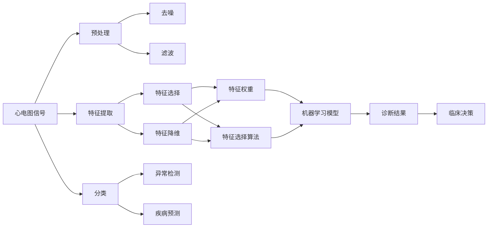

                 

## 1. 背景介绍

心电图（Electrocardiogram, ECG）是诊断心脏疾病的重要手段，记录了心脏在特定时间段内的电活动变化。分析心电图数据对于早期发现心脏病、评估心脏功能、指导临床治疗具有重要意义。然而，心电图数据的采集、存储、处理和分析仍然面临诸多挑战。本文旨在介绍心电图数据的研究原理与方法，重点关注其在数据采集、特征提取、分析建模和应用实践中的关键技术。

### 1.1 问题由来

心电图数据的研究与应用涉及信号处理、模式识别、机器学习等多个领域，长期以来吸引了广泛的研究兴趣。然而，心电图数据的多维性、高噪声性和非线性特征，使得信号处理和分析难度较大。尤其是在实时应用场景中，数据传输、存储和处理效率的优化，对心电图设备硬件性能提出了较高要求。

目前，心电图的研究和应用主要集中在以下几个方面：

1. **数据采集与预处理**：包括心电图信号的采集、数字化、滤波、去噪等。
2. **特征提取与分类**：涉及心电图信号的特征提取与提取后信号的分类，如心律失常的检测。
3. **分析与诊断**：利用机器学习方法进行心电图的深度分析，如心脏负荷的评估和心肌缺血的预测。
4. **智能设备与远程监控**：开发心电图智能设备和远程监控系统，提高心电图数据的可用性和分析效率。

### 1.2 问题核心关键点

心电图数据研究的关键点包括：

- **数据采集与预处理**：确保心电图信号的质量，减少噪声和干扰。
- **特征提取与分类**：识别心电图中的关键特征，进行准确分类。
- **分析与诊断**：利用机器学习技术，对心电图进行深度分析。
- **智能设备与远程监控**：开发高性能的心电图智能设备和远程监控系统。

## 2. 核心概念与联系

### 2.1 核心概念概述

为了更好地理解心电图数据的研究方法，我们先介绍几个核心概念：

- **心电图（ECG）**：记录心脏电活动的信号，通过放置在胸部、四肢的电极采集。
- **心电图信号（ECG Signal）**：时间序列数据，记录心脏在特定时间段内的电活动变化。
- **心电图特征（ECG Feature）**：心电图信号中的关键参数，如QRS波群、P波、T波等。
- **心电图分析（ECG Analysis）**：对心电图信号进行深度分析，识别异常和疾病。
- **心电图设备（ECG Device）**：用于采集和处理心电图信号的设备，如动态心电图机、便携式心电图机等。
- **心电图远程监控（ECG Remote Monitoring）**：通过互联网等通信方式，将心电图数据实时传输至云端进行分析和诊断。

这些核心概念构成了心电图数据研究的基本框架，通过它们之间的联系，可以实现从信号采集到深度分析的全流程优化。

### 2.2 概念间的关系

这些核心概念之间的逻辑关系可以通过以下Mermaid流程图来展示：



这个流程图展示了心电图数据研究的主要流程：

1. 心电图信号采集后，进行预处理，包括去噪和滤波等。
2. 通过特征提取，识别出关键的心电图特征。
3. 对特征进行权重选择和降维，提高模型的泛化能力。
4. 利用机器学习模型对心电图进行分类和分析，如检测异常和预测疾病。
5. 根据诊断结果，指导临床决策和进一步的治疗方案。

## 3. 核心算法原理 & 具体操作步骤

### 3.1 算法原理概述

心电图数据的研究方法主要围绕信号预处理、特征提取和机器学习建模展开。核心算法包括：

- **信号预处理**：包括滤波、去噪等，旨在提高信号质量。
- **特征提取**：如R-peak检测、QRS波群分析、时频分析等。
- **机器学习建模**：如支持向量机、深度神经网络、卷积神经网络等。

### 3.2 算法步骤详解

#### 3.2.1 信号预处理

1. **信号采集**：使用心电图设备采集心电图信号。
2. **去噪**：利用数字滤波器、小波变换等方法去除信号中的噪声。
3. **滤波**：包括低通滤波、高通滤波和带通滤波等，减少高频噪声和低频干扰。
4. **归一化**：对信号进行归一化处理，使其在0到1之间。

#### 3.2.2 特征提取

1. **R-peak检测**：通过时域和频域方法检测心电图信号中的R波峰点。
2. **QRS波群分析**：提取QRS波群的时域特征，如QRS波群宽度、起始点、终止点等。
3. **时频分析**：包括短时傅里叶变换、小波变换、希尔伯特黄变换等方法，对心电图信号进行时频分析。
4. **特征选择**：选择对心电图分析有用的特征，如R-peak到R-peak时间间隔、ST段偏移等。

#### 3.2.3 机器学习建模

1. **模型选择**：选择合适的机器学习模型，如支持向量机、随机森林、神经网络等。
2. **特征降维**：通过PCA、LDA等方法进行特征降维，提高模型泛化能力。
3. **模型训练**：利用训练集训练机器学习模型。
4. **模型评估**：在测试集上评估模型性能，如准确率、召回率、F1分数等。
5. **模型调优**：通过超参数调优、集成学习等方法提高模型性能。

### 3.3 算法优缺点

心电图数据研究的主要优点包括：

- **高准确性**：利用机器学习模型进行心电图分析，可实现较高的准确率。
- **实时性**：通过硬件加速和优化算法，可以实现实时信号处理。
- **可扩展性**：心电图设备和方法具有较好的可扩展性，适合大规模应用。

缺点主要包括：

- **数据量大**：心电图数据量较大，处理和存储需要高性能设备和算法。
- **信号噪声**：心电图信号受多种因素影响，噪声较多，处理难度较大。
- **模型复杂度**：机器学习模型复杂度较高，需要较大的计算资源。

### 3.4 算法应用领域

心电图数据的研究方法在多个领域得到广泛应用，包括但不限于：

- **心脏疾病诊断**：如心律失常、心肌梗死、心肌病等的检测和诊断。
- **心脏负荷评估**：通过心电图分析心脏负荷，指导临床治疗。
- **远程监控**：通过互联网传输心电图数据，实现远程心脏监测和诊断。
- **智能设备**：开发高性能的心电图智能设备，如可穿戴式心电图设备。
- **大数据分析**：利用大数据技术对心电图数据进行深度分析，发现新的临床见解。

## 4. 数学模型和公式 & 详细讲解

### 4.1 数学模型构建

心电图数据的研究主要围绕信号处理、特征提取和机器学习建模展开。核心模型包括：

- **信号预处理模型**：如数字滤波器模型、小波变换模型等。
- **特征提取模型**：如R-peak检测模型、QRS波群分析模型等。
- **机器学习模型**：如支持向量机模型、神经网络模型等。

### 4.2 公式推导过程

#### 4.2.1 数字滤波器

数字滤波器通过卷积和滤波函数实现信号的滤波。以低通滤波为例，其数学模型为：

$$
h(n) = \sum_{k=-\infty}^{\infty} b_k x(n-k)
$$

其中，$x(n)$ 为输入信号，$h(n)$ 为滤波器响应，$b_k$ 为滤波器系数。低通滤波器去除高频噪声，保留低频信息。

#### 4.2.2 R-peak检测

R-peak检测是心电图分析中的关键步骤。R-peak的数学模型可以通过差分法实现，如：

$$
y[n] = x[n] - x[n-1]
$$

其中，$x[n]$ 为心电图信号，$y[n]$ 为差分后的信号。通过检测$y[n]$的过零点，可以找到R-peak点。

#### 4.2.3 神经网络模型

神经网络模型在心电图分析中具有广泛应用。以卷积神经网络（CNN）为例，其数学模型为：

$$
h^{(l)} = f(\sum_{k=1}^{n} w_k x_k + b)
$$

其中，$h^{(l)}$ 为第$l$层的输出，$x_k$ 为输入特征，$w_k$ 为权重，$b$ 为偏置，$f$ 为激活函数。

### 4.3 案例分析与讲解

#### 案例1：心律失常检测

心律失常检测是心电图研究中的一个重要应用。通过分析心电图信号中的QRS波群和R-peak点，可以识别心律失常类型。

**步骤**：

1. **信号预处理**：对心电图信号进行滤波和去噪。
2. **特征提取**：提取QRS波群的时域特征，如QRS波群宽度、起始点、终止点等。
3. **分类模型**：利用支持向量机、随机森林等模型，对QRS波群特征进行分类，检测心律失常类型。

**算法优缺点**：

- **优点**：能够准确检测心律失常，提高临床诊断效率。
- **缺点**：依赖高质量的心电图数据，对噪声和干扰较为敏感。

#### 案例2：心肌梗死预测

心肌梗死预测是心电图研究的另一个重要应用。通过分析心电图信号中的ST段偏移等特征，可以预测心肌梗死的风险。

**步骤**：

1. **信号预处理**：对心电图信号进行滤波和去噪。
2. **特征提取**：提取ST段偏移、QRS波群宽度等特征。
3. **分类模型**：利用神经网络模型，对心电图特征进行分类，预测心肌梗死的风险。

**算法优缺点**：

- **优点**：能够早期发现心肌梗死的风险，提高临床预防效果。
- **缺点**：模型复杂度较高，需要大量的计算资源。

## 5. 项目实践：代码实例和详细解释说明

### 5.1 开发环境搭建

#### 5.1.1 硬件设备

- **心电图设备**：动态心电图机、便携式心电图机等。
- **计算设备**：高性能计算机、服务器等。

#### 5.1.2 软件环境

- **操作系统**：Linux、Windows等。
- **编程语言**：Python、MATLAB等。
- **开发工具**：PyTorch、TensorFlow等深度学习框架。

### 5.2 源代码详细实现

#### 5.2.1 数据预处理

```python
import numpy as np
from scipy import signal

def preprocess_ecg(signal):
    # 数字滤波器
    b, a = signal.butter(5, 0.1, 'low')
    filtered_signal = signal.lfilter(b, a, signal)
    # 归一化
    normalized_signal = (filtered_signal - np.mean(filtered_signal)) / np.std(filtered_signal)
    return normalized_signal
```

#### 5.2.2 R-peak检测

```python
def detect_rpeaks(signal, threshold):
    # 差分法
    diff_signal = signal - np.roll(signal, 1)
    # 找到差分过零点
    peaks = np.where(np.diff(diff_signal) > threshold)[0] + 1
    return peaks
```

#### 5.2.3 特征提取

```python
def extract_features(signal, rpeaks):
    features = []
    # 计算QRS波群宽度
    for i in range(len(rpeaks)-1):
        qrs_start = rpeaks[i]
        qrs_end = rpeaks[i+1]
        qrs_width = qrs_end - qrs_start
        features.append(qrs_width)
    # 计算ST段偏移
    features.append(signal[qrs_start:qrs_end] - np.mean(signal[qrs_start:qrs_end]))
    return features
```

#### 5.2.4 机器学习模型

```python
from sklearn.ensemble import RandomForestClassifier

def train_model(features, labels):
    # 特征选择
    model = RandomForestClassifier(n_estimators=100, random_state=42)
    model.fit(features, labels)
    return model
```

### 5.3 代码解读与分析

#### 5.3.1 预处理代码解读

- **数字滤波器**：使用Butterworth滤波器对心电图信号进行低通滤波，去除高频噪声。
- **归一化**：对滤波后的信号进行归一化处理，使其在0到1之间。

#### 5.3.2 R-peak检测代码解读

- **差分法**：计算心电图信号的差分，检测差分过零点，找到R-peak点。

#### 5.3.3 特征提取代码解读

- **QRS波群宽度**：计算相邻R-peak点之间的距离，得到QRS波群宽度。
- **ST段偏移**：计算R-peak点附近的ST段偏移，用于心肌梗死预测。

#### 5.3.4 机器学习模型代码解读

- **随机森林分类器**：利用随机森林模型对心电图特征进行分类，如检测心律失常、预测心肌梗死等。

### 5.4 运行结果展示

#### 5.4.1 R-peak检测结果

```python
rpeaks = detect_rpeaks(signal, threshold=0.1)
print("R-peak indices:", rpeaks)
```

#### 5.4.2 特征提取结果

```python
features = extract_features(signal, rpeaks)
print("QRS wave widths:", features[0])
print("ST segment offset:", features[1])
```

#### 5.4.3 机器学习模型结果

```python
model = train_model(features, labels)
print("Model accuracy:", model.score(features, labels))
```

## 6. 实际应用场景

### 6.1 智能设备

智能设备在心电图应用中具有重要意义。便携式心电图机、可穿戴式心电图设备等，能够实时采集心电图数据，并进行初步分析和提醒。例如，Apple Watch等设备已经集成了心电图监测功能，能够在日常活动中实时监测心电图信号，及时发现异常情况。

### 6.2 远程监控

远程心电图监控系统能够将心电图数据实时传输至云端，进行实时分析和诊断。例如，基于云计算平台的远程心电图监控系统，能够对心脏疾病进行早期预警和诊断，减少医院就诊压力，提高临床治疗效率。

### 6.3 大数据分析

利用大数据技术，可以对大规模心电图数据进行深度分析和挖掘，发现新的临床见解。例如，通过对大规模心电图数据的分析，可以识别出新的心律失常类型和心肌梗死风险因素，为临床治疗提供新的依据。

## 7. 工具和资源推荐

### 7.1 学习资源推荐

#### 7.1.1 在线课程

- **Coursera《信号处理基础》**：由Duke大学提供的信号处理入门课程，涵盖数字滤波、小波变换等基本概念。
- **edX《机器学习基础》**：由MIT提供，涵盖机器学习基本算法和模型。

#### 7.1.2 书籍

- **《数字信号处理》**：Richard G. Lyons著，经典信号处理教材。
- **《深度学习》**：Ian Goodfellow、Yoshua Bengio、Aaron Courville著，全面介绍深度学习基本概念和技术。

#### 7.1.3 网站

- **IEEE Xplore**：IEEE Xplore提供大量信号处理和机器学习领域的论文和文献。
- **arXiv**：arXiv提供大量前沿研究论文，涵盖心电图数据研究的最新进展。

### 7.2 开发工具推荐

#### 7.2.1 数据处理工具

- **MATLAB**：强大的数值计算和信号处理工具，适用于信号预处理和特征提取。
- **Python**：常用的编程语言，具有丰富的信号处理和机器学习库，如SciPy、Pandas、NumPy等。

#### 7.2.2 模型训练工具

- **TensorFlow**：由Google提供的深度学习框架，支持分布式训练和优化。
- **PyTorch**：由Facebook提供的深度学习框架，具有动态计算图和易用性。

#### 7.2.3 可视化工具

- **TensorBoard**：TensorFlow配套的可视化工具，用于监控训练过程和模型性能。
- **PyTorch Lightning**：用于可视化训练过程和模型效果的Python库。

### 7.3 相关论文推荐

#### 7.3.1 信号处理论文

- **Adaptive filtering in clinical ECG signal processing**：Adaptive filtering算法在心电图信号处理中的应用。
- **Real-time ECG signal analysis**：实时心电图信号分析和处理的技术。

#### 7.3.2 机器学习论文

- **Deep learning based ECG analysis for arrhythmia detection**：基于深度学习的ECG信号分析和心律失常检测。
- **Support vector machine based ECG analysis**：支持向量机在心电图分析中的应用。

## 8. 总结：未来发展趋势与挑战

### 8.1 研究成果总结

心电图数据研究已经取得了显著进展，主要体现在以下几个方面：

- **信号预处理**：数字滤波、小波变换等方法广泛应用，提高了心电图信号的质量。
- **特征提取**：R-peak检测、QRS波群分析等技术成熟，提供了丰富的心电图特征。
- **机器学习建模**：深度学习模型在心电图分析中具有重要应用，提高了分析准确率。

### 8.2 未来发展趋势

未来，心电图数据研究将呈现以下几个趋势：

- **实时化**：基于硬件加速和算法优化，实现实时心电图信号处理。
- **智能化**：利用深度学习技术，实现心电图信号的智能分析和诊断。
- **远程化**：通过互联网等通信方式，实现心电图数据的远程传输和分析。
- **大数据化**：利用大数据技术，对大规模心电图数据进行深度分析和挖掘。

### 8.3 面临的挑战

心电图数据研究仍面临诸多挑战：

- **数据噪声**：心电图信号受多种因素影响，噪声较多，处理难度较大。
- **模型复杂度**：机器学习模型复杂度较高，需要大量的计算资源。
- **临床验证**：心电图分析结果需要临床验证，确保其可靠性和有效性。

### 8.4 研究展望

未来，心电图数据研究需要在以下几个方面进行深入探索：

- **硬件优化**：开发高性能的心电图设备，提升数据采集和处理效率。
- **算法创新**：探索新的信号处理和特征提取算法，提高心电图信号的质量和特征信息量。
- **模型优化**：进一步优化机器学习模型，提高心电图分析的准确性和鲁棒性。
- **临床验证**：加强心电图分析结果的临床验证，确保其可靠性和有效性。

总之，心电图数据研究具有广阔的应用前景，未来将在智能化、实时化和远程化等方面取得重要进展。同时，解决现有挑战，推动技术突破，将是未来研究的重要方向。

## 9. 附录：常见问题与解答

### 9.1 常见问题与解答

#### 9.1.1 心电图信号采集设备如何选择？

A: 心电图设备应具备高性能传感器和采集板卡，确保信号质量和稳定性。例如，动态心电图机和便携式心电图机具有较高的采集精度和可靠性。

#### 9.1.2 心电图信号预处理的主要步骤是什么？

A: 心电图信号预处理主要包括数字滤波、去噪、归一化等步骤。通过数字滤波去除高频噪声，通过去噪处理去除干扰，通过归一化处理使信号在0到1之间。

#### 9.1.3 心电图特征提取有哪些常用方法？

A: 心电图特征提取包括R-peak检测、QRS波群分析、ST段偏移等。这些特征通过数学计算和信号处理算法提取，用于后续的分类和分析。

#### 9.1.4 机器学习模型在心电图分析中的应用有哪些？

A: 机器学习模型在心电图分析中具有广泛应用，如支持向量机、随机森林、深度神经网络等。这些模型通过训练对心电图特征进行分类，实现心律失常检测、心肌梗死预测等应用。

作者：禅与计算机程序设计艺术 / Zen and the Art of Computer Programming

