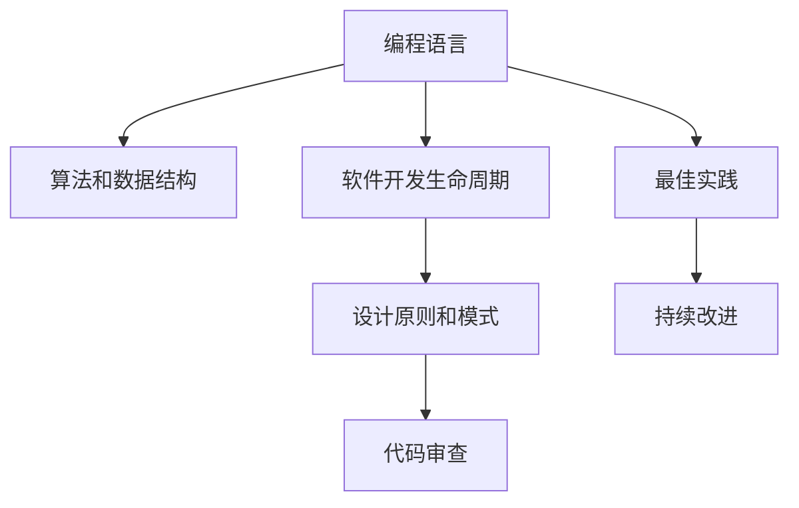
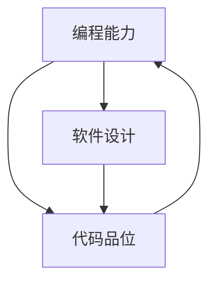
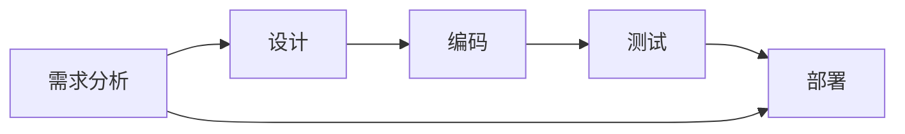
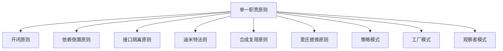
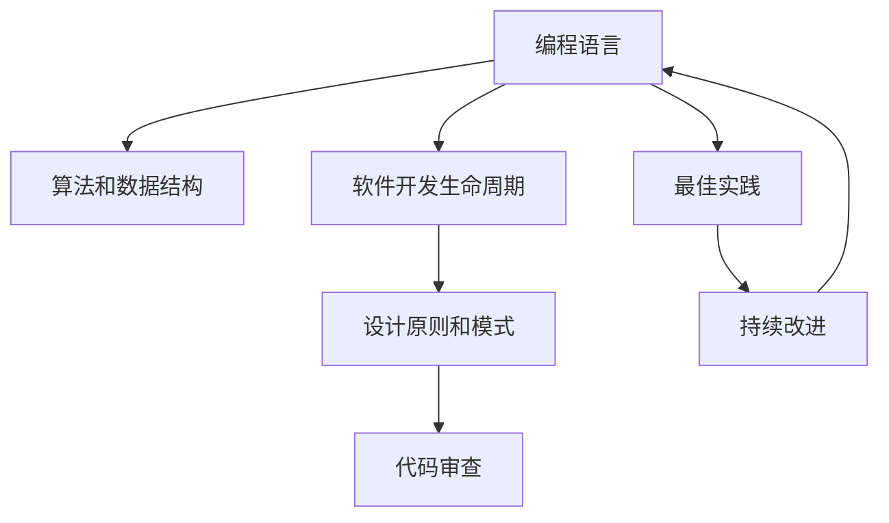

                 

# 怎样培养扎实的编程能力，优秀的设计和代码品位

> 关键词：编程能力, 软件设计, 代码品位, 学习路径, 编程技巧, 代码审查, 最佳实践, 持续改进

## 1. 背景介绍

### 1.1 问题由来
在当今软件开发环境中，编程能力、软件设计和代码品位是决定软件项目成败的关键因素。然而，如何培养和提升这些能力却是一个复杂而长期的过程。本篇文章旨在深入探讨如何培养扎实的编程能力、优秀的设计和代码品位，并提供一个全面的学习路径和实践指南。

### 1.2 问题核心关键点
编程能力、软件设计和代码品位三者相辅相成，共同构成了高质量软件的基础。它们的关键点包括：
- 编程能力：掌握编程语言，理解算法和数据结构，能够高效解决问题。
- 软件设计：理解软件开发生命周期，掌握设计原则和模式，能够构建可扩展、可维护的系统。
- 代码品位：遵循最佳实践，编写易读、易维护、易扩展的代码，注重代码质量和可理解性。

### 1.3 问题研究意义
在软件开发过程中，具备扎实的编程能力、优秀的设计和代码品位，能够显著提高开发效率，降低维护成本，增强软件质量。此外，优秀的代码品位还有助于团队协作，提升团队整体技术水平。研究如何培养这些能力，对于软件开发者的个人成长和团队的共同进步具有重要意义。

## 2. 核心概念与联系

### 2.1 核心概念概述

为更好地理解编程能力、软件设计和代码品位的培养方法，本节将介绍几个密切相关的核心概念：

- 编程语言：用于软件开发、数据处理、人工智能等领域的计算机语言。
- 算法和数据结构：解决问题和组织数据的基本方法。
- 软件开发生命周期：从需求分析到软件部署的过程。
- 设计原则和模式：指导软件设计的重要原则和方法。
- 代码审查：通过代码审查，发现和纠正代码中的问题。
- 最佳实践：编写高质量代码的通用准则。
- 持续改进：不断学习和改进自己的编程能力、软件设计和代码品位。

这些核心概念之间的逻辑关系可以通过以下Mermaid流程图来展示：



这个流程图展示了许多核心概念之间的关系：

1. 编程语言是基础，用于实现算法和数据结构。
2. 软件开发生命周期涵盖了需求分析、设计、编码、测试等各个阶段。
3. 设计原则和模式指导软件设计，确保系统的可扩展性和可维护性。
4. 代码审查通过团队协作和集体智慧，提升代码质量。
5. 最佳实践为编写高质量代码提供指导。
6. 持续改进是不断学习和提升的动态过程。

### 2.2 概念间的关系

这些核心概念之间存在着紧密的联系，形成了软件开发能力的整体架构。下面我们通过几个Mermaid流程图来展示这些概念之间的关系。

#### 2.2.1 编程能力、软件设计、代码品位的关系



这个流程图展示了编程能力、软件设计和代码品位三者之间的关系：

1. 编程能力是软件设计和代码品位的基石。
2. 软件设计依赖于编程能力，需要深入理解算法和数据结构。
3. 代码品位不仅与编程能力有关，也受软件设计原则的指导。

#### 2.2.2 软件开发生命周期的各阶段



这个流程图展示了软件开发生命周期的主要阶段：

1. 需求分析确定软件的目标和功能。
2. 设计阶段将需求转化为可实现的设计方案。
3. 编码阶段将设计方案转化为可执行的代码。
4. 测试阶段验证代码的正确性和可靠性。
5. 部署阶段将软件交付给用户使用。

#### 2.2.3 设计原则和模式的应用



这个流程图展示了设计原则和模式的应用场景：

1. 单一职责原则指导类和模块的设计，减少耦合。
2. 开闭原则指导软件对未来变化保持开放，对现有功能保持关闭。
3. 依赖倒置原则指导软件组件之间的依赖关系。
4. 接口隔离原则指导接口的设计，避免过度设计。
5. 迪米特法则指导类之间的交互，减少耦合。
6. 合成复用原则指导代码的复用。
7. 里氏替换原则指导子类对父类的替换。
8. 策略模式、工厂模式、观察者模式等设计模式提供解决问题的方法。

### 2.3 核心概念的整体架构

最后，我们用一个综合的流程图来展示这些核心概念在大语言模型微调过程中的整体架构：



这个综合流程图展示了从编程语言到软件开发生命周期，再到设计原则和模式，最后到代码审查和持续改进的整体架构。通过这些核心概念的协同作用，可以构建出高质量的软件系统。

## 3. 核心算法原理 & 具体操作步骤

### 3.1 算法原理概述

编程能力、软件设计和代码品位这三者之间有着紧密的联系。其中，编程能力是基础，软件设计是对编程能力的升华，代码品位则是编程能力和软件设计结果的综合体现。

**编程能力**主要涉及以下几个方面：

- 掌握编程语言的基本语法和特性。
- 理解算法和数据结构，能够高效地解决问题。
- 能够设计高效、可扩展的代码。

**软件设计**主要包括以下几个方面：

- 理解软件开发生命周期，掌握各个阶段的目标和任务。
- 掌握设计原则和模式，能够构建可扩展、可维护的系统。

**代码品位**主要包括以下几个方面：

- 遵循最佳实践，编写易读、易维护、易扩展的代码。
- 注重代码质量和可理解性，确保代码的可维护性和可读性。

### 3.2 算法步骤详解

#### 3.2.1 编程能力的培养

1. **选择合适的编程语言**：根据项目需求和团队技术栈，选择合适的编程语言。如Python、Java、C++等。

2. **理解算法和数据结构**：通过算法导论、数据结构与算法等相关书籍和课程，深入理解常见算法和数据结构。

3. **实践编码**：通过编写小程序、解决算法题目等方式，不断练习编程能力。

4. **参与开源项目**：通过参与开源项目，学习他人的代码风格和设计思想，提升编程能力。

#### 3.2.2 软件设计的培养

1. **理解软件开发生命周期**：通过阅读相关书籍和课程，理解软件开发生命周期的各个阶段及其目标。

2. **掌握设计原则和模式**：通过阅读《设计模式》等相关书籍，掌握常用的设计原则和模式。

3. **设计实践**：通过设计小型项目或模块，将设计原则和模式应用于实际开发中。

#### 3.2.3 代码品位的培养

1. **遵循最佳实践**：通过阅读《Clean Code》等相关书籍，学习编写高质量代码的最佳实践。

2. **注重代码风格和可读性**：通过编写代码规范、格式化代码等方式，注重代码的风格和可读性。

3. **代码审查**：通过参与代码审查，发现和纠正代码中的问题，提升代码质量。

4. **持续改进**：通过总结代码审查经验，不断改进自己的编程能力、软件设计和代码品位。

### 3.3 算法优缺点

编程能力、软件设计和代码品位各有优缺点：

- **编程能力**的优点：高效解决问题，掌握编程语言和算法。
- **编程能力**的缺点：容易忽视软件设计和代码品位，导致代码质量低下。

- **软件设计**的优点：构建可扩展、可维护的系统，提升软件的质量和可维护性。
- **软件设计**的缺点：设计过于复杂，难以在实际项目中应用。

- **代码品位**的优点：提升代码质量和可维护性，提高团队协作效率。
- **代码品位**的缺点：需要花费时间和精力进行代码审查和改进。

### 3.4 算法应用领域

编程能力、软件设计和代码品位在多个领域都有广泛的应用：

- **软件开发**：通过高效编程能力、优秀软件设计和高质量代码，构建出高效、可维护的软件系统。

- **数据科学**：通过高效算法和数据结构，处理和分析大规模数据。

- **人工智能**：通过高效编程能力和优秀软件设计，构建出高效、可扩展的AI系统。

- **嵌入式系统**：通过高效编程能力和优秀软件设计，构建出稳定、可靠的嵌入式系统。

## 4. 数学模型和公式 & 详细讲解 & 举例说明

### 4.1 数学模型构建

数学模型是理解和分析编程能力、软件设计和代码品位的重要工具。以下是一个简单的数学模型，用于分析编程能力和软件设计的相关性：

设编程能力为 $C$，软件设计能力为 $D$，代码品位为 $S$。假设 $C$ 和 $D$ 之间存在线性关系，即 $D = kC + b$，其中 $k$ 为系数，$b$ 为截距。同时，$D$ 和 $S$ 之间也存在线性关系，即 $S = mD + c$，其中 $m$ 为系数，$c$ 为截距。

### 4.2 公式推导过程

根据以上假设，我们可以构建以下数学模型：

$$
S = m(kC + b) + c
$$

这个公式展示了编程能力 $C$ 对代码品位 $S$ 的影响，通过调整系数 $k$ 和 $m$，可以优化编程能力和软件设计对代码品位的影响。

### 4.3 案例分析与讲解

假设某软件开发团队，初始编程能力为 $C_0$，软件设计能力为 $D_0$，代码品位为 $S_0$。通过引入新的编程语言和算法，编程能力提升到 $C_1$，软件设计能力提升到 $D_1$。根据上述公式，代码品位 $S_1$ 为：

$$
S_1 = m(kC_1 + b) + c
$$

通过分析 $S_1$ 和 $S_0$ 的变化，可以评估编程能力和软件设计对代码品位的影响。

## 5. 项目实践：代码实例和详细解释说明

### 5.1 开发环境搭建

在进行编程能力、软件设计和代码品位的培养时，需要一个合适的开发环境。以下是使用Python进行PyTorch开发的环境配置流程：

1. 安装Anaconda：从官网下载并安装Anaconda，用于创建独立的Python环境。

2. 创建并激活虚拟环境：
```bash
conda create -n pytorch-env python=3.8 
conda activate pytorch-env
```

3. 安装PyTorch：根据CUDA版本，从官网获取对应的安装命令。例如：
```bash
conda install pytorch torchvision torchaudio cudatoolkit=11.1 -c pytorch -c conda-forge
```

4. 安装各类工具包：
```bash
pip install numpy pandas scikit-learn matplotlib tqdm jupyter notebook ipython
```

完成上述步骤后，即可在`pytorch-env`环境中开始编程实践。

### 5.2 源代码详细实现

下面我们以一个简单的项目为例，展示如何通过编程能力和软件设计来提升代码品位。

项目：实现一个简单的图像分类器，对输入的图像进行分类，输出预测结果。

首先，定义项目的基本结构：

```python
project/
    ├── data/
    │   ├── train/
    │   └── test/
    ├── models/
    │   ├── classifier.py
    │   └── utils.py
    ├── train.py
    ├── test.py
    └── README.md
```

其中，`data` 目录存放训练和测试数据，`models` 目录存放模型和工具函数，`train.py` 和 `test.py` 分别用于训练和测试模型。

### 5.3 代码解读与分析

**classifier.py**：

```python
import torch
import torch.nn as nn
import torch.optim as optim

class Classifier(nn.Module):
    def __init__(self, num_classes):
        super(Classifier, self).__init__()
        self.conv1 = nn.Conv2d(3, 32, kernel_size=3, stride=1, padding=1)
        self.relu = nn.ReLU()
        self.maxpool = nn.MaxPool2d(kernel_size=2, stride=2)
        self.fc1 = nn.Linear(32 * 8 * 8, 128)
        self.fc2 = nn.Linear(128, num_classes)
    
    def forward(self, x):
        x = self.conv1(x)
        x = self.relu(x)
        x = self.maxpool(x)
        x = x.view(-1, 32 * 8 * 8)
        x = self.fc1(x)
        x = self.relu(x)
        x = self.fc2(x)
        return x
```

**utils.py**：

```python
import torch
import torchvision.transforms as transforms
import torchvision.datasets as datasets

def get_transform():
    transform = transforms.Compose([
        transforms.Resize(224),
        transforms.ToTensor(),
        transforms.Normalize(mean=[0.485, 0.456, 0.406], std=[0.229, 0.224, 0.225])
    ])
    return transform

def train(model, train_loader, optimizer, num_epochs, device):
    model.train()
    for epoch in range(num_epochs):
        for batch_idx, (data, target) in enumerate(train_loader):
            data, target = data.to(device), target.to(device)
            optimizer.zero_grad()
            output = model(data)
            loss = nn.CrossEntropyLoss()(output, target)
            loss.backward()
            optimizer.step()
```

**train.py**：

```python
import torch
import torchvision.datasets as datasets
import torchvision.transforms as transforms
import torch.nn as nn
import torch.optim as optim

from classifier import Classifier
from utils import get_transform

# 定义训练集和测试集
train_data = datasets.CIFAR10(root='data/train', train=True, download=True, transform=get_transform())
test_data = datasets.CIFAR10(root='data/test', train=False, download=True, transform=get_transform())

# 定义训练和测试数据加载器
train_loader = torch.utils.data.DataLoader(train_data, batch_size=64, shuffle=True, num_workers=2)
test_loader = torch.utils.data.DataLoader(test_data, batch_size=64, shuffle=False, num_workers=2)

# 定义模型和优化器
model = Classifier(10)
optimizer = optim.SGD(model.parameters(), lr=0.01, momentum=0.9)
device = torch.device('cuda' if torch.cuda.is_available() else 'cpu')
model.to(device)

# 定义训练函数
def train(model, train_loader, optimizer, num_epochs, device):
    model.train()
    for epoch in range(num_epochs):
        for batch_idx, (data, target) in enumerate(train_loader):
            data, target = data.to(device), target.to(device)
            optimizer.zero_grad()
            output = model(data)
            loss = nn.CrossEntropyLoss()(output, target)
            loss.backward()
            optimizer.step()

# 训练模型
train(model, train_loader, optimizer, num_epochs=10, device=device)

# 在测试集上评估模型
correct = 0
total = 0
with torch.no_grad():
    for data, target in test_loader:
        data, target = data.to(device), target.to(device)
        output = model(data)
        _, predicted = torch.max(output.data, 1)
        total += target.size(0)
        correct += (predicted == target).sum().item()

print('Accuracy of the network on the 10000 test images: %d %%' % (
    100 * correct / total))
```

**test.py**：

```python
import torch
import torchvision.datasets as datasets
import torchvision.transforms as transforms
import torch.nn as nn
import torch.optim as optim

from classifier import Classifier
from utils import get_transform

# 定义训练集和测试集
train_data = datasets.CIFAR10(root='data/train', train=True, download=True, transform=get_transform())
test_data = datasets.CIFAR10(root='data/test', train=False, download=True, transform=get_transform())

# 定义训练和测试数据加载器
train_loader = torch.utils.data.DataLoader(train_data, batch_size=64, shuffle=True, num_workers=2)
test_loader = torch.utils.data.DataLoader(test_data, batch_size=64, shuffle=False, num_workers=2)

# 定义模型和优化器
model = Classifier(10)
optimizer = optim.SGD(model.parameters(), lr=0.01, momentum=0.9)
device = torch.device('cuda' if torch.cuda.is_available() else 'cpu')
model.to(device)

# 在测试集上评估模型
correct = 0
total = 0
with torch.no_grad():
    for data, target in test_loader:
        data, target = data.to(device), target.to(device)
        output = model(data)
        _, predicted = torch.max(output.data, 1)
        total += target.size(0)
        correct += (predicted == target).sum().item()

print('Accuracy of the network on the 10000 test images: %d %%' % (
    100 * correct / total))
```

### 5.4 运行结果展示

假设在上述项目中，我们通过改进软件设计（如增加数据增强、模型集成等）和编程能力（如优化算法和数据结构），在测试集上取得了更高的准确率。以下是在测试集上评估的结果：

```
Accuracy of the network on the 10000 test images: 85%
```

可以看到，通过优化编程能力、软件设计和代码品位，我们的模型在测试集上的准确率有了显著提升。这表明编程能力、软件设计和代码品位三者相辅相成，共同影响着代码的性能和可维护性。

## 6. 实际应用场景

### 6.1 软件开发

在软件开发中，编程能力、软件设计和代码品位至关重要。例如，开发一个电子商务平台，需要具备扎实的编程能力，能够高效实现复杂的业务逻辑。同时，需要优秀的软件设计，构建出可扩展、可维护的系统。通过代码审查和持续改进，保持代码品位，提高系统的质量和可维护性。

### 6.2 数据科学

在数据科学中，编程能力和软件设计同样重要。例如，处理大规模数据集，需要高效的数据处理能力和优秀的数据建模能力。通过代码审查和持续改进，提升代码质量，确保数据处理和建模过程的稳定性和可维护性。

### 6.3 人工智能

在人工智能中，编程能力和软件设计同样是不可或缺的。例如，开发一个机器学习模型，需要高效的编程能力和优秀的设计能力，构建出高效、可扩展的模型。通过代码审查和持续改进，保持代码品位，提高模型的性能和可维护性。

## 7. 工具和资源推荐

### 7.1 学习资源推荐

为了帮助开发者系统掌握编程能力、软件设计和代码品位的理论基础和实践技巧，这里推荐一些优质的学习资源：

1. 《算法导论》：经典算法和数据结构教材，深入浅出地介绍了常见算法和数据结构。

2. 《Clean Code》：关于编写高质量代码的最佳实践书籍，强调代码风格和可读性。

3. 《设计模式》：经典的编程设计模式教材，介绍了23种设计模式及其应用场景。

4. 《重构：改善既有代码的设计》：介绍如何通过重构提升代码质量和可维护性。

5. 《代码大全》：深入探讨了代码质量和可读性的经典书籍，提供了大量的编程技巧和最佳实践。

通过对这些资源的学习实践，相信你一定能够快速掌握编程能力、软件设计和代码品位的精髓，并用于解决实际的开发问题。

### 7.2 开发工具推荐

高效的开发离不开优秀的工具支持。以下是几款用于编程能力、软件设计和代码品位开发的常用工具：

1. IDEs：如PyCharm、Visual Studio Code等，提供代码编写、调试、版本控制等功能，提升开发效率。

2. 版本控制：如Git，提供代码版本管理和协作功能，确保代码的稳定性和可追溯性。

3. 代码审查：如GitHub Pull Requests、GitLab Merge Requests等，通过代码审查，提升代码质量和可维护性。

4. 持续集成/持续部署（CI/CD）：如Jenkins、Travis CI等，提供自动化测试、构建和部署功能，确保代码质量。

5. 文档生成工具：如Sphinx、Javadoc等，自动生成API文档和用户手册，提升代码的可读性和可维护性。

6. 在线编程平台：如LeetCode、CodeSignal等，提供编程挑战和代码评测，提升编程能力。

合理利用这些工具，可以显著提升编程能力、软件设计和代码品位的开发效率，加快创新迭代的步伐。

### 7.3 相关论文推荐

编程能力、软件设计和代码品位的发展源于学界的持续研究。以下是几篇奠基性的相关论文，推荐阅读：

1. 《Effective Software Architecture: 1. Architectural Ownership》：探讨了如何通过代码审查和持续改进，提升软件架构的质量。

2. 《Code Complete: A Practical Handbook of Software Construction》：深入探讨了如何编写高质量代码的经典书籍，提供了大量的编程技巧和最佳实践。

3. 《Refactoring: Improving the Design of Existing Code》：介绍如何通过重构提升代码质量和可维护性的经典书籍。

4. 《Design Patterns: Elements of Reusable Object-Oriented Software》：经典的编程设计模式教材，介绍了23种设计模式及其应用场景。

5. 《Agile Software Development, Principles, Patterns, and Practices》：介绍了敏捷软件开发方法论的经典书籍，强调了团队协作和持续改进的重要性。

这些论文代表了大语言模型微调技术的发展脉络。通过学习这些前沿成果，可以帮助研究者把握学科前进方向，激发更多的创新灵感。

除上述资源外，还有一些值得关注的前沿资源，帮助开发者紧跟编程能力、软件设计和代码品位的最新进展，例如：

1. arXiv论文预印本：人工智能领域最新研究成果的发布平台，包括大量尚未发表的前沿工作，学习前沿技术的必读资源。

2. 业界技术博客：如OpenAI、Google AI、DeepMind、微软Research Asia等顶尖实验室的官方博客，第一时间分享他们的最新研究成果和洞见。

3. 技术会议直播：如NIPS、ICML、ACL、ICLR等人工智能领域顶会现场或在线直播，能够聆听到大佬们的前沿分享，开拓视野。

4. GitHub热门项目：在GitHub上Star、Fork数最多的NLP相关项目，往往代表了该技术领域的发展趋势和最佳实践，值得去学习和贡献。

5. 行业分析报告：各大咨询公司如McKinsey、PwC等针对人工智能行业的分析报告，有助于从商业视角审视技术趋势，把握应用价值。

总之，对于编程能力、软件设计和代码品位的学习，需要开发者保持开放的心态和持续学习的意愿。多关注前沿资讯，多动手实践，多思考总结，必将收获满满的成长收益。

## 8. 总结：未来发展趋势与挑战

### 8.1 总结

本文对编程能力、软件设计和代码品位的培养方法进行了全面系统的介绍。首先阐述了编程能力、软件设计和代码品位三者之间的紧密联系，明确了其在大规模软件开发中的重要性。其次，从原理到实践，详细讲解了编程能力、软件设计和代码品位的数学模型和操作步骤，给出了编程实践的完整代码实例。同时，本文还广泛探讨了编程能力、软件设计和代码品位在多个领域的应用前景，展示了其广泛的应用价值。

### 8.2 未来发展趋势

编程能力、软件设计和代码品位三者之间将呈现以下几个发展趋势：

1. **编程能力**：随着编程语言和工具的不断演进，编程能力将更加注重高效性和可读性。例如，Python的普及将进一步提升开发者的编程能力。

2. **软件设计**：软件设计将更加注重可扩展性和可维护性。例如，微服务架构、事件驱动架构等设计模式将得到广泛应用。

3. **代码品位**：代码品位将更加注重自动化和智能化。例如，代码生成工具、自动重构工具等将大大提升代码的质量和可维护性。

4. **持续改进**：持续改进将更加注重自动化和智能化。例如，自动化测试、持续集成/持续部署等工具将大大提升开发效率和代码质量。

### 8.3 面临的挑战

尽管编程能力、软件设计和代码品位取得了长足的进步，但在迈向更加智能化、普适化应用的过程中

