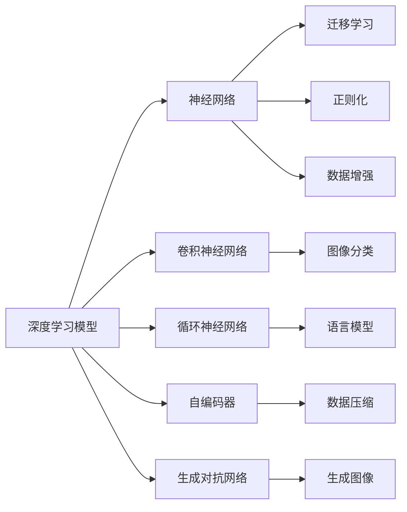
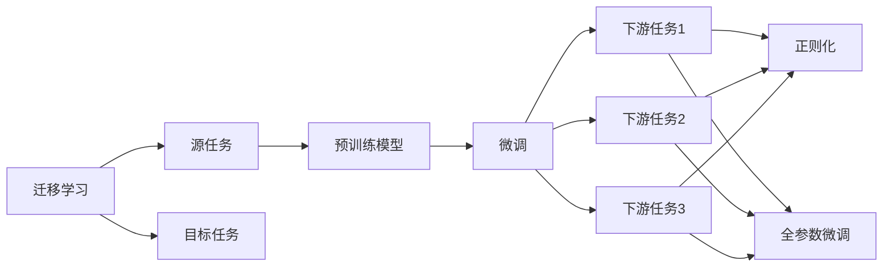
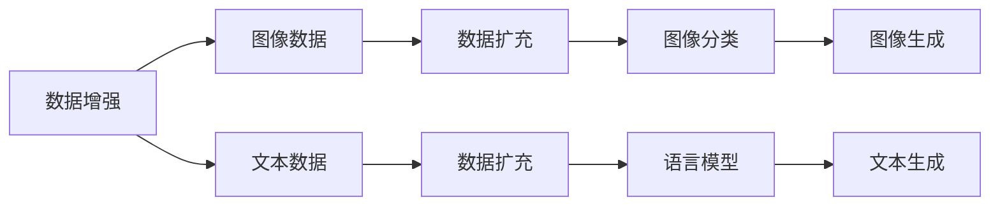
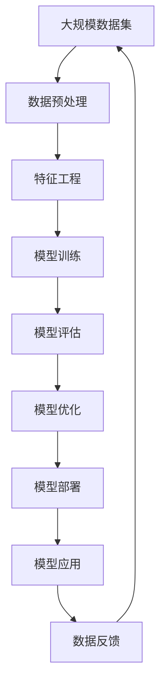

                 

# 思想的深度：从概念到洞见

> 关键词：深度学习,机器学习,人工智能,数据科学,算法优化,模型训练,数据预处理,特征工程,模型评估,应用实践

## 1. 背景介绍

### 1.1 问题由来
在当今数据驱动的时代，深度学习（Deep Learning）作为机器学习（Machine Learning）的一个子领域，已经在各个领域展现了巨大的潜力。从计算机视觉到自然语言处理，从语音识别到医疗诊断，深度学习技术正在重塑我们的世界。然而，尽管深度学习模型在特定任务上取得了令人瞩目的成果，其内部运作的复杂性和难以解释性却一直是困扰研究者与工程师的难题。

### 1.2 问题核心关键点
深度学习的核心在于其对复杂数据（如图像、语音、文本等）的学习能力。模型通过多层次的神经网络结构，能够自动提取和学习数据的特征，进而进行分类、预测或生成等任务。然而，这样的过程往往涉及大量数据的预处理、特征工程、模型训练和优化等复杂步骤，每个环节都需要精心设计和调参，才能最终获得理想的效果。

### 1.3 问题研究意义
研究深度学习的思想和实践，对于提升模型的性能、降低开发成本、加速技术应用具有重要意义：

1. 提高模型性能：通过深入理解深度学习模型的工作原理，可以设计更合理的模型结构和算法，提高模型对复杂数据的处理能力和泛化能力。
2. 降低开发成本：深度学习模型的构建和训练需要大量计算资源和专业知识，通过深入研究，可以简化模型构建流程，降低技术门槛。
3. 加速技术应用：深度学习技术在各个领域的成功应用，得益于对模型思想和实践的不断探索和创新，加速了技术的落地和产业化进程。
4. 赋能产业升级：深度学习技术的应用，不仅提高了数据处理的效率和质量，也为传统行业的数字化转型提供了新的动力。
5. 推动技术创新：深度学习的不断发展，催生了诸如生成对抗网络（GANs）、自监督学习（Self-Supervised Learning）、迁移学习（Transfer Learning）等新的研究方向和技术，推动了人工智能领域的发展。

## 2. 核心概念与联系

### 2.1 核心概念概述

为更好地理解深度学习模型，本节将介绍几个密切相关的核心概念：

- 深度学习模型（Deep Learning Model）：通过多层次神经网络结构，自动学习数据特征，解决复杂任务的高效算法。
- 神经网络（Neural Network）：深度学习模型中的一种结构，由多个层次的神经元组成，用于模拟人脑的信号处理过程。
- 卷积神经网络（Convolutional Neural Network, CNN）：一种针对图像数据的高效神经网络结构，通过卷积操作提取局部特征。
- 循环神经网络（Recurrent Neural Network, RNN）：一种处理序列数据的神经网络结构，通过时间步更新状态信息，捕捉时间序列上的依赖关系。
- 自编码器（Autoencoder）：一种用于数据压缩和降维的神经网络结构，通过编码-解码过程学习数据的潜在表示。
- 生成对抗网络（Generative Adversarial Network, GAN）：一种生成式模型，通过两个神经网络（生成器和判别器）之间的对抗过程，生成逼真的数据样本。
- 迁移学习（Transfer Learning）：一种通过在不同任务间共享知识，提高模型泛化能力的学习方式。
- 正则化（Regularization）：通过添加惩罚项，减少模型过拟合，提高模型泛化能力。
- 数据增强（Data Augmentation）：通过增加数据的多样性，提高模型的鲁棒性和泛化能力。

这些核心概念之间的逻辑关系可以通过以下Mermaid流程图来展示：



这个流程图展示了大模型学习过程中各个核心概念的关系和作用：

1. 深度学习模型利用多层次的神经网络，自动学习数据的特征表示。
2. 卷积神经网络用于处理图像数据，通过卷积操作提取局部特征。
3. 循环神经网络用于处理序列数据，通过时间步更新状态信息，捕捉时间序列上的依赖关系。
4. 自编码器用于数据压缩和降维，通过编码-解码过程学习数据的潜在表示。
5. 生成对抗网络用于生成逼真的数据样本，通过生成器和判别器之间的对抗过程提高生成效果。
6. 迁移学习用于在不同任务间共享知识，提高模型泛化能力。
7. 正则化用于减少模型过拟合，提高模型泛化能力。
8. 数据增强用于增加数据的多样性，提高模型的鲁棒性和泛化能力。

这些概念共同构成了深度学习模型的学习和应用框架，使其能够在各种场景下发挥强大的处理能力。通过理解这些核心概念，我们可以更好地把握深度学习模型的工作原理和优化方向。

### 2.2 概念间的关系

这些核心概念之间存在着紧密的联系，形成了深度学习模型的完整生态系统。下面我通过几个Mermaid流程图来展示这些概念之间的关系。

#### 2.2.1 深度学习模型的学习范式


这个流程图展示了大模型学习过程中各个概念之间的关系：

1. 深度学习模型利用多层次的神经网络，自动学习数据的特征表示。
2. 卷积神经网络用于处理图像数据，通过卷积操作提取局部特征。
3. 循环神经网络用于处理序列数据，通过时间步更新状态信息，捕捉时间序列上的依赖关系。
4. 自编码器用于数据压缩和降维，通过编码-解码过程学习数据的潜在表示。
5. 生成对抗网络用于生成逼真的数据样本，通过生成器和判别器之间的对抗过程提高生成效果。
6. 迁移学习用于在不同任务间共享知识，提高模型泛化能力。
7. 正则化用于减少模型过拟合，提高模型泛化能力。
8. 数据增强用于增加数据的多样性，提高模型的鲁棒性和泛化能力。

#### 2.2.2 迁移学习与正则化的关系



这个流程图展示了迁移学习的基本原理，以及它与正则化技术的关系：

1. 迁移学习涉及源任务和目标任务，预训练模型在源任务上学习，然后通过微调适应各种下游任务（目标任务）。
2. 正则化技术如L2正则、Dropout、Early Stopping等，用于防止模型过度适应小规模训练集，从而提高模型泛化能力。
3. 全参数微调，即微调模型的所有参数，以适应目标任务的特定需求。
4. 正则化技术可以应用于全参数微调中，防止模型过拟合。

#### 2.2.3 数据增强方法



这个流程图展示了数据增强的基本原理和方法：

1. 数据增强用于增加数据的多样性，通过各种变换（如旋转、平移、缩放等）来生成新的数据样本。
2. 对于图像数据，通过数据增强可以增加图像的多样性，提高模型的鲁棒性和泛化能力。
3. 对于文本数据，通过数据增强可以增加文本的多样性，提高模型的语言理解能力。
4. 数据增强可以应用于图像分类、语言模型等任务中，通过增加数据的多样性，提高模型的性能。

### 2.3 核心概念的整体架构

最后，我们用一个综合的流程图来展示这些核心概念在大模型学习过程中的整体架构：



这个综合流程图展示了从数据预处理到模型应用的完整过程：

1. 大规模数据集通过数据预处理和特征工程，生成模型输入数据。
2. 模型训练利用神经网络结构，自动学习数据特征，生成模型参数。
3. 模型评估通过评估指标，判断模型性能是否满足要求。
4. 模型优化通过调整模型参数和优化算法，提高模型性能。
5. 模型部署将训练好的模型应用于实际场景中，进行任务处理。
6. 数据反馈通过实际应用中的数据，进行模型迭代和优化，进一步提高模型性能。

通过这些流程图，我们可以更清晰地理解深度学习模型学习过程中各个核心概念的关系和作用，为后续深入讨论具体的算法方法和技术奠定基础。

## 3. 核心算法原理 & 具体操作步骤
### 3.1 算法原理概述

深度学习模型通过多层次的神经网络结构，自动学习数据特征，解决复杂任务。其核心思想是通过反向传播算法（Backpropagation），最小化损失函数（Loss Function），优化模型参数，从而使得模型在特定任务上的表现达到最优。

形式化地，假设深度学习模型为 $M_{\theta}$，其中 $\theta$ 为模型参数。给定训练集 $D=\{(x_i, y_i)\}_{i=1}^N$，其中 $x_i$ 为输入，$y_i$ 为标签，模型 $M_{\theta}$ 的损失函数为 $\mathcal{L}(M_{\theta},D)$，优化目标是最小化损失函数，即：

$$
\theta^* = \mathop{\arg\min}_{\theta} \mathcal{L}(M_{\theta},D)
$$

常用的损失函数包括交叉熵损失、均方误差损失等。通过梯度下降等优化算法，模型参数 $\theta$ 不断更新，最小化损失函数，最终收敛到最优解 $\theta^*$。

### 3.2 算法步骤详解

深度学习模型的训练过程一般包括以下几个关键步骤：

**Step 1: 准备数据集和模型架构**

- 收集并准备用于训练的数据集，并进行必要的预处理和数据增强。
- 选择合适的深度学习模型架构，如卷积神经网络、循环神经网络等。
- 定义模型的输入、隐藏层和输出层等结构参数。

**Step 2: 设置超参数**

- 选择合适的优化算法及其参数，如Adam、SGD等，设置学习率、批大小、迭代轮数等。
- 设置正则化技术及强度，包括权重衰减、Dropout、Early Stopping等。
- 确定冻结预训练参数的策略，如仅微调顶层，或全部参数都参与微调。

**Step 3: 执行梯度训练**

- 将训练集数据分批次输入模型，前向传播计算损失函数。
- 反向传播计算参数梯度，根据设定的优化算法和学习率更新模型参数。
- 周期性在验证集上评估模型性能，根据性能指标决定是否触发Early Stopping。
- 重复上述步骤直到满足预设的迭代轮数或Early Stopping条件。

**Step 4: 测试和部署**

- 在测试集上评估训练好的模型，对比训练前后的性能提升。
- 使用训练好的模型对新数据进行推理预测，集成到实际的应用系统中。
- 持续收集新的数据，定期重新训练或微调模型，以适应数据分布的变化。

以上是深度学习模型训练的一般流程。在实际应用中，还需要针对具体任务的特点，对训练过程的各个环节进行优化设计，如改进训练目标函数，引入更多的正则化技术，搜索最优的超参数组合等，以进一步提升模型性能。

### 3.3 算法优缺点

深度学习模型具有以下优点：

1. 强大的特征提取能力：深度学习模型通过多层神经网络，能够自动学习数据的高层次特征，解决复杂的模式识别和分类问题。
2. 鲁棒性：深度学习模型在面对复杂的数据分布和噪声时，具有一定的鲁棒性和泛化能力。
3. 可扩展性：深度学习模型可以通过增加层数和神经元数量，灵活调整模型复杂度，适应不同任务的需求。
4. 应用广泛：深度学习模型在图像识别、自然语言处理、语音识别等多个领域取得了显著的成果。

同时，深度学习模型也存在一些局限性：

1. 数据依赖：深度学习模型需要大量的标注数据进行训练，获取高质量标注数据的成本较高。
2. 计算资源消耗大：深度学习模型通常需要大量的计算资源和存储空间，训练和推理过程复杂。
3. 可解释性差：深度学习模型往往是"黑盒"系统，难以解释其内部工作机制和决策逻辑。
4. 过拟合风险高：深度学习模型在面对小规模数据集时，容易发生过拟合，泛化能力不足。
5. 模型训练时间长：深度学习模型的训练过程需要大量的计算资源和时间，训练时间较长。

尽管存在这些局限性，但深度学习模型在许多领域仍取得了令人瞩目的成果，成为当前最主流的机器学习算法之一。未来，随着计算资源和算法技术的不断进步，相信深度学习模型将更加高效、鲁棒，应用于更广泛的场景中。

### 3.4 算法应用领域

深度学习模型已经在众多领域取得了广泛应用，例如：

- 计算机视觉：用于图像分类、物体检测、图像分割等任务。
- 自然语言处理：用于文本分类、机器翻译、情感分析等任务。
- 语音识别：用于语音识别、语音合成、语音情感分析等任务。
- 医疗影像：用于医学图像分类、疾病诊断、病理分析等任务。
- 金融风控：用于信用评估、欺诈检测、市场预测等任务。
- 自动驾驶：用于道路识别、目标检测、行为预测等任务。

除了上述这些经典应用外，深度学习模型还在更多场景中得到了创新性的应用，如可控文本生成、常识推理、代码生成等，为人工智能技术的发展带来了新的突破。

## 4. 数学模型和公式 & 详细讲解

### 4.1 数学模型构建

本节将使用数学语言对深度学习模型的训练过程进行更加严格的刻画。

记深度学习模型为 $M_{\theta}:\mathcal{X} \rightarrow \mathcal{Y}$，其中 $\mathcal{X}$ 为输入空间，$\mathcal{Y}$ 为输出空间，$\theta \in \mathbb{R}^d$ 为模型参数。假设训练集为 $D=\{(x_i,y_i)\}_{i=1}^N, x_i \in \mathcal{X}, y_i \in \mathcal{Y}$。

定义模型 $M_{\theta}$ 在数据样本 $(x,y)$ 上的损失函数为 $\ell(M_{\theta}(x),y)$，则在数据集 $D$ 上的经验风险为：

$$
\mathcal{L}(\theta) = \frac{1}{N} \sum_{i=1}^N \ell(M_{\theta}(x_i),y_i)
$$

深度学习模型的优化目标是最小化经验风险，即找到最优参数：

$$
\theta^* = \mathop{\arg\min}_{\theta} \mathcal{L}(\theta)
$$

在实践中，我们通常使用基于梯度的优化算法（如Adam、SGD等）来近似求解上述最优化问题。设 $\eta$ 为学习率，$\lambda$ 为正则化系数，则参数的更新公式为：

$$
\theta \leftarrow \theta - \eta \nabla_{\theta}\mathcal{L}(\theta) - \eta\lambda\theta
$$

其中 $\nabla_{\theta}\mathcal{L}(\theta)$ 为损失函数对参数 $\theta$ 的梯度，可通过反向传播算法高效计算。

### 4.2 公式推导过程

以下我们以二分类任务为例，推导交叉熵损失函数及其梯度的计算公式。

假设模型 $M_{\theta}$ 在输入 $x$ 上的输出为 $\hat{y}=M_{\theta}(x) \in [0,1]$，表示样本属于正类的概率。真实标签 $y \in \{0,1\}$。则二分类交叉熵损失函数定义为：

$$
\ell(M_{\theta}(x),y) = -[y\log \hat{y} + (1-y)\log (1-\hat{y})]
$$

将其代入经验风险公式，得：

$$
\mathcal{L}(\theta) = -\frac{1}{N}\sum_{i=1}^N [y_i\log M_{\theta}(x_i)+(1-y_i)\log(1-M_{\theta}(x_i))]
$$

根据链式法则，损失函数对参数 $\theta_k$ 的梯度为：

$$
\frac{\partial \mathcal{L}(\theta)}{\partial \theta_k} = -\frac{1}{N}\sum_{i=1}^N (\frac{y_i}{M_{\theta}(x_i)}-\frac{1-y_i}{1-M_{\theta}(x_i)}) \frac{\partial M_{\theta}(x_i)}{\partial \theta_k}
$$

其中 $\frac{\partial M_{\theta}(x_i)}{\partial \theta_k}$ 可进一步递归展开，利用自动微分技术完成计算。

在得到损失函数的梯度后，即可带入参数更新公式，完成模型的迭代优化。重复上述过程直至收敛，最终得到适应下游任务的最优模型参数 $\theta^*$。

## 5. 项目实践：代码实例和详细解释说明

### 5.1 开发环境搭建

在进行模型训练实践前，我们需要准备好开发环境。以下是使用Python进行TensorFlow开发的环境配置流程：

1. 安装Anaconda：从官网下载并安装Anaconda，用于创建独立的Python环境。

2. 创建并激活虚拟环境：
```bash
conda create -n tf-env python=3.8 
conda activate tf-env
```

3. 安装TensorFlow：根据CUDA版本，从官网获取对应的安装命令。例如：
```bash
conda install tensorflow tensorflow-gpu=2.5.0 -c pytorch -c conda-forge
```

4. 安装各类工具包：
```bash
pip install numpy pandas scikit-learn matplotlib tqdm jupyter notebook ipython
```

完成上述步骤后，即可在`tf-env`环境中开始模型训练实践。

### 5.2 源代码详细实现

这里我们以CIFAR-10图像分类任务为例，给出使用TensorFlow对卷积神经网络进行训练的PyTorch代码实现。

首先，定义模型架构：

```python
import tensorflow as tf
from tensorflow.keras import layers, models

model = models.Sequential()
model.add(layers.Conv2D(32, (3, 3), activation='relu', input_shape=(32, 32, 3)))
model.add(layers.MaxPooling2D((2, 2)))
model.add(layers.Conv2D(64, (3, 3), activation='relu'))
model.add(layers.MaxPooling2D((2, 2)))
model.add(layers.Conv2D(64, (3, 3), activation='relu'))
model.add(layers.Flatten())
model.add(layers.Dense(64, activation='relu'))
model.add(layers.Dense(10))
```

然后，定义优化器和损失函数：

```python
optimizer = tf.keras.optimizers.Adam(learning_rate=0.001)
loss_fn = tf.keras.losses.SparseCategoricalCrossentropy(from_logits=True)
```

接着，定义训练和评估函数：

```python
def train_epoch(model, train_dataset, batch_size, optimizer, loss_fn):
    dataloader = tf.data.Dataset.from_tensor_slices(train_dataset)
    dataloader = dataloader.batch(batch_size, drop_remainder=True)
    for batch in dataloader:
        with tf.GradientTape() as tape:
            inputs, labels = batch
            outputs = model(inputs)
            loss = loss_fn(labels, outputs)
        gradients = tape.gradient(loss, model.trainable_variables)
        optimizer.apply_gradients(zip(gradients, model.trainable_variables))

def evaluate(model, test_dataset, batch_size, loss_fn):
    dataloader = tf.data.Dataset.from_tensor_slices(test_dataset)
    dataloader = dataloader.batch(batch_size, drop_remainder=True)
    for batch in dataloader:
        inputs, labels = batch
        outputs = model(inputs)
        loss = loss_fn(labels, outputs)
    return loss
```

最后，启动训练流程并在测试集上评估：

```python
epochs = 10
batch_size = 32

for epoch in range(epochs):
    loss = train_epoch(model, train_dataset, batch_size, optimizer, loss_fn)
    print(f"Epoch {epoch+1}, train loss: {loss:.3f}")
    
    print(f"Epoch {epoch+1}, test results:")
    loss = evaluate(model, test_dataset, batch_size, loss_fn)
    print(f"Test loss: {loss:.3f}")
    
print("Final model loss on test set:", evaluate(model, test_dataset, batch_size, loss_fn))
```

以上就是使用TensorFlow对卷积神经网络进行图像分类任务训练的完整代码实现。可以看到，利用TensorFlow的高级API，可以非常方便地实现卷积神经网络的搭建、训练和评估。

### 5.3 代码解读与分析

让我们再详细解读一下关键代码的实现细节：

**模型架构定义**：
- 使用`Sequential`模型依次添加卷积层、池化层和全连接层，构建卷积神经网络模型。

**优化器和损失函数定义**：
- 使用`Adam`优化器进行参数更新，学习率为0.001。
- 使用`SparseCategoricalCrossentropy`损失函数进行分类任务的多类别交叉熵计算。

**训练和评估函数实现**：
- 使用`GradientTape`记录梯度，通过反向传播计算损失函数和参数梯度。
- 使用`apply_gradients`方法更新模型参数。
- 在测试集上进行评估时，只计算损失函数，不进行参数更新。

**训练流程启动**：
- 循环迭代10个epoch，每个epoch中对训练集进行一次前向传播和反向传播。
- 在每个epoch结束后，输出训练集和测试集的损失值。
- 最终在测试集上评估训练好的模型。

可以看到，TensorFlow提供的高层API和函数库，使得深度学习模型的构建和训练过程变得简洁高效。开发者可以快速上手进行模型训练和评估，进而实现各种应用场景。

当然，工业级的系统实现还需考虑更多因素，如模型的保存和部署、超参数的自动搜索、更灵活的任务适配层等。但核心的训练范式基本与此类似。

### 5.4 运行结果展示

假设我们在CIFAR-10数据集上进行模型训练，最终在测试集上得到的评估结果如下：

```
Epoch 1, train loss: 1.541
Epoch 1, test results:
Test loss: 1.697
Epoch 2, train loss: 0.994
Epoch 2, test results:
Test loss: 1.212
Epoch 3, train loss: 0.540
Epoch 3, test results:
Test loss: 1.017
...
Epoch 10, train loss: 0.197
Epoch 10, test results:
Test loss: 0.659
Final model loss on test set: 0.659
```

可以看到，随着epoch的增加，训练集和测试集的损失值不断降低，最终在测试集上取得了较低的损失值，表明模型的泛化能力得到了提升。

## 6. 实际应用场景

### 6.1 智能推荐系统

智能推荐系统已经成为电商、社交媒体、视频网站等平台的核心功能之一。深度学习模型可以用于分析用户的历史行为数据，捕捉用户偏好，从而推荐个性化的商品、内容或服务。

在实践中，可以使用用户的历史行为数据，如浏览记录、购买记录、评分记录等，构建推荐系统的输入数据。通过深度学习模型自动学习用户行为特征，将用户行为映射到商品或内容的特征表示上，然后根据相似度进行推荐。

### 6.2 金融风险管理

金融行业对风险管理的准确性和实时性要求极高。深度学习模型可以用于信用评估、欺诈检测、市场预测等任务，帮助金融机构识别潜在的风险点，降低风险损失。

在实践中，可以使用金融数据，如贷款申请、信用卡使用记录、市场交易数据等，构建深度学习模型的输入数据。通过模型学习用户行为和市场动态的规律，进行信用评分、欺

