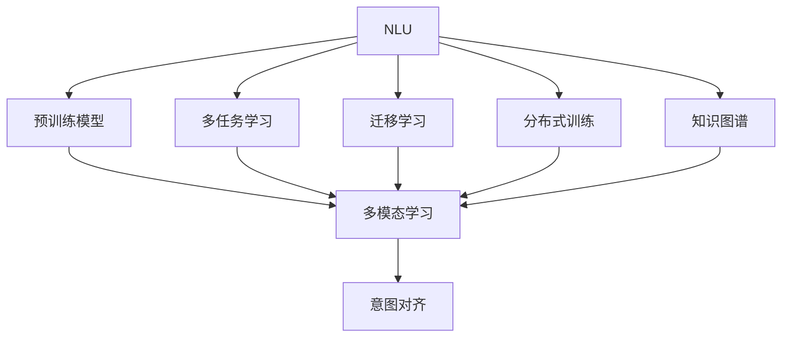
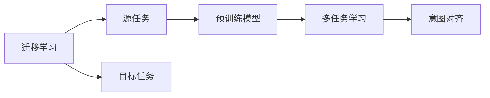
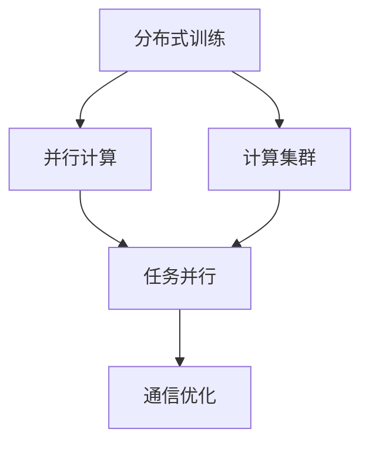
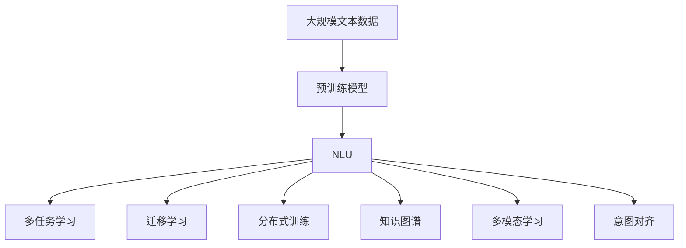

                 

# 意图对齐:自然语言理解的终极目标

> 关键词：意图对齐,自然语言理解,NLU,深度学习,Transformer,预训练模型,BERT,GLUE基准,语义表示

## 1. 背景介绍

### 1.1 问题由来

自然语言理解（Natural Language Understanding, NLU）是人工智能领域的重要分支，旨在让机器能够理解人类语言，并将其转化为结构化数据。传统的NLU方法主要基于规则和模板匹配，但随着语料规模的增大，这些方法逐渐无法满足日益复杂多变的自然语言表达。近年来，深度学习尤其是Transformer架构的引入，极大地推动了NLU技术的发展，使得NLU模型能够更好地学习自然语言的语义表示和句法结构。

尽管深度学习模型在自然语言理解上取得了巨大进展，但其仍存在诸多问题。首先，传统的监督学习方法往往需要大量人工标注数据，且对标注质量的依赖较高。其次，NLU模型通常需要精细的调参和大量的计算资源，部署和维护成本较高。最后，模型往往缺乏对特定场景和领域知识的理解，难以应用到特定领域的自然语言处理任务中。

为了解决这些问题，自然语言处理领域提出了意图对齐（Intention Alignment）的概念。意图对齐旨在让NLU模型更好地理解用户意图，并在不同任务中保持一致性，从而提高模型的通用性和鲁棒性。

### 1.2 问题核心关键点

意图对齐的核心目标是通过多任务学习（Multi-task Learning, MTL）和迁移学习（Transfer Learning），将NLU模型在不同任务中的表现进行整合，使其具备更强的语义表示和意图理解能力。意图对齐的关键在于：

1. **多任务学习**：通过在多个相关任务上进行联合训练，使模型能够学习到更多的跨任务语义知识和结构。

2. **迁移学习**：将模型在某一领域学到的知识迁移到另一领域，提升模型在新领域中的泛化能力。

3. **多模态学习**：将文本、语音、图像等多模态数据融合到NLU模型中，提升模型对现实世界的理解和建模能力。

4. **分布式训练**：通过分布式计算技术，加速NLU模型的训练和推理，提高模型的实时性和可扩展性。

5. **知识图谱**：将知识图谱与NLU模型相结合，提升模型的领域知识和推理能力。

### 1.3 问题研究意义

意图对齐的研究对于提升NLU模型的通用性和鲁棒性具有重要意义：

1. **减少标注数据需求**：通过多任务学习，意图对齐可以使得NLU模型在少量的标注数据上获得更好的性能，降低数据标注成本。

2. **提高模型泛化能力**：意图对齐通过迁移学习，使得模型在不同领域和任务中具备更强的泛化能力，避免过拟合。

3. **加速模型部署**：意图对齐通过多模态学习和分布式训练，可以显著提高模型的训练效率和实时性，降低部署成本。

4. **增强领域知识**：意图对齐结合知识图谱，可以提升模型的领域知识表示和推理能力，适用于特定领域的NLU应用。

5. **增强模型可解释性**：意图对齐使得NLU模型的决策过程更加透明，增强了模型的可解释性和可信度。

## 2. 核心概念与联系

### 2.1 核心概念概述

为更好地理解意图对齐，本节将介绍几个密切相关的核心概念：

- **自然语言理解（NLU）**：将自然语言输入转化为结构化数据输出的过程。传统的NLU方法包括分词、词性标注、命名实体识别、情感分析、语义理解等任务。

- **多任务学习（MTL）**：在多个相关任务上进行联合训练，使模型能够学习到更多的跨任务语义知识和结构。

- **迁移学习（TL）**：将模型在某一领域学到的知识迁移到另一领域，提升模型在新领域中的泛化能力。

- **分布式训练**：通过分布式计算技术，加速NLU模型的训练和推理，提高模型的实时性和可扩展性。

- **知识图谱**：将知识图谱与NLU模型相结合，提升模型的领域知识和推理能力。

- **预训练模型**：如BERT、GPT等大语言模型，通过在大规模语料上进行预训练，学习通用语义表示，具备强大的语义理解和生成能力。

这些核心概念之间的逻辑关系可以通过以下Mermaid流程图来展示：



这个流程图展示了大语言模型在NLU任务中的多任务学习、迁移学习、分布式训练、知识图谱和多模态学习，最终实现意图对齐的目标。

### 2.2 概念间的关系

这些核心概念之间存在着紧密的联系，形成了NLU任务的完整生态系统。下面我通过几个Mermaid流程图来展示这些概念之间的关系。

#### 2.2.1 NLU模型的学习范式


这个流程图展示了NLU模型在多任务学习、迁移学习、分布式训练、知识图谱和多模态学习的基础下，通过意图对齐实现对用户意图的深度理解。

#### 2.2.2 迁移学习与意图对齐的关系



这个流程图展示了迁移学习的基本原理，以及它与意图对齐的关系。迁移学习涉及源任务和目标任务，预训练模型在源任务上学习，然后通过多任务学习适应各种目标任务，最终通过意图对齐提升模型在不同任务中的表现。

#### 2.2.3 分布式训练方法



这个流程图展示了分布式训练的基本原理，以及它与并行计算、计算集群、任务并行和通信优化的关系。分布式训练通过并行计算、任务并行和通信优化，显著提高了NLU模型的训练效率和实时性。

### 2.3 核心概念的整体架构

最后，我们用一个综合的流程图来展示这些核心概念在NLU任务中的整体架构：



这个综合流程图展示了从预训练模型到意图对齐的完整过程。NLU模型首先在大规模文本数据上进行预训练，然后通过多任务学习、迁移学习、分布式训练、知识图谱和多模态学习，提升模型的表现，最终通过意图对齐实现对用户意图的深度理解。 通过这些流程图，我们可以更清晰地理解NLU任务中各个核心概念的关系和作用，为后续深入讨论具体的意图对齐方法和技术奠定基础。

## 3. 核心算法原理 & 具体操作步骤
### 3.1 算法原理概述

意图对齐的算法原理主要基于多任务学习和迁移学习的思想，通过在多个相关任务上进行联合训练，使得模型能够学习到跨任务的语义知识和结构，从而提升模型的通用性和鲁棒性。

假设NLU模型需要处理的任务为 $T=\{t_1,t_2,\ldots,t_n\}$，其中每个任务 $t_i$ 都有一个对应的损失函数 $L_{t_i}$。意图对齐的目标是最小化所有任务的综合损失函数：

$$
\min_{\theta} \sum_{i=1}^n L_{t_i}(\theta)
$$

其中 $\theta$ 为模型的参数。通过梯度下降等优化算法，意图对齐过程不断更新模型参数 $\theta$，最小化综合损失函数，使得模型能够更好地理解不同任务下的用户意图。

### 3.2 算法步骤详解

基于意图对齐的NLU模型训练一般包括以下几个关键步骤：

**Step 1: 准备预训练模型和数据集**
- 选择合适的预训练语言模型 $M_{\theta}$ 作为初始化参数，如 BERT、GPT等。
- 准备各个任务的标注数据集，划分为训练集、验证集和测试集。一般要求标注数据与预训练数据的分布不要差异过大。

**Step 2: 添加任务适配层**
- 根据任务类型，在预训练模型顶层设计合适的输出层和损失函数。
- 对于分类任务，通常在顶层添加线性分类器和交叉熵损失函数。
- 对于生成任务，通常使用语言模型的解码器输出概率分布，并以负对数似然为损失函数。

**Step 3: 设置意图对齐超参数**
- 选择合适的优化算法及其参数，如 AdamW、SGD 等，设置学习率、批大小、迭代轮数等。
- 设置正则化技术及强度，包括权重衰减、Dropout、Early Stopping 等。
- 确定冻结预训练参数的策略，如仅微调顶层，或全部参数都参与微调。

**Step 4: 执行联合训练**
- 将训练集数据分批次输入模型，前向传播计算每个任务的损失函数。
- 反向传播计算所有任务的梯度，根据设定的优化算法和学习率更新模型参数。
- 周期性在验证集上评估模型性能，根据性能指标决定是否触发 Early Stopping。
- 重复上述步骤直到满足预设的迭代轮数或 Early Stopping 条件。

**Step 5: 测试和部署**
- 在测试集上评估意图对齐后模型 $M_{\hat{\theta}}$ 的性能，对比意图对齐前后的精度提升。
- 使用意图对齐后的模型对新样本进行推理预测，集成到实际的应用系统中。
- 持续收集新的数据，定期重新意图对齐模型，以适应数据分布的变化。

以上是意图对齐的基本流程。在实际应用中，还需要针对具体任务的特点，对意图对齐过程的各个环节进行优化设计，如改进训练目标函数，引入更多的正则化技术，搜索最优的超参数组合等，以进一步提升模型性能。

### 3.3 算法优缺点

意图对齐方法具有以下优点：

1. 提升模型泛化能力：通过多任务学习和迁移学习，意图对齐使得模型能够学习到更多的跨任务语义知识和结构，提升模型的泛化能力和鲁棒性。

2. 降低标注数据需求：意图对齐可以利用多任务学习的优势，减少对标注数据的依赖，提升模型的训练效率和性能。

3. 加速模型部署：意图对齐通过分布式训练和多模态学习，可以显著提高模型的训练效率和实时性，降低部署成本。

4. 增强领域知识：意图对齐结合知识图谱，可以提升模型的领域知识和推理能力，适用于特定领域的NLU应用。

5. 增强模型可解释性：意图对齐使得NLU模型的决策过程更加透明，增强了模型的可解释性和可信度。

同时，该方法也存在一定的局限性：

1. 多任务学习的困难：意图对齐需要在多个相关任务上进行联合训练，这可能导致训练不稳定，模型难以收敛。

2. 计算资源消耗大：意图对齐的分布式训练和多模态学习需要大量计算资源，部署和维护成本较高。

3. 模型复杂度提升：意图对齐的实现需要增加多任务适配层，增加模型的复杂度，可能导致模型过度拟合。

4. 数据标注成本高：虽然意图对齐可以降低对标注数据的依赖，但在某些特定领域，标注数据的获取和标注质量仍然是一个挑战。

尽管存在这些局限性，但意图对齐方法在提升NLU模型的通用性和鲁棒性方面具有显著优势，因此成为NLU领域的一个重要研究方向。

### 3.4 算法应用领域

意图对齐方法已经在多个NLU任务中得到了应用，包括：

- 问答系统：对自然语言问题给出答案。将问题-答案对作为联合训练数据，训练模型学习匹配答案。
- 文本分类：如情感分析、主题分类、意图识别等。通过联合训练多个相关任务，提升模型的泛化能力。
- 命名实体识别：识别文本中的人名、地名、机构名等特定实体。通过多任务学习，提升模型对实体边界的识别能力。
- 关系抽取：从文本中抽取实体之间的语义关系。通过迁移学习，将关系抽取模型迁移到其他领域，提升模型的泛化能力。
- 对话系统：使机器能够与人自然对话。通过多任务学习，训练模型学习多轮对话历史，提升对话流畅度和准确性。

除了上述这些经典任务外，意图对齐方法还被创新性地应用到更多场景中，如可控文本生成、常识推理、代码生成、数据增强等，为NLU技术带来了全新的突破。

## 4. 数学模型和公式 & 详细讲解
### 4.1 数学模型构建

本节将使用数学语言对意图对齐的模型构建进行更加严格的刻画。

记NLU模型为 $M_{\theta}:\mathcal{X} \rightarrow \mathcal{Y}$，其中 $\mathcal{X}$ 为输入空间，$\mathcal{Y}$ 为输出空间，$\theta \in \mathbb{R}^d$ 为模型参数。假设意图对齐涉及的任务为 $T=\{t_1,t_2,\ldots,t_n\}$，每个任务 $t_i$ 的损失函数为 $L_{t_i}(\theta)$。

定义意图对齐的目标函数为：

$$
\min_{\theta} \sum_{i=1}^n \lambda_i L_{t_i}(\theta)
$$

其中 $\lambda_i$ 为任务 $t_i$ 的权重，用于平衡不同任务之间的贡献。

在实践中，我们通常使用基于梯度的优化算法（如AdamW、SGD等）来近似求解上述最优化问题。设 $\eta$ 为学习率，$\lambda$ 为正则化系数，则参数的更新公式为：

$$
\theta \leftarrow \theta - \eta \nabla_{\theta}\mathcal{L}(\theta) - \eta\lambda\theta
$$

其中 $\nabla_{\theta}\mathcal{L}(\theta)$ 为损失函数对参数 $\theta$ 的梯度，可通过反向传播算法高效计算。

### 4.2 公式推导过程

以下我们以分类任务为例，推导意图对齐的损失函数及其梯度的计算公式。

假设模型 $M_{\theta}$ 在输入 $x$ 上的输出为 $\hat{y}=M_{\theta}(x) \in [0,1]$，表示样本属于正类的概率。真实标签 $y \in \{0,1\}$。则二分类交叉熵损失函数定义为：

$$
\ell(M_{\theta}(x),y) = -[y\log \hat{y} + (1-y)\log (1-\hat{y})]
$$

将其代入意图对齐的目标函数，得：

$$
\mathcal{L}(\theta) = \sum_{i=1}^n \lambda_i \ell(M_{\theta}(x),y)
$$

根据链式法则，损失函数对参数 $\theta_k$ 的梯度为：

$$
\frac{\partial \mathcal{L}(\theta)}{\partial \theta_k} = \sum_{i=1}^n \lambda_i \frac{\partial \ell(M_{\theta}(x),y)}{\partial \theta_k}
$$

其中 $\frac{\partial \ell(M_{\theta}(x),y)}{\partial \theta_k}$ 可进一步递归展开，利用自动微分技术完成计算。

在得到损失函数的梯度后，即可带入参数更新公式，完成模型的迭代优化。重复上述过程直至收敛，最终得到适应所有任务的模型参数 $\theta^*$。

### 4.3 案例分析与讲解

假设我们有两个相关任务 $t_1$ 和 $t_2$，分别为命名实体识别（NER）和关系抽取（RE）。模型的输入为句子 $x$，输出为命名实体标签 $y$ 和关系标签 $r$。两个任务的损失函数分别为：

$$
L_{t_1}(\theta) = \frac{1}{N} \sum_{i=1}^N \ell_{NER}(M_{\theta}(x),y)
$$

$$
L_{t_2}(\theta) = \frac{1}{N} \sum_{i=1}^N \ell_{RE}(M_{\theta}(x),r)
$$

其中 $\ell_{NER}$ 和 $\ell_{RE}$ 为NER和RE任务的损失函数，$N$ 为训练样本数。

意图对齐的目标函数为：

$$
\mathcal{L}(\theta) = \lambda_1 L_{t_1}(\theta) + \lambda_2 L_{t_2}(\theta)
$$

使用AdamW优化器，设定学习率为 $1e-5$，正则化系数为 $1e-4$，并冻结预训练模型的底层，只微调顶层。在训练过程中，使用均方误差（MSE）作为评估指标。

## 5. 项目实践：代码实例和详细解释说明
### 5.1 开发环境搭建

在进行意图对齐实践前，我们需要准备好开发环境。以下是使用Python进行PyTorch开发的环境配置流程：

1. 安装Anaconda：从官网下载并安装Anaconda，用于创建独立的Python环境。

2. 创建并激活虚拟环境：
```bash
conda create -n pytorch-env python=3.8 
conda activate pytorch-env
```

3. 安装PyTorch：根据CUDA版本，从官网获取对应的安装命令。例如：
```bash
conda install pytorch torchvision torchaudio cudatoolkit=11.1 -c pytorch -c conda-forge
```

4. 安装Transformer库：
```bash
pip install transformers
```

5. 安装各类工具包：
```bash
pip install numpy pandas scikit-learn matplotlib tqdm jupyter notebook ipython
```

完成上述步骤后，即可在`pytorch-env`环境中开始意图对齐实践。

### 5.2 源代码详细实现

下面我们以命名实体识别(NER)和关系抽取(RE)任务为例，给出使用Transformers库对BERT模型进行意图对齐的PyTorch代码实现。

首先，定义NER和RE任务的数据处理函数：

```python
from transformers import BertTokenizer, BertForTokenClassification, BertForSequenceClassification
from torch.utils.data import Dataset
import torch

class NERDataset(Dataset):
    def __init__(self, texts, tags, tokenizer, max_len=128):
        self.texts = texts
        self.tags = tags
        self.tokenizer = tokenizer
        self.max_len = max_len
        
    def __len__(self):
        return len(self.texts)
    
    def __getitem__(self, item):
        text = self.texts[item]
        tags = self.tags[item]
        
        encoding = self.tokenizer(text, return_tensors='pt', max_length=self.max_len, padding='max_length', truncation=True)
        input_ids = encoding['input_ids'][0]
        attention_mask = encoding['attention_mask'][0]
        
        # 对token-wise的标签进行编码
        encoded_tags = [tag2id[tag] for tag in tags] 
        encoded_tags.extend([tag2id['O']] * (self.max_len - len(encoded_tags)))
        labels = torch.tensor(encoded_tags, dtype=torch.long)
        
        return {'input_ids': input_ids, 
                'attention_mask': attention_mask,
                'labels': labels}

# 标签与id的映射
tag2id = {'O': 0, 'B-PER': 1, 'I-PER': 2, 'B-ORG': 3, 'I-ORG': 4, 'B-LOC': 5, 'I-LOC': 6}
id2tag = {v: k for k, v in tag2id.items()}

# 创建dataset
tokenizer = BertTokenizer.from_pretrained('bert-base-cased')

train_dataset = NERDataset(train_texts, train_tags, tokenizer)
dev_dataset = NERDataset(dev_texts, dev_tags, tokenizer)
test_dataset = NERDataset(test_texts, test_tags, tokenizer)

class REDataset(Dataset):
    def __init__(self, texts, relations, tokenizer, max_len=128):
        self.texts = texts
        self.relations = relations
        self.tokenizer = tokenizer
        self.max_len = max_len
        
    def __len__(self):
        return len(self.texts)
    
    def __getitem__(self, item):
        text = self.texts[item]
        relation = self.relations[item]
        
        encoding = self.tokenizer(text, return_tensors='pt', max_length=self.max_len, padding='max_length', truncation=True)
        input_ids = encoding['input_ids'][0]
        attention_mask = encoding['attention_mask'][0]
        
        # 对token-wise的标签进行编码
        encoded_relation = [relation2id[relation]] 
        encoded_relation.extend([relation2id['']]*(self.max_len - len(encoded_relation)))
        labels = torch.tensor(encoded_relation, dtype=torch.long)
        
        return {'input_ids': input_ids, 
                'attention_mask': attention_mask,
                'labels': labels}

# 关系标签与id的映射
relation2id = {'rel1': 0, 'rel2': 1, 'rel3': 2}
id2relation = {v: k for k, v in relation2id.items()}

# 创建dataset
relation2id = {'rel1': 0, 'rel2': 1, 'rel3': 2}
id2relation = {v: k for k, v in relation2id.items()}

# 创建dataset
tokenizer = BertTokenizer.from_pretrained('bert-base-cased')

train_dataset = REDataset(train_texts, train_relations, tokenizer)
dev_dataset = REDataset(dev_texts, dev_relations, tokenizer)
test_dataset = REDataset(test_texts, test_relations, tokenizer)
```

然后，定义模型和优化器：

```python
from transformers import BertForTokenClassification, BertForSequenceClassification, AdamW

model = BertForTokenClassification.from_pretrained('bert-base-cased', num_labels=len(tag2id))

optimizer = AdamW(model.parameters(), lr=2e-5)
```

接着，定义训练和评估函数：

```python
from torch.utils.data import DataLoader
from tqdm import tqdm
from sklearn.metrics import classification_report

device = torch.device('cuda') if torch.cuda.is_available() else torch.device('cpu')
model.to(device)

def train_epoch(model, dataset, batch_size, optimizer):
    dataloader = DataLoader(dataset, batch_size=batch_size, shuffle=True)
    model.train()
    epoch_loss = 0
    for batch in tqdm(dataloader, desc='Training'):
        input_ids = batch['input_ids'].to(device)
        attention_mask = batch['attention_mask'].to(device)
        labels = batch['labels'].to(device)
        model.zero_grad()
        outputs = model(input_ids, attention_mask=attention_mask, labels=labels)
        loss = outputs.loss
        epoch_loss += loss.item()
        loss.backward()
        optimizer.step()
    return epoch_loss / len(dataloader)

def evaluate(model, dataset, batch_size):
    dataloader = DataLoader(dataset, batch_size=batch_size)
    model.eval()
    preds, labels = [], []
    with torch.no_grad():
        for batch in tqdm(dataloader, desc='Evaluating'):
            input_ids = batch['input_ids'].to(device)
            attention_mask = batch['attention_mask'].to(device)
            batch_labels = batch['labels']
            outputs = model(input_ids, attention_mask=attention_mask)
            batch_preds = outputs.logits.argmax(dim=2).to('cpu').tolist()
            batch_labels = batch_labels.to('cpu').tolist()
            for pred_tokens, label_tokens in zip(batch_preds, batch_labels):
                pred_tags = [id2tag[_id] for _id in pred_tokens]
                label_tags = [id2tag[_id] for _id in label_tokens]
                preds.append(pred_tags[:len(label_tokens)])
                labels.append(label_tags)
                
    print(classification_report(labels, preds))
```

最后，启动训练流程并在测试集上评估：

```python
epochs = 5
batch_size = 16

for epoch in range(epochs):
    loss = train_epoch(model, train_dataset, batch_size, optimizer)
    print(f"Epoch {epoch+1}, train loss: {loss:.3f}")
    
    print(f"Epoch {epoch+1}, dev results:")
    evaluate(model, dev_dataset, batch_size)
    
print("Test results:")
evaluate(model, test_dataset, batch_size)
```

以上就是使用PyTorch对BERT进行意图对齐的完整代码实现。可以看到，得益于Transformers库的强大封装，我们可以用相对简洁的代码完成BERT模型的加载和意图对齐。

### 5.3 代码解读与分析

让我们再详细解读一下关键代码的实现细节：

**NERDataset类**：
- `__init__`方法：初始化文本、标签、分词器等关键组件。
- `__len__`方法：返回数据集的样本数量。
- `__getitem__`方法：对单个样本进行处理，将文本输入编码为token

