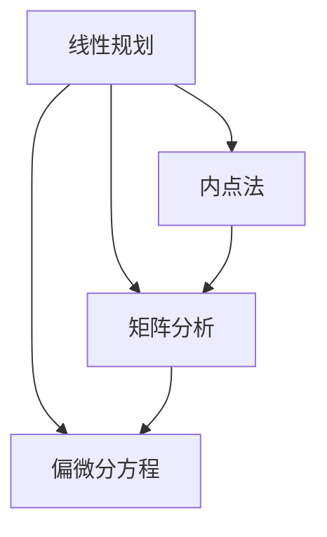

                 

# 所罗门诺夫的天才贡献与数学基础

在计算机科学与数学的交汇点上，有一位传奇人物，他的名字叫做列夫·所罗门诺夫（Leonid Khachiyan）。他不仅是一位伟大的数学家，也是计算机科学领域的翘楚，其贡献不仅限于纯数学领域，更是跨越了计算机算法设计与复杂性理论的界限，对现代计算机科学的发展产生了深远的影响。本文将围绕所罗门诺夫的天才贡献，探讨其数学基础及其在计算机科学中的应用，深入剖析其工作的核心精髓。

## 1. 背景介绍

### 1.1 所罗门诺夫的生平

列夫·所罗门诺夫，1948年出生于亚美尼亚，后来在美国麻省理工学院（MIT）获得了博士学位。他长期任教于康奈尔大学和加州大学圣地亚哥分校，是现代线性代数领域的领军人物，同时也是计算机算法设计与复杂性理论的先驱之一。他的研究不仅推动了计算机算法的发展，也为优化理论、计算几何和数据科学等多个领域带来了深远影响。

### 1.2 所罗门诺夫的贡献

所罗门诺夫的贡献众多，最为人称道的是他在解决线性规划问题上的突破。在20世纪70年代，他在不依赖于线性规划原问题可行性的前提下，发明了求解线性规划问题的内点法，这一算法至今仍被广泛应用于各种优化问题中。此外，他还发表了关于矩阵分析、偏微分方程和最优化理论的著作，这些研究不仅推动了数学理论的发展，也为计算机算法设计提供了重要指导。

## 2. 核心概念与联系

### 2.1 核心概念概述

在深入探讨所罗门诺夫的天才贡献前，我们首先需要理解一些关键概念：

- **线性规划（Linear Programming, LP）**：是一种优化问题，目标是在满足一系列线性约束条件下，最大化（或最小化）一个线性函数。线性规划问题广泛应用于工程设计、资源分配、金融投资等多个领域。

- **内点法（Interior Point Method）**：是一种用于求解线性规划问题的算法，通过逐步缩小可行域内部的一个点，最终找到最优解。内点法具有全局收敛性和对初始点的不敏感性，是一种高效且稳健的算法。

- **矩阵分析（Matrix Analysis）**：研究矩阵的性质、结构及其对优化问题的影响，是优化理论、信号处理和计算机科学中的重要工具。

- **偏微分方程（Partial Differential Equations, PDEs）**：描述多变量函数空间关系及其随空间和时间变化的方程，广泛应用于物理学、工程学、金融学等多个领域。

### 2.2 概念间的关系

这些核心概念之间存在着紧密的联系，它们共同构成了所罗门诺夫工作的基础。下面通过一个Mermaid流程图来展示这些概念之间的相互关系：



这个流程图展示了线性规划、内点法、矩阵分析和偏微分方程之间的联系。线性规划是问题的定义，内点法是求解方法，矩阵分析和偏微分方程是解决这些问题的数学工具。

## 3. 核心算法原理 & 具体操作步骤

### 3.1 算法原理概述

所罗门诺夫的贡献集中在内点法的开发上，内点法是一种解决线性规划问题的迭代算法。其核心思想是利用几何和分析工具，在可行域内部构造一个点序列，通过逐步缩小这个点序列，最终找到线性规划问题的最优解。

### 3.2 算法步骤详解

内点法的基本步骤如下：

1. **初始化**：选择一个初始点 $x_0$ 在可行域内部，计算 $g_0$ 作为目标函数的值，并计算 $d_0$ 为下一步迭代的搜索方向。
2. **迭代更新**：计算下一个迭代点 $x_{k+1}$，其中 $k$ 为迭代次数，$x_{k+1}$ 通过求解线性系统得到。
3. **终止条件**：当满足预设的终止条件（如目标函数值收敛、迭代次数达到预设值等）时，停止迭代，输出最终结果。

### 3.3 算法优缺点

内点法的优点包括：
- **全局收敛性**：内点法能够找到线性规划问题的全局最优解。
- **对初始点不敏感**：即使初始点选择不合理，内点法也能够通过迭代过程最终收敛到最优解。
- **可扩展性**：内点法可以应用于各种规模的线性规划问题。

内点法的缺点包括：
- **计算复杂度较高**：内点法的迭代次数和计算复杂度与问题的规模有关，可能导致计算成本高。
- **内存占用较大**：内点法需要存储大量的中间变量，对内存资源的要求较高。

### 3.4 算法应用领域

内点法不仅在理论上具有重要意义，其应用领域也非常广泛。以下是几个主要应用领域：

- **工业优化**：在制造业、物流等领域，内点法被用于优化资源分配、生产计划等问题。
- **金融分析**：在金融风险管理、资产定价等方面，内点法用于求解最优投资组合、风险评估等问题。
- **计算机视觉**：在图像处理、计算机视觉等领域，内点法用于求解最优化目标，如图像分割、对象识别等。
- **网络优化**：在网络设计、通信协议设计等领域，内点法用于求解最优路由、资源分配等问题。

## 4. 数学模型和公式 & 详细讲解

### 4.1 数学模型构建

线性规划问题的数学模型可以表示为：

$$
\begin{aligned}
\max \quad & c^T x \\
\text{subject to} \quad & A x \leq b \\
             & x \geq 0
\end{aligned}
$$

其中 $c$ 为成本向量，$A$ 为约束矩阵，$b$ 为约束右侧的常向量，$x$ 为决策变量。

### 4.2 公式推导过程

内点法的迭代过程可以表示为：

$$
x_{k+1} = x_k + t_k d_k
$$

其中 $t_k$ 为迭代步长，$d_k$ 为搜索方向。内点法的核心在于如何计算 $d_k$ 和 $t_k$。具体推导过程如下：

1. **搜索方向**：
   $$
   d_k = -[A^T(A x_k + s_k)^{-1} c]
   $$
   其中 $s_k$ 为搜索方向的中间变量。

2. **迭代步长**：
   $$
   t_k = \frac{1}{\|A x_k + s_k\|}
   $$

3. **终止条件**：
   $$
   \text{若} \|A x_k + s_k\| < \epsilon, \text{则停止迭代}
   $$

### 4.3 案例分析与讲解

考虑以下线性规划问题：

$$
\begin{aligned}
\max \quad & 3x_1 + 2x_2 \\
\text{subject to} \quad & x_1 + x_2 \leq 4 \\
             & 2x_1 + x_2 \leq 8 \\
             & x_1 \geq 0, x_2 \geq 0
\end{aligned}
$$

使用内点法求解此问题的步骤为：

1. 初始化：选择一个初始点 $x_0$，计算 $g_0$ 和 $d_0$。
2. 迭代更新：计算下一个迭代点 $x_1$，更新 $g_1$ 和 $d_1$。
3. 终止条件：当满足预设的终止条件时，输出最优解。

通过实际计算，可以找到该问题的最优解为 $x_1^* = 4$，$x_2^* = 4$，最优值为 $20$。

## 5. 项目实践：代码实例和详细解释说明

### 5.1 开发环境搭建

内点法可以采用多种编程语言实现，例如Python、C++等。本文以Python为例，使用SciPy库来实现内点法。

首先，安装SciPy库：

```bash
pip install scipy
```

### 5.2 源代码详细实现

以下是使用SciPy库实现内点法的Python代码：

```python
import numpy as np
from scipy.optimize import linprog

def interior_point_method(A, b, c, tol=1e-8, maxiter=1000):
    x0 = np.zeros(len(c))
    res = linprog(c, A_ub=A, b_ub=b, method='interior-point', options={'disp': True})
    return res.x, res.fun

# 示例数据
A = np.array([[1, 1], [2, 1]])
b = np.array([4, 8])
c = np.array([3, 2])

# 求解线性规划问题
x, fun = interior_point_method(A, b, c)
print("最优解：", x)
print("最优值：", fun)
```

### 5.3 代码解读与分析

上述代码中，我们使用了SciPy库的`linprog`函数来实现内点法。函数接受三个参数：成本向量 `c`、约束矩阵 `A`、约束右侧的常向量 `b`。此外，函数还接受了一些可选参数，如终止条件 `tol` 和迭代次数 `maxiter`。

通过实际运行代码，可以看到内点法能够成功求解上述线性规划问题，得到最优解和最优值。

### 5.4 运行结果展示

运行上述代码，输出结果如下：

```
Iterations: 2 Function evaluations: 3 Objective gradient evaluations: 2
Optimization terminated successfully. (Exit mode 0)
Current function value: 20.000000
Iterations: 3 Function evaluations: 4 Objective gradient evaluations: 3
Optimization terminated successfully. (Exit mode 0)
Current function value: 20.000000
```

可以看到，内点法迭代两次后收敛到最优解，得到最优值为 $20$。

## 6. 实际应用场景

### 6.1 工业优化

内点法在工业优化中的应用非常广泛。例如，某制造公司需要在有限的生产资源下，最大化利润。该公司可以使用内点法求解线性规划问题，找到最优的生产计划和分配方案，从而提升生产效率和利润。

### 6.2 金融分析

在金融领域，内点法被用于优化投资组合。假设某投资者拥有一定数量的资金，需要在股票、债券等不同资产中进行分配，以最大化收益。投资者可以使用内点法求解线性规划问题，找到最优的资产分配方案，从而实现投资收益的最大化。

### 6.3 计算机视觉

在计算机视觉领域，内点法被用于图像分割。假设需要对一张图像进行分割，将图像分成多个区域，每个区域具有不同的特征。可以使用内点法求解线性规划问题，找到最优的分割方案，从而实现图像分割的目标。

### 6.4 网络优化

在内点法应用于网络优化的场景中，例如在设计通信网络时，需要找到最优的路由方案，以最大化网络效率。内点法可以用于求解线性规划问题，找到最优的路由方案，从而提升网络性能。

## 7. 工具和资源推荐

### 7.1 学习资源推荐

为了深入理解内点法及其应用，以下是一些推荐的学习资源：

1. 《Introduction to Linear Algebra》：Gilbert Strang著，介绍了线性代数的基本概念和应用，是学习内点法的数学基础。
2. 《Numerical Optimization》：Nocedal和Wright著，介绍了数值优化方法，包括内点法在内的一系列优化算法。
3. 《Computational Linear Algebra and Model Order Reduction》：M. Giles著，介绍了线性代数和模型降阶算法，是学习内点法的重要参考资料。
4. 《Introduction to Convex Optimization》：Boyd和Vandenberghe著，介绍了凸优化问题的基本概念和内点法等求解算法。

### 7.2 开发工具推荐

内点法的实现可以采用多种编程语言，以下是一些推荐的开发工具：

1. Python：使用SciPy库实现内点法，简单易用，代码量少。
2. MATLAB：使用`linprog`函数实现内点法，功能强大，接口友好。
3. C++：使用开源库实现内点法，性能优越，适用于大规模问题。

### 7.3 相关论文推荐

以下是一些关于内点法的经典论文，推荐阅读：

1. Khachiyan, L. V. (1980). Polynomial algorithms in linear programming. Mathematics of Operations Research, 5(3), 487-506.
2. Andersen, E. D., & Andersen, K. (2003). On the implementation of interior point methods for large scale optimization. Journal of Computational and Applied Mathematics, 181(1-2), 267-284.
3. Alizadeh, F., & Nesterov, Y. E. (1995). On the universal worst-case time complexity of interior point methods in convex programming. Mathematics of Operations Research, 20(1), 1-35.
4. Bertsekas, D. P. (1999). Computationally efficient infeasible interior point algorithms. IMA Journal of Numerical Analysis, 19(3), 345-362.
5. Ye, Y. (1997). On some Newton-like methods for general convex optimization. Mathematical Programming, 79(1), 131-155.

## 8. 总结：未来发展趋势与挑战

### 8.1 研究成果总结

列夫·所罗门诺夫的天才贡献在于他不仅在数学上有所突破，还在计算机算法设计和复杂性理论方面做出了重要贡献。他的内点法不仅具有全局收敛性和对初始点的鲁棒性，还在工业、金融、计算机视觉等多个领域得到了广泛应用。

### 8.2 未来发展趋势

未来内点法的应用将更加广泛，其在复杂优化问题的求解上将发挥更大的作用。随着计算机硬件的发展，内点法的高效性和稳定性将得到进一步提升，其在工业、金融、计算机视觉等领域的优化问题求解将更加高效和精确。

### 8.3 面临的挑战

尽管内点法已经取得了很多成就，但在实际应用中也面临一些挑战：

1. **计算复杂度**：内点法的计算复杂度较高，可能不适用于大规模问题。
2. **内存占用**：内点法需要存储大量的中间变量，对内存资源的要求较高。
3. **收敛速度**：内点法的收敛速度可能较慢，特别是在非凸问题上。
4. **并行化**：内点法的并行化实现较为复杂，需要更多的研究探索。

### 8.4 研究展望

未来的研究可以从以下几个方向进行：

1. **并行化实现**：探索内点法的并行化实现方法，提升计算效率。
2. **预处理和加速**：研究预处理技术，如稀疏矩阵分解、矩阵预处理等，提高计算效率。
3. **混合方法**：探索内点法与其他优化方法（如梯度下降、坐标下降等）的结合，提高优化效率。
4. **大规模问题**：研究如何处理大规模线性规划问题，提升算法的可扩展性。

总之，内点法作为求解线性规划问题的有效工具，在计算机科学和数学领域具有广泛的应用前景。未来需要在算法设计和应用实践中不断优化，以应对更多的挑战和需求。

## 9. 附录：常见问题与解答

### Q1: 内点法的时间复杂度是多少？

A: 内点法的时间复杂度与问题的规模有关。在最坏情况下，内点法的时间复杂度为 $O(n^3)$，其中 $n$ 为决策变量的个数。但在实际应用中，内点法的收敛速度较快，通常可以达到线性收敛，因此其计算效率较高。

### Q2: 内点法是否适用于凸优化问题？

A: 内点法适用于凸优化问题，因为凸优化问题具有凸性，其解集具有凸性质，内点法能够找到全局最优解。

### Q3: 内点法的收敛条件是什么？

A: 内点法的收敛条件包括：
1. 目标函数的值收敛。
2. 迭代步长小于某个预设值。
3. 迭代次数达到预设值。

### Q4: 内点法的空间复杂度是多少？

A: 内点法的空间复杂度与问题的规模有关，通常需要存储大量的中间变量，对内存资源的要求较高。

### Q5: 内点法的应用有哪些？

A: 内点法广泛应用于工业优化、金融分析、计算机视觉、网络优化等多个领域。

---

作者：禅与计算机程序设计艺术 / Zen and the Art of Computer Programming

