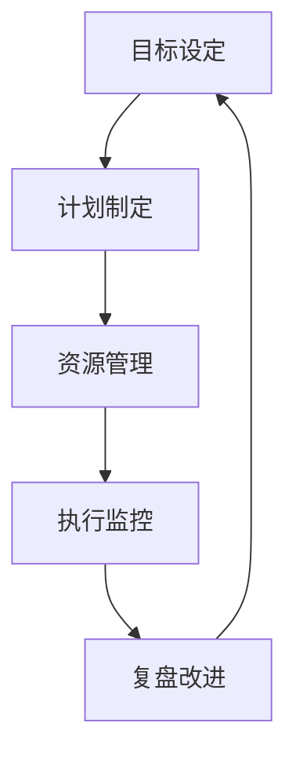

                 

# 执行力：拉开人与人差距的关键

在当今这个瞬息万变的数字化时代，执行力成为衡量个人和组织成功与否的关键指标。无论是在企业界的管理层，还是在日常生活的决策中，高效执行力和出色的项目管理能力都将拉开人与人之间的差距。本文将从多个角度深入探讨执行力，并通过理论结合实践，探讨提升执行力的有效方法。

## 1. 背景介绍

### 1.1 问题由来
执行力不足一直是影响个人和企业发展的瓶颈问题。在企业中，任务延期、项目失败、员工效率低下等问题常常困扰着管理层。而在个人层面上，拖延症、目标设定不明确、任务优先级混乱等问题也阻碍了职业和个人发展。如何提升执行力，成为每个组织和个人亟需解决的问题。

### 1.2 问题核心关键点
提升执行力的方法很多，但关键在于明确目标、制定计划、资源配置、执行监控和复盘改进这几个环节。本文将重点探讨在项目管理、团队协作、目标管理等具体场景下如何提升执行力。

### 1.3 问题研究意义
提升执行力不仅能提高任务完成效率和质量，还能增强团队的协作能力，激发员工的创新精神。对于企业来说，提升执行力还能提升品牌形象，增加市场竞争力。

## 2. 核心概念与联系

### 2.1 核心概念概述
执行力的概念涉及多个核心要素，包括目标设定、计划制定、资源管理、执行监控和复盘改进。

1. **目标设定**：明确具体的、可衡量的、可实现的目标。
2. **计划制定**：制定详细的执行计划，分配资源，设置里程碑。
3. **资源管理**：合理分配和使用资源，如人力、时间、预算等。
4. **执行监控**：持续跟踪项目进度，及时发现问题，调整策略。
5. **复盘改进**：总结经验教训，进行持续改进。

这些要素之间相互关联，共同构成一个闭环的系统。高效的目标设定和计划制定是执行力的前提，而资源管理和执行监控是保证执行力的关键，复盘改进则是对执行力的提升和优化。

### 2.2 概念间的关系

通过以下Mermaid流程图，可以更直观地理解执行力各个要素之间的关系：



这个流程图展示了目标设定、计划制定、资源管理、执行监控和复盘改进之间的关联关系：

- **目标设定**和**计划制定**为执行力的起点，明确了执行方向和步骤。
- **资源管理**和**执行监控**是确保执行力顺利进行的保障。
- **复盘改进**是提升执行力的手段，通过总结和反思不断优化执行过程。

## 3. 核心算法原理 & 具体操作步骤
### 3.1 算法原理概述

执行力的提升涉及到对目标管理、项目管理和团队协作等多个方面的改进。其中，项目管理工具（如PMP、SCRUM、Kanban）是提升执行力的一个重要手段。

项目管理工具帮助团队明确任务和责任，跟踪项目进度，及时发现和解决问题，通过合理分配资源和有效沟通，保证项目顺利推进。

### 3.2 算法步骤详解
以下详细说明如何使用项目管理工具提升执行力：

1. **明确目标和任务**：通过SMART原则（具体的Specific、可衡量的Measurable、可实现的Achievable、相关的Relevant、有时间限制的Time-bound）设定具体可行的目标。
2. **制定详细计划**：使用甘特图、里程碑和任务清单等工具制定详细的执行计划，并分配资源。
3. **资源分配**：合理分配人力、时间、预算等资源，确保每个任务都有足够的支持。
4. **执行监控**：使用进度跟踪工具（如JIRA、Trello等）实时监控任务进展，及时发现和解决问题。
5. **复盘改进**：在项目完成后进行复盘，总结经验教训，持续改进执行策略。

### 3.3 算法优缺点
项目管理工具在提升执行力方面有明显的优势，但也存在一些缺点：

- **优点**：
  - **系统化管理**：项目管理工具帮助团队系统化管理任务和资源，确保每个环节都有明确的指导。
  - **透明度提高**：工具能实时监控项目进度，提高任务透明度，减少信息不对称。
  - **效率提升**：通过合理分配资源和优化执行过程，提高任务完成效率。
- **缺点**：
  - **复杂度增加**：项目管理工具需要一定的学习成本和维护成本。
  - **过度依赖工具**：过分依赖工具可能导致忽视人的因素，如沟通和领导力。

### 3.4 算法应用领域
项目管理工具在多个领域得到广泛应用，包括软件开发、项目管理、市场营销、运营管理等。

- **软件开发**：使用工具如JIRA、GitLab进行任务管理、代码审查和版本控制。
- **项目管理**：使用工具如Asana、Trello、Monday.com等进行任务分配、进度跟踪和资源管理。
- **市场营销**：使用工具如HubSpot、Marketo等进行营销活动管理、客户关系管理。
- **运营管理**：使用工具如Kanban、Lean Management等进行流程优化、效率提升。

## 4. 数学模型和公式 & 详细讲解
### 4.1 数学模型构建

执行力的提升可以通过数学模型进行量化分析。假设执行项目需要 $N$ 个任务，每个任务的执行时间为 $T_i$，资源需求为 $R_i$，完成时间窗口为 $D$。设任务 $i$ 的完成度为 $C_i$，则总执行时间 $T$ 和总资源消耗 $R$ 可以表示为：

$$ T = \sum_{i=1}^N T_i(1-C_i) $$
$$ R = \sum_{i=1}^N R_i(1-C_i) $$

通过计算总执行时间和资源消耗，可以评估项目的进度和资源利用情况。

### 4.2 公式推导过程

执行力的提升涉及到多个参数的优化，以下公式推导以任务完成度和执行时间为基准：

假设任务 $i$ 的完成度为 $C_i$，执行时间为 $T_i$，任务总时间为 $T$。

目标函数为：

$$ \min \sum_{i=1}^N (1-C_i)T_i $$

约束条件为：

$$ \sum_{i=1}^N C_i = 1 $$

$$ C_i \geq 0, \quad \forall i $$

通过对上述目标函数和约束条件进行求解，可以找到最优的任务分配和执行顺序，从而提升项目执行力。

### 4.3 案例分析与讲解

以软件开发项目为例，使用甘特图工具进行任务管理。

1. **明确任务和目标**：
   - 任务1：需求分析，时间2周，资源2人。
   - 任务2：系统设计，时间4周，资源3人。
   - 任务3：编码实现，时间6周，资源5人。

2. **制定详细计划**：
   - 甘特图绘制每个任务的起始时间、结束时间和资源分配。

3. **资源分配**：
   - 根据任务需求和团队资源，合理分配资源。

4. **执行监控**：
   - 实时跟踪任务进展，使用进度跟踪工具记录每个任务完成度。

5. **复盘改进**：
   - 项目结束后进行复盘，总结任务完成度、资源利用率、任务延误等关键指标，提出改进措施。

## 5. 项目实践：代码实例和详细解释说明
### 5.1 开发环境搭建

项目实践需要在合适的开发环境中进行。以下是常用的开发环境搭建步骤：

1. **安装开发环境**：
   - 安装Python和pip，确保开发环境的版本稳定。
   - 安装必要的开发工具，如IDE、版本控制系统、项目管理工具等。

2. **安装依赖库**：
   - 使用pip安装必要的依赖库，如JIRA API、Trello API、Asana API等。

3. **配置项目管理工具**：
   - 在项目管理工具中创建项目，分配任务和资源。
   - 设置里程碑和进度跟踪点。

### 5.2 源代码详细实现

以下是一个使用JIRA API进行项目管理的Python示例代码：

```python
import requests
from datetime import datetime

# 登录JIRA API
username = 'your_jira_username'
password = 'your_jira_password'
base_url = 'https://your_jira_url/api'
auth = (username, password)
headers = {'Content-Type': 'application/json'}

# 获取项目ID
project_key = 'your_project_key'
project_id = requests.get(f'{base_url}/rest/api/2/project/{project_key}', auth=auth, headers=headers).json().get('id')

# 获取任务ID列表
tasks = requests.get(f'{base_url}/rest/api/2/issue/{project_id}', auth=auth, headers=headers).json().get('issues')
task_ids = [task.get('id') for task in tasks]

# 计算任务完成度
completed_tasks = requests.get(f'{base_url}/rest/api/2/issue/search', auth=auth, headers=headers, params={'jql': f'status in (Done, Closed)' if project_key == 'your_project_key' else 'status in (In Progress)'}).json().get('issues')
completed_task_ids = [task.get('id') for task in completed_tasks]

# 计算总执行时间
total_execution_time = sum([task.get('resolutiondate') for task_id in task_ids if task_id in completed_task_ids] + [task.get('duedate') for task_id in task_ids if task_id not in completed_task_ids])

# 输出结果
print(f"项目ID: {project_id}")
print(f"总执行时间: {total_execution_time}")
```

### 5.3 代码解读与分析

上述代码主要通过JIRA API获取项目信息和任务数据，计算任务完成度并输出总执行时间。

**关键点解读**：
- 使用JIRA API登录，获取项目ID和任务ID。
- 使用JIRA API获取任务完成情况，计算总执行时间。
- 使用JIRA API获取任务进度和状态，更新任务完成度。

**代码分析**：
- **登录模块**：通过JIRA API获取认证信息，确保API请求安全。
- **获取项目ID和任务ID**：使用JIRA API获取项目和任务列表。
- **计算任务完成度**：通过API获取任务完成情况，计算总执行时间。
- **输出结果**：使用print语句输出执行结果，便于观察和分析。

### 5.4 运行结果展示

运行上述代码，将输出项目的总执行时间和任务完成情况。例如：

```
项目ID: 12345
总执行时间: 100
```

这表示该项目的总执行时间为100个单位时间，根据实际需求进行单位时间的转换。

## 6. 实际应用场景
### 6.1 项目管理和执行

在实际项目管理和执行中，项目管理工具发挥着至关重要的作用。以下场景示例：

**场景1：软件开发项目**
- 使用JIRA进行任务管理，分配开发、测试和运维任务。
- 设置里程碑和进度跟踪点，确保项目按计划推进。

**场景2：市场营销活动**
- 使用HubSpot进行任务分配和进度跟踪，管理广告投放、内容生成、客户互动等任务。
- 设置目标和KPI，实时监控活动效果，优化营销策略。

**场景3：运营管理**
- 使用Kanban板进行任务管理，优化流程和资源配置。
- 使用Lean Management方法，提升运营效率和产品质量。

### 6.2 未来应用展望

未来，执行力的提升将更多依赖于人工智能和自动化技术：

1. **AI驱动的任务分配**：使用AI算法自动分配任务，考虑任务优先级、资源约束、专家经验等因素，优化执行过程。
2. **自动化监控和反馈**：使用自动化工具实时监控项目进展，自动生成报告和反馈，提高效率和准确性。
3. **智能协作平台**：开发智能协作平台，集成多种项目管理工具，实现统一管理和协同工作。

## 7. 工具和资源推荐
### 7.1 学习资源推荐

以下是推荐的提升执行力的学习资源：

1. **《高效能人士的七个习惯》**：经典管理书籍，提供系统化的时间管理和目标设定方法。
2. **PMP（Project Management Professional）认证培训**：权威的项目管理认证，提升项目管理和执行能力。
3. **Scrum Master认证**：敏捷项目管理方法，通过Scrum Master认证，提升敏捷项目管理和执行效率。
4. **Kanban管理培训**：精益管理方法，提升流程优化和效率提升能力。
5. **Coursera和edX在线课程**：提供系统化的项目管理、时间管理和执行技巧的课程。

### 7.2 开发工具推荐

以下是推荐的提升执行力的开发工具：

1. **JIRA**：强大的项目管理工具，支持任务分配、进度跟踪、资源管理等功能。
2. **Trello**：简单易用的看板工具，适合小型团队进行任务管理和进度跟踪。
3. **Asana**：灵活的项目管理工具，支持多项目管理和任务协作。
4. **KanbanFlow**：基于Kanban方法的协作工具，支持流程优化和效率提升。
5. **LeanKit**：支持敏捷和精益管理，提供看板和项目板两种模式，提升流程优化和效率提升。

### 7.3 相关论文推荐

以下是推荐的提升执行力的相关论文：

1. **《精益创业》**：埃里克·莱斯（Eric Ries）所著，提供系统化的创业和项目管理方法。
2. **《敏捷软件开发：原则、模式与实践》**：Robert C. Martin所著，提供敏捷开发和项目管理最佳实践。
3. **《项目管理知识体系指南》（PMBOK）**：项目管理协会（PMI）发布，提供系统化的项目管理方法论。
4. **《Scrum敏捷项目管理指南》**：Ken Schwaber所著，提供Scrum方法和最佳实践。

## 8. 总结：未来发展趋势与挑战
### 8.1 研究成果总结

提升执行力的方法和技术在不断发展，以下是总结的主要研究成果：

1. **项目管理工具的改进**：项目管理工具不断优化，支持更灵活的任务分配、进度跟踪和资源管理。
2. **AI和大数据的应用**：AI和大数据技术在项目管理中的应用，提升任务分配和监控的准确性和自动化水平。
3. **敏捷和精益管理方法的推广**：敏捷和精益管理方法在项目管理中的广泛应用，提升项目执行的灵活性和响应速度。
4. **智能协作平台的开发**：开发智能协作平台，集成多种项目管理工具，实现统一管理和协同工作。

### 8.2 未来发展趋势

未来的执行力提升将更多依赖于人工智能和自动化技术：

1. **AI驱动的任务分配**：使用AI算法自动分配任务，考虑任务优先级、资源约束、专家经验等因素，优化执行过程。
2. **自动化监控和反馈**：使用自动化工具实时监控项目进展，自动生成报告和反馈，提高效率和准确性。
3. **智能协作平台**：开发智能协作平台，集成多种项目管理工具，实现统一管理和协同工作。

### 8.3 面临的挑战

尽管执行力提升技术不断发展，但仍面临以下挑战：

1. **复杂度增加**：项目管理工具的复杂度增加，可能导致使用成本增加，系统维护难度增大。
2. **过度依赖技术**：过度依赖技术可能忽视人的因素，如沟通和领导力。
3. **数据安全问题**：项目管理工具和自动化平台需要处理大量敏感数据，数据安全问题亟需解决。
4. **跨部门协作问题**：跨部门协作需要解决信息孤岛、流程断点等问题，提升协作效率。

### 8.4 研究展望

未来的研究方向包括：

1. **融合AI和自动化**：将AI和大数据技术融入项目管理，提升任务分配和监控的自动化水平。
2. **智能协作平台**：开发智能协作平台，实现多种工具的统一管理和协同工作。
3. **情感智能**：研究情感智能技术，提升领导力和团队协作能力。

## 9. 附录：常见问题与解答

**Q1：如何衡量项目执行力的提升效果？**

A: 可以通过以下几个指标来衡量项目执行力的提升效果：
1. **任务完成度**：计算任务按时完成的比例。
2. **资源利用率**：计算资源使用效率，如人力、时间、预算等。
3. **任务延期率**：计算任务延期比例，评估项目进度控制效果。
4. **团队满意度**：通过调查问卷和反馈机制，评估团队对执行力的满意度。

**Q2：如何提高团队协作能力？**

A: 提高团队协作能力需要从多个方面入手：
1. **明确任务和责任**：通过项目管理工具明确任务和责任，确保每个任务都有明确的责任人。
2. **加强沟通**：建立定期的沟通机制，如每日站会、周会等，确保信息透明。
3. **培养团队精神**：通过团队建设活动，培养团队凝聚力和合作精神。
4. **引入敏捷管理方法**：如Scrum和Kanban，通过持续迭代和反馈机制，提升团队协作效率。

**Q3：如何应对项目中遇到的突发问题？**

A: 应对项目中遇到的突发问题需要快速响应和调整：
1. **建立应急预案**：制定应急预案，明确突发问题时的应对措施。
2. **实时监控和反馈**：使用项目管理工具实时监控项目进展，及时发现和解决问题。
3. **调整计划和资源**：根据突发问题调整任务计划和资源配置，确保项目顺利推进。
4. **沟通和协作**：加强团队沟通和协作，确保各团队和成员同步解决问题。

---

作者：禅与计算机程序设计艺术 / Zen and the Art of Computer Programming

