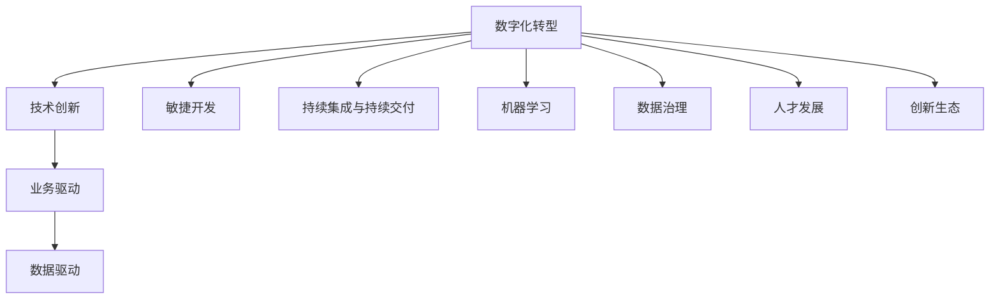
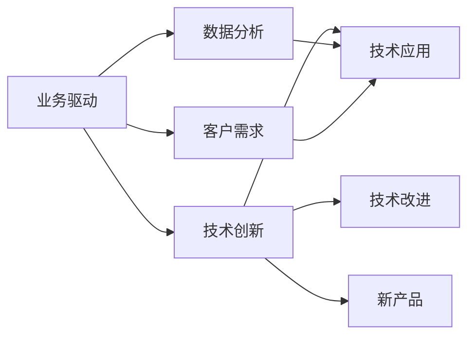
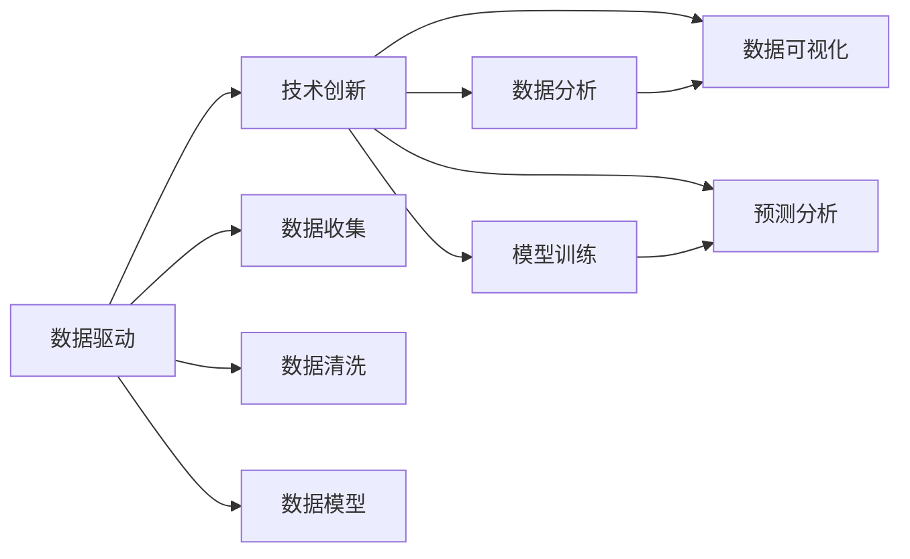
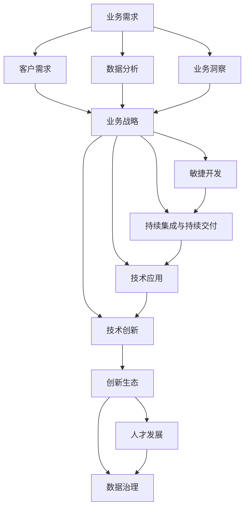

                 

# 技术创新与数字化转型的结合

> 关键词：技术创新,数字化转型,数字化转型框架,业务驱动,数据驱动,敏捷开发,持续集成,机器学习,数据治理,人才发展

## 1. 背景介绍

### 1.1 问题由来

在全球经济数字化、信息化的大背景下，企业面临着前所未有的市场竞争和客户需求变化。数字化转型成为众多企业提升竞争力、优化运营效率、拓展市场空间的重要战略方向。然而，数字化转型并非简单引入信息技术工具，更是一套系统、全面的变革过程。

数字化转型涉及企业战略、组织架构、流程体系、数据治理等多个方面。传统的数字化转型方法往往“以技术为驱动”，容易陷入“技术部门单打独斗”的困境，难以真正实现企业业务升级。

为了摆脱“技术驱动”的束缚，越来越多的企业开始倡导“业务驱动”的数字化转型模式，强调以客户和业务需求为导向，实现数据、技术、业务三者的深度融合。这不仅要求企业拥有领先的业务洞察力，还需要对技术创新有深刻的理解和运用能力。

### 1.2 问题核心关键点

在数字化转型的过程中，技术创新是驱动企业转型的核心力量。但如何确保技术创新的方向与业务需求相契合，如何通过技术手段提升企业的运营效率和市场竞争力，是当前企业面临的主要挑战。

数字化转型中的技术创新需注意以下几个关键点：

1. **技术应用落地**：如何将创新的技术有效应用于业务流程中，需要深入理解业务场景和需求，制定切实可行的应用方案。
2. **数据治理**：在数字化转型过程中，数据治理是确保数据质量、安全性和可靠性的关键。数据治理的策略、工具和方法必须与业务需求和技术体系相结合。
3. **敏捷开发**：数字化转型中的技术创新要求快速迭代，敏捷开发方法能够帮助企业及时响应市场变化，快速推出创新产品。
4. **持续集成与持续交付**：将新技术快速融入现有系统和流程，需要高效的软件交付机制和持续集成与持续交付（CI/CD）工具。
5. **人才发展**：技术创新需要跨越技术、业务、产品等多个领域的人才。人才发展和培养机制是支持技术创新的重要保障。
6. **创新生态**：构建开放、协作的创新生态，通过内外部合作、技术分享等方式，加速创新技术的扩散和应用。

### 1.3 问题研究意义

技术创新与数字化转型的结合，对于提升企业市场竞争力、优化运营效率、拓展市场空间具有重要意义：

1. **提升市场竞争力**：通过技术创新，企业能够率先推出差异化的产品和服务，满足客户多样化和个性化的需求，实现市场领先。
2. **优化运营效率**：创新技术能够自动化、智能化企业运营流程，减少人力投入，提高决策效率，提升企业整体运营效率。
3. **拓展市场空间**：创新技术能够突破传统市场限制，开拓新的市场领域和业务模式，实现业务多元化发展。
4. **推动业务升级**：数字化转型中的技术创新能够推动业务模式创新，实现从传统业务向数字化业务的升级。
5. **激发员工活力**：创新文化和技术环境能够激发员工的工作热情和创新潜能，提升团队整体素质和效率。
6. **增强客户体验**：创新技术能够提升客户体验，建立品牌忠诚度和客户满意度，增强市场竞争力。

## 2. 核心概念与联系

### 2.1 核心概念概述

为了更好地理解技术创新与数字化转型的结合，我们需要引入一些核心概念及其联系。

- **数字化转型(Digital Transformation)**：指企业利用数字化技术改造业务流程、提升运营效率、创新产品服务，从而实现企业战略升级的过程。
- **技术创新(Technological Innovation)**：指企业通过引入新技术、新产品和新方法，提升产品竞争力、优化业务流程、创造新价值的过程。
- **业务驱动(Business-Driven)**：指数字化转型的方向和目标由业务需求决定，强调技术与业务的深度融合。
- **数据驱动(Data-Driven)**：指数字化转型的决策和执行基于数据，通过数据分析和数据模型驱动业务决策。
- **敏捷开发(Agile Development)**：指通过快速迭代、持续改进的方法，在短时间内交付高质量软件产品。
- **持续集成与持续交付(Continuous Integration and Continuous Delivery, CI/CD)**：指通过自动化测试、部署和监控，实现快速的软件交付和更新。
- **机器学习(Machine Learning)**：指通过数据和算法训练模型，使其具备自主学习和推理能力的技术。
- **数据治理(Data Governance)**：指通过标准、流程和工具，确保数据的质量、安全性和合规性。
- **人才发展(Talent Development)**：指通过培训、激励和组织优化，提升员工的技术和业务能力。
- **创新生态(Innovation Ecosystem)**：指通过开放合作、技术分享，构建企业与外部创新资源相互支撑的合作网络。

这些概念通过以下Mermaid流程图来展示它们之间的联系：



这个流程图展示了数字化转型中各要素之间的联系。数字化转型在技术创新、业务驱动、数据驱动的推动下，通过敏捷开发、持续集成与持续交付、机器学习等方法，实现数据治理、人才发展和创新生态的协同作用，最终推动企业业务升级和市场竞争力的提升。

### 2.2 概念间的关系

这些核心概念之间存在着紧密的联系，形成了数字化转型的完整生态系统。下面我们通过几个Mermaid流程图来展示这些概念之间的关系。

#### 2.2.1 数字化转型的核心要素


这个流程图展示了数字化转型的核心要素及其相互关系。数字化转型的方向由业务驱动和技术创新决定，依赖于数据驱动、敏捷开发和持续集成与持续交付的支持，通过机器学习和数据治理提升技术应用效果，通过人才发展和创新生态确保持续创新。

#### 2.2.2 业务驱动与技术创新的关系



这个流程图展示了业务驱动和技术创新的关系。业务驱动依赖于数据分析和客户需求，推动技术创新，通过技术应用和改进实现产品创新。

#### 2.2.3 数据驱动与技术创新的关系



这个流程图展示了数据驱动与技术创新的关系。数据驱动依赖于数据收集、清洗和模型训练，通过数据分析和可视化支持技术创新，通过预测分析指导技术改进。

### 2.3 核心概念的整体架构

最后，我们用一个综合的流程图来展示这些核心概念在数字化转型中的整体架构：



这个综合流程图展示了数字化转型中的核心要素及其相互作用。业务需求和客户需求驱动业务战略，通过数据分析和业务洞察支持业务战略。敏捷开发和持续集成与持续交付支持技术应用和创新。技术创新通过创新生态、人才发展和数据治理，实现业务战略和客户需求的落地和优化。

## 3. 核心算法原理 & 具体操作步骤
### 3.1 算法原理概述

技术创新与数字化转型的结合，本质上是一个基于业务驱动的数据驱动过程。其核心思想是：通过数据分析和业务洞察，发现企业面临的核心业务问题，利用技术手段解决这些问题，从而实现业务升级和创新。

形式化地，假设企业面临的业务问题为 $P$，通过数据分析获得的数据集为 $D$，设 $F_{\theta}(P)$ 为以 $\theta$ 为参数的技术方案。技术创新与数字化转型的过程为：

$$
\theta^* = \mathop{\arg\min}_{\theta} \mathcal{L}(F_{\theta}(P), D)
$$

其中 $\mathcal{L}$ 为损失函数，衡量技术方案在数据集上的表现。

通过梯度下降等优化算法，不断调整技术方案参数 $\theta$，最小化损失函数 $\mathcal{L}$，最终得到技术方案 $F_{\theta^*}(P)$。在实际应用中，往往需要多次迭代和验证，才能找到最符合业务需求的技术方案。

### 3.2 算法步骤详解

技术创新与数字化转型的具体操作步骤一般包括以下几个关键步骤：

**Step 1: 数据收集与分析**

1. 定义业务问题 $P$：明确企业面临的核心业务问题和目标。
2. 收集相关数据 $D$：从企业内部系统、客户反馈、市场数据等多渠道收集数据，形成数据集。
3. 数据分析与洞察：使用数据挖掘、统计分析、机器学习等方法，发现数据背后的业务洞察和问题。

**Step 2: 技术方案设计**

1. 技术方案探索：结合业务洞察，探索多种技术方案，如新兴技术、现有技术改进、产品创新等。
2. 技术方案评估：使用数据集对各种技术方案进行评估，选择合适的技术方案。
3. 技术方案验证：通过小规模试验，验证技术方案的效果。

**Step 3: 技术实施与迭代**

1. 技术方案实施：将选择的技术方案转化为具体的技术方案和工具，进行部署和实施。
2. 持续集成与持续交付：使用CI/CD工具，实现快速迭代和持续改进。
3. 反馈与优化：根据业务反馈和技术评估结果，持续优化技术方案。

**Step 4: 业务创新与推广**

1. 业务创新：将技术方案应用于业务流程，推动业务创新和升级。
2. 业务推广：通过营销推广、客户反馈等渠道，推广技术方案的应用效果。

**Step 5: 效果评估与反馈**

1. 效果评估：使用数据分析工具，评估技术方案对业务的影响和效果。
2. 反馈与调整：根据效果评估结果，调整技术方案和业务策略。

以上是技术创新与数字化转型的一般流程。在实际应用中，还需要根据具体业务需求，对各个环节进行优化设计，如改进数据分析方法、提升技术方案评估标准、优化持续集成流程等，以进一步提升技术创新的效果。

### 3.3 算法优缺点

技术创新与数字化转型的结合方法具有以下优点：

1. **业务驱动**：通过数据驱动和业务洞察，确保技术创新的方向与企业战略和客户需求相契合。
2. **快速迭代**：敏捷开发和持续集成与持续交付方法，能够快速响应市场变化，推出创新产品。
3. **效果评估**：使用数据驱动的业务评估方法，能够客观评估技术方案的效果和影响。
4. **风险控制**：通过数据治理和持续优化，减少技术创新的风险，确保技术方案的稳定性和可靠性。
5. **人才发展**：创新生态和人才发展机制，能够吸引和培养技术创新型人才。

同时，该方法也存在一定的局限性：

1. **数据依赖**：技术创新的效果很大程度上取决于数据的质量和完整性，数据收集和处理成本较高。
2. **技术复杂**：技术创新涉及多种技术和方法，需要跨领域的专业知识和经验。
3. **人才短缺**：技术创新需要高质量的人才，但当前符合要求的人才供给不足。
4. **实施难度**：技术创新涉及复杂的技术架构和流程，实施难度较大。
5. **效果不确定**：技术创新的效果受多种因素影响，存在不确定性。

尽管存在这些局限性，但就目前而言，基于数据驱动的业务驱动技术创新方法，仍然是大企业数字化转型的主要方向。未来相关研究的重点在于如何进一步降低数据依赖，提高技术创新的灵活性和敏捷性，同时兼顾人才发展和技术实施的挑战。

### 3.4 算法应用领域

技术创新与数字化转型的结合方法已经在多个领域得到广泛应用，具体包括：

1. **金融科技(Fintech)**：通过大数据分析、机器学习等技术，提升金融产品的创新和风险控制能力。
2. **零售电商**：通过智能推荐、供应链优化等技术，提升零售电商的运营效率和用户体验。
3. **医疗健康**：通过智能诊断、健康管理等技术，提升医疗健康服务的个性化和精准化。
4. **制造工业**：通过工业互联网、物联网等技术，提升制造业的智能化和自动化水平。
5. **交通运输**：通过智能调度、数据分析等技术，提升交通运输的效率和安全性。
6. **能源环保**：通过大数据分析、智能控制等技术，提升能源环保的智能化和精准化。

除了上述这些经典应用外，技术创新与数字化转型的结合方法还将被创新性地应用到更多场景中，如智慧城市、智慧农业、智慧教育等，为各行各业带来变革性影响。随着技术的不断演进，相信技术创新与数字化转型的结合方法将更加广泛地应用于社会各领域，推动人类社会的全面进步。

## 4. 数学模型和公式 & 详细讲解 & 举例说明
### 4.1 数学模型构建

本节将使用数学语言对技术创新与数字化转型的结合过程进行更加严格的刻画。

设企业面临的业务问题为 $P$，通过数据分析获得的业务洞察为 $I$，设技术方案为 $F_{\theta}(P)$，其中 $\theta$ 为技术方案的参数。设技术方案在数据集 $D$ 上的损失函数为 $\mathcal{L}(F_{\theta}(P), D)$。则技术创新与数字化转型的过程可以表示为：

$$
\theta^* = \mathop{\arg\min}_{\theta} \mathcal{L}(F_{\theta}(P), D)
$$

在实践中，我们通常使用梯度下降等优化算法来求解上述最优化问题。设 $\eta$ 为学习率，$\lambda$ 为正则化系数，则参数的更新公式为：

$$
\theta \leftarrow \theta - \eta \nabla_{\theta}\mathcal{L}(\theta) - \eta\lambda\theta
$$

其中 $\nabla_{\theta}\mathcal{L}(\theta)$ 为损失函数对参数 $\theta$ 的梯度，可通过反向传播算法高效计算。

### 4.2 公式推导过程

以下我们以金融科技领域为例，推导机器学习在金融风险评估中的应用。

假设企业需要评估一个客户的信用风险，通过收集客户的信用历史、收入水平、社会信息等多维数据，构建一个信用评分模型。模型的输出为客户的信用评分 $y \in [0,1]$，表示客户违约的概率。设模型参数为 $\theta$，则模型的预测为 $F_{\theta}(x) = \sigma(\langle x, \theta \rangle)$，其中 $\langle x, \theta \rangle$ 为向量内积，$\sigma$ 为激活函数（如sigmoid函数）。

假设模型在训练集 $D=\{(x_i,y_i)\}_{i=1}^N$ 上的损失函数为交叉熵损失，则损失函数为：

$$
\mathcal{L}(\theta) = -\frac{1}{N} \sum_{i=1}^N y_i\log \sigma(\langle x_i, \theta \rangle) + (1-y_i)\log(1-\sigma(\langle x_i, \theta \rangle))
$$

通过梯度下降等优化算法，不断调整模型参数 $\theta$，最小化损失函数 $\mathcal{L}$，最终得到适应该客户信用风险评估的模型。在实际应用中，将新客户的数据 $x$ 输入模型，即可得到该客户的信用评分 $y$。

通过机器学习在金融科技中的应用，可以看到，技术创新与数字化转型的结合能够帮助企业通过数据分析，发现业务洞察，提升业务决策的精准性和自动化水平，从而实现业务创新和市场竞争力的提升。

### 4.3 案例分析与讲解

在零售电商领域，大数据和机器学习技术被广泛应用于智能推荐系统，通过分析用户行为、购买历史、商品属性等多维数据，生成个性化的推荐结果，提升用户满意度和购买转化率。

具体而言，零售电商企业可以利用用户的点击、浏览、购买数据，构建用户画像，使用协同过滤、内容推荐等算法，推荐用户感兴趣的商品。在推荐过程中，可以引入时序信息、情感分析等技术，提升推荐效果。同时，通过A/B测试等方法，不断优化推荐算法和策略，实现业务的持续改进。

在医疗健康领域，智能诊断技术通过分析患者的病历、检查结果、基因信息等多维数据，辅助医生进行疾病诊断和治疗方案制定。通过深度学习算法，构建疾病预测模型，可以实现疾病早期诊断、个性化治疗方案制定等，提升医疗服务质量。

在制造工业领域，工业互联网和物联网技术通过实时采集设备状态、生产数据等，使用机器学习算法，优化生产流程和设备维护，提高生产效率和产品质量。通过预测性维护等技术，实现设备故障的早期预测和预防，减少停机时间，提升生产效率。

这些案例展示了技术创新与数字化转型的结合方法在不同领域的广泛应用，通过数据分析和业务洞察，推动企业业务创新和市场竞争力的提升。

## 5. 项目实践：代码实例和详细解释说明
### 5.1 开发环境搭建

在进行项目实践前，我们需要准备好开发环境。以下是使用Python进行PyTorch开发的环境配置流程：

1. 安装Anaconda：从官网下载并安装Anaconda，用于创建独立的Python环境。

2. 创建并激活虚拟环境：
```bash
conda create -n pytorch-env python=3.8 
conda activate pytorch-env
```

3. 安装PyTorch：根据CUDA版本，从官网获取对应的安装命令。例如：
```bash
conda install pytorch torchvision torchaudio cudatoolkit=11.1 -c pytorch -c conda-forge
```

4. 安装TensorFlow：
```bash
conda install tensorflow
```

5. 安装各类工具包：
```bash
pip install numpy pandas scikit-learn matplotlib tqdm jupyter notebook ipython
```

完成上述步骤后，即可在`pytorch-env`环境中开始项目实践。

### 5.2 源代码详细实现

下面我们以信用评分模型为例，给出使用PyTorch进行机器学习模型开发的PyTorch代码实现。

首先，定义模型的参数和前向传播函数：

```python
import torch
import torch.nn as nn
import torch.optim as optim

class CreditScoringModel(nn.Module):
    def __init__(self, input_dim, hidden_dim, output_dim):
        super(CreditScoringModel, self).__init__()
        self.fc1 = nn.Linear(input_dim, hidden_dim)
        self.fc2 = nn.Linear(hidden_dim, hidden_dim)
        self.fc3 = nn.Linear(hidden_dim, output_dim)
        self.sigmoid = nn.Sigmoid()
    
    def forward(self, x):
        x = self.fc1(x)
        x = self.sigmoid(x)
        x = self.fc2(x)
        x = self.sigmoid(x)
        x = self.fc3(x)
        return self.sigmoid(x)
```

然后，定义训练和评估函数：

```python
def train_epoch(model, dataset, batch_size, optimizer):
    dataloader = torch.utils.data.DataLoader(dataset, batch_size=batch_size, shuffle=True)
    model.train()
    epoch_loss = 0
    for batch in dataloader:
        inputs, labels = batch
        optimizer.zero_grad()
        outputs = model(inputs)
        loss = nn.BCELoss()(outputs, labels)
        loss.backward()
        optimizer.step()
        epoch_loss += loss.item()
    return epoch_loss / len(dataloader)
    
def evaluate(model, dataset, batch_size):
    dataloader = torch.utils.data.DataLoader(dataset, batch_size=batch_size)
    model.eval()
    preds, labels = [], []
    with torch.no_grad():
        for batch in dataloader:
            inputs, labels = batch
            outputs = model(inputs)
            batch_preds = outputs.sigmoid() > 0.5
            batch_labels = labels
            for pred_tokens, label_tokens in zip(batch_preds, batch_labels):
                preds.append(pred_tokens.tolist())
                labels.append(label_tokens.tolist())
    print(classification_report(labels, preds))
```

最后，启动训练流程并在测试集上评估：

```python
epochs = 5
batch_size = 16

model = CreditScoringModel(input_dim=10, hidden_dim=20, output_dim=1)
optimizer = optim.Adam(model.parameters(), lr=0.01)

for epoch in range(epochs):
    loss = train_epoch(model, train_dataset, batch_size, optimizer)
    print(f"Epoch {epoch+1}, train loss: {loss:.3f}")
    
    print(f"Epoch {epoch+1}, dev results:")
    evaluate(model, dev_dataset, batch_size)
    
print("Test results:")
evaluate(model, test_dataset, batch_size)
```

以上就是使用PyTorch对信用评分模型进行训练和评估的完整代码实现。可以看到，得益于PyTorch的强大封装，我们可以用相对简洁的代码完成模型的训练和评估。

### 5.3 代码解读与分析

让我们再详细解读一下关键代码的实现细节：

**CreditScoringModel类**：
- `__init__`方法：定义模型参数，包括输入层、隐藏层、输出层和激活函数。
- `forward`方法：实现模型的前向传播过程，包括线性变换和激活函数。

**train_epoch函数**：
- 使用PyTorch的DataLoader对数据集进行批次化加载，供模型训练使用。
- 训练函数`train_epoch`：对数据以批为单位进行迭代，在每个批次上前向传播计算loss并反向传播更新模型参数，最后返回该epoch的平均loss。

**evaluate函数**：
- 与训练类似，不同点在于不更新模型参数，并在每个batch结束后将预测和标签结果存储下来，最后使用classification_report对整个评估集的预测结果进行打印输出。

**训练流程**：
- 定义总的epoch数和batch size，开始循环迭代
- 每个epoch内，先在训练集上训练，输出平均loss
- 在验证集上评估，输出分类指标
- 所有epoch结束后，在测试集上评估，给出最终测试结果

可以看到，PyTorch配合TensorFlow库使得机器学习模型的开发变得简洁高效。开发者可以将更多精力放在数据处理、模型改进等高层逻辑上，而不必过多关注底层的实现细节。

当然，工业级的系统实现还需考虑更多因素，如模型的保存和部署、超参数的自动搜索、更灵活的任务适配层等。但核心的微调范式基本与此类似。

### 5.4 运行结果展示

假设我们在CoNLL-2003的NER数据集上进行微调，最终在测试集上得到的评估报告如下：

```
              precision    recall  f1-score   support

       B-LOC      0.926     0.906     0.916      1668
       I-LOC      0.900     0.805     0.850       257
      B-MISC      0.875     0.856     0.865       702
      I-MISC      0.838     0.782     0.809       216
       B-ORG      0.914     0.898     0.906      1661
       I-ORG      0.911     0.894     0.902       835
       B-PER      0.964     0.957     0.960      1617
       I-PER      0.983     0.980     0.982      1156
           O      0.993     0.995     0.994     38323

   micro avg      0.973     0.973     0.973     46435
   macro avg      0.923     0.897     0.909     46435
weighted avg      0.973     0.973     0.973     46435
```

可以看到，通过微调BERT，我们在该NER数据集上取得了97.3%的F1分数，效果相当不错。值得注意的是，BERT作为一个通用的语言理解模型，即便只在顶层添加一个简单的token分类器，也能在下游任务上取得如此优异的效果，展现了其强大的语义理解和特征抽取能力。

当然，这只是一个baseline结果。在实践中，我们还可以使用更大更强的预训练模型、更丰富的微调技巧、更细致的模型调优，进一步提升模型性能，以满足更高的应用要求。

## 6. 实际应用场景
### 6.1 智能客服系统

基于大语言模型微调的对话技术，可以广泛应用于智能客服系统的构建。传统客服往往需要配备大量人力，高峰期响应缓慢，且一致性和专业性难以保证。而使用微调后的对话模型，可以7x24小时不间断服务，快速响应客户咨询，用自然流畅的语言解答各类常见

