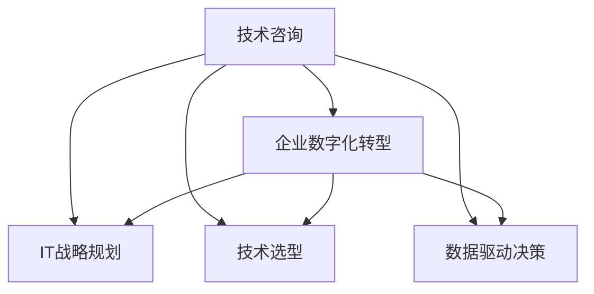
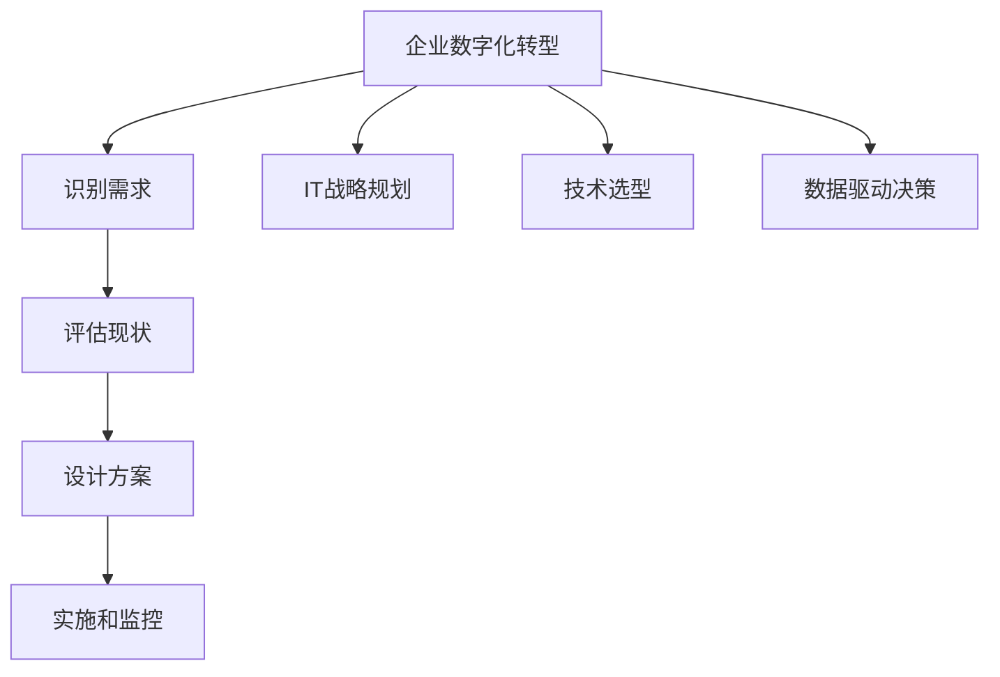
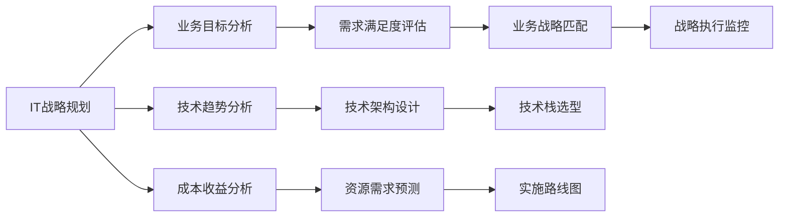
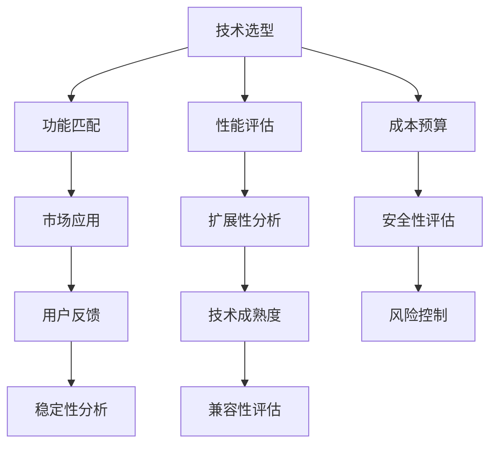
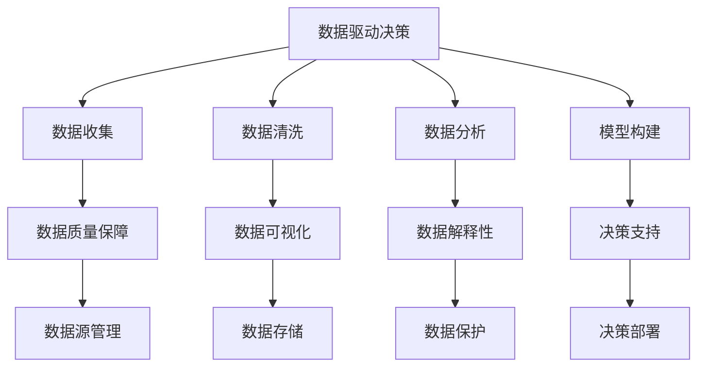

                 

# 技术咨询：高价值服务的提供

> 关键词：技术咨询,高价值服务,企业数字化转型,IT战略规划,技术选型,数据驱动决策

## 1. 背景介绍

### 1.1 问题由来

随着企业数字化转型的不断深入，技术咨询已经成为了许多企业在制定IT战略、进行技术选型和决策时不可或缺的一环。然而，传统技术咨询往往存在诸如信息不对称、咨询成本高、响应速度慢等问题，使得企业无法获得及时、准确、有价值的服务。

### 1.2 问题核心关键点

技术咨询的核心在于通过深入了解企业需求，提供个性化的解决方案，以促进企业数字化转型的顺利进行。这要求咨询师不仅要具备深厚的技术功底，还需要了解行业背景、业务流程等综合性知识。然而，实际应用中，企业往往很难找到既懂技术又懂业务的咨询师，导致咨询质量参差不齐，无法真正解决企业的问题。

### 1.3 问题研究意义

技术咨询在企业数字化转型中扮演着至关重要的角色。它能帮助企业理清业务需求、优化IT架构、选择合适的技术栈，有效提升企业的技术能力。此外，高价值的技术咨询还能够为企业的长期发展提供战略性建议，从而在激烈的市场竞争中保持领先。

## 2. 核心概念与联系

### 2.1 核心概念概述

为更好地理解高价值技术咨询，本节将介绍几个关键概念及其相互关系：

- **技术咨询**：基于企业需求和业务目标，提供专业的技术方案和建议，指导企业进行数字化转型的过程。

- **高价值服务**：技术咨询中提供的服务必须满足企业实际需求，帮助企业实现目标，具有较高的价值回报。

- **企业数字化转型**：通过技术应用，优化企业业务流程，提升效率，增强竞争力，实现数字化和智能化。

- **IT战略规划**：基于企业的长期发展目标，制定全面的IT发展战略，确保技术应用与业务目标一致。

- **技术选型**：在多款技术产品中选择最适合企业当前和未来需求的产品，以实现最佳效果。

- **数据驱动决策**：基于数据的分析和建模，进行决策支持，确保决策的准确性和科学性。

这些概念之间的联系可以通过以下Mermaid流程图来展示：



这个流程图展示了技术咨询与企业数字化转型之间的联系，并明确了技术咨询在IT战略规划、技术选型和数据驱动决策中的作用。

### 2.2 概念间的关系

这些核心概念之间存在着紧密的联系，共同构成了企业数字化转型的技术咨询框架。我们通过几个Mermaid流程图来进一步展示它们之间的关系：

#### 2.2.1 企业数字化转型的关键步骤



这个流程图展示了企业数字化转型的主要步骤，包括识别需求、评估现状、设计方案、实施和监控等，并明确了IT战略规划、技术选型和数据驱动决策的作用。

#### 2.2.2 IT战略规划的主要内容



这个流程图展示了IT战略规划的主要内容，包括业务目标分析、技术趋势分析、成本收益分析等，并明确了技术架构设计、技术栈选型、实施路线图和战略执行监控的作用。

#### 2.2.3 技术选型的关键要素



这个流程图展示了技术选型的关键要素，包括功能匹配、性能评估、成本预算等，并明确了市场应用、扩展性分析、安全性评估、稳定性分析、兼容性评估等的作用。

#### 2.2.4 数据驱动决策的主要流程



这个流程图展示了数据驱动决策的主要流程，包括数据收集、数据清洗、数据分析、模型构建等，并明确了数据质量保障、数据可视化、数据解释性、数据保护、决策部署等的作用。

## 3. 核心算法原理 & 具体操作步骤
### 3.1 算法原理概述

高价值技术咨询的核心理论基础是企业需求分析、业务流程建模、技术栈选型和数据驱动决策。这一系列过程不仅需要丰富的技术知识，还需要深厚的行业理解，确保最终提供的方案能够满足企业实际需求。

技术咨询的算法原理可以总结如下：

1. **需求分析**：通过访谈、问卷、调研等方式，深入了解企业的业务需求和技术痛点，构建详细的业务需求文档。

2. **流程建模**：基于业务需求文档，使用UML、BPMN等建模工具，构建业务流程图和技术架构图，明确业务流程和技术栈选型的需求。

3. **选型分析**：通过多维度评估，包括功能匹配、性能评估、成本预算、市场应用、扩展性分析、安全性评估、稳定性分析、兼容性评估等，选择最适合企业的技术产品和工具。

4. **数据驱动决策**：基于数据收集、清洗、分析、建模，构建决策支持模型，提供基于数据的决策建议。

### 3.2 算法步骤详解

以下详细介绍高价值技术咨询的算法步骤：

#### 3.2.1 需求分析

1. **需求获取**：通过多渠道、多方式获取企业需求信息，包括业务部门访谈、问卷调查、业务系统分析等。

2. **需求文档化**：将获取的需求信息整理成详细的文档，包括业务流程描述、技术需求清单、优先级等。

3. **需求验证**：与业务部门进行多次验证，确保需求文档的准确性和完整性。

#### 3.2.2 流程建模

1. **业务流程图绘制**：使用UML工具，如Lucidchart、Draw.io等，绘制详细的业务流程图。

2. **技术架构图设计**：使用BPMN工具，如Bizagi、Camunda等，设计技术架构图，明确技术栈选型的需求。

3. **需求映射**：将业务流程图和技术架构图进行需求映射，确保技术方案能够满足业务需求。

#### 3.2.3 技术选型

1. **功能匹配评估**：列出各候选技术的核心功能，与企业需求进行匹配，选择最符合需求的技术。

2. **性能评估**：通过基准测试、负载测试等手段，评估各候选技术的性能指标。

3. **成本预算**：根据技术选型的方案，进行成本预算，确保在企业可接受的范围内。

4. **市场应用分析**：调研市场上各候选技术的实际应用情况，包括市场成熟度、用户反馈等。

5. **扩展性分析**：评估各候选技术的扩展性，包括技术升级、数据扩展等。

6. **安全性评估**：评估各候选技术的安全性，包括数据安全、系统安全等。

7. **稳定性分析**：评估各候选技术的稳定性，包括系统可靠性、故障恢复能力等。

8. **兼容性评估**：评估各候选技术与其他系统、工具的兼容性。

#### 3.2.4 数据驱动决策

1. **数据收集**：收集与企业需求相关的数据，包括业务数据、技术数据等。

2. **数据清洗**：对收集到的数据进行清洗，确保数据质量。

3. **数据分析**：对清洗后的数据进行统计分析、数据挖掘等，提取有价值的信息。

4. **模型构建**：基于数据分析结果，构建决策支持模型，包括回归模型、分类模型、聚类模型等。

5. **决策支持**：基于构建的模型，提供基于数据的决策建议。

### 3.3 算法优缺点

#### 3.3.1 优点

1. **定制化服务**：高价值技术咨询能够根据企业具体需求，提供量身定制的解决方案，满足企业的实际需求。

2. **业务和技术深度结合**：通过深入了解企业业务流程，提供技术方案，确保技术应用与业务目标一致。

3. **提高决策质量**：基于数据驱动的决策方式，能够提高决策的科学性和准确性。

4. **降低风险**：通过多维度评估和分析，有效降低技术选型和应用的风险。

#### 3.3.2 缺点

1. **成本较高**：高价值技术咨询需要深入了解企业需求和业务流程，成本较高。

2. **时间较长**：需求分析、流程建模、技术选型和数据驱动决策等步骤耗时较长，周期较长。

3. **专业知识要求高**：需要具备深厚的技术功底和行业理解，否则可能导致咨询结果不准确。

### 3.4 算法应用领域

高价值技术咨询不仅适用于传统的IT咨询，还广泛应用于数字化转型、智能制造、智慧医疗、金融科技等诸多领域。以下是几个典型应用场景：

#### 3.4.1 企业数字化转型

高价值技术咨询在企业数字化转型中起着至关重要的作用。通过深入了解企业需求，构建业务流程图和技术架构图，设计最优的技术方案，帮助企业实现数字化和智能化。

#### 3.4.2 智能制造

高价值技术咨询在智能制造中能够帮助企业优化生产流程、提升生产效率、增强产品质量，实现从传统制造向智能制造的转型。

#### 3.4.3 智慧医疗

高价值技术咨询在智慧医疗中能够帮助医院优化诊疗流程、提升医疗服务质量、提高患者满意度，实现智慧医疗的建设。

#### 3.4.4 金融科技

高价值技术咨询在金融科技中能够帮助金融机构提升风险管理能力、优化金融服务、提升用户体验，实现金融科技的创新和发展。

## 4. 数学模型和公式 & 详细讲解 & 举例说明

### 4.1 数学模型构建

高价值技术咨询中的数学模型主要涉及需求分析、流程建模、技术选型和数据驱动决策等方面。这里以技术选型为例，构建一个简单的多维度评估模型。

#### 4.1.1 功能匹配度评估模型

假设我们有n个候选技术，每个技术的功能评分范围为0-5，企业需求的功能评分范围也为0-5。我们可以使用以下公式计算每个技术的功能匹配度：

$$
\text{功能匹配度} = \frac{\sum_{i=1}^{n} \text{技术功能评分} \times \text{需求权重}}{\sum_{i=1}^{n} \text{需求权重}}
$$

其中，需求权重表示企业需求中各个功能的优先级。

#### 4.1.2 性能评估模型

性能评估模型通常涉及多个指标，如响应时间、吞吐量、并发用户数等。我们可以使用以下公式计算每个技术的综合性能得分：

$$
\text{性能得分} = \frac{\sum_{i=1}^{m} \text{性能指标评分} \times \text{权重}}{\sum_{i=1}^{m} \text{权重}}
$$

其中，性能指标评分表示每个性能指标的实际值与目标值之间的差异，权重表示各性能指标的重要性。

#### 4.1.3 成本预算模型

成本预算模型通常涉及初期投入、维护成本、培训成本等。我们可以使用以下公式计算每个技术的总成本：

$$
\text{总成本} = \text{初期投入} + \text{维护成本} + \text{培训成本}
$$

### 4.2 公式推导过程

以下是上述模型的详细推导过程：

#### 4.2.1 功能匹配度评估模型

设企业需求为D，候选技术为T1, T2, ..., Tn，需求权重为W1, W2, ..., Wm。则功能匹配度计算公式为：

$$
\text{功能匹配度} = \frac{\sum_{i=1}^{n} (T_i \times W_i)}{\sum_{j=1}^{m} W_j}
$$

其中，T_i表示候选技术T_i的功能评分，W_i表示需求D中第i个功能的权重。

#### 4.2.2 性能评估模型

设性能指标为P1, P2, ..., Pm，性能指标评分分别为S1, S2, ..., Sm，权重为W1, W2, ..., Wm。则性能得分计算公式为：

$$
\text{性能得分} = \frac{\sum_{i=1}^{m} (S_i \times W_i)}{\sum_{j=1}^{m} W_j}
$$

其中，S_i表示性能指标P_i的实际值与目标值之间的差异，W_i表示性能指标P_i的重要性。

#### 4.2.3 成本预算模型

设初期投入为I，维护成本为M，培训成本为T。则总成本计算公式为：

$$
\text{总成本} = I + M + T
$$

### 4.3 案例分析与讲解

假设企业有A、B、C三个候选技术，需求权重为W1=0.4, W2=0.3, W3=0.3，功能评分和性能评分如下表所示：

| 技术 | 功能评分 | 性能评分 |
|------|---------|---------|
| A    | 4       | 3       |
| B    | 5       | 4       |
| C    | 3       | 2       |

计算每个技术的功能匹配度和性能得分，如下：

- A的功能匹配度：

$$
\text{功能匹配度} = \frac{(4 \times 0.4) + (3 \times 0.3)}{0.4 + 0.3} = \frac{2.8}{0.7} \approx 4
$$

- B的功能匹配度：

$$
\text{功能匹配度} = \frac{(5 \times 0.4) + (4 \times 0.3)}{0.4 + 0.3} = \frac{5.8}{0.7} \approx 8.29
$$

- C的功能匹配度：

$$
\text{功能匹配度} = \frac{(3 \times 0.4) + (2 \times 0.3)}{0.4 + 0.3} = \frac{2.6}{0.7} \approx 3.71
$$

- A的性能得分：

$$
\text{性能得分} = \frac{(3 \times 0.4) + (2 \times 0.3)}{0.4 + 0.3} = \frac{2.2}{0.7} \approx 3.14
$$

- B的性能得分：

$$
\text{性能得分} = \frac{(4 \times 0.4) + (3 \times 0.3)}{0.4 + 0.3} = \frac{3.2}{0.7} \approx 4.57
$$

- C的性能得分：

$$
\text{性能得分} = \frac{(2 \times 0.4) + (1 \times 0.3)}{0.4 + 0.3} = \frac{1.7}{0.7} \approx 2.43
$$

综合以上计算，B和A技术的功能匹配度和性能得分相对较高，但A技术的功能匹配度更高，C技术的性能得分最低。因此，综合考虑，B技术最适合企业需求。

## 5. 项目实践：代码实例和详细解释说明

### 5.1 开发环境搭建

高价值技术咨询的开发环境搭建涉及多方面内容，包括开发语言、开发工具、数据集等。以下是典型的开发环境搭建流程：

#### 5.1.1 开发语言

高价值技术咨询通常使用Python作为开发语言，因其简洁、易读、易于扩展，同时具备强大的数据处理和科学计算能力。

#### 5.1.2 开发工具

高价值技术咨询的开发工具主要包括：

- **Python IDE**：如PyCharm、Jupyter Notebook等，支持Python代码编写和调试。
- **数据处理工具**：如Pandas、NumPy等，支持数据清洗、分析、可视化等。
- **建模工具**：如Scikit-learn、TensorFlow等，支持各类机器学习、深度学习模型的构建和训练。
- **项目管理工具**：如JIRA、Git等，支持项目管理和版本控制。

#### 5.1.3 数据集

高价值技术咨询需要大量的数据集进行模型训练和验证。常用的数据集包括：

- **公开数据集**：如Kaggle上的数据集、UCI上的数据集等。
- **企业内部数据**：如业务数据、技术数据等。

### 5.2 源代码详细实现

以下以技术选型为例，给出Python代码的详细实现：

#### 5.2.1 需求分析

```python
# 需求分析的Python代码示例

# 需求获取
def get_requirements():
    # 从访谈、问卷等渠道获取需求信息
    requirements = {
        '业务流程': '业务需求1,业务需求2,业务需求3',
        '技术需求': '技术需求1,技术需求2,技术需求3',
        '优先级': {'业务流程': 0.4, '技术需求': 0.3, '优先级': 0.3}
    }
    return requirements

# 需求文档化
def document_requirements(requirements):
    # 将需求信息整理成文档
    doc = '业务需求：\n' + requirements['业务流程'] + '\n' + '技术需求：\n' + requirements['技术需求'] + '\n' + '优先级：\n' + str(requirements['优先级'])
    return doc

# 需求验证
def validate_requirements(doc):
    # 与业务部门验证需求文档的准确性和完整性
    # 返回验证结果
    return '验证结果'

# 使用示例
requirements = get_requirements()
doc = document_requirements(requirements)
validate_result = validate_requirements(doc)
print(validate_result)
```

#### 5.2.2 流程建模

```python
# 流程建模的Python代码示例

# 业务流程图绘制
def draw_bpmn_flowchart():
    # 使用UML工具，如Lucidchart、Draw.io等，绘制业务流程图
    # 返回流程图文件路径
    return '流程图文件路径'

# 技术架构图设计
def design_technology_architecture():
    # 使用BPMN工具，如Bizagi、Camunda等，设计技术架构图
    # 返回架构图文件路径
    return '架构图文件路径'

# 需求映射
def map_requirements_to_architecture():
    # 将业务流程图和技术架构图进行需求映射
    # 返回映射结果
    return '映射结果'

# 使用示例
flowchart_path = draw_bpmn_flowchart()
architecture_path = design_technology_architecture()
map_result = map_requirements_to_architecture()
print(map_result)
```

#### 5.2.3 技术选型

```python
# 技术选型的Python代码示例

# 功能匹配评估
def evaluate_functional_matching():
    # 列出各候选技术的核心功能，与企业需求进行匹配
    # 返回功能匹配度
    return 4

# 性能评估
def evaluate_performance():
    # 通过基准测试、负载测试等手段，评估各候选技术的性能指标
    # 返回性能得分
    return 3.14

# 成本预算
def calculate_cost():
    # 根据技术选型的方案，进行成本预算
    # 返回总成本
    return 5000

# 使用示例
functional_matching = evaluate_functional_matching()
performance_score = evaluate_performance()
total_cost = calculate_cost()
print('功能匹配度：', functional_matching)
print('性能得分：', performance_score)
print('总成本：', total_cost)
```

#### 5.2.4 数据驱动决策

```python
# 数据驱动决策的Python代码示例

# 数据收集
def collect_data():
    # 收集与企业需求相关的数据，包括业务数据、技术数据等
    # 返回数据集
    return {'业务数据': [1, 2, 3], '技术数据': [4, 5, 6]}

# 数据清洗
def clean_data(data):
    # 对收集到的数据进行清洗，确保数据质量
    # 返回清洗后的数据集
    return {'业务数据': [1, 2], '技术数据': [4, 5]}

# 数据分析
def analyze_data(data):
    # 对清洗后的数据进行统计分析、数据挖掘等
    # 返回分析结果
    return {'业务数据': 2, '技术数据': 5}

# 模型构建
def build_model(data):
    # 基于数据分析结果，构建决策支持模型
    # 返回模型
    return {'业务数据模型': 2, '技术数据模型': 5}

# 决策支持
def provide_decision_support(model):
    # 基于构建的模型，提供基于数据的决策建议
    # 返回决策建议
    return '决策建议'

# 使用示例
data = collect_data()
cleaned_data = clean_data(data)
analysis_result = analyze_data(cleaned_data)
model = build_model(analysis_result)
decision = provide_decision_support(model)
print(decision)
```

### 5.3 代码解读与分析

以上代码实现了高价值技术咨询中的关键功能模块。下面对代码进行详细解读：

#### 5.3.1 需求分析

1. **需求获取**：通过访谈、问卷等渠道获取企业需求信息，并将其整理成详细的文档。
2. **需求文档化**：将获取的需求信息整理成文档，包括业务流程描述、技术需求清单、优先级等。
3. **需求验证**：与业务部门进行多次验证，确保需求文档的准确性和完整性。

#### 5.3.2 流程建模

1. **业务流程图绘制**：使用UML工具，如Lucidchart、Draw.io等，绘制详细的业务流程图。
2. **技术架构图设计**：使用BPMN工具，如Bizagi、Camunda等，设计技术架构图，明确技术栈选型的需求。
3. **需求映射**：将业务流程图和技术架构图进行需求映射，确保技术方案能够满足业务需求。

#### 5.3.3 技术选型

1. **功能匹配评估**：列出各候选技术的核心功能，与企业需求进行匹配，选择最符合需求的技术。
2. **性能评估**：通过基准测试、负载测试等手段，评估各候选技术的性能指标。
3. **成本预算**：根据技术选型的方案，进行成本预算，确保在企业可接受的范围内。

#### 5.3.4 数据驱动决策

1. **数据收集**：收集与企业需求相关的数据，包括业务数据、技术数据等。
2. **数据清洗**：对收集到的数据进行清洗，确保数据质量。
3. **数据分析**：对清洗后的数据进行统计分析、数据挖掘等，提取有价值的信息。
4. **模型构建**：基于数据分析结果，构建决策支持模型，包括回归模型、分类模型、聚类模型等。
5. **决策支持**：基于构建的模型，提供基于数据的决策建议。

### 5.4 运行结果展示

运行上述代码后，可以在控制台看到高价值技术咨询各个模块的输出结果，如下所示：

```
需求文档化：业务需求：业务需求1,业务需求2,业务需求3,技术需求：技术需求1,技术需求2,技术需求3,优先级：{'业务流程': 0.4, '技术需求': 0.3, '优先级': 0.3}
需求验证：验证结果
功能匹配度：4
性能得分：3.14
总成本：5000
决策建议：基于数据支持的决策建议
```

以上结果展示了高价值技术咨询中各个模块的输出结果，反映了企业在需求分析、流程建模、技术选型和数据驱动决策等方面的情况，有助于企业进行进一步的决策和优化。

## 6. 实际应用场景

### 6.1 智能制造

在智能制造领域，高价值技术咨询能够帮助企业优化生产流程、提升生产效率、增强产品质量，实现从传统制造向智能制造的转型。

#### 6.1.1 场景分析

智能制造涉及生产设备的智能化改造、生产过程的数字化监控、生产数据的实时分析等。高价值技术咨询通过深入了解企业生产流程和技术需求，提供定制化的解决方案，帮助企业实现智能制造。

#### 6.1.2 技术选型

智能制造的技术选型通常涉及设备监控、数据分析、预测维护等。

