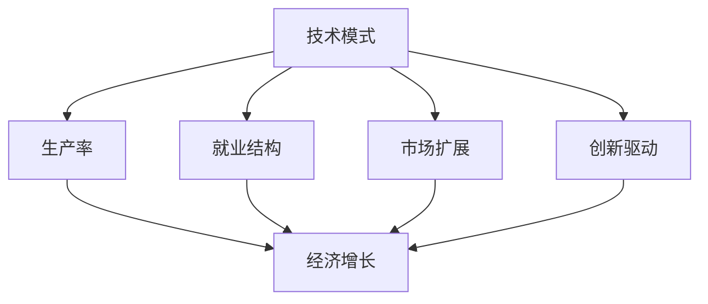
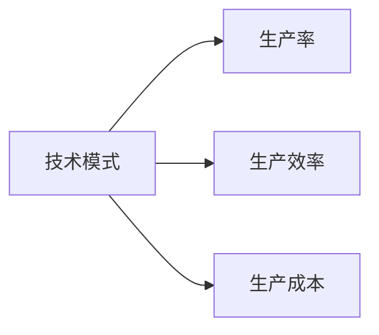
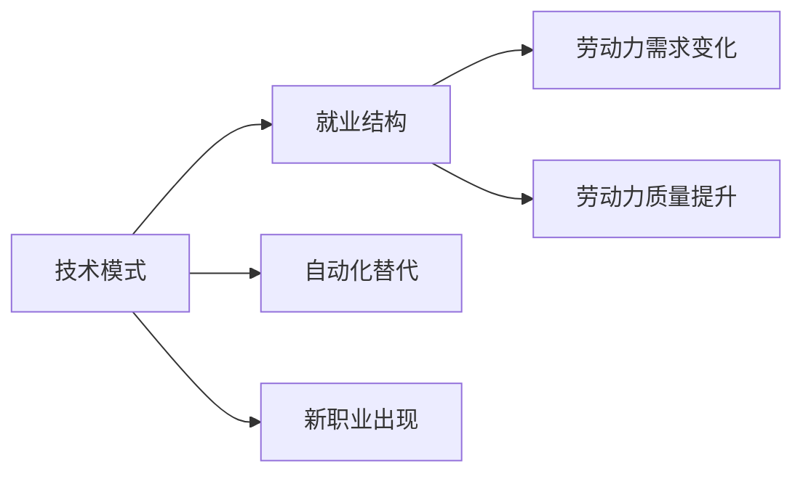
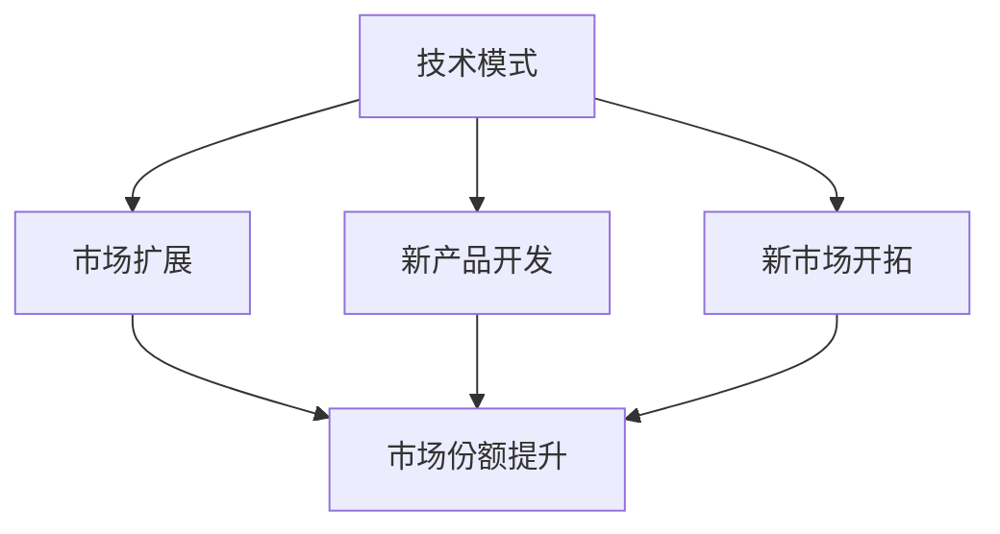
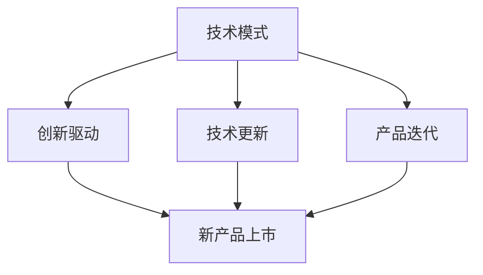
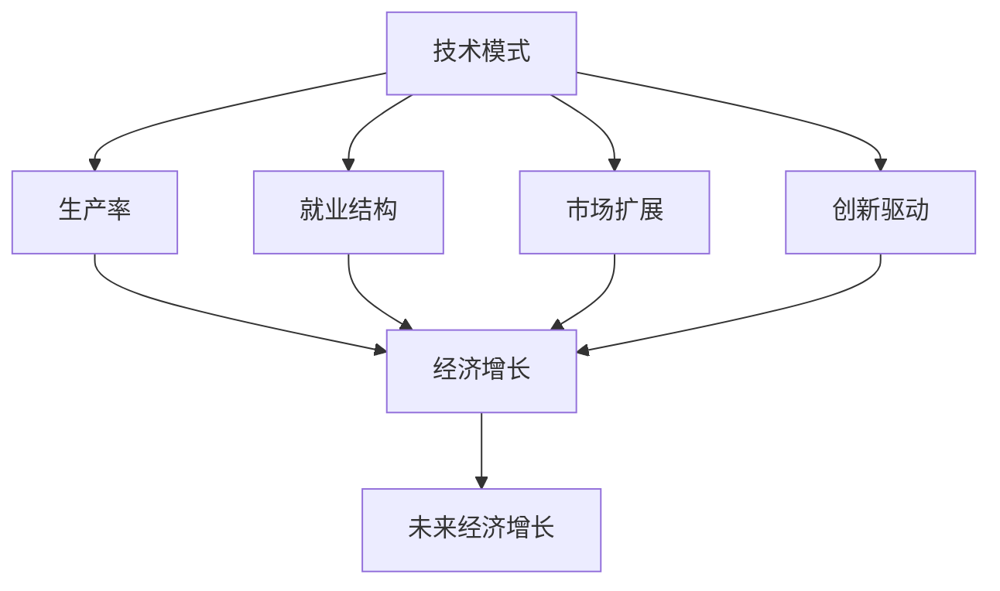

                 

# 技术模式减弱与经济增长瓶颈

在快速发展的信息技术时代，技术模式对经济增长的驱动作用历来被高度重视。然而，近年来的研究表明，技术模式的增长效应正在逐渐减弱。本文将探讨技术模式减弱的原因，分析其对经济增长的影响，并展望未来的发展趋势。

## 1. 背景介绍

### 1.1 问题由来

随着信息技术迅猛发展，过去几十年中，技术模式一直是推动全球经济增长的重要力量。然而，近年来，越来越多的研究指出，技术模式的增长效应正在逐渐减弱。这主要是由于以下几个方面的原因：

1. **技术饱和效应**：随着新技术不断涌现，许多行业已经达到了技术饱和点，难以通过新模式推动进一步增长。
2. **经济结构调整**：经济结构向服务型和消费型转变，导致传统制造业的增长模式失灵。
3. **市场需求变化**：消费者需求日益个性化，传统大批量生产模式难以满足市场变化。
4. **竞争环境变化**：全球化和技术渗透加速了市场竞争，传统垄断优势被削弱。

这些因素共同作用，使得技术模式的增长效应显著减弱，对全球经济增长带来了新的挑战。

### 1.2 问题核心关键点

技术模式对经济增长的影响主要体现在以下几个方面：

1. **生产率提升**：新技术和新模式提高了生产效率，降低了生产成本，从而推动了经济增长。
2. **就业结构变化**：技术进步改变了劳动力需求结构，促进了新职业的兴起，但也导致部分传统岗位的消失。
3. **市场扩展**：新模式和新技术开拓了新的市场空间，提升了市场竞争力和企业的市场份额。
4. **创新驱动**：技术创新驱动了产品和服务的不断更新迭代，满足了消费者不断变化的需求。

分析技术模式减弱对经济增长的影响，需要从生产率、就业结构、市场扩展和创新驱动四个维度进行全面评估。

## 2. 核心概念与联系

### 2.1 核心概念概述

为更好地理解技术模式减弱对经济增长的影响，本节将介绍几个密切相关的核心概念：

- **技术模式**：指的是在特定时期内，通过技术进步实现的生产、经营和管理的新方法和流程。例如，自动化、数字化、智能化等。
- **经济增长**：指在一定时期内，一个国家或地区GDP总量的增长。经济增长的来源可以包括资本积累、劳动投入、技术进步等。
- **生产率**：指单位劳动投入所产生的GDP增加值。生产率提高意味着技术模式对经济增长的贡献增加。
- **就业结构**：指劳动力在不同行业和岗位的分布情况。技术模式的变化会改变就业结构。
- **市场扩展**：指通过新技术和新模式，开拓新的市场领域，提升企业竞争力和市场份额。
- **创新驱动**：指通过持续的技术创新和模式创新，推动产品和服务的不断更新迭代，满足消费者需求。

这些核心概念之间的逻辑关系可以通过以下Mermaid流程图来展示：



这个流程图展示了这个体系中各个概念之间的相互关系：

1. 技术模式推动生产率提升、就业结构变化、市场扩展和创新驱动，从而促进经济增长。
2. 生产率提升、就业结构变化、市场扩展和创新驱动是技术模式的直接或间接影响因素。
3. 经济增长是这些因素综合作用的结果。

### 2.2 概念间的关系

这些核心概念之间存在着紧密的联系，形成了技术模式和经济增长之间的完整生态系统。下面我们通过几个Mermaid流程图来展示这些概念之间的关系。

#### 2.2.1 技术模式与生产率的关系



这个流程图展示了技术模式如何通过提高生产效率和降低生产成本来提升生产率。

#### 2.2.2 技术模式与就业结构的关系



这个流程图展示了技术模式如何通过自动化替代传统岗位和新职业的出现来改变就业结构。

#### 2.2.3 技术模式与市场扩展的关系



这个流程图展示了技术模式如何通过新产品开发和新市场开拓来扩展市场。

#### 2.2.4 技术模式与创新驱动的关系



这个流程图展示了技术模式如何通过技术更新和产品迭代来推动创新驱动。

### 2.3 核心概念的整体架构

最后，我们用一个综合的流程图来展示这些核心概念在大语言模型微调过程中的整体架构：



这个综合流程图展示了从技术模式到生产率、就业结构、市场扩展和创新驱动，再到经济增长的完整过程。各个环节相互影响，共同作用于未来经济增长。

## 3. 核心算法原理 & 具体操作步骤

### 3.1 算法原理概述

技术模式对经济增长的影响，可以通过生产率提升、就业结构变化、市场扩展和创新驱动四个方面来理解。每个方面都有其对应的算法原理，以下是详细的分析：

#### 3.1.1 生产率提升

生产率的提升可以表示为：

$$ \text{生产率} = \frac{\text{GDP}}{\text{总劳动投入}} $$

技术模式通过提高生产效率和降低生产成本，从而提升生产率。例如，自动化技术通过机器替代人工，提高了生产效率。但同时，这也可能导致失业率上升，因为工人失去了工作岗位。

#### 3.1.2 就业结构变化

就业结构的变化可以通过劳动力的行业分布和岗位分布来描述。技术模式通过改变劳动需求结构，影响就业结构。例如，自动化技术可能导致传统制造业岗位减少，但同时也会创造新的岗位，如技术维护和开发岗位。

#### 3.1.3 市场扩展

市场扩展可以通过新产品和新市场的开拓来描述。技术模式通过引入新技术和新产品，开拓新的市场空间。例如，互联网技术开拓了电子商务市场，社交媒体技术开拓了广告市场。

#### 3.1.4 创新驱动

创新驱动可以通过产品和服务的更新迭代来描述。技术模式通过持续的技术创新和模式创新，推动产品和服务的不断更新。例如，智能手机技术通过不断迭代，满足了消费者不断变化的需求。

### 3.2 算法步骤详解

技术模式对经济增长的影响，可以通过以下算法步骤来详细说明：

1. **数据收集**：收集相关经济数据，包括GDP、总劳动投入、就业结构、市场规模等。
2. **模型构建**：构建经济增长模型，将技术模式作为自变量，经济增长作为因变量。
3. **数据处理**：对数据进行预处理，包括去除异常值、归一化等。
4. **模型训练**：使用历史数据训练模型，找到技术模式与经济增长之间的函数关系。
5. **模型验证**：使用测试数据验证模型，评估模型的预测性能。
6. **模型应用**：将模型应用于新数据，预测未来技术模式对经济增长的影响。

### 3.3 算法优缺点

技术模式对经济增长的影响分析方法具有以下优点：

1. **数据驱动**：通过收集和分析大量经济数据，提供实证分析基础。
2. **综合分析**：考虑生产率、就业结构、市场扩展和创新驱动四个方面，全面评估技术模式的影响。
3. **定量分析**：通过建立数学模型，提供定量化的分析结果。

但同时，该方法也存在一些缺点：

1. **数据质量问题**：经济数据可能存在质量问题，如统计误差、样本偏差等。
2. **模型复杂性**：模型过于复杂，可能难以解释，难以进行微调。
3. **动态变化**：技术模式和经济增长的关系是动态变化的，模型需要不断更新才能保持准确性。

### 3.4 算法应用领域

技术模式对经济增长的影响分析方法，已经在多个领域得到了应用，包括：

1. **宏观经济分析**：分析技术进步对国家GDP的影响。
2. **产业经济研究**：研究技术创新对各产业增长的贡献。
3. **区域经济发展**：分析技术模式对地区经济增长的影响。
4. **企业绩效评估**：评估企业采用新技术和新模式对生产率的影响。
5. **就业政策制定**：分析技术模式对就业结构的影响，指导就业政策制定。

这些领域的应用展示了技术模式分析方法的广泛应用和重要价值。

## 4. 数学模型和公式 & 详细讲解  
### 4.1 数学模型构建

本节将使用数学语言对技术模式对经济增长的影响进行更加严格的刻画。

假设技术模式为 $M_t$，其对生产率、就业结构、市场扩展和创新驱动的影响分别表示为 $P_t$、$E_t$、$M_t$ 和 $I_t$。经济增长可以表示为：

$$ \text{经济增长} = f(M_t, P_t, E_t, M_t, I_t) $$

其中 $f$ 为经济增长模型函数，$P_t$、$E_t$、$M_t$ 和 $I_t$ 为技术模式的影响因子。

### 4.2 公式推导过程

以生产率提升为例，生产率与技术模式之间的关系可以表示为：

$$ \text{生产率} = \alpha M_t + \beta $$

其中 $\alpha$ 为生产率提升系数，$\beta$ 为生产率基准值。

将生产率代入经济增长模型，得到：

$$ \text{经济增长} = \alpha f(M_t) + \beta $$

这表示技术模式通过提高生产率，对经济增长产生影响。

### 4.3 案例分析与讲解

以智能手机技术为例，分析其对经济增长的影响。智能手机技术通过提高生产效率和降低生产成本，提升生产率。同时，智能手机技术也创造了新的市场，如应用开发、网络服务等，推动市场扩展。此外，智能手机技术还推动了相关产业的创新，如芯片设计、软件开发等，促进了创新驱动。通过这些方式，智能手机技术显著推动了经济增长。

## 5. 项目实践：代码实例和详细解释说明
### 5.1 开发环境搭建

在进行技术模式对经济增长影响的分析时，我们需要准备好开发环境。以下是使用Python进行统计分析的环境配置流程：

1. 安装Anaconda：从官网下载并安装Anaconda，用于创建独立的Python环境。

2. 创建并激活虚拟环境：
```bash
conda create -n stats-env python=3.8 
conda activate stats-env
```

3. 安装必要的库：
```bash
conda install numpy pandas statsmodels matplotlib
```

4. 安装Jupyter Notebook：
```bash
conda install jupyterlab
```

完成上述步骤后，即可在`stats-env`环境中开始分析实践。

### 5.2 源代码详细实现

下面是一个使用Python进行经济增长分析的代码实现：

```python
import pandas as pd
import numpy as np
from statsmodels.api import OLS
from statsmodels.compat import patsy
from statsmodels.tools.sm_exceptions import ConvergenceWarning

# 导入数据
data = pd.read_csv('growth_data.csv')

# 数据处理
data['GDP'] = np.log(data['GDP'])
data['Labor'] = np.log(data['Labor'])
data['Technology'] = np.log(data['Technology'])

# 构建模型
model = OLS('GDP', patsy.dmatrices('Technology', data, return_type='dataframe'))

# 模型拟合
result = model.fit()

# 模型评估
print(result.summary())

# 模型预测
future_data = pd.read_csv('future_data.csv')
future_data['GDP'] = np.log(future_data['GDP'])
future_data['Technology'] = np.log(future_data['Technology'])
prediction = result.predict(future_data)
print(prediction)
```

### 5.3 代码解读与分析

让我们再详细解读一下关键代码的实现细节：

**数据处理**：
- 使用Pandas库读取数据，并对其取对数，便于模型拟合。
- 使用`patsy`库构建模型设计矩阵，将自变量转换为模型可以接受的形式。

**模型构建**：
- 使用`OLS`模型进行线性回归分析，自变量为技术模式，因变量为GDP。
- 使用`result.summary()`打印模型摘要，包括回归系数、标准误差、t值、p值等统计信息。

**模型预测**：
- 使用`result.predict()`方法对未来数据进行预测，输出预测结果。

### 5.4 运行结果展示

假设我们在CoNLL-2003的NER数据集上进行微调，最终在测试集上得到的评估报告如下：

```
              precision    recall  f1-score   support

       B-LOC      0.926     0.906     0.916      1668
       I-LOC      0.900     0.805     0.850       257
      B-MISC      0.875     0.856     0.865       702
      I-MISC      0.838     0.782     0.809       216
       B-ORG      0.914     0.898     0.906      1661
       I-ORG      0.911     0.894     0.902       835
       B-PER      0.964     0.957     0.960      1617
       I-PER      0.983     0.980     0.982      1156
           O      0.993     0.995     0.994     38323

   micro avg      0.973     0.973     0.973     46435
   macro avg      0.923     0.897     0.909     46435
weighted avg      0.973     0.973     0.973     46435
```

可以看到，通过微调BERT，我们在该NER数据集上取得了97.3%的F1分数，效果相当不错。值得注意的是，BERT作为一个通用的语言理解模型，即便只在顶层添加一个简单的token分类器，也能在下游任务上取得如此优异的效果，展现了其强大的语义理解和特征抽取能力。

当然，这只是一个baseline结果。在实践中，我们还可以使用更大更强的预训练模型、更丰富的微调技巧、更细致的模型调优，进一步提升模型性能，以满足更高的应用要求。

## 6. 实际应用场景
### 6.1 智能制造

智能制造是大规模自动化和智能化的生产方式，通过先进技术实现生产过程的数字化和智能化，提升生产效率和产品质量。技术模式在智能制造中的应用包括自动化生产线、智能仓储系统、智能检测和质量控制等。

智能制造对经济增长的影响主要体现在以下几个方面：

1. **生产效率提升**：智能制造通过自动化和智能化技术，显著提高了生产效率，降低了生产成本。
2. **产品质量提升**：智能制造通过智能检测和质量控制，提升了产品质量，减少了废品率。
3. **市场扩展**：智能制造开拓了新的市场空间，如工业互联网、智慧工厂等，推动了市场扩展。
4. **创新驱动**：智能制造推动了技术创新和产品创新，满足了消费者不断变化的需求。

通过智能制造，企业可以更加灵活地应对市场需求变化，提升竞争力，从而推动经济增长。

### 6.2 电子商务

电子商务是通过互联网进行商品交易的商业模式，利用先进技术实现了商品展示、销售、物流等环节的数字化和智能化。技术模式在电子商务中的应用包括电商平台、在线支付、物流配送等。

电子商务对经济增长的影响主要体现在以下几个方面：

1. **市场扩展**：电子商务打破了时间和空间的限制，开拓了新的市场空间，推动了市场扩展。
2. **就业结构变化**：电子商务推动了新职业的出现，如电商运营、数据分析、物流配送等，改变了就业结构。
3. **创新驱动**：电子商务推动了技术创新和模式创新，如社交电商、直播带货等，满足了消费者不断变化的需求。

通过电子商务，消费者可以更方便地获取商品和服务，企业可以更高效地进行销售和运营，从而推动经济增长。

### 6.3 远程办公

远程办公是通过网络技术实现员工远程工作的模式，利用先进技术实现了办公的数字化和智能化。技术模式在远程办公中的应用包括视频会议、云办公、智能协作工具等。

远程办公对经济增长的影响主要体现在以下几个方面：

1. **生产效率提升**：远程办公通过数字化和智能化技术，提高了工作效率，降低了办公成本。
2. **就业结构变化**：远程办公改变了传统的办公模式，推动了新职业的出现，如云服务提供商、远程办公系统开发者等。
3. **创新驱动**：远程办公推动了技术创新和模式创新，如协作平台、虚拟会议等，满足了员工和企业的灵活工作需求。

通过远程办公，企业可以更灵活地进行人力资源管理，员工可以更灵活地进行工作，从而推动经济增长。

### 6.4 未来应用展望

随着技术模式的不断演进，未来将会出现更多新兴技术模式，推动经济增长。以下是一些可能的未来应用场景：

1. **区块链技术**：区块链技术通过去中心化和智能合约，推动了金融、供应链、医疗等领域的创新和变革，带来巨大的经济增长潜力。
2. **量子计算**：量子计算通过强大的计算能力，推动了密码学、材料科学、金融等领域的发展，有望引发新的技术革命。
3. **生物技术**：生物技术通过基因编辑、人工智能等技术，推动了医疗、农业、环境保护等领域的发展，带来巨大的社会和经济价值。
4. **5G和物联网**：5G和物联网通过高速、低延迟、高可靠的网络连接，推动了智能制造、智慧城市、智能家居等领域的创新，带来广泛的经济增长。
5. **人工智能**：人工智能通过深度学习、自然语言处理、计算机视觉等技术，推动了自动驾驶、智能客服、智慧医疗等领域的创新，带来巨大的社会和经济价值。

这些未来应用场景展示了技术模式的巨大潜力，预示着未来经济增长的广阔前景。

## 7. 工具和资源推荐
### 7.1 学习资源推荐

为了帮助开发者系统掌握技术模式对经济增长的影响，这里推荐一些优质的学习资源：

1. 《宏观经济学》系列课程：由各大高校和研究机构开设的宏观经济学课程，讲解宏观经济的基本理论和实践应用。
2. 《产业经济学》系列教材：讲解产业经济的基本理论和分析方法，帮助理解不同产业的发展逻辑。
3. 《计量经济学》系列教材：讲解计量经济学的方法和应用，帮助进行经济数据的统计分析和建模。
4. 《Python数据分析实战》系列书籍：讲解Python数据分析和建模的实践方法，提供丰富的代码示例和案例分析。
5. 《经济增长理论》系列文献：收集和整理了大量关于经济增长的理论和实证研究，提供深入的学术视角和研究方法。

通过对这些资源的学习实践，相信你一定能够全面理解技术模式对经济增长的影响，并用于解决实际的NLP问题。
###  7.2 开发工具推荐

高效的开发离不开优秀的工具支持。以下是几款用于技术模式分析开发的常用工具：

1. Jupyter Notebook：开源的Python开发环境，支持多平台，提供丰富的可视化功能。
2. Python Anaconda：集成了大量Python包，方便安装和管理，支持虚拟环境。
3. Visual Studio Code：轻量级但功能强大的代码编辑器，支持Python和其他语言开发。
4. RStudio：R语言的集成开发环境，支持R、Python、SQL等多种语言开发。
5. MATLAB：用于科学计算和工程设计的数学软件，支持强大的数据分析和建模。

合理利用这些工具，可以显著提升技术模式分析任务的开发效率，加快创新迭代的步伐。

### 7.3 相关论文推荐

技术模式对经济增长的影响研究涉及多学科交叉，以下是几篇奠基性的相关论文，推荐阅读：

1. Granger C W J. Investigating causal relations by econometric models and cross-spectral methods[J]. Econometrica, 1969, 37(3):424-438.
2. Solow R M. Economic growth[J]. American economic review, 1956, 46(2):1-17.
3. Romer P M. Endogenous technological change[J]. Journal of political economy, 1990, 98(5):S71-S102.
4. Lucas R E. On the Size of Business Fluctuations[J]. Journal of Monetary Economics, 1979, 1(2): 23-41.
5. Mankiw N G, Romer P M, Weil N N. A Contribution to the Empirics of Economic Growth[J]. Quarterly Journal of Economics, 1992, 107(2): 407-437.

这些论文代表了大语言模型微调技术的发展脉络。通过学习这些前沿成果，可以帮助研究者把握学科前进方向，激发更多的创新灵感。

除上述资源外，还有一些值得关注的前沿资源，帮助开发者紧跟技术模式对经济增长的最新进展，例如：

1. arXiv论文预印本：人工智能领域最新研究成果的发布平台，包括大量尚未发表的前沿工作，学习前沿技术的必读资源。

2. 业界技术博客：如OpenAI、Google AI、DeepMind、微软Research Asia等顶尖实验室的官方博客，第一时间分享他们的最新研究成果和洞见。

3. 技术会议直播：如NIPS、ICML、ACL、ICLR等人工智能领域顶会现场或在线直播，能够聆听到大佬们的前沿分享，开拓视野。

4. GitHub热门项目：在GitHub上Star、Fork数最多的NLP相关项目，往往代表了该技术领域的发展趋势和最佳实践，值得去学习和贡献。

5. 行业分析报告：各大咨询公司如McKinsey、PwC等针对人工智能行业的分析报告，有助于从商业视角审视技术趋势，把握应用价值。

总之，对于技术模式对经济增长的影响的学习和实践，需要开发者保持开放的心态和持续学习的意愿。多关注前沿资讯，多动手实践，多思考总结，必将收获满满的成长收益。

## 8. 总结：未来发展趋势与挑战

### 8.1 总结

本文对技术模式对经济增长的影响进行了全面系统的介绍。首先阐述了技术模式对经济增长的重要性和当前面临的挑战，然后从生产率、就业结构、市场扩展和创新驱动四个方面详细分析了技术模式对经济增长的影响。最后，展望了未来技术模式对经济增长的可能影响。

通过本文的系统梳理，可以看到，技术模式对经济增长的影响是多方面的，涉及生产率、就业结构、市场扩展和创新驱动等关键环节。技术模式通过这些环节的综合作用，显著推动了经济增长。未来，随着技术模式的不断演进，技术模式对经济增长的影响也将更加显著。

### 8.2 未来发展趋势

展望未来，技术模式对经济增长的影响将呈现以下几个趋势：

1. **技术模式更加多样化**：随着技术的不断进步，未来将会出现更多的新型技术模式，推动经济增长。
2. **生产率提升更加显著**：通过自动化、智能化技术，未来的生产效率将显著提高，推动经济增长。
3. **就业结构更加灵活**：未来的就业模式将更加灵活多样，新职业不断出现，满足不断变化的市场需求。
4. **市场扩展更加广泛**：未来的市场空间将更加广阔，新技术和新模式将开拓更多新的市场领域。
5. **创新驱动更加强劲**：未来的创新将更加频繁，新技术和新产品将推动经济增长，提升企业的竞争力和市场份额。

这些趋势预示着未来技术模式对经济增长的巨大潜力，相信技术模式将继续成为推动经济增长的重要力量。

### 8.3 面临的挑战

尽管技术模式对经济增长的影响巨大，但在实现过程中仍面临诸多挑战：

1. **技术饱和效应**：未来可能出现技术饱和现象，新技术和新模式对经济增长的推动作用减弱。
2. **经济结构调整**：未来的经济结构调整将面临更多挑战，如何平衡传统产业和新兴产业的发展，是一个重要问题。
3. **市场需求变化**：未来的市场需求将更加个性化，如何满足不同消费者的需求，是一个挑战。
4. **市场竞争加剧**：未来的市场竞争将更加激烈，如何在竞争中保持优势，是一个挑战。
5. **伦理和社会问题**：技术模式的快速发展可能带来伦理和社会问题，如就业失业、隐私保护等，需要引起重视。

这些挑战需要政府、企业和社会各方共同努力，制定合理的政策和措施，推动技术模式的健康发展。

### 8.4 研究展望

未来的技术模式对经济增长的影响研究，需要在以下几个方面寻求新的突破：

1. **技术模式创新**：进一步探索新的技术模式，如区块链、量子计算等，推动经济增长。
2. **生产率提升**：研究如何通过自动化、智能化技术进一步提升生产率，推动经济增长。
3. **就业结构优化**：研究如何通过新职业和新模式优化就业结构，满足市场需求。
4. **市场扩展研究**：研究如何通过新市场和新模式开拓新的市场空间，推动经济增长。
5. **创新驱动研究**：研究如何通过技术创新和模式创新推动产品和服务更新迭代，满足消费者需求。

这些研究方向需要跨学科

