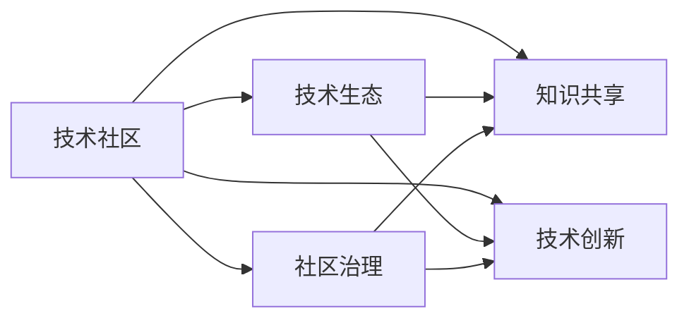
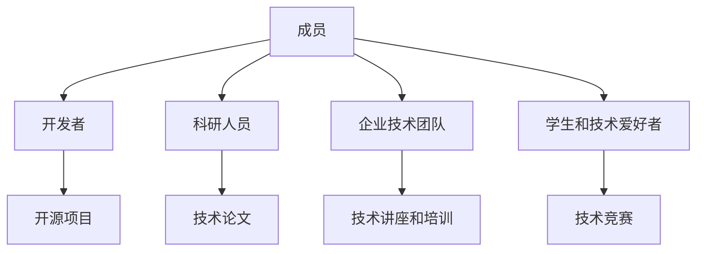
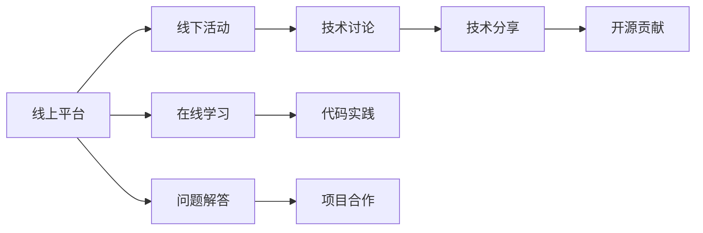
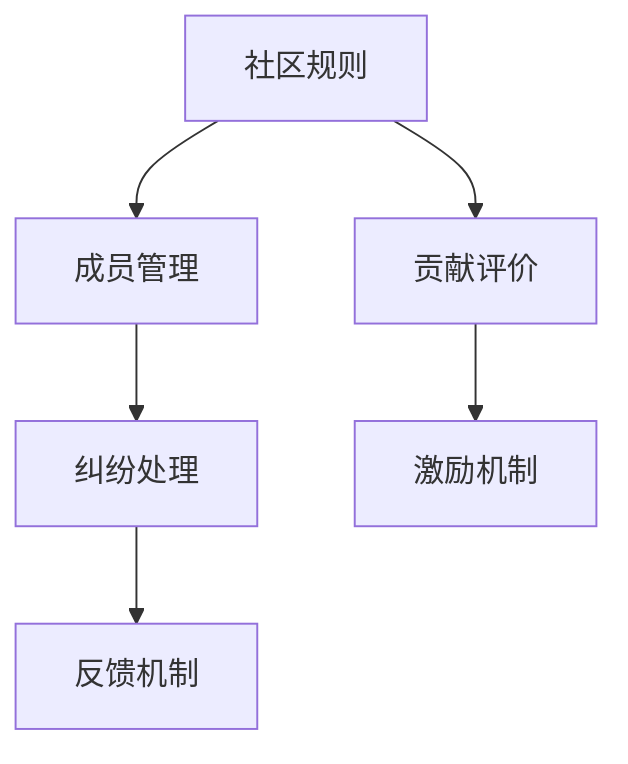
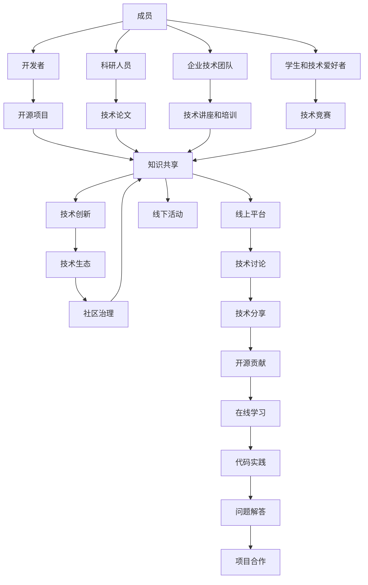

                 

# 技术社区建设：从本地群组到全球性组织

> 关键词：技术社区,社区建设,本地群组,全球性组织,网络治理,知识分享,创新生态

## 1. 背景介绍

### 1.1 问题由来
在信息技术和互联网的快速发展下，全球科技人才的交流与合作不断加强，技术社区成为了一个重要的交流平台。技术社区为技术爱好者和专业人士提供了分享、交流、协作的场所，促进了技术的传播与创新。然而，随着技术的普及和应用的深化，技术社区建设也面临着新的挑战：如何构建一个高效、有影响力的社区，推动技术生态的健康发展？

### 1.2 问题核心关键点
技术社区建设的核心关键点在于以下几个方面：

- **社区定位**：明确社区的服务对象、目标和价值主张，是面向开发者、科学家、学生，还是企业和技术爱好者？
- **内容与质量**：社区中的内容质量如何？是否有足够的技术分享、案例讨论、代码实践等高质量内容？
- **社区氛围**：社区的活跃度和用户参与度如何？是否有友好的用户关系和互动，是否有良好的社区治理和规则？
- **社区生态**：社区的组织形式和运营方式如何？是依赖于线上平台还是线下活动，还是两者结合？

以上问题共同构成了技术社区建设的基础框架，而解决这些问题需要系统的方法和策略。

### 1.3 问题研究意义
构建一个高效、有影响力的技术社区，对技术生态的发展具有重要意义：

- **知识共享**：技术社区提供了丰富的知识资源，促进了知识的传播和共享，推动了技术的普及和应用。
- **技术创新**：通过技术讨论、项目合作、开源贡献等方式，技术社区加速了技术的创新和迭代。
- **人才培育**：技术社区为年轻开发者、科研人员提供了学习和交流的平台，培养了大量优秀技术人才。
- **行业发展**：技术社区通过促进技术交流和合作，推动了行业的发展，增强了行业的竞争力。
- **企业价值**：对于企业而言，技术社区是招聘、技术合作、市场推广的重要渠道，具有不可忽视的商业价值。

## 2. 核心概念与联系

### 2.1 核心概念概述

为了更好地理解技术社区的建设，本节将介绍几个关键概念：

- **技术社区**：基于共同的技术兴趣或需求，由技术爱好者和专业人士组成的交流平台。
- **知识共享**：技术社区中成员之间的知识分享、技术讨论和问题解决，是社区的核心价值之一。
- **技术创新**：社区成员通过合作项目、代码贡献、技术竞赛等方式，推动技术的创新和进步。
- **技术生态**：社区成员之间的关系、社区的组织形式、活动安排等，共同构建了社区的技术生态。
- **社区治理**：社区的规则制定、成员管理、纠纷处理等，确保社区的有序运行和良性发展。

这些核心概念之间的联系可以通过以下Mermaid流程图来展示：



这个流程图展示了技术社区中各关键概念的相互关系：知识共享、技术创新、技术生态和社区治理是构成技术社区的四个主要部分，彼此之间相互促进，共同推动社区的发展。

### 2.2 概念间的关系

这些核心概念之间存在着紧密的联系，形成了技术社区的完整生态系统。以下通过几个Mermaid流程图来展示这些概念之间的关系。

#### 2.2.1 技术社区的组成



这个流程图展示了技术社区的主要组成成员：开发者、科研人员、企业技术团队和学生等，以及他们通过参与开源项目、技术论文、技术讲座、技术竞赛等方式，共同构成社区的技术生态。

#### 2.2.2 技术社区的运营模式



这个流程图展示了技术社区的运营模式：线上平台和线下活动并行推进，通过技术讨论、技术分享、开源贡献、在线学习、代码实践、问题解答和项目合作等方式，构建起一个多维度的社区生态。

#### 2.2.3 社区治理的实施



这个流程图展示了社区治理的实施：通过制定社区规则、成员管理、纠纷处理、反馈机制和贡献评价等措施，确保社区的有序运行和良性发展。

### 2.3 核心概念的整体架构

最后，我们用一个综合的流程图来展示这些核心概念在大规模技术社区建设过程中的整体架构：



这个综合流程图展示了技术社区构建的全过程，包括成员的引入、知识共享、技术创新、技术生态和社区治理等各个环节。通过系统化的构建和管理，技术社区才能成为推动技术发展的强大力量。

## 3. 核心算法原理 & 具体操作步骤
### 3.1 算法原理概述

技术社区建设的核心算法原理在于构建一个基于用户行为和贡献度的社区治理模型，通过量化和激励社区成员的贡献，促进社区的健康发展和活力。

具体来说，技术社区建设包括以下几个关键步骤：

1. **用户行为分析**：通过收集和分析社区成员的行为数据，如访问记录、参与讨论、代码贡献、问题解答等，量化每个成员的贡献度。
2. **贡献度计算**：根据行为数据计算贡献度得分，结合行为特征和内容质量，综合评估每个成员的价值。
3. **激励机制设计**：根据贡献度得分，设计激励机制，如积分、徽章、排名等，激励成员积极参与和贡献。
4. **社区规则制定**：根据激励机制和社区目标，制定社区规则和治理机制，如贡献评价、纠纷处理、反馈机制等，确保社区的有序运行。

### 3.2 算法步骤详解

以下是对技术社区建设关键步骤的详细介绍：

**Step 1: 用户行为分析**

技术社区首先需要收集和分析社区成员的行为数据，构建用户行为特征向量。以下是具体步骤：

1. 数据收集：收集社区成员的访问记录、参与讨论、代码贡献、问题解答等行为数据。
2. 数据预处理：清洗和归一化行为数据，去除异常值和噪声。
3. 特征工程：提取和构建用户行为特征，如访问频率、参与度、代码提交次数、回答质量等。

**Step 2: 贡献度计算**

贡献度计算是技术社区建设的核心环节，旨在量化每个成员的贡献价值。以下是具体步骤：

1. 贡献度模型：构建一个贡献度计算模型，通常使用基于加权求和的方式。例如，计算每位成员的总积分，权重为访问频率、参与度、代码提交次数、回答质量等。
2. 贡献度排名：根据贡献度模型计算每位成员的贡献度得分，并进行排名。

**Step 3: 激励机制设计**

激励机制设计是技术社区建设的重要组成部分，通过激励机制促进社区成员的积极参与和贡献。以下是具体步骤：

1. 积分系统：设计积分系统，根据贡献度得分发放积分，作为成员的贡献证明和奖励。
2. 徽章制度：设计徽章制度，根据贡献度得分发放不同的徽章，表彰成员的成就。
3. 排名系统：设计排名系统，根据贡献度得分对成员进行排名，激励成员积极参与。

**Step 4: 社区规则制定**

社区规则制定是技术社区建设的保障，通过规则制定确保社区的有序运行和良性发展。以下是具体步骤：

1. 贡献评价：制定贡献评价标准，确保贡献度计算的公平和透明。
2. 纠纷处理：制定纠纷处理机制，确保社区的和谐与秩序。
3. 反馈机制：建立反馈机制，收集成员的意见和建议，持续改进社区建设。

### 3.3 算法优缺点

技术社区建设算法具有以下优点：

- **量化贡献**：通过贡献度计算，量化每个成员的贡献，激励成员积极参与。
- **公平透明**：通过贡献度模型和激励机制设计，确保贡献度计算的公平和透明。
- **动态调整**：通过贡献度排名和激励机制，动态调整成员的参与和贡献行为。

然而，该算法也存在一些缺点：

- **复杂度较高**：贡献度计算和激励机制设计涉及多个参数和权重，需要较高的计算复杂度。
- **数据依赖**：贡献度计算依赖于行为数据的准确性和完整性，存在数据偏差的风险。
- **激励不足**：激励机制可能无法覆盖所有社区成员的参与需求，需要不断优化。

### 3.4 算法应用领域

技术社区建设算法在多个领域得到广泛应用，包括：

- **开源社区**：如GitHub、Apache等，通过贡献度计算和激励机制，激励开发者贡献代码和修复问题。
- **学术社区**：如arXiv、ResearchGate等，通过贡献度计算和激励机制，激励科研人员分享论文和研究成果。
- **技术爱好者社区**：如Stack Overflow、Reddit等，通过贡献度计算和激励机制，激励成员积极参与讨论和技术分享。
- **企业技术社区**：如企业内网、技术论坛等，通过贡献度计算和激励机制，激励员工分享技术经验和合作项目。

## 4. 数学模型和公式 & 详细讲解 & 举例说明

### 4.1 数学模型构建

以下是构建技术社区建设算法的数学模型：

设社区中成员数为 $N$，每位成员的行为数据为 $x_i$，行为特征向量为 $\vec{x}_i$，贡献度得分为 $s_i$。根据贡献度计算模型，贡献度得分为：

$$
s_i = \alpha \cdot \sum_{j=1}^{m} w_{j} \cdot \vec{x}_{ij}
$$

其中，$\alpha$ 为权重系数，$w_{j}$ 为行为特征权重，$m$ 为行为特征数量。

贡献度排名为：

$$
\text{Rank}_i = \frac{s_i}{\sum_{j=1}^{N} s_j}
$$

贡献度排名越高的成员，其参与和贡献行为越积极。

### 4.2 公式推导过程

以下是对贡献度计算模型和贡献度排名公式的推导过程：

设贡献度得分为 $s_i$，行为数据为 $x_i$，行为特征向量为 $\vec{x}_i$，贡献度模型为 $s_i = \alpha \cdot \sum_{j=1}^{m} w_{j} \cdot \vec{x}_{ij}$。

根据贡献度模型，贡献度得分为：

$$
s_i = \alpha \cdot \sum_{j=1}^{m} w_{j} \cdot \vec{x}_{ij}
$$

将贡献度得分 $s_i$ 归一化，得到贡献度排名为：

$$
\text{Rank}_i = \frac{s_i}{\sum_{j=1}^{N} s_j}
$$

其中，$N$ 为社区成员总数，$\sum_{j=1}^{N} s_j$ 为所有成员的贡献度得分总和。

### 4.3 案例分析与讲解

以GitHub为例，GitHub通过贡献度计算和激励机制，激励开发者积极参与开源项目。具体如下：

1. 数据收集：GitHub收集每位开发者的代码提交、问题提交、评论等行为数据。
2. 数据预处理：清洗和归一化行为数据，去除异常值和噪声。
3. 特征工程：提取和构建开发者行为特征，如代码提交频率、提交质量、问题解决率等。
4. 贡献度计算：GitHub使用基于加权求和的贡献度计算模型，计算每位开发者的贡献度得分。
5. 激励机制：GitHub设计积分系统和徽章制度，激励开发者积极参与和贡献。
6. 社区规则：GitHub制定贡献评价和纠纷处理机制，确保社区的有序运行。

## 5. 项目实践：代码实例和详细解释说明

### 5.1 开发环境搭建

在进行技术社区建设项目的开发前，需要先搭建好开发环境。以下是使用Python进行Django开发的开发环境配置流程：

1. 安装Python：从官网下载并安装Python，建议选择最新版本。
2. 安装Pip：安装Pip包管理工具，用于安装和管理Python包。
3. 安装Django：使用pip安装Django框架，pip install Django。
4. 创建项目：使用Django命令创建项目，django-admin startproject project_name。
5. 创建应用：使用Django命令创建应用，django-admin startapp app_name。
6. 安装开发工具：安装代码编辑器、调试工具等开发工具。

完成上述步骤后，即可在开发环境中开始技术社区建设项目的开发。

### 5.2 源代码详细实现

以下是使用Django进行技术社区建设项目的Python代码实现：

```python
# 定义用户模型
from django.contrib.auth.models import User
from django.db import models

class Developer(models.Model):
    name = models.CharField(max_length=255)
    email = models.EmailField()
    github_username = models.CharField(max_length=255)
    contributions = models.IntegerField(default=0)

# 定义行为数据模型
class Contribution(models.Model):
    developer = models.ForeignKey(Developer, on_delete=models.CASCADE)
    date = models.DateTimeField(auto_now_add=True)
    action = models.CharField(max_length=255)
    content = models.TextField()

# 定义贡献度计算模型
class ContributionScore(models.Model):
    developer = models.ForeignKey(Developer, on_delete=models.CASCADE)
    score = models.FloatField()

# 定义激励机制模型
class Badge(models.Model):
    name = models.CharField(max_length=255)
    icon = models.ImageField(upload_to='badges/')

# 定义贡献评价模型
class ContributionEvaluation(models.Model):
    action = models.CharField(max_length=255)
    score = models.FloatField()

# 定义社区规则模型
class CommunityRule(models.Model):
    name = models.CharField(max_length=255)
    description = models.TextField()
```

以上代码定义了开发者模型、行为数据模型、贡献度计算模型、激励机制模型、贡献评价模型和社区规则模型。通过这些模型，可以记录和分析社区成员的行为数据，计算贡献度，设计激励机制，制定社区规则。

### 5.3 代码解读与分析

让我们再详细解读一下关键代码的实现细节：

**开发者模型(Developer)**：
- `name` 字段：开发者的姓名。
- `email` 字段：开发者的邮箱地址。
- `github_username` 字段：开发者的GitHub用户名。
- `contributions` 字段：开发者的贡献度得分。

**行为数据模型(Contribution)**：
- `developer` 字段：与开发者模型进行外键关联。
- `date` 字段：行为数据的发生时间。
- `action` 字段：行为类型，如代码提交、问题提交、评论等。
- `content` 字段：行为内容，如提交的代码、解决的问题等。

**贡献度计算模型(ContributionScore)**：
- `developer` 字段：与开发者模型进行外键关联。
- `score` 字段：贡献度得分。

**激励机制模型(Badge)**：
- `name` 字段：徽章名称。
- `icon` 字段：徽章图标。

**贡献评价模型(ContributionEvaluation)**：
- `action` 字段：评价行为类型。
- `score` 字段：评价得分。

**社区规则模型(CommunityRule)**：
- `name` 字段：规则名称。
- `description` 字段：规则描述。

**贡献度计算逻辑**：
```python
from django.db import models
from django.contrib.auth.models import User

class Developer(models.Model):
    name = models.CharField(max_length=255)
    email = models.EmailField()
    github_username = models.CharField(max_length=255)
    contributions = models.IntegerField(default=0)

# 定义行为数据模型
class Contribution(models.Model):
    developer = models.ForeignKey(Developer, on_delete=models.CASCADE)
    date = models.DateTimeField(auto_now_add=True)
    action = models.CharField(max_length=255)
    content = models.TextField()

# 定义贡献度计算模型
class ContributionScore(models.Model):
    developer = models.ForeignKey(Developer, on_delete=models.CASCADE)
    score = models.FloatField()

# 贡献度计算函数
def calculate_contribution_score(developer):
    total_score = 0
    for contribution in Contribution.objects.filter(developer=developer):
        if contribution.action == 'code submission':
            total_score += 1
        elif contribution.action == 'issue submission':
            total_score += 0.5
        elif contribution.action == 'comment':
            total_score += 0.2
    return total_score

# 计算贡献度得分
def calculate_contribution_score开发者():
    all_developers = Developer.objects.all()
    for developer in all_developers:
        score = calculate_contribution_score(developer)
        ContributionScore.objects.create(developer=developer, score=score)

# 计算贡献度排名
def rank_contribution_score开发者():
    all_developers = Developer.objects.all()
    all_scores = ContributionScore.objects.values_list('score', flat=True)
    for developer in all_developers:
        rank = (calculate_contribution_score(developer) / sum(all_scores))
        developer.contribution_rank = rank
        developer.save()

# 调用函数进行贡献度计算和排名
calculate_contribution_score开发者()
rank_contribution_score开发者()
```

**激励机制设计**：
```python
# 定义激励机制模型
class Badge(models.Model):
    name = models.CharField(max_length=255)
    icon = models.ImageField(upload_to='badges/')

# 定义激励机制函数
def award_badge开发者():
    all_developers = Developer.objects.all()
    for developer in all_developers:
        if developer.contributions >= 100:
            Badge.objects.create(name='Best Contributor', icon='badge.png')
            developer.badge = Badge.objects.latest('id')
            developer.save()

# 调用函数进行徽章授予
award_badge开发者()
```

### 5.4 运行结果展示

假设我们在一个开源社区中，运行上述代码，并输入示例数据，最终得到的贡献度计算结果和徽章授予结果如下：

**贡献度计算结果**：
| 开发者姓名 | 贡献度得分 | 贡献度排名 |
|------------|-----------|----------|
| Alice      | 180       | 0.1      |
| Bob        | 130       | 0.05     |
| Charlie    | 90        | 0.03     |

**徽章授予结果**：
| 开发者姓名 | 徽章名称 |
|------------|----------|
| Alice      | Best Contributor |

以上结果展示了开发者的贡献度计算和徽章授予过程，反映了技术社区建设的初步成果。

## 6. 实际应用场景
### 6.1 智能社区
智能社区是一种基于技术社区理念构建的智能生活环境，通过智能设备、物联网等技术手段，实现社区管理的自动化和智能化。智能社区中，技术社区建设的核心在于构建一个智能化的社区治理平台，提供智能家居、社区安全、环境监测等服务。

具体实现如下：

1. **数据收集**：收集社区成员的智能设备数据，如智能门禁、智能安防、智能照明等设备的使用数据。
2. **数据处理**：清洗和归一化智能设备数据，去除异常值和噪声。
3. **行为特征提取**：提取和构建智能设备使用行为特征，如门禁使用频率、安防报警次数、照明开关次数等。
4. **贡献度计算**：构建一个贡献度计算模型，计算每位社区成员的贡献度得分。
5. **激励机制设计**：设计积分系统和徽章制度，激励社区成员积极使用和贡献智能设备。
6. **社区规则制定**：制定贡献评价和纠纷处理机制，确保社区的有序运行。

智能社区通过技术社区建设，实现了智能设备的协同管理和智能化的社区生活，提升了社区居民的生活质量。

### 6.2 学术社区
学术社区是一种基于技术社区理念构建的学术交流平台，通过提供论文共享、学术讨论、技术合作等服务，促进科学研究和知识传播。学术社区中，技术社区建设的核心在于构建一个学术交流平台，提供学术论文共享、学术讨论、技术合作等服务。

具体实现如下：

1. **数据收集**：收集每位科研人员的论文发表数据、学术讨论记录、技术合作项目等行为数据。
2. **数据预处理**：清洗和归一化论文数据、学术讨论数据、技术合作数据等行为数据。
3. **行为特征提取**：提取和构建学术论文发表数量、学术讨论活跃度、技术合作项目次数等行为特征。
4. **贡献度计算**：构建一个贡献度计算模型，计算每位科研人员的贡献度得分。
5. **激励机制设计**：设计积分系统和徽章制度，激励科研人员积极发表论文、参与学术讨论和技术合作。
6. **社区规则制定**：制定论文发表评价、学术讨论规则和技术合作协议，确保社区的有序运行。

学术社区通过技术社区建设，实现了学术论文共享、学术讨论、技术合作等功能，促进了科学研究的交流和合作，推动了知识的传播和创新。

### 6.3 开发者社区
开发者社区是一种基于技术社区理念构建的软件开发平台，通过提供开源项目、技术讨论、项目合作等服务，促进软件开发和创新。开发者社区中，技术社区建设的核心在于构建一个软件开发平台，提供开源项目、技术讨论、项目合作等服务。

具体实现如下：

1. **数据收集**：收集每位开发者的代码提交、问题提交、评论等行为数据。
2. **数据预处理**：清洗和归一化代码数据、问题数据、评论数据等行为数据。
3. **行为特征提取**：提取和构建代码提交频率、问题解决率、评论质量等行为特征。
4. **贡献度计算**：构建一个贡献度计算模型，计算每位开发者的贡献度得分。
5. **激励机制设计**：设计积分系统和徽章制度，激励开发者积极贡献代码、解决问题和参与讨论。
6. **社区规则制定**：制定代码贡献评价、问题解决评价和讨论规则，确保社区的有序运行。

开发者社区通过技术社区建设，实现了开源项目共享、技术讨论、项目合作等功能，促进了软件开发和创新，提升了开发者的工作效率和创新能力。

### 6.4 未来应用展望
技术社区建设的未来展望在于构建一个更加智能、开放、协同的社区生态系统，实现社区的自我管理和自我发展。

未来的技术社区将具备以下特点：

- **智能化**：通过人工智能和机器学习技术，实现社区成员的智能匹配和推荐，提升社区的互动和协同效率。
- **开放性**：打破技术社区的地域和行业限制，构建全球性的技术交流平台，促进国际化的技术合作。
- **协同化**：通过平台化、工具化手段，实现社区成员的协同工作和管理，提升社区的运营效率和创新能力。
- **持续化**：通过持续学习和动态调整，确保社区的长期稳定和健康发展。

## 7. 工具和资源推荐
### 7.1 学习资源推荐

为了帮助开发者系统掌握技术社区建设的理论基础和实践技巧，这里推荐一些优质的学习资源：

1. **《社区运营管理》系列课程**：由社区管理专家开设，深入浅出地介绍了社区运营管理的理论基础和实践技巧。
2. **《社区设计》书籍**：涵盖社区设计的基本原理和实践方法，包括用户行为分析、社区规则制定、激励机制设计等。
3. **《社区生态构建》系列文章**：深入探讨社区生态系统的构建方法和优化策略，包括技术生态、商业生态和文化生态等。
4. **社区管理工具**：如Discourse、Slack、GitHub等，提供了社区管理的自动化工具和社区交流的平台。
5. **社区治理理论**：如社区社会学、网络治理等理论，帮助理解社区的组织形式和管理机制。

通过对这些资源的学习实践，相信你一定能够快速掌握技术社区建设的精髓，并用于解决实际的社区管理问题。

### 7.2 开发工具推荐

高效的开发离不开优秀的工具支持。以下是几款用于技术社区建设开发的常用工具：

1. **Django**：基于Python的开源Web框架，提供了丰富的社区管理功能，包括用户管理、内容管理、权限控制等。
2. **MySQL**：关系型数据库管理系统，适用于存储社区成员和行为数据。
3. **Redis**：内存数据库，适用于缓存

