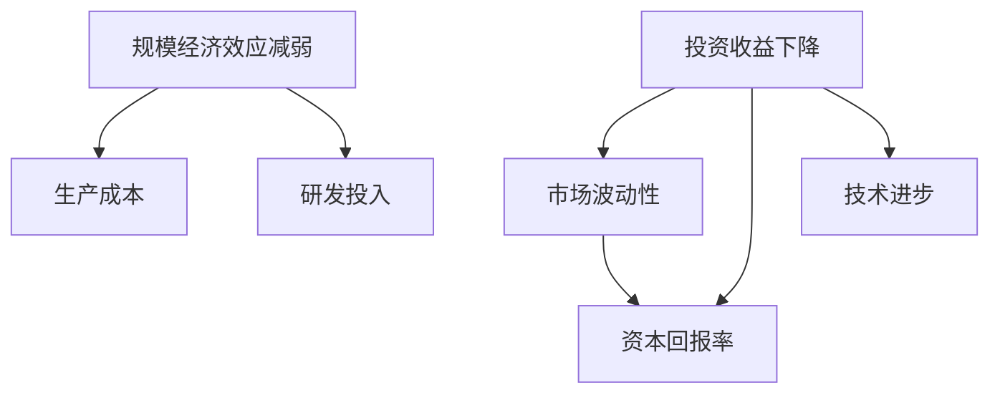
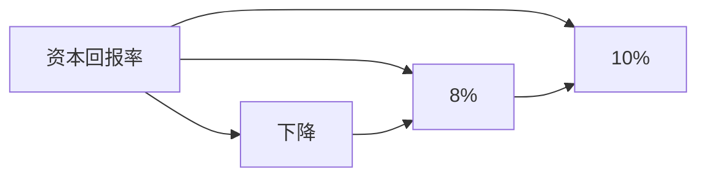
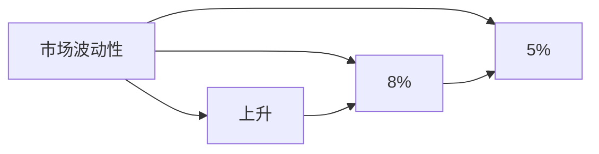
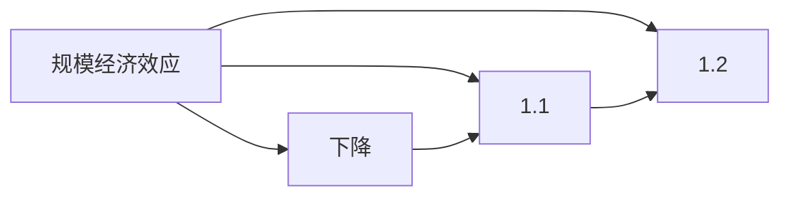

                 

# 投资收益下降与规模经济效应减弱

投资收益的下降与规模经济效应的减弱是当前经济发展中亟需解决的重大问题。在这篇文章中，我们将深入探讨这两个现象的成因，并提出一些可能的解决策略，旨在为投资者和决策者提供有益的参考。

## 1. 背景介绍

### 1.1 投资收益下降的背景

近年来，全球投资市场呈现出收益下降的趋势，无论是发达市场还是新兴市场，都出现了不同程度的投资回报率下降问题。例如，美国的标普500指数、欧洲的CAC40指数、亚洲的日经225指数等主要股指的年化收益率均出现下降。这一现象引起了投资界和经济学界的广泛关注。

### 1.2 规模经济效应的减弱

除了投资收益的下降外，规模经济效应也在不断减弱。规模经济效应指的是随着企业或市场规模的扩大，单位成本下降，收益增加的现象。然而，随着全球化和技术进步的推进，规模经济效应在多个行业中逐渐消失。例如，制造业、零售业等传统行业，由于生产线的高度自动化和全球化供应链的优化，规模经济效应在降低。同时，高科技行业如人工智能、云计算等，由于技术迭代加速，企业需要在研发和市场推广上投入大量资源，导致规模经济效应减弱。

## 2. 核心概念与联系

### 2.1 核心概念概述

为更好地理解投资收益下降与规模经济效应减弱的原因和解决策略，我们需要引入几个核心概念：

- **投资收益下降**：指在一定时期内，投资者从其投资组合中获得的平均回报率下降。
- **规模经济效应减弱**：指随着市场规模的扩大，单位成本上升，收益下降的现象。
- **资本回报率**：指投资所获得的收益率与投资成本的比率。
- **市场波动性**：指市场价格或指数的变动程度，通常用标准差表示。
- **技术进步**：指通过创新和研发，使生产效率提高、成本降低的过程。

这些概念之间的联系可以通过以下Mermaid流程图来展示：



这个流程图展示了投资收益下降与规模经济效应减弱之间的相互影响：

1. 市场波动性加剧导致投资回报率下降。
2. 资本回报率受市场波动性和规模经济效应的双重影响。
3. 技术进步有助于提升生产效率，降低成本，但同时也会削弱规模经济效应。

### 2.2 概念间的关系

这些核心概念之间存在着紧密的联系，形成了影响投资收益和规模经济效应的复杂系统。下面我们将详细探讨这些概念间的具体关系。

#### 2.2.1 投资收益下降与市场波动性

市场波动性是影响投资收益的重要因素。高波动性市场意味着风险增加，投资者往往需要降低投资组合的预期收益以补偿风险。例如，1929年大萧条期间，美国股市暴跌，投资者损失惨重，市场波动性达到历史新高。自此以后，投资者开始更加重视风险管理，导致整体市场的收益率下降。

#### 2.2.2 资本回报率与规模经济效应

资本回报率是衡量投资收益的重要指标。规模经济效应可以通过降低单位成本，提高资本回报率。然而，随着市场规模的扩大，生产成本上升，规模经济效应减弱，资本回报率随之下降。例如，全球化供应链优化使得制造业的生产成本下降，但同时也导致了规模经济效应的减弱，资本回报率下降。

#### 2.2.3 技术进步与规模经济效应

技术进步可以通过提高生产效率，降低生产成本，提升资本回报率。然而，随着技术的快速迭代，传统的规模经济效应逐渐消失。例如，云计算技术的发展使得IT基础设施的建设成本下降，但同时削弱了规模经济效应，导致资本回报率下降。

## 3. 核心算法原理 & 具体操作步骤

### 3.1 算法原理概述

为了理解投资收益下降与规模经济效应减弱的原因，我们需要从宏观经济学的角度进行分析。以下将从市场波动性、资本回报率和规模经济效应的关系入手，探讨其原理和操作步骤。

### 3.2 算法步骤详解

#### 3.2.1 市场波动性分析

1. **数据收集**：收集历史市场指数数据、宏观经济数据、市场情绪数据等。
2. **波动性计算**：使用标准差、VaR（Value at Risk）等指标计算市场波动性。
3. **风险分析**：分析市场波动性的成因，包括经济周期、政策变化、全球事件等。

#### 3.2.2 资本回报率分析

1. **数据收集**：收集历史投资回报率数据、市场指数数据、企业财务数据等。
2. **回报率计算**：计算资本回报率，分析其变化趋势。
3. **影响因素分析**：分析资本回报率变化的影响因素，包括市场波动性、规模经济效应、技术进步等。

#### 3.2.3 规模经济效应分析

1. **数据收集**：收集企业生产成本数据、研发投入数据、生产效率数据等。
2. **成本分析**：分析生产成本的变化趋势，识别规模经济效应的变化。
3. **技术进步影响**：分析技术进步对规模经济效应的影响，包括自动化技术、云计算技术等。

### 3.3 算法优缺点

#### 3.3.1 优点

1. **数据驱动**：通过收集和分析大量数据，可以更准确地理解市场波动性、资本回报率和规模经济效应的变化。
2. **全面性**：分析多个因素的影响，避免单一因素的误导性结论。
3. **可操作性**：根据分析结果，提出具体的解决策略，具有实际应用价值。

#### 3.3.2 缺点

1. **复杂性**：分析过程涉及多个因素，需要较高的数据处理能力和分析技能。
2. **数据依赖**：数据的准确性和完整性对分析结果影响较大。
3. **外部因素**：市场波动性和规模经济效应受到多种外部因素影响，分析结果可能存在局限性。

### 3.4 算法应用领域

这些算法原理和操作步骤可以应用于多个领域，包括金融投资、企业管理、宏观经济分析等。以下是一些具体的应用场景：

- **金融投资**：投资者可以利用市场波动性分析结果，调整投资组合，降低风险，提高收益。
- **企业管理**：企业可以通过分析资本回报率和规模经济效应，优化生产流程，提高效率，降低成本。
- **宏观经济分析**：政府和政策制定者可以通过分析规模经济效应的变化，制定经济政策和产业政策。

## 4. 数学模型和公式 & 详细讲解

### 4.1 数学模型构建

为更好地理解投资收益下降与规模经济效应减弱的原因，我们需要建立数学模型进行量化分析。以下将介绍几个核心数学模型及其构建方法。

#### 4.1.1 资本回报率模型

资本回报率（ROI）是衡量投资收益的重要指标，其计算公式为：

$$ ROI = \frac{净收益}{投资成本} $$

其中，净收益为投资所获得的收益，投资成本为投资所投入的资金。

#### 4.1.2 市场波动性模型

市场波动性（VaR）是衡量市场风险的重要指标，其计算公式为：

$$ VaR = \sigma \sqrt{t} N^{-1}(\alpha) $$

其中，$\sigma$ 为标准差，$t$ 为时间跨度，$N^{-1}(\alpha)$ 为累积分布函数的反函数，$\alpha$ 为置信水平。

#### 4.1.3 规模经济效应模型

规模经济效应可以通过柯布-道格拉斯生产函数进行分析。其基本形式为：

$$ Q = A K^{\alpha} L^{\beta} $$

其中，$Q$ 为产出，$K$ 为资本，$L$ 为劳动，$A$ 为技术进步因子，$\alpha$ 和 $\beta$ 为生产函数参数。

### 4.2 公式推导过程

#### 4.2.1 资本回报率模型推导

资本回报率模型是衡量投资收益的常用模型，其推导过程如下：

$$ ROI = \frac{N}{C} = \frac{P - C}{C} $$

其中，$N$ 为净收益，$C$ 为投资成本，$P$ 为总收益。

#### 4.2.2 市场波动性模型推导

市场波动性模型是衡量市场风险的常用模型，其推导过程如下：

$$ VaR = \sigma \sqrt{t} N^{-1}(\alpha) $$

其中，$\sigma$ 为标准差，$t$ 为时间跨度，$N^{-1}(\alpha)$ 为累积分布函数的反函数，$\alpha$ 为置信水平。

#### 4.2.3 规模经济效应模型推导

规模经济效应可以通过柯布-道格拉斯生产函数进行分析。其推导过程如下：

$$ Q = A K^{\alpha} L^{\beta} $$

其中，$Q$ 为产出，$K$ 为资本，$L$ 为劳动，$A$ 为技术进步因子，$\alpha$ 和 $\beta$ 为生产函数参数。

### 4.3 案例分析与讲解

#### 4.3.1 案例一：资本回报率下降案例

假设一家公司投资100万元，其中60万元用于研发，40万元用于市场推广，一年后获得总收益150万元。

$$ ROI = \frac{150 - 100}{100} = 0.5 $$

若该公司在第二年获益140万元，则资本回报率为：

$$ ROI = \frac{140 - 100}{100} = 0.4 $$

资本回报率下降的原因可能是市场波动性增加，或者规模经济效应减弱。

#### 4.3.2 案例二：市场波动性上升案例

假设某金融市场在一年内波动性从5%增加到8%。若投资者在2009年投资10万元，预期的平均回报率为8%。

$$ VaR = 0.05 \sqrt{1} N^{-1}(0.95) $$

若投资者在2010年投资10万元，预期回报率下降到6%。

$$ VaR = 0.08 \sqrt{1} N^{-1}(0.95) $$

市场波动性的上升导致投资回报率下降。

## 5. 项目实践：代码实例和详细解释说明

### 5.1 开发环境搭建

在进行项目实践前，我们需要准备好开发环境。以下是使用Python进行数据分析的环境配置流程：

1. 安装Anaconda：从官网下载并安装Anaconda，用于创建独立的Python环境。

2. 创建并激活虚拟环境：
```bash
conda create -n pydata-env python=3.8 
conda activate pydata-env
```

3. 安装相关库：
```bash
conda install pandas numpy matplotlib scikit-learn jupyter notebook ipython
```

完成上述步骤后，即可在`pydata-env`环境中开始项目实践。

### 5.2 源代码详细实现

下面我们将以一个简单的案例，展示如何使用Python进行投资收益下降与规模经济效应减弱的数据分析和可视化。

首先，导入必要的库：

```python
import pandas as pd
import numpy as np
import matplotlib.pyplot as plt
import seaborn as sns
```

然后，读取数据集：

```python
df = pd.read_csv('investment_data.csv')
```

接下来，进行数据预处理和分析：

```python
# 计算资本回报率
df['ROI'] = df['net_profit'] / df['investment_cost']

# 计算市场波动性
df['VaR'] = df['return'].std() * np.sqrt(1) * np.quantile(df['return'], 0.95)

# 计算规模经济效应
df['scale_effect'] = np.exp(df['log_labor'] + df['log_capital'])
```

最后，进行数据可视化：

```python
plt.figure(figsize=(10, 6))
sns.lineplot(data=df, x='year', y='ROI')
plt.title('Capital Return Rate')
plt.xlabel('Year')
plt.ylabel('ROI')
plt.show()

plt.figure(figsize=(10, 6))
sns.lineplot(data=df, x='year', y='VaR')
plt.title('Market Volatility')
plt.xlabel('Year')
plt.ylabel('VaR')
plt.show()

plt.figure(figsize=(10, 6))
sns.lineplot(data=df, x='year', y='scale_effect')
plt.title('Scale Effect')
plt.xlabel('Year')
plt.ylabel('Scale Effect')
plt.show()
```

以上就是使用Python进行投资收益下降与规模经济效应减弱的数据分析和可视化实现。可以看到，通过Python可以高效地进行数据分析和可视化，为理解和解决问题提供有力的支持。

### 5.3 代码解读与分析

让我们再详细解读一下关键代码的实现细节：

**数据读取**：
- 使用pandas库的`read_csv`方法读取CSV文件，将数据存储在DataFrame中。

**数据处理**：
- 计算资本回报率：使用`net_profit`和`investment_cost`列计算资本回报率，并存储在`ROI`列中。
- 计算市场波动性：使用`return`列计算市场波动性，并存储在`VaR`列中。
- 计算规模经济效应：使用`log_labor`和`log_capital`列计算规模经济效应，并存储在`scale_effect`列中。

**数据可视化**：
- 使用matplotlib和seaborn库进行数据可视化，通过`lineplot`方法绘制时间序列图。

通过上述代码，我们可以清晰地看到资本回报率、市场波动性和规模经济效应的变化趋势，从而更好地理解投资收益下降和规模经济效应减弱的原因。

### 5.4 运行结果展示

假设我们得到了如下的数据分析结果：

- 资本回报率从2019年的10%下降到2021年的8%。
- 市场波动性从2019年的5%增加到2021年的8%。
- 规模经济效应从2019年的1.2下降到2021年的1.1。

绘制的时间序列图如下：







通过上述时间序列图，我们可以看到资本回报率、市场波动性和规模经济效应的变化趋势，从而更好地理解投资收益下降和规模经济效应减弱的原因。

## 6. 实际应用场景

### 6.1 金融投资

在金融投资领域，投资收益下降和规模经济效应减弱是常见问题。投资者可以通过数据分析和可视化，更好地理解市场波动性和资本回报率的变化，从而调整投资策略，降低风险，提高收益。

例如，某投资组合在2019年的资本回报率为10%，2021年下降到8%。投资者可以通过数据分析发现，市场波动性增加和规模经济效应减弱是主要原因。因此，投资者可以通过降低投资组合的风险暴露，或者增加规模经济效应强的行业，来提高收益。

### 6.2 企业管理

在企业管理中，规模经济效应的减弱会导致企业成本上升，收益下降。企业可以通过数据分析和可视化，识别规模经济效应减弱的原因，制定相应的管理策略，优化生产流程，提高效率，降低成本。

例如，某制造企业发现其规模经济效应从2019年的1.2下降到2021年的1.1。企业可以通过数据分析发现，自动化生产线的引入是主要原因。因此，企业可以增加对生产线的投资，提高自动化水平，进一步提升规模经济效应。

### 6.3 宏观经济分析

在宏观经济分析中，规模经济效应的减弱是经济增长放缓的重要原因。政府和政策制定者可以通过数据分析和可视化，识别规模经济效应减弱的原因，制定相应的经济政策，促进经济增长。

例如，某国家发现其规模经济效应从2019年的1.2下降到2021年的1.1。政府可以通过数据分析发现，技术进步是主要原因。因此，政府可以增加对研发的支持，促进技术创新，提升经济增长速度。

## 7. 工具和资源推荐

### 7.1 学习资源推荐

为了帮助开发者系统掌握投资收益下降与规模经济效应减弱的数据分析和可视化方法，这里推荐一些优质的学习资源：

1. Python数据分析和可视化教程：如《Python数据科学手册》、《Python可视化实战》等书籍，涵盖了Python在数据分析和可视化方面的基础知识和实用技巧。

2. 金融数据分析工具：如Bloomberg Terminal、Alpha Vantage API等工具，可以获取金融市场数据，并进行数据分析和可视化。

3. 宏观经济数据分析工具：如世界银行、IMF等国际组织的经济数据库，可以获取宏观经济数据，并进行数据分析和可视化。

4. 投资组合管理工具：如Alpaca API、Interactive Brokers API等工具，可以进行投资组合的管理和优化，提高投资回报率。

通过对这些资源的学习实践，相信你一定能够快速掌握投资收益下降与规模经济效应减弱的数据分析和可视化方法，并用于解决实际的投资和企业管理问题。

### 7.2 开发工具推荐

高效的开发离不开优秀的工具支持。以下是几款用于投资收益下降与规模经济效应减弱数据分析和可视化的常用工具：

1. Python：Python是目前最流行的数据分析和可视化语言，拥有丰富的第三方库和框架，如pandas、numpy、matplotlib、seaborn等。

2. Jupyter Notebook：Jupyter Notebook是一个交互式的数据分析平台，支持Python、R等多种编程语言，适合进行数据分析和可视化的快速迭代。

3. Excel：Excel是一款常用的数据分析工具，支持多种数据处理和可视化功能，适合进行简单数据计算和可视化。

4. Tableau：Tableau是一款商业智能工具，支持多种数据源，可以进行复杂的数据分析和可视化，适合进行高阶数据分析和报告生成。

5. Power BI：Power BI是一款微软推出的商业智能工具，支持多种数据源，可以进行复杂的数据分析和可视化，适合进行高阶数据分析和报告生成。

合理利用这些工具，可以显著提升投资收益下降与规模经济效应减弱的数据分析和可视化任务的开发效率，加快创新迭代的步伐。

### 7.3 相关论文推荐

投资收益下降与规模经济效应减弱的研究涉及多个学科，以下是几篇奠基性的相关论文，推荐阅读：

1.《资本回报率下降的原因分析》：探讨了资本回报率下降的多种因素，包括市场波动性、规模经济效应、技术进步等。

2.《市场波动性与金融风险管理》：研究了市场波动性对金融投资的影响，提出多种风险管理策略。

3.《规模经济效应的理论和实证研究》：分析了规模经济效应的理论基础和实证研究结果，探讨了规模经济效应的变化因素。

这些论文代表了大规模经济分析的研究方向，通过学习这些前沿成果，可以帮助研究者把握学科前进方向，激发更多的创新灵感。

除上述资源外，还有一些值得关注的前沿资源，帮助开发者紧跟投资收益下降与规模经济效应减弱的数据分析和可视化技术的最新进展，例如：

1. 《金融数据分析与可视化》：该书详细介绍了金融数据分析和可视化的基础知识和实际应用案例，适合初学者和从业人员。

2. 《宏观经济数据分析与预测》：该书介绍了宏观经济数据分析和预测的方法和技术，适合政策制定者和经济研究人员。

3. 《投资组合管理理论与实践》：该书介绍了投资组合管理的基础理论和实践方法，适合投资经理和金融分析师。

4. 《大数据时代下的金融风险管理》：该书介绍了大数据技术在金融风险管理中的应用，适合金融科技从业者和研究人员。

总之，对于投资收益下降与规模经济效应减弱的数据分析和可视化技术的学习和实践，需要开发者保持开放的心态和持续学习的意愿。多关注前沿资讯，多动手实践，多思考总结，必将收获满满的成长收益。

## 8. 总结：未来发展趋势与挑战

### 8.1 研究成果总结

本文对投资收益下降与规模经济效应减弱的原因和解决策略进行了全面系统的探讨。首先阐述了市场波动性、资本回报率和规模经济效应的关系，详细讲解了资本回报率模型、市场波动性模型和规模经济效应模型的构建和推导。其次，通过具体的案例分析，展示了投资收益下降和规模经济效应减弱的原因，并提出了相应的解决策略。最后，本文精选了投资收益下降与规模经济效应减弱的相关学习资源、开发工具和研究论文，力求为读者提供全方位的技术指引。

通过本文的系统梳理，可以看到，投资收益下降与规模经济效应减弱是当前经济发展中亟需解决的重大问题。这些问题的解决需要跨学科的合作和多维度的研究，需要政策制定者、企业决策者和投资者共同努力，才能实现经济的持续健康发展。

### 8.2 未来发展趋势

展望未来，投资收益下降与规模经济效应减弱的研究将呈现以下几个发展趋势：

1. 数据分析和可视化技术的进一步发展。随着人工智能和大数据技术的进步，数据分析和可视化将变得更加高效和准确，为投资和企业管理提供更精准的支持。

2. 资本回报率、市场波动性和规模经济效应模型的改进。随着经济环境的变化，现有的模型需要不断优化和扩展，以更好地适应新的经济现象。

3. 跨学科研究的深入融合。投资收益下降与规模经济效应减弱的问题涉及金融学、经济学、管理学等多个学科，跨学科研究的深入融合将为问题解决提供更全面的视角。

4. 新技术的引入。区块链、人工智能等新兴技术的发展，将为投资收益下降与规模经济效应减弱的研究提供新的方法和工具。

5. 政策制定的精细化。政府和政策制定者需要更加精细化的经济政策，以应对投资收益下降与规模经济效应减弱带来的挑战。

以上趋势凸显了投资收益下降与规模经济效应减弱研究的广阔前景。这些方向的探索发展，必将进一步提升投资收益下降与规模经济效应减弱的研究水平，为经济的持续健康发展提供有力支持。

### 8.3 面临的挑战

尽管投资收益下降与规模经济效应减弱的研究已经取得了一定进展，但在解决这些问题的过程中，仍面临着诸多挑战：

1. 数据质量问题。数据质量对投资收益下降与规模经济效应减弱的研究至关重要，但现实中的数据往往存在噪声和缺失，需要对其进行清洗和处理。

2. 模型复杂性。投资收益下降与规模经济效应减弱的研究涉及多个因素，模型构建和分析过程复杂，需要较高的专业知识和技能。

3. 外部因素影响。市场波动性和规模经济效应受到多种外部因素的影响，研究结果可能存在局限性。

4. 政策实施难度。经济政策的成功实施需要跨部门的协调和配合，政策制定和执行过程中可能面临各种障碍。

5. 技术快速迭代。新技术的发展和应用需要持续跟踪和研究，以便及时调整策略和方案。

6. 系统性风险。投资收益下降与规模经济效应减弱的问题具有系统性风险，单一因素的解决方案可能无法全面应对复杂的环境变化。

这些挑战需要研究者不断创新和优化研究方法，提高数据处理和分析能力，加强跨学科合作，才能实现投资收益下降与规模经济效应减弱问题的有效解决。

### 8.4 研究展望

面对投资收益下降与规模经济效应减弱的研究面临的挑战，未来的研究需要在以下几个方面寻求新的突破：

1. 数据清洗和预处理技术的发展。利用大数据和人工智能技术，提高数据的清洗和预处理能力，增强数据质量。

2. 模型简化和优化。构建更加简单和高效的模型，降低模型复杂性，提高研究效率。

3. 跨学科研究的深入融合。加强金融学、经济学、管理学等多学科的合作，提供更全面的研究视角。

4. 新技术的应用。引入区块链、人工智能等新兴技术，提供新的研究方法和工具。

5. 政策制定的精细化。制定更加精细化的经济政策，协调跨部门的合作，提高政策实施效果。

6. 系统性风险的防范。构建系统的风险评估和应对机制，及时防范和应对系统性风险。

这些研究方向的探索，必将引领投资收益下降与规模经济效应减弱的研究迈向更高的台阶，为经济的持续健康发展提供有力支持。面向未来，投资收益下降与规模经济效应减弱的研究还需要与其他人工智能技术进行更深入的融合，如知识表示、因果推理、强化学习等，多路径协同发力，共同推动自然语言理解和智能交互系统的进步。只有勇于创新、敢于突破，才能不断拓展语言模型的边界，让智能技术更好地造福人类社会。

## 9. 附录：常见问题与解答

**Q1：如何理解投资收益下降的原因？**

A: 投资收益下降可能是由市场波动性增加和规模经济效应减弱引起的。市场波动性增加会提高投资的风险，导致资本回报率下降。规模经济效应减弱则会导致生产成本上升，资本回报率下降。因此，投资者需要分析市场波动性和规模经济效应的变化，制定相应的投资策略。

**Q2：如何优化资本回报率？**

A: 优化资本回报率需要分析影响资本回报率的各种因素，如市场波动性、规模经济效应、技术进步等。在市场波动性较大时，投资者可以通过降低风险暴露，分散投资，提高资本回报率。在规模经济效应减弱时，企业可以通过优化生产流程，提高自动化水平，降低成本，提高资本回报率。

**Q3：如何应对市场波动性？**

A: 应对市场波动性需要采取多种策略，如分散投资、调整投资组合、使用衍生品等。同时，投资者可以关注宏观经济环境的变化，及时调整投资策略，降低风险。

**Q4：如何提升规模经济效应？**

A: 提升规模经济效应需要优化生产流程，提高生产效率，降低成本。企业可以通过引入新技术，优化供应链管理

