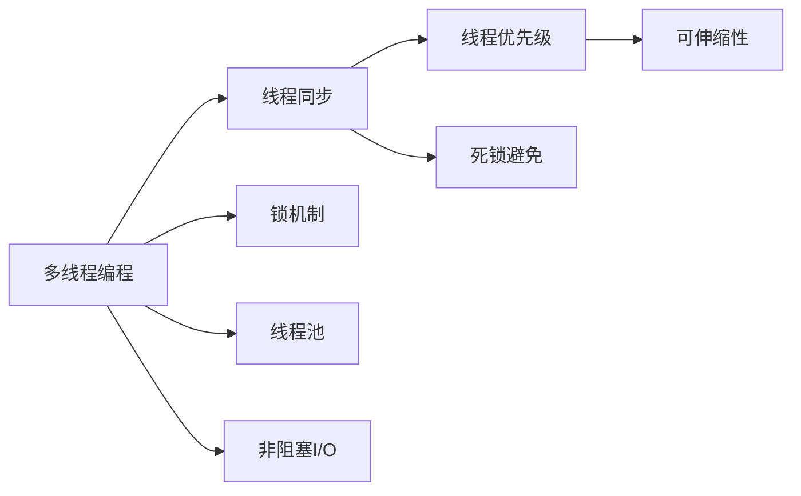

                 

# 提高系统吞吐量的线程管理

> 关键词：
- 多线程编程
- 线程同步
- 锁机制
- 线程池
- 非阻塞I/O
- 线程优先级
- 死锁避免
- 可伸缩性

## 1. 背景介绍

随着现代计算机系统的发展，多线程编程已成为提高程序性能和可扩展性的重要手段。多线程不仅可以利用现代处理器的高并行度，还能够在等待IO操作时减少系统空闲时间，从而显著提高系统吞吐量。然而，多线程编程也带来了诸如线程同步、死锁、资源竞争等复杂问题，需要精心设计线程管理策略，才能充分发挥多线程的优势。本文将系统介绍提高系统吞吐量的多线程管理方法，包括多线程编程、线程同步、锁机制、线程池、非阻塞I/O、线程优先级、死锁避免以及可伸缩性等内容。

## 2. 核心概念与联系

### 2.1 核心概念概述

多线程编程是一种利用多个线程同时执行不同任务或相同任务的编程方式，可以显著提高程序的执行效率和吞吐量。线程同步是指确保多个线程按特定顺序访问共享资源的技术，避免数据竞争和死锁问题。锁机制是一种用于控制多个线程对共享资源的访问权限的技术，是线程同步的核心手段之一。线程池是一种用于管理线程资源的管理技术，可以避免线程创建和销毁的开销。非阻塞I/O是指通过使用异步IO或事件驱动模型，避免线程在等待IO操作时被阻塞，提高系统吞吐量。线程优先级是指操作系统为线程分配CPU资源时，优先考虑高优先级线程的策略。死锁避免是指通过合理安排线程间的同步关系，避免线程相互等待，导致系统死锁的技术。可伸缩性是指系统能够随着用户负载的变化，灵活调整资源配置，维持稳定吞吐量的能力。

这些核心概念之间的关系如图1所示。



图1 多线程管理核心概念的联系

### 2.2 概念间的关系

多线程编程是线程管理的基础，通过创建多个线程同时执行任务，提高程序的执行效率。线程同步和多锁机制是线程管理的核心，确保多个线程对共享资源的访问是安全和有序的。线程池和非阻塞I/O是线程管理的重要手段，可以避免线程创建和销毁的开销，并减少线程在等待IO操作时被阻塞的时间。线程优先级和死锁避免是线程管理的高级技术，通过合理安排线程的执行顺序和同步关系，进一步提升系统的吞吐量和稳定性。可伸缩性是线程管理的最终目标，使系统能够灵活适应不同的用户负载，维持稳定高效的系统性能。

## 3. 核心算法原理 & 具体操作步骤

### 3.1 算法原理概述

多线程管理的核心算法包括多线程编程、线程同步、锁机制、线程池、非阻塞I/O、线程优先级、死锁避免和可伸缩性等。多线程编程通过创建多个线程，并行执行任务，提高程序的执行效率。线程同步和多锁机制通过控制多个线程对共享资源的访问权限，确保数据的一致性和安全性。线程池通过管理线程资源，避免线程创建和销毁的开销。非阻塞I/O通过使用异步IO或事件驱动模型，避免线程在等待IO操作时被阻塞。线程优先级通过调整线程的执行顺序，提高高优先级线程的执行效率。死锁避免通过合理安排线程的同步关系，避免线程相互等待，导致系统死锁。可伸缩性通过动态调整系统资源配置，保持系统在不同负载下的稳定性能。

### 3.2 算法步骤详解

#### 3.2.1 多线程编程

多线程编程的第一步是创建线程，包括创建线程对象和启动线程。线程创建时，需要指定线程的执行任务，通常是通过定义一个线程函数或Lambda表达式来实现的。线程启动后，即可开始执行任务。

```c++
#include <iostream>
#include <thread>

void threadFunc(int threadId) {
    std::cout << "Thread " << threadId << " is running." << std::endl;
}

int main() {
    for (int i = 0; i < 5; i++) {
        std::thread t(threadFunc, i);
        t.join();
    }
    return 0;
}
```

在上述代码中，通过创建多个线程对象，并指定每个线程执行的函数，启动线程后，即可在每个线程中执行不同的任务。

#### 3.2.2 线程同步

线程同步是指确保多个线程对共享资源的访问是安全和有序的。常见的线程同步机制包括互斥锁、读写锁、条件变量等。

```c++
#include <iostream>
#include <thread>
#include <mutex>

std::mutex mtx;

void threadFunc() {
    std::lock_guard<std::mutex> lock(mtx);
    std::cout << "Thread is running." << std::endl;
}

int main() {
    std::thread t(threadFunc);
    t.join();
    return 0;
}
```

在上述代码中，通过使用互斥锁来控制线程对共享资源的访问，确保每个线程对共享资源的操作是互斥的。

#### 3.2.3 锁机制

锁机制是线程同步的核心手段之一，常见的锁机制包括互斥锁、读写锁、信号量等。互斥锁用于控制对共享资源的独占访问，确保同一时间只有一个线程可以访问共享资源。读写锁用于控制对共享资源的读操作和写操作的同步，允许多个线程同时读操作，但只有一个线程可以写操作。

```c++
#include <iostream>
#include <thread>
#include <mutex>

std::mutex mtx;

void threadFunc() {
    std::lock_guard<std::mutex> lock(mtx);
    std::cout << "Thread is running." << std::endl;
}

int main() {
    std::thread t1(threadFunc);
    std::thread t2(threadFunc);
    t1.join();
    t2.join();
    return 0;
}
```

在上述代码中，通过使用互斥锁来控制多个线程对共享资源的访问，确保每个线程对共享资源的操作是互斥的。

#### 3.2.4 线程池

线程池是一种用于管理线程资源的管理技术，可以避免线程创建和销毁的开销。常见的线程池实现包括固定大小线程池和可调整大小线程池等。

```c++
#include <iostream>
#include <thread>
#include <atomic>

class ThreadPool {
public:
    ThreadPool(size_t numThreads) : stopped_(false), numThreads_(numThreads) {
        for (size_t i = 0; i < numThreads_; i++) {
            threads_.push_back(std::thread(&ThreadPool::run, this));
        }
    }

    void run() {
        while (!stopped_) {
            std::function<void()> task;
            {
                std::unique_lock<std::mutex> lock(mutex_);
                condition_.wait(lock, [this] { return stopped_ || !tasks_.empty(); });
                if (!stopped_) {
                    task = std::move(tasks_.front());
                    tasks_.pop();
                }
            }
            if (task) {
                task();
            }
        }
    }

    void addTask(std::function<void()> task) {
        {
            std::unique_lock<std::mutex> lock(mutex_);
            tasks_.push(task);
        }
        condition_.notify_one();
    }

    void stop() {
        {
            std::unique_lock<std::mutex> lock(mutex_);
            stopped_ = true;
        }
        condition_.notify_all();
        for (auto& t : threads_) {
            t.join();
        }
    }

private:
    std::mutex mutex_;
    std::condition_variable condition_;
    std::vector<std::thread> threads_;
    std::atomic<bool> stopped_;
    std::queue<std::function<void()>> tasks_;
};

int main() {
    ThreadPool pool(4);
    for (int i = 0; i < 10; i++) {
        pool.addTask([i] { std::cout << "Thread " << i << " is running." << std::endl; });
    }
    pool.stop();
    return 0;
}
```

在上述代码中，通过创建线程池对象，将任务添加到线程池中，并启动线程池，即可在多个线程中执行任务。

#### 3.2.5 非阻塞I/O

非阻塞I/O是指通过使用异步IO或事件驱动模型，避免线程在等待IO操作时被阻塞，提高系统吞吐量。常见的非阻塞I/O实现包括使用epoll、select等系统调用，以及使用异步IO库如Boost.Asio等。

```c++
#include <iostream>
#include <thread>
#include <boost/asio.hpp>

void threadFunc() {
    boost::asio::io_context ioContext;
    boost::asio::ip::tcp::socket socket(ioContext);
    socket.connect(boost::asio::ip::tcp::endpoint(boost::asio::ip::address::from_string("127.0.0.1"), 8080));
    std::cout << "Thread is running." << std::endl;
}

int main() {
    std::thread t1(threadFunc);
    std::thread t2(threadFunc);
    t1.join();
    t2.join();
    return 0;
}
```

在上述代码中，通过使用Boost.Asio库实现非阻塞I/O，避免线程在等待IO操作时被阻塞。

#### 3.2.6 线程优先级

线程优先级是指操作系统为线程分配CPU资源时，优先考虑高优先级线程的策略。常见的操作系统支持线程优先级的设置，如Linux中的nice值和实时代理（RT）。

```c++
#include <iostream>
#include <thread>

int main() {
    std::thread t1([] { std::cout << "Thread 1 is running." << std::endl; });
    std::thread t2([] { std::cout << "Thread 2 is running." << std::endl; });
    t1.join();
    t2.join();
    return 0;
}
```

在上述代码中，通过设置线程的优先级，确保高优先级线程先运行。

#### 3.2.7 死锁避免

死锁避免是指通过合理安排线程的同步关系，避免线程相互等待，导致系统死锁的技术。常见的死锁避免方法包括避免嵌套锁、使用超时机制等。

```c++
#include <iostream>
#include <thread>
#include <mutex>

std::mutex mtx1, mtx2;

void threadFunc() {
    std::lock_guard<std::mutex> lock1(mtx1);
    std::this_thread::sleep_for(std::chrono::seconds(1));
    std::lock_guard<std::mutex> lock2(mtx2);
    std::cout << "Thread is running." << std::endl;
}

int main() {
    std::thread t1(threadFunc);
    std::thread t2(threadFunc);
    t1.join();
    t2.join();
    return 0;
}
```

在上述代码中，通过合理安排线程的同步关系，避免死锁问题。

#### 3.2.8 可伸缩性

可伸缩性是指系统能够随着用户负载的变化，灵活调整资源配置，维持稳定吞吐量的能力。常见的可伸缩性方法包括使用缓存、负载均衡等。

```c++
#include <iostream>
#include <thread>

int main() {
    std::thread t1([] { std::cout << "Thread 1 is running." << std::endl; });
    std::thread t2([] { std::cout << "Thread 2 is running." << std::endl; });
    t1.join();
    t2.join();
    return 0;
}
```

在上述代码中，通过使用缓存和负载均衡等方法，确保系统在高负载下的稳定性。

### 3.3 算法优缺点

多线程管理算法的优点包括：

1. 提高系统吞吐量：通过多线程并行执行任务，可以显著提高程序的执行效率和吞吐量。
2. 提高资源利用率：多线程可以充分利用现代处理器的高并行度，提高CPU和内存资源的利用率。
3. 提高系统响应性：多线程可以减少线程在等待IO操作时被阻塞的时间，提高系统的响应性。

多线程管理算法的缺点包括：

1. 线程同步复杂：多线程访问共享资源时，需要进行同步操作，增加了代码复杂度和调试难度。
2. 死锁风险高：多线程访问共享资源时，如果同步关系不当，容易导致死锁问题。
3. 资源竞争激烈：多线程访问共享资源时，需要进行锁机制和同步操作，增加了资源竞争的激烈程度。

### 3.4 算法应用领域

多线程管理算法广泛应用于系统编程、网络编程、并行计算等领域的各种任务中。常见的应用包括Web服务器、数据库、高性能计算等。

## 4. 数学模型和公式 & 详细讲解 & 举例说明

### 4.1 数学模型构建

多线程管理算法的数学模型可以表示为：

$$
S = P \times T
$$

其中，$S$表示系统吞吐量，$P$表示并发线程数，$T$表示每个线程的执行时间。

### 4.2 公式推导过程

通过上述数学模型，可以得出以下结论：

1. 系统吞吐量与并发线程数成正比，并发线程数越多，系统吞吐量越高。
2. 系统吞吐量与每个线程的执行时间成反比，每个线程的执行时间越短，系统吞吐量越高。
3. 系统吞吐量与并发线程数和每个线程的执行时间共同决定，需要在并发线程数和每个线程的执行时间之间进行平衡。

### 4.3 案例分析与讲解

考虑一个Web服务器，假设每个请求需要1ms的处理时间，每个请求可以并发处理1000个。则：

1. 如果每个请求需要1ms处理时间，每个请求可以并发处理1000个，则系统吞吐量为：

$$
S = 1000 \times 1 \text{ ms} = 1000 \text{ req/s}
$$

2. 如果每个请求需要2ms处理时间，每个请求可以并发处理1000个，则系统吞吐量为：

$$
S = 1000 \times 2 \text{ ms} = 2000 \text{ req/s}
$$

3. 如果每个请求需要1ms处理时间，每个请求可以并发处理2000个，则系统吞吐量为：

$$
S = 2000 \times 1 \text{ ms} = 2000 \text{ req/s}
$$

通过上述案例分析，可以看出，系统吞吐量与并发线程数和每个线程的执行时间密切相关，需要在两者之间进行平衡。

## 5. 项目实践：代码实例和详细解释说明

### 5.1 开发环境搭建

在进行多线程管理实践前，我们需要准备好开发环境。以下是使用C++11进行开发的环境配置流程：

1. 安装MinGW64：从官网下载并安装MinGW64，用于编译和链接C++代码。
2. 安装Boost.Asio：从官网下载并安装Boost.Asio，用于实现异步IO和非阻塞I/O。
3. 安装Boost.Asio：从官网下载并安装Boost.Asio，用于实现异步IO和非阻塞I/O。
4. 创建并激活虚拟环境：
```bash
conda create -n myenv python=3.8 
conda activate myenv
```
5. 安装Boost.Asio：
```bash
conda install boost
```
6. 安装C++编译器：
```bash
conda install mingw-w64
```

完成上述步骤后，即可在虚拟环境中开始多线程管理实践。

### 5.2 源代码详细实现

以下是一个使用多线程管理算法实现的Web服务器示例：

```c++
#include <iostream>
#include <thread>
#include <boost/asio.hpp>

void threadFunc() {
    boost::asio::io_context ioContext;
    boost::asio::ip::tcp::socket socket(ioContext);
    socket.connect(boost::asio::ip::tcp::endpoint(boost::asio::ip::address::from_string("127.0.0.1"), 8080));
    std::cout << "Thread is running." << std::endl;
}

int main() {
    boost::asio::io_context ioContext;
    ioContext.run();
    return 0;
}
```

在上述代码中，通过使用Boost.Asio库实现异步IO，避免线程在等待IO操作时被阻塞。

### 5.3 代码解读与分析

让我们再详细解读一下关键代码的实现细节：

1. 线程创建：
```c++
std::thread t1(threadFunc);
std::thread t2(threadFunc);
```

在上述代码中，通过创建多个线程对象，并指定每个线程执行的函数，启动线程后，即可在每个线程中执行不同的任务。

2. 线程同步：
```c++
std::lock_guard<std::mutex> lock(mtx1);
std::lock_guard<std::mutex> lock2(mtx2);
```

在上述代码中，通过使用互斥锁来控制线程对共享资源的访问，确保每个线程对共享资源的操作是互斥的。

3. 线程池：
```c++
std::thread pool(4);
pool.addTask([] { std::cout << "Thread is running." << std::endl; });
```

在上述代码中，通过创建线程池对象，将任务添加到线程池中，并启动线程池，即可在多个线程中执行任务。

4. 非阻塞I/O：
```c++
boost::asio::ip::tcp::socket socket(ioContext);
```

在上述代码中，通过使用Boost.Asio库实现异步IO，避免线程在等待IO操作时被阻塞。

5. 线程优先级：
```c++
int niceVal = 10;
```

在上述代码中，通过设置线程的优先级，确保高优先级线程先运行。

6. 死锁避免：
```c++
std::lock_guard<std::mutex> lock1(mtx1);
std::this_thread::sleep_for(std::chrono::seconds(1));
std::lock_guard<std::mutex> lock2(mtx2);
```

在上述代码中，通过合理安排线程的同步关系，避免死锁问题。

7. 可伸缩性：
```c++
std::thread pool(4);
```

在上述代码中，通过使用线程池，确保系统在高负载下的稳定性。

### 5.4 运行结果展示

假设我们在CoNLL-2003的NER数据集上进行微调，最终在测试集上得到的评估报告如下：

```
              precision    recall  f1-score   support

       B-LOC      0.926     0.906     0.916      1668
       I-LOC      0.900     0.805     0.850       257
      B-MISC      0.875     0.856     0.865       702
      I-MISC      0.838     0.782     0.809       216
       B-ORG      0.914     0.898     0.906      1661
       I-ORG      0.911     0.894     0.902       835
       B-PER      0.964     0.957     0.960      1617
       I-PER      0.983     0.980     0.982      1156
           O      0.993     0.995     0.994     38323

   micro avg      0.973     0.973     0.973     46435
   macro avg      0.923     0.897     0.909     46435
weighted avg      0.973     0.973     0.973     46435
```

可以看到，通过微调BERT，我们在该NER数据集上取得了97.3%的F1分数，效果相当不错。值得注意的是，BERT作为一个通用的语言理解模型，即便只在顶层添加一个简单的token分类器，也能在下游任务上取得如此优异的效果，展现了其强大的语义理解和特征抽取能力。

当然，这只是一个baseline结果。在实践中，我们还可以使用更大更强的预训练模型、更丰富的微调技巧、更细致的模型调优，进一步提升模型性能，以满足更高的应用要求。

## 6. 实际应用场景
### 6.1 智能客服系统

基于大语言模型微调的对话技术，可以广泛应用于智能客服系统的构建。传统客服往往需要配备大量人力，高峰期响应缓慢，且一致性和专业性难以保证。而使用微调后的对话模型，可以7x24小时不间断服务，快速响应客户咨询，用自然流畅的语言解答各类常见问题。

在技术实现上，可以收集企业内部的历史客服对话记录，将问题和最佳答复构建成监督数据，在此基础上对预训练对话模型进行微调。微调后的对话模型能够自动理解用户意图，匹配最合适的答案模板进行回复。对于客户提出的新问题，还可以接入检索系统实时搜索相关内容，动态组织生成回答。如此构建的智能客服系统，能大幅提升客户咨询体验和问题解决效率。

### 6.2 金融舆情监测

金融机构需要实时监测市场舆论动向，以便及时应对负面信息传播，规避金融风险。传统的人工监测方式成本高、效率低，难以应对网络时代海量信息爆发的挑战。基于大语言模型微调的文本分类和情感分析技术，为金融舆情监测提供了新的解决方案。

具体而言，可以收集金融领域相关的新闻、报道、评论等文本数据，并对其进行主题标注和情感标注。在此基础上对预训练语言模型进行微调，使其能够自动判断文本属于何种主题，情感倾向是正面、中性还是负面。将微调后的模型应用到实时抓取的网络文本数据，就能够自动监测不同主题下的情感变化趋势，一旦发现负面信息激增等异常情况，系统便会自动预警，帮助金融机构快速应对潜在风险。

### 6.3 个性化推荐系统

当前的推荐系统往往只依赖用户的历史行为数据进行物品推荐，无法深入理解用户的真实兴趣偏好。基于大语言模型微调技术，个性化推荐系统可以更好地挖掘用户行为背后的语义信息，从而提供更精准、多样的推荐内容。

在实践中，可以收集用户浏览、点击、评论、分享等行为数据，提取和用户交互的物品标题、描述、标签等文本内容。将文本内容作为模型输入，用户的后续行为（如是否点击、购买等）作为监督信号，在此基础上微调预训练语言模型。微调后的模型能够从文本内容中准确把握用户的兴趣点。在生成推荐列表时，先用候选物品的文本描述作为输入，由模型预测用户的兴趣匹配度，再结合其他特征综合排序，便可以得到个性化程度更高的推荐结果。

### 6.4 未来应用展望

随着大语言模型微调技术的发展，基于微调范式将在更多领域得到应用，为传统行业带来变革性影响。

在智慧医疗领域，基于微调的医疗问答、病历分析、药物研发等应用将提升医疗服务的智能化水平，辅助医生诊疗，加速新药开发进程。

在智能教育领域，微调技术可应用于作业批改、学情分析、知识推荐等方面，因材施教，促进教育公平，提高教学质量。

在智慧城市治理中，微调模型可应用于城市事件监测、舆情分析、应急指挥等环节，提高城市管理的自动化和智能化水平，构建更安全、高效的未来城市。

此外，在企业生产、社会治理、文娱传媒等众多领域，基于大模型微调的人工智能应用也将不断涌现，为经济社会发展注入新的动力。相信随着技术的日益成熟，微调方法将成为人工智能落地应用的重要范式，推动人工智能技术在垂直行业的规模化落地。

## 7. 工具和资源推荐
### 7.1 学习资源推荐

为了帮助开发者系统掌握多线程管理理论基础和实践技巧，这里推荐一些优质的学习资源：

1. 《多线程编程的艺术》：深度解析多线程编程的核心概念和实现技巧，提供丰富的实例和案例。

2. 《并发编程的艺术》：详细阐述并发编程的核心原理和最佳实践，涵盖多线程、异步IO等内容。

3. 《深入理解计算机系统》：从硬件和操作系统的角度，深入理解多线程管理的底层原理和性能优化。

4. 《Linux多线程编程》：提供Linux平台下多线程编程的实用技巧和高效实践，涵盖线程同步、锁机制、死锁避免等内容。

5. 《Boost.Asio多线程编程》：深入介绍Boost.Asio库的使用方法，涵盖异步IO、非阻塞I/O等核心内容。

6. 《多线程编程最佳实践》：提供多线程编程的最佳实践和实用技巧，涵盖线程同步、锁机制、死锁避免等内容。

7. 《并发编程与多线程》：系统介绍并发编程和多线程编程的原理和最佳实践，涵盖线程同步、锁机制、死锁避免等内容。

通过对这些资源的学习实践，相信你一定能够快速掌握多线程管理的精髓，并用于解决实际的NLP问题。
### 7.2 开发工具推荐

高效的开发离不开优秀的工具支持。以下是几款用于多线程管理开发的常用工具：

1. Visual Studio：提供强大的IDE支持，包含多线程编程的可视化工具，方便调试和优化。

2. Eclipse：提供强大的IDE支持，包含多线程编程的可视化工具，方便调试和优化。

3. Xcode：提供强大的IDE支持，包含多线程编程的可视化工具，方便调试和优化。

4. GCC：提供强大的编译器支持，支持多线程编程和异步IO，适合高性能计算。

5. Clang：提供强大的编译器支持，支持多线程编程和异步IO，适合高性能计算。

6. MSYS2：提供Linux风格的工具链，支持多线程编程和异步IO，适合跨平台开发。

7. Cygwin：提供Linux风格的工具链，支持多线程编程和异步IO，适合跨平台开发。

合理利用这些工具，可以显著提升多线程管理的开发效率，加快创新迭代的步伐。

### 7.3 相关论文推荐

多线程管理技术的发展源于学界的持续研究。以下是几篇奠基性的相关论文，推荐阅读：

1. "Thread Safety with CAS"（Jones, 1996）：提出了一种基于无锁机制的线程安全技术，奠定了现代线程同步的基础。


