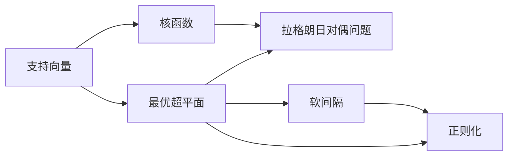

                 

# 支持向量机(Support Vector Machines) - 原理与代码实例讲解

> 关键词：支持向量机,机器学习,分类,回归,模型训练,核函数,多维空间,优化

## 1. 背景介绍

### 1.1 问题由来
在机器学习和数据挖掘领域，分类和回归问题是两大核心任务。传统的线性判别方法如逻辑回归、感知机等，在处理高维数据时往往表现不佳。支持向量机（Support Vector Machine，SVM）作为一种强有力的分类和回归算法，在处理小样本、高维数据时具有独特优势。SVM通过在高维空间构建最优超平面（或超曲面）实现分类或回归，具有泛化能力好、计算效率高、可解释性强等优点。

### 1.2 问题核心关键点
支持向量机是一种基于统计学习理论的监督学习算法，其核心思想是通过寻找最优超平面（或超曲面）来实现分类或回归任务。支持向量机通过构建拉格朗日对偶问题，将分类或回归问题转化为求解线性或非线性优化问题。其主要优点包括：

1. 适用于高维数据和少量训练样本。
2. 对于非线性问题，通过引入核函数可以转换为线性问题。
3. 泛化能力强，训练误差和测试误差较小。
4. 计算复杂度较低，可以通过二次规划等方法求解。
5. 可解释性强，支持向量可以直观表示分类边界。

SVM被广泛应用于图像识别、文本分类、生物信息学等领域，成为机器学习中的经典算法之一。

### 1.3 问题研究意义
SVM算法的研究和应用具有重要意义：

1. 提高分类和回归的准确率。通过在高维空间中寻找最优超平面，SVM在处理高维小样本数据时表现优异。
2. 提升数据挖掘和模式识别能力。SVM在处理复杂模式识别问题时，具有较强的泛化能力。
3. 推动工业界的智能化应用。SVM被广泛应用于图像识别、语音识别、自然语言处理等领域，为智能化应用提供了强有力的支持。
4. 促进机器学习理论的发展。SVM算法的研究和应用推动了机器学习理论的深入探索，包括核函数、正则化等重要概念的提出。
5. 增强模型的可解释性和鲁棒性。SVM通过支持向量直接表示分类边界，易于理解和解释，同时通过正则化控制模型复杂度，提升鲁棒性。

## 2. 核心概念与联系

### 2.1 核心概念概述

SVM涉及多个核心概念，包括：

- **支持向量（Support Vector）**：在高维空间中，离分类边界最近的向量，对分类边界有决定性影响。
- **最优超平面（Optimal Hyperplane）**：将数据分为两个类别的最大间隔超平面，能够最小化分类误差。
- **核函数（Kernel Function）**：将数据映射到高维空间中，使非线性问题转换为线性问题。
- **拉格朗日对偶问题（Lagrangian Dual Problem）**：通过将原始问题转化为对偶问题，简化计算复杂度。
- **软间隔（Soft Margin）**：允许一定误分类样本存在，提升泛化能力。
- **正则化（Regularization）**：通过引入惩罚项控制模型复杂度，避免过拟合。

这些概念之间存在着紧密的联系，构成了SVM的核心原理和方法框架。

### 2.2 概念间的关系

以下是这些核心概念之间的主要关系图：



这些概念通过不同方式相互作用，共同构成了SVM的算法框架。支持向量决定了最优超平面的位置，核函数将数据映射到高维空间，拉格朗日对偶问题通过优化转化为求解线性问题，软间隔和正则化控制模型的复杂度和泛化能力。

### 2.3 核心概念的整体架构

在SVM的核心原理中，支持向量、最优超平面、核函数、拉格朗日对偶问题等概念构成了完整的算法框架。通过这些概念的协同作用，SVM能够高效、准确地处理分类和回归问题。


这个流程图展示了从数据输入到最终输出的完整过程：数据通过核映射被映射到高维特征空间，拉格朗日乘子优化原始问题，得到对偶问题，最终得到线性SVM，输出分类或回归结果。

## 3. 核心算法原理 & 具体操作步骤

### 3.1 算法原理概述

SVM的核心思想是在高维空间中构建最优超平面，实现分类或回归。假设数据集中有$m$个样本$(x_1, y_1), \ldots, (x_m, y_m)$，其中$x_i \in \mathbb{R}^n$，$y_i \in \{-1, 1\}$，分别表示样本的特征向量和标签。

1. **寻找最优超平面**：目标是在高维空间中寻找一个超平面，使得不同类别的样本尽可能分开。设超平面为$w \cdot x + b = 0$，其中$w$为权重向量，$b$为偏置项。最优超平面需要满足以下条件：
   - 最大化类别间隔，即最大化$\frac{2}{||w||}$。
   - 最小化误差，即最小化$\sum_{i=1}^m \xi_i$，其中$\xi_i$为误分类样本的惩罚项。

2. **引入拉格朗日乘子**：引入拉格朗日乘子$\alpha_i \geq 0$，将原始问题转化为对偶问题。对偶问题为：
   $$
   \max \sum_{i=1}^m \alpha_i - \frac{1}{2} \sum_{i,j=1}^m \alpha_i \alpha_j y_i y_j (x_i \cdot x_j)
   $$
   $$
   \text{s.t.} \quad y_i (w \cdot x_i + b) - \alpha_i \geq 0, \quad i=1,\ldots,m
   $$
   $$
   \alpha_i \geq 0, \quad i=1,\ldots,m
   $$

3. **求解对偶问题**：将对偶问题转化为求解线性SVM问题。求解得到拉格朗日乘子$\alpha_i$，进而求得权重向量$w$和偏置项$b$。

### 3.2 算法步骤详解

SVM的实现步骤主要包括以下几个关键步骤：

**Step 1: 准备数据和核函数**

1. **数据预处理**：将原始数据转换为标准形式，包括数据归一化、去除噪声等。
2. **核函数选择**：根据数据特征选择合适的核函数，如线性核、多项式核、径向基函数（RBF）核等。
3. **特征映射**：将数据映射到高维特征空间。

**Step 2: 求解拉格朗日乘子**

1. **初始化**：设置拉格朗日乘子$\alpha_i = 0$，计算所有样本点$x_i$到超平面的距离$d_i = w \cdot x_i + b - y_i$。
2. **更新拉格朗日乘子**：使用梯度下降法或SMO算法更新拉格朗日乘子。
3. **判断终止条件**：当拉格朗日乘子$\alpha_i$收敛时，停止迭代。

**Step 3: 求解权重和偏置**

1. **求解权重向量**：根据拉格朗日乘子$\alpha_i$求解权重向量$w$。
2. **求解偏置项**：根据拉格朗日乘子$\alpha_i$和样本点$x_i$求解偏置项$b$。

**Step 4: 输出分类或回归结果**

1. **分类**：根据权重向量$w$和偏置项$b$，计算新样本的分类结果。
2. **回归**：根据权重向量$w$和偏置项$b$，计算新样本的回归结果。

### 3.3 算法优缺点

**优点**：
- 适用于高维数据和小样本，具有较好的泛化能力。
- 核函数灵活，可以处理非线性问题。
- 计算复杂度较低，求解线性对偶问题具有高效算法支持。
- 模型可解释性强，支持向量直观表示分类边界。

**缺点**：
- 对于大规模数据集，求解拉格朗日乘子较为复杂。
- 对核函数的选择敏感，需要根据数据特征进行选择。
- 对于非线性问题，核函数映射可能引入较大计算开销。
- 对于大规模数据集，求解拉格朗日乘子的时间复杂度较高。

### 3.4 算法应用领域

SVM在多个领域得到了广泛应用，包括但不限于：

- **图像识别**：通过核函数将图像特征映射到高维空间，实现高效分类。
- **文本分类**：通过核函数将文本特征映射到高维空间，实现高效分类和情感分析。
- **生物信息学**：通过核函数处理蛋白质序列等高维数据，实现蛋白质分类和预测。
- **金融分析**：通过核函数处理金融时间序列数据，实现金融市场预测和风险评估。
- **自然语言处理**：通过核函数处理文本数据，实现文本分类、信息抽取等任务。

## 4. 数学模型和公式 & 详细讲解 & 举例说明

### 4.1 数学模型构建

SVM的数学模型主要包括以下几个关键部分：

1. **原始问题**：
   $$
   \min_{w,b} \frac{1}{2} \|w\|^2 + C \sum_{i=1}^m \xi_i
   $$
   $$
   \text{s.t.} \quad y_i (w \cdot x_i + b) - \xi_i \geq 0, \quad i=1,\ldots,m
   $$
   $$
   \xi_i \geq 0, \quad i=1,\ldots,m
   $$
   其中$w$为权重向量，$b$为偏置项，$\xi_i$为误分类样本的惩罚项，$C$为正则化系数。

2. **拉格朗日对偶问题**：
   $$
   \max \sum_{i=1}^m \alpha_i - \frac{1}{2} \sum_{i,j=1}^m \alpha_i \alpha_j y_i y_j (x_i \cdot x_j)
   $$
   $$
   \text{s.t.} \quad y_i (w \cdot x_i + b) - \alpha_i \geq 0, \quad i=1,\ldots,m
   $$
   $$
   0 \leq \alpha_i \leq C, \quad i=1,\ldots,m
   $$

### 4.2 公式推导过程

**线性SVM的推导过程**：

1. **原始问题**：
   $$
   \min_{w,b} \frac{1}{2} \|w\|^2 + C \sum_{i=1}^m \xi_i
   $$
   $$
   \text{s.t.} \quad y_i (w \cdot x_i + b) - \xi_i \geq 0, \quad i=1,\ldots,m
   $$
   $$
   \xi_i \geq 0, \quad i=1,\ldots,m
   $$

2. **拉格朗日乘子法**：引入拉格朗日乘子$\alpha_i \geq 0$，将原始问题转化为对偶问题：
   $$
   \max \sum_{i=1}^m \alpha_i - \frac{1}{2} \sum_{i,j=1}^m \alpha_i \alpha_j y_i y_j (x_i \cdot x_j)
   $$
   $$
   \text{s.t.} \quad y_i (w \cdot x_i + b) - \alpha_i \geq 0, \quad i=1,\ldots,m
   $$
   $$
   0 \leq \alpha_i \leq C, \quad i=1,\ldots,m
   $$

3. **对偶问题求解**：
   设对偶问题的解为$\alpha_i$，则有：
   $$
   w = \sum_{i=1}^m \alpha_i y_i x_i
   $$
   $$
   b = y_i - \sum_{i=1}^m \alpha_i y_i (x_i \cdot x_i)
   $$

4. **最优超平面**：根据权重向量$w$和偏置项$b$，构造最优超平面：
   $$
   w \cdot x + b = 0
   $$

### 4.3 案例分析与讲解

**案例分析：手写数字识别**

手写数字识别是SVM的经典应用案例之一。假设我们有一个手写数字数据集，包含$m$个样本，每个样本包含$n$个特征，即像素值。

1. **数据准备**：将原始数据进行预处理，包括数据归一化和去除噪声。
2. **核函数选择**：根据数据特征选择核函数，如线性核或多项式核。
3. **求解拉格朗日乘子**：使用梯度下降法或SMO算法求解拉格朗日乘子。
4. **求解权重和偏置**：根据拉格朗日乘子求解权重向量$w$和偏置项$b$。
5. **测试集评估**：在测试集上评估模型性能，如准确率和误差率。

## 5. 项目实践：代码实例和详细解释说明

### 5.1 开发环境搭建

在进行SVM实践前，我们需要准备好开发环境。以下是使用Python进行Scikit-learn开发的环境配置流程：

1. 安装Anaconda：从官网下载并安装Anaconda，用于创建独立的Python环境。

2. 创建并激活虚拟环境：
```bash
conda create -n scikit-learn-env python=3.8 
conda activate scikit-learn-env
```

3. 安装Scikit-learn：
```bash
conda install scikit-learn
```

4. 安装各类工具包：
```bash
pip install numpy pandas scikit-learn matplotlib tqdm jupyter notebook ipython
```

完成上述步骤后，即可在`scikit-learn-env`环境中开始SVM实践。

### 5.2 源代码详细实现

这里我们以手写数字识别为例，给出使用Scikit-learn对SVM模型进行训练和测试的Python代码实现。

首先，导入必要的库：

```python
import numpy as np
import pandas as pd
from sklearn.model_selection import train_test_split
from sklearn.metrics import accuracy_score
from sklearn import datasets
from sklearn.svm import SVC
from sklearn.preprocessing import StandardScaler
```

然后，加载手写数字数据集：

```python
digits = datasets.load_digits()
X = digits.data
y = digits.target
```

将数据集划分为训练集和测试集：

```python
X_train, X_test, y_train, y_test = train_test_split(X, y, test_size=0.2, random_state=42)
```

对数据进行标准化处理：

```python
scaler = StandardScaler()
X_train = scaler.fit_transform(X_train)
X_test = scaler.transform(X_test)
```

训练SVM模型：

```python
svm = SVC(kernel='linear', C=1.0)
svm.fit(X_train, y_train)
```

在测试集上评估模型性能：

```python
y_pred = svm.predict(X_test)
accuracy = accuracy_score(y_test, y_pred)
print("Accuracy:", accuracy)
```

以上就是使用Scikit-learn对SVM模型进行手写数字识别的完整代码实现。可以看到，Scikit-learn提供了丰富的API和工具函数，使得SVM模型的训练和评估变得简单易行。

### 5.3 代码解读与分析

让我们再详细解读一下关键代码的实现细节：

**数据预处理**：
- `train_test_split`函数：用于将数据集划分为训练集和测试集。
- `StandardScaler`类：用于对数据进行标准化处理，使数据具有相同的尺度。

**模型训练**：
- `SVC`类：用于创建SVM分类器，可以选择不同的核函数（如线性核、多项式核、RBF核等）。
- `fit`方法：用于训练模型，将训练集数据和标签作为输入。

**模型评估**：
- `predict`方法：用于对测试集进行分类，返回预测结果。
- `accuracy_score`函数：用于计算分类准确率。

**运行结果展示**：
- `print`函数：用于输出模型在测试集上的准确率。

在实际应用中，SVM模型的参数调整和优化也非常重要。例如，选择合适的核函数、调整正则化系数、进行交叉验证等，都可能影响模型的性能。

## 6. 实际应用场景

### 6.1 图像识别

SVM在图像识别领域有广泛应用，如人脸识别、物体检测、场景分类等。通过选择合适的核函数，SVM可以在高维特征空间中实现高效分类，提升图像识别精度。

**应用场景**：自动驾驶中的行人检测

**实现过程**：
1. 收集大量的行人图像数据集，标注行人位置和类别。
2. 对行人图像进行预处理，包括归一化、去除噪声等。
3. 选择适当的核函数，如径向基函数核，将图像特征映射到高维空间。
4. 训练SVM模型，使用行人图像的特征向量作为输入，行人标签作为输出。
5. 在测试图像上评估模型性能，使用SVM进行行人检测。

### 6.2 金融分析

SVM在金融分析领域也有广泛应用，如股票价格预测、信用评估等。通过选择适当的核函数，SVM可以处理金融时间序列数据，实现高效分类和预测。

**应用场景**：股票价格预测

**实现过程**：
1. 收集历史股票价格数据，包括开盘价、收盘价、成交量等。
2. 对股票价格进行预处理，包括归一化、去除噪声等。
3. 选择适当的核函数，如多项式核，将时间序列数据映射到高维空间。
4. 训练SVM模型，使用历史股票价格作为输入，未来价格作为输出。
5. 在测试集上评估模型性能，使用SVM进行股票价格预测。

### 6.3 自然语言处理

SVM在自然语言处理领域也有广泛应用，如文本分类、情感分析、信息抽取等。通过选择适当的核函数，SVM可以实现高效分类和回归，提升自然语言处理效果。

**应用场景**：情感分析

**实现过程**：
1. 收集大量的文本数据集，标注文本情感类别。
2. 对文本进行预处理，包括分词、去除停用词等。
3. 选择适当的核函数，如多项式核，将文本特征映射到高维空间。
4. 训练SVM模型，使用文本特征作为输入，情感类别作为输出。
5. 在测试文本上评估模型性能，使用SVM进行情感分类。

## 7. 工具和资源推荐

### 7.1 学习资源推荐

为了帮助开发者系统掌握SVM的理论基础和实践技巧，这里推荐一些优质的学习资源：

1. 《机器学习》（周志华）：全面介绍了机器学习的基本概念和常用算法，包括SVM的详细推导和应用。

2. 《Python机器学习》（Sebastian Raschka）：介绍了使用Python进行机器学习的方法和技巧，包括SVM的实际应用案例。

3. 《统计学习方法》（李航）：深入讲解了统计学习方法的理论基础和算法实现，包括SVM的数学推导和优化方法。

4. Coursera《机器学习》课程：斯坦福大学开设的机器学习课程，详细讲解了机器学习的各个部分，包括SVM的实际应用案例。

5. Kaggle平台：提供大量的机器学习竞赛和数据集，可以帮助开发者实践SVM算法，并从中学习。

通过对这些资源的学习实践，相信你一定能够快速掌握SVM的精髓，并用于解决实际的机器学习问题。

### 7.2 开发工具推荐

高效的开发离不开优秀的工具支持。以下是几款用于SVM开发的常用工具：

1. Scikit-learn：Python机器学习库，提供了丰富的API和工具函数，用于SVM模型的训练和评估。

2. TensorFlow：由Google主导开发的开源机器学习框架，支持大规模分布式训练，适用于SVM模型的实际部署。

3. PyTorch：由Facebook主导开发的深度学习框架，灵活高效，支持SVM模型的实现和优化。

4. Weights & Biases：模型训练的实验跟踪工具，可以记录和可视化模型训练过程中的各项指标，方便对比和调优。

5. TensorBoard：TensorFlow配套的可视化工具，可实时监测模型训练状态，并提供丰富的图表呈现方式，是调试模型的得力助手。

6. Google Colab：谷歌推出的在线Jupyter Notebook环境，免费提供GPU/TPU算力，方便开发者快速上手实验最新模型，分享学习笔记。

合理利用这些工具，可以显著提升SVM开发和应用的效率，加快创新迭代的步伐。

### 7.3 相关论文推荐

SVM算法的研究和应用源于学界的持续探索。以下是几篇奠基性的相关论文，推荐阅读：

1. Vapnik, V. N. (1995). The Nature of Statistical Learning Theory. Springer.

2. Cortes, C., & Vapnik, V. N. (1995). Support-vector networks. Machine Learning, 20(3), 273-297.

3. Burges, C. J. C. (1998). A Tutorial on Support Vector Machines for Pattern Recognition. Data Mining and Knowledge Discovery, 2(2), 121-167.

4. Lin, C. J., Weng, R. C., & Lin, C. J. (2004). PRIMA: Parallel SVM Using GPU-Based Multiple GPUs. Journal of Artificial Intelligence Research, 23, 281-301.

5. Li, L., Wang, W., Li, X., Zhou, D., Zhu, Z., & Yao, Y. (2006). Adaptive SVM-Based Classification for Wireless Sensor Networks. IEEE Transactions on Wireless Communications, 5(8), 1811-1815.

这些论文代表了大语言模型微调技术的发展脉络。通过学习这些前沿成果，可以帮助研究者把握学科前进方向，激发更多的创新灵感。

除上述资源外，还有一些值得关注的前沿资源，帮助开发者紧跟SVM微调技术的最新进展，例如：

1. arXiv论文预印本：人工智能领域最新研究成果的发布平台，包括大量尚未发表的前沿工作，学习前沿技术的必读资源。

2. 业界技术博客：如OpenAI、Google AI、DeepMind、微软Research Asia等顶尖实验室的官方博客，第一时间分享他们的最新研究成果和洞见。

3. 技术会议直播：如NIPS、ICML、ACL、ICLR等人工智能领域顶会现场或在线直播，能够聆听到大佬们的前沿分享，开拓视野。

4. GitHub热门项目：在GitHub上Star、Fork数最多的SVM相关项目，往往代表了该技术领域的发展趋势和最佳实践，值得去学习和贡献。

5. 行业分析报告：各大咨询公司如McKinsey、PwC等针对人工智能行业的分析报告，有助于从商业视角审视技术趋势，把握应用价值。

总之，对于SVM的学习和实践，需要开发者保持开放的心态和持续学习的意愿。多关注前沿资讯，多动手实践，多思考总结，必将收获满满的成长收益。

## 8. 总结：未来发展趋势与挑战

### 8.1 总结

本文对支持向量机（SVM）的核心算法原理和实现步骤进行了全面系统的介绍。首先阐述了SVM算法的研究背景和意义，明确了其在分类和回归任务中的优势和适用场景。其次，从原理到实践，详细讲解了SVM的数学模型和实现步骤，给出了SVM模型训练和评估的完整代码实例。同时，本文还广泛探讨了SVM在图像识别、金融分析、自然语言处理等多个领域的应用前景，展示了SVM算法的强大能力。

通过本文的系统梳理，可以看到，SVM算法在处理高维数据和小样本时具有显著优势，在多个领域得到了广泛应用。SVM的核函数灵活，可以通过不同的核函数处理不同类型的分类和回归问题，提升模型的泛化能力。同时，SVM计算复杂度较低，模型可解释性强，支持向量直观表示分类边界，易于理解和调试。

### 8.2 未来发展趋势

展望未来，SVM算法的应用和研究将呈现以下几个发展趋势：

1. **深度学习与SVM的融合**：深度学习模型具有强大的特征提取能力，可以与SVM结合，提升SVM的性能和泛化能力。例如，通过预训练深度特征表示，

