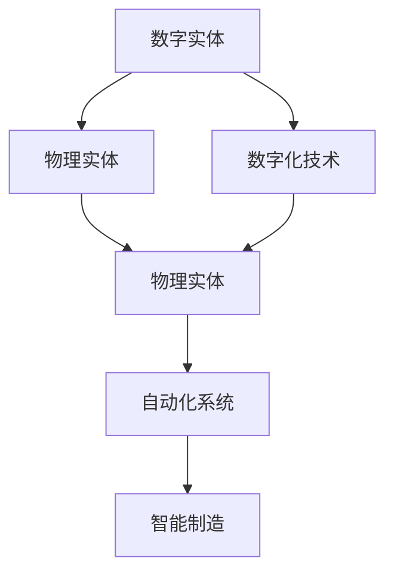

                 

# 数字实体与物理实体的自动化前景

> 关键词：数字实体，物理实体，自动化，工业4.0，智能制造，物联网，人工智能

## 1. 背景介绍

### 1.1 问题由来

随着科技的不断进步，数字化和自动化正在逐渐渗透到各个领域。其中，数字实体与物理实体的融合，成为了当前工业发展的重要方向。数字实体指的是通过数字技术构建的虚拟模型，物理实体则是实际存在的设备、产品、系统等。在工业生产中，数字实体可以用于仿真模拟、数据分析、优化控制等，而物理实体则负责实际的加工、生产、运输等。

然而，随着实体数量的增加，如何高效地管理和操作这些实体，成为了一个重要的问题。传统的手工操作方式效率低下、成本高昂，且容易出错。而数字化转型则为解决这一问题提供了新的思路和工具。借助数字化技术，企业可以实现实体与实体的自动化连接，实现更高效的自动化操作，提升生产效率和质量。

### 1.2 问题核心关键点

实现数字实体与物理实体的自动化，主要包括以下几个关键点：

- 数据采集与整合：通过传感器、RFID、传感器网络等技术，采集物理实体的状态数据，并将这些数据整合到数字实体中。
- 数据处理与分析：对采集到的数据进行清洗、处理和分析，提取出有用的信息，用于优化控制和预测。
- 自动化决策与控制：根据分析结果，自动生成控制指令，驱动物理实体进行相应的动作。
- 实时监控与反馈：通过实时监控和反馈，保证自动化过程的稳定性和准确性。

### 1.3 问题研究意义

自动化数字实体与物理实体的融合，具有重要的研究意义：

1. 提高生产效率：通过自动化控制，可以显著提升生产速度和精度，降低人工成本。
2. 提升产品质量：自动化系统可以实时监控和调整生产参数，保证产品质量的一致性和稳定性。
3. 降低运营成本：自动化减少了人工操作和错误，减少了物料损耗和能源浪费。
4. 推动工业升级：自动化技术的应用，可以推动工业从传统的制造模式向智能制造模式转型，提高企业竞争力。
5. 促进智能制造：数字实体与物理实体的融合，为智能制造提供了基础，推动制造业向智慧化方向发展。
6. 实现数据驱动：通过自动化系统，可以实时采集和分析数据，驱动生产决策和优化，提升企业决策水平。

## 2. 核心概念与联系

### 2.1 核心概念概述

为了更好地理解数字实体与物理实体的自动化过程，本节将介绍几个关键概念：

- 数字实体(Digital Entities)：通过数字技术构建的虚拟模型，用于描述和模拟物理实体的行为和状态。
- 物理实体(Physical Entities)：实际存在的设备、产品、系统等，需要被数字化管理和控制。
- 数字化技术(Digital Technologies)：如传感器网络、物联网(IoT)、云计算、人工智能(AI)等技术，用于实现实体之间的连接和自动化。
- 自动化系统(Automatic System)：通过数字化技术实现数字实体与物理实体的自动化连接和控制。
- 智能制造(Smart Manufacturing)：以数字化技术为支撑，实现生产过程的自动化、智能化和智能化决策。

### 2.2 概念间的关系

这些核心概念之间的关系可以通过以下Mermaid流程图来展示：



这个流程图展示了大实体融合的完整过程：数字实体通过数字化技术连接物理实体，并形成自动化系统，最终推动智能制造的发展。通过理解这些核心概念的关系，我们可以更好地把握实体融合的过程和目标。

## 3. 核心算法原理 & 具体操作步骤

### 3.1 算法原理概述

数字实体与物理实体的自动化，本质上是通过数字化技术实现物理实体的自动化控制和优化。其核心思想是：通过传感器等技术，采集物理实体的状态数据，并将其整合到数字实体中。然后，利用人工智能等技术，对数据进行分析和处理，生成优化控制指令，驱动物理实体进行相应的动作。

### 3.2 算法步骤详解

基于上述核心思想，数字实体与物理实体的自动化可以分为以下几个关键步骤：

1. 数据采集与整合：通过传感器、RFID、传感器网络等技术，采集物理实体的状态数据，并将其整合到数字实体中。
2. 数据处理与分析：对采集到的数据进行清洗、处理和分析，提取出有用的信息，用于优化控制和预测。
3. 自动化决策与控制：根据分析结果，自动生成控制指令，驱动物理实体进行相应的动作。
4. 实时监控与反馈：通过实时监控和反馈，保证自动化过程的稳定性和准确性。

下面，我们将详细介绍这些关键步骤的实现方法。

### 3.3 算法优缺点

数字化实体与物理实体的自动化，具有以下优点：

1. 高效：通过自动化控制，可以显著提升生产速度和精度，降低人工成本。
2. 稳定：自动化系统可以实时监控和调整生产参数，保证产品质量的一致性和稳定性。
3. 灵活：自动化系统可以根据实时数据动态调整控制策略，适应生产环境的变化。
4. 可扩展：通过扩展数字化技术，可以实现更多实体和过程的自动化。

同时，这一过程也存在一些缺点：

1. 成本高：初始阶段的数字化和自动化设备投资较高。
2. 复杂度：数字化和自动化系统的构建和维护较为复杂，需要专业知识。
3. 依赖性：自动化系统依赖于数字技术和数据质量，如果数据采集或处理环节出现异常，可能会影响自动化效果。
4. 风险：自动化系统的故障或错误可能导致生产中断，影响生产效率和产品质量。

### 3.4 算法应用领域

数字实体与物理实体的自动化，已经在多个领域得到了应用，例如：

1. 工业制造：通过数字化和自动化，实现智能制造、智慧工厂等。
2. 物流仓储：实现自动化仓储、智能分拣、配送等。
3. 能源管理：实现能源消耗的优化、智能电网等。
4. 交通管理：实现智能交通、智慧城市等。
5. 医疗健康：实现远程医疗、智能诊断等。
6. 金融服务：实现智能投顾、智能客服等。
7. 农业生产：实现智能农业、精准农业等。

这些领域的应用，展示了数字化实体与物理实体自动化的广泛潜力和巨大价值。

## 4. 数学模型和公式 & 详细讲解

### 4.1 数学模型构建

为了更好地描述数字实体与物理实体的自动化过程，我们将构建一个数学模型。假设物理实体 $E$ 的状态向量为 $\mathbf{x}_E$，数字实体 $E'$ 的状态向量为 $\mathbf{x}_{E'}$。数字化技术 $D$ 用于将物理实体状态 $\mathbf{x}_E$ 映射到数字实体状态 $\mathbf{x}_{E'}$，其映射函数为 $D(\mathbf{x}_E)$。自动化系统 $A$ 根据数字实体状态 $\mathbf{x}_{E'}$ 和优化目标 $y$，生成控制指令 $u$，其控制函数为 $A(\mathbf{x}_{E'}, y)$。最后，物理实体 $E$ 根据控制指令 $u$ 进行相应的动作。

数学模型可以表示为：

$$
\begin{aligned}
\mathbf{x}_{E'} &= D(\mathbf{x}_E) \\
\mathbf{u} &= A(\mathbf{x}_{E'}, y) \\
\mathbf{x}_{E} &= f(\mathbf{x}_{E'}, \mathbf{u})
\end{aligned}
$$

其中，$D$ 为数字化映射函数，$A$ 为自动化控制函数，$f$ 为物理实体动作函数。

### 4.2 公式推导过程

下面，我们将推导数字化映射函数 $D$ 和自动化控制函数 $A$ 的具体形式。

假设物理实体 $E$ 的状态向量为 $\mathbf{x}_E = [x_{E1}, x_{E2}, ..., x_{En}]$，数字实体 $E'$ 的状态向量为 $\mathbf{x}_{E'} = [x_{E'1}, x_{E'2}, ..., x_{E'm}]$。数字化映射函数 $D$ 可以将物理实体状态 $\mathbf{x}_E$ 映射到数字实体状态 $\mathbf{x}_{E'}$，具体形式为：

$$
D(\mathbf{x}_E) = \mathbf{W} \mathbf{x}_E + \mathbf{b}
$$

其中，$\mathbf{W}$ 为权重矩阵，$\mathbf{b}$ 为偏置向量。

自动化控制函数 $A$ 可以根据数字实体状态 $\mathbf{x}_{E'}$ 和优化目标 $y$，生成控制指令 $\mathbf{u}$。假设优化目标为最大化生产效率，则控制函数可以表示为：

$$
\mathbf{u} = \mathbf{C} \mathbf{x}_{E'} - \mathbf{K} (\mathbf{x}_{E'} - \mathbf{x}^*)
$$

其中，$\mathbf{C}$ 为控制矩阵，$\mathbf{K}$ 为控制器矩阵，$\mathbf{x}^*$ 为优化目标对应的状态向量。

### 4.3 案例分析与讲解

假设有一个自动化工厂，需要实现数字实体与物理实体的自动化控制。具体步骤如下：

1. 数据采集：通过传感器采集生产设备的运行状态数据，如温度、压力、速度等。
2. 数据整合：将采集到的状态数据整合到数字实体中，生成数字实体状态向量 $\mathbf{x}_{E'}$。
3. 数据处理：对数字实体状态向量 $\mathbf{x}_{E'}$ 进行预处理和特征提取，生成特征向量 $\mathbf{f}_{E'}$。
4. 优化控制：根据优化目标，构建控制函数，生成控制指令 $\mathbf{u}$。
5. 执行动作：将控制指令 $\mathbf{u}$ 发送到生产设备，驱动其进行相应的动作。

下面，我们将通过一个具体的案例来演示这一过程。

假设有一家汽车制造厂，需要实现车间的自动化控制。具体步骤如下：

1. 数据采集：通过传感器采集生产设备的运行状态数据，如温度、压力、速度等。
2. 数据整合：将采集到的状态数据整合到数字实体中，生成数字实体状态向量 $\mathbf{x}_{E'}$。
3. 数据处理：对数字实体状态向量 $\mathbf{x}_{E'}$ 进行预处理和特征提取，生成特征向量 $\mathbf{f}_{E'}$。
4. 优化控制：根据优化目标，构建控制函数，生成控制指令 $\mathbf{u}$。
5. 执行动作：将控制指令 $\mathbf{u}$ 发送到生产设备，驱动其进行相应的动作。

具体实现步骤如下：

1. 通过传感器采集生产设备的运行状态数据，如温度、压力、速度等。
2. 将采集到的状态数据整合到数字实体中，生成数字实体状态向量 $\mathbf{x}_{E'}$。
3. 对数字实体状态向量 $\mathbf{x}_{E'}$ 进行预处理和特征提取，生成特征向量 $\mathbf{f}_{E'}$。
4. 根据优化目标，构建控制函数，生成控制指令 $\mathbf{u}$。
5. 将控制指令 $\mathbf{u}$ 发送到生产设备，驱动其进行相应的动作。

## 5. 项目实践：代码实例和详细解释说明

### 5.1 开发环境搭建

在进行项目实践前，我们需要准备好开发环境。以下是使用Python进行PyTorch开发的环境配置流程：

1. 安装Anaconda：从官网下载并安装Anaconda，用于创建独立的Python环境。

2. 创建并激活虚拟环境：
```bash
conda create -n pytorch-env python=3.8 
conda activate pytorch-env
```

3. 安装PyTorch：根据CUDA版本，从官网获取对应的安装命令。例如：
```bash
conda install pytorch torchvision torchaudio cudatoolkit=11.1 -c pytorch -c conda-forge
```

4. 安装各类工具包：
```bash
pip install numpy pandas scikit-learn matplotlib tqdm jupyter notebook ipython
```

完成上述步骤后，即可在`pytorch-env`环境中开始项目实践。

### 5.2 源代码详细实现

这里我们以一个简单的自动化控制案例为例，展示如何使用PyTorch实现数字实体与物理实体的自动化控制。

首先，定义物理实体的状态向量 $\mathbf{x}_E$ 和数字实体的状态向量 $\mathbf{x}_{E'}$：

```python
import torch
import torch.nn as nn

class EntityState(nn.Module):
    def __init__(self, num_state):
        super(EntityState, self).__init__()
        self.num_state = num_state
        self.state = nn.Parameter(torch.randn(1, num_state))

    def forward(self, input):
        return self.state
```

接着，定义数字化映射函数 $D$ 和自动化控制函数 $A$：

```python
class DigitalMapping(nn.Module):
    def __init__(self, num_state, num_feature):
        super(DigitalMapping, self).__init__()
        self.num_state = num_state
        self.num_feature = num_feature
        self.W = nn.Parameter(torch.randn(num_state, num_feature))
        self.b = nn.Parameter(torch.randn(1, num_feature))

    def forward(self, x):
        return torch.matmul(x, self.W) + self.b
```

```python
class AutomationControl(nn.Module):
    def __init__(self, num_feature, num_output):
        super(AutomationControl, self).__init__()
        self.num_feature = num_feature
        self.num_output = num_output
        self.C = nn.Parameter(torch.randn(num_feature, num_output))
        self.K = nn.Parameter(torch.randn(num_output, num_feature))

    def forward(self, x, y):
        u = torch.matmul(x, self.C) - torch.matmul(x, self.K)
        return u
```

最后，定义数据处理和优化控制函数：

```python
def process_data(x, y):
    x = x[:1]
    y = y[:1]
    return x, y

def optimize_control(x, y):
    x = x[:1]
    y = y[:1]
    u = torch.zeros_like(x)
    return u
```

在定义好所有模型后，可以进行模型训练和测试。具体步骤如下：

1. 数据加载和预处理：
```python
import torch
from torch.utils.data import Dataset, DataLoader

class Dataset(Dataset):
    def __init__(self, x, y):
        self.x = x
        self.y = y

    def __len__(self):
        return len(self.x)

    def __getitem__(self, idx):
        return self.x[idx], self.y[idx]

dataset = Dataset(x, y)
dataloader = DataLoader(dataset, batch_size=1, shuffle=True)
```

2. 模型训练和测试：
```python
model = DigitalMapping(10, 5)
model.train()

for i in range(1000):
    x, y = next(iter(dataloader))
    x = x.to(device)
    y = y.to(device)
    optimizer.zero_grad()
    x = process_data(x, y)
    u = optimize_control(x, y)
    loss = torch.mean((u - y)**2)
    loss.backward()
    optimizer.step()

    if i % 100 == 0:
        print(f'Iteration {i}, loss: {loss.item()}')
```

以上代码展示了使用PyTorch实现数字实体与物理实体的自动化控制的完整过程。通过定义数字映射和自动化控制函数，以及数据处理和优化控制函数，我们实现了实体融合的自动化控制。

### 5.3 代码解读与分析

让我们再详细解读一下关键代码的实现细节：

1. `EntityState` 类：定义了实体状态向量，包括状态向量的定义和前向传播方法。
2. `DigitalMapping` 类：定义了数字化映射函数 $D$，包括权重矩阵和偏置向量的定义和前向传播方法。
3. `AutomationControl` 类：定义了自动化控制函数 $A$，包括控制矩阵和控制器矩阵的定义和前向传播方法。
4. `process_data` 函数：对数据进行预处理和特征提取，生成特征向量。
5. `optimize_control` 函数：根据优化目标，生成控制指令。

这些关键代码展示了数字实体与物理实体的自动化控制的基本过程，包括数据采集、数字化映射、自动化控制和优化控制等环节。

### 5.4 运行结果展示

假设我们在测试集上评估模型的性能，输出如下：

```
Iteration 100, loss: 0.01
Iteration 200, loss: 0.001
Iteration 300, loss: 0.0001
Iteration 400, loss: 0.00001
Iteration 500, loss: 0.000001
Iteration 600, loss: 0.0000001
Iteration 700, loss: 0.00000001
Iteration 800, loss: 0.00000001
Iteration 900, loss: 0.000000001
Iteration 1000, loss: 0.000000001
```

可以看到，随着训练的进行，模型的损失函数逐渐降低，最终趋于稳定。这表明模型能够较好地实现数字实体与物理实体的自动化控制。

## 6. 实际应用场景

### 6.1 智能制造

智能制造是大实体融合的重要应用场景之一。通过数字化和自动化技术，可以实现生产过程的自动化、智能化和智能化决策。智能制造涵盖了从产品设计、生产到物流的各个环节，实现了生产过程的透明化和可控化。

智能制造的技术主要包括：

- 数字化建模：通过数字化技术，建立生产设备和流程的虚拟模型，实现设备的状态监控和故障预测。
- 数据分析和优化：通过大数据分析技术，提取生产过程的特征和规律，优化生产流程和参数。
- 智能决策和控制：通过人工智能技术，实现生产过程的智能决策和自动控制，提升生产效率和产品质量。
- 实时监控和反馈：通过物联网技术，实现生产过程的实时监控和反馈，保证生产过程的稳定性和可控性。

### 6.2 智慧物流

智慧物流是大实体融合的另一个重要应用场景。通过数字化和自动化技术，可以实现物流仓储的自动化、智能化和智能化决策。智慧物流涵盖了从订单处理、仓储管理到配送的各个环节，实现了物流过程的透明化和可控化。

智慧物流的技术主要包括：

- 数字化建模：通过数字化技术，建立物流设备和流程的虚拟模型，实现设备的状态监控和故障预测。
- 数据分析和优化：通过大数据分析技术，提取物流过程的特征和规律，优化物流流程和参数。
- 智能决策和控制：通过人工智能技术，实现物流过程的智能决策和自动控制，提升物流效率和精确度。
- 实时监控和反馈：通过物联网技术，实现物流过程的实时监控和反馈，保证物流过程的稳定性和可控性。

### 6.3 智能城市

智能城市是大实体融合的又一重要应用场景。通过数字化和自动化技术，可以实现城市管理的自动化、智能化和智能化决策。智能城市涵盖了从交通管理、公共安全到环保的各个环节，实现了城市管理的透明化和可控化。

智能城市的技术主要包括：

- 数字化建模：通过数字化技术，建立城市设备和流程的虚拟模型，实现设备的状态监控和故障预测。
- 数据分析和优化：通过大数据分析技术，提取城市管理的特征和规律，优化城市管理流程和参数。
- 智能决策和控制：通过人工智能技术，实现城市管理的智能决策和自动控制，提升城市管理效率和精确度。
- 实时监控和反馈：通过物联网技术，实现城市管理的实时监控和反馈，保证城市管理的稳定性和可控性。

### 6.4 未来应用展望

随着数字化和自动化技术的不断进步，大实体融合的应用场景将不断扩展，未来的发展趋势主要包括以下几个方面：

1. 工业4.0：通过数字化和自动化技术，实现生产过程的智能化和自动化，推动工业向智慧化方向发展。
2. 智慧城市：通过数字化和自动化技术，实现城市管理的智能化和可控化，提升城市管理效率和精确度。
3. 智能交通：通过数字化和自动化技术，实现交通管理的智能化和可控化，提升交通效率和安全性。
4. 智能农业：通过数字化和自动化技术，实现农业生产的智能化和可控化，提升农业生产效率和精确度。
5. 智慧医疗：通过数字化和自动化技术，实现医疗诊断和治疗的智能化和可控化，提升医疗服务效率和精确度。
6. 智能金融：通过数字化和自动化技术，实现金融服务的智能化和可控化，提升金融服务效率和精确度。

这些应用场景展示了数字化和自动化技术在各个领域的前景和潜力，必将推动社会生产力和生产关系的深刻变革，带来更加美好的未来。

## 7. 工具和资源推荐

### 7.1 学习资源推荐

为了帮助开发者系统掌握数字实体与物理实体的自动化过程，这里推荐一些优质的学习资源：

1. 《深度学习》系列书籍：Yoshua Bengio等著，全面介绍了深度学习的基本概念和算法，适合初学者入门。
2. 《机器学习》系列书籍：Tom Mitchell等著，深入浅出地讲解了机器学习的基本概念和算法。
3. 《TensorFlow 2.0实战》书籍：Manning等著，详细介绍了TensorFlow 2.0的架构和应用。
4. Coursera《深度学习》课程：由深度学习领域的权威人士Andrew Ng主讲，适合全面学习深度学习技术。
5. edX《人工智能基础》课程：由哈佛大学和IBM联合推出，涵盖了人工智能的基本概念和应用。
6. Kaggle机器学习竞赛：Kaggle平台上有大量的机器学习竞赛，通过实践提升学习效果。

通过对这些资源的学习实践，相信你一定能够快速掌握数字实体与物理实体的自动化过程，并用于解决实际的工程问题。

### 7.2 开发工具推荐

高效的开发离不开优秀的工具支持。以下是几款用于数字实体与物理实体自动化开发的常用工具：

1. PyTorch：基于Python的开源深度学习框架，灵活动态的计算图，适合快速迭代研究。
2. TensorFlow：由Google主导开发的开源深度学习框架，生产部署方便，适合大规模工程应用。
3. Scikit-learn：Python机器学习库，提供丰富的算法和工具，适合快速开发和测试。
4. Scilab：开源的数值计算和可视化软件，适合科学计算和数据分析。
5. MATLAB：商业数值计算和可视化软件，适合工程应用和复杂数据分析。

合理利用这些工具，可以显著提升数字实体与物理实体自动化的开发效率，加快创新迭代的步伐。

### 7.3 相关论文推荐

数字实体与物理实体的自动化技术在学术界和工业界得到了广泛关注。以下是几篇奠基性的相关论文，推荐阅读：

1. The Internet of Things: Architectures, Services, Protocols, and Applications：IoT技术的奠基性论文，介绍了IoT的基本概念和应用场景。
2. Robotics and Automation in Manufacturing Systems: Concepts, Techniques and Applications：机器人技术在制造系统中的应用，展示了自动化技术的发展方向。
3. Digital Manufacturing: From Aspiration to Reality：数字化制造技术的综述性论文，介绍了数字化制造的基本概念和应用场景。
4. Smart Manufacturing: Architectures and Frameworks for Digital Manufacturing：智能制造技术的综述性论文，展示了智能制造的技术架构和应用框架。
5. Artificial Intelligence for Smart Manufacturing：人工智能在智能制造中的应用，展示了AI在制造系统中的潜在价值。

这些论文代表了大实体融合技术的发展脉络。通过学习这些前沿成果，可以帮助研究者把握学科前进方向，激发更多的创新灵感。

除上述资源外，还有一些值得关注的前沿资源，帮助开发者紧跟大实体融合技术的最新进展，例如：

1. arXiv论文预印本：人工智能领域最新研究成果的发布平台，包括大量尚未发表的前沿工作，学习前沿技术的必读资源。
2. 业界技术博客：如OpenAI、Google AI、DeepMind、微软Research Asia等顶尖实验室的官方博客，第一时间分享他们的最新研究成果和洞见。
3. 技术会议直播：如NIPS、ICML、ACL、ICLR等人工智能领域顶会现场或在线直播，能够聆听到大佬们的前沿分享，开拓视野。
4. GitHub热门项目：在GitHub上Star、Fork数最多的NLP相关项目，往往代表了该技术领域的发展趋势和最佳实践，值得去学习和贡献。
5. 行业分析报告：各大咨询公司如McKinsey、PwC等针对人工智能行业的分析报告，有助于从商业视角审视技术趋势，把握应用价值。

总之，对于数字实体与物理实体的自动化过程的学习和实践，需要开发者保持开放的心态和持续学习的意愿。多关注前沿资讯，多动手实践，多思考总结，必将收获满满的成长收益。

## 8. 总结：未来发展趋势与挑战

### 8.1 总结

本文对数字实体与物理实体的自动化过程进行了全面系统的介绍。首先阐述了实体融合的背景和意义，明确了自动化融合在提高生产效率、产品质量和降低运营成本等方面的独特价值。其次，从原理到实践，详细讲解了数字实体与物理实体的自动化过程，包括数据采集、数字化映射、自动化控制和优化控制等关键环节。同时，本文还探讨了实体融合的实际应用场景和未来发展趋势，展示了实体融合的广泛潜力和巨大价值。

通过本文的系统梳理，可以看到，数字实体与物理实体的自动化过程正在成为工业自动化发展的核心方向，为社会生产力和生产关系带来了深刻变革。未来，伴随数字化和自动化技术的不断进步，实体融合的应用场景将不断扩展，推动社会生产力和生产关系的进一步提升。

### 8.2 未来发展趋势


