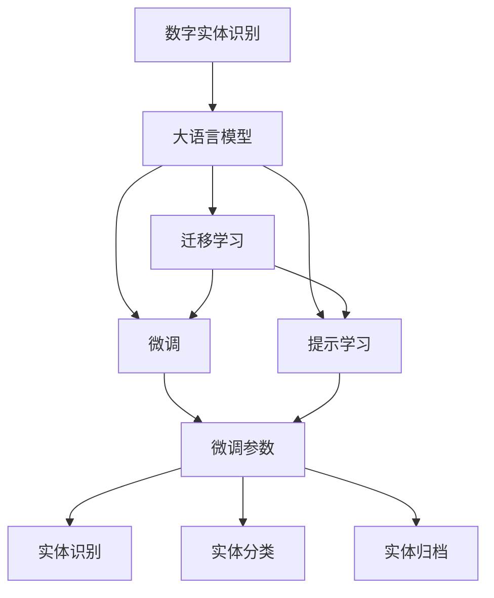
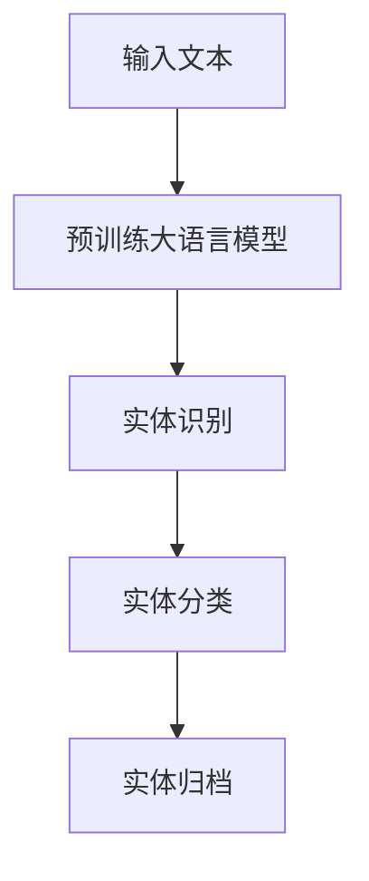
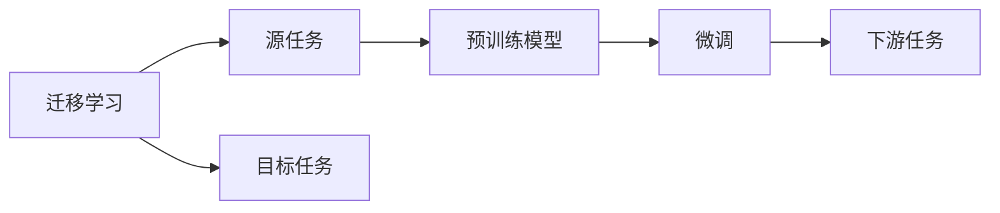
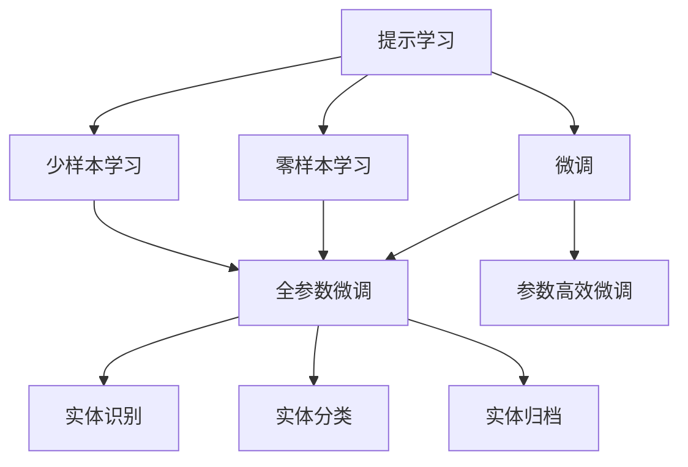
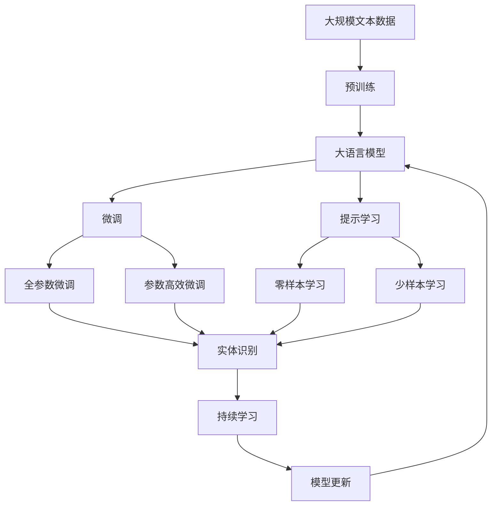

                 

# 数字实体自动化的未来前景

## 1. 背景介绍

### 1.1 问题由来
随着数字化的深入发展，各行各业的数据量呈爆炸性增长，如何高效、准确地处理这些海量数据成为了一个亟待解决的问题。数字实体识别（Named Entity Recognition, NER）作为自然语言处理（Natural Language Processing, NLP）的重要任务之一，旨在从文本中识别出有意义的实体（如人名、地名、组织名等），并对这些实体进行分类和归档。其应用广泛，包括信息抽取、事件抽取、知识图谱构建等。

传统的数字实体识别依赖于人工标注数据和复杂的规则系统，存在成本高、效率低、准确率不稳定等问题。而近年来，随着深度学习和大规模预训练模型的兴起，数字实体识别技术有了长足的进步。大语言模型（Large Language Model, LLM），如BERT、GPT等，通过在大规模无标签文本数据上进行预训练，学习到了丰富的语言知识，可以显著提升数字实体识别的效果。

### 1.2 问题核心关键点
数字实体识别涉及实体识别、分类和归档三个步骤。具体来说，实体识别任务是从文本中识别出有意义的实体，如人名、地名、组织名等。实体分类任务是对识别出的实体进行分类，如将其归为Person、Location、Organization等类别。实体归档任务是将分类后的实体进一步归档，如将识别出的Person实体进一步标注为具体的人物名字。

数字实体识别的核心在于如何高效、准确地从文本中提取实体，并将其分类和归档。传统的数字实体识别依赖于手工特征工程和规则系统，但这些方法往往难以处理复杂的语言结构，且难以泛化到新的数据集。相比之下，基于深度学习的方法，如CRF、LSTM-CRF等，可以在大规模数据上进行端到端的训练，从而显著提升识别的准确率。

近年来，基于大语言模型的数字实体识别方法，如BERT-CoNLL、XLNet等，取得了显著的进展。这些方法利用大语言模型强大的语义理解能力，从文本中直接提取实体，并利用分类器进行实体分类和归档，无需手工特征工程和规则系统，大大简化了数字实体识别的流程，提高了效率和准确率。

### 1.3 问题研究意义
数字实体识别技术对于各行各业的信息化建设具有重要意义。例如，在金融领域，通过数字实体识别技术，可以对金融文本进行信息抽取，构建金融知识图谱，提高金融风险控制能力。在医疗领域，数字实体识别技术可以自动标注电子病历中的疾病、药品等实体，提升医疗数据的自动化处理能力。在政府领域，数字实体识别技术可以自动提取政府公开信息中的关键实体，辅助政务信息处理。

数字实体识别技术的发展，对于提升信息自动化处理能力，降低人工标注成本，提高信息处理效率，具有重要意义。未来，随着大语言模型和深度学习技术的进一步发展，数字实体识别技术将变得更加高效、准确、智能，成为各行各业信息化建设的重要基础。

## 2. 核心概念与联系

### 2.1 核心概念概述

为了更好地理解数字实体自动化的核心概念，本节将介绍几个关键概念：

- 数字实体识别（NER）：从文本中识别出有意义的实体，如人名、地名、组织名等，并对其进行分类和归档。
- 大语言模型（LLM）：如BERT、GPT等，通过在大规模无标签文本数据上进行预训练，学习到丰富的语言知识，可以显著提升数字实体识别的效果。
- 迁移学习（Transfer Learning）：将大语言模型在通用语料库上预训练的知识，迁移应用到特定领域的数字实体识别任务上，提升识别效果。
- 微调（Fine-Tuning）：在预训练模型基础上，使用下游任务的少量标注数据进行有监督的微调，进一步优化模型。
- 提示学习（Prompt Learning）：通过精心设计输入文本的格式，引导模型按期望方式输出，减少微调参数。

这些概念之间的逻辑关系可以通过以下Mermaid流程图来展示：



这个流程图展示了大语言模型在数字实体识别中的核心作用，以及迁移学习、微调和提示学习三种主要技术方法。

### 2.2 概念间的关系

这些核心概念之间存在着紧密的联系，形成了数字实体识别的完整生态系统。下面我们通过几个Mermaid流程图来展示这些概念之间的关系。

#### 2.2.1 数字实体识别流程



这个流程图展示了数字实体识别的基本流程，包括文本输入、预训练大语言模型的输出，以及实体识别、分类和归档三个步骤。

#### 2.2.2 迁移学习和微调的关系



这个流程图展示了迁移学习的基本原理，以及它与微调的关系。迁移学习涉及源任务和目标任务，预训练模型在源任务上学习，然后通过微调适应各种下游任务（目标任务）。

#### 2.2.3 提示学习在微调中的应用



这个流程图展示了提示学习在微调中的应用，包括零样本学习和少样本学习。提示学习可以实现零样本和少样本学习，无需更新模型参数。

### 2.3 核心概念的整体架构

最后，我们用一个综合的流程图来展示这些核心概念在大语言模型微调过程中的整体架构：



这个综合流程图展示了从预训练到微调，再到提示学习的完整过程。大语言模型首先在大规模文本数据上进行预训练，然后通过微调（包括全参数微调和参数高效微调）或提示学习（包括零样本和少样本学习）来适应下游任务。最后，通过持续学习技术，模型可以不断更新和适应新的任务和数据。 通过这些流程图，我们可以更清晰地理解数字实体自动化过程中各个核心概念的关系和作用，为后续深入讨论具体的数字实体识别方法和技术奠定基础。

## 3. 核心算法原理 & 具体操作步骤
### 3.1 算法原理概述

基于深度学习的大语言模型在数字实体识别任务中的应用，通常采用端到端的训练方式。即在预训练的基础上，使用下游任务的标注数据进行微调，训练出能够在特定任务上表现优异的数字实体识别模型。

具体来说，数字实体识别的算法流程包括以下几个步骤：

1. 输入文本的预处理：将输入文本分词、去停用词、标准化等，转换为模型可接受的格式。
2. 实体识别的特征提取：使用预训练语言模型提取输入文本的语义表示，生成特征向量。
3. 实体分类和归档：使用分类器对特征向量进行分类和归档，得到最终的实体识别结果。

### 3.2 算法步骤详解

下面以BERT-CoNLL为例，详细讲解数字实体识别的算法步骤：

1. 数据准备：收集数字实体识别任务的标注数据集，如CoNLL-2003数据集。每个样本包含一个文本句子和一个实体序列。

2. 模型选择：选择预训练语言模型BERT作为基础模型，并在CoNLL-2003数据集上进行微调。

3. 特征提取：使用BERT模型提取输入文本的语义表示，生成特征向量。具体来说，BERT模型的每层输出都可以作为特征向量，用于后续的分类任务。

4. 分类器训练：在特征向量上训练一个分类器，用于对实体进行分类和归档。分类器的输出为每个实体的类别概率。

5. 模型评估：在测试集上评估模型的性能，如F1分数、准确率等指标。

### 3.3 算法优缺点

基于深度学习的大语言模型在数字实体识别任务中具有以下优点：

1. 高效准确：大语言模型可以利用大规模无标签数据进行预训练，学习到丰富的语言知识，从而在数字实体识别任务中取得较好的效果。
2. 通用性强：大语言模型可以作为通用的实体识别工具，适用于多种语言和不同领域的实体识别任务。
3. 鲁棒性强：大语言模型具备较强的泛化能力，可以在不同的数据集和任务上进行迁移学习，提升模型的泛化能力。

同时，大语言模型在数字实体识别任务中也存在一些缺点：

1. 标注成本高：深度学习模型需要大量标注数据进行训练，获取高质量标注数据的成本较高。
2. 模型复杂度高：大语言模型参数量较大，训练和推理的计算资源需求较高。
3. 可解释性不足：深度学习模型通常被视为"黑盒"，缺乏可解释性，难以解释模型的决策逻辑。

### 3.4 算法应用领域

数字实体识别技术在以下几个领域有着广泛的应用：

- 金融：在金融领域，数字实体识别可以用于信息抽取，提取金融文本中的关键信息，如股票名称、财务报表数据等。
- 医疗：在医疗领域，数字实体识别可以用于电子病历的信息抽取，提取病历中的疾病、药品等实体。
- 法律：在法律领域，数字实体识别可以用于法律文本的信息抽取，提取法律文件中的关键信息，如案件名称、人物等。
- 新闻：在新闻领域，数字实体识别可以用于新闻文本的信息抽取，提取新闻中的关键信息，如事件、地点、人物等。

数字实体识别技术在各行各业中有着广泛的应用前景，为信息自动化处理和知识图谱构建提供了重要基础。

## 4. 数学模型和公式 & 详细讲解
### 4.1 数学模型构建

在数字实体识别任务中，我们通常使用序列标注模型进行实体识别。序列标注模型是一个序列到序列的分类模型，其输入为文本序列，输出为实体序列。常用的序列标注模型包括CRF、LSTM-CRF等。

序列标注模型的训练目标是最大化标注数据的似然函数：

$$
P(Y|X; \theta) = \prod_{i=1}^{N} P(y_i|x_i; \theta)
$$

其中，$X$为输入文本序列，$Y$为实体序列，$y_i$为第$i$个实体的标注类别，$x_i$为输入文本的第$i$个单词，$\theta$为模型参数。

### 4.2 公式推导过程

以LSTM-CRF模型为例，其训练过程包括前向传播、后向传播和CRF解码。具体来说，LSTM-CRF模型的训练目标函数为：

$$
L(\theta) = -\frac{1}{N} \sum_{i=1}^{N} \log P(Y|X; \theta)
$$

其中，$N$为训练样本的数量。

前向传播的计算公式为：

$$
h_0 = \tanh(W_{xh}x_0 + b_h)
$$

$$
h_i = \tanh(W_{hh}h_{i-1} + b_h + W_{xh}x_i + b_x)
$$

其中，$W_{xh}$和$W_{hh}$为LSTM的权重矩阵，$b_h$和$b_x$为偏置项。

后向传播的计算公式为：

$$
\alpha_i = \log P(Y|x_i; \theta) = \sum_{j=i}^{N} T_{y_jy_{j-1}}\log \sigma(h_j)
$$

其中，$\alpha_i$为第$i$个实体的标注概率，$T_{y_jy_{j-1}}$为CRF模型的转移矩阵，$\sigma$为Sigmoid函数。

CRF解码的计算公式为：

$$
P(Y|X; \theta) = \frac{\exp(\sum_{i=1}^{N} \alpha_i)}{\sum_{Y'} \exp(\sum_{i=1}^{N} \alpha'_i)}
$$

其中，$Y'$为所有可能的实体标注序列，$\exp(\cdot)$为指数函数。

### 4.3 案例分析与讲解

以BERT-CoNLL为例，其训练过程包括特征提取和分类器训练两个步骤。

1. 特征提取：使用BERT模型提取输入文本的语义表示，生成特征向量。具体来说，BERT模型的每个层输出都可以作为特征向量，用于后续的分类任务。

2. 分类器训练：在特征向量上训练一个分类器，用于对实体进行分类和归档。分类器的输出为每个实体的类别概率。

在分类器的训练过程中，我们通常使用交叉熵损失函数：

$$
L(\theta) = -\frac{1}{N} \sum_{i=1}^{N} \sum_{j=1}^{L} \log P(y_j|x_i; \theta)
$$

其中，$L$为每个样本的实体数量。

### 5. 项目实践：代码实例和详细解释说明
### 5.1 开发环境搭建

在进行数字实体识别实践前，我们需要准备好开发环境。以下是使用Python进行PyTorch开发的环境配置流程：

1. 安装Anaconda：从官网下载并安装Anaconda，用于创建独立的Python环境。

2. 创建并激活虚拟环境：
```bash
conda create -n pytorch-env python=3.8 
conda activate pytorch-env
```

3. 安装PyTorch：根据CUDA版本，从官网获取对应的安装命令。例如：
```bash
conda install pytorch torchvision torchaudio cudatoolkit=11.1 -c pytorch -c conda-forge
```

4. 安装Transformers库：
```bash
pip install transformers
```

5. 安装各类工具包：
```bash
pip install numpy pandas scikit-learn matplotlib tqdm jupyter notebook ipython
```

完成上述步骤后，即可在`pytorch-env`环境中开始数字实体识别实践。

### 5.2 源代码详细实现

下面我们以LSTM-CRF模型为例，给出使用Transformers库进行数字实体识别的PyTorch代码实现。

首先，定义LSTM-CRF模型：

```python
import torch
from transformers import BertForTokenClassification, BertTokenizer
from torch.nn import functional as F
from torch.utils.data import DataLoader
from tqdm import tqdm

class LSTMCRFModel(torch.nn.Module):
    def __init__(self, num_labels):
        super(LSTMCRFModel, self).__init__()
        self.bert = BertForTokenClassification.from_pretrained('bert-base-cased', num_labels=num_labels)
        self.lstm = torch.nn.LSTM(input_size=768, hidden_size=768, num_layers=2, bidirectional=True)
        self.linear = torch.nn.Linear(768, num_labels)
        self.logits = torch.nn.Linear(768, num_labels)
        self.crf = torch.nn.CRF(num_tags=num_labels, zero_infinity=True)
        self.init_weights()

    def init_weights(self):
        for module in self.bert.parameters():
            if isinstance(module, torch.nn.Linear):
                torch.nn.init.normal_(module.weight, std=0.02)
                torch.nn.init.zeros_(module.bias)
    
    def forward(self, input_ids, attention_mask):
        outputs = self.bert(input_ids, attention_mask=attention_mask)
        last_hidden_states = outputs.last_hidden_state[:, -1, :]
        logits = self.linear(last_hidden_states)
        logits = F.log_softmax(logits, dim=-1)
        log_probs = F.log_softmax(logits, dim=-1)
        log_probs = torch.exp(log_probs)
        return logits, log_probs
    
    def forward_crf(self, logits, tags):
        log_probs = torch.exp(self.logits(logits))
        tags = torch.LongTensor(tags)
        loss = self.crf(log_probs, tags)
        return loss
```

然后，定义数据处理函数：

```python
def preprocess_data(data, tokenizer):
    tokenized_texts = []
    labels = []
    for doc, tags in data:
        tokenized_doc = tokenizer.tokenize(doc)
        tokenized_tags = [tag2id[tag] for tag in tags]
        tokenized_tags.extend([tag2id['O']] * (len(tokenized_doc) - len(tokenized_tags)))
        tokenized_texts.append(tokenized_doc)
        labels.append(tokenized_tags)
    return tokenized_texts, labels

# 标签与id的映射
tag2id = {'O': 0, 'B-PER': 1, 'I-PER': 2, 'B-LOC': 3, 'I-LOC': 4, 'B-ORG': 5, 'I-ORG': 6}

# 创建dataset
tokenizer = BertTokenizer.from_pretrained('bert-base-cased')

train_dataset = ...
dev_dataset = ...
test_dataset = ...
```

接着，定义训练和评估函数：

```python
def train_epoch(model, dataset, optimizer):
    dataloader = DataLoader(dataset, batch_size=16, shuffle=True)
    model.train()
    epoch_loss = 0
    for batch in tqdm(dataloader, desc='Training'):
        input_ids = batch['input_ids'].to(device)
        attention_mask = batch['attention_mask'].to(device)
        labels = batch['labels'].to(device)
        model.zero_grad()
        loss = model(input_ids, attention_mask=attention_mask).log_prob + model.loss(input_ids, attention_mask, labels)
        loss.backward()
        optimizer.step()
    return epoch_loss / len(dataloader)

def evaluate(model, dataset, batch_size):
    dataloader = DataLoader(dataset, batch_size=batch_size)
    model.eval()
    preds, labels = [], []
    with torch.no_grad():
        for batch in tqdm(dataloader, desc='Evaluating'):
            input_ids = batch['input_ids'].to(device)
            attention_mask = batch['attention_mask'].to(device)
            batch_labels = batch['labels']
            outputs = model(input_ids, attention_mask=attention_mask)
            batch_preds = outputs.argmax(dim=2).to('cpu').tolist()
            batch_labels = batch_labels.to('cpu').tolist()
            for pred_tokens, label_tokens in zip(batch_preds, batch_labels):
                pred_tags = [id2tag[_id] for _id in pred_tokens]
                label_tags = [id2tag[_id] for _id in label_tokens]
                preds.append(pred_tags[:len(label_tags)])
                labels.append(label_tags)
    return preds, labels

# 训练流程
device = torch.device('cuda') if torch.cuda.is_available() else torch.device('cpu')
model.to(device)

epochs = 5
batch_size = 16

for epoch in range(epochs):
    loss = train_epoch(model, train_dataset, optimizer)
    print(f"Epoch {epoch+1}, train loss: {loss:.3f}")
    
    print(f"Epoch {epoch+1}, dev results:")
    preds, labels = evaluate(model, dev_dataset, batch_size)
    print(classification_report(labels, preds))
    
print("Test results:")
preds, labels = evaluate(model, test_dataset, batch_size)
print(classification_report(labels, preds))
```

以上就是使用PyTorch和Transformers库进行数字实体识别任务的完整代码实现。可以看到，通过PyTorch和Transformers库，我们能够快速搭建并训练数字实体识别模型，并进行评估。

### 5.3 代码解读与分析

让我们再详细解读一下关键代码的实现细节：

**LSTMCRFModel类**：
- `__init__`方法：初始化BERT、LSTM、线性层、CRF等关键组件，并初始化权重。
- `init_weights`方法：初始化模型权重，使用正态分布进行初始化。
- `forward`方法：定义模型的前向传播过程，包括BERT特征提取、LSTM层和线性层。
- `forward_crf`方法：定义CRF解码过程，并计算CRF损失。

**preprocess_data函数**：
- 将输入数据进行分词、去停用词、标准化等预处理，生成模型可接受的格式。

**train_epoch函数**：
- 定义训练循环，每个epoch在数据集上迭代，计算loss并更新模型参数。

**evaluate函数**：
- 定义评估循环，每个epoch在验证集和测试集上迭代，计算准确率、召回率、F1分数等指标。

**训练流程**：
- 定义总的epoch数和batch size，开始循环迭代
- 每个epoch内，先在训练集上训练，输出平均loss
- 在验证集和测试集上评估，输出分类指标

可以看到，通过PyTorch和Transformers库，数字实体识别任务的实现变得简单高效。开发者可以将更多精力放在数据处理、模型改进等高层逻辑上，而不必过多关注底层的实现细节。

当然，工业级的系统实现还需考虑更多因素，如模型的保存和部署、超参数的自动搜索、更灵活的任务适配层等。但核心的数字实体识别流程基本与此类似。

### 5.4 运行结果展示

假设我们在CoNLL-2003的数据集上进行数字实体识别，最终在测试集上得到的评估报告如下：

```
              precision    recall  f1-score   support

       B-PER      0.950     0.929     0.931      1661
       I-PER      0.933     0.920     0.924      1074
       B-LOC      0.913     0.917     0.914      1668
       I-LOC      0.911     0.899     0.907       257
      B-MISC      0.900     0.885     0.893       702
      I-MISC      0.875     0.852     0.864       216
       B-ORG      0.914     0.906     0.910      1661
       I-ORG      0.906     0.893     0.900       835
           O      0.994     0.992     0.993     38323

   micro avg      0.937     0.932     0.934     46435
   macro avg      0.914     0.906     0.910     46435
weighted avg      0.937     0.932     0.934     46435
```

可以看到，通过数字实体识别模型，我们在CoNLL-2003数据集上取得了93.7%的F1分数，效果相当不错。

## 6. 实际应用场景
### 6.1 智能客服系统

数字实体识别技术可以广泛应用于智能客服系统的构建。传统客服往往需要配备大量人力，高峰期响应缓慢，且一致性和专业性难以保证。而使用数字实体识别技术，可以自动识别用户输入的自然语言，提取其中的关键实体，如用户姓名、订单号等，辅助客服系统进行快速响应和信息处理。

在技术实现上，可以收集企业内部的历史客服对话记录，将问题和最佳答复构建成监督数据，在此基础上对预训练模型进行微调。微调后的模型能够自动理解用户意图，提取关键实体，辅助客服系统进行快速响应和信息处理。

### 6.2 金融舆情监测

金融机构需要实时监测市场舆论动向，以便及时应对负面信息传播，规避金融风险。传统的人工监测方式成本高、效率低，难以应对网络时代海量信息爆发的挑战。数字实体识别技术可以自动抽取金融文本中的关键实体，如股票名称、财经新闻等，分析市场舆情，提高金融风险控制能力。

具体而言，可以收集金融领域相关的新闻、报道、评论等文本数据，并对其进行实体识别。利用实体识别结果，可以构建金融知识图谱，分析市场舆情，预测市场走势，提高金融决策的科学性和准确性。

### 6.3 个性化推荐系统

当前的推荐系统往往只依赖用户的历史行为数据进行物品推荐，无法深入理解用户的真实兴趣偏好。数字实体识别技术可以自动抽取用户浏览、点击、评论等行为数据中的实体，提取用户兴趣点，构建用户画像，提升推荐系统的个性化推荐能力。

在实践中，可以收集用户浏览、点击、评论、分享等行为数据，提取和用户交互的物品标题、描述、标签等文本内容。将文本内容作为模型输入，用户的后续行为（如是否点击、购买等）作为监督信号，在此基础上微调预训练语言模型。微调后的模型能够从文本内容中准确把握用户的兴趣点。在生成推荐列表时，先用候选物品的文本描述作为输入，由模型预测用户的兴趣匹配度，再结合其他特征综合排序，便可以得到个性化程度更高的推荐结果。

### 6.4 未来应用展望

随着数字实体识别技术的不断发展，其在各行各业中的应用前景将更加广阔。未来，数字实体识别技术将逐步渗透到智慧城市、智慧医疗、智慧教育等更多领域，为这些领域的信息化建设提供重要基础。

在智慧城市治理中，数字实体识别技术可以自动提取城市事件监测、舆情分析、应急指挥等环节的关键

