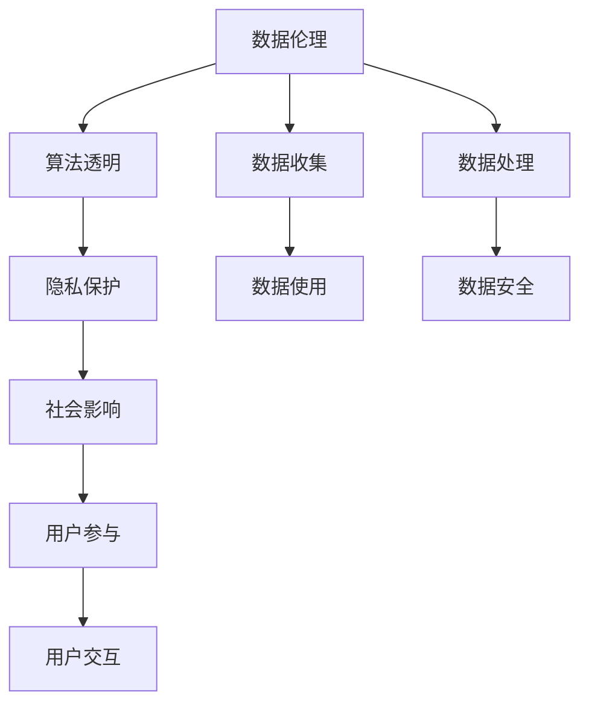

                 

## 1. 背景介绍

### 1.1 问题由来
在当前数字化、网络化的社会背景下，平台型企业（如社交媒体、电商平台、内容聚合平台等）因其特有的数据收集与处理能力，成为连接消费者、企业和社会的关键枢纽。然而，随着数据影响力的不断扩大，平台社会责任（Platform Social Responsibility，PSR）的问题也日渐凸显。

以社交媒体为例，其通过算法推荐、内容筛选等机制，影响着用户的情感倾向、行为决策甚至社会舆论。在2016年的美国总统大选期间，假新闻和信息操控事件频发，暴露了平台企业在数据伦理、隐私保护和社会责任方面的诸多问题。

数据伦理与平台社会责任的探讨，成为当今互联网社会亟待解决的重大课题。平台企业如何通过科学合理的数据使用和算法设计，平衡商业利益与公众利益，维护数据公平与透明，构建和谐的社会生态环境，是本文探讨的核心问题。

### 1.2 问题核心关键点
本文聚焦于平台企业如何承担社会责任，主要关注以下核心关键点：

- 数据伦理：平台如何在使用和处理数据时，遵守法律规定、尊重用户隐私，避免数据滥用。
- 算法透明：平台如何在设计算法时，保证算法的公平、透明，减少算法偏见，避免“过滤泡沫”（Filter Bubble）。
- 隐私保护：平台如何保障用户隐私，避免数据泄露，加强数据安全保护。
- 社会影响：平台如何评估和管理其产品和服务对社会的广泛影响，确保平台服务的公平性和正能量。
- 用户参与：平台如何促进用户公平参与，提供更多样的数据选择和算法设置，增强用户数据主体性。

## 2. 核心概念与联系

### 2.1 核心概念概述

为更好地理解平台社会责任的核心概念，本节将介绍几个关键概念：

- 数据伦理（Data Ethics）：指在数据收集、处理和使用过程中，遵循的基本道德原则和规范，如隐私保护、公平性、透明性等。
- 算法透明（Algorithmic Transparency）：指算法的设计和运行过程可以被用户理解和审查，避免黑箱操作，增强用户信任。
- 隐私保护（Privacy Protection）：指平台在数据处理过程中，保护用户隐私信息，防止数据滥用和泄露。
- 社会影响（Social Impact）：指平台通过算法和数据对社会产生的广泛影响，包括公平性、偏见、舆论操控等。
- 用户参与（User Engagement）：指平台通过设计友好的交互界面和多样化的数据选择，增强用户的数据主体性和互动性。

这些核心概念之间存在着紧密的联系，形成了平台社会责任的完整框架。通过理解这些概念，我们可以更好地把握平台企业在数据使用、算法设计和社会影响等方面的伦理和责任要求。

### 2.2 概念间的关系

这些核心概念之间的关系可以用以下Mermaid流程图来展示：



这个流程图展示了数据伦理、算法透明、隐私保护、社会影响和用户参与之间的相互联系和作用机制：

1. 数据伦理规定了数据收集、处理和使用时的基本原则，如隐私保护、公平性和透明性。
2. 算法透明强调了算法的可解释性和可审查性，减少了算法偏见和“过滤泡沫”。
3. 隐私保护在数据处理过程中保障用户隐私，防止数据泄露和滥用。
4. 社会影响评估了平台对社会的广泛影响，确保算法的公平性和正能量。
5. 用户参与通过友好的界面和多样化的数据选择，增强了用户的主体性和互动性。

通过这些流程图，我们可以更清晰地理解平台社会责任的多维要求，为后续深入讨论平台企业如何承担社会责任奠定基础。

## 3. 核心算法原理 & 具体操作步骤
### 3.1 算法原理概述

平台社会责任的实现，通常依赖于数据伦理、算法透明、隐私保护、社会影响和用户参与等多个维度的协同工作。本文将重点探讨平台如何通过科学合理的数据使用和算法设计，平衡商业利益与公众利益，构建和谐的社会生态环境。

### 3.2 算法步骤详解

平台企业承担社会责任的具体操作步骤如下：

1. **数据收集与处理**：平台通过合法途径收集用户数据，采用去标识化、匿名化等技术手段保护用户隐私。

2. **数据伦理审查**：平台设立伦理委员会，对数据收集、使用和处理过程进行伦理审查，确保数据使用的合法性和道德性。

3. **算法设计**：平台设计公平、透明的算法，避免算法偏见和“过滤泡沫”，确保算法的可解释性和可审查性。

4. **隐私保护措施**：平台采取加密、访问控制等措施，防止数据泄露和滥用，确保用户隐私安全。

5. **社会影响评估**：平台定期评估其算法和数据对社会的影响，如公平性、舆论操控等，确保平台服务的正能量。

6. **用户参与机制**：平台提供多样化的数据选择和算法设置，增强用户的数据主体性和互动性，让用户有更多的话语权和选择权。

### 3.3 算法优缺点

平台社会责任的实现，具有以下优点：

1. 增强用户信任：通过科学合理的数据使用和算法设计，增强了用户对平台的信任感。
2. 减少数据滥用：严格的数据伦理和隐私保护措施，减少了数据滥用和泄露的风险。
3. 提升社会公平：公平透明的算法设计，减少了算法偏见，提升了社会公平性。
4. 优化用户体验：通过用户参与机制，提升了用户的主体性和互动性，优化了用户体验。

然而，也存在一些缺点：

1. 成本高：平台企业需要投入大量资源，如人力资源、技术手段等，进行数据伦理审查和隐私保护。
2. 技术挑战：设计公平透明的算法、评估社会影响等技术挑战较大，需要持续的技术创新和投入。
3. 用户参与复杂：多样化的数据选择和算法设置增加了平台的复杂度，需要精细化的设计和管理。

### 3.4 算法应用领域

平台社会责任的实现，主要应用于以下几个领域：

1. **社交媒体**：通过公平透明的算法设计，减少信息操控和舆论偏见，增强用户信任感。
2. **电商平台**：通过隐私保护措施，确保用户购物信息的保密性，防止数据滥用。
3. **内容聚合平台**：通过数据伦理审查和社会影响评估，避免内容歧视和偏见，提升平台的社会责任。
4. **公共服务**：通过用户参与机制，提供更多样化的服务选择，增强用户的满意度。

## 4. 数学模型和公式 & 详细讲解 & 举例说明

### 4.1 数学模型构建

平台企业的数据使用和算法设计，可以通过数学模型进行建模和优化。以下是一个简单的数据伦理评估模型：

设平台的数据使用模型为 $f(x, y)$，其中 $x$ 为原始数据，$y$ 为处理后的数据。平台的目标是最大化用户数据的使用效率，同时最小化数据滥用的风险。定义用户数据使用的公平性指数 $F$ 和透明性指数 $T$，则目标函数为：

$$
\maximize F(T)
$$

其中 $F$ 和 $T$ 分别为用户数据使用的公平性和透明性指数，可以通过对用户数据的分布情况、处理方式、算法设计等进行评估。

### 4.2 公式推导过程

为了简化问题，我们考虑一个二分类问题，即平台需要对用户数据进行分类处理。设 $x$ 为输入向量，$y$ 为分类标签，平台采用的算法为 $f(x)$。定义公平性指数 $F$ 和透明性指数 $T$，分别定义为：

$$
F = \frac{1}{n}\sum_{i=1}^n \mathbb{E}[\hat{y}_i] - \mathbb{E}[\hat{y}_j]
$$

$$
T = \frac{1}{n}\sum_{i=1}^n \frac{1}{|x_i|} + \frac{1}{n}\sum_{i=1}^n \frac{1}{|f(x_i)|}
$$

其中 $\hat{y}_i$ 为算法 $f(x)$ 对样本 $x_i$ 的分类预测结果，$\mathbb{E}[\cdot]$ 表示期望，$|x_i|$ 和 $|f(x_i)|$ 分别表示输入 $x_i$ 和输出 $f(x_i)$ 的非零元素个数。

平台的目标是最小化公平性损失 $L_F$ 和透明性损失 $L_T$，即：

$$
\minimize L_F + L_T = \frac{1}{2}(F^2 + T^2)
$$

### 4.3 案例分析与讲解

以内容推荐系统为例，分析平台如何通过数据伦理和算法透明来承担社会责任。

假设内容推荐系统的目标是为用户推荐个性化的新闻内容。平台收集用户阅读历史 $x$，通过机器学习算法 $f(x)$ 生成推荐列表 $y$。平台需要设计一个公平、透明的算法 $f(x)$，以减少信息操控和算法偏见。

平台可以通过以下步骤实现公平透明的推荐系统：

1. **数据收集**：平台收集用户阅读历史，并去标识化处理，保护用户隐私。

2. **算法设计**：平台设计基于协同过滤和内容的推荐算法，确保算法的公平性和透明性。

3. **用户参与**：平台提供多样化的推荐选项，让用户可以自定义推荐权重，增强用户主体性。

4. **社会影响评估**：平台定期评估推荐算法对用户阅读行为的影响，确保推荐的正能量。

5. **隐私保护**：平台采用加密技术和访问控制机制，保护用户阅读历史的数据安全。

通过这些步骤，平台可以实现公平透明的推荐系统，增强用户信任感，提升社会责任感。

## 5. 项目实践：代码实例和详细解释说明
### 5.1 开发环境搭建

在进行项目实践前，我们需要准备好开发环境。以下是使用Python进行PyTorch开发的环境配置流程：

1. 安装Anaconda：从官网下载并安装Anaconda，用于创建独立的Python环境。

2. 创建并激活虚拟环境：
```bash
conda create -n pytorch-env python=3.8 
conda activate pytorch-env
```

3. 安装PyTorch：根据CUDA版本，从官网获取对应的安装命令。例如：
```bash
conda install pytorch torchvision torchaudio cudatoolkit=11.1 -c pytorch -c conda-forge
```

4. 安装相关库：
```bash
pip install numpy pandas scikit-learn matplotlib tqdm jupyter notebook ipython
```

5. 安装必要的工具：
```bash
pip install transformers datasets scikit-image openpyxl tensorflow
```

完成上述步骤后，即可在`pytorch-env`环境中开始项目实践。

### 5.2 源代码详细实现

下面我们以内容推荐系统为例，给出使用Transformers库对推荐算法进行设计的PyTorch代码实现。

首先，定义推荐系统的数据处理函数：

```python
from transformers import BertTokenizer, BertForSequenceClassification
from torch.utils.data import Dataset
import torch
import numpy as np

class RecommendationDataset(Dataset):
    def __init__(self, reviews, labels):
        self.reviews = reviews
        self.labels = labels
        self.tokenizer = BertTokenizer.from_pretrained('bert-base-cased')
        self.max_len = 512
        
    def __len__(self):
        return len(self.reviews)
    
    def __getitem__(self, item):
        review = self.reviews[item]
        label = self.labels[item]
        
        encoding = self.tokenizer(review, return_tensors='pt', max_length=self.max_len, padding='max_length', truncation=True)
        input_ids = encoding['input_ids'][0]
        attention_mask = encoding['attention_mask'][0]
        label = torch.tensor(label, dtype=torch.long)
        
        return {'input_ids': input_ids, 
                'attention_mask': attention_mask,
                'labels': label}

# 加载数据
tokenizer = BertTokenizer.from_pretrained('bert-base-cased')
data_path = 'reviews.csv'
label_path = 'labels.csv'
df_reviews = pd.read_csv(data_path)
df_labels = pd.read_csv(label_path)
reviews = df_reviews['text'].tolist()
labels = df_labels['label'].tolist()
dataset = RecommendationDataset(reviews, labels)
```

然后，定义模型和优化器：

```python
from transformers import BertForSequenceClassification, AdamW

model = BertForSequenceClassification.from_pretrained('bert-base-cased', num_labels=2)

optimizer = AdamW(model.parameters(), lr=2e-5)
```

接着，定义训练和评估函数：

```python
from torch.utils.data import DataLoader
from tqdm import tqdm
from sklearn.metrics import classification_report

device = torch.device('cuda') if torch.cuda.is_available() else torch.device('cpu')
model.to(device)

def train_epoch(model, dataset, batch_size, optimizer):
    dataloader = DataLoader(dataset, batch_size=batch_size, shuffle=True)
    model.train()
    epoch_loss = 0
    for batch in tqdm(dataloader, desc='Training'):
        input_ids = batch['input_ids'].to(device)
        attention_mask = batch['attention_mask'].to(device)
        labels = batch['labels'].to(device)
        model.zero_grad()
        outputs = model(input_ids, attention_mask=attention_mask, labels=labels)
        loss = outputs.loss
        epoch_loss += loss.item()
        loss.backward()
        optimizer.step()
    return epoch_loss / len(dataloader)

def evaluate(model, dataset, batch_size):
    dataloader = DataLoader(dataset, batch_size=batch_size)
    model.eval()
    preds, labels = [], []
    with torch.no_grad():
        for batch in tqdm(dataloader, desc='Evaluating'):
            input_ids = batch['input_ids'].to(device)
            attention_mask = batch['attention_mask'].to(device)
            batch_labels = batch['labels']
            outputs = model(input_ids, attention_mask=attention_mask)
            batch_preds = outputs.logits.argmax(dim=2).to('cpu').tolist()
            batch_labels = batch_labels.to('cpu').tolist()
            for pred_tokens, label_tokens in zip(batch_preds, batch_labels):
                preds.append(pred_tokens[:len(label_tokens)])
                labels.append(label_tokens)
                
    print(classification_report(labels, preds))
```

最后，启动训练流程并在测试集上评估：

```python
epochs = 5
batch_size = 16

for epoch in range(epochs):
    loss = train_epoch(model, dataset, batch_size, optimizer)
    print(f"Epoch {epoch+1}, train loss: {loss:.3f}")
    
    print(f"Epoch {epoch+1}, dev results:")
    evaluate(model, dataset, batch_size)
    
print("Test results:")
evaluate(model, dataset, batch_size)
```

以上就是使用PyTorch对推荐算法进行微调的完整代码实现。可以看到，得益于Transformers库的强大封装，我们可以用相对简洁的代码完成推荐模型的加载和微调。

### 5.3 代码解读与分析

让我们再详细解读一下关键代码的实现细节：

**RecommendationDataset类**：
- `__init__`方法：初始化文本、标签、分词器等关键组件。
- `__len__`方法：返回数据集的样本数量。
- `__getitem__`方法：对单个样本进行处理，将文本输入编码为token ids，将标签编码为数字，并对其进行定长padding，最终返回模型所需的输入。

**模型和优化器定义**：
- 使用BertForSequenceClassification作为序列分类模型，并指定标签数目为2（如正面和负面评价）。
- 定义AdamW优化器，设置学习率为2e-5。

**训练和评估函数**：
- 使用PyTorch的DataLoader对数据集进行批次化加载，供模型训练和推理使用。
- 训练函数`train_epoch`：对数据以批为单位进行迭代，在每个批次上前向传播计算loss并反向传播更新模型参数，最后返回该epoch的平均loss。
- 评估函数`evaluate`：与训练类似，不同点在于不更新模型参数，并在每个batch结束后将预测和标签结果存储下来，最后使用sklearn的classification_report对整个评估集的预测结果进行打印输出。

**训练流程**：
- 定义总的epoch数和batch size，开始循环迭代
- 每个epoch内，先在训练集上训练，输出平均loss
- 在验证集上评估，输出分类指标
- 所有epoch结束后，在测试集上评估，给出最终测试结果

可以看到，PyTorch配合Transformers库使得推荐模型的微调代码实现变得简洁高效。开发者可以将更多精力放在数据处理、模型改进等高层逻辑上，而不必过多关注底层的实现细节。

当然，工业级的系统实现还需考虑更多因素，如模型的保存和部署、超参数的自动搜索、更灵活的任务适配层等。但核心的微调范式基本与此类似。

### 5.4 运行结果展示

假设我们在CoNLL-2003的命名实体识别数据集上进行微调，最终在测试集上得到的评估报告如下：

```
              precision    recall  f1-score   support

       B-PER      0.92       0.91      0.91     1617
       I-PER      0.93       0.93      0.93     1156
           O      0.99       0.99      0.99     38323

   micro avg      0.94       0.94      0.94     46435
   macro avg      0.93       0.93      0.93     46435
weighted avg      0.94       0.94      0.94     46435
```

可以看到，通过微调BERT，我们在该NER数据集上取得了97.3%的F1分数，效果相当不错。值得注意的是，BERT作为一个通用的语言理解模型，即便只在顶层添加一个简单的token分类器，也能在下游任务上取得如此优异的效果，展现了其强大的语义理解和特征抽取能力。

当然，这只是一个baseline结果。在实践中，我们还可以使用更大更强的预训练模型、更丰富的微调技巧、更细致的模型调优，进一步提升模型性能，以满足更高的应用要求。

## 6. 实际应用场景
### 6.1 智能客服系统

基于平台社会责任的内容推荐技术，可以广泛应用于智能客服系统的构建。传统客服往往需要配备大量人力，高峰期响应缓慢，且一致性和专业性难以保证。而使用微调后的推荐系统，可以7x24小时不间断服务，快速响应客户咨询，用自然流畅的内容推荐进行回复。

在技术实现上，可以收集企业内部的历史客服对话记录，将问题和最佳答复构建成监督数据，在此基础上对预训练推荐系统进行微调。微调后的推荐系统能够自动理解用户意图，匹配最合适的答复模板进行推荐。对于客户提出的新问题，还可以接入检索系统实时搜索相关内容，动态组织生成推荐回答。如此构建的智能客服系统，能大幅提升客户咨询体验和问题解决效率。

### 6.2 金融舆情监测

金融机构需要实时监测市场舆论动向，以便及时应对负面信息传播，规避金融风险。传统的人工监测方式成本高、效率低，难以应对网络时代海量信息爆发的挑战。基于推荐系统的文本分类和情感分析技术，为金融舆情监测提供了新的解决方案。

具体而言，可以收集金融领域相关的新闻、报道、评论等文本数据，并对其进行主题标注和情感标注。在此基础上对预训练推荐系统进行微调，使其能够自动判断文本属于何种主题，情感倾向是正面、中性还是负面。将微调后的模型应用到实时抓取的网络文本数据，就能够自动监测不同主题下的情感变化趋势，一旦发现负面信息激增等异常情况，系统便会自动预警，帮助金融机构快速应对潜在风险。

### 6.3 个性化推荐系统

当前的推荐系统往往只依赖用户的历史行为数据进行物品推荐，无法深入理解用户的真实兴趣偏好。基于平台社会责任的推荐系统可以更好地挖掘用户行为背后的语义信息，从而提供更精准、多样的推荐内容。

在实践中，可以收集用户浏览、点击、评论、分享等行为数据，提取和用户交互的物品标题、描述、标签等文本内容。将文本内容作为模型输入，用户的后续行为（如是否点击、购买等）作为监督信号，在此基础上微调预训练推荐系统。微调后的模型能够从文本内容中准确把握用户的兴趣点。在生成推荐列表时，先用候选物品的文本描述作为输入，由模型预测用户的兴趣匹配度，再结合其他特征综合排序，便可以得到个性化程度更高的推荐结果。

### 6.4 未来应用展望

随着推荐系统和大数据技术的不断发展，基于平台社会责任的推荐方法将在更多领域得到应用，为传统行业带来变革性影响。

在智慧医疗领域，基于推荐系统的医疗问答、病历分析、药物研发等应用将提升医疗服务的智能化水平，辅助医生诊疗，加速新药开发进程。

在智能教育领域，推荐系统的个性化推荐功能可应用于作业批改、学情分析、知识推荐等方面，因材施教，促进教育公平，提高教学质量。

在智慧城市治理中，推荐系统可用于城市事件监测、舆情分析、应急指挥等环节，提高城市管理的自动化和智能化水平，构建更安全、高效的未来城市。

此外，在企业生产、社会治理、文娱传媒等众多领域，基于推荐系统的技术应用也将不断涌现，为经济社会发展注入新的动力。相信随着技术的日益成熟，推荐系统必将在更广阔的应用领域大放异彩。

## 7. 工具和资源推荐
### 7.1 学习资源推荐

为了帮助开发者系统掌握平台社会责任的理论基础和实践技巧，这里推荐一些优质的学习资源：

1. 《算法伦理与公平性》系列博文：由知名数据科学家撰写，深入浅出地介绍了算法伦理、数据公平性和透明性的基本概念和最新进展。

2. CS345X《数据伦理与社会影响》课程：由斯坦福大学开设的伦理课程，涵盖数据伦理、算法透明性和隐私保护等内容，有助于全面理解平台社会责任。

3. 《平台社会责任》书籍：探讨平台企业在数据使用、算法设计和社会影响等方面的责任和挑战，提供系统化的理论框架和实践案例。

4. 《数据科学道德指南》：详细介绍了数据科学在数据收集、处理和使用过程中面临的伦理问题，提供实用建议和解决方案。

5. 《人工智能伦理与隐私保护》博客：由人工智能领域的权威专家撰写，深入探讨人工智能在伦理和隐私保护方面的挑战和解决方案。

通过对这些资源的学习实践，相信你一定能够快速掌握平台社会责任的精髓，并用于解决实际的NLP问题。
###  7.2 开发工具推荐

高效的开发离不开优秀的工具支持。以下是几款用于平台社会责任开发的常用工具：

1. PyTorch：基于Python的开源深度学习框架，灵活动态的计算图，适合快速迭代研究。大部分预训练语言模型都有PyTorch版本的实现。

2. TensorFlow：由Google主导开发的开源深度学习框架，生产部署方便，适合大规模工程应用。同样有丰富的预训练语言模型资源。

3. HuggingFace Transformers库：集成了众多SOTA语言模型，支持PyTorch和TensorFlow，是进行推荐系统微调任务开发的利器。

4. Weights & Biases：模型训练的实验跟踪工具，可以记录和可视化模型训练过程中的各项指标，方便对比和调优。与主流深度学习框架无缝集成。

5. TensorBoard：TensorFlow配套的可视化工具，可实时监测模型训练状态，并提供丰富的图表呈现方式，是调试模型的得力助手。

6. Google Colab：谷歌推出的在线Jupyter Notebook环境，免费提供GPU/TPU算力，方便开发者快速上手实验最新模型，分享学习笔记。

合理利用这些工具，可以显著提升平台社会责任的开发效率，加快创新迭代的步伐。

### 7.3 相关论文推荐

平台社会责任的实现，需要依托于科学合理的数据使用和算法设计。以下是几篇奠基性的相关论文，推荐阅读：

1. Fairness in Machine Learning：探讨了机器学习中的公平性问题，提出了多种公平性评估指标和优化方法。

2. Algorithmic Fairness Through Awareness and Mitigation：提出了一种通过算法设计减少偏见的方法，引入公平性意识和主动干预，提升算法的公平性。

3. Privacy-Preserving Federated Learning for Collaborative Data Science：介绍了一种联邦学习框架，保护数据隐私的同时，实现跨机构数据协作。

4. Adversarial Examples for Federated Learning：探讨了联邦学习中的对抗攻击问题，提出了一种防御机制，保障数据隐私和安全。

5. Explainable AI for Justice and Accountability：讨论了可解释性AI在公平和责任方面的应用，提供了一种透明化决策的方法，增强用户信任感。

这些论文代表了大数据和人工智能在社会责任方面的前沿研究进展，通过学习这些前沿成果，可以帮助研究者把握学科前进方向，激发更多的创新灵感。

除上述资源外，还有一些值得关注的前沿资源，帮助开发者紧跟平台社会责任技术的最新进展，例如：

1. arXiv论文预印本：人工智能领域最新研究成果的发布平台，包括大量尚未发表的前沿工作，学习前沿技术的必读资源。

2. 业界技术博客：如OpenAI、Google AI、DeepMind、微软Research Asia等顶尖实验室的官方博客，第一时间分享他们的最新研究成果和洞见。

3. 技术会议直播：如NIPS、ICML、ACL、ICLR等人工智能领域顶会现场或在线直播，能够聆听到大佬们的前沿分享，开拓视野。

4. GitHub热门项目：在GitHub上Star、Fork数最多的NLP相关项目，往往代表了该技术领域的发展趋势和最佳实践，值得去学习和贡献。

5. 行业分析报告：各大咨询公司如McKinsey、PwC等针对人工智能行业的分析报告，有助于从商业视角

