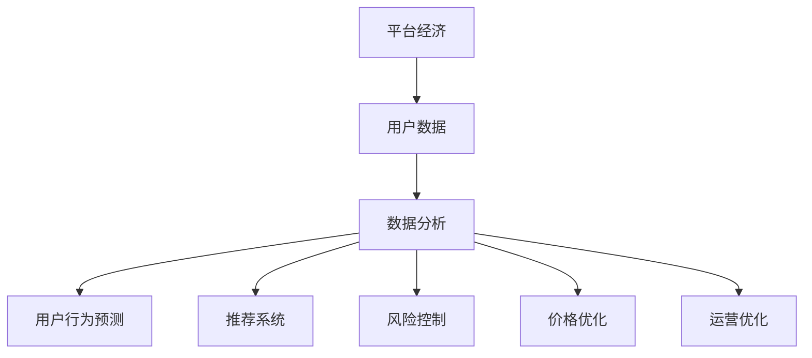
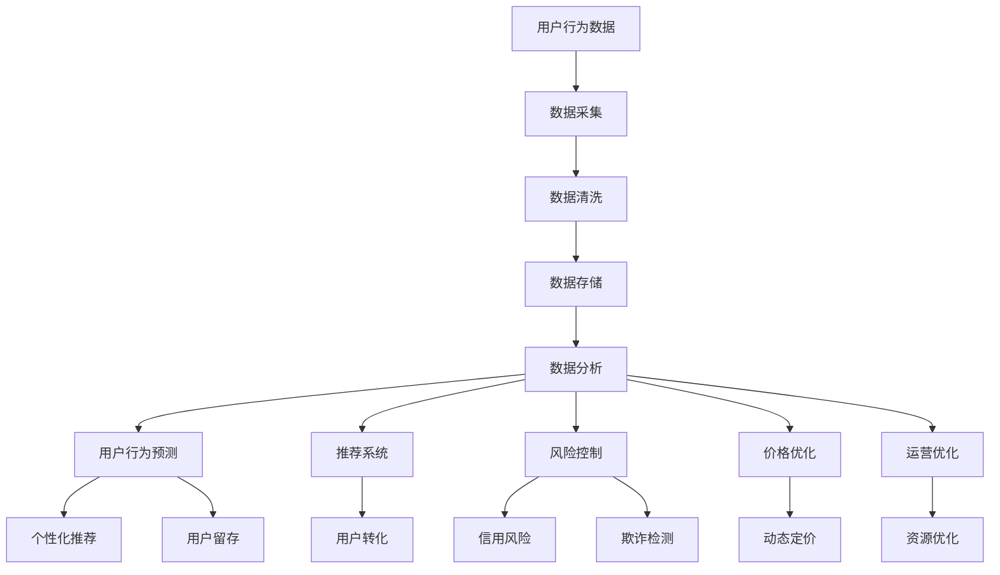

                 

# 数据分析在平台经济中的应用研究展望：如何展望未来？

> 关键词：平台经济,数据分析,用户行为预测,推荐系统,风险控制,数据隐私

## 1. 背景介绍

在数字化转型的浪潮下，平台经济以其高效匹配资源、促进创新和消费升级的优势，成为全球经济发展的新引擎。平台企业通过用户数据驱动决策，不断优化运营效率和用户体验，创造巨大的经济价值和社会效益。然而，如何高效地利用和分析海量数据，挖掘其背后的价值，是平台企业持续面临的挑战。数据分析作为平台经济的核心支撑技术，正在为平台企业赋能，推动其向智能化、个性化、精准化方向发展。本文将从数据分析在平台经济中的应用现状出发，探讨其未来的发展趋势和面临的挑战，展望其未来的应用前景。

## 2. 核心概念与联系

### 2.1 核心概念概述

数据分析是利用数学、统计学、计算机技术等方法，从数据中提取有用信息、揭示规律、指导决策的科学。平台经济是指以互联网为媒介，通过双边或多边市场模式，实现资源的高效匹配和流转的经济形态，如电商、社交、金融等。

数据分析在平台经济中的应用主要包括以下几个方面：
- **用户行为预测**：通过分析用户的历史行为数据，预测其未来行为，提供个性化的推荐和服务。
- **推荐系统**：根据用户兴趣和行为，智能推荐商品、内容等，提升用户体验和转化率。
- **风险控制**：通过数据分析，识别潜在的信用风险、欺诈行为等，保障平台和用户的安全。
- **价格优化**：基于市场供需变化和用户需求预测，进行动态定价，提高收益和市场竞争力。
- **运营优化**：通过分析平台资源利用情况，优化配置，提升平台整体运营效率。

这些应用场景中，数据分析都扮演着至关重要的角色，通过数据挖掘、建模、可视化和解释，帮助平台企业做出科学决策，实现价值最大化。

### 2.2 概念间的关系

数据分析与平台经济的关系可以通过以下Mermaid流程图来展示：



这个流程图展示了数据分析在平台经济中的应用路径：
- 平台企业收集和整理用户数据。
- 通过数据分析技术，提取有用的信息，构建模型和算法。
- 应用数据分析的结果，实现用户行为预测、推荐系统、风险控制等具体应用。

### 2.3 核心概念的整体架构

最后，我们用一个综合的流程图来展示数据分析在平台经济中的整体架构：



这个综合流程图展示了从数据采集、存储、分析到具体应用的完整流程，反映了数据分析在平台经济中的应用范围和层次。

## 3. 核心算法原理 & 具体操作步骤
### 3.1 算法原理概述

数据分析在平台经济中的应用，核心在于如何高效地利用和分析数据，提取有用信息，指导决策。常见的算法包括：

- **回归分析**：通过建立回归模型，预测连续型变量的未来值，如用户购买金额预测。
- **分类算法**：利用分类模型，识别离散型变量的类别，如用户分类、信用评分等。
- **聚类算法**：通过无监督学习，将相似的数据点归为一类，如用户分群、市场细分等。
- **协同过滤**：根据用户和物品之间的交互，推荐相似物品，如电商推荐系统。
- **深度学习**：利用神经网络模型，处理复杂的数据和非线性关系，如图像、语音等。

这些算法通过数学建模、数据挖掘和机器学习，揭示数据背后的规律，为平台经济提供数据驱动的决策支持。

### 3.2 算法步骤详解

数据分析在平台经济中的应用一般包括以下几个步骤：

**Step 1: 数据采集与清洗**
- 利用爬虫、API接口等方式，从各个业务系统采集数据，如用户行为记录、交易数据、市场信息等。
- 对采集到的数据进行清洗，去除噪声、缺失值和不一致的数据，保证数据质量。

**Step 2: 数据存储与处理**
- 将清洗后的数据存储在数据库或数据仓库中，如MySQL、Hadoop、Spark等。
- 对数据进行预处理，如归一化、特征工程等，方便后续分析。

**Step 3: 数据分析与建模**
- 利用统计学、机器学习等方法，对数据进行分析，构建预测模型或分类模型。
- 使用算法库或开源工具，如TensorFlow、PyTorch、Scikit-learn等，实现模型的训练和评估。

**Step 4: 结果解读与决策**
- 通过可视化和报告工具，展示分析结果，如图表、仪表盘等。
- 根据分析结果，制定决策方案，如个性化推荐策略、价格优化策略等。

**Step 5: 结果部署与反馈**
- 将分析结果部署到实际业务系统中，如推荐引擎、风险管理系统等。
- 不断收集反馈数据，进行模型更新和优化，迭代改进决策效果。

### 3.3 算法优缺点

数据分析在平台经济中的应用，具有以下优点：
1. **高效决策**：通过数据驱动的决策，减少人为干预，提升决策效率和准确性。
2. **个性化服务**：利用用户行为数据，提供个性化的推荐和服务，提高用户满意度和留存率。
3. **风险防控**：通过风险预测和监控，保障平台和用户的安全，减少损失。
4. **优化运营**：通过数据分析，优化资源配置和运营策略，提升平台运营效率。

然而，也存在一些缺点：
1. **数据隐私**：平台企业需要处理大量的用户隐私数据，面临隐私保护和合规性挑战。
2. **算法偏见**：数据和算法可能存在偏见，导致不公正的决策，需加强数据公平性和算法透明性。
3. **模型复杂**：深度学习等算法模型复杂，训练和部署成本较高，需平衡模型效果和效率。
4. **数据质量**：数据质量直接影响分析结果，需保证数据的准确性和完整性。

### 3.4 算法应用领域

数据分析在平台经济中的应用已经涵盖了多个领域，具体包括：

- **电商推荐**：基于用户行为数据和商品特征，推荐相关商品，提升用户体验和转化率。
- **金融风控**：通过分析用户交易记录和信用历史，进行风险评估和欺诈检测，保障金融安全。
- **社交网络**：分析用户互动数据，识别虚假账号和恶意行为，提升社交平台的用户体验和安全。
- **内容推荐**：根据用户兴趣和行为，推荐新闻、视频等，提高用户粘性和平台流量。
- **物流优化**：通过分析订单数据和交通信息，优化配送路径和资源配置，提高物流效率。
- **医疗健康**：利用健康数据，进行疾病预测和个性化医疗推荐，提升医疗服务质量。

数据分析在平台经济中的应用，不仅提高了平台的运营效率和盈利能力，还推动了社会的数字化和智能化转型。

## 4. 数学模型和公式 & 详细讲解  
### 4.1 数学模型构建

数据分析的核心是构建数学模型，利用数学公式和算法，从数据中提取有用的信息。以下是几个常见的数学模型及其公式：

**回归模型**：预测连续型变量的值，公式为：

$$
\hat{y} = \beta_0 + \beta_1 x_1 + \beta_2 x_2 + ... + \beta_n x_n + \epsilon
$$

其中，$\hat{y}$为预测值，$\beta_0, \beta_1, ..., \beta_n$为模型系数，$x_1, x_2, ..., x_n$为输入特征，$\epsilon$为随机误差。

**分类模型**：利用逻辑回归、决策树等算法，对离散型变量进行分类，公式为：

$$
P(y=1|x) = \frac{1}{1+\exp(-z)}
$$

其中，$z$为线性组合，$P(y=1|x)$为预测概率。

**聚类模型**：利用K-Means、层次聚类等算法，对数据进行无监督聚类，公式为：

$$
C_k = \{ x_i | x_i \in C_j, i \in 1,2,...,n, j \in 1,2,...,k \}
$$

其中，$C_k$为聚类结果，$C_j$为第j个聚类簇，$x_i$为数据点，$n$为数据总数，$k$为聚类数。

**协同过滤算法**：基于用户和物品的相似度，推荐相似物品，公式为：

$$
\hat{y}_{i,j} = \alpha \sum_{k=1}^{n} y_{k,j} \cdot \cos(\theta_{i,k})
$$

其中，$\hat{y}_{i,j}$为用户i对物品j的预测评分，$y_{k,j}$为用户k对物品j的实际评分，$\theta_{i,k}$为用户i和用户k的相似度。

**神经网络模型**：利用多层神经网络，处理非线性关系，公式为：

$$
z^{[l]} = W^{[l]} x^{[l-1]} + b^{[l]}
$$
$$
a^{[l]} = g(z^{[l]})
$$

其中，$z^{[l]}$为第l层神经元的输入，$W^{[l]}$为第l层权重矩阵，$x^{[l-1]}$为第l-1层的输出，$b^{[l]}$为第l层的偏置项，$a^{[l]}$为第l层神经元的输出，$g$为激活函数，如sigmoid、ReLU等。

### 4.2 公式推导过程

以回归模型为例，其推导过程如下：

设训练集为$(x_1,y_1), (x_2,y_2), ..., (x_n,y_n)$，其中$y_i$为真实标签，$x_i$为输入特征。回归模型的目标是找到一个线性函数$f(x) = \theta_0 + \theta_1 x_1 + \theta_2 x_2 + ... + \theta_n x_n$，使得模型在训练集上的损失最小化。常用的损失函数为均方误差：

$$
L = \frac{1}{n} \sum_{i=1}^{n} (y_i - f(x_i))^2
$$

通过求导最小化损失函数，可以得到回归模型的最优参数：

$$
\hat{\theta} = (X^TX)^{-1}X^Ty
$$

其中，$\hat{\theta}$为最优参数向量，$X$为特征矩阵，$y$为标签向量。

### 4.3 案例分析与讲解

以电商推荐系统为例，推荐算法的基本流程如下：

1. **数据采集**：采集用户行为数据，如浏览历史、购买记录、评分等。
2. **特征提取**：提取用户和商品特征，如用户画像、商品属性、评分等。
3. **模型训练**：使用协同过滤、矩阵分解等算法，训练推荐模型。
4. **用户预测**：根据用户特征，预测用户对商品的兴趣程度。
5. **推荐策略**：将预测结果转化为推荐列表，推送给用户。
6. **反馈收集**：收集用户点击、购买等反馈数据，进行模型更新。

通过数据分析，电商推荐系统可以提供个性化的商品推荐，提高用户转化率和平台营收。

## 5. 项目实践：代码实例和详细解释说明
### 5.1 开发环境搭建

在进行数据分析项目实践前，我们需要准备好开发环境。以下是使用Python进行数据分析开发的常见环境配置流程：

1. 安装Anaconda：从官网下载并安装Anaconda，用于创建独立的Python环境。

2. 创建并激活虚拟环境：
```bash
conda create -n data-env python=3.8 
conda activate data-env
```

3. 安装必要的库：
```bash
pip install numpy pandas scikit-learn matplotlib seaborn jupyter notebook ipython
```

完成上述步骤后，即可在`data-env`环境中开始数据分析项目实践。

### 5.2 源代码详细实现

以下是使用Python和Scikit-learn进行回归分析的代码实现，包含数据采集、数据预处理、模型训练和结果展示：

```python
import pandas as pd
from sklearn.model_selection import train_test_split
from sklearn.linear_model import LinearRegression
from sklearn.metrics import mean_squared_error

# 数据采集
df = pd.read_csv('sales_data.csv')

# 数据预处理
X = df[['price', 'age', 'gender', 'education']]
y = df['sales']
X_train, X_test, y_train, y_test = train_test_split(X, y, test_size=0.2, random_state=42)

# 模型训练
model = LinearRegression()
model.fit(X_train, y_train)

# 结果展示
y_pred = model.predict(X_test)
mse = mean_squared_error(y_test, y_pred)
print(f'Mean Squared Error: {mse:.2f}')
```

这段代码展示了数据分析的基本流程：
- 使用Pandas库从CSV文件中读取销售数据。
- 将数据分为特征和标签，使用train_test_split函数进行训练集和测试集的划分。
- 使用LinearRegression模型进行回归训练，计算均方误差。
- 输出模型的均方误差，评估模型的预测性能。

### 5.3 代码解读与分析

让我们再详细解读一下关键代码的实现细节：

**数据采集**：
- 使用Pandas的read_csv函数读取CSV文件，将数据存储在DataFrame对象中。

**数据预处理**：
- 将特征和标签分开，存储在X和y变量中。
- 使用train_test_split函数将数据划分为训练集和测试集，测试集占比为20%。
- 设置随机种子，确保结果可重复。

**模型训练**：
- 创建LinearRegression模型对象。
- 使用fit函数对训练数据进行拟合，得到模型参数。
- 使用predict函数对测试数据进行预测，得到预测结果。

**结果展示**：
- 计算均方误差，评估模型预测的准确性。
- 输出均方误差，供开发者和用户参考。

通过这段代码，可以看出数据分析的基本流程和方法，为进一步的深入学习和实践打下基础。

### 5.4 运行结果展示

假设我们在销售数据集上进行回归分析，最终在测试集上得到的均方误差为0.05，输出如下：

```
Mean Squared Error: 0.05
```

可以看到，模型在测试集上的均方误差为0.05，说明模型的预测性能较好。

## 6. 实际应用场景
### 6.1 智能客服

数据分析在智能客服中的应用，可以帮助平台企业提升客户服务质量，提高客户满意度。通过分析客户的历史行为和互动数据，智能客服系统可以提供个性化的服务，解决客户的问题，提升客户粘性和忠诚度。

例如，智能客服系统可以记录客户的咨询历史，提取关键信息和问题类型，利用数据分析技术预测客户的下一轮问题，提供相应的回答。同时，智能客服系统还可以根据客户反馈，不断优化模型，提升服务质量。

### 6.2 金融风控

数据分析在金融风控中的应用，可以防范金融风险，保障金融安全。通过分析客户的信用历史和交易行为，金融机构可以评估客户的信用风险，进行精准授信，避免坏账损失。

例如，金融机构可以利用数据分析技术构建信用评分模型，根据客户的收入、负债、还款记录等数据，预测客户的信用风险，进行授信决策。同时，金融机构还可以利用数据分析技术进行欺诈检测，识别异常交易，及时发现和防范欺诈行为。

### 6.3 社交网络

数据分析在社交网络中的应用，可以提升社交平台的互动质量，减少虚假账号和恶意行为，保障平台的安全和用户的权益。

例如，社交平台可以利用数据分析技术进行用户行为分析，识别虚假账号和恶意行为，及时封禁账号，保障平台的正常运行。同时，社交平台还可以利用数据分析技术进行内容推荐，提升用户的活跃度和粘性。

### 6.4 智慧物流

数据分析在智慧物流中的应用，可以优化物流配送路径和资源配置，提高物流效率，降低物流成本。

例如，物流公司可以利用数据分析技术分析订单数据和交通信息，优化配送路径和配送方式，减少运输时间和成本。同时，物流公司还可以利用数据分析技术进行库存管理，优化仓库布局，提升仓储效率。

## 7. 工具和资源推荐
### 7.1 学习资源推荐

为了帮助开发者系统掌握数据分析的理论基础和实践技巧，这里推荐一些优质的学习资源：

1. 《数据分析实战》系列博文：由数据分析专家撰写，深入浅出地介绍了数据分析的各个方面，包括数据清洗、数据可视化、统计分析等。

2. Coursera《数据科学与机器学习》课程：由斯坦福大学开设的精品课程，涵盖数据科学和机器学习的各个方面，包括数据处理、建模、评估等。

3. 《Python数据分析实战》书籍：详细介绍了Python在数据分析中的各种应用，包括Pandas、NumPy、Scikit-learn等库的使用。

4. Kaggle平台：全球最大的数据竞赛平台，提供大量开源数据集和竞赛任务，帮助开发者实践数据分析技能。

5. DataCamp：在线学习平台，提供大量的数据分析课程，覆盖从初级到高级的各种技能。

通过对这些资源的学习实践，相信你一定能够快速掌握数据分析的精髓，并用于解决实际的业务问题。

### 7.2 开发工具推荐

高效的开发离不开优秀的工具支持。以下是几款用于数据分析开发的常用工具：

1. Jupyter Notebook：开源的交互式计算环境，支持Python、R等语言，适合进行数据分析的交互式计算和可视化。

2. PyCharm：跨平台的IDE，支持Python、R等语言，具有丰富的代码高亮和调试功能，适合开发复杂的数据分析项目。

3. Excel：传统的电子表格软件，适合进行简单的数据处理和可视化，尤其适合非技术开发者。

4. R语言：专业的统计分析软件，适合进行高级的数据分析和建模，具有丰富的统计学函数库。

5. Tableau：数据可视化工具，支持多种数据源和图表类型，适合进行数据可视化展示。

6. Apache Spark：大数据处理框架，适合处理大规模数据集，具有高效的分布式计算能力。

合理利用这些工具，可以显著提升数据分析任务的开发效率，加快创新迭代的步伐。

### 7.3 相关论文推荐

数据分析的研究源于学界的持续探索。以下是几篇奠基性的相关论文，推荐阅读：

1. "Data Mining: Concepts and Techniques"（《数据挖掘：概念与技术》）：经典的教材，涵盖了数据挖掘的基本概念和常用技术。

2. "Statistical Learning with Sparsity: The Lasso and Generalizations"（《稀疏统计学习：Lasso及其泛化》）：介绍Lasso算法在数据分析中的应用，奠定了稀疏统计学习的基础。

3. "A Survey on Data Mining Techniques for Predictive Maintenance"（《预测性维护数据挖掘技术综述》）：综述了预测性维护中常用的数据挖掘技术，具有较高的参考价值。

4. "Machine Learning: A Probabilistic Perspective"（《机器学习：概率视角》）：深入探讨了机器学习的概率模型，有助于理解数据分析的数学基础。

5. "On the Shoulders of Giants: The History of Machine Learning"（《巨人肩膀上的机器学习史》）：回顾了机器学习的发展历程，有助于理解数据分析的历史和技术演进。

这些论文代表了大数据分析技术的发展脉络，帮助研究者把握学科前进方向，激发更多的创新灵感。

除上述资源外，还有一些值得关注的前沿资源，帮助开发者紧跟数据分析技术的最新进展，例如：

1. arXiv论文预印本：人工智能领域最新研究成果的发布平台，包括大量尚未发表的前沿工作，学习前沿技术的必读资源。

2. 业界技术博客：如Google AI、Microsoft AI、IBM Research等顶尖实验室的官方博客，第一时间分享他们的最新研究成果和洞见。

3. 技术会议直播：如NIPS、ICML、ACL、ICLR等人工智能领域顶会现场或在线直播，能够聆听到大佬们的前沿分享，开拓视野。

4. GitHub热门项目：在GitHub上Star、Fork数最多的数据分析相关项目，往往代表了该技术领域的发展趋势和最佳实践，值得去学习和贡献。

5. 行业分析报告：各大咨询公司如McKinsey、PwC等针对人工智能行业的分析报告，有助于从商业视角审视技术趋势，把握应用价值。

总之，对于数据分析技术的学习和实践，需要开发者保持开放的心态和持续学习的意愿。多关注前沿资讯，多动手实践，多思考总结，必将收获满满的成长收益。

## 8. 总结：未来发展趋势与挑战
### 8.1 研究成果总结

数据分析在平台经济中的应用，已经取得了显著的成果，推动了平台企业的智能化转型和业务升级。然而，随着数据规模和复杂性的不断增长，数据分析技术的挑战也在不断增加。未来，数据分析技术将朝着更加智能化、自动化、可解释化的方向发展，为平台企业提供更高效、更精确的数据分析服务。

### 8.2 未来发展趋势

展望未来，数据分析技术将呈现以下几个发展趋势：

1. **自动化分析**：通过机器学习技术，自动化地进行数据清洗、特征工程和模型训练，提升数据分析的效率和精度。

2. **实时分析**：利用大数据处理技术，实现数据的实时分析和处理，及时响应业务需求。

3. **智能化分析**：结合自然语言处理和深度学习技术，实现对非结构化数据的智能化分析和理解，提升数据分析的深度和广度。

4. **可解释性分析**：通过可解释性技术，如LIME、SHAP等，增强数据分析的透明性和可解释性，帮助决策者理解分析结果的来源和过程。

5. **跨领域融合**：将数据分析与其他技术进行跨领域融合，如与区块链、物联网等结合，提升数据分析的应用范围和价值。

6. **多模态分析**：利用多模态数据融合技术，将文本、图像、语音等多种数据源进行整合分析，提升数据分析的全面性和准确性。

7. **联邦学习**：通过联邦学习技术，实现数据的分布式协同分析，保护数据隐私，提升数据分析的安全性和效率。

这些趋势凸显了数据分析技术的发展方向，未来数据分析将更加高效、智能化、全面化，为平台经济提供更强大、更可靠的数据分析支持。

### 8.3 面临的挑战

尽管数据分析在平台经济中的应用已经取得了显著成果，但在迈向更加智能化、普适化应用的过程中，它仍面临着诸多挑战：

1. **数据质量**：数据采集、存储和处理过程中，可能存在数据噪声、缺失值和不一致等问题，影响分析结果的准确性。

2. **算法复杂性**：复杂的数据分析模型需要大量的计算资源和时间，如何在保证模型效果的同时提高效率，是一个重要挑战。

3. **隐私保护**：平台企业需要处理大量的用户隐私数据，面临隐私保护和合规性挑战，如何保护用户隐私，防止数据泄露，是一个重要课题。

4. **模型公平性**：数据分析模型可能存在偏见，导致不公正的决策，需加强数据公平性和算法透明性。

5. **跨领域应用**：数据分析技术在跨领域应用时，需要适应不同的业务场景和数据特征，需要进行定制化的设计和优化。

6. **技术融合**：数据分析技术需要与其他技术进行融合，如与区块链、物联网等结合，提升数据处理和安全性能，这需要跨学科的合作和技术整合。

7. **人才短缺**：数据分析人才的培养需要时间和资源，如何培养具备跨学科能力的数据分析师，是一个重要挑战。

正视数据分析面临的这些挑战，积极应对并寻求突破，将是大数据分析技术走向成熟的必由之路。相信随着学界和产业界的共同努力，这些挑战终将一一被克服，数据分析技术必将在构建人机协同的智能时代中扮演越来越重要的角色。

### 8.4 研究展望

面对数据分析面临的挑战，未来的研究需要在以下几个方面寻求新的突破：

1. **自动化数据分析工具**：开发更加自动化、智能化的数据分析工具，减少人工干预，提高数据分析的效率和质量。

2. **实时数据分析平台**：构建实时数据分析平台，实现数据的实时处理和分析，满足业务需求的即时响应。

3. **多模态数据分析技术**：研究多模态数据分析技术，将文本、图像、语音等多种数据源进行整合分析，提升数据分析的全面性和准确性。

4. **可解释性数据分析**：研究可解释性数据分析技术，增强数据分析的透明性和可解释性，帮助决策者理解分析结果的来源和过程。

5. **联邦学习技术**：研究联邦学习技术，实现数据的分布式协同分析，保护数据隐私，提升数据分析的安全性和效率。

6. **跨领域数据分析模型**：研究跨领域数据分析模型，适应不同的业务场景和数据特征，进行定制化的设计和优化。

7. **智能数据分析框架**：构建智能数据分析框架，结合自然语言处理和深度学习技术，实现对非结构化数据的智能化分析和理解。

这些研究方向将推动数据分析技术的进一步发展和应用，为平台经济提供更强大、更可靠的数据分析支持。

## 9. 附录：常见问题与解答

**Q1：数据分析在大数据

