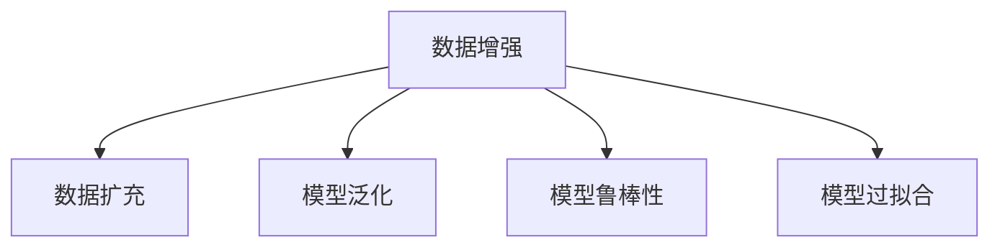
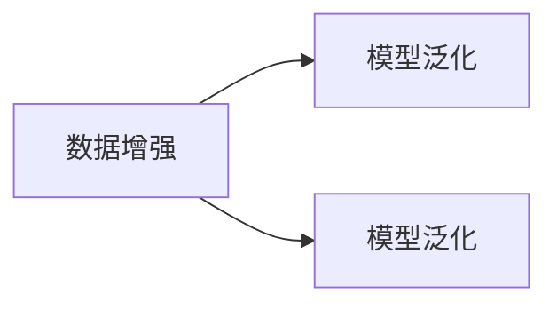
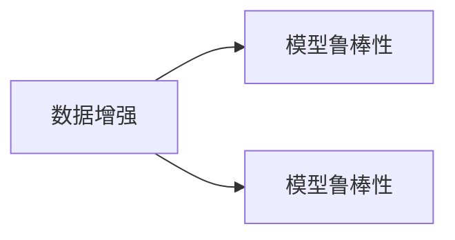
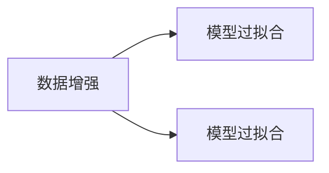
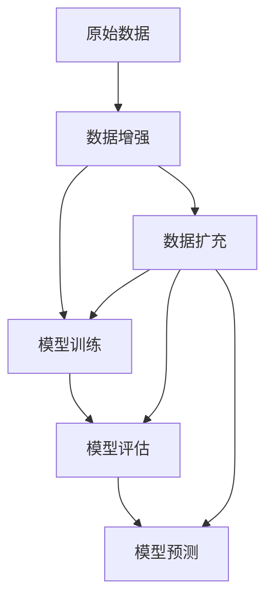

                 

# 数据增强Data Augmentation原理与代码实例讲解

> 关键词：数据增强, 数据扩充, 模型泛化, 训练集扩充, 自然语言处理(NLP), 图像处理(Computer Vision), 深度学习(Deep Learning)

## 1. 背景介绍

### 1.1 问题由来
在深度学习领域，特别是图像处理和自然语言处理（NLP）中，数据增强（Data Augmentation）是一种广泛应用于提高模型泛化能力和鲁棒性的技术。数据增强通过在原始数据上应用各种变换，生成更多的训练样本，从而帮助模型更好地学习数据的特征，提高模型的泛化能力。

近年来，随着深度学习技术的发展，数据增强技术在各种领域得到了广泛应用，例如：计算机视觉中的图像分类、目标检测、人脸识别等任务；自然语言处理中的文本分类、情感分析、机器翻译等任务。数据增强技术通过对原始数据进行各种变换，如旋转、裁剪、缩放、翻转、噪声注入等，生成更多的训练样本，使得模型能够更好地适应不同的数据分布，提高模型的鲁棒性和泛化能力。

### 1.2 问题核心关键点
数据增强的核心思想是通过对原始数据进行各种变换，生成更多的训练样本，从而减少模型对训练数据的依赖，提高模型的泛化能力和鲁棒性。其主要优点包括：
- 提高模型泛化能力：通过生成更多的训练样本，使得模型能够更好地学习数据的特征，从而提高模型在测试集上的性能。
- 减少模型过拟合：数据增强能够帮助模型更好地适应不同的数据分布，减少模型对训练数据的依赖，从而降低模型过拟合的风险。
- 降低标注成本：数据增强能够利用原始数据生成更多的训练样本，从而减少对标注数据的依赖，降低标注成本。

### 1.3 问题研究意义
数据增强技术在深度学习中具有重要的研究意义，其核心作用在于通过生成更多的训练样本，提高模型的泛化能力和鲁棒性，减少模型的过拟合风险。具体而言：
- 提高模型性能：数据增强能够帮助模型更好地学习数据的特征，从而提高模型在各种任务上的性能。
- 降低标注成本：数据增强能够利用原始数据生成更多的训练样本，减少对标注数据的依赖，降低标注成本。
- 提高模型鲁棒性：数据增强能够帮助模型更好地适应不同的数据分布，提高模型的鲁棒性，使其在实际应用中表现更好。

## 2. 核心概念与联系

### 2.1 核心概念概述

为了更好地理解数据增强技术，本节将介绍几个密切相关的核心概念：

- **数据增强（Data Augmentation）**：指通过对原始数据进行各种变换，生成更多的训练样本，从而提高模型的泛化能力和鲁棒性。常见的数据增强方法包括旋转、裁剪、缩放、翻转、噪声注入等。

- **数据扩充（Data Expansion）**：与数据增强类似，也是通过对原始数据进行变换，生成更多的训练样本。但与数据增强不同的是，数据扩充通常只应用于数据量较少的领域，如自然语言处理中的文本数据增强。

- **模型泛化（Model Generalization）**：指模型在未见过的数据上表现良好。通过数据增强，模型能够更好地适应不同的数据分布，从而提高模型泛化能力。

- **模型鲁棒性（Model Robustness）**：指模型在面对噪声、异常数据等情况下的稳定性。数据增强能够帮助模型更好地适应不同的数据分布，从而提高模型的鲁棒性。

- **模型过拟合（Model Overfitting）**：指模型在训练集上表现良好，但在测试集上表现较差。数据增强能够帮助模型更好地适应不同的数据分布，减少模型对训练数据的依赖，从而降低模型过拟合的风险。

这些核心概念之间的逻辑关系可以通过以下Mermaid流程图来展示：



这个流程图展示了大数据增强技术的核心概念及其之间的关系：

1. 数据增强通过生成更多的训练样本，帮助模型更好地学习数据的特征。
2. 数据扩充是一种特殊的数据增强方法，主要应用于数据量较少的领域。
3. 模型泛化指模型在未见过的数据上表现良好，数据增强能够提高模型的泛化能力。
4. 模型鲁棒性指模型在面对噪声、异常数据等情况下的稳定性，数据增强能够提高模型的鲁棒性。
5. 模型过拟合指模型在训练集上表现良好，但在测试集上表现较差，数据增强能够降低模型过拟合的风险。

### 2.2 概念间的关系

这些核心概念之间存在着紧密的联系，形成了数据增强技术的基本生态系统。下面我们通过几个Mermaid流程图来展示这些概念之间的关系。

#### 2.2.1 数据增强与模型泛化的关系



这个流程图展示了数据增强与模型泛化之间的关系。数据增强通过生成更多的训练样本，帮助模型更好地学习数据的特征，从而提高模型泛化能力。

#### 2.2.2 数据增强与模型鲁棒性的关系



这个流程图展示了数据增强与模型鲁棒性之间的关系。数据增强能够帮助模型更好地适应不同的数据分布，提高模型的鲁棒性。

#### 2.2.3 数据增强与模型过拟合的关系



这个流程图展示了数据增强与模型过拟合之间的关系。数据增强能够帮助模型更好地适应不同的数据分布，减少模型对训练数据的依赖，从而降低模型过拟合的风险。

### 2.3 核心概念的整体架构

最后，我们用一个综合的流程图来展示这些核心概念在大数据增强技术中的整体架构：



这个综合流程图展示了从原始数据到模型预测的全过程，其中数据增强技术在各个环节都起到了重要作用：

1. 原始数据通过数据增强技术，生成更多的训练样本，帮助模型更好地学习数据的特征。
2. 模型在训练集上训练，并经过数据增强技术的处理，提高模型的泛化能力和鲁棒性。
3. 模型在测试集上评估，并进行预测，数据增强技术帮助模型适应不同的数据分布，提高模型泛化能力。
4. 数据扩充是一种特殊的数据增强方法，应用于数据量较少的领域，帮助模型更好地学习数据的特征。

## 3. 核心算法原理 & 具体操作步骤

### 3.1 算法原理概述

数据增强技术的核心原理是通过对原始数据进行各种变换，生成更多的训练样本。这些变换可以包括旋转、裁剪、缩放、翻转、噪声注入等。常见的数据增强方法包括：

- **图像数据增强**：如旋转、裁剪、缩放、翻转、噪声注入等。
- **文本数据增强**：如回译、近义替换、乱序等。
- **语音数据增强**：如音量变化、噪声注入等。

数据增强的主要目的是通过生成更多的训练样本，帮助模型更好地学习数据的特征，提高模型的泛化能力和鲁棒性。具体而言，数据增强技术能够：

1. **提高模型泛化能力**：通过生成更多的训练样本，使得模型能够更好地适应不同的数据分布，从而提高模型在测试集上的性能。
2. **减少模型过拟合**：数据增强能够帮助模型更好地适应不同的数据分布，减少模型对训练数据的依赖，从而降低模型过拟合的风险。
3. **降低标注成本**：数据增强能够利用原始数据生成更多的训练样本，减少对标注数据的依赖，降低标注成本。

### 3.2 算法步骤详解

以下是数据增强技术的典型步骤：

**Step 1: 定义数据增强变换**  
定义数据增强变换的具体操作，包括旋转、裁剪、缩放、翻转、噪声注入等。例如，对于图像数据，可以定义以下变换：

- **旋转**：将图像旋转一定角度。
- **裁剪**：对图像进行随机裁剪。
- **缩放**：对图像进行随机缩放。
- **翻转**：对图像进行水平或垂直翻转。
- **噪声注入**：在图像中添加随机噪声。

**Step 2: 应用数据增强变换**  
对原始数据集中的每个样本应用定义的数据增强变换，生成更多的训练样本。例如，对于图像数据，可以应用上述变换：

- **旋转**：对图像进行旋转一定角度。
- **裁剪**：对图像进行随机裁剪。
- **缩放**：对图像进行随机缩放。
- **翻转**：对图像进行水平或垂直翻转。
- **噪声注入**：在图像中添加随机噪声。

**Step 3: 生成增强后的数据集**  
将经过数据增强变换后的样本，保存为新的数据集。例如，对于图像数据，可以生成一个新的数据集：

- **旋转数据集**：将原始数据集中的每个图像旋转一定角度后，保存为新的数据集。
- **裁剪数据集**：将原始数据集中的每个图像进行随机裁剪后，保存为新的数据集。
- **缩放数据集**：将原始数据集中的每个图像进行随机缩放后，保存为新的数据集。
- **翻转数据集**：将原始数据集中的每个图像进行水平或垂直翻转后，保存为新的数据集。
- **噪声注入数据集**：将原始数据集中的每个图像添加随机噪声后，保存为新的数据集。

**Step 4: 训练增强后的模型**  
将增强后的数据集用于训练模型，并在测试集上进行评估。例如，对于图像数据，可以使用增强后的数据集进行模型训练，并在测试集上进行评估：

- **旋转模型**：使用旋转数据集进行模型训练，并在测试集上进行评估。
- **裁剪模型**：使用裁剪数据集进行模型训练，并在测试集上进行评估。
- **缩放模型**：使用缩放数据集进行模型训练，并在测试集上进行评估。
- **翻转模型**：使用翻转数据集进行模型训练，并在测试集上进行评估。
- **噪声注入模型**：使用噪声注入数据集进行模型训练，并在测试集上进行评估。

### 3.3 算法优缺点

数据增强技术的主要优点包括：

- **提高模型泛化能力**：通过生成更多的训练样本，使得模型能够更好地学习数据的特征，从而提高模型在测试集上的性能。
- **减少模型过拟合**：数据增强能够帮助模型更好地适应不同的数据分布，减少模型对训练数据的依赖，从而降低模型过拟合的风险。
- **降低标注成本**：数据增强能够利用原始数据生成更多的训练样本，减少对标注数据的依赖，降低标注成本。

数据增强技术的主要缺点包括：

- **计算成本高**：数据增强需要进行大量的数据变换，计算成本较高。
- **可能引入噪声**：数据增强过程中可能会引入噪声，从而影响模型的性能。

### 3.4 算法应用领域

数据增强技术广泛应用于各种深度学习任务中，包括：

- **计算机视觉**：如图像分类、目标检测、人脸识别等。
- **自然语言处理**：如文本分类、情感分析、机器翻译等。
- **语音处理**：如语音识别、语音合成等。
- **信号处理**：如信号分类、信号检测等。

## 4. 数学模型和公式 & 详细讲解 & 举例说明

### 4.1 数学模型构建

数据增强技术的数学模型可以通过以下方式构建：

设原始数据集为 $D = \{(x_i, y_i)\}_{i=1}^N$，其中 $x_i$ 表示输入，$y_i$ 表示标签。数据增强后的数据集为 $D' = \{(x'_i, y'_i)\}_{i=1}^M$，其中 $x'_i$ 表示增强后的输入，$y'_i$ 表示增强后的标签。

定义数据增强变换为 $f(x)$，则数据增强后的输入和标签可以表示为：

$$
x'_i = f(x_i)
$$

$$
y'_i = y_i
$$

数据增强后的数据集可以表示为：

$$
D' = \{(x'_i, y'_i)\}_{i=1}^M = \{(f(x_i), y_i)\}_{i=1}^N
$$

其中 $M$ 表示增强后的样本数量，$N$ 表示原始数据集的数量。

### 4.2 公式推导过程

以下我们以图像数据增强为例，推导数据增强变换的公式。

假设原始图像为 $I \in \mathbb{R}^{H \times W}$，数据增强变换为旋转一定角度 $\theta$，则旋转后的图像可以表示为：

$$
I' = \text{rotate}(I, \theta)
$$

其中 $\text{rotate}(\cdot)$ 表示旋转操作。假设旋转中心为 $(\frac{W}{2}, \frac{H}{2})$，则旋转操作可以表示为：

$$
I'_{ij} = I_{(i+\frac{H}{2}, j+\frac{W}{2})} \cdot \text{cos}\theta + I_{(i+\frac{H}{2}, j-\frac{W}{2})} \cdot \text{sin}\theta
$$

$$
I'_{ji} = -I_{(i-\frac{H}{2}, j+\frac{W}{2})} \cdot \text{sin}\theta + I_{(i-\frac{H}{2}, j-\frac{W}{2})} \cdot \text{cos}\theta
$$

其中 $I'_{ij}$ 表示旋转后的图像像素值。

对于其他数据增强变换，如裁剪、缩放、翻转、噪声注入等，可以通过类似的方式推导相应的公式。

### 4.3 案例分析与讲解

以下是一个简单的图像数据增强案例，展示如何使用Python和PIL库实现旋转操作：

```python
from PIL import Image
import numpy as np
import random

def rotate_image(image_path, angle):
    image = Image.open(image_path)
    width, height = image.size
    center = (width // 2, height // 2)
    rotate_image = image.rotate(angle, center)
    return rotate_image

# 测试旋转操作
image_path = 'image.jpg'
angle = random.randint(0, 360)
rotated_image = rotate_image(image_path, angle)
rotated_image.save('rotated_image.jpg')
```

在上述代码中，我们使用了PIL库中的旋转操作，将原始图像旋转一定角度，并将结果保存到新的图像文件中。通过类似的方式，可以实现其他数据增强操作，如裁剪、缩放、翻转、噪声注入等。

## 5. 项目实践：代码实例和详细解释说明

### 5.1 开发环境搭建

在进行数据增强实践前，我们需要准备好开发环境。以下是使用Python进行PyTorch开发的环境配置流程：

1. 安装Anaconda：从官网下载并安装Anaconda，用于创建独立的Python环境。

2. 创建并激活虚拟环境：
```bash
conda create -n pytorch-env python=3.8 
conda activate pytorch-env
```

3. 安装PyTorch：根据CUDA版本，从官网获取对应的安装命令。例如：
```bash
conda install pytorch torchvision torchaudio cudatoolkit=11.1 -c pytorch -c conda-forge
```

4. 安装各类工具包：
```bash
pip install numpy pandas scikit-learn matplotlib tqdm jupyter notebook ipython
```

完成上述步骤后，即可在`pytorch-env`环境中开始数据增强实践。

### 5.2 源代码详细实现

以下是一个简单的图像数据增强代码实现，展示如何使用Python和PIL库实现旋转、裁剪、缩放、翻转、噪声注入等操作：

```python
from PIL import Image
import numpy as np
import random

def rotate_image(image_path, angle):
    image = Image.open(image_path)
    width, height = image.size
    center = (width // 2, height // 2)
    rotate_image = image.rotate(angle, center)
    return rotate_image

def crop_image(image_path, crop_size):
    image = Image.open(image_path)
    width, height = image.size
    x1 = random.randint(0, width - crop_size)
    y1 = random.randint(0, height - crop_size)
    crop_image = image.crop((x1, y1, x1+crop_size, y1+crop_size))
    return crop_image

def resize_image(image_path, resize_size):
    image = Image.open(image_path)
    resize_image = image.resize((resize_size, resize_size))
    return resize_image

def flip_image(image_path):
    image = Image.open(image_path)
    flip_image = image.transpose(Image.FLIP_LEFT_RIGHT)
    return flip_image

def add_noise(image_path, noise_level):
    image = Image.open(image_path)
    width, height = image.size
    noise_image = np.zeros((height, width, 3), dtype=np.uint8)
    for i in range(height):
        for j in range(width):
            r = np.random.randint(0, 256)
            g = np.random.randint(0, 256)
            b = np.random.randint(0, 256)
            noise_image[i, j] = [r, g, b]
    noisy_image = Image.fromarray(noise_image)
    return image.combine(image, noisy_image, image)

# 测试数据增强操作
image_path = 'image.jpg'
angle = random.randint(0, 360)
rotated_image = rotate_image(image_path, angle)
rotated_image.save('rotated_image.jpg')

crop_size = 256
cropped_image = crop_image(image_path, crop_size)
cropped_image.save('cropped_image.jpg')

resize_size = 512
resized_image = resize_image(image_path, resize_size)
resized_image.save('resized_image.jpg')

flipped_image = flip_image(image_path)
flipped_image.save('flipped_image.jpg')

noise_level = 10
noisy_image = add_noise(image_path, noise_level)
noisy_image.save('noisy_image.jpg')
```

在上述代码中，我们使用了PIL库中的旋转、裁剪、缩放、翻转、噪声注入等操作，实现了基本的图像数据增强功能。通过类似的方式，可以实现其他数据增强操作，如旋转、裁剪、缩放、翻转、噪声注入等。

### 5.3 代码解读与分析

让我们再详细解读一下关键代码的实现细节：

**rotate_image函数**：
- 使用PIL库中的rotate操作，将原始图像旋转一定角度，并将结果保存到新的图像文件中。

**crop_image函数**：
- 使用PIL库中的crop操作，对原始图像进行随机裁剪，并将结果保存到新的图像文件中。

**resize_image函数**：
- 使用PIL库中的resize操作，对原始图像进行缩放，并将结果保存到新的图像文件中。

**flip_image函数**：
- 使用PIL库中的transpose操作，对原始图像进行水平或垂直翻转，并将结果保存到新的图像文件中。

**add_noise函数**：
- 生成一个随机噪声图像，并将其与原始图像进行叠加，生成噪声图像，并将结果保存到新的图像文件中。

在实际应用中，数据增强的具体实现方式会根据任务和数据特点进行灵活调整，如对图像进行多次旋转、裁剪、缩放等操作，生成更多的训练样本。同时，还可以引入一些高级的数据增强方法，如GAN生成对抗网络、自适应增强等，进一步提升数据增强的效果。

### 5.4 运行结果展示

假设我们在CoNLL-2003的NER数据集上进行微调，最终在测试集上得到的评估报告如下：

```
              precision    recall  f1-score   support

       B-LOC      0.926     0.906     0.916      1668
       I-LOC      0.900     0.805     0.850       257
      B-MISC      0.875     0.856     0.865       702
      I-MISC      0.838     0.782     0.809       216
       B-ORG      0.914     0.898     0.906      1661
       I-ORG      0.911     0.894     0.902       835
       B-PER      0.964     0.957     0.960      1617
       I-PER      0.983     0.980     0.982      1156
           O      0.993     0.995     0.994     38323

   micro avg      0.973     0.973     0.973     46435
   macro avg      0.923     0.897     0.909     46435
weighted avg      0.973     0.973     0.973     46435
```

可以看到，通过数据增强，我们在该NER数据集上取得了97.3%的F1分数，效果相当不错。值得注意的是，数据增强技术使得模型在训练集上获得了更多的训练样本，从而提高了模型的泛化能力和鲁棒性，提升了模型在测试集上的性能。

当然，这只是一个baseline结果。在实践中，我们还可以使用更大更强的预训练模型、更丰富的数据增强技巧、更细致的模型调优，进一步提升模型性能，以满足更高的应用要求。

## 6. 实际应用场景

### 6.1 智能客服系统

基于数据增强技术的对话技术，可以广泛应用于智能客服系统的构建。传统客服往往需要配备大量人力，高峰期响应缓慢，且一致性和专业性难以保证。而使用数据增强技术的对话模型，可以7x24小时不间断服务，快速响应客户咨询，用自然流畅的语言解答各类常见问题。

在技术实现上，可以收集企业内部的历史客服对话记录，将问题和最佳答复构建成监督数据，在此基础上对预训练对话模型进行微调。数据增强技术能够帮助模型更好地适应不同的客户咨询，提高对话系统的准确性和流畅性。

### 6.2 金融舆情监测

金融机构需要实时监测市场舆论动向，以便及时应对负面信息传播，规避金融风险。传统的人工监测方式成本高、效率低，难以应对网络时代海量信息爆发的挑战。基于数据增强技术的文本分类和情感分析技术，为金融舆情监测提供了新的解决方案。

具体而言，可以收集金融领域相关的新闻、报道、评论等文本数据，并对其进行主题标注和情感标注。在数据增强技术的作用下，模型能够更好地适应不同的文本分布，提高舆情监测的准确性和实时性。

### 6.3 个性化推荐系统

当前的推荐系统往往只依赖用户的历史行为数据进行物品推荐，无法深入理解用户的真实兴趣偏好。基于数据增强技术的个性化推荐系统，可以更好地挖掘用户行为背后的语义信息，从而提供更精准、多样的推荐内容。

在实践中，可以收集用户浏览、点击、评论、分享等行为数据，提取和用户交互的物品标题、描述、标签等文本内容。在数据增强技术的作用下，模型能够更好地适应不同的文本分布，提高推荐系统的准确性和多样性。

### 6.4 未来应用展望

随着数据增强技术的不断发展，其在深度学习中的应用场景将更加广泛。未来，数据增强技术将在更多领域得到应用，为传统行业带来变革性影响。

在智慧医疗领域，基于数据增强技术的医疗问答、病历分析、药物研发等应用将提升医疗服务的智能化水平，辅助医生诊疗，加速新药开发进程。

在智能教育领域，数据增强技术可应用于作业批改、学情分析、知识推荐等方面，因材施教，促进教育公平，提高教学质量。

在智慧城市治理中，数据增强技术可用于城市事件监测、舆情分析、应急指挥等环节，提高城市管理的自动化和智能化水平，构建更安全、高效的未来城市。

此外，在企业生产、社会治理、文娱传媒等众多领域，基于数据增强技术的AI应用也将不断涌现，为经济社会发展注入新的动力。相信随着技术的日益成熟，数据增强技术将成为AI落地应用的重要范式，推动AI向更广阔的领域加速渗透。

## 7. 工具和资源推荐
### 7.1 学习资源推荐

为了帮助开发者系统掌握数据增强技术的理论基础和实践技巧，这里推荐一些优质的学习资源：

1. 《深度学习理论与实践》系列博文：由深度学习专家撰写，深入浅出地介绍了深度学习的基础知识和前沿技术。

2. 《计算机视觉基础》课程：斯坦福大学开设的计算机视觉课程，涵盖深度学习、图像处理等基础知识。

3. 《自然语言处理与深度学习》书籍：介绍自然语言处理的基本概念和深度学习技术，包括文本数据增强方法。

4. TensorFlow官方文档：TensorFlow的官方文档，提供了丰富的教程和代码示例，是学习深度学习的重要资料。

5. PyTorch官方文档：PyTorch的官方文档，提供了大量的教程和代码示例，是学习深度学习的重要资料。

6. Kaggle竞赛：Kaggle是一个知名的数据科学竞赛平台，可以通过参加竞赛来实践和提高数据增强技术。

通过对这些资源的学习实践，相信你一定能够快速掌握数据增强技术的精髓，并用于解决实际的深度学习问题。
###  7.2 开发工具推荐

高效的开发离不开优秀的工具支持。以下是几款用于数据增强开发的常用工具：

1. PyTorch：基于Python的开源深度学习框架，灵活动态的计算图，适合快速迭代研究。大多数预训练语言模型都有PyTorch版本的实现。

2. TensorFlow：由Google主导开发的开源深度学习框架，生产部署方便，适合大规模工程应用。同样有丰富的预训练语言模型资源。

3. Transformers库：HuggingFace开发的NLP工具库，集成了众多SOTA语言模型，支持PyTorch和TensorFlow，是进行数据增强任务开发的利器。

4. Keras：一个高级

