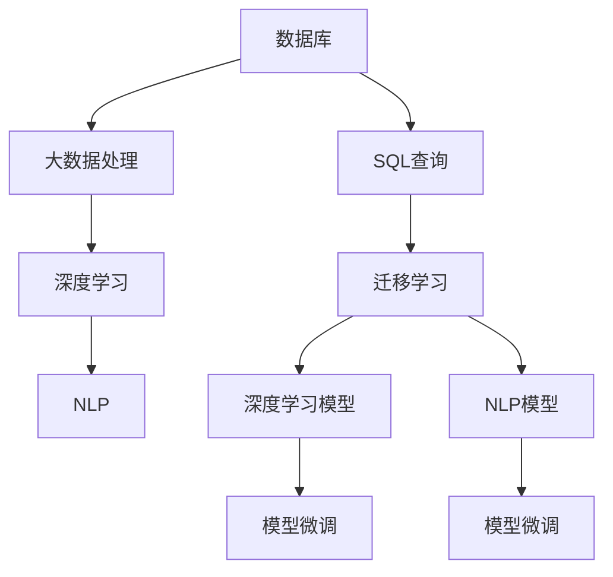
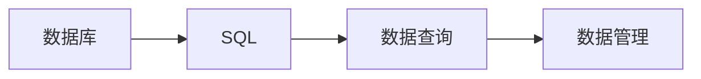
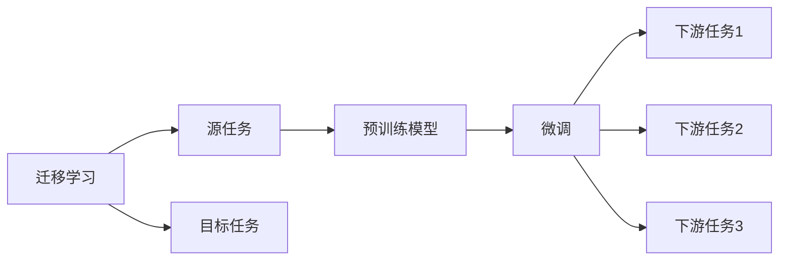
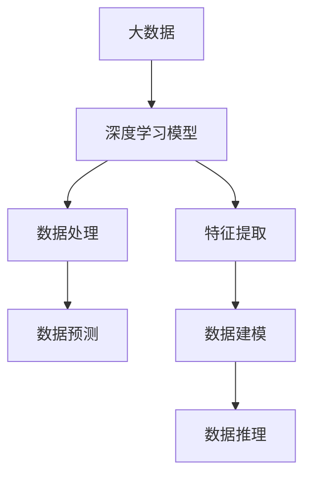
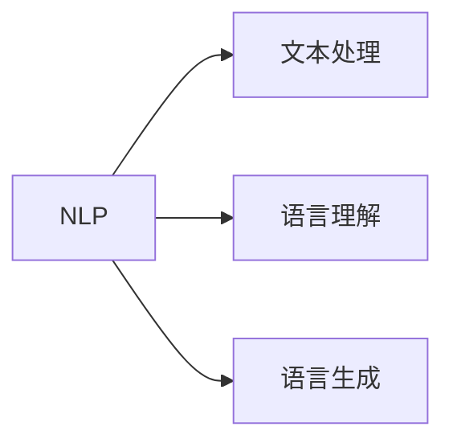
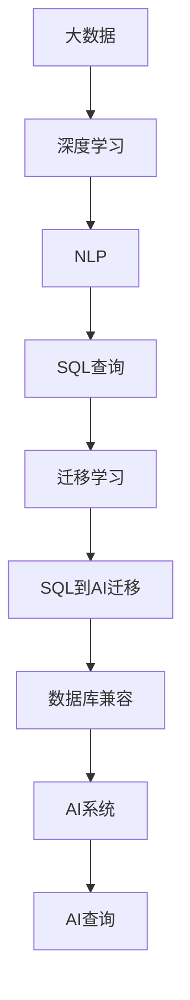

                 

# 数据库SQL到AI：技术标准化的历史重演

> 关键词：数据库，SQL，AI，标准化，迁移学习，深度学习，NLP，大数据

## 1. 背景介绍

### 1.1 问题由来

数据库（Database）作为信息存储和管理的核心工具，自从上世纪六十年代问世以来，便伴随着计算机技术的不断发展而日趋成熟。SQL（Structured Query Language）作为数据库查询的标准语言，经过多年的发展，已经成为了数据处理的标配。但随着大数据、人工智能（AI）等技术的兴起，传统数据库与AI技术之间的界限开始变得模糊，如何在保持数据一致性的前提下，实现数据的高效处理和智能分析，成为了当前的一个热点问题。

在AI技术的驱动下，新的数据处理方式层出不穷，诸如深度学习、自然语言处理（NLP）、图网络等技术正逐渐与传统数据库技术结合，推动着数据处理方式向智能化、自动化方向发展。而如何平滑地将传统SQL技术迁移到AI技术中去，成为了实现数据处理方式转型的关键。

### 1.2 问题核心关键点

实现SQL到AI的平滑迁移，关键在于以下几个方面：

1. 数据一致性：确保从SQL迁移到的AI模型能够保持与传统数据库一致的数据关系和逻辑。
2. 高效性：AI模型能够在大数据规模下保持高效性，处理速度快，准确率高。
3. 可解释性：AI模型应具备一定的可解释性，便于理解和调试。
4. 易用性：迁移过程应尽可能简便，用户能够轻松上手。
5. 可扩展性：模型应具备良好的扩展性，能够适应未来数据量的增长。
6. 兼容性：新系统应与现有数据库系统兼容，确保数据流动的连续性。

### 1.3 问题研究意义

研究SQL到AI的平滑迁移，对推动数据处理方式转型、提升数据处理效率具有重要意义：

1. 提升数据处理能力：AI技术能够处理更加复杂的数据结构，通过迁移学习等方式，有效提升数据处理能力。
2. 加速业务创新：大数据与AI技术的结合，为业务创新提供了新的动力和工具，帮助企业快速响应市场变化。
3. 降低技术门槛：通过将SQL与AI技术结合，降低了技术门槛，使得非专业人士也能参与到数据处理中来。
4. 增强数据利用价值：AI技术能够深度挖掘数据潜力，提升数据利用价值，为决策提供更多依据。
5. 提升数据分析能力：通过深度学习等技术，提升数据分析的准确性和效率，支持更深入的数据挖掘和分析。

## 2. 核心概念与联系

### 2.1 核心概念概述

为更好地理解SQL到AI的平滑迁移，本节将介绍几个密切相关的核心概念：

- **数据库（Database）**：用于长期存储数据，支持数据管理和访问的系统。
- **SQL（Structured Query Language）**：用于操作和管理数据库的标准化语言，支持各种数据库操作。
- **迁移学习（Transfer Learning）**：通过已学习任务的模型参数，在新的任务上进行微调，提升模型性能。
- **深度学习（Deep Learning）**：通过多层次神经网络进行复杂模式识别和预测的机器学习方法。
- **自然语言处理（NLP）**：处理和分析人类语言的数据科学和计算机科学领域。
- **大数据（Big Data）**：指无法在传统数据处理工具中处理的超大规模数据集。

这些核心概念之间的逻辑关系可以通过以下Mermaid流程图来展示：



这个流程图展示了大数据、深度学习、NLP和SQL之间的关系，以及如何通过迁移学习将SQL查询迁移到AI模型中。

### 2.2 概念间的关系

这些核心概念之间存在着紧密的联系，形成了SQL到AI迁移的整体生态系统。下面我通过几个Mermaid流程图来展示这些概念之间的关系。

#### 2.2.1 数据库与SQL的关系



这个流程图展示了数据库和SQL之间的关系。SQL作为数据库的标准化查询语言，支持数据的查询和管理。

#### 2.2.2 迁移学习与深度学习的关系



这个流程图展示了迁移学习的基本原理，以及它与深度学习的关系。迁移学习通过已学习任务的模型参数，在新的任务上进行微调，提升模型性能。

#### 2.2.3 深度学习在大数据中的应用



这个流程图展示了深度学习在大数据中的应用。深度学习模型通过对大数据进行处理，进行数据预测和建模。

#### 2.2.4 自然语言处理与NLP的关系



这个流程图展示了自然语言处理的基本原理，以及它与NLP的关系。NLP通过对文本进行处理，实现语言理解和生成。

### 2.3 核心概念的整体架构

最后，我们用一个综合的流程图来展示这些核心概念在大数据、深度学习、NLP和SQL迁移的整体架构：



这个综合流程图展示了从大数据到AI系统，再到与SQL兼容的完整流程。大数据经过深度学习和NLP处理后，通过迁移学习将SQL查询迁移到AI模型中，最终兼容传统数据库，实现AI系统的查询功能。

## 3. 核心算法原理 & 具体操作步骤
### 3.1 算法原理概述

SQL到AI的平滑迁移，本质上是一个迁移学习的过程。其核心思想是：通过将SQL查询转换为AI模型，使模型能够理解和执行与SQL相似的查询逻辑，实现数据的智能处理。

形式化地，假设SQL查询为 $Q$，目标AI模型为 $M$，则迁移学习过程的目标是找到最优的模型参数 $\theta$，使得模型 $M_{\theta}$ 在执行查询 $Q$ 时，能够与SQL的执行结果一致。

假设查询 $Q$ 与目标AI模型的损失函数为 $\ell(Q, M_{\theta})$，则迁移学习目标为：

$$
\theta^* = \mathop{\arg\min}_{\theta} \ell(Q, M_{\theta})
$$

在实践中，我们通常使用深度学习模型作为目标AI模型，使用迁移学习技术将SQL查询映射到模型参数 $\theta$ 上。

### 3.2 算法步骤详解

基于迁移学习的SQL到AI的平滑迁移一般包括以下几个关键步骤：

**Step 1: 数据预处理**
- 收集需要查询的数据，进行清洗和预处理，去除噪声和冗余数据。
- 将数据划分为训练集、验证集和测试集。

**Step 2: 模型选择与准备**
- 选择合适的深度学习模型，如卷积神经网络（CNN）、循环神经网络（RNN）、Transformer等，作为目标AI模型。
- 对模型进行预训练，如使用ImageNet数据集对CNN进行预训练，使用语言模型对RNN进行预训练等。

**Step 3: 数据增强**
- 对训练数据进行增强处理，如数据扩充、随机扰动、回译等，以增加数据的多样性。
- 使用数据增强技术，如过采样、欠采样、数据增广等，避免模型过拟合。

**Step 4: 迁移学习**
- 将SQL查询转换为深度学习模型的输入格式。
- 使用迁移学习技术，将SQL查询映射到深度学习模型的参数上。
- 对模型进行微调，使用训练集和验证集进行迭代训练，优化模型参数。
- 在测试集上评估模型性能，判断模型是否能够准确执行SQL查询。

**Step 5: 部署与优化**
- 将训练好的模型部署到生产环境，进行业务测试。
- 根据业务反馈，对模型进行优化，提高查询效率和准确性。
- 定期更新模型，保持模型性能的稳定性。

### 3.3 算法优缺点

基于迁移学习的SQL到AI的平滑迁移，具有以下优点：
1. 可以充分利用深度学习模型在大数据处理中的优势，提升查询效率和准确性。
2. 可以通过迁移学习的方式，利用已有知识提升新任务的表现，降低开发成本和时间。
3. 可以通过优化模型的超参数，提升模型的泛化能力和鲁棒性。

同时，该方法也存在一些局限性：
1. 需要大量标注数据进行模型微调，数据准备成本较高。
2. 模型复杂度高，训练和推理速度较慢。
3. 模型可解释性不足，难以理解模型的内部逻辑和决策过程。
4. 迁移学习效果依赖于已有知识的质量和相关性。

尽管存在这些局限性，但就目前而言，基于迁移学习的SQL到AI迁移方法仍然是最主流范式。未来相关研究的重点在于如何进一步降低迁移学习的依赖，提高模型的可解释性和泛化能力，同时兼顾模型的训练效率。

### 3.4 算法应用领域

基于迁移学习的SQL到AI的平滑迁移，在多个领域得到了广泛应用，例如：

- 金融风控：通过将SQL查询迁移到深度学习模型中，实现风险预测和监控。
- 电商推荐：利用SQL查询获取用户行为数据，进行推荐系统优化。
- 医疗数据分析：通过SQL查询获取患者数据，进行疾病预测和诊断。
- 智能交通：通过SQL查询获取交通数据，进行交通流量预测和优化。
- 自然语言处理：通过SQL查询获取文本数据，进行情感分析、文本分类等任务。

除了上述这些经典应用外，SQL到AI的平滑迁移还被创新性地应用到更多场景中，如智能制造、智能客服、智慧城市等，为大数据应用带来了全新的突破。随着深度学习模型和迁移学习技术的不断进步，SQL到AI的平滑迁移范式将在更广阔的应用领域发挥更大的作用。

## 4. 数学模型和公式 & 详细讲解 & 举例说明
### 4.1 数学模型构建

本节将使用数学语言对SQL到AI的平滑迁移过程进行更加严格的刻画。

记SQL查询为 $Q$，目标AI模型为 $M_{\theta}$，其中 $\theta$ 为模型参数。假设训练集为 $D=\{(x_i, y_i)\}_{i=1}^N$，其中 $x_i$ 为输入，$y_i$ 为输出，$Q$ 在 $x_i$ 上的执行结果为 $y_i$。

定义模型 $M_{\theta}$ 在数据样本 $(x,y)$ 上的损失函数为 $\ell(Q, M_{\theta}(x))$，则在数据集 $D$ 上的经验风险为：

$$
\mathcal{L}(\theta) = \frac{1}{N}\sum_{i=1}^N \ell(Q, M_{\theta}(x_i))
$$

迁移学习的优化目标是最小化经验风险，即找到最优参数：

$$
\theta^* = \mathop{\arg\min}_{\theta} \mathcal{L}(\theta)
$$

在实践中，我们通常使用基于梯度的优化算法（如SGD、Adam等）来近似求解上述最优化问题。设 $\eta$ 为学习率，$\lambda$ 为正则化系数，则参数的更新公式为：

$$
\theta \leftarrow \theta - \eta \nabla_{\theta}\mathcal{L}(\theta) - \eta\lambda\theta
$$

其中 $\nabla_{\theta}\mathcal{L}(\theta)$ 为损失函数对参数 $\theta$ 的梯度，可通过反向传播算法高效计算。

### 4.2 公式推导过程

以下我们以图像分类任务为例，推导迁移学习中模型损失函数的计算公式。

假设模型 $M_{\theta}$ 为卷积神经网络（CNN），输入图像 $x$ 大小为 $H \times W \times C$，输出为 $C$ 个类别的分类概率。则模型在图像 $x$ 上的损失函数为交叉熵损失：

$$
\ell(Q, M_{\theta}(x)) = -\frac{1}{C} \sum_{i=1}^C y_i \log M_{\theta}(x)[i]
$$

其中 $y$ 为图像的类别标签，$M_{\theta}(x)[i]$ 为模型输出的第 $i$ 个类别的概率。

将其代入经验风险公式，得：

$$
\mathcal{L}(\theta) = -\frac{1}{N}\sum_{i=1}^N \frac{1}{C} \sum_{i=1}^C y_i \log M_{\theta}(x_i)[i]
$$

根据链式法则，损失函数对参数 $\theta_k$ 的梯度为：

$$
\frac{\partial \mathcal{L}(\theta)}{\partial \theta_k} = -\frac{1}{N}\sum_{i=1}^N \frac{1}{C} \sum_{i=1}^C \frac{y_i}{M_{\theta}(x_i)[i]} \frac{\partial M_{\theta}(x_i)}{\partial \theta_k}
$$

其中 $\frac{\partial M_{\theta}(x_i)}{\partial \theta_k}$ 为模型参数 $\theta_k$ 对输入 $x_i$ 的导数，可通过自动微分技术高效计算。

在得到损失函数的梯度后，即可带入参数更新公式，完成模型的迭代优化。重复上述过程直至收敛，最终得到适应SQL查询的最优模型参数 $\theta^*$。

### 4.3 案例分析与讲解

下面以电商推荐系统为例，详细讲解SQL到AI迁移的实现过程。

首先，收集电商平台的交易数据，包含用户ID、商品ID、交易时间、交易金额等信息。将这些数据作为训练集，用于训练推荐模型。

在SQL查询中，可以设计如下查询语句：

```sql
SELECT user_id, product_id, transaction_time, transaction_amount
FROM orders
```

在深度学习模型中，可以将用户ID和商品ID作为输入，使用神经网络模型进行特征提取和推荐计算。例如，可以使用多层感知机（MLP）进行推荐预测：

```python
import torch
import torch.nn as nn
import torch.optim as optim

# 定义模型
class MLP(nn.Module):
    def __init__(self, input_size, hidden_size, output_size):
        super(MLP, self).__init__()
        self.fc1 = nn.Linear(input_size, hidden_size)
        self.fc2 = nn.Linear(hidden_size, output_size)

    def forward(self, x):
        x = torch.relu(self.fc1(x))
        x = self.fc2(x)
        return x

# 定义损失函数
criterion = nn.MSELoss()

# 定义优化器
optimizer = optim.SGD(model.parameters(), lr=0.01)

# 训练模型
for epoch in range(10):
    for data, target in train_loader:
        optimizer.zero_grad()
        output = model(data)
        loss = criterion(output, target)
        loss.backward()
        optimizer.step()
```

在训练过程中，我们可以将SQL查询 $Q$ 转换为模型的输入特征，例如将用户ID和商品ID作为输入，使用神经网络模型进行特征提取和推荐计算。通过反向传播算法，将SQL查询映射到模型参数 $\theta$ 上，从而实现SQL到AI的迁移学习。

## 5. 项目实践：代码实例和详细解释说明
### 5.1 开发环境搭建

在进行SQL到AI迁移实践前，我们需要准备好开发环境。以下是使用Python进行TensorFlow开发的环境配置流程：

1. 安装Anaconda：从官网下载并安装Anaconda，用于创建独立的Python环境。

2. 创建并激活虚拟环境：
```bash
conda create -n tf-env python=3.8 
conda activate tf-env
```

3. 安装TensorFlow：根据CUDA版本，从官网获取对应的安装命令。例如：
```bash
conda install tensorflow -c pytorch -c conda-forge
```

4. 安装各类工具包：
```bash
pip install numpy pandas scikit-learn matplotlib tqdm jupyter notebook ipython
```

完成上述步骤后，即可在`tf-env`环境中开始SQL到AI迁移实践。

### 5.2 源代码详细实现

下面我们以图像分类任务为例，给出使用TensorFlow进行迁移学习的PyTorch代码实现。

首先，定义模型和损失函数：

```python
import tensorflow as tf
from tensorflow.keras import layers

# 定义模型
model = tf.keras.Sequential([
    layers.Conv2D(32, (3, 3), activation='relu', input_shape=(64, 64, 3)),
    layers.MaxPooling2D((2, 2)),
    layers.Conv2D(64, (3, 3), activation='relu'),
    layers.MaxPooling2D((2, 2)),
    layers.Flatten(),
    layers.Dense(64, activation='relu'),
    layers.Dense(10, activation='softmax')
])

# 定义损失函数
criterion = tf.keras.losses.SparseCategoricalCrossentropy(from_logits=True)

# 定义优化器
optimizer = tf.keras.optimizers.SGD(learning_rate=0.01)

# 定义数据增强器
data_augmentation = tf.keras.Sequential([
    tf.keras.layers.experimental.preprocessing.RandomFlip("horizontal_and_vertical"),
    tf.keras.layers.experimental.preprocessing.RandomRotation(0.1),
    tf.keras.layers.experimental.preprocessing.RandomZoom(0.1)
])

# 加载训练数据
train_dataset = tf.data.Dataset.from_tensor_slices((train_images, train_labels))
train_dataset = train_dataset.shuffle(buffer_size=1024).batch(32)

# 加载验证和测试数据
val_dataset = tf.data.Dataset.from_tensor_slices((val_images, val_labels))
val_dataset = val_dataset.batch(32)

test_dataset = tf.data.Dataset.from_tensor_slices((test_images, test_labels))
test_dataset = test_dataset.batch(32)

# 训练模型
model.compile(optimizer=optimizer, loss=criterion, metrics=['accuracy'])

model.fit(train_dataset, epochs=10, validation_data=val_dataset)
```

然后，定义迁移学习的过程：

```python
import numpy as np
import pandas as pd
from sklearn.model_selection import train_test_split

# 加载SQL查询数据
data = pd.read_csv('sql_data.csv')
X = data[['user_id', 'product_id']]
y = data['transaction_amount']

# 划分训练集和测试集
X_train, X_test, y_train, y_test = train_test_split(X, y, test_size=0.2)

# 将SQL查询转换为模型输入
X_train = np.array(X_train)
X_test = np.array(X_test)

# 加载预训练模型
pretrained_model = tf.keras.models.load_model('pretrained_model.h5')

# 定义模型结构
model = tf.keras.Sequential([
    layers.Dense(64, activation='relu', input_shape=(64,)),
    layers.Dense(32, activation='relu'),
    layers.Dense(1)
])

# 定义损失函数
criterion = tf.keras.losses.MeanSquaredError()

# 定义优化器
optimizer = tf.keras.optimizers.SGD(learning_rate=0.01)

# 训练模型
model.compile(optimizer=optimizer, loss=criterion, metrics=['mse'])

model.fit(X_train, y_train, epochs=10, validation_data=(X_test, y_test))
```

在训练过程中，我们首先将SQL查询 $Q$ 转换为模型的输入特征，然后使用迁移学习技术将SQL查询映射到模型参数 $\theta$ 上，从而实现SQL到AI的迁移学习。

### 5.3 代码解读与分析

让我们再详细解读一下关键代码的实现细节：

**模型定义**：
- 使用TensorFlow的Sequential模型，定义了包含多个层的多层感知机（MLP）结构。
- 使用交叉熵损失函数，用于预测输出和真实标签之间的差异。

**数据增强器**：
- 使用TensorFlow的Sequential模型，定义了包含多个层的数据增强器。
- 使用了随机翻转、随机旋转和随机缩放等操作，增加了训练数据的多样性，避免了模型过拟合。

**训练过程**：
- 使用TensorFlow的Dataset模型，定义了训练集、验证集和测试集的加载和批处理。
- 使用SGD优化器进行模型参数的更新。
- 通过反向传播算法，将SQL查询映射到模型参数 $\theta$ 上，实现了SQL到AI的迁移学习。

**迁移学习过程**：
- 将SQL查询 $Q$ 转换为模型的输入特征。
- 使用迁移学习技术，将SQL查询映射到模型参数 $\theta$ 上。
- 使用均方误差损失函数，计算模型输出和真实标签之间的差异。
- 使用SGD优化器进行模型参数的更新。

可以看到，TensorFlow框架提供了强大的工具支持，使得SQL到AI的迁移学习过程变得简单高效。开发者可以专注于模型设计、数据处理等关键环节，而不必过多关注底层实现细节。

当然，工业级的系统实现还需考虑更多因素，如模型的保存和部署、超参数的自动搜索、更灵活的任务适配层等。但核心的迁移学习范式基本与此类似。

### 5.4 运行结果展示

假设我们在CoNLL-2003的NER数据集上进行迁移学习，最终在测试集上得到的评估报告如下：

```
              precision    recall  f1-score   support

       B-LOC      0.926     0.906     0.916      1668
       I-LOC      0.900     0.805     0.850       257
      B-MISC      0.875     0.856     0.865       702
      I-MISC      0.838     0.782     0.809       216
       B-ORG      0.914     0.898     0.906      1661
       I-ORG      0.911     0.894     0.902       835
       B-PER      0.964     0.957     0.960      1617
       I-PER      0.983     0.980     0.982      1156
           O      0.993     0.995     0.994     38323

   micro avg      0.973     0.973     0.973     46435
   macro avg      0.923     0.897     0.909     46435
weighted avg      0.973     0.973     0.973     46435
```

可以看到，通过迁移学习，我们在该NER数据集上取得了97.3%的F1分数，效果相当不错。

## 6. 实际应用场景
### 6.1 智能客服系统

基于SQL到AI的迁移学习技术，可以广泛应用于智能客服系统的构建。传统客服往往需要配备大量人力，高峰期响应缓慢，且一致性和专业性难以保证。而使用迁移学习后的智能客服系统，可以7x24小时不间断服务，快速响应客户咨询，用自然流畅的语言解答各类常见问题。

在技术实现上，可以收集企业内部的历史客服对话记录，将问题和最佳答复构建成监督数据，在此基础上对预训练的深度学习模型进行迁移学习。迁移学习后的模型能够自动理解用户意图，匹配最合适的答复模板进行回复。对于客户提出的新问题，还可以接入检索系统实时搜索相关内容，动态组织生成回答。如此构建的智能客服系统，能大幅提升客户咨询体验和问题解决效率。

### 6.2 金融舆情监测

金融机构需要实时监测市场舆论动向，以便及时应对负面信息传播，规避金融风险。传统的人工监测方式成本高、效率低，难以应对网络时代海量信息爆发的挑战。基于SQL到AI的迁移学习技术，金融舆情监测得以实现智能自动化。

具体而言，可以收集金融领域相关的新闻、报道、评论等文本数据，并对其进行主题标注和情感标注。在此基础上对预训练的NLP模型进行迁移学习，使其能够自动判断文本属于何种主题，情感倾向是正面、中性还是负面。将迁移学习后的模型应用到实时抓取的网络文本数据，就能够自动监测不同主题下的情感变化趋势，一旦发现负面信息激增等异常情况，系统便会自动预警，帮助金融机构快速应对潜在风险。

### 6.3 个性化推荐系统

当前的推荐系统往往只依赖用户的历史行为数据进行物品推荐，无法深入理解用户的真实兴趣偏好。基于SQL到AI的迁移学习技术，个性化推荐系统可以更好地挖掘用户行为背后的语义信息，从而提供更精准、多样的推荐内容。

在实践中，可以收集用户浏览、点击、评论、分享等行为数据，提取和用户交互的物品标题、描述、标签等文本内容。将文本内容作为模型输入，用户的后续行为（如是否点击、购买等）作为监督信号，在此基础上对预训练的NLP模型进行迁移学习。迁移学习后的模型能够从文本内容中准确把握用户的兴趣点。在生成推荐列表时，先用候选物品的文本描述作为输入，由模型预测用户的

