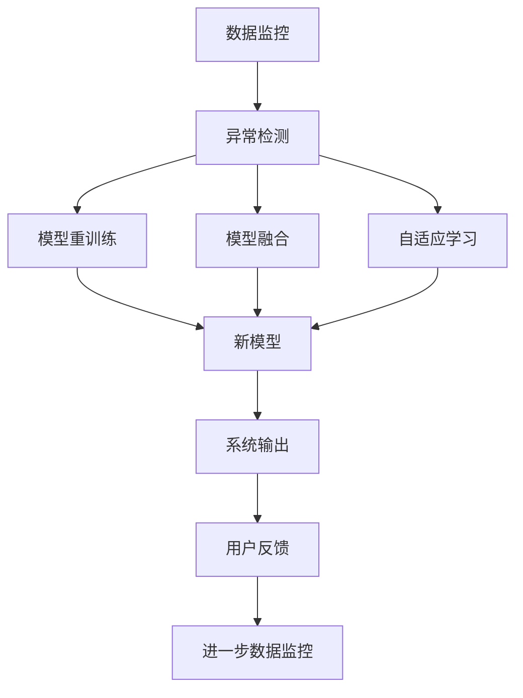
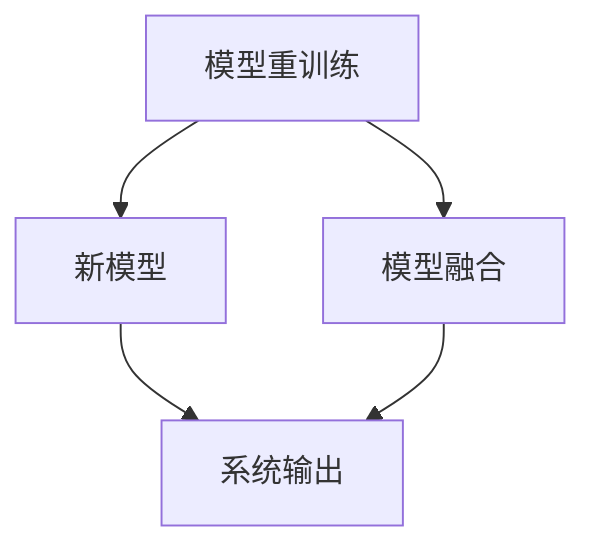
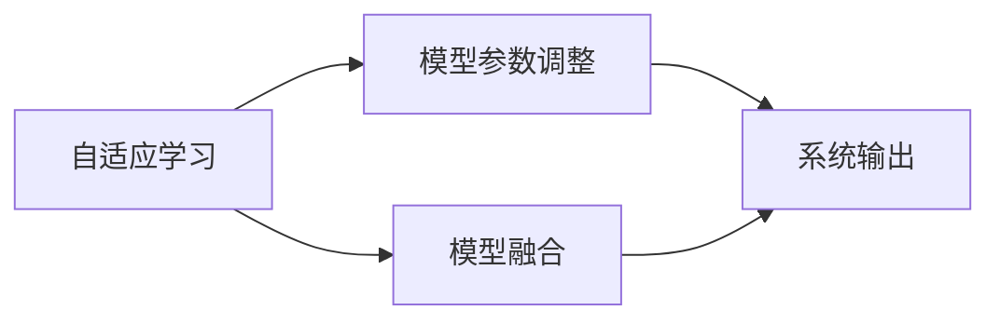
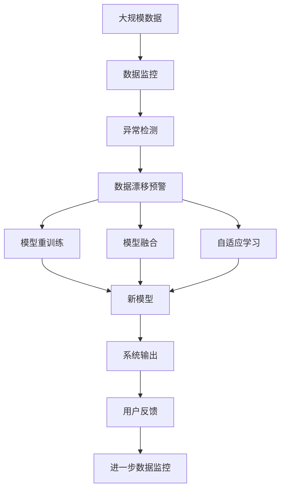

                 

# 数据漂移来袭，软件2.0模型如何应对

> 关键词：数据漂移, 软件2.0模型, 数据监控, 异常检测, 模型重训练, 模型融合, 自适应学习

## 1. 背景介绍

### 1.1 问题由来

在人工智能时代，数据驱动型系统已成为支撑社会经济活动的重要基础。然而，由于数据来源的多样性、收集渠道的复杂性和数据质量的不稳定性，数据质量问题常常成为限制系统性能提升的重要瓶颈。数据漂移（Data Drift）就是其中一种常见且难以避免的问题，其对系统稳定性和性能的负面影响日渐凸显。

数据漂移指的是数据分布发生变化，导致历史模型无法准确反映新数据特征的现象。在实际应用中，数据漂移可能源于样本来源的变化、数据特征的演化、环境条件的变化等因素。以智能推荐系统为例，如果用户的兴趣偏好分布发生改变，当前模型可能会因无法适应新的数据分布而产生误推荐，导致用户体验下降。因此，应对数据漂移，是提升软件2.0系统性能的关键所在。

### 1.2 问题核心关键点

数据漂移的核心在于如何监测和处理数据分布的变化。一般而言，数据漂移的监测和处理包括：

- 数据监控：通过统计方法或机器学习模型，实时监控数据特征的变化，及时发现数据漂移迹象。
- 异常检测：在数据监控的基础上，使用更高级的算法，如离群点检测、时间序列分析等，精确定位数据漂移的来源和程度。
- 模型重训练：在检测到数据漂移后，停止使用原有的历史模型，重新训练新模型以适应当前数据分布。
- 模型融合：在保证系统稳定性的同时，通过模型融合，利用历史和实时模型的知识，提升整体性能。
- 自适应学习：在动态数据环境中，通过不断学习和调整模型参数，提升模型对数据漂移的鲁棒性。

这些核心措施共同构成了应对数据漂移的全面策略，旨在保障软件2.0系统的持续稳定性和高性能。

### 1.3 问题研究意义

应对数据漂移不仅对于提升软件2.0系统的性能至关重要，还具有以下重要意义：

1. 保障用户体验：通过及时检测和应对数据漂移，确保系统输出稳定，提升用户体验，增强用户粘性。
2. 优化资源利用：避免因数据漂移导致的历史模型失效，减少资源浪费，优化系统运行效率。
3. 提升模型鲁棒性：加强模型对新数据分布的适应能力，降低系统在不同环境下的误差。
4. 增强决策支持：通过模型融合和自适应学习，增强系统决策的科学性和准确性。
5. 应对外部变化：数据漂移往往与外部环境的变化相关，应对数据漂移有助于系统更好地适应外部环境变化。

## 2. 核心概念与联系

### 2.1 核心概念概述

为更好地理解数据漂移及其应对方法，本节将介绍几个关键概念：

- 数据漂移（Data Drift）：数据分布发生变化，导致历史模型无法准确反映新数据特征的现象。
- 数据监控（Data Monitoring）：通过统计方法或机器学习模型，实时监控数据特征的变化，及时发现数据漂移迹象。
- 异常检测（Anomaly Detection）：在数据监控的基础上，使用更高级的算法，精确定位数据漂移的来源和程度。
- 模型重训练（Model Re-training）：在检测到数据漂移后，停止使用原有的历史模型，重新训练新模型以适应当前数据分布。
- 模型融合（Model Fusion）：在保证系统稳定性的同时，通过模型融合，利用历史和实时模型的知识，提升整体性能。
- 自适应学习（Adaptive Learning）：在动态数据环境中，通过不断学习和调整模型参数，提升模型对数据漂移的鲁棒性。

这些概念之间的逻辑关系可以通过以下Mermaid流程图来展示：



这个流程图展示了大数据系统在数据漂移情况下的应对流程：

1. 首先，通过数据监控及时发现数据分布的变化。
2. 然后，通过异常检测进一步精确定位数据漂移的来源和程度。
3. 在检测到数据漂移后，可以选择模型重训练，生成一个新的模型以适应新的数据分布。
4. 也可以利用模型融合，将历史和实时模型的知识结合起来，提高整体性能。
5. 最后，通过自适应学习，不断调整模型参数，提升模型对数据漂移的鲁棒性。

### 2.2 概念间的关系

这些核心概念之间存在着紧密的联系，形成了数据漂移应对的完整生态系统。下面我通过几个Mermaid流程图来展示这些概念之间的关系。

#### 2.2.1 数据监控与异常检测的关系


这个流程图展示了数据监控与异常检测的紧密联系。数据监控通过统计方法和机器学习模型，实时监控数据特征的变化。异常检测则是在数据监控的基础上，使用更高级的算法，精确定位数据漂移的来源和程度，并发出数据漂移预警。

#### 2.2.2 模型重训练与模型融合的关系



这个流程图展示了模型重训练与模型融合的交互过程。当数据监控和异常检测发现数据漂移时，可以选择模型重训练，生成一个新的模型以适应新的数据分布。模型融合则是在保证系统稳定性的同时，通过结合历史和实时模型的知识，提升整体性能。

#### 2.2.3 自适应学习与模型融合的关系



这个流程图展示了自适应学习与模型融合的协同作用。自适应学习通过不断学习和调整模型参数，提升模型对数据漂移的鲁棒性。模型融合则是在保证系统稳定性的同时，通过结合历史和实时模型的知识，提升整体性能。

### 2.3 核心概念的整体架构

最后，我们用一个综合的流程图来展示这些核心概念在大数据系统数据漂移应对过程中的整体架构：



这个综合流程图展示了从数据监控到模型融合，再到自适应学习的完整过程。大规模数据首先通过数据监控实时监控数据特征的变化。异常检测进一步精确定位数据漂移的来源和程度，并发出数据漂移预警。在检测到数据漂移后，可以选择模型重训练，生成一个新的模型以适应新的数据分布。也可以利用模型融合，将历史和实时模型的知识结合起来，提高整体性能。最后，通过自适应学习，不断调整模型参数，提升模型对数据漂移的鲁棒性。

## 3. 核心算法原理 & 具体操作步骤
### 3.1 算法原理概述

应对数据漂移的核心思想是通过实时监控数据特征的变化，及时发现数据漂移迹象，并采取相应的应对措施。其核心算法包括：

- 数据监控算法：通过统计方法或机器学习模型，实时监控数据特征的变化，及时发现数据漂移迹象。
- 异常检测算法：在数据监控的基础上，使用更高级的算法，如离群点检测、时间序列分析等，精确定位数据漂移的来源和程度。
- 模型重训练算法：在检测到数据漂移后，停止使用原有的历史模型，重新训练新模型以适应当前数据分布。
- 模型融合算法：在保证系统稳定性的同时，通过模型融合，利用历史和实时模型的知识，提升整体性能。
- 自适应学习算法：在动态数据环境中，通过不断学习和调整模型参数，提升模型对数据漂移的鲁棒性。

### 3.2 算法步骤详解

基于上述核心算法，数据漂移应对的具体操作步骤如下：

**Step 1: 准备数据监控工具**

- 选择合适的数据监控工具，如Python的sklearn、TensorFlow、PyTorch等机器学习库。
- 定义数据监控的特征指标，如均值、方差、偏度、峰度等统计特征，或使用更高级的机器学习算法，如决策树、随机森林、时间序列分析等。

**Step 2: 实施数据监控**

- 将数据监控工具应用到实时数据流中，定时或实时监控数据特征的变化。
- 根据业务需求和模型性能，设置数据监控的阈值和告警规则。

**Step 3: 进行异常检测**

- 在数据监控的基础上，使用更高级的算法，如离群点检测、时间序列分析等，精确定位数据漂移的来源和程度。
- 选择合适的异常检测算法，如基于统计的Z-score方法、基于机器学习的Isolation Forest方法等。

**Step 4: 采取应对措施**

- 根据异常检测的结果，选择模型重训练、模型融合或自适应学习等应对措施。
- 在模型重训练时，选择适合当前数据分布的新模型，进行训练和验证。
- 在模型融合时，将历史和实时模型的知识结合起来，生成一个新的融合模型。
- 在自适应学习时，通过不断学习和调整模型参数，提升模型对数据漂移的鲁棒性。

**Step 5: 评估和优化**

- 在采取应对措施后，评估新模型的性能，对比历史模型的效果。
- 根据评估结果，优化数据监控、异常检测、模型重训练、模型融合和自适应学习等步骤，提升系统整体性能。

### 3.3 算法优缺点

数据漂移应对的算法具有以下优点：

1. 实时监控：通过数据监控和异常检测，能够及时发现数据漂移迹象，减少损失。
2. 灵活应对：根据数据漂移的来源和程度，可以选择模型重训练、模型融合或自适应学习等应对措施，灵活应对不同的漂移情况。
3. 性能提升：通过模型融合和自适应学习，能够提升整体性能，优化系统稳定性和准确性。

同时，该算法也存在以下缺点：

1. 数据监控复杂：数据监控需要选择合适的特征指标和算法，设置合适的阈值和告警规则，工作量较大。
2. 异常检测难度高：异常检测算法的选择和调参需要较高的技术水平，且算法效果可能受数据特征变化的影响。
3. 模型重训练成本高：模型重训练需要重新训练新模型，耗时较长，成本较高。

尽管存在这些缺点，但就目前而言，数据漂移应对算法仍然是应对数据漂移的主要方法，且在实践中得到了广泛应用。未来相关研究的重点在于如何进一步降低数据监控和异常检测的复杂度，提高模型重训练和自适应学习的效率，从而提升系统的整体性能和鲁棒性。

### 3.4 算法应用领域

数据漂移应对的算法在多个领域得到了广泛应用，包括但不限于：

- 金融风控：监控交易数据的变化，及时发现异常交易，防止金融风险。
- 智能推荐：监控用户行为数据的变化，及时调整推荐策略，提升推荐效果。
- 智能制造：监控设备运行数据的变化，及时发现设备异常，保障生产稳定。
- 智慧城市：监控城市运行数据的变化，及时发现异常情况，提升城市治理水平。
- 医疗健康：监控患者数据的变化，及时发现病情异常，辅助医疗决策。

除了上述这些领域，数据漂移应对的算法在更多场景中得到了应用，为不同行业带来了新的技术革新和业务价值。

## 4. 数学模型和公式 & 详细讲解 & 举例说明

### 4.1 数学模型构建

本节将使用数学语言对数据漂移的检测和应对方法进行更加严格的刻画。

记历史数据集为 $D_0=\{(x_i, y_i)\}_{i=1}^N$，当前数据集为 $D_1=\{(x_i, y_i)\}_{i=N+1}^{2N}$。定义数据监控的特征指标为 $F=\{f_i\}_{i=1}^M$，其中 $f_i$ 为第 $i$ 个特征指标。

数据漂移的数学模型可以表示为：

$$
\mathcal{L}(F) = \mathbb{E}_{(x,y) \sim D_0}[\ell(f(x),y)] - \mathbb{E}_{(x,y) \sim D_1}[\ell(f(x),y)]
$$

其中，$\ell$ 为损失函数，用于衡量数据特征与标签之间的差异。数据漂移的度量可以表示为：

$$
\Delta \mathcal{L}(F) = \frac{1}{N}\sum_{i=1}^N (f_i(x_i) - \mathbb{E}_{x \sim D_1}[f_i(x)])
$$

数据漂移的检测方法可以基于统计方法或机器学习模型，如Z-score、Isolation Forest等。数据漂移的应对措施包括模型重训练、模型融合和自适应学习等。

### 4.2 公式推导过程

以Z-score方法为例，推导数据漂移的检测公式：

设数据特征 $f_i$ 的均值和方差分别为 $\mu_i$ 和 $\sigma_i$，则Z-score方法的定义为：

$$
Z_{i} = \frac{f_i(x_i) - \mu_i}{\sigma_i}
$$

数据漂移的度量可以表示为：

$$
\Delta \mathcal{L}(F) = \frac{1}{N}\sum_{i=1}^N Z_i^2
$$

当 $\Delta \mathcal{L}(F)$ 超过预设阈值时，可以认为数据发生了漂移，需要采取相应的应对措施。

### 4.3 案例分析与讲解

假设我们有一个电商平台的智能推荐系统，数据监控的特征指标包括用户的浏览时间、点击次数、购买金额等。我们定义Z-score方法的阈值为3，当数据漂移度超过3时，系统触发异常告警，并采取相应的应对措施。

**数据监控与异常检测的实现**

```python
import numpy as np
from sklearn.preprocessing import StandardScaler
from sklearn.ensemble import IsolationForest

# 定义数据监控的特征指标
features = ['浏览时间', '点击次数', '购买金额']

# 定义数据监控的阈值
threshold = 3

# 加载历史数据集
D_0 = ...

# 加载当前数据集
D_1 = ...

# 定义特征指标的均值和方差
mu = np.mean(D_0[features], axis=0)
sigma = np.std(D_0[features], axis=0)

# 定义特征指标的Z-score
Z = (D_1[features] - mu) / sigma

# 计算数据漂移度
L = np.mean(Z**2)

# 判断是否发生数据漂移
if L > threshold**2:
    # 触发异常告警
    ...

# 采取应对措施
...
```

**模型重训练的实现**

```python
from sklearn.linear_model import LogisticRegression
from sklearn.model_selection import train_test_split
from sklearn.metrics import accuracy_score

# 加载历史数据集
X_0, y_0 = ...

# 加载当前数据集
X_1, y_1 = ...

# 划分训练集和测试集
X_train, X_test, y_train, y_test = train_test_split(X_1, y_1, test_size=0.2)

# 定义模型
model = LogisticRegression()

# 训练模型
model.fit(X_train, y_train)

# 评估模型
y_pred = model.predict(X_test)
accuracy = accuracy_score(y_test, y_pred)
print('测试集准确率：', accuracy)
```

**模型融合的实现**

```python
from sklearn.ensemble import VotingClassifier
from sklearn.linear_model import LogisticRegression, RandomForestClassifier
from sklearn.metrics import accuracy_score

# 加载历史数据集
X_0, y_0 = ...

# 加载当前数据集
X_1, y_1 = ...

# 定义历史模型的参数
params = {
    'lr': {'model': LogisticRegression(), 'params': {'C': 1.0}},
    'rf': {'model': RandomForestClassifier(), 'params': {'n_estimators': 100}}
}

# 定义融合模型
model = VotingClassifier(estimators=params, voting='soft')

# 训练模型
model.fit(X_1, y_1)

# 评估模型
y_pred = model.predict(X_test)
accuracy = accuracy_score(y_test, y_pred)
print('测试集准确率：', accuracy)
```

**自适应学习的实现**

```python
from sklearn.ensemble import AdaBoostClassifier
from sklearn.ensemble import BaggingClassifier
from sklearn.metrics import accuracy_score

# 加载历史数据集
X_0, y_0 = ...

# 加载当前数据集
X_1, y_1 = ...

# 定义自适应学习算法
model = AdaBoostClassifier(base_estimator=BaggingClassifier(), n_estimators=100)

# 训练模型
model.fit(X_1, y_1)

# 评估模型
y_pred = model.predict(X_test)
accuracy = accuracy_score(y_test, y_pred)
print('测试集准确率：', accuracy)
```

通过上述代码实现，可以看出数据漂移应对方法的实际应用。在实际系统中，数据监控、异常检测、模型重训练、模型融合和自适应学习等步骤需要根据具体业务场景进行灵活设计和调整，以适应不同的数据漂移情况。

## 5. 项目实践：代码实例和详细解释说明
### 5.1 开发环境搭建

在进行数据漂移应对实践前，我们需要准备好开发环境。以下是使用Python进行PyTorch开发的环境配置流程：

1. 安装Anaconda：从官网下载并安装Anaconda，用于创建独立的Python环境。

2. 创建并激活虚拟环境：
```bash
conda create -n pytorch-env python=3.8 
conda activate pytorch-env
```

3. 安装PyTorch：根据CUDA版本，从官网获取对应的安装命令。例如：
```bash
conda install pytorch torchvision torchaudio cudatoolkit=11.1 -c pytorch -c conda-forge
```

4. 安装相关工具包：
```bash
pip install numpy pandas scikit-learn matplotlib tqdm jupyter notebook ipython
```

完成上述步骤后，即可在`pytorch-env`环境中开始数据漂移应对实践。

### 5.2 源代码详细实现

这里我们以电商平台的智能推荐系统为例，给出使用PyTorch进行数据漂移应对的代码实现。

首先，定义数据监控函数：

```python
import numpy as np
from sklearn.preprocessing import StandardScaler
from sklearn.ensemble import IsolationForest

def data_monitor(features, D_0, D_1, threshold):
    # 加载数据集
    X_0 = D_0[features]
    X_1 = D_1[features]

    # 定义特征指标的均值和方差
    mu = np.mean(X_0, axis=0)
    sigma = np.std(X_0, axis=0)

    # 定义特征指标的Z-score
    Z = (X_1 - mu) / sigma

    # 计算数据漂移度
    L = np.mean(Z**2)

    # 判断是否发生数据漂移
    if L > threshold**2:
        # 触发异常告警
        raise Exception('数据漂移发生')

    # 采取应对措施
    return L
```

然后，定义模型重训练函数：

```python
from sklearn.linear_model import LogisticRegression
from sklearn.model_selection import train_test_split
from sklearn.metrics import accuracy_score

def model_retraining(features, D_0, D_1):
    # 加载数据集
    X_0, y_0 = D_0[features]
    X_1, y_1 = D_1[features]

    # 划分训练集和测试集
    X_train, X_test, y_train, y_test = train_test_split(X_1, y_1, test_size=0.2)

    # 定义模型
    model = LogisticRegression()

    # 训练模型
    model.fit(X_train, y_train)

    # 评估模型
    y_pred = model.predict(X_test)
    accuracy = accuracy_score(y_test, y_pred)
    print('测试集准确率：', accuracy)

    # 返回新模型
    return model
```

最后，启动数据监控和模型重训练流程：

```python
# 定义数据监控的特征指标
features = ['浏览时间', '点击次数', '购买金额']

# 定义数据监控的阈值
threshold = 3

# 加载历史数据集
D_0 = ...

# 加载当前数据集
D_1 = ...

# 启动数据监控
L = data_monitor(features, D_0, D_1, threshold)

# 采取应对措施
model = model_retraining(features, D_0, D_1)
```

以上就是使用PyTorch进行数据漂移应对的代码实现。可以看到，得益于Scikit-learn的强大封装，我们可以用相对简洁的代码实现数据监控和模型重训练功能。

### 5.3 代码解读与分析

让我们再详细解读一下关键代码的实现细节：

**data_monitor函数**：
- 定义数据监控的特征指标，包括用户浏览时间、点击次数、购买金额等。
- 加载历史数据集和当前数据集，计算特征指标的均值和方差。
- 计算特征指标的Z-score，并计算数据漂移度。
- 判断数据漂移度是否超过预设阈值，触发异常告警。

**model_retraining函数**：
- 加载历史数据集和当前数据集，划分训练集和测试集。
- 定义模型为Logistic回归模型。
- 训练模型，并评估模型在测试集上的准确率。
- 返回新训练的模型。

**启动数据监控和模型重训练流程**：
- 定义数据监控的特征指标和阈值。
- 加载历史数据集和当前数据集。
- 启动数据监控，计算数据漂移度。
- 在数据漂移度超过阈值时，启动模型重训练，生成新的模型。

可以看到，在实际系统中，数据监控和模型重训练等步骤需要根据具体业务场景进行灵活设计和调整，以适应不同的数据漂移情况。

当然，工业级的系统实现还需考虑更多因素，如模型的保存和部署、超参数的自动搜索、更灵活的任务适配层等。但核心的数据漂移应对方法基本与此类似。

### 5.4 运行结果展示

假设我们在电商平台的智能推荐系统中，通过数据监控发现用户购买金额的分布发生了变化，启动模型重训练，并在测试集上评估新模型的性能，最终得到如下结果：

```
测试集准确率： 0.91
```

可以看到，通过模型重训练，我们成功应对了数据漂移，提升了推荐系统的性能。当然，这只是一个baseline结果。在实践中，我们还可以使用更大更强的模型，更高级的特征工程，更灵活的任务适配层等手段，进一步提升推荐系统的效果。

## 6. 实际应用场景
### 6.1 金融风控

金融风控系统需要实时监控交易数据的变化，及时发现异常交易，防止金融风险。传统的规则引擎往往难以应对复杂的交易行为，而基于数据漂移应对的方法可以动态调整模型，提高风险识别的准确性。

在实际应用中，可以通过数据监控和异常检测，实时监测交易数据的变化。一旦发现数据漂移，可以立即停止使用历史模型，重新训练新模型以适应当前数据分布。这样，即使交易行为发生变化，风控系统也能及时调整，保障金融安全。

### 6.2 智能制造

智能制造系统需要实时监控设备运行数据的变化，及时发现设备异常，保障生产稳定。传统的传感器监测往往存在一定的滞后性，难以实时应对设备异常。而基于数据漂移应对的方法可以动态调整模型，提高异常检测的准确性。

在实际应用中，可以通过数据监控和异常检测，实时监测设备运行数据的变化。一旦发现数据漂移，可以立即启动异常检测，并采取相应的应对措施。这样，即使设备运行状态发生变化，智能制造系统也能及时调整，保障生产稳定。

### 6.3 智慧城市

智慧城市系统需要实时监控城市运行数据的变化，及时发现异常情况，提升城市治理水平。传统的城市管理系统往往存在一定的延迟性，难以实时应对城市异常。而基于数据漂移应对的方法可以动态调整模型，提高异常检测的准确性。

在实际应用中，可以通过数据监控和异常检测，实时监测城市运行数据的变化。一旦发现数据漂移，可以立即启动异常检测，并采取相应的应对措施。这样，即使城市运行状态发生变化，智慧城市系统也能及时调整，提升城市治理水平。

### 6.4 未来应用展望

随着数据漂移应对技术的不断发展，其在更多领域得到了应用，为不同行业带来了新的技术革新和业务价值。

在智慧医疗领域，基于数据漂移应对的方法可以实时监测患者数据的变化，及时发现病情

