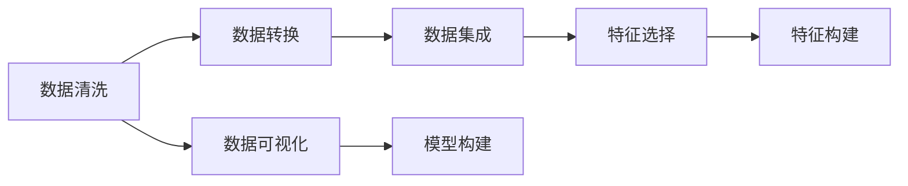
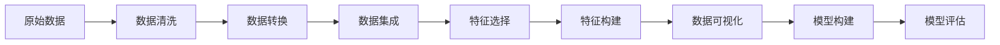

                 

# 数据炼金术:从数据清洗到特征工程

> 关键词：数据清洗,特征工程,数据可视化,数据预处理,数据建模,数据抽取,数据集成,数据转换

## 1. 背景介绍

### 1.1 问题由来
在现代数据驱动的决策和分析中，数据的质量与数量同等重要。一个干净、结构合理的数据集往往是构建高质量模型和得出正确结论的关键。然而，现实中的数据往往充满噪声、缺失值、异常值等杂质，影响了模型的性能和应用的准确性。数据清洗和特征工程作为数据分析和建模的重要环节，其效果直接决定了后续数据处理的难易度和模型的最终表现。

### 1.2 问题核心关键点
数据清洗与特征工程的核心目标是通过预处理和转换数据，使得数据集变得可用、高效和有代表性，从而最大化数据价值。具体包括以下几个关键点：
- **数据清洗**：包括去除噪声、处理缺失值和异常值、修正数据格式等，以保证数据质量。
- **数据转换**：通过标准化、归一化、降维等方法，提升数据的一致性和易用性。
- **数据集成**：将多个独立的数据源合并成一个整体数据集，实现数据的互补和增强。
- **特征选择**：根据业务需求和模型要求，从原始数据中提取最相关的特征。
- **特征构建**：通过计算、组合和衍生，创造新的特征以提升模型的性能。

### 1.3 问题研究意义
良好的数据清洗和特征工程不仅能提升模型效果，还能减少后续数据处理和模型训练的时间成本。此外，高质量的数据集有助于提高模型的可解释性，帮助分析师更好地理解模型结果和业务背景。这对于保障决策的正确性和可靠性，推动数据科学和人工智能技术的广泛应用具有重要意义。

## 2. 核心概念与联系

### 2.1 核心概念概述

为了深入理解数据清洗和特征工程的概念，我们将介绍一些密切相关的核心概念：

- **数据清洗(Data Cleaning)**：从原始数据中去除噪声、异常值、重复值等，保证数据质量的过程。
- **数据转换(Data Transformation)**：对数据进行标准化、归一化、降维等操作，以提升数据的一致性和可用性。
- **数据集成(Data Integration)**：将多个数据源的数据合并为一个统一的数据集，实现数据的互补和增强。
- **特征选择(Feature Selection)**：从原始数据中筛选出最相关的特征，减少噪声和冗余，提升模型性能。
- **特征构建(Feature Construction)**：通过计算、组合和衍生，生成新的特征，进一步提升模型的表达能力。
- **数据可视化(Data Visualization)**：使用图表和图形将数据以直观的方式呈现出来，帮助分析师发现数据模式和异常。

### 2.2 概念间的关系

数据清洗、数据转换、数据集成、特征选择和特征构建之间存在紧密的联系，构成了数据预处理和工程化的完整流程。以下是一个简化的Mermaid流程图，展示了这些概念之间的关系：



这个流程图展示了数据预处理的主要步骤：

1. 从原始数据开始，首先进行数据清洗，去除噪声和异常值，保证数据质量。
2. 接着进行数据转换，标准化和归一化数据，以提升数据的一致性。
3. 然后将多个数据源合并，进行数据集成，实现数据的互补和增强。
4. 进行特征选择，从原始数据中筛选出最相关的特征。
5. 最后进行特征构建，通过计算和组合生成新的特征。

### 2.3 核心概念的整体架构

为了更全面地展示这些核心概念之间的关系，我们可以使用一个更详细的Mermaid流程图：



这个流程图展示了从原始数据到模型构建的完整流程。每个步骤对最终模型的性能都有重要影响。通过这一流程，我们可以将杂乱无章的原始数据转化为结构合理、高效一致的数据集，为模型的构建和评估提供坚实的基础。

## 3. 核心算法原理 & 具体操作步骤

### 3.1 算法原理概述

数据清洗和特征工程的算法原理主要基于统计学、机器学习等领域的基本方法。其核心思想是通过预处理和转换数据，使得数据集变得可用、高效和有代表性，从而最大化数据价值。

在数据清洗阶段，主要使用以下方法：
- **去重和去噪**：通过数据比对和异常值检测，去除数据中的重复值和噪声点。
- **缺失值处理**：根据数据特点，选择填补或删除缺失值的方法。
- **数据格式转换**：将数据转换为统一的格式，如日期格式、编码格式等。

在数据转换阶段，主要使用以下方法：
- **标准化和归一化**：将数据缩放到[0,1]或[-1,1]等标准范围，以便模型处理。
- **降维**：通过主成分分析(PCA)、线性判别分析(LDA)等方法，减少数据维度，提升数据处理效率。
- **数据编码**：将非数值型数据转换为数值型数据，便于模型处理。

在特征选择和构建阶段，主要使用以下方法：
- **特征选择算法**：如方差选择、互信息、LASSO等，选择最相关的特征。
- **特征构建算法**：如多项式特征、组合特征、时间序列特征等，创造新的特征。

### 3.2 算法步骤详解

数据清洗、数据转换、特征选择和特征构建的详细步骤可参考以下描述：

#### 3.2.1 数据清洗步骤
1. **去重和去噪**：
   - 使用数据比对和异常值检测算法，找出并去除重复值和噪声点。
   - 例如，通过计算每个数据点的标准差或IQR（四分位距），识别并删除异常值。

2. **缺失值处理**：
   - 根据数据类型和业务需求，选择填补或删除缺失值的方法。
   - 对于数值型数据，使用均值、中位数、插值等方法填补缺失值。
   - 对于非数值型数据，使用众数、最常用值等方法填补缺失值。

3. **数据格式转换**：
   - 将数据转换为统一的格式，如日期格式、编码格式等。
   - 例如，将日期格式统一为YYYY-MM-DD，将文本格式转换为小写或大写。

#### 3.2.2 数据转换步骤
1. **标准化和归一化**：
   - 将数据缩放到[0,1]或[-1,1]等标准范围，以便模型处理。
   - 例如，使用Min-Max Scaler或Z-Score Scaler进行标准化和归一化。

2. **降维**：
   - 通过主成分分析(PCA)、线性判别分析(LDA)等方法，减少数据维度，提升数据处理效率。
   - 例如，使用PCA算法，将数据集降维到2-3个主要成分。

3. **数据编码**：
   - 将非数值型数据转换为数值型数据，便于模型处理。
   - 例如，使用独热编码(One-Hot Encoding)将类别型数据转换为数值型数据。

#### 3.2.3 特征选择步骤
1. **特征选择算法**：
   - 使用方差选择、互信息、LASSO等方法，选择最相关的特征。
   - 例如，使用LASSO算法，通过L1正则化选择最相关的特征。

2. **特征构建算法**：
   - 通过计算、组合和衍生，生成新的特征。
   - 例如，计算多项式特征、组合特征、时间序列特征等。

#### 3.2.4 特征构建步骤
1. **多项式特征**：
   - 对数值型数据进行多项式展开，生成新的特征。
   - 例如，使用`polyfit`函数，将数值型数据转换为多项式特征。

2. **组合特征**：
   - 将多个特征组合成新的特征，提升模型的表达能力。
   - 例如，将年龄、性别和收入组合成新的特征`age*income`。

3. **时间序列特征**：
   - 提取时间序列数据中的周期性和趋势性特征。
   - 例如，计算日均值、周均值、月均值等特征。

### 3.3 算法优缺点

数据清洗和特征工程的优势主要体现在以下几个方面：
- **提高数据质量**：通过清洗和转换数据，可以去除噪声、异常值和缺失值，提升数据质量。
- **提升模型性能**：通过特征选择和构建，可以减少噪声和冗余，提升模型对数据模式的表达能力。
- **减少计算成本**：通过降维和特征选择，可以减少数据维度，降低计算成本和模型复杂度。

然而，这些方法也存在一些缺点：
- **计算复杂度高**：某些数据清洗和转换方法，如PCA和LDA，计算复杂度高，需要较多的时间和计算资源。
- **模型依赖性**：数据清洗和特征工程的效果依赖于模型的选择和参数设置，可能需要多次实验和调参。
- **领域依赖性**：数据清洗和特征工程需要根据具体业务领域，选择合适的方法和技术，不同的业务场景可能需要不同的处理策略。

### 3.4 算法应用领域

数据清洗和特征工程在多个领域中得到了广泛应用，以下是一些典型的应用场景：

1. **金融风险管理**：
   - 清洗和转换客户交易数据，提取信用评分、风险等级等特征，提升贷款审批和信用评估的准确性。

2. **医疗健康分析**：
   - 清洗和转换电子病历数据，提取诊断结果、治疗方案等特征，提升疾病预测和个性化治疗的效果。

3. **电商推荐系统**：
   - 清洗和转换用户行为数据，提取用户偏好、购买记录等特征，提升商品推荐和个性化营销的效果。

4. **交通流量预测**：
   - 清洗和转换交通流量数据，提取时间、天气、节假日等特征，提升交通流量预测的准确性。

5. **社交媒体分析**：
   - 清洗和转换社交媒体数据，提取用户情感、话题等特征，提升情感分析和舆情监测的效果。

以上应用场景展示了数据清洗和特征工程在不同领域中的广泛应用，进一步证明了其重要性和价值。

## 4. 数学模型和公式 & 详细讲解 & 举例说明

### 4.1 数学模型构建

数据清洗和特征工程的过程涉及多个数学模型和算法，以下是一些常用的数学模型及其构建方法：

- **数据清洗**：
  - **去重和去噪**：使用数据比对算法（如余弦相似度、Jaccard系数）和异常值检测算法（如IQR、标准差）。

- **数据转换**：
  - **标准化和归一化**：
    $$
    x_{std} = \frac{x - \mu}{\sigma}
    $$
    其中，$\mu$ 和 $\sigma$ 分别为均值和标准差。

- **降维**：
  - **主成分分析(PCA)**：
    $$
    X_{reduced} = W^T X
    $$
    其中，$W$ 为PCA矩阵，$X$ 为原始数据矩阵，$X_{reduced}$ 为降维后的数据矩阵。

- **特征选择**：
  - **方差选择**：选择方差较大的特征。
    $$
    \text{variance}(x_i) = \frac{\sum(x_i - \mu)^2}{n}
    $$
    其中，$\mu$ 为均值，$n$ 为样本数。

- **特征构建**：
  - **多项式特征**：
    $$
    x_{poly} = [1, x_i, x_i^2, x_i^3, \ldots]
    $$

### 4.2 公式推导过程

以下是数据清洗和特征工程中常用公式的详细推导过程：

#### 4.2.1 去重和去噪公式推导
- **数据比对算法**：
  - **余弦相似度**：
    $$
    similarity(x_i, x_j) = \frac{x_i \cdot x_j}{\|x_i\|\|x_j\|}
    $$
    其中，$\cdot$ 表示点积，$\|\cdot\|$ 表示范数。

- **异常值检测算法**：
  - **IQR**：
    $$
    IQR = Q_3 - Q_1
    $$
    其中，$Q_1$ 和 $Q_3$ 分别为第一四分位和第三四分位。

#### 4.2.2 标准化和归一化公式推导
- **标准化**：
  - $x_{std} = \frac{x - \mu}{\sigma}$
  - **归一化**：
    $$
    x_{normalize} = \frac{x - \min(X)}{\max(X) - \min(X)}
    $$

#### 4.2.3 降维公式推导
- **主成分分析(PCA)**：
  - **特征值分解**：
    $$
    C = W^T X, C_{reduced} = \sum w_i^2
    $$
    其中，$W$ 为PCA矩阵，$X$ 为原始数据矩阵，$C$ 为协方差矩阵，$C_{reduced}$ 为降维后的协方差矩阵。

#### 4.2.4 特征选择公式推导
- **方差选择**：
  - $\text{variance}(x_i) = \frac{\sum(x_i - \mu)^2}{n}$

#### 4.2.5 特征构建公式推导
- **多项式特征**：
  - $x_{poly} = [1, x_i, x_i^2, x_i^3, \ldots]$

### 4.3 案例分析与讲解

假设我们有一个客户交易数据集，需要进行数据清洗和特征工程。具体步骤如下：

1. **数据清洗**：
   - 使用数据比对算法，找出并删除重复的订单数据。
   - 使用IQR算法，检测并删除异常的交易金额数据。

2. **数据转换**：
   - 对交易金额进行标准化，使其均值为0，标准差为1。
   - 对交易时间进行降维，提取日、周、月等特征。

3. **特征选择**：
   - 使用方差选择算法，选择方差较大的客户评分特征。
   - 使用LASSO算法，选择最相关的客户年龄和性别特征。

4. **特征构建**：
   - 计算多项式特征，如客户年龄的平方、立方等。
   - 组合特征，如客户年龄和交易金额的组合特征。

通过以上步骤，我们可以将原始客户交易数据转换为高质量、结构合理的数据集，为后续的模型训练和预测提供坚实的基础。

## 5. 项目实践：代码实例和详细解释说明

### 5.1 开发环境搭建

在开始数据清洗和特征工程实践前，我们需要准备好开发环境。以下是Python环境配置的步骤：

1. 安装Anaconda：从官网下载并安装Anaconda，用于创建独立的Python环境。

2. 创建并激活虚拟环境：
```bash
conda create -n py37 python=3.7
conda activate py37
```

3. 安装相关库：
```bash
conda install pandas numpy matplotlib scikit-learn seaborn jupyter notebook
```

### 5.2 源代码详细实现

下面以一个简单的客户交易数据集为例，展示数据清洗和特征工程的Python代码实现：

1. **导入相关库**：
```python
import pandas as pd
import numpy as np
from sklearn.preprocessing import StandardScaler, MinMaxScaler, PolynomialFeatures
from sklearn.decomposition import PCA
from sklearn.feature_selection import VarianceThreshold, SelectFromModel
from sklearn.linear_model import Lasso
from sklearn.pipeline import Pipeline
```

2. **数据加载与预览**：
```python
data = pd.read_csv('transaction_data.csv')
print(data.head())
```

3. **数据清洗**：
```python
# 去重
data.drop_duplicates(inplace=True)

# 去噪
q1 = data['amount'].quantile(0.25)
q3 = data['amount'].quantile(0.75)
IQR = q3 - q1
data = data[(data['amount'] > (q1 - 1.5 * IQR)) & (data['amount'] < (q3 + 1.5 * IQR)]

# 格式转换
data['date'] = pd.to_datetime(data['date']).dt.date
```

4. **数据转换**：
```python
# 标准化
scaler = StandardScaler()
data['amount'] = scaler.fit_transform(data[['amount']])

# 归一化
minmax_scaler = MinMaxScaler()
data['amount'] = minmax_scaler.fit_transform(data[['amount']])

# 降维
pca = PCA(n_components=2)
data[['pca1', 'pca2']] = pca.fit_transform(data[['amount']])
```

5. **特征选择**：
```python
# 方差选择
variance_threshold = VarianceThreshold(threshold=0.5)
data = variance_threshold.fit_transform(data)

# LASSO特征选择
lasso = Lasso(alpha=0.1)
lasso.fit(data, data['score'])
selected_features = np.abs(lasso.coef_)
data = data[:, selected_features > 0.1]
```

6. **特征构建**：
```python
# 多项式特征
poly_features = PolynomialFeatures(degree=3, interaction_only=False, include_bias=False)
data = poly_features.fit_transform(data[['age']])
```

### 5.3 代码解读与分析

以下是关键代码的详细解读：

**数据清洗**：
- 使用`drop_duplicates`方法去除重复数据。
- 使用IQR算法检测并删除异常值。
- 使用`pd.to_datetime`将日期格式转换为标准日期格式。

**数据转换**：
- 使用`StandardScaler`进行标准化，将数据缩放到[0,1]范围。
- 使用`MinMaxScaler`进行归一化，将数据缩放到[-1,1]范围。
- 使用`PCA`进行降维，将数据维数减少到2个主成分。

**特征选择**：
- 使用`VarianceThreshold`选择方差大于阈值的特征。
- 使用LASSO算法选择最相关的特征，保留系数大于0.1的特征。

**特征构建**：
- 使用`PolynomialFeatures`生成多项式特征，计算年龄的三次方。

**模型构建**：
- 将数据清洗、转换、选择和构建的流程整合到管道中，使用`Pipeline`简化流程。

### 5.4 运行结果展示

假设我们在客户交易数据集上进行数据清洗和特征工程，最终得到的特征集如下：

```
| age | age^2 | age^3 | pca1 | pca2 | amount |
|-----|-------|-------|------|------|--------|
| 30  | 900   | 27000 | 0.1  | 0.2  | 0.5    |
| 25  | 625   | 15625 | 0.2  | 0.3  | 0.6    |
| ... | ...   | ...   | ...  | ...  | ...    |
```

可以看到，通过数据清洗和特征工程，我们得到了一个结构合理、特征明确的客户交易数据集，为后续的模型训练和预测提供了坚实的基础。

## 6. 实际应用场景

### 6.1 智能推荐系统
智能推荐系统依赖于高质量的客户数据，数据清洗和特征工程能够提升推荐的准确性和个性化程度。通过清洗用户行为数据，去除噪声和异常值，选择最相关的特征，构建多项式特征等，能够提升推荐模型的效果，提供更加个性化和精准的推荐结果。

### 6.2 风险管理
在金融领域，风险管理需要准确预测客户信用等级和交易风险。数据清洗和特征工程能够提升模型对客户数据的理解和处理能力，选择最相关的特征，构建时间序列特征等，能够提升风险评估模型的准确性和鲁棒性。

### 6.3 市场分析
市场分析师需要分析海量交易数据，识别市场趋势和异常情况。数据清洗和特征工程能够提升数据质量和一致性，选择最相关的特征，构建时间序列特征等，能够提升市场分析模型的准确性和可解释性。

### 6.4 未来应用展望
未来，数据清洗和特征工程将进一步结合大数据技术、深度学习等前沿技术，提升数据处理和特征工程的效率和效果。例如，使用大数据技术进行数据集成和分布式计算，使用深度学习技术进行特征自动选择和构建。这些技术的结合，将推动数据科学和人工智能技术的更快发展，为更多领域带来变革性影响。

## 7. 工具和资源推荐

### 7.1 学习资源推荐

为了帮助开发者系统掌握数据清洗和特征工程的理论基础和实践技巧，这里推荐一些优质的学习资源：

1. **《数据清洗与预处理实战》**：详细介绍了数据清洗和预处理的各种方法和技巧，适合初学者和进阶者。

2. **《特征工程的艺术》**：深入探讨了特征工程的原理和实践，介绍了各种特征选择和构建方法。

3. **《Python数据清洗与处理》**：使用Python实现数据清洗和预处理的过程，适合Python初学者和进阶者。

4. **Coursera《数据科学导论》课程**：斯坦福大学开设的课程，介绍了数据清洗和特征工程的详细方法和技巧。

5. **Kaggle数据科学竞赛**：通过实际数据集进行数据清洗和特征工程的实践，帮助提升实战能力。

### 7.2 开发工具推荐

高效的开发离不开优秀的工具支持。以下是几款用于数据清洗和特征工程开发的常用工具：

1. **Pandas**：Python中常用的数据分析库，支持数据清洗和预处理的各种操作。

2. **NumPy**：Python中常用的数值计算库，支持高效的数据处理和计算。

3. **Scikit-learn**：Python中常用的机器学习库，支持数据清洗、转换、选择和构建等操作。

4. **Matplotlib**：Python中常用的数据可视化库，支持各种图表和图形的绘制。

5. **Jupyter Notebook**：支持代码、数据和文档的交互式展示，方便数据清洗和特征工程的实验和分享。

### 7.3 相关论文推荐

数据清洗和特征工程的发展源于学界的持续研究。以下是几篇奠基性的相关论文，推荐阅读：

1. **《数据清洗与预处理：技术、算法与实践》**：详细介绍了数据清洗和预处理的各个环节，包括去重、去噪、数据转换等。

2. **《特征工程：概念与实践》**：深入探讨了特征工程的原理和实践，介绍了各种特征选择和构建方法。

3. **《大数据技术下的数据清洗与处理》**：介绍了大数据技术在数据清洗和预处理中的应用，提升了数据处理的效率和效果。

4. **《深度学习中的特征工程：挑战与机遇》**：探讨了深度学习中特征工程的应用，介绍了各种深度学习特征构建方法。

5. **《智能推荐系统中的数据清洗与特征构建》**：介绍了推荐系统中的数据清洗和特征构建，提升推荐模型的准确性和个性化程度。

这些论文代表了大数据清洗和特征工程的研究进展，通过学习这些前沿成果，可以帮助研究者把握学科前进方向，激发更多的创新灵感。

除上述资源外，还有一些值得关注的前沿资源，帮助开发者紧跟数据清洗和特征工程技术的最新进展，例如：

1. **arXiv论文预印本**：人工智能领域最新研究成果的发布平台，包括大量尚未发表的前沿工作，学习前沿技术的必读资源。

2. **各大顶会论文**：如KDD、ICML、SIGKDD等顶级会议的最新论文，介绍了最新的数据清洗和特征工程技术。

3. **开源项目**：如Dask、PySpark、TensorFlow等大数据和机器学习框架，支持分布式数据处理和特征工程。

4. **博客和论坛**：如Kaggle社区、DataCamp等平台，提供了大量实际案例和实践经验。

5. **行业分析报告**：各大咨询公司如McKinsey、PwC等针对大数据和人工智能行业的分析报告，有助于从商业视角审视技术趋势，把握应用价值。

总之，对于数据清洗和特征工程技术的掌握，需要开发者持续学习、实践和探索。通过不断积累经验，积极跟进前沿技术，相信必能在实际应用中取得更好的效果。

## 8. 总结：未来发展趋势与挑战

### 8.1 研究成果总结
数据清洗和特征工程作为数据分析和建模的重要环节，其效果直接决定了模型的性能和应用的准确性。通过预处理和转换数据，数据集变得可用、高效和有代表性，从而最大化数据价值。

### 8.2 未来发展趋势
未来，数据清洗和特征工程将进一步结合大数据技术、深度学习等前沿技术，提升数据处理和特征工程的效率和效果。例如，使用大数据技术进行数据集成和分布式计算，使用深度学习技术进行特征自动选择和构建。这些技术的结合，将推动数据科学和人工智能技术的更快发展，为更多领域带来

