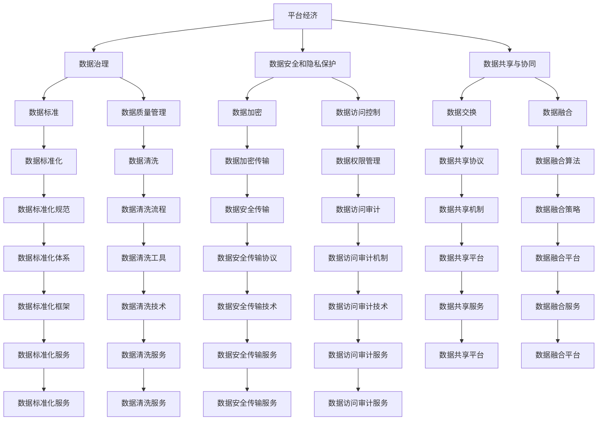

                 

# 数据赋能平台经济：如何实现可持续发展？

> 关键词：平台经济,数据治理,可持续发展,数字普惠,人工智能

## 1. 背景介绍

### 1.1 问题由来
平台经济作为当前最活跃的经济形态之一，已经在电商、社交、金融、交通等多个领域形成巨大的产业规模。以数据为核心的商业决策、市场分析和用户行为预测，成为平台企业竞争力的重要体现。然而，随着平台数据量的爆炸式增长，数据治理、数据安全和隐私保护等问题也日益凸显，成为制约平台经济健康发展的重要障碍。如何实现数据的可持续发展和高效利用，是平台企业必须面对的挑战。

### 1.2 问题核心关键点
当前，数据赋能平台经济主要面临以下几大核心问题：

- 数据治理：数据质量和数据共享是平台经济发展的基石。平台企业需要构建完善的数据治理体系，确保数据的准确性、完整性和一致性。
- 数据安全和隐私保护：在平台经济中，数据泄露和滥用事件时有发生，必须加强数据安全管理和隐私保护措施。
- 数据协同共享：平台企业之间的数据壁垒限制了数据的有效利用，需要通过合作和共享机制打破这种隔阂。
- 数据驱动决策：数据是平台企业制定商业策略、优化运营管理的重要依据，如何高效利用数据进行决策分析，成为平台企业的重要课题。
- 数据透明性和可解释性：平台用户越来越重视数据的来源和使用情况，数据透明性和可解释性成为平台企业提升信任度的关键。

### 1.3 问题研究意义
数据赋能平台经济的研究，不仅有助于提升平台企业的运营效率和市场竞争力，还能推动整个数字经济的健康发展。具体而言，数据治理和共享有助于打破数据孤岛，实现数据资源的有效整合和复用；数据安全和隐私保护有助于保障用户权益和平台信任，促进健康的数据交易生态；数据驱动决策有助于平台企业精准把握市场趋势，制定科学合理的经营策略；数据透明性和可解释性有助于提升用户信任，促进数据市场的健康发展。

## 2. 核心概念与联系

### 2.1 核心概念概述

为更好地理解数据赋能平台经济的可持续发展问题，本节将介绍几个密切相关的核心概念：

- 平台经济：以数据为核心的数字经济形态，通过算法驱动和数据驱动，实现资源优化配置和用户需求匹配，提升市场效率和用户体验。
- 数据治理：涉及数据标准、数据质量、数据安全和隐私保护等多方面的管理和规范，确保数据的合法合规使用。
- 数据安全和隐私保护：采取技术手段和管理措施，确保数据在采集、存储、传输和使用过程中不被非法获取、篡改或滥用。
- 数据共享与协同：通过数据交换、数据融合、数据合作等机制，实现不同平台和机构之间的数据共享，提升数据利用效率。
- 数据驱动决策：利用数据进行市场分析、趋势预测和决策支持，实现数据智能决策和精准运营。
- 数据透明性和可解释性：通过数据可视化、数据报告等方式，向用户透明展示数据的来源、使用情况和决策依据，提升数据使用的可信度。

这些核心概念之间的逻辑关系可以通过以下Mermaid流程图来展示：



这个流程图展示了大语言模型微调过程中各个核心概念的关系和作用：

1. 平台经济作为数据治理、数据安全和隐私保护、数据共享与协同、数据驱动决策以及数据透明性和可解释性的基础，确保数据资源的有效管理和高效利用。
2. 数据治理涉及数据标准、数据质量管理等，确保数据的一致性和完整性。
3. 数据安全和隐私保护通过数据加密、数据访问控制等措施，保障数据的安全性。
4. 数据共享与协同通过数据交换、数据融合等机制，实现不同平台和机构之间的数据共享和合作。
5. 数据驱动决策利用数据分析、趋势预测等手段，提升平台的决策能力和运营效率。
6. 数据透明性和可解释性通过数据可视化、数据报告等方式，提升数据的可信度和透明度。

这些概念共同构成了平台经济的数据治理框架，为数据的可持续发展和高效利用提供了重要保障。

### 2.2 概念间的关系

这些核心概念之间存在着紧密的联系，形成了平台经济的数据治理生态系统。下面我通过几个Mermaid流程图来展示这些概念之间的关系。

#### 2.2.1 平台经济的数据治理架构

```mermaid
graph LR
    A[平台经济] --> B[数据治理]
    A --> C[数据安全和隐私保护]
    B --> D[数据标准]
    B --> E[数据质量管理]
    B --> F[数据安全管理]
    C --> G[数据加密]
    C --> H[数据访问控制]
    D --> I[数据标准化]
    E --> J[数据清洗]
    F --> K[数据审计]
    G --> L[数据加密传输]
    H --> M[数据权限管理]
    I --> N[数据标准化规范]
    J --> O[数据清洗流程]
    K --> P[数据审计报告]
    L --> Q[数据安全传输协议]
    M --> R[数据访问审计]
    N --> S[数据标准化规范]
    O --> T[数据清洗工具]
    P --> U[数据审计报告]
    Q --> V[数据安全传输技术]
    R --> W[数据访问审计技术]
    S --> X[数据标准化规范]
    T --> Y[数据清洗技术]
    U --> Z[数据审计报告]
    V --> AA[数据安全传输服务]
    W --> BB[数据访问审计服务]
    X --> CC[数据标准化规范]
    Y --> DD[数据清洗服务]
    Z --> EE[数据审计报告]
    AA --> FF[数据安全传输服务]
    BB --> GG[数据访问审计服务]
    CC --> HH[数据标准化服务]
    DD --> II[数据清洗服务]
    EE --> JJ[数据审计报告]
    FF --> KK[数据安全传输服务]
    GG --> LL[数据访问审计服务]
    HH --> MM[数据标准化服务]
    II --> NN[数据清洗服务]
    JJ --> OO[数据审计报告]
    KK --> PP[数据安全传输服务]
    LL --> QQ[数据访问审计服务]
    MM --> RR[数据标准化服务]
    NN --> SS[数据清洗服务]
    OO --> TT[数据审计报告]
    PP --> UU[数据安全传输服务]
    QQ --> VV[数据访问审计服务]
    RR --> WW[数据标准化服务]
    SS --> XX[数据清洗服务]
    TT --> YY[数据审计报告]
    UU --> ZZ[数据安全传输服务]
    VV --> AA[数据安全传输服务]
    WW --> BB[数据访问审计服务]
    XX --> CC[数据标准化规范]
    YY --> DD[数据清洗服务]
    ZZ --> EE[数据审计报告]
    AA --> FF[数据安全传输服务]
    BB --> GG[数据访问审计服务]
    CC --> HH[数据标准化服务]
    DD --> II[数据清洗服务]
    EE --> JJ[数据审计报告]
    FF --> KK[数据安全传输服务]
    GG --> LL[数据访问审计服务]
    HH --> MM[数据标准化服务]
    II --> NN[数据清洗服务]
    JJ --> OO[数据审计报告]
    KK --> PP[数据安全传输服务]
    LL --> QQ[数据访问审计服务]
    MM --> RR[数据标准化服务]
    NN --> SS[数据清洗服务]
    OO --> TT[数据审计报告]
    PP --> UU[数据安全传输服务]
    QQ --> VV[数据访问审计服务]
    RR --> WW[数据标准化服务]
    SS --> XX[数据清洗服务]
    TT --> YY[数据审计报告]
    UU --> ZZ[数据安全传输服务]
    VV --> AA[数据安全传输服务]
    WW --> BB[数据访问审计服务]
    XX --> CC[数据标准化规范]
    YY --> DD[数据清洗服务]
    ZZ --> EE[数据审计报告]
    AA --> FF[数据安全传输服务]
    BB --> GG[数据访问审计服务]
    CC --> HH[数据标准化服务]
    DD --> II[数据清洗服务]
    EE --> JJ[数据审计报告]
    FF --> KK[数据安全传输服务]
    GG --> LL[数据访问审计服务]
    HH --> MM[数据标准化服务]
    II --> NN[数据清洗服务]
    JJ --> OO[数据审计报告]
    KK --> PP[数据安全传输服务]
    LL --> QQ[数据访问审计服务]
    MM --> RR[数据标准化服务]
    NN --> SS[数据清洗服务]
    OO --> TT[数据审计报告]
    PP --> UU[数据安全传输服务]
    QQ --> VV[数据访问审计服务]
    RR --> WW[数据标准化服务]
    SS --> XX[数据清洗服务]
    TT --> YY[数据审计报告]
    UU --> ZZ[数据安全传输服务]
    VV --> AA[数据安全传输服务]
    WW --> BB[数据访问审计服务]
    XX --> CC[数据标准化规范]
    YY --> DD[数据清洗服务]
    ZZ --> EE[数据审计报告]
    AA --> FF[数据安全传输服务]
    BB --> GG[数据访问审计服务]
    CC --> HH[数据标准化服务]
    DD --> II[数据清洗服务]
    EE --> JJ[数据审计报告]
    FF --> KK[数据安全传输服务]
    GG --> LL[数据访问审计服务]
    HH --> MM[数据标准化服务]
    II --> NN[数据清洗服务]
    JJ --> OO[数据审计报告]
    KK --> PP[数据安全传输服务]
    LL --> QQ[数据访问审计服务]
    MM --> RR[数据标准化服务]
    NN --> SS[数据清洗服务]
    OO --> TT[数据审计报告]
    PP --> UU[数据安全传输服务]
    QQ --> VV[数据访问审计服务]
    RR --> WW[数据标准化服务]
    SS --> XX[数据清洗服务]
    TT --> YY[数据审计报告]
    UU --> ZZ[数据安全传输服务]
    VV --> AA[数据安全传输服务]
    WW --> BB[数据访问审计服务]
    XX --> CC[数据标准化规范]
    YY --> DD[数据清洗服务]
    ZZ --> EE[数据审计报告]
    AA --> FF[数据安全传输服务]
    BB --> GG[数据访问审计服务]
    CC --> HH[数据标准化服务]
    DD --> II[数据清洗服务]
    EE --> JJ[数据审计报告]
    FF --> KK[数据安全传输服务]
    GG --> LL[数据访问审计服务]
    HH --> MM[数据标准化服务]
    II --> NN[数据清洗服务]
    JJ --> OO[数据审计报告]
    KK --> PP[数据安全传输服务]
    LL --> QQ[数据访问审计服务]
    MM --> RR[数据标准化服务]
    NN --> SS[数据清洗服务]
    OO --> TT[数据审计报告]
    PP --> UU[数据安全传输服务]
    QQ --> VV[数据访问审计服务]
    RR --> WW[数据标准化服务]
    SS --> XX[数据清洗服务]
    TT --> YY[数据审计报告]
    UU --> ZZ[数据安全传输服务]
    VV --> AA[数据安全传输服务]
    WW --> BB[数据访问审计服务]
    XX --> CC[数据标准化规范]
    YY --> DD[数据清洗服务]
    ZZ --> EE[数据审计报告]
    AA --> FF[数据安全传输服务]
    BB --> GG[数据访问审计服务]
    CC --> HH[数据标准化服务]
    DD --> II[数据清洗服务]
    EE --> JJ[数据审计报告]
    FF --> KK[数据安全传输服务]
    GG --> LL[数据访问审计服务]
    HH --> MM[数据标准化服务]
    II --> NN[数据清洗服务]
    JJ --> OO[数据审计报告]
    KK --> PP[数据安全传输服务]
    LL --> QQ[数据访问审计服务]
    MM --> RR[数据标准化服务]
    NN --> SS[数据清洗服务]
    OO --> TT[数据审计报告]
    PP --> UU[数据安全传输服务]
    QQ --> VV[数据访问审计服务]
    RR --> WW[数据标准化服务]
    SS --> XX[数据清洗服务]
    TT --> YY[数据审计报告]
    UU --> ZZ[数据安全传输服务]
    VV --> AA[数据安全传输服务]
    WW --> BB[数据访问审计服务]
    XX --> CC[数据标准化规范]
    YY --> DD[数据清洗服务]
    ZZ --> EE[数据审计报告]
    AA --> FF[数据安全传输服务]
    BB --> GG[数据访问审计服务]
    CC --> HH[数据标准化服务]
    DD --> II[数据清洗服务]
    EE --> JJ[数据审计报告]
    FF --> KK[数据安全传输服务]
    GG --> LL[数据访问审计服务]
    HH --> MM[数据标准化服务]
    II --> NN[数据清洗服务]
    JJ --> OO[数据审计报告]
    KK --> PP[数据安全传输服务]
    LL --> QQ[数据访问审计服务]
    MM --> RR[数据标准化服务]
    NN --> SS[数据清洗服务]
    OO --> TT[数据审计报告]
    PP --> UU[数据安全传输服务]
    QQ --> VV[数据访问审计服务]
    RR --> WW[数据标准化服务]
    SS --> XX[数据清洗服务]
    TT --> YY[数据审计报告]
    UU --> ZZ[数据安全传输服务]
    VV --> AA[数据安全传输服务]
    WW --> BB[数据访问审计服务]
    XX --> CC[数据标准化规范]
    YY --> DD[数据清洗服务]
    ZZ --> EE[数据审计报告]
    AA --> FF[数据安全传输服务]
    BB --> GG[数据访问审计服务]
    CC --> HH[数据标准化服务]
    DD --> II[数据清洗服务]
    EE --> JJ[数据审计报告]
    FF --> KK[数据安全传输服务]
    GG --> LL[数据访问审计服务]
    HH --> MM[数据标准化服务]
    II --> NN[数据清洗服务]
    JJ --> OO[数据审计报告]
    KK --> PP[数据安全传输服务]
    LL --> QQ[数据访问审计服务]
    MM --> RR[数据标准化服务]
    NN --> SS[数据清洗服务]
    OO --> TT[数据审计报告]
    PP --> UU[数据安全传输服务]
    QQ --> VV[数据访问审计服务]
    RR --> WW[数据标准化服务]
    SS --> XX[数据清洗服务]
    TT --> YY[数据审计报告]
    UU --> ZZ[数据安全传输服务]
    VV --> AA[数据安全传输服务]
    WW --> BB[数据访问审计服务]
    XX --> CC[数据标准化规范]
    YY --> DD[数据清洗服务]
    ZZ --> EE[数据审计报告]
    AA --> FF[数据安全传输服务]
    BB --> GG[数据访问审计服务]
    CC --> HH[数据标准化服务]
    DD --> II[数据清洗服务]
    EE --> JJ[数据审计报告]
    FF --> KK[数据安全传输服务]
    GG --> LL[数据访问审计服务]
    HH --> MM[数据标准化服务]
    II --> NN[数据清洗服务]
    JJ --> OO[数据审计报告]
    KK --> PP[数据安全传输服务]
    LL --> QQ[数据访问审计服务]
    MM --> RR[数据标准化服务]
    NN --> SS[数据清洗服务]
    OO --> TT[数据审计报告]
    PP --> UU[数据安全传输服务]
    QQ --> VV[数据访问审计服务]
    RR --> WW[数据标准化服务]
    SS --> XX[数据清洗服务]
    TT --> YY[数据审计报告]
    UU --> ZZ[数据安全传输服务]
    VV --> AA[数据安全传输服务]
    WW --> BB[数据访问审计服务]
    XX --> CC[数据标准化规范]
    YY --> DD[数据清洗服务]
    ZZ --> EE[数据审计报告]
    AA --> FF[数据安全传输服务]
    BB --> GG[数据访问审计服务]
    CC --> HH[数据标准化服务]
    DD --> II[数据清洗服务]
    EE --> JJ[数据审计报告]
    FF --> KK[数据安全传输服务]
    GG --> LL[数据访问审计服务]
    HH --> MM[数据标准化服务]
    II --> NN[数据清洗服务]
    JJ --> OO[数据审计报告]
    KK --> PP[数据安全传输服务]
    LL --> QQ[数据访问审计服务]
    MM --> RR[数据标准化服务]
    NN --> SS[数据清洗服务]
    OO --> TT[数据审计报告]
    PP --> UU[数据安全传输服务]
    QQ --> VV[数据访问审计服务]
    RR --> WW[数据标准化服务]
    SS --> XX[数据清洗服务]
    TT --> YY[数据审计报告]
    UU --> ZZ[数据安全传输服务]
    VV --> AA[数据安全传输服务]
    WW --> BB[数据访问审计服务]
    XX --> CC[数据标准化规范]
    YY --> DD[数据清洗服务]
    ZZ --> EE[数据审计报告]
    AA --> FF[数据安全传输服务]
    BB --> GG[数据访问审计服务]
    CC --> HH[数据标准化服务]
    DD --> II[数据清洗服务]
    EE --> JJ[数据审计报告]
    FF --> KK[数据安全传输服务]
    GG --> LL[数据访问审计服务]
    HH --> MM[数据标准化服务]
    II --> NN[数据清洗服务]
    JJ --> OO[数据审计报告]
    KK --> PP[数据安全传输服务]
    LL --> QQ[数据访问审计服务]
    MM --> RR[数据标准化服务]
    NN --> SS[数据清洗服务]
    OO --> TT[数据审计报告]
    PP --> UU[数据安全传输服务]
    QQ --> VV[数据访问审计服务]
    RR --> WW[数据标准化服务]
    SS --> XX[数据清洗服务]
    TT --> YY[数据审计报告]
    UU --> ZZ[数据安全传输服务]
    VV --> AA[数据安全传输服务]
    WW --> BB[数据访问审计服务]
    XX --> CC[数据标准化规范]
    YY --> DD[数据清洗服务]
    ZZ --> EE[数据审计报告]
    AA --> FF[数据安全传输服务]
    BB --> GG[数据访问审计服务]
    CC --> HH[数据标准化服务]
    DD --> II[数据清洗服务]
    EE --> JJ[数据审计报告]
    FF --> KK[数据安全传输服务]
    GG --> LL[数据访问审计服务]
    HH --> MM[数据标准化服务]
    II --> NN[数据清洗服务]
    JJ --> OO[数据审计报告]
    KK --> PP[数据安全传输服务]
    LL --> QQ[数据访问审计服务]
    MM --> RR[数据标准化服务]
    NN --> SS[数据清洗服务]
    OO --> TT[数据审计报告]
    PP --> UU[数据安全传输服务]
    QQ --> VV[数据访问审计服务]
    RR --> WW[数据标准化服务]
    SS --> XX[数据清洗服务]
    TT --> YY[数据审计报告]
    UU --> ZZ[数据安全传输服务]
    VV --> AA[数据安全传输服务]
    WW --> BB[数据访问审计服务]
    XX --> CC[数据标准化规范]
    YY --> DD[数据清洗服务]
    ZZ --> EE[数据审计报告]
    AA --> FF[数据安全传输服务]
    BB --> GG[数据访问审计服务]
    CC --> HH[数据标准化服务]
    DD --> II[数据清洗服务]
    EE --> JJ[数据审计报告]
    FF --> KK[数据安全传输服务]
    GG --> LL[数据访问审计服务]
    HH --> MM[数据标准化服务]
    II --> NN[数据清洗服务]
    JJ --> OO[数据审计报告]
    KK --> PP[数据安全传输服务]
    LL --> QQ[数据访问审计服务]
    MM --> RR[数据标准化服务]
    NN --> SS[数据清洗服务]
    OO --> TT[数据审计报告]
    PP --> UU[数据安全传输服务]
    QQ --> VV[数据访问审计服务]
    RR --> WW[数据标准化服务]
    SS --> XX[数据清洗服务]
    TT --> YY[数据审计报告]
    UU --> ZZ[数据安全传输服务]
    VV --> AA[数据安全传输服务]
    WW --> BB[数据访问审计服务]
    XX --> CC[数据标准化规范]
    YY --> DD[数据清洗服务]
    ZZ --> EE[数据审计报告]
    AA --> FF[数据安全传输服务]
    BB --> GG[数据访问审计服务]
    CC --> HH[数据标准化服务]
    DD --> II[数据清洗服务]
    EE --> JJ[数据审计报告]
    FF --> KK[数据安全传输服务]
    GG --> LL[数据访问审计服务]
    HH --> MM[数据标准化服务]
    II --> NN[数据清洗服务]
    JJ --> OO[数据审计报告]
    KK --> PP[数据安全传输服务]
    LL --> QQ[数据访问审计服务]
    MM --> RR[数据标准化服务]
    NN --> SS[数据清洗服务]
    OO --> TT[数据审计报告]
    PP --> UU[数据安全传输服务]
    QQ --> VV[数据访问审计服务]
    RR --> WW[数据标准化服务]
    SS --> XX[数据清洗服务]
    TT --> YY[数据审计报告]
    UU --> ZZ[数据安全传输服务]
    VV --> AA[数据安全传输服务]
    WW --> BB[数据访问审计服务]
    XX --> CC[数据标准化规范]
    YY --> DD[数据清洗服务]
    ZZ --> EE[数据审计报告]
    AA --> FF[数据安全传输服务]
    BB --> GG[数据访问审计服务]
    CC --> HH[数据标准化服务]
    DD --> II[数据清洗服务]
    EE --> JJ[数据审计报告]
    FF --> KK[数据安全传输服务]
    GG --> LL[数据访问审计服务]
    HH --> MM[数据标准化服务]
    II --> NN[数据清洗服务]
    JJ --> OO[数据审计报告]
    KK --> PP[数据安全传输服务]
    LL --> QQ[数据访问审计服务]
    MM --> RR[数据标准化服务]
    NN --> SS[数据清洗服务]
    OO --> TT[数据审计报告]
    PP --> UU[数据安全传输服务]
    QQ --> VV[数据访问审计服务]
    RR --> WW[数据标准化服务]
    SS --> XX[数据清洗服务]
    TT --> YY[数据审计报告]
    UU --> ZZ[数据安全传输服务]
    VV --> AA[数据安全传输服务]
    WW --> BB[数据访问审计服务]
    XX --> CC[数据标准化规范]
    YY --> DD[数据清洗服务]
    ZZ --> EE[数据审计报告]
    AA --> FF[数据安全传输服务]
    BB --> GG[数据访问审计服务]
    CC --> HH[数据标准化服务]
    DD --> II[数据清洗服务]
    EE --> JJ[数据审计报告]
    FF --> KK[数据安全传输服务]
    GG --> LL[数据访问审计服务]
    HH --> MM[数据标准化服务]
    II --> NN[数据清洗服务]
    JJ --> OO[数据审计报告]
    KK --> PP[数据安全传输服务]
    LL --> QQ[数据访问审计服务]
    MM --> RR[数据标准化服务]
    NN --> SS[数据清洗服务]
    OO --> TT[数据审计报告]
    PP --> UU[数据安全传输服务]
    QQ --> VV[数据访问审计服务]
    RR --> WW[数据标准化服务]
    SS --> XX[数据清洗服务]
    TT --> YY[数据审计报告]
    UU --> ZZ[数据安全传输服务]
    VV --> AA[数据安全传输服务]
    WW --> BB[数据访问审计服务]
    XX --> CC[数据标准化规范]
    YY --> DD[数据清洗服务]
    ZZ --> EE[数据审计报告]
    AA --> FF[数据安全传输服务]
    BB --> GG[数据访问审计服务]
    CC --> HH[数据标准化服务]
    DD --> II[数据清洗服务]
    EE --> JJ[数据审计报告]
    FF --> KK[数据安全传输服务]
    GG --> LL[数据访问审计服务]
    HH --> MM[数据标准化服务]
    II --> NN[数据清洗服务]
    JJ --> OO[数据审计报告]
    KK --> PP[数据安全传输服务]
    LL --> QQ[数据访问审计服务]
    MM --> RR[数据标准化服务]
    NN --> SS[数据清洗服务]


