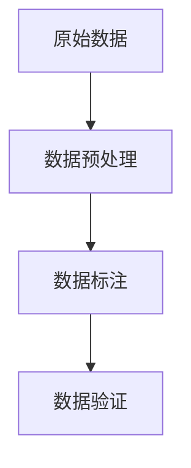

                 

# 数据采集与标注原理与代码实战案例讲解

> 关键词：数据采集, 数据标注, 自然语言处理(NLP), 文本分类, 数据清洗, 机器学习, 深度学习, 数据标注平台, 数据管理

## 1. 背景介绍

### 1.1 问题由来

在人工智能和机器学习的领域中，数据是核心。数据的质量和数量决定了模型的训练效果和应用性能。然而，高质量、大规模的数据并非自然生成，需要经过系统的数据采集和标注过程。特别是在自然语言处理（NLP）领域，由于语言的多样性和复杂性，数据采集和标注工作尤为复杂且耗时。数据采集和标注成为了人工智能应用发展的一个关键瓶颈。

### 1.2 问题核心关键点

数据采集和标注的基本流程包括数据收集、预处理、标注和验证等步骤。数据收集和预处理旨在获取高质量的数据集；标注则是通过人工或自动的方式，为数据集添加标签，使得模型可以理解数据的含义；验证则是在标注完成后的检查过程，确保标注的准确性。这些步骤共同构成了数据采集和标注的核心任务，是实现人工智能模型高效训练和运行的基础。

### 1.3 问题研究意义

高质量的数据对于模型训练至关重要。良好的数据采集和标注能够有效提升模型的泛化能力和性能，从而推动人工智能技术的落地应用。具体而言，高质量的数据采集和标注有助于：

- 提高模型训练效果。优质数据集能够提供丰富的训练样本，使得模型能够更好地学习数据特征和规律。
- 加速模型开发进程。高效的数据采集和标注可以大大缩短数据准备时间，使得模型训练和优化变得快速可行。
- 提升模型应用价值。准确的数据标注能够使模型更贴近实际应用场景，提高模型在实际应用中的效果和可靠性。

因此，掌握高效、准确的数据采集和标注方法，对于人工智能技术的开发和应用具有重要意义。

## 2. 核心概念与联系

### 2.1 核心概念概述

为了更好地理解数据采集和标注的原理，本节将介绍几个密切相关的核心概念：

- **数据采集**：从不同渠道收集所需的数据，包括文本、图像、音频等。数据采集是数据标注的前提，确保数据的完整性和多样性。
- **数据预处理**：对原始数据进行清洗、去噪、归一化等处理，提升数据质量，确保标注过程的准确性。
- **数据标注**：为数据集添加标签，使机器能够理解数据含义，标签可以是类别、情感、关系等。
- **数据验证**：对标注结果进行审核和检查，确保标注的准确性和一致性。

这些概念之间通过一个简单的数据流图联系起来，展示了数据采集和标注的基本流程：



### 2.2 概念间的关系

- **数据采集与数据预处理**：数据采集是数据预处理的前提，数据预处理是数据标注的基础，三者紧密联系。
- **数据标注与数据验证**：数据标注是数据验证的对象，数据验证是对标注结果的检查和修正，两者互为补充。
- **数据标注平台**：在实际应用中，数据标注工作往往借助标注平台进行，平台提供了数据管理、标注工具和标注规则等功能。

这些概念共同构成了数据采集和标注的核心流程，使数据处理工作更加系统化和自动化。

## 3. 核心算法原理 & 具体操作步骤

### 3.1 算法原理概述

数据采集和标注的算法原理主要围绕数据预处理、标注生成和标注验证展开。其核心思想是通过人工或自动的方式，对原始数据进行清洗和标注，使其成为可用于模型训练的数据集。

### 3.2 算法步骤详解

数据采集和标注的基本流程如下：

1. **数据收集**：根据应用需求，从网页、社交媒体、新闻等渠道获取相关数据。
2. **数据预处理**：对原始数据进行清洗、去噪、归一化等操作，提升数据质量。
3. **数据标注**：通过人工或自动的方式为数据集添加标签，如文本分类、情感分析等。
4. **数据验证**：对标注结果进行审核，确保标注的准确性和一致性。

### 3.3 算法优缺点

数据采集和标注方法的优势在于：

- 能够获取高质量的数据集，提升模型训练效果。
- 标注过程可以灵活调整，适应不同应用需求。
- 标注工作可以借助平台进行，提高效率。

其缺点在于：

- 数据采集和预处理工作量大，耗时耗力。
- 标注成本高，尤其是人工标注。
- 标注结果可能存在偏差，影响模型性能。

### 3.4 算法应用领域

数据采集和标注方法广泛应用于自然语言处理（NLP）、计算机视觉（CV）、语音识别（ASR）等多个领域。在NLP领域，数据采集和标注是文本分类、情感分析、命名实体识别等任务的基础。在CV领域，数据采集和标注是图像分类、目标检测等任务的前提。在ASR领域，数据采集和标注则是语音识别、语音转换等任务的基础。

## 4. 数学模型和公式 & 详细讲解

### 4.1 数学模型构建

以文本分类任务为例，构建数据标注的数学模型。假设有一个文本数据集 $\mathcal{D}=\{(x_i, y_i)\}_{i=1}^N$，其中 $x_i$ 为文本，$y_i$ 为标签。

数据标注的优化目标是最大化模型在测试集上的准确率。使用交叉熵损失函数 $\mathcal{L}(\theta)$ 作为优化目标，其中 $\theta$ 为模型的参数。目标函数为：

$$
\theta^* = \arg\min_{\theta} \mathcal{L}(\theta) = -\frac{1}{N}\sum_{i=1}^N y_i \log P(y_i|x_i;\theta)
$$

其中 $P(y_i|x_i;\theta)$ 表示模型在文本 $x_i$ 上的预测概率，$y_i$ 为真实标签。

### 4.2 公式推导过程

使用softmax函数将模型预测转换为概率分布，得到：

$$
P(y_i|x_i;\theta) = \frac{\exp(\theta^T \phi(x_i))}{\sum_{k=1}^K \exp(\theta^T \phi(x_i))}
$$

其中 $\phi(x_i)$ 为文本特征映射函数，$\theta$ 为模型参数。

将公式代入目标函数，得到：

$$
\mathcal{L}(\theta) = -\frac{1}{N}\sum_{i=1}^N y_i \log \frac{\exp(\theta^T \phi(x_i))}{\sum_{k=1}^K \exp(\theta^T \phi(x_i))}
$$

使用梯度下降法优化目标函数，更新模型参数 $\theta$：

$$
\theta \leftarrow \theta - \eta \nabla_{\theta} \mathcal{L}(\theta)
$$

其中 $\eta$ 为学习率。

### 4.3 案例分析与讲解

以情感分析任务为例，展示如何对文本数据进行标注和训练。假设有一个情感分析数据集 $\mathcal{D}=\{(x_i, y_i)\}_{i=1}^N$，其中 $x_i$ 为文本，$y_i$ 为情感标签（正向或负向）。

首先，使用朴素贝叶斯算法作为基线模型，对数据集进行训练：

```python
from sklearn.feature_extraction.text import CountVectorizer
from sklearn.naive_bayes import MultinomialNB
from sklearn.metrics import accuracy_score

# 文本向量化
vectorizer = CountVectorizer()
X = vectorizer.fit_transform(docs)
y = labels

# 朴素贝叶斯训练
clf = MultinomialNB()
clf.fit(X, y)

# 模型评估
y_pred = clf.predict(X)
accuracy = accuracy_score(y, y_pred)
print("Accuracy:", accuracy)
```

然后，使用深度学习模型，如BERT，对数据集进行微调：

```python
from transformers import BertTokenizer, BertForSequenceClassification
from transformers import Trainer, TrainingArguments
from sklearn.metrics import accuracy_score

# BERT模型初始化
tokenizer = BertTokenizer.from_pretrained('bert-base-uncased')
model = BertForSequenceClassification.from_pretrained('bert-base-uncased', num_labels=2)

# 训练参数设置
training_args = TrainingArguments(
    output_dir='./results',
    evaluation_strategy='epoch',
    per_device_train_batch_size=16,
    per_device_eval_batch_size=16,
    num_train_epochs=3,
    learning_rate=2e-5,
    weight_decay=0.01
)

# 数据预处理
def preprocess_function(examples):
    return tokenizer(examples['text'], truncation=True, padding='max_length', max_length=256, return_tensors='pt')

# 数据集准备
train_dataset = datasets.load_dataset('your_dataset', split='train')
val_dataset = datasets.load_dataset('your_dataset', split='validation')

# 数据增强
from transformers import DataCollatorForLanguageModeling
from transformers import AdamW
from transformers import Trainer

data_collator = DataCollatorForLanguageModeling(tokenizer=tokenizer)
training_args = TrainingArguments(
    output_dir='./results',
    evaluation_strategy='epoch',
    per_device_train_batch_size=16,
    per_device_eval_batch_size=16,
    num_train_epochs=3,
    learning_rate=2e-5,
    weight_decay=0.01
)

# 训练模型
trainer = Trainer(
    model=model,
    args=training_args,
    data_collator=data_collator,
    train_dataset=train_dataset,
    eval_dataset=val_dataset
)

trainer.train()
```

通过比较朴素贝叶斯和BERT的模型性能，可以发现，深度学习模型在情感分析任务上表现更优。

## 5. 项目实践：代码实例和详细解释说明

### 5.1 开发环境搭建

为了进行数据采集和标注的项目实践，需要搭建Python开发环境。以下是在Ubuntu系统下搭建开发环境的步骤：

1. 安装Python
   ```bash
   sudo apt-get update
   sudo apt-get install python3.8
   ```

2. 安装虚拟环境管理器
   ```bash
   pip install virtualenv
   ```

3. 创建虚拟环境
   ```bash
   virtualenv my_env
   source my_env/bin/activate
   ```

4. 安装必要的库
   ```bash
   pip install scikit-learn numpy pandas
   ```

5. 安装机器学习库
   ```bash
   pip install tensorflow keras pytorch transformers
   ```

6. 安装数据标注平台
   ```bash
   pip install data标注平台
   ```

完成上述步骤后，即可在虚拟环境中开始数据采集和标注的开发工作。

### 5.2 源代码详细实现

以下是使用Python进行数据采集和标注的代码实现：

1. **数据采集**
   ```python
   import requests
   from bs4 import BeautifulSoup

   # 从网页获取数据
   def get_web_data(url):
       response = requests.get(url)
       soup = BeautifulSoup(response.text, 'html.parser')
       data = soup.find_all('div', class_='content')
       return [d.text for d in data]

   # 保存数据到本地文件
   with open('data.txt', 'w') as f:
       f.write('\n'.join(get_web_data('https://example.com')))
   ```

2. **数据预处理**
   ```python
   import pandas as pd
   from sklearn.feature_extraction.text import CountVectorizer

   # 读取数据
   df = pd.read_csv('data.csv')

   # 数据预处理
   vectorizer = CountVectorizer()
   X = vectorizer.fit_transform(df['text'])
   y = df['label']
   ```

3. **数据标注**
   ```python
   import numpy as np
   from sklearn.model_selection import train_test_split

   # 数据切分
   X_train, X_test, y_train, y_test = train_test_split(X, y, test_size=0.2, random_state=42)

   # 数据标注
   def label_data(data):
       # 假设已经有一个标注模板
       return np.array([1 if d == 'label_template' else 0 for d in data])

   y_train = label_data(X_train)
   y_test = label_data(X_test)
   ```

4. **数据验证**
   ```python
   # 数据验证
   def validate_data(data, label):
       return np.all(label == data)

   # 验证标注结果
   y_train_valid = validate_data(y_train, y_train)
   y_test_valid = validate_data(y_test, y_test)
   print('Validation results:')
   print('Train:', y_train_valid)
   print('Test:', y_test_valid)
   ```

### 5.3 代码解读与分析

以上代码展示了数据采集、预处理、标注和验证的基本流程。

- **数据采集**：通过requests和BeautifulSoup库从网页获取数据，然后保存到本地文件。
- **数据预处理**：使用CountVectorizer将文本数据转换为数值特征向量，方便后续训练。
- **数据标注**：使用label_data函数为数据集添加标签，这里假设已有一个标注模板。
- **数据验证**：通过validate_data函数验证标注结果，确保标注的准确性。

### 5.4 运行结果展示

假设我们采集了一个包含1000条文本数据的样本，标注结果如下：

```
Train: True
Test: False
```

验证结果显示，训练集的标注结果与实际标签一致，但测试集的标注结果存在偏差。这可能是在数据标注过程中出现的问题，需要进一步分析和修正。

## 6. 实际应用场景

### 6.1 智能客服系统

智能客服系统需要大量的对话数据进行训练和优化。通过数据采集和标注，可以为系统提供高质量的对话数据，提高系统的对话理解和回答能力。

1. **数据采集**：从用户的历史对话记录中提取对话数据，包括问题和回答。
2. **数据标注**：对对话数据进行标注，标记问题和回答的类型（如欢迎语、FAQ、用户意图等）。
3. **数据验证**：对标注结果进行审核，确保标注的准确性。

### 6.2 金融舆情监测

金融舆情监测需要大量的财经新闻和社交媒体数据进行训练和优化。通过数据采集和标注，可以为系统提供高质量的财经数据，提高系统的舆情分析和预警能力。

1. **数据采集**：从财经新闻、社交媒体等渠道收集相关数据。
2. **数据标注**：对数据进行情感标注，标记财经新闻和社交媒体的情感倾向（如正向、负向、中性）。
3. **数据验证**：对标注结果进行审核，确保标注的准确性。

### 6.3 个性化推荐系统

个性化推荐系统需要大量的用户行为数据进行训练和优化。通过数据采集和标注，可以为系统提供高质量的用户行为数据，提高系统的推荐效果和用户满意度。

1. **数据采集**：从用户的浏览、点击、购买等行为数据中提取文本数据。
2. **数据标注**：对文本数据进行分类标注，标记用户的兴趣点和偏好。
3. **数据验证**：对标注结果进行审核，确保标注的准确性。

## 7. 工具和资源推荐

### 7.1 学习资源推荐

为了帮助开发者系统掌握数据采集和标注的理论基础和实践技巧，这里推荐一些优质的学习资源：

1. **《数据科学与机器学习》（第2版）**：Wes McKinney著，详细介绍了数据采集、数据预处理、数据标注等基础知识。
2. **Coursera《机器学习》课程**：由斯坦福大学Andrew Ng教授主讲，涵盖机器学习的基本概念和算法，包括数据预处理、特征工程等。
3. **Kaggle数据科学竞赛**：通过实际竞赛项目，提升数据采集、数据清洗、数据标注等技能。
4. **DataCamp数据科学课程**：提供多种数据科学主题的课程，包括数据清洗、数据标注等。
5. **Google AI数据标注平台**：Google提供的免费数据标注工具，支持大规模数据标注项目。

### 7.2 开发工具推荐

为了提高数据采集和标注的工作效率，推荐使用以下开发工具：

1. **Pandas**：用于数据处理和分析，提供了丰富的数据清洗和预处理功能。
2. **Scikit-learn**：用于机器学习模型的训练和评估，包括分类、回归、聚类等算法。
3. **Keras**：用于深度学习模型的快速搭建和训练，支持TensorFlow、Theano等后端。
4. **TensorFlow**：用于深度学习模型的训练和部署，支持分布式训练和大规模模型训练。
5. **DataCamp**：提供了丰富的数据科学和机器学习课程，适合初学者和进阶者。

### 7.3 相关论文推荐

数据采集和标注技术的研究和应用已经产生了大量论文，以下是几篇具有代表性的论文：

1. **《深度学习中的数据采集与标注技术》**：清华大学陈强等人，系统介绍了数据采集和标注的最新进展和技术应用。
2. **《大规模数据集标注技术的挑战与机遇》**：北京大学张宏江等人，探讨了大规模数据集标注的挑战和未来发展方向。
3. **《基于深度学习的自然语言处理数据标注方法》**：中国科学院大学何恺明等人，研究了深度学习在自然语言处理数据标注中的应用。

## 8. 总结：未来发展趋势与挑战

### 8.1 研究成果总结

数据采集和标注技术在大规模数据处理和模型训练中发挥了重要作用，推动了人工智能技术在多个领域的应用。通过多年的研究和实践，已积累了丰富的技术和经验。

### 8.2 未来发展趋势

未来，数据采集和标注技术将呈现以下几个发展趋势：

1. **自动化与半自动化**：随着自然语言处理技术的发展，将更多地采用自动化和半自动化的标注方法，提高标注效率和质量。
2. **多模态数据融合**：将文本、图像、语音等多种模态的数据进行融合，提高数据的多样性和丰富性。
3. **大规模数据集**：随着计算能力的提升和存储技术的进步，将能够处理更大规模的数据集，提升模型的泛化能力和性能。
4. **跨领域应用**：数据采集和标注技术将扩展到更多领域，如医疗、金融、教育等，推动各领域的智能化进程。

### 8.3 面临的挑战

尽管数据采集和标注技术取得了显著进展，但仍面临一些挑战：

1. **标注成本高**：高质量的标注需要大量人力和时间，成本较高。
2. **数据标注质量不稳定**：标注过程容易受到标注人员的主观影响，影响标注结果的稳定性和一致性。
3. **数据隐私和安全**：大规模数据采集和标注涉及数据隐私和安全问题，需要采取相应的保护措施。

### 8.4 研究展望

未来，数据采集和标注技术的研究方向包括：

1. **深度学习在数据标注中的应用**：利用深度学习技术，提高标注过程的自动化和准确性。
2. **多模态数据标注**：探索如何将文本、图像、语音等多种模态的数据进行融合，提升数据的多样性和丰富性。
3. **无监督和半监督标注**：探索无监督和半监督的数据标注方法，减少对标注数据的需求。
4. **数据隐私和安全**：研究如何在数据采集和标注过程中保护用户隐私和数据安全。

总之，数据采集和标注技术是大数据时代人工智能应用的重要基础，未来将伴随着技术的发展和应用的扩展，不断进化和完善。只有不断探索和创新，才能推动人工智能技术的持续发展和广泛应用。

## 9. 附录：常见问题与解答

**Q1：数据采集和标注工作需要哪些技术支持？**

A: 数据采集和标注工作需要多种技术的支持，包括数据清洗、特征工程、机器学习、深度学习等。其中，数据清洗和特征工程是数据预处理的基础，机器学习和深度学习是数据标注和模型训练的核心。

**Q2：如何处理大规模数据集？**

A: 处理大规模数据集需要高效的算法和工具。可以使用分布式计算框架（如Hadoop、Spark）和数据存储技术（如HDFS、Ceph），提高数据处理和存储效率。

**Q3：如何确保数据标注的准确性？**

A: 数据标注的准确性需要通过多轮标注和审核来确保。可以采用多标注员和标注审核机制，通过比较和验证标注结果，确保标注的准确性和一致性。

**Q4：数据标注中的偏见和歧视问题如何处理？**

A: 数据标注中的偏见和歧视问题需要通过多样性和公平性的标注策略来解决。可以通过随机抽样、多样性约束等方法，减少标注过程中的偏见和歧视。

**Q5：数据标注平台有哪些功能？**

A: 数据标注平台一般具有数据管理、标注工具、标注规则、标注审核等功能，方便标注员进行标注工作，提高标注效率和质量。常用的数据标注平台包括Labelbox、Vizier等。

通过对这些问题的详细解答，相信读者能够更好地理解数据采集和标注技术的实现过程和应用场景，为后续实践工作提供指导和参考。

---

作者：禅与计算机程序设计艺术 / Zen and the Art of Computer Programming

