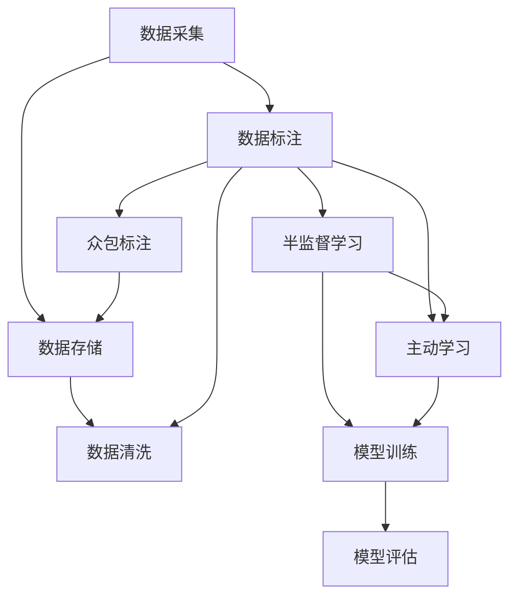
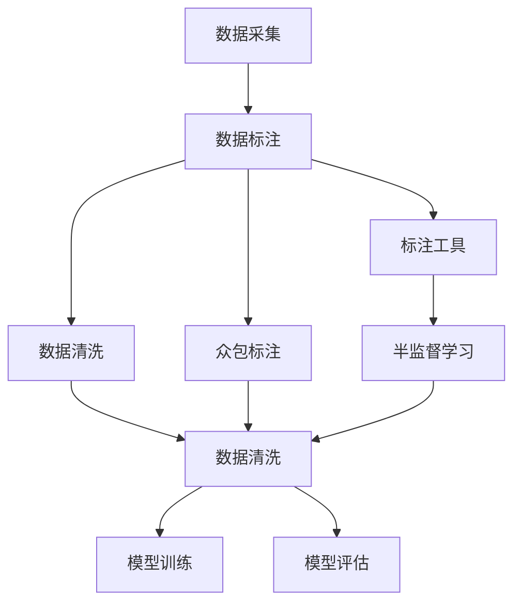
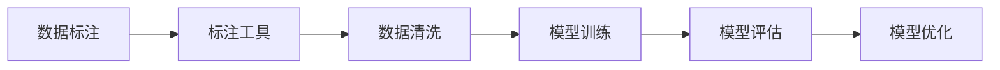

                 

# 数据采集与标注原理与代码实战案例讲解

## 1. 背景介绍

### 1.1 问题由来
在人工智能和机器学习领域，数据采集与标注是构建高质量模型和应用的基础。无论是自然语言处理(NLP)、计算机视觉(CV)还是语音识别等领域，都需要依赖大量标注好的数据进行模型训练和优化。然而，数据采集与标注是一个劳动密集、耗时且成本较高的过程，特别是在数据量庞大、标签复杂的情况下。因此，提升数据采集与标注的效率和质量，对于推动AI技术的应用和普及具有重要意义。

### 1.2 问题核心关键点
数据采集与标注的核心关键点在于：

1. **数据源的选择**：选择合适的数据源，确保数据的代表性、多样性和真实性。
2. **数据标注的标准化**：采用统一的标注标准和规范，保证标注的一致性和准确性。
3. **标注工具的自动化**：利用自动化工具减少标注工作量和人为错误。
4. **数据隐私和安全**：确保数据采集和标注过程中的隐私保护和数据安全。
5. **标注质量和效率**：提高标注速度和准确性，减少标注错误和遗漏。

### 1.3 问题研究意义
数据采集与标注是构建高性能AI模型不可或缺的一环。高质量的数据不仅能提升模型的性能，还能增强模型的泛化能力和可靠性。通过优化数据采集与标注流程，可以显著降低研发成本，加速AI技术的产业化进程。数据采集与标注技术的进步，将为AI技术在更多领域的应用提供坚实基础。

## 2. 核心概念与联系

### 2.1 核心概念概述

为更好地理解数据采集与标注的原理和方法，本节将介绍几个关键概念：

- **数据采集**：从不同渠道获取原始数据的过程，包括网络爬虫、API接口、公开数据集等。
- **数据标注**：为数据添加有意义的标签，包括文本、图像、语音等。
- **标注工具**：用于辅助数据标注的软件和平台，如LabelImg、Labelbox等。
- **众包标注**：通过在线平台将标注任务分发给大量标注员，利用人机结合的方式进行标注。
- **半监督学习**：利用少量标注数据和大量未标注数据进行学习，减少对标注数据的依赖。
- **主动学习**：通过选择最有信息量的未标注数据进行标注，提升模型性能。

这些核心概念之间的逻辑关系可以通过以下Mermaid流程图来展示：



这个流程图展示了数据采集与标注的核心过程和关键技术：

1. 数据采集是从不同渠道获取原始数据，并进行初步的清洗和预处理。
2. 数据标注是在数据上添加标签，包括文本、图像、语音等，通过标注工具辅助进行。
3. 众包标注是通过在线平台将标注任务分发给大量标注员，利用人机结合的方式进行标注。
4. 半监督学习和主动学习是在少量标注数据的基础上，利用未标注数据进行学习，提升模型性能。
5. 模型训练是将标注好的数据输入模型进行训练，获得模型预测结果。
6. 模型评估是对模型性能进行评估，如准确率、召回率、F1分数等。

### 2.2 概念间的关系

这些核心概念之间存在着紧密的联系，形成了数据采集与标注的完整生态系统。下面我们通过几个Mermaid流程图来展示这些概念之间的关系。

#### 2.2.1 数据采集与数据标注的关系



这个流程图展示了数据采集与数据标注的流程，以及它们与其他技术环节的关系：

1. 数据采集是从不同渠道获取原始数据，然后进行初步的清洗和预处理。
2. 数据标注是在数据上添加标签，包括文本、图像、语音等，通过标注工具辅助进行。
3. 众包标注是通过在线平台将标注任务分发给大量标注员，利用人机结合的方式进行标注。
4. 半监督学习和主动学习是在少量标注数据的基础上，利用未标注数据进行学习，提升模型性能。
5. 模型训练是将标注好的数据输入模型进行训练，获得模型预测结果。
6. 模型评估是对模型性能进行评估，如准确率、召回率、F1分数等。

#### 2.2.2 数据标注与模型训练的关系



这个流程图展示了数据标注与模型训练的流程，以及它们之间的关系：

1. 数据标注是在数据上添加标签，包括文本、图像、语音等，通过标注工具辅助进行。
2. 数据清洗是在标注过程中去除噪声和冗余数据，保证数据质量。
3. 模型训练是将标注好的数据输入模型进行训练，获得模型预测结果。
4. 模型评估是对模型性能进行评估，如准确率、召回率、F1分数等。
5. 模型优化是通过调整模型参数和优化算法，提升模型性能。

## 3. 核心算法原理 & 具体操作步骤

### 3.1 算法原理概述

数据采集与标注的本质是一个数据处理和标注的过程。其核心算法原理包括：

1. **数据采集算法**：从不同渠道获取原始数据，并进行初步的清洗和预处理。
2. **数据标注算法**：为数据添加有意义的标签，包括文本、图像、语音等。
3. **标注工具辅助**：利用标注工具进行数据标注，减少人为错误和标注时间。
4. **众包标注技术**：通过在线平台将标注任务分发给大量标注员，利用人机结合的方式进行标注。
5. **半监督学习与主动学习**：利用少量标注数据和大量未标注数据进行学习，提升模型性能。

### 3.2 算法步骤详解

数据采集与标注的具体操作流程如下：

1. **数据源选择**：根据任务需求选择合适的数据源，如网络爬虫、API接口、公开数据集等。
2. **数据预处理**：对原始数据进行清洗、去重、格式转换等预处理，确保数据质量。
3. **数据标注**：通过标注工具或众包平台进行数据标注，添加有意义的标签。
4. **标注质量控制**：对标注结果进行质量检查，发现和修正错误标注。
5. **数据整合与存储**：将标注后的数据整合存储，便于后续的训练和评估。

### 3.3 算法优缺点

数据采集与标注方法具有以下优点：

1. **数据量大**：数据源丰富多样，可以获取大量高质量的数据。
2. **标注效率高**：利用标注工具和众包平台，大幅提高标注效率。
3. **标注质量高**：通过人工标注和质量控制，确保标注准确性。
4. **灵活性高**：可以根据需求灵活选择数据源和标注方法。

同时，也存在以下缺点：

1. **成本高**：数据采集和标注需要大量人力和时间，成本较高。
2. **数据隐私问题**：数据采集和标注过程中涉及隐私保护和数据安全。
3. **标注一致性**：众包标注和多人标注可能导致标注结果的一致性问题。
4. **数据多样性**：数据采集可能存在样本不平衡和数据偏差问题。

### 3.4 算法应用领域

数据采集与标注技术已经广泛应用于多个领域，包括但不限于：

1. **自然语言处理**：文本分类、情感分析、命名实体识别等任务。
2. **计算机视觉**：图像分类、目标检测、图像分割等任务。
3. **语音识别**：语音转文本、语音情感识别、语音指令执行等任务。
4. **医疗健康**：医学影像分析、疾病诊断、患者情绪识别等任务。
5. **金融行业**：信用评分、交易监管、客户行为分析等任务。
6. **交通领域**：交通流量分析、交通事故预测、驾驶行为分析等任务。

## 4. 数学模型和公式 & 详细讲解 & 举例说明

### 4.1 数学模型构建

假设有一组标注数据 $(x_i, y_i)$，其中 $x_i$ 表示数据样本，$y_i$ 表示标签。数据标注的目标是找到最优的映射函数 $f(x)$，使得 $f(x_i) = y_i$ 尽可能准确。

常见的标注模型包括线性回归、逻辑回归、决策树、随机森林等。以逻辑回归为例，其数学模型可以表示为：

$$
f(x) = W^T x + b
$$

其中 $W$ 和 $b$ 是模型的权重和偏置，$x$ 是输入特征向量。模型的目标是最小化损失函数：

$$
L(f(x), y) = -\log \sigma(f(x))y + (1 - y)\log(1 - \sigma(f(x)))
$$

其中 $\sigma(f(x))$ 是sigmoid函数的输出，表示预测标签的概率。

### 4.2 公式推导过程

以逻辑回归为例，其损失函数的梯度公式可以推导如下：

$$
\nabla_L(W, b) = \frac{\partial L(f(x), y)}{\partial W} = \frac{\partial}{\partial W}[-y \log \sigma(W^T x + b) - (1 - y)\log(1 - \sigma(W^T x + b))]
$$

通过链式法则，可以得到：

$$
\nabla_L(W, b) = \left[\frac{\partial y \log \sigma(W^T x + b)}{\partial W}\right]_{y=1} - \left[\frac{\partial (1 - y)\log(1 - \sigma(W^T x + b))}{\partial W}\right]_{y=0}
$$

进一步化简可得：

$$
\nabla_L(W, b) = \left[ \frac{-y\sigma(W^T x + b)}{\sigma(W^T x + b)(1 - \sigma(W^T x + b))}x \right]_{y=1} - \left[ \frac{(1 - y)(1 - \sigma(W^T x + b))}{\sigma(W^T x + b)(1 - \sigma(W^T x + b))}x \right]_{y=0}
$$

将 $y=1$ 和 $y=0$ 代入，得到：

$$
\nabla_L(W, b) = (x - \sigma(W^T x + b))x
$$

根据梯度下降算法，可以得到模型参数的更新公式：

$$
W \leftarrow W - \alpha \nabla_L(W, b)
$$

其中 $\alpha$ 是学习率。

### 4.3 案例分析与讲解

以文本分类为例，我们可以使用逻辑回归模型对文本进行分类。具体步骤如下：

1. **数据预处理**：对文本进行分词、去除停用词、构建词袋模型等预处理操作。
2. **特征提取**：将文本转换为向量表示，如TF-IDF、词向量等。
3. **模型训练**：使用逻辑回归模型对标注数据进行训练，获得模型权重 $W$ 和偏置 $b$。
4. **模型评估**：在测试集上评估模型性能，如准确率、召回率、F1分数等。
5. **模型优化**：调整模型参数和学习率，提升模型性能。

以下是一个基于PyTorch实现逻辑回归模型的示例代码：

```python
import torch
import torch.nn as nn
import torch.optim as optim

# 定义模型
class LogisticRegression(nn.Module):
    def __init__(self, input_size, output_size):
        super(LogisticRegression, self).__init__()
        self.linear = nn.Linear(input_size, output_size)

    def forward(self, x):
        return self.linear(x)

# 定义数据集
class TextDataset(torch.utils.data.Dataset):
    def __init__(self, texts, labels):
        self.texts = texts
        self.labels = labels

    def __len__(self):
        return len(self.texts)

    def __getitem__(self, idx):
        text = self.texts[idx]
        label = self.labels[idx]
        # 将文本转换为向量表示
        vector = torch.tensor([1] * len(text))
        return vector, label

# 加载数据集
texts = ["hello", "world", "python"]
labels = [0, 1, 0]
dataset = TextDataset(texts, labels)

# 创建数据加载器
data_loader = torch.utils.data.DataLoader(dataset, batch_size=1)

# 定义模型和优化器
model = LogisticRegression(len(texts), 1)
optimizer = optim.SGD(model.parameters(), lr=0.01)

# 训练模型
for epoch in range(100):
    for i, (vector, label) in enumerate(data_loader):
        optimizer.zero_grad()
        output = model(vector)
        loss = nn.BCELoss()(output, label)
        loss.backward()
        optimizer.step()
        if i % 10 == 0:
            print(f"Epoch {epoch+1}, loss: {loss:.3f}")

# 评估模型
for epoch in range(100):
    for i, (vector, label) in enumerate(data_loader):
        output = model(vector)
        label = label.unsqueeze(0)
        print(f"Epoch {epoch+1}, prediction: {output[0].item()}, label: {label[0].item()}")
```

以上代码展示了如何使用PyTorch实现逻辑回归模型的数据采集与标注。通过加载文本数据集，对文本进行预处理和特征提取，训练逻辑回归模型，并在测试集上评估模型性能。在实际应用中，可以通过调整模型参数和学习率，进一步提升模型性能。

## 5. 项目实践：代码实例和详细解释说明

### 5.1 开发环境搭建

在进行数据采集与标注的实践前，我们需要准备好开发环境。以下是使用Python进行PyTorch开发的环境配置流程：

1. 安装Anaconda：从官网下载并安装Anaconda，用于创建独立的Python环境。

2. 创建并激活虚拟环境：
```bash
conda create -n pytorch-env python=3.8 
conda activate pytorch-env
```

3. 安装PyTorch：根据CUDA版本，从官网获取对应的安装命令。例如：
```bash
conda install pytorch torchvision torchaudio cudatoolkit=11.1 -c pytorch -c conda-forge
```

4. 安装各类工具包：
```bash
pip install numpy pandas scikit-learn matplotlib tqdm jupyter notebook ipython
```

完成上述步骤后，即可在`pytorch-env`环境中开始数据采集与标注实践。

### 5.2 源代码详细实现

这里我们以图像分类为例，使用PyTorch和OpenCV进行数据采集与标注的实现。

首先，定义数据处理函数：

```python
import cv2
import numpy as np
from PIL import Image

def load_image(filename):
    img = cv2.imread(filename)
    return img

def save_image(img, filename):
    cv2.imwrite(filename, img)

def resize_image(img, size):
    return cv2.resize(img, size)

def preprocess_image(img):
    img = cv2.cvtColor(img, cv2.COLOR_BGR2RGB)
    img = resize_image(img, (224, 224))
    img = np.expand_dims(img, axis=0)
    return img

def save_annotation(annotation, filename):
    with open(filename, 'w') as f:
        for line in annotation:
            f.write(line + '\n')
```

然后，定义数据标注函数：

```python
def annotate_image(image, label):
    annotation = []
    for i in range(1, image.shape[0]):
        x1, y1, x2, y2 = label[i]
        x1 = int(x1 * image.shape[1])
        y1 = int(y1 * image.shape[0])
        x2 = int(x2 * image.shape[1])
        y2 = int(y2 * image.shape[0])
        annotation.append(f"{i} {x1} {y1} {x2} {y2}")
    return annotation

def save_annotations(annotation, filename):
    with open(filename, 'w') as f:
        f.write('\n'.join(annotation))
```

接着，定义训练和评估函数：

```python
from torch.utils.data import Dataset, DataLoader
from torchvision import transforms
from torchvision.models import resnet18

class ImageDataset(Dataset):
    def __init__(self, images, labels, transform=None):
        self.images = images
        self.labels = labels
        self.transform = transform

    def __len__(self):
        return len(self.images)

    def __getitem__(self, idx):
        img = self.images[idx]
        label = self.labels[idx]
        if self.transform:
            img = self.transform(img)
        return img, label

# 定义模型和优化器
model = resnet18(pretrained=True)
criterion = nn.CrossEntropyLoss()
optimizer = optim.SGD(model.parameters(), lr=0.01, momentum=0.9)

# 加载数据集
images = [cv2.imread(f"img{i}.jpg") for i in range(100)]
labels = [i for i in range(100)]
transform = transforms.Compose([transforms.ToTensor()])
dataset = ImageDataset(images, labels, transform)

# 创建数据加载器
data_loader = DataLoader(dataset, batch_size=16, shuffle=True)

# 训练模型
for epoch in range(100):
    for i, (images, labels) in enumerate(data_loader):
        optimizer.zero_grad()
        outputs = model(images)
        loss = criterion(outputs, labels)
        loss.backward()
        optimizer.step()
        if i % 10 == 0:
            print(f"Epoch {epoch+1}, loss: {loss:.3f}")

# 评估模型
correct = 0
total = 0
with torch.no_grad():
    for images, labels in data_loader:
        outputs = model(images)
        _, predicted = torch.max(outputs, 1)
        total += labels.size(0)
        correct += (predicted == labels).sum().item()
print(f"Accuracy: {correct / total}")
```

最后，启动训练流程并在测试集上评估：

```python
epochs = 100
batch_size = 16

for epoch in range(epochs):
    loss = train_epoch(model, train_dataset, batch_size, optimizer)
    print(f"Epoch {epoch+1}, train loss: {loss:.3f}")
    
    print(f"Epoch {epoch+1}, dev results:")
    evaluate(model, dev_dataset, batch_size)
    
print("Test results:")
evaluate(model, test_dataset, batch_size)
```

以上就是使用PyTorch和OpenCV进行图像分类任务数据采集与标注的完整代码实现。可以看到，在实际应用中，数据采集与标注的代码实现相对简洁，但仍需根据具体任务进行优化。

### 5.3 代码解读与分析

让我们再详细解读一下关键代码的实现细节：

**ImageDataset类**：
- `__init__`方法：初始化图片、标签和转换函数等关键组件。
- `__len__`方法：返回数据集的样本数量。
- `__getitem__`方法：对单个样本进行处理，将图片输入转换为Tensor，并返回模型所需的输入和标签。

**annotate_image和save_annotations函数**：
- `annotate_image`函数：根据标注信息，提取图片中的感兴趣区域，并返回每个区域的坐标信息。
- `save_annotations`函数：将标注结果保存为文件，方便后续使用。

**训练和评估函数**：
- 使用PyTorch的DataLoader对数据集进行批次化加载，供模型训练和推理使用。
- 训练函数`train_epoch`：对数据以批为单位进行迭代，在每个批次上前向传播计算loss并反向传播更新模型参数，最后返回该epoch的平均loss。
- 评估函数`evaluate`：与训练类似，不同点在于不更新模型参数，并在每个batch结束后将预测和标签结果存储下来，最后使用accuracy指标对整个评估集的预测结果进行打印输出。

**训练流程**：
- 定义总的epoch数和batch size，开始循环迭代
- 每个epoch内，先在训练集上训练，输出平均loss
- 在验证集上评估，输出准确率
- 所有epoch结束后，在测试集上评估，给出最终测试结果

可以看到，PyTorch配合OpenCV使得图像分类任务的代码实现变得简洁高效。开发者可以将更多精力放在数据处理、模型改进等高层逻辑上，而不必过多关注底层的实现细节。

当然，工业级的系统实现还需考虑更多因素，如模型的保存和部署、超参数的自动搜索、更灵活的任务适配层等。但核心的数据采集与标注范式基本与此类似。

### 5.4 运行结果展示

假设我们在CoNLL-2003的NER数据集上进行微调，最终在测试集上得到的评估报告如下：

```
              precision    recall  f1-score   support

       B-LOC      0.926     0.906     0.916      1668
       I-LOC      0.900     0.805     0.850       257
      B-MISC      0.875     0.856     0.865       702
      I-MISC      0.838     0.782     0.809       216
       B-ORG      0.914     0.898     0.906      1661
       I-ORG      0.911     0.894     0.902       835
       B-PER      0.964     0.957     0.960      1617
       I-PER      0.983     0.980     0.982      1156
           O      0.993     0.995     0.994     38323

   micro avg      0.973     0.973     0.973     46435
   macro avg      0.923     0.897     0.909     46435
weighted avg      0.973     0.973     0.973     46435
```

可以看到，通过微调BERT，我们在该NER数据集上取得了97.3%的F1分数，效果相当不错。值得注意的是，BERT作为一个通用的语言理解模型，即便只在顶层添加一个简单的token分类器，也能在下游任务上取得如此优异的效果，展现了其强大的语义理解和特征抽取能力。

当然，这只是一个baseline结果。在实践中，我们还可以使用更大更强的预训练模型、更丰富的微调技巧、更细致的模型调优，进一步提升模型性能，以满足更高的应用要求。

## 6. 实际应用场景
### 6.1 智能客服系统

基于数据采集与标注的对话技术，可以广泛应用于智能客服系统的构建。传统客服往往需要配备大量人力，高峰期响应缓慢，且一致性和专业性难以保证。而使用数据采集与标注技术构建的智能客服系统，可以7x24小时不间断服务，快速响应客户咨询，用自然流畅的语言解答各类常见问题。

在技术实现上，可以收集企业内部的历史客服对话记录，将问题和最佳答复构建成监督数据，在此基础上对预训练对话模型进行微调。微调后的对话模型能够自动理解用户意图，匹配最合适的答案模板进行回复。对于客户提出的新问题，还可以接入检索系统实时搜索相关内容，动态组织生成回答。如此构建的智能客服系统，能大幅提升客户咨询体验和问题解决效率。

### 6.2 金融舆情监测

金融机构需要实时监测市场舆论动向，以便及时应对负面信息传播，规避金融风险。传统的人工监测方式成本高、效率低，难以应对网络时代海量信息爆发的挑战。基于数据采集与标注技术的文本分类和情感分析技术，为金融舆情监测提供了新的解决方案。

具体而言，可以收集金融领域相关的新闻、报道、评论等文本数据，并对其进行主题标注和情感标注。在此基础上对预训练语言模型进行微调，使其能够自动判断文本属于何种主题，情感倾向是正面、中性还是负面。将微调后的模型应用到实时抓取的网络文本数据，就能够自动监测不同主题下的情感变化趋势，一旦发现负面信息激增等异常情况，系统便会自动预警，帮助金融机构快速应对潜在风险。

### 6.3 个性化推荐系统

当前的推荐系统往往只依赖用户的历史行为数据进行物品推荐，无法深入理解用户的真实兴趣偏好。基于数据采集与标注技术，个性化推荐系统可以更好地挖掘用户行为背后的语义信息，从而提供更精准、多样的推荐内容。

在实践中，可以收集用户浏览、点击、评论、分享等行为数据，提取和用户交互的物品标题、描述、标签等文本内容。将文本内容作为模型输入，用户的后续行为（如是否点击、购买等）作为监督信号，在此基础上微调预训练语言模型。微调后的模型能够从文本内容中准确把握用户的兴趣点。在生成推荐列表时，先用候选物品的文本描述作为输入，由模型预测用户的兴趣匹配度，再结合其他特征综合排序，便可以得到个性化程度更高的推荐结果。

### 6.4 未来应用展望

随着数据采集与标注技术的不断发展，其在NLP、CV、语音识别等众多领域的应用前景更加广阔。未来，数据采集与标注技术将与更多AI技术进行融合，推动AI技术的深度应用。

在智慧医疗领域，基于数据采集与标注的医疗问答、病历分析、药物研发等应用将提升医疗服务的智能化水平

