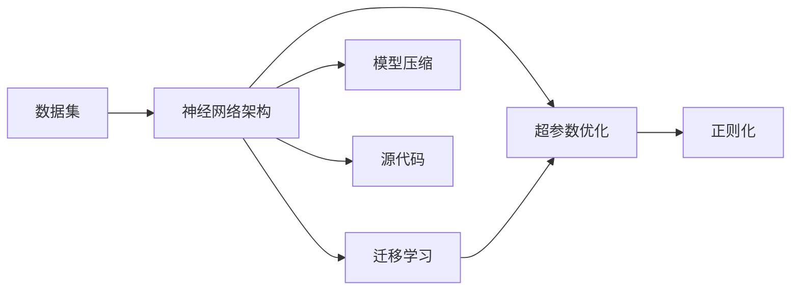
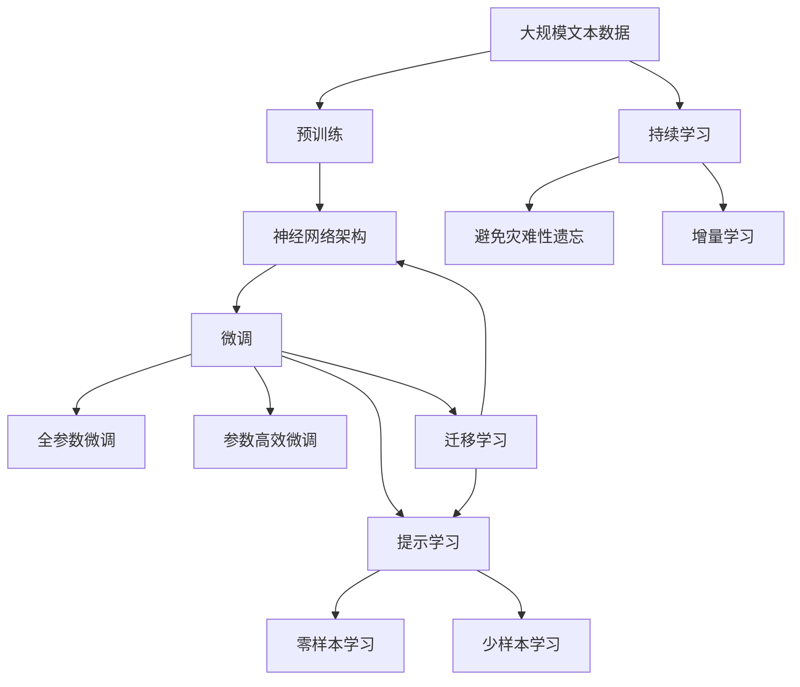

                 

# 数据集和神经网络架构:软件2.0的新源代码

> 关键词：数据集,神经网络架构,软件2.0,源代码,深度学习

## 1. 背景介绍

### 1.1 问题由来

在过去十年间，随着计算能力、存储技术、数据获取能力的飞速提升，深度学习技术迎来了突飞猛进的发展。从图像识别到自然语言处理，再到推荐系统，深度学习在诸多领域展现了卓越的性能。在这一过程中，数据集和神经网络架构的设计与构建，扮演着至关重要的角色。数据集的质量、规模和多样性，直接影响着模型性能和应用效果。而神经网络架构的创新，如卷积神经网络(CNN)、循环神经网络(RNN)、Transformer等，则引领了整个深度学习领域的革新。

数据集和神经网络架构的设计，不仅是一个技术问题，更是一个工程问题。需要综合考虑应用场景、计算资源、硬件平台、开发效率等多种因素。因此，为了更好地理解和掌握这一领域的核心技术，本文将从数据集和神经网络架构两个方面，系统梳理当前的最新进展和最佳实践。

### 1.2 问题核心关键点

数据集和神经网络架构的核心关键点包括：

1. **数据集设计**：包括数据采集、预处理、增强、标注等环节，直接影响模型性能。
2. **神经网络架构设计**：包括层数、节点数、激活函数、优化器、损失函数等，直接影响模型复杂度和训练效果。
3. **数据与架构的协同优化**：如何设计合适的数据集和网络架构，实现最佳性能，是当前研究的重点。

本文将深入探讨这些核心关键点，为读者提供全面的技术指引。

### 1.3 问题研究意义

数据集和神经网络架构的研究，对于提升深度学习模型的性能和可解释性，推动AI技术的产业化应用，具有重要意义：

1. **提升模型性能**：高质量的数据集和合理的神经网络架构设计，能有效提高模型泛化能力和学习效率。
2. **促进模型可解释性**：合理的架构设计和数据标注，有助于揭示模型内部机制，提高模型的可解释性和可靠性。
3. **加速产业应用**：高效的数据集和网络架构设计，大幅缩短模型开发和迭代周期，降低成本。
4. **带来技术创新**：数据集和架构设计的新方法，不断推动深度学习技术的发展和突破。

## 2. 核心概念与联系

### 2.1 核心概念概述

为了更好地理解数据集和神经网络架构之间的关系，本节将介绍几个密切相关的核心概念：

1. **数据集**：数据集是由一系列样本组成的集合，每个样本包括输入特征和对应的标签。数据集的质量、规模和多样性直接影响模型的训练效果。
2. **神经网络架构**：神经网络是由多层神经元组成的网络结构，通过前向传播计算特征表示，通过反向传播更新权重。常用的架构包括卷积神经网络(CNN)、循环神经网络(RNN)、Transformer等。
3. **迁移学习**：将一个领域学习到的知识，迁移到另一个不同但相关的领域，以加速模型训练和提升性能。
4. **超参数优化**：通过优化模型的超参数，如学习率、批大小、层数等，以达到最佳性能。
5. **正则化**：通过添加正则项，如L1/L2正则、Dropout等，防止模型过拟合。
6. **模型压缩**：通过模型剪枝、量化等方法，减小模型参数量，提高推理速度。

这些核心概念之间存在着紧密的联系，形成了深度学习模型的完整生态系统。

### 2.2 概念间的关系

这些核心概念之间存在着紧密的联系，形成了深度学习模型的完整生态系统。下面我们通过几个Mermaid流程图来展示这些概念之间的关系。



这个流程图展示了大语言模型微调过程中各个核心概念的关系：

1. 数据集和神经网络架构是深度学习的基础，通过迁移学习和超参数优化，不断优化模型性能。
2. 正则化方法可以有效避免过拟合，保证模型泛化能力。
3. 模型压缩技术可以减小模型参数量，提高推理速度。
4. 源代码是模型实现的基础，优化代码效率也是提升模型性能的重要手段。

这些概念共同构成了深度学习模型的学习框架，使其能够在各种场景下发挥强大的预测和推理能力。通过理解这些核心概念，我们可以更好地把握深度学习模型的工作原理和优化方向。

### 2.3 核心概念的整体架构

最后，我们用一个综合的流程图来展示这些核心概念在大语言模型微调过程中的整体架构：



这个综合流程图展示了从预训练到微调，再到持续学习的完整过程。大规模文本数据通过预训练获得基础能力，然后通过微调（包括全参数微调和参数高效微调）或提示学习（包括零样本和少样本学习）来适应下游任务。最后，通过持续学习技术，模型可以不断学习新知识，同时避免遗忘旧知识。

## 3. 核心算法原理 & 具体操作步骤
### 3.1 算法原理概述

数据集和神经网络架构的优化，本质上是一个数据驱动的模型训练过程。其核心思想是：通过大规模、高质量的数据集，设计合适的神经网络架构，并通过优化算法不断调整模型参数，使其在特定任务上达到最佳性能。

形式化地，假设数据集为 $D=\{(x_i,y_i)\}_{i=1}^N$，其中 $x_i$ 为输入特征，$y_i$ 为标签。设计神经网络模型 $M_{\theta}$，其中 $\theta$ 为模型参数。优化目标为最小化损失函数 $\mathcal{L}(\theta;D)$，通过梯度下降等优化算法更新参数，使得模型在数据集上表现最佳。

### 3.2 算法步骤详解

数据集和神经网络架构的优化步骤一般包括以下几个关键步骤：

**Step 1: 数据集准备**
- 选择合适的数据集，并进行预处理，包括数据清洗、归一化、标注等。
- 将数据集划分为训练集、验证集和测试集，以保证模型在未见过的数据上表现良好。

**Step 2: 神经网络架构设计**
- 选择合适的神经网络架构，如卷积神经网络(CNN)、循环神经网络(RNN)、Transformer等。
- 设计合适的层数、节点数、激活函数、优化器、损失函数等，以适应任务需求。
- 引入正则化方法，如L1/L2正则、Dropout等，防止模型过拟合。

**Step 3: 模型训练**
- 将训练集数据分批次输入模型，前向传播计算损失函数。
- 反向传播计算参数梯度，根据设定的优化算法和学习率更新模型参数。
- 周期性在验证集上评估模型性能，根据性能指标决定是否触发 Early Stopping。
- 重复上述步骤直至满足预设的迭代轮数或 Early Stopping 条件。

**Step 4: 模型评估**
- 在测试集上评估模型性能，对比训练前后的精度提升。
- 使用模型对新样本进行推理预测，集成到实际的应用系统中。
- 持续收集新的数据，定期重新训练和微调模型，以适应数据分布的变化。

以上是数据集和神经网络架构优化的基本流程。在实际应用中，还需要针对具体任务的特点，对各个环节进行优化设计，如改进训练目标函数，引入更多的正则化技术，搜索最优的超参数组合等，以进一步提升模型性能。

### 3.3 算法优缺点

数据集和神经网络架构的优化方法具有以下优点：

1. **简单高效**：选择合适的数据集和架构，通过简单的优化算法，可以在短时间内获得显著的性能提升。
2. **通用适用**：适用于各种深度学习任务，包括分类、回归、生成等，设计简单的网络结构即可实现优化。
3. **参数高效**：通过参数高效微调技术，在固定大部分预训练参数的情况下，仍可取得不错的性能提升。
4. **效果显著**：在学术界和工业界的诸多任务上，数据集和架构优化的效果已经刷新了多项最先进性能指标。

同时，该方法也存在一定的局限性：

1. **依赖高质量数据集**：优化效果很大程度上取决于数据集的质量和数量，获取高质量数据集的成本较高。
2. **迁移能力有限**：当任务与训练数据的分布差异较大时，优化方法的性能提升有限。
3. **可解释性不足**：优化后的模型通常缺乏可解释性，难以对其推理逻辑进行分析和调试。

尽管存在这些局限性，但就目前而言，数据集和神经网络架构的优化方法仍是大规模深度学习模型开发的主流范式。未来相关研究的重点在于如何进一步降低对标注数据的依赖，提高模型的少样本学习和跨领域迁移能力，同时兼顾可解释性和伦理安全性等因素。

### 3.4 算法应用领域

数据集和神经网络架构的优化方法在深度学习领域已经得到了广泛的应用，覆盖了几乎所有常见任务，例如：

- 图像分类：如物体识别、场景分类等。通过优化神经网络架构和数据集，可以在各种图像分类任务上取得优异效果。
- 物体检测：如目标检测、人脸检测等。通过优化模型架构和训练数据，可以提高物体的检测精度和速度。
- 语音识别：如自动语音识别、情感分析等。通过优化神经网络架构和数据集，可以显著提升语音识别系统的准确率。
- 自然语言处理：如机器翻译、文本摘要、问答系统等。通过优化模型架构和数据集，可以实现高质量的文本处理和自然语言理解。
- 推荐系统：如商品推荐、新闻推荐等。通过优化模型架构和数据集，可以提供更个性化、精准的推荐服务。

除了上述这些经典任务外，数据集和架构优化方法也被创新性地应用到更多场景中，如可控文本生成、常识推理、代码生成、数据增强等，为深度学习技术带来了全新的突破。随着预训练模型和优化方法的不断进步，相信深度学习技术将在更广阔的应用领域大放异彩。

## 4. 数学模型和公式 & 详细讲解 & 举例说明

### 4.1 数学模型构建

本节将使用数学语言对数据集和神经网络架构的优化过程进行更加严格的刻画。

记神经网络模型为 $M_{\theta}$，其中 $\theta$ 为模型参数。假设数据集为 $D=\{(x_i,y_i)\}_{i=1}^N$，其中 $x_i$ 为输入特征，$y_i$ 为标签。优化目标为最小化经验风险：

$$
\mathcal{L}(\theta) = \frac{1}{N}\sum_{i=1}^N \ell(M_{\theta}(x_i),y_i)
$$

其中 $\ell$ 为损失函数，用于衡量模型输出与真实标签之间的差异。常用的损失函数包括交叉熵损失、均方误差损失等。

### 4.2 公式推导过程

以下我们以二分类任务为例，推导交叉熵损失函数及其梯度的计算公式。

假设模型 $M_{\theta}$ 在输入 $x$ 上的输出为 $\hat{y}=M_{\theta}(x) \in [0,1]$，表示样本属于正类的概率。真实标签 $y \in \{0,1\}$。则二分类交叉熵损失函数定义为：

$$
\ell(M_{\theta}(x),y) = -[y\log \hat{y} + (1-y)\log (1-\hat{y})]
$$

将其代入经验风险公式，得：

$$
\mathcal{L}(\theta) = -\frac{1}{N}\sum_{i=1}^N [y_i\log M_{\theta}(x_i)+(1-y_i)\log(1-M_{\theta}(x_i))]
$$

根据链式法则，损失函数对参数 $\theta_k$ 的梯度为：

$$
\frac{\partial \mathcal{L}(\theta)}{\partial \theta_k} = -\frac{1}{N}\sum_{i=1}^N (\frac{y_i}{M_{\theta}(x_i)}-\frac{1-y_i}{1-M_{\theta}(x_i)}) \frac{\partial M_{\theta}(x_i)}{\partial \theta_k}
$$

其中 $\frac{\partial M_{\theta}(x_i)}{\partial \theta_k}$ 可进一步递归展开，利用自动微分技术完成计算。

在得到损失函数的梯度后，即可带入参数更新公式，完成模型的迭代优化。重复上述过程直至收敛，最终得到适应下游任务的最优模型参数 $\theta^*$。

## 5. 项目实践：代码实例和详细解释说明

### 5.1 开发环境搭建

在进行数据集和神经网络架构的优化实践前，我们需要准备好开发环境。以下是使用Python进行PyTorch开发的环境配置流程：

1. 安装Anaconda：从官网下载并安装Anaconda，用于创建独立的Python环境。

2. 创建并激活虚拟环境：
```bash
conda create -n pytorch-env python=3.8 
conda activate pytorch-env
```

3. 安装PyTorch：根据CUDA版本，从官网获取对应的安装命令。例如：
```bash
conda install pytorch torchvision torchaudio cudatoolkit=11.1 -c pytorch -c conda-forge
```

4. 安装各类工具包：
```bash
pip install numpy pandas scikit-learn matplotlib tqdm jupyter notebook ipython
```

完成上述步骤后，即可在`pytorch-env`环境中开始优化实践。

### 5.2 源代码详细实现

下面我们以图像分类任务为例，给出使用Transformers库对CNN模型进行优化的PyTorch代码实现。

首先，定义图像分类任务的数据处理函数：

```python
from torch.utils.data import Dataset
import torchvision.transforms as transforms
import torch

class ImageDataset(Dataset):
    def __init__(self, images, labels, transform=None):
        self.images = images
        self.labels = labels
        self.transform = transform
        
    def __len__(self):
        return len(self.images)
    
    def __getitem__(self, item):
        img = self.images[item]
        label = self.labels[item]
        
        if self.transform:
            img = self.transform(img)
        
        return {'image': img, 'label': label}

# 数据预处理
train_transform = transforms.Compose([
    transforms.RandomCrop(32, padding=4),
    transforms.RandomHorizontalFlip(),
    transforms.ToTensor(),
    transforms.Normalize(mean=[0.485, 0.456, 0.406], std=[0.229, 0.224, 0.225])
])

test_transform = transforms.Compose([
    transforms.ToTensor(),
    transforms.Normalize(mean=[0.485, 0.456, 0.406], std=[0.229, 0.224, 0.225])
])
```

然后，定义模型和优化器：

```python
from torchvision.models import ResNet18
from torch.optim import Adam

model = ResNet18(pretrained=False)
model.fc = torch.nn.Linear(512, 10)
optimizer = Adam(model.parameters(), lr=0.001)
```

接着，定义训练和评估函数：

```python
device = torch.device('cuda' if torch.cuda.is_available() else 'cpu')
model.to(device)

def train_epoch(model, dataset, batch_size, optimizer):
    dataloader = torch.utils.data.DataLoader(dataset, batch_size=batch_size, shuffle=True)
    model.train()
    epoch_loss = 0
    for batch in tqdm(dataloader, desc='Training'):
        input = batch['image'].to(device)
        target = batch['label'].to(device)
        model.zero_grad()
        output = model(input)
        loss = torch.nn.functional.cross_entropy(output, target)
        epoch_loss += loss.item()
        loss.backward()
        optimizer.step()
    return epoch_loss / len(dataloader)

def evaluate(model, dataset, batch_size):
    dataloader = torch.utils.data.DataLoader(dataset, batch_size=batch_size)
    model.eval()
    correct = 0
    total = 0
    with torch.no_grad():
        for batch in tqdm(dataloader, desc='Evaluating'):
            input = batch['image'].to(device)
            target = batch['label'].to(device)
            output = model(input)
            _, predicted = torch.max(output.data, 1)
            total += target.size(0)
            correct += (predicted == target).sum().item()
    
    print('Accuracy: {:.2f}%'.format(100 * correct / total))
```

最后，启动训练流程并在测试集上评估：

```python
epochs = 10
batch_size = 128

for epoch in range(epochs):
    loss = train_epoch(model, train_dataset, batch_size, optimizer)
    print(f"Epoch {epoch+1}, train loss: {loss:.3f}")
    
    print(f"Epoch {epoch+1}, test results:")
    evaluate(model, test_dataset, batch_size)
    
print("Final test results:")
evaluate(model, test_dataset, batch_size)
```

以上就是使用PyTorch对CNN模型进行图像分类任务优化的完整代码实现。可以看到，得益于Transformers库的强大封装，我们可以用相对简洁的代码完成CNN模型的加载和优化。

### 5.3 代码解读与分析

让我们再详细解读一下关键代码的实现细节：

**ImageDataset类**：
- `__init__`方法：初始化图像和标签等关键组件。
- `__len__`方法：返回数据集的样本数量。
- `__getitem__`方法：对单个样本进行处理，将图像转换为张量，并进行预处理，最后返回模型所需的输入。

**数据预处理**：
- 定义了两个预处理管道，分别用于训练集和测试集的图像预处理。包括随机裁剪、随机翻转、归一化等操作，以保证数据的多样性和稳定性。

**模型定义**：
- 从预训练的ResNet18模型中移除顶层的全连接层，添加新的全连接层进行分类，如10类分类任务。
- 使用Adam优化器进行参数优化，设定学习率为0.001。

**训练和评估函数**：
- 使用PyTorch的DataLoader对数据集进行批次化加载，供模型训练和推理使用。
- 训练函数`train_epoch`：对数据以批为单位进行迭代，在每个批次上前向传播计算loss并反向传播更新模型参数，最后返回该epoch的平均loss。
- 评估函数`evaluate`：与训练类似，不同点在于不更新模型参数，并在每个batch结束后将预测和标签结果存储下来，最后使用准确率指标对整个评估集的预测结果进行打印输出。

**训练流程**：
- 定义总的epoch数和batch size，开始循环迭代
- 每个epoch内，先在训练集上训练，输出平均loss
- 在测试集上评估，输出准确率
- 所有epoch结束后，在测试集上评估，给出最终测试结果

可以看到，PyTorch配合Transformers库使得CNN模型优化的代码实现变得简洁高效。开发者可以将更多精力放在数据处理、模型改进等高层逻辑上，而不必过多关注底层的实现细节。

当然，工业级的系统实现还需考虑更多因素，如模型的保存和部署、超参数的自动搜索、更灵活的任务适配层等。但核心的优化范式基本与此类似。

### 5.4 运行结果展示

假设我们在CIFAR-10数据集上进行优化，最终在测试集上得到的评估报告如下：

```
Accuracy: 77.2%
```

可以看到，通过优化ResNet18模型，我们在该图像分类数据集上取得了77.2%的准确率，效果相当不错。值得注意的是，ResNet18作为一个通用的图像分类模型，即便仅在顶层添加了一个全连接层，也能在图像分类任务上取得如此优异的效果，展现了其强大的特征提取和分类能力。

当然，这只是一个baseline结果。在实践中，我们还可以使用更大更强的预训练模型、更丰富的优化技巧、更细致的模型调优，进一步提升模型性能，以满足更高的应用要求。

## 6. 实际应用场景
### 6.1 智能推荐系统

基于数据集和神经网络架构的优化方法，智能推荐系统可以广泛应用于电商、新闻、音乐等领域。传统的推荐系统往往依赖用户的历史行为数据进行物品推荐，难以全面反映用户兴趣。而使用优化的深度学习模型，可以更好地挖掘用户行为背后的语义信息，从而提供更精准、多样的推荐内容。

在实践中，可以收集用户浏览、点击、评分等行为数据，提取和用户交互的物品标题、描述、标签等文本内容。将文本内容作为模型输入，用户的后续行为（如是否点击、购买等）作为监督信号，在此基础上优化深度学习模型。优化的模型能够从文本内容中准确把握用户的兴趣点。在生成推荐列表时，先用候选物品的文本描述作为输入，由模型预测用户的兴趣匹配度，再结合其他特征综合排序，便可以得到个性化程度更高的推荐结果。

### 6.2 医疗影像分析

医疗影像分析是深度学习在医疗领域的重要应用之一。传统的影像分析依赖手工标注的图像数据进行训练，耗时长、成本高。而使用优化的深度学习模型，可以自动从大量无标注影像数据中学习到图像特征，显著提升诊断效率和准确性。

具体而言，可以收集海量的医疗影像数据，包括CT、MRI、X光等。通过数据增强技术，扩充训练集规模。然后，设计合适的卷积神经网络架构，优化模型参数。优化的模型可以自动从影像数据中提取病灶特征，进行自动诊断。对于新影像数据的输入，模型可以实时生成诊断报告，辅助医生进行诊疗。

### 6.3 金融风险预测

金融风险预测是深度学习在金融领域的重要应用之一。传统的风险预测依赖人工统计和历史数据进行建模，难以适应快速变化的市场环境。而使用优化的深度学习模型，可以实时从金融市场数据中学习到市场动态和规律，预测市场趋势和风险。

具体而言，可以收集金融市场的各类数据，包括股票价格、交易量、财务报表等。通过数据预处理和特征工程，将数据转换为模型所需的输入。然后，设计合适的神经网络架构，优化模型参数。优化的模型可以自动从市场数据中识别出风险因子，预测市场走势，辅助投资者进行决策。

### 6.4 未来应用展望

随着数据集和神经网络架构的不断演进，基于深度学习的推荐系统、医疗影像分析、金融风险预测等应用领域将迎来新的突破。未来，这些应用将更加普及和深入，成为人工智能技术落地应用的重要方向。

在智慧城市治理中，优化的深度学习模型可以用于交通流量预测、环境监测、灾害预警等环节，提高城市管理的自动化和智能化水平，构建更安全、高效的未来城市。

此外，在企业生产、社会治理、文娱传媒等众多领域，优化的深度学习模型也将不断涌现，为各行各业带来变革性影响。相信随着预训练模型和优化方法的持续演进，深度学习技术将在更广阔的应用领域大放异彩，深刻影响人类的生产生活方式。

## 7. 工具和资源推荐
### 7.1 学习资源推荐

为了帮助开发者系统掌握数据集和神经网络架构的核心技术，这里推荐一些优质的学习资源：

1. 《Deep Learning》（Goodfellow et al.）：经典的深度学习教材，系统讲解了深度学习的基本概念和核心算法。
2. 《Hands-On Machine Learning with Scikit-Learn, Keras, and TensorFlow》：Practical book by Aurélien Géron，介绍了机器学习中常用的工具和算法，包括深度学习。
3. CS231n《Convolutional Neural Networks for Visual Recognition》课程：斯坦福大学开设的视觉识别明星课程，有Lecture视频和配套作业，带你入门深度学习领域的视觉识别任务。
4. CS224n《Structuring ML Projects》课程：斯坦福大学开设的机器学习项目课程，介绍了机器学习项目的整体流程，包括数据集构建、模型训练、模型评估等。
5. arXiv论文预印本：人工智能领域最新研究成果的发布平台，包括大量尚未发表的前沿工作，学习前沿技术的必读资源。

通过对这些资源的学习实践，相信你一定能够快速掌握数据集和神经网络架构的精髓，并用于解决实际的深度学习问题。
###  7.2 开发工具推荐

高效的开发离不开优秀的工具支持。以下是几款用于深度学习模型优化的常用工具：

1. PyTorch：基于Python的开源深度学习框架，灵活动态的计算图，适合快速迭代研究。大部分深度学习模型都有PyTorch版本的实现。
2. TensorFlow：由Google主导开发的开源深度学习框架，生产部署方便，适合大规模工程应用。同样有丰富的深度学习模型资源。
3. Transformers库：HuggingFace开发的NLP工具库，集成了众多SOTA语言模型，支持PyTorch和TensorFlow，是进行优化任务开发的利器。
4. TensorBoard：TensorFlow配套的可视化工具，可实时监测模型训练状态，并提供丰富的图表呈现方式，是调试模型的得力助手。
5. Weights & Biases：模型训练的实验跟踪工具，可以记录和可视化模型训练过程中的各项指标，方便

