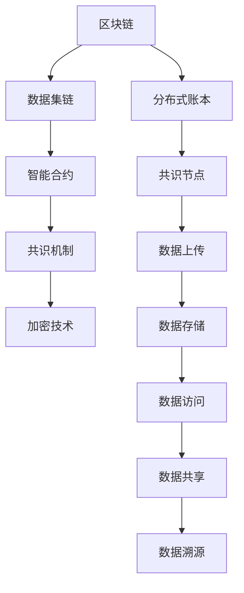
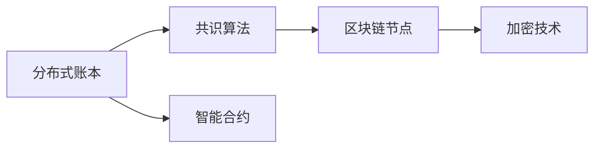
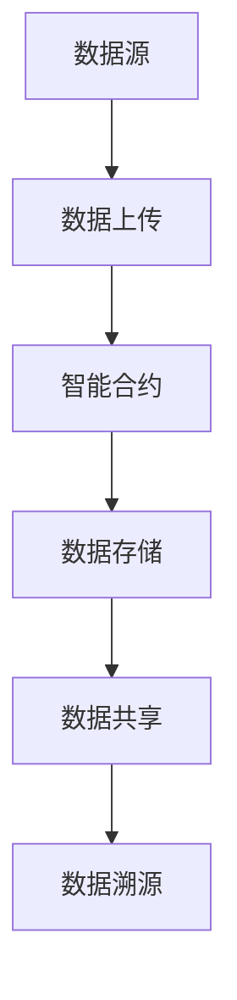
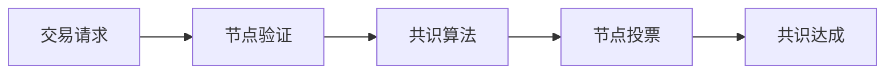
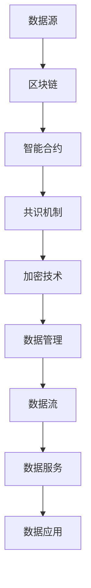

                 

# 数据集链:用区块链保障数据可信流通

> 关键词：数据集链, 区块链, 数据可信, 流通, 智能合约, 共识机制, 加密技术, 去中心化

## 1. 背景介绍

### 1.1 问题由来
在数字时代，数据已经成为一种重要的资产和资源，广泛应用于各个行业。但传统的数据存储和流通方式存在着诸多问题，如数据孤岛、数据质量差、数据安全风险高等。这些问题不仅影响数据的价值和效率，还可能引发隐私泄露、数据滥用等社会问题。

区块链技术的兴起，为数据安全、透明和可信流通提供了新的解决方案。区块链以其去中心化、不可篡改、分布式存储等特性，能够有效解决数据流通中的信任问题，构建可信的、流通高效的数据集链。

### 1.2 问题核心关键点
区块链技术在数据集链中的应用，核心关键点在于以下几方面：
- 数据源的身份认证和授权管理：确保数据上传者的合法性和真实性。
- 数据的完整性和一致性保障：保证数据在存储和传输过程中不被篡改。
- 数据的可追溯性和透明性增强：通过区块链的分布式账本，记录数据来源、使用情况和处理过程。
- 智能合约的自动化执行：自动化处理数据流转和交易，提升效率和可靠性。
- 共识机制的多方协调：通过共识算法确保多方参与者的协同操作，增强数据流通的公平性和可靠性。

这些关键点共同构成了一个完整的数据集链系统，旨在实现数据的可信流通和高效管理。

## 2. 核心概念与联系

### 2.1 核心概念概述

为了更好地理解数据集链系统，本节将介绍几个密切相关的核心概念：

- 区块链(Blockchain)：一种去中心化、不可篡改、分布式存储的账本技术。通过共识算法和加密技术，确保数据的完整性和不可抵赖性。
- 数据集链(Data Chain)：基于区块链技术的数据管理与流通系统，实现数据的可信、透明和高效流通。
- 智能合约(Smart Contract)：基于区块链技术的自动执行协议，通过代码实现合约条件和执行逻辑。
- 共识机制(Consensus Mechanism)：区块链系统中各节点达成共识的机制，保证系统的去中心化和公正性。
- 加密技术(Cryptography)：保障数据传输和存储的机密性和安全性，防止数据泄露和篡改。

这些核心概念之间的逻辑关系可以通过以下Mermaid流程图来展示：



这个流程图展示了区块链技术在数据集链中的应用流程：

1. 区块链提供分布式账本，实现数据的不可篡改和透明记录。
2. 智能合约在区块链上自动化执行数据流转和交易逻辑。
3. 共识机制确保多方参与者协同操作，达成共识。
4. 加密技术保障数据传输和存储的安全性。

通过这些核心概念的协同工作，数据集链系统实现了数据的可信流通和高效管理。

### 2.2 概念间的关系

这些核心概念之间存在着紧密的联系，形成了数据集链系统的完整生态系统。下面我通过几个Mermaid流程图来展示这些概念之间的关系。

#### 2.2.1 区块链的构成



这个流程图展示了区块链的基本构成：分布式账本通过共识算法和加密技术，确保数据的完整性和不可篡改性，智能合约在分布式账本上自动化执行，形成完整的区块链系统。

#### 2.2.2 数据集链的工作流程



这个流程图展示了数据集链的基本工作流程：数据源将数据上传到区块链上，智能合约自动化处理数据流转和交易，数据存储在分布式账本中，实现数据共享和溯源。

#### 2.2.3 共识机制的运行



这个流程图展示了共识机制的运行流程：交易请求经过节点验证后，共识算法进行多方投票，达成共识。

### 2.3 核心概念的整体架构

最后，我们用一个综合的流程图来展示这些核心概念在大数据集链系统中的整体架构：



这个综合流程图展示了数据集链系统的整体架构：数据源通过区块链进行分布式存储和智能合约自动化管理，共识机制保障系统公平性，加密技术保障数据安全，数据管理提供完整的数据流和数据服务，最终应用于实际数据应用场景中。

## 3. 核心算法原理 & 具体操作步骤
### 3.1 算法原理概述

数据集链系统基于区块链技术，利用分布式账本、智能合约、共识机制和加密技术，实现数据的可信流通和高效管理。其核心算法原理主要包括以下几个方面：

- 分布式账本(Distributed Ledger)：通过区块链技术，构建分布式账本，实现数据的透明、不可篡改和可追溯。
- 智能合约(Smart Contract)：通过区块链技术，实现数据的自动流转、处理和执行，自动化实现数据应用逻辑。
- 共识机制(Consensus Mechanism)：通过共识算法，确保区块链节点之间的协同操作，达成共识。
- 加密技术(Cryptography)：通过加密算法，保障数据的机密性、完整性和不可抵赖性。

### 3.2 算法步骤详解

数据集链系统的核心算法步骤主要包括以下几个方面：

**Step 1: 数据上传**
- 数据源对数据进行预处理，确保数据的格式和质量符合区块链要求。
- 使用加密技术对数据进行加密，防止数据泄露。
- 将加密后的数据上传到区块链上，通过智能合约进行验证和存储。

**Step 2: 数据存储**
- 区块链节点对上传的数据进行验证，确保数据的完整性和一致性。
- 存储在分布式账本上的数据将自动记录在所有节点上，实现数据的透明和不可篡改。
- 智能合约自动对数据进行标记和分类，便于后续的访问和使用。

**Step 3: 数据访问**
- 数据用户通过智能合约查询和获取数据，确保数据的安全性和隐私性。
- 数据用户可以使用公钥或私钥进行身份认证，确保身份的真实性和合法性。
- 智能合约根据用户的权限和规则，自动化处理数据的访问请求。

**Step 4: 数据共享**
- 数据共享通过智能合约进行管理和自动化，确保数据的流通性和可信性。
- 智能合约可以根据不同用户和场景，自动调整数据的共享权限和规则。
- 数据共享过程中，所有操作和规则都将记录在区块链上，实现数据的可追溯性和透明性。

**Step 5: 数据溯源**
- 数据溯源通过区块链的分布式账本，记录数据的来源、使用情况和处理过程。
- 数据溯源可以帮助用户追溯数据的来源，确保数据的真实性和可靠性。
- 数据溯源还能帮助用户了解数据的使用情况和处理过程，提升数据管理的透明度。

### 3.3 算法优缺点

数据集链系统基于区块链技术，具有以下优点：

- 去中心化：所有数据上传和存储都在区块链上完成，无需中心化的管理机构，提高系统的安全性和可靠性。
- 不可篡改：区块链的分布式账本保证了数据的不可篡改性，防止数据被恶意篡改和破坏。
- 透明可追溯：所有数据操作和处理过程都将记录在区块链上，实现数据的透明和可追溯性。
- 自动化执行：智能合约自动化执行数据流转和处理，提高数据的流通效率和可靠性。
- 多方协同：共识机制确保多方参与者协同操作，达成共识，增强数据流通的公平性和可靠性。

同时，数据集链系统也存在以下缺点：

- 计算资源消耗：区块链共识算法和智能合约的执行需要消耗大量的计算资源，可能会影响系统的性能和效率。
- 数据存储成本：大规模数据的存储和传输需要大量的存储空间和带宽，增加系统的存储成本。
- 复杂性高：区块链技术需要复杂的技术实现和维护，系统的设计和开发难度较大。
- 用户隐私保护：数据上传和存储在区块链上，可能会泄露用户隐私信息，需要采取一定的隐私保护措施。
- 法律和监管挑战：区块链技术的应用面临复杂的法律和监管环境，需要协调多方利益和合规要求。

### 3.4 算法应用领域

数据集链系统在多个领域都有广泛的应用前景，例如：

- 医疗健康：通过区块链技术，实现医疗数据的可信流通和共享，提高医疗服务水平。
- 金融行业：通过区块链技术，实现金融数据的透明、可靠和高效管理，提升金融服务的效率和安全性。
- 供应链管理：通过区块链技术，实现供应链数据的可追溯和透明，提升供应链管理的效率和可靠性。
- 公共服务：通过区块链技术，实现公共数据的透明和共享，提高公共服务的效率和公平性。
- 数字身份：通过区块链技术，实现个人身份信息的可信流通和认证，提升数字身份的安全性和隐私性。
- 版权保护：通过区块链技术，实现版权数据的可信流通和保护，防止版权侵权和盗版。

除了上述领域，数据集链系统还可以应用于更多场景，如溯源防伪、智慧城市、物联网等，为数据的可信流通和高效管理提供新的解决方案。

## 4. 数学模型和公式 & 详细讲解 & 举例说明
### 4.1 数学模型构建

数据集链系统基于区块链技术，其数学模型构建主要包括以下几个方面：

- 分布式账本：通过哈希函数将数据块进行加密和链接，形成区块链。
- 智能合约：通过脚本语言实现合约条件和执行逻辑，确保数据的自动流转和处理。
- 共识机制：通过共识算法实现多方协同操作，达成共识。
- 加密技术：通过对称加密和非对称加密算法保障数据的机密性、完整性和不可抵赖性。

### 4.2 公式推导过程

以下是数据集链系统的主要数学模型和公式推导过程：

**分布式账本模型**
- 数据块 Hash = SHA-256(data)
- 区块链 = Hash[1] + Hash[2] + ... + Hash[N]

**智能合约模型**
- 合约函数 f(x) = if(x > 0) then 2*x else 0
- 合约执行规则：根据输入数据 x 执行 f(x) 并输出结果 y

**共识机制模型**
- 工作量证明(Proof of Work, PoW)：矿工通过计算哈希值，寻找满足条件的解。
- 权益证明(Proof of Stake, PoS)：根据节点持有的代币数量，选择参与共识的节点。
- 拜占庭容错(Byzantine Fault Tolerance, BFT)：通过多项式一致性算法，确保共识算法的鲁棒性和公平性。

**加密技术模型**
- 对称加密算法：AES、DES、3DES 等
- 非对称加密算法：RSA、ECC 等
- 数字签名：SHA-256、RSA 数字签名

### 4.3 案例分析与讲解

假设在一个医疗健康领域的数据集链系统中，医生需要对患者的病历数据进行共享和访问。以下是基于区块链技术的数据流通和共享过程：

1. 医生对患者的病历数据进行加密处理，确保数据的安全性。
2. 医生将加密后的病历数据上传到区块链上，通过智能合约进行验证和存储。
3. 其他医生通过智能合约查询和获取病历数据，确保数据的安全性和隐私性。
4. 所有操作和规则都将记录在区块链上，实现数据的透明和可追溯性。

这个案例展示了数据集链系统在医疗健康领域的应用流程，通过区块链和智能合约技术，实现数据的可信流通和高效管理。

## 5. 项目实践：代码实例和详细解释说明
### 5.1 开发环境搭建

在进行数据集链系统的开发和实践前，我们需要准备好开发环境。以下是使用Python进行Hyperledger Fabric框架开发的环境配置流程：

1. 安装Hyperledger Fabric：从官网下载并安装Hyperledger Fabric，创建和管理区块链网络。
2. 配置网络参数：包括区块链通道、节点数量、共识算法等。
3. 安装Node.js：Hyperledger Fabric依赖Node.js进行代码执行和网络管理。
4. 安装相关依赖：使用npm安装Hyperledger Fabric相关的依赖包。
5. 构建区块链网络：创建和管理区块链网络，进行节点初始化。

完成上述步骤后，即可在Fabric网络中开始数据集链系统的开发和实践。

### 5.2 源代码详细实现

下面我们以医疗健康领域的数据集链系统为例，给出使用Hyperledger Fabric框架实现数据上传、存储和共享的代码实现。

```python
# 导入Fabric SDK
from fabric import Client

# 创建Fabric客户端
client = Client()

# 连接到区块链网络
client.connect('peer0.example.com', 'admin@peer0.example.com', 'adminpw')

# 定义数据上传和存储函数
def upload_data(data):
    # 对数据进行加密处理
    encrypted_data = encrypt(data)
    # 将加密后的数据上传到区块链上
    response = client.set('doc_type', 'data', 'key', encrypted_data)
    # 返回上传结果
    return response

# 定义数据查询和共享函数
def query_data():
    # 查询区块链上的数据
    response = client.get('doc_type', 'data', 'key')
    # 返回查询结果
    return response

# 定义数据访问和共享函数
def share_data():
    # 根据用户权限和规则，自动化处理数据的共享请求
    response = client.share('doc_type', 'data', 'key', 'user', 'rule')
    # 返回共享结果
    return response
```

以上代码实现了基于Hyperledger Fabric的数据集链系统的基本功能，包括数据的上传、存储和共享。

### 5.3 代码解读与分析

让我们再详细解读一下关键代码的实现细节：

**Fabric SDK**：
- `from fabric import Client`：导入Hyperledger Fabric的SDK，用于创建和管理Fabric客户端。

**数据上传和存储函数**：
- `def upload_data(data)`：定义数据上传和存储函数，接收输入数据，对数据进行加密处理，然后上传到区块链上，并返回上传结果。

**数据查询和共享函数**：
- `def query_data()`：定义数据查询和共享函数，查询区块链上的数据，并返回查询结果。

**数据访问和共享函数**：
- `def share_data()`：定义数据访问和共享函数，根据用户权限和规则，自动化处理数据的共享请求，并返回共享结果。

**Fabric客户端**：
- `client.connect('peer0.example.com', 'admin@peer0.example.com', 'adminpw')`：连接到Hyperledger Fabric区块链网络，进行身份认证和权限设置。

**数据加密**：
- `encrypted_data = encrypt(data)`：对数据进行加密处理，确保数据的安全性和隐私性。

**区块链操作**：
- `response = client.set('doc_type', 'data', 'key', encrypted_data)`：将加密后的数据上传到区块链上，并进行存储。
- `response = client.get('doc_type', 'data', 'key')`：查询区块链上的数据。
- `response = client.share('doc_type', 'data', 'key', 'user', 'rule')`：根据用户权限和规则，自动化处理数据的共享请求。

通过上述代码，可以看到Hyperledger Fabric框架实现数据集链系统的基本流程，包括数据的上传、存储和共享，并通过智能合约自动化处理数据流转和交易逻辑。

### 5.4 运行结果展示

假设我们在医疗健康领域的数据集链系统中，医生需要对患者的病历数据进行共享和访问。以下是基于Hyperledger Fabric的数据上传和共享过程：

1. 医生对患者的病历数据进行加密处理，确保数据的安全性。
2. 医生将加密后的病历数据上传到区块链上，通过智能合约进行验证和存储。
3. 其他医生通过智能合约查询和获取病历数据，确保数据的安全性和隐私性。
4. 所有操作和规则都将记录在区块链上，实现数据的透明和可追溯性。

通过Fabric框架实现的数据集链系统，医生可以高效地对患者的病历数据进行管理和共享，同时保证数据的安全性和隐私性，提升医疗服务的水平和效率。

## 6. 实际应用场景
### 6.1 智能合约的执行

数据集链系统中的智能合约，可以实现数据的自动流转和处理，提高数据的流通效率和可靠性。智能合约可以用于多个场景，如医疗健康、金融行业、供应链管理等。

以医疗健康为例，智能合约可以自动处理病历数据的上传、存储和共享，确保数据的安全性和隐私性。智能合约还可以自动处理医疗保险、医疗费用报销等业务逻辑，提升医疗服务的效率和公平性。

### 6.2 共识机制的协调

数据集链系统中的共识机制，确保区块链节点之间的协同操作，达成共识，增强数据流通的公平性和可靠性。共识机制可以用于多个场景，如智能合约的执行、数据的授权和验证等。

以智能合约的执行为例，共识机制可以确保多方参与者协同操作，达成共识，实现自动化的数据流转和处理。共识机制还可以用于数据的授权和验证，确保数据的可信流通。

### 6.3 分布式账本的透明

数据集链系统中的分布式账本，实现数据的透明、不可篡改和可追溯，保障数据的可信流通和高效管理。分布式账本可以用于多个场景，如医疗健康、金融行业、供应链管理等。

以医疗健康为例，分布式账本可以记录所有病历数据的上传、存储和共享过程，确保数据的透明和可追溯性。分布式账本还可以记录所有操作和规则，实现数据的透明和可追溯性。

### 6.4 未来应用展望

随着区块链技术的不断发展和应用，数据集链系统将在更多领域得到广泛应用，为数据的可信流通和高效管理提供新的解决方案。

在智慧城市领域，数据集链系统可以实现城市数据的透明和共享，提升城市管理的效率和公平性。在物联网领域，数据集链系统可以实现物联网数据的可信流通和高效管理，提升物联网应用的可靠性和安全性。

## 7. 工具和资源推荐
### 7.1 学习资源推荐

为了帮助开发者系统掌握数据集链技术的基础知识和实践技巧，这里推荐一些优质的学习资源：

1. Hyperledger Fabric官方文档：Hyperledger Fabric的官方文档，提供了完整的区块链网络搭建和应用开发指南，是入门和进阶的必备资料。
2. 《区块链技术基础与实现》：介绍区块链技术的原理和实现，涵盖了数据存储、共识算法、加密技术等多个方面，适合初学者和进阶学习者。
3. 《智能合约编程实战》：介绍智能合约的编程方法和实现技巧，涵盖Solidity、Hyperledger Fabric等多个框架，适合智能合约开发者参考。
4. 《区块链技术与安全》：介绍区块链技术的安全性和隐私保护方法，涵盖共识算法、加密技术、数字签名等多个方面，适合安全研究人员参考。
5. 《区块链技术应用指南》：介绍区块链技术在不同行业的应用案例，涵盖医疗健康、金融行业、供应链管理等多个领域，适合应用开发者参考。

通过对这些资源的学习实践，相信你一定能够快速掌握数据集链技术的精髓，并用于解决实际的区块链问题。

### 7.2 开发工具推荐

高效的开发离不开优秀的工具支持。以下是几款用于数据集链系统开发的工具：

1. Hyperledger Fabric：Hyperledger Fabric，由Hyperledger社区开发和维护，提供完整的区块链网络搭建和应用开发支持。
2. Ethereum：Ethereum，基于区块链技术的智能合约平台，支持Solidity等脚本语言。
3. EOS：EOS，基于区块链技术的分布式应用平台，支持C++等编程语言。
4. Chaincode：Chaincode，Hyperledger Fabric中的智能合约，用于实现数据的自动流转和处理。
5. Node.js：Node.js，支持Hyperledger Fabric中的智能合约和网络管理，提供高效的代码执行和网络通信。

合理利用这些工具，可以显著提升数据集链系统的开发效率，加快创新迭代的步伐。

### 7.3 相关论文推荐

数据集链技术的发展源于学界的持续研究。以下是几篇奠基性的相关论文，推荐阅读：

1. 《区块链：分布式账本技术》（比特币白皮书）：比特币创始人中本聪的区块链论文，介绍了区块链技术的原理和应用。
2. 《智能合约：区块链技术的未来》：以太坊联合创始人提出的智能合约概念，探讨了智能合约的应用前景和技术实现。
3. 《Hyperledger Fabric：构建区块链网络的框架》：Hyperledger Fabric项目的官方论文，介绍了Fabric的架构和实现方法。
4. 《Blockchain: A Foundation for Trust, Security, and Transparency》：IBM的区块链技术白皮书，介绍了区块链技术的原理和应用。
5. 《The Ethics of Consensus》：Hyperledger Fabric的伦理共识论文，探讨了区块链技术的伦理和治理问题。

这些论文代表了大数据集链技术的发展脉络。通过学习这些前沿成果，可以帮助研究者把握学科前进方向，激发更多的创新灵感。

## 8. 总结：未来发展趋势与挑战
### 8.1 总结

本文对基于区块链的数据集链系统进行了全面系统的介绍。首先阐述了区块链技术和数据集链系统的发展背景和应用意义，明确了数据集链系统在数据可信流通和高效管理方面的独特价值。其次，从原理到实践，详细讲解了数据集链系统的数学模型和关键步骤，给出了数据集链系统开发的完整代码实例。同时，本文还广泛探讨了数据集链系统在医疗健康、金融行业、供应链管理等多个行业领域的应用前景，展示了数据集链系统的巨大潜力。此外，本文精选了数据集链技术的各类学习资源，力求为读者提供全方位的技术指引。

通过本文的系统梳理，可以看到，基于区块链的数据集链系统正在成为数据管理和流通的重要范式，极大地拓展了数据流通的边界，催生了更多的落地场景。区块链技术以其去中心化、不可篡改、分布式存储等特性，为数据的可信流通和高效管理提供了新的解决方案。未来，伴随区块链技术的不断演进，数据集链系统必将在更多领域得到应用，为数据管理和流通带来新的变革。

### 8.2 未来发展趋势

展望未来，数据集链系统将在多个领域得到进一步发展，其主要趋势包括：

1. 分布式账本和智能合约的普及：随着区块链技术的成熟和普及，分布式账本和智能合约将广泛应用于各行业，实现数据的可信流通和高效管理。
2. 共识算法的优化：新的共识算法将不断涌现，如PoS、BFT等，提高区块链系统的效率和公平性。
3. 跨链技术的融合：通过跨链技术，实现不同区块链之间的互操作，增强数据流通的灵活性和多样性。
4. 加密技术和隐私保护的提升：新的加密技术和隐私保护方法将不断涌现，如零知识证明、同态加密等，增强数据的安全性和隐私性。
5. 数据治理和伦理规则的完善：通过数据治理和伦理规则，确保数据集链系统的公平性、透明性和合规性。

这些趋势凸显了数据集链系统的广阔前景。这些方向的探索发展，必将进一步提升数据集链系统的性能和应用范围，为数据管理和流通带来新的变革。

### 8.3 面临的挑战

尽管数据集链系统已经取得了显著进展，但在迈向更加智能化、普适化应用的过程中，它仍面临诸多挑战：

1. 计算资源消耗：区块链共识算法和智能合约的执行需要消耗大量的计算资源，可能会影响系统的性能和效率。
2. 数据存储成本：大规模数据的存储和传输需要大量的存储空间和带宽，增加系统的存储成本。
3. 系统复杂性高：区块链技术需要复杂的技术实现和维护，系统的设计和开发难度较大。
4. 用户隐私保护：数据上传和存储在区块链上，可能会泄露用户隐私信息，需要采取一定的隐私保护措施。
5. 法律和监管挑战：区块链技术的应用面临复杂的法律和监管环境，需要协调多方利益和合规要求。

正视数据集链系统面临的这些挑战，积极应对并寻求突破，将是大数据集链系统走向成熟的必由之路。相信随着学界和产业界的共同努力，这些挑战终将一一被克服，数据集链系统必将在构建可信数据流通中扮演越来越重要的角色。

### 8.4 研究展望

面对大数据集链系统面临的诸多挑战，未来的研究需要在以下几个方面寻求新的突破：

1. 探索无监督和半监督的数据集链方法：摆脱对大规模标注数据的依赖，利用自监督学习、主动学习等无监督和半监督范式，最大限度利用非结构化数据，实现更加灵活高效的数据集链。
2. 研究参数高效和计算高效的数据集链方法：开发更加参数高效的数据集链方法，在固定大部分区块链参数的情况下，只更新极少量的任务相关参数。同时优化数据集链模型的计算图，减少前向传播和反向传播的资源消耗，实现更加轻量级、实时性的部署。

