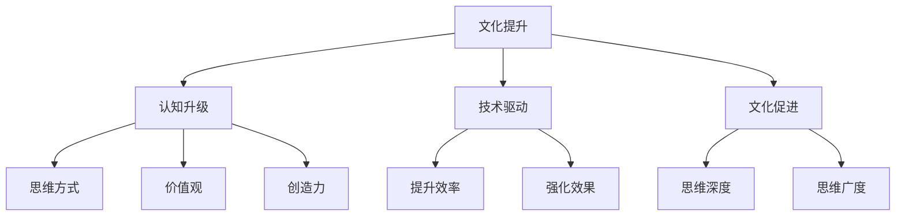
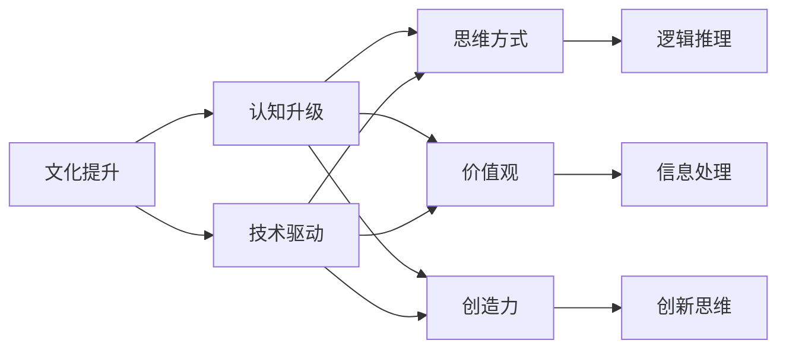
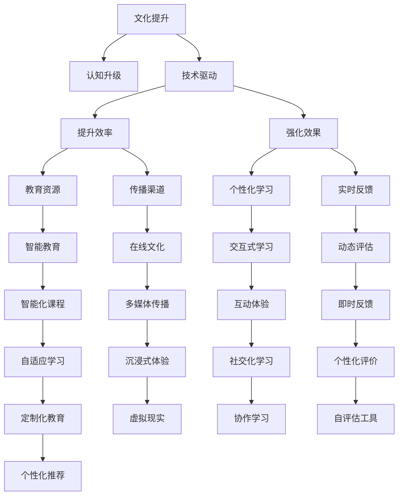
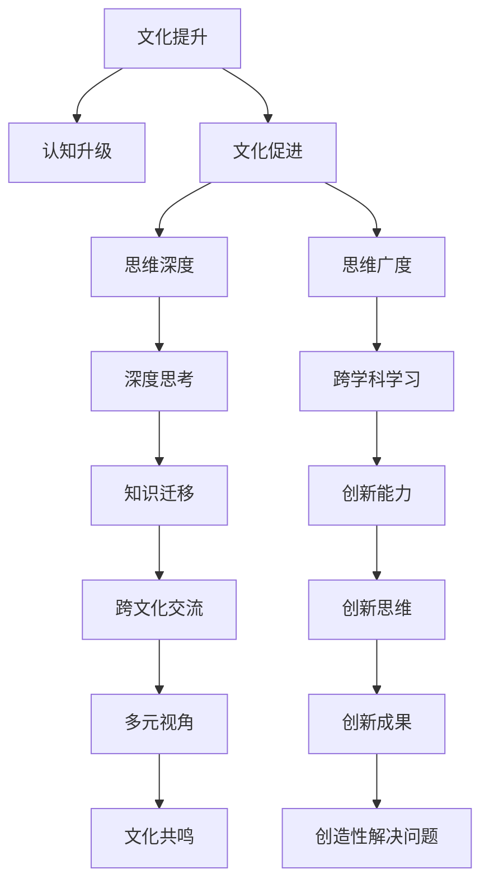

                 

# 文化提升认知：未来立足之本

> 关键词：文化提升, 认知, 未来, 人工智能, 技术, 思维模式

## 1. 背景介绍

### 1.1 问题由来
在当今信息爆炸的时代，人工智能技术的快速发展，已经深刻地影响了人们的生活和工作方式。人工智能的普及，让人们不再局限于传统的知识和技能，而是拓宽了认知的边界，开启了全新的智能时代。然而，随着技术的发展，人们也越来越认识到，文化提升在认知升级中的重要作用。文化不仅仅是知识的积累，更是思维方式、价值观和创造力的源泉。只有通过文化提升，才能真正掌握未来，实现自我价值和社会价值的双重提升。

### 1.2 问题核心关键点
文化提升和认知升级是相互促进的。一方面，文化提升能够激发人们的创造力和想象力，推动认知的深度和广度。另一方面，认知的升级也能够促进文化的传播和融合，促进社会的进步。因此，文化提升和认知升级是不可分割的。

本文将深入探讨文化提升和认知升级的关系，通过实际案例和具体技术，帮助读者更好地理解这一重要命题。

### 1.3 问题研究意义
文化提升和认知升级对于未来的发展具有深远的意义：

1. **推动社会进步**：通过文化提升和认知升级，可以激发社会的创造力和创新能力，促进知识的传播和应用，推动社会的科技进步。
2. **提升个人价值**：文化提升可以提升个人的思维方式和创造力，帮助个人在激烈竞争中脱颖而出，实现自我价值的提升。
3. **促进跨文化交流**：认知的升级可以促进不同文化之间的理解和交流，消除文化差异带来的误解和偏见，促进全球化的发展。
4. **增强文化自信**：通过文化提升，可以增强人们对自身文化的认同感和自信心，促进文化的传承和发展。

本文将从文化提升和认知升级的各个方面，全面探讨其关系和意义，为未来的技术发展和文化传承提供深刻的见解。

## 2. 核心概念与联系

### 2.1 核心概念概述

为更好地理解文化提升和认知升级的相互作用，本节将介绍几个关键概念：

- **文化提升**：通过教育、培训、艺术、科技等多种手段，提升个体的文化素养和认知水平，促进思维方式和价值观的转变。
- **认知升级**：通过技术手段，如人工智能、大数据等，提升个体的认知能力，包括逻辑推理、信息处理、创新思维等。
- **技术驱动文化提升**：利用先进技术手段，如人工智能、互联网等，推动文化提升的进程，提高文化提升的效率和效果。
- **文化促进认知升级**：通过文化教育和文化传播，提升个体的思维深度和广度，促进认知能力的全面提升。

这些概念之间的逻辑关系可以通过以下Mermaid流程图来展示：



这个流程图展示了大语言模型微调过程中各个核心概念的关系和作用：

1. 文化提升和认知升级是相互促进的关系。
2. 技术手段可以有效推动文化提升的进程。
3. 文化教育和文化传播可以显著促进认知能力的全面提升。
4. 思维方式、价值观和创造力是文化提升和认知升级的重要输出结果。

### 2.2 概念间的关系

这些核心概念之间存在着紧密的联系，形成了文化提升和认知升级的完整生态系统。下面我们通过几个Mermaid流程图来展示这些概念之间的关系。

#### 2.2.1 文化提升与认知升级的关系



这个流程图展示了文化提升与认知升级的基本关系：

1. 技术手段可以推动文化提升的进程。
2. 思维方式、价值观和创造力是文化提升和认知升级的重要输出结果。
3. 文化提升和认知升级是相互促进的关系。

#### 2.2.2 技术驱动文化提升的机制



这个流程图展示了技术手段推动文化提升的机制：

1. 技术手段可以提升文化提升的效率和效果。
2. 教育资源、传播渠道、个性化学习等都是技术手段的具体应用。
3. 交互式学习、实时反馈、自适应学习等技术手段可以进一步强化文化提升的效果。

#### 2.2.3 文化促进认知升级的路径



这个流程图展示了文化教育和文化传播促进认知升级的路径：

1. 文化教育和文化传播可以提升个体的思维深度和广度。
2. 深度思考、跨学科学习和多元视角等都是文化促进认知升级的具体路径。
3. 创新能力和创新思维是文化提升和认知升级的重要结果。

### 2.3 核心概念的整体架构

最后，我们用一个综合的流程图来展示这些核心概念在大语言模型微调过程中的整体架构：

```mermaid
graph TB
    A[文化提升] --> B[认知升级]
    A --> C[技术驱动]
    A --> D[文化促进]
    B --> E[思维方式]
    B --> F[价值观]
    B --> G[创造力]
    C --> H[提升效率]
    C --> I[强化效果]
    D --> J[思维深度]
    D --> K[思维广度]
    E --> L[逻辑推理]
    F --> M[信息处理]
    G --> N[创新思维]
    H --> O[教育资源]
    H --> P[传播渠道]
    I --> Q[个性化学习]
    I --> R[实时反馈]
    J --> S[智能教育]
    J --> T[在线文化]
    K --> U[交互式学习]
    K --> V[多媒体传播]
    L --> W[沉浸式体验]
    M --> X[社会化学习]
    N --> Y[创新成果]
    O --> Z[在线教育平台]
    P --> AA[网络文化平台]
    Q --> AB[自适应学习系统]
    R --> AC[即时反馈系统]
    S --> AD[智能化课程平台]
    T --> AE[在线课程]
    U --> AF[交互式学习平台]
    V --> AG[多媒体学习平台]
    W --> AH[虚拟现实平台]
    X --> AI[协作学习平台]
    Y --> AJ[创新成果展示平台]
    Z --> AK[个性化推荐系统]
    AA --> AL[社交化学习平台]
    AB --> AM[自评估工具]
    AC --> AN[定制化教育平台]
    AD --> AO[智能化课程]
    AE --> AP[在线文化课程]
    AF --> AQ[多媒体学习课程]
    AG --> AR[跨学科学习课程]
    AH --> AS[沉浸式体验课程]
    AI --> AT[协作学习课程]
    AJ --> AU[创新成果展示课程]
    AN --> AV[定制化教育课程]
    AO --> AW[智能化课程]
    AP --> AX[在线文化课程]
    AQ --> AY[多媒体学习课程]
    AR --> AZ[跨学科学习课程]
    AS --> BA[虚拟现实课程]
    AT --> BB[协作学习课程]
    AU --> BC[创新成果展示课程]
    AV --> BD[定制化教育课程]
    AW --> BE[智能化课程]
    AX --> BF[在线文化课程]
    AY --> BG[多媒体学习课程]
    AZ --> BH[跨学科学习课程]
    BA --> BI[虚拟现实课程]
    BB --> BJ[协作学习课程]
    BC --> BD[创新成果展示课程]
    BD --> BE[定制化教育课程]
    BE --> BF[智能化课程]
    BF --> BH[多媒体学习课程]
    BH --> BI[跨学科学习课程]
    BI --> BJ[虚拟现实课程]
    BJ --> BK[协作学习课程]
    BK --> BL[创新成果展示课程]
    BL --> BM[定制化教育课程]
    BM --> BN[智能化课程]
    BN --> BO[多媒体学习课程]
    BO --> BP[跨学科学习课程]
    BP --> BQ[虚拟现实课程]
    BQ --> BR[协作学习课程]
    BR --> BS[创新成果展示课程]
    BS --> BT[定制化教育课程]
    BT --> BU[智能化课程]
    BU --> BV[多媒体学习课程]
    BV --> BW[跨学科学习课程]
    BW --> BX[虚拟现实课程]
    BX --> BY[协作学习课程]
    BY --> BZ[创新成果展示课程]
    BZ --> CA[定制化教育课程]
    CA --> CB[智能化课程]
    CB --> CC[多媒体学习课程]
    CC --> CD[跨学科学习课程]
    CD --> CE[虚拟现实课程]
    CE --> CF[协作学习课程]
    CF --> CG[创新成果展示课程]
    CG --> CH[定制化教育课程]
    CH --> CI[智能化课程]
    CI --> CJ[多媒体学习课程]
    CJ --> CK[跨学科学习课程]
    CK --> CL[虚拟现实课程]
    CL --> CM[协作学习课程]
    CM --> CN[创新成果展示课程]
    CN --> CO[定制化教育课程]
    CO --> CP[智能化课程]
    CP --> CQ[多媒体学习课程]
    CQ --> CR[跨学科学习课程]
    CR --> CS[虚拟现实课程]
    CS --> CT[协作学习课程]
    CT --> CU[创新成果展示课程]
    CU --> CV[定制化教育课程]
    CV --> CW[智能化课程]
    CW --> CX[多媒体学习课程]
    CX --> CY[跨学科学习课程]
    CY --> CZ[虚拟现实课程]
    CZ --> DA[协作学习课程]
    DA --> DB[创新成果展示课程]
    DB --> DC[定制化教育课程]
    DC --> DD[智能化课程]
    DD --> DE[多媒体学习课程]
    DE --> DF[跨学科学习课程]
    DF --> DG[虚拟现实课程]
    DG --> DH[协作学习课程]
    DH --> DI[创新成果展示课程]
    DI --> DJ[定制化教育课程]
    DJ --> DK[智能化课程]
    DK --> DL[多媒体学习课程]
    DL --> DM[跨学科学习课程]
    DM --> DN[虚拟现实课程]
    DN --> DO[协作学习课程]
    DO --> DP[创新成果展示课程]
    DP --> DQ[定制化教育课程]
    DQ --> DR[智能化课程]
    DR --> DS[多媒体学习课程]
    DS --> DT[跨学科学习课程]
    DT --> DU[虚拟现实课程]
    DU --> DV[协作学习课程]
    DV --> DW[创新成果展示课程]
    DW --> DX[定制化教育课程]
    DX --> DY[智能化课程]
    DY --> DZ[多媒体学习课程]
    DZ --> EA[跨学科学习课程]
    EA --> EB[虚拟现实课程]
    EB --> EC[协作学习课程]
    EC --> ED[创新成果展示课程]
    ED --> EE[定制化教育课程]
    EE --> EF[智能化课程]
    EF --> EG[多媒体学习课程]
    EG --> EH[跨学科学习课程]
    EH --> EI[虚拟现实课程]
    EI --> EJ[协作学习课程]
    EJ --> EK[创新成果展示课程]
    EK --> EL[定制化教育课程]
    EL --> EM[智能化课程]
    EM --> EN[多媒体学习课程]
    EN --> EO[跨学科学习课程]
    EO --> EP[虚拟现实课程]
    EP --> EQ[协作学习课程]
    EQ --> ER[创新成果展示课程]
    ER --> ES[定制化教育课程]
    ES --> ET[智能化课程]
    ET --> EU[多媒体学习课程]
    EU --> EV[跨学科学习课程]
    EV --> EW[虚拟现实课程]
    EW --> EX[协作学习课程]
    EX --> EY[创新成果展示课程]
    EY --> EZ[定制化教育课程]
    EZ --> FA[智能化课程]
    FA --> FB[多媒体学习课程]
    FB --> FC[跨学科学习课程]
    FC --> FD[虚拟现实课程]
    FD --> FE[协作学习课程]
    FE --> FF[创新成果展示课程]
    FF --> FG[定制化教育课程]
    FG --> FH[智能化课程]
    FH --> FI[多媒体学习课程]
    FI --> FJ[跨学科学习课程]
    FJ --> FK[虚拟现实课程]
    FK --> FL[协作学习课程]
    FL --> FM[创新成果展示课程]
    FM --> FN[定制化教育课程]
    FN --> FO[智能化课程]
    FO --> FP[多媒体学习课程]
    FP --> FQ[跨学科学习课程]
    FQ --> FR[虚拟现实课程]
    FR --> FS[协作学习课程]
    FS --> FT[创新成果展示课程]
    FT --> FU[定制化教育课程]
    FU --> FV[智能化课程]
    FV --> FW[多媒体学习课程]
    FW --> FX[跨学科学习课程]
    FX --> FY[虚拟现实课程]
    FY --> FZ[协作学习课程]
    FZ --> GA[创新成果展示课程]
    GA --> GB[定制化教育课程]
    GB --> GC[智能化课程]
    GC --> GD[多媒体学习课程]
    GD --> GE[跨学科学习课程]
    GE --> GF[虚拟现实课程]
    GF --> GG[协作学习课程]
    GG --> GH[创新成果展示课程]
    GH --> GI[定制化教育课程]
    GI --> GJ[智能化课程]
    GJ --> GK[多媒体学习课程]
    GK --> GL[跨学科学习课程]
    GL --> GM[虚拟现实课程]
    GM --> GN[协作学习课程]
    GN --> GO[创新成果展示课程]
    GO --> GP[定制化教育课程]
    GP --> GQ[智能化课程]
    GQ --> GR[多媒体学习课程]
    GR --> GS[跨学科学习课程]
    GS --> GT[虚拟现实课程]
    GT --> GU[协作学习课程]
    GU --> GV[创新成果展示课程]
    GV --> GW[定制化教育课程]
    GW --> GX[智能化课程]
    GX --> GY[多媒体学习课程]
    GY --> GZ[跨学科学习课程]
    GZ --> HA[虚拟现实课程]
    HA --> HB[协作学习课程]
    HB --> HC[创新成果展示课程]
    HC --> HD[定制化教育课程]
    HD --> HE[智能化课程]
    HE --> HF[多媒体学习课程]
    HF --> HG[跨学科学习课程]
    HG --> HH[虚拟现实课程]
    HH --> HI[协作学习课程]
    HI --> HJ[创新成果展示课程]
    HJ --> HK[定制化教育课程]
    HK --> HL[智能化课程]
    HL --> HM[多媒体学习课程]
    HM --> HN[跨学科学习课程]
    HN --> HO[虚拟现实课程]
    HO --> HP[协作学习课程]
    HP --> HQ[创新成果展示课程]
    HQ --> HR[定制化教育课程]
    HR --> HS[智能化课程]
    HS --> HT[多媒体学习课程]
    HT --> HU[跨学科学习课程]
    HU --> HV[虚拟现实课程]
    HV --> HW[协作学习课程]
    HW --> HX[创新成果展示课程]
    HX --> HY[定制化教育课程]
    HY --> HZ[智能化课程]
    HZ --> IA[多媒体学习课程]
    IA --> IB[跨学科学习课程]
    IB --> IC[虚拟现实课程]
    IC --> ID[协作学习课程]
    ID --> IE[创新成果展示课程]
    IE --> IF[定制化教育课程]
    IF --> IG[智能化课程]
    IG --> IH[多媒体学习课程]
    IH --> II[跨学科学习课程]
    II --> IQ[虚拟现实课程]
    IQ --> IR[协作学习课程]
    IR --> IS[创新成果展示课程]
    IS --> IT[定制化教育课程]
    IT --> IU[智能化课程]
    IU --> IV[多媒体学习课程]
    IV --> IW[跨学科学习课程]
    IW --> IX[虚拟现实课程]
    IX --> IY[协作学习课程]
    IY --> Iz[创新成果展示课程]
    Iz --> JA[定制化教育课程]
    JA --> JB[智能化课程]
    JB --> JC[多媒体学习课程]
    JC --> JD[跨学科学习课程]
    JD --> JE[虚拟现实课程]
    JE --> JF[协作学习课程]
    JF --> JG[创新成果展示课程]
    JG --> JH[定制化教育课程]
    JH --> JI[智能化课程]
    JI --> JJ[多媒体学习课程]
    JJ --> JK[跨学科学习课程]
    JK --> JL[虚拟现实课程]
    JL --> JM[协作学习课程]
    JM --> JN[创新成果展示课程]
    JN --> JO[定制化教育课程]
    JO --> JP[智能化课程]
    JP --> JQ[多媒体学习课程]
    JQ --> JR[跨学科学习课程]
    JR --> JS[虚拟现实课程]
    JS --> JT[协作学习课程]
    JT --> JU[创新成果展示课程]
    JU --> JV[定制化教育课程]
    JV --> JW[智能化课程]
    JW --> JX[多媒体学习课程]
    JX --> JY[跨学科学习课程]
    JY --> JZ[虚拟现实课程]
    JZ --> KA[协作学习课程]
    KA --> KB[创新成果展示课程]
    KB --> KC[定制化教育课程]
    KC --> KD[智能化课程]
    KD --> KE[多媒体学习课程]
    KE --> KF[跨学科学习课程]
    KF --> KG[虚拟现实课程]
    KG --> KH[协作学习课程]
    KH --> KI[创新成果展示课程]
    KI --> KJ[定制化教育课程]
    KJ --> KK[智能化课程]
    KK --> KL[多媒体学习课程]
    KL --> KM[跨学科学习课程]
    KM --> KN[虚拟现实课程]
    KN --> KO[协作学习课程]
    KO --> KP[创新成果展示课程]
    KP --> KQ[定制化教育课程]
    KQ --> KR[智能化课程]
    KR --> KS[多媒体学习课程]
    KS --> KT[跨学科学习课程]
    KT --> KU[虚拟现实课程]
    KU --> KV[协作学习课程]
    KV --> KW[创新成果展示课程]
    KW --> KX[定制化教育课程]
    KX --> KY[智能化课程]
    KY --> KZ[多媒体学习课程]
    KZ --> LA[跨学科学习课程]
    LA --> LB[虚拟现实课程]
    LB --> LC[协作学习课程]
    LC --> LD[创新成果展示课程]
    LD --> LE[定制化教育课程]
    LE --> LF[智能化课程]
    LF --> LG[多媒体学习课程]
    LG --> LH[跨学科学习课程]
    LH --> LI[虚拟现实课程]
    LI --> LJ[协作学习课程]
    LJ --> LK[创新成果展示课程]
    LK --> LL[定制化教育课程]
    LL --> LM[智能化课程]
    LM --> LN[多媒体学习课程]
    LN --> LO[跨学科学习课程]
    LO --> LP[虚拟现实课程]
    LP --> LQ[协作学习课程]
    LQ --> LR[创新成果展示课程]
    LR --> LS[定制化教育课程]
    LS --> LT[智能化课程]
    LT --> LU[多媒体学习课程]
    LU --> LV[跨学科学习课程]
    LV --> LW[虚拟现实课程]
    LW --> LX[协作学习课程]
    LX --> LY[创新成果展示课程]
    LY --> LZ[定制化教育课程]
    LZ --> MA[智能化课程]
    MA --> MB[多媒体学习课程]
    MB --> MC[跨学科学习课程]
    MC --> MD[虚拟现实课程]
    MD --> ME[协作学习课程]
    ME --> MF[创新成果展示课程]
    MF --> MG[定制化教育课程]
    MG --> MH[智能化课程]
    MH --> MI[多媒体学习课程]
    MI --> MJ[跨学科学习课程]
    MJ --> MK[虚拟现实课程]
    MK --> ML[协作学习课程]
    ML --> MM[创新成果展示课程]
    MM --> MN[定制化教育课程]
    MN --> MO[智能化课程]
    MO --> MP[多媒体学习课程]
    MP --> MQ[跨学科学习课程]
    MQ --> MR[虚拟现实课程]
    MR --> MS[协作学习课程]
    MS --> MT[创新成果展示课程]
    MT --> MU[定制化教育课程]
    MU --> MV[智能化课程]
    MV --> MW[多媒体学习课程]
    MW --> MX[跨学科学习课程]
    MX --> MY[虚拟现实课程]
    MY --> MZ[协作学习课程]
    MZ --> NA[创新成果展示课程]
    NA --> NB[定制化教育课程]
    NB --> NC[智能化课程]
    NC --> ND[多媒体学习课程]
    ND --> NE[跨学科学习课程]
    NE --> NF[虚拟现实课程]
    NF --> NG[协作学习课程]
    NG --> NH[创新成果展示课程]
    NH --> NI[定制化教育课程]
    NI --> NJ[智能化课程]
    NJ --> NK[多媒体学习课程]
    NK --> NL[跨学科学习课程]
    NL --> NM[虚拟现实课程]
    NM --> NN[协作学习课程]
    NN --> NO[创新成果展示课程]
    NO --> NP[定制化教育课程]
    NP --> NQ[智能化课程]
    NQ --> NR[多媒体学习课程]
    NR --> NS[跨学科学习课程]
    NS --> NT[虚拟现实课程]
    NT --> NU[协作学习课程]
    NU --> NV[创新成果展示课程]
    NV --> NW[定制化教育课程]
    NW --> NX[智能化课程]
    NX --> NY[多媒体学习课程]
    NY --> NZ[跨学科学习课程]
    NZ --> OA[虚拟现实课程]
    OA --> OB[协作学习课程]
    OB --> OC[创新成果展示课程]
    OC --> OD[定制化教育课程]
    OD --> OE[智能化课程]
    OE --> OF[多媒体学习课程]
    OF --> OG[跨学科学习课程]
    OG --> OH[虚拟现实课程]
    OH --> OI[协作学习课程]
    OI --> OJ[创新成果展示课程]
    OJ --> OK[定制化教育课程]
    OK --> OL[智能化课程]
    OL --> OM[多媒体学习课程]
    OM --> ON[跨学科学习课程]
    ON --> OO[虚拟现实课程]
    OO --> OP[协作学习课程]
    OP --> OQ[创新成果展示课程]
    OQ --> OR[定制化教育课程]
    OR --> OS[智能化课程]
    OS --> OT[多媒体学习课程]
    OT --> OU[跨学科学习课程]
    OU --> OW[虚拟现实课程]
    OW --> OX[协作学习课程]
    OX --> OY[创新成果展示课程]
    OY --> OZ[定制化教育课程]
    OZ --> PA[智能化课程]
    PA --> PB[多媒体学习课程]
    PB --> PC[跨学科学习课程]
    PC --> PD[虚拟现实课程]
    PD --> PE[协作学习课程]
    PE --> PF[创新成果展示课程]
    PF --> PG[定制化教育课程]
    PG --> PH[智能化课程]
    PH --> PI[多媒体学习课程]
    PI --> PJ[跨学科学习课程]
    PJ --> PK[虚拟现实课程]
    PK --> PL[协作学习课程]
    PL --> PM[创新成果展示课程]
    PM --> PN[定制化教育课程]
    PN --> PO[智能化课程]
    PO --> PQ[多媒体学习课程]
    PQ --> PR[跨学科学习课程]
    PR --> PS[虚拟现实课程]
    PS --> PT[协作学习课程]
    PT --> PU[创新成果展示课程]
    PU --> PV[定制化教育课程]
    PV --> PW[智能化课程]
    PW --> PX[多媒体学习课程]
    PX --> PY[跨学科学习课程]
    PY --> PZ[虚拟现实课程]
    PZ --> QA[协作学习课程]
    QA --> QB[创新成果展示课程]
    QB --> QC[定制化教育课程]
    QC --> QD[智能化课程]
    QD --> QE[多媒体学习课程]
    QE --> QF[跨学科

