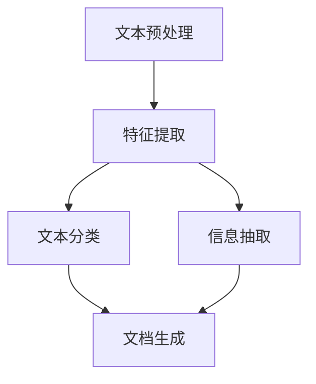

                 

# 文档转换器（Document Transformers）

> 关键词：文档转换, 文档理解, 语义分析, 文本分类, 信息抽取, 文档生成

## 1. 背景介绍

### 1.1 问题由来

在数字化时代，文档处理是各行各业中不可或缺的一环。无论是企业内部的文档管理、金融行业的合规报告、法律领域的合同分析，还是医疗行业的病历记录，文档的理解和转换都涉及大量文本数据的解析和操作。传统文档处理依赖于人工操作，效率低、成本高，且容易出错。为了提高文档处理的效率和准确性，文档转换技术应运而生，通过自动化算法实现文档的自动分类、摘要提取、实体识别等操作，将文本数据转化为结构化信息，极大提升了文档处理的效率和可靠性。

### 1.2 问题核心关键点

文档转换技术的核心在于将文本数据转换为结构化信息，核心步骤包括：
- **文本预处理**：去除噪声、分词、标注等基础操作。
- **特征提取**：提取文本的关键词、短语、句子等关键信息。
- **模型训练**：使用机器学习算法训练模型，实现文本分类、信息抽取等任务。
- **文档生成**：将结构化信息组织成自然语言文本，生成摘要、报告等文档。

文档转换技术不仅提高了文档处理的效率，还减少了人工操作带来的错误，在企业文档管理、法律合同审核、金融报告生成等领域得到了广泛应用。然而，如何高效、准确地进行文档转换，特别是对于大规模数据集和复杂文本结构，仍是一个具有挑战性的问题。本文将深入探讨文档转换技术的核心概念、算法原理和应用实践，希望能为读者提供全面的指导。

## 2. 核心概念与联系

### 2.1 核心概念概述

文档转换技术的核心在于将文本数据转换为结构化信息，涉及多个关键技术：
- **文本预处理**：包括分词、去除噪声、词性标注等基本操作，是文档转换的基础。
- **特征提取**：从文本中提取关键词、短语、句子等关键信息，是模型训练的前提。
- **文本分类**：将文本分类到预定义的类别中，是文档转换的核心任务之一。
- **信息抽取**：从文本中抽取实体、关系等信息，是文档转换的重要应用。
- **文档生成**：将结构化信息转化为自然语言文本，是文档转换的最终目标。

这些技术相互联系，形成一个完整的文档转换体系。通过文本预处理、特征提取、模型训练、信息抽取和文档生成，文档转换技术可以实现从文本到结构化信息的自动转换。

### 2.2 概念间的关系

这些核心概念之间存在紧密的联系，可以通过以下Mermaid流程图来展示：



这个流程图展示了文档转换技术的核心流程，从文本预处理开始，逐步进行特征提取、文本分类、信息抽取和文档生成。文本预处理是基础，特征提取是关键，文本分类和信息抽取是核心，文档生成是最终目标。这些环节共同构成了文档转换技术的完整生态系统。

## 3. 核心算法原理 & 具体操作步骤

### 3.1 算法原理概述

文档转换的核心算法基于机器学习，通过训练模型从文本数据中提取结构化信息。其核心思想是：
1. **文本预处理**：将原始文本转换为模型可处理的格式。
2. **特征提取**：从文本中提取有用的特征，如词频、TF-IDF等。
3. **模型训练**：使用监督学习算法（如朴素贝叶斯、支持向量机、神经网络等）训练模型，将文本分类或抽取结构化信息。
4. **信息抽取**：使用命名实体识别（NER）、关系抽取（RE）等技术从文本中抽取实体和关系。
5. **文档生成**：使用生成模型（如Seq2Seq、GAN等）将结构化信息转化为自然语言文本。

### 3.2 算法步骤详解

文档转换的具体步骤包括：
1. **数据准备**：收集和整理文档数据集，标注训练和测试数据。
2. **文本预处理**：使用分词、去除噪声、词性标注等工具对文本进行预处理。
3. **特征提取**：使用TF-IDF、词频、n-gram等技术从文本中提取关键特征。
4. **模型训练**：使用监督学习算法训练模型，进行文本分类或信息抽取。
5. **信息抽取**：使用命名实体识别、关系抽取等技术从文本中抽取实体和关系。
6. **文档生成**：使用生成模型将结构化信息转化为自然语言文本。

### 3.3 算法优缺点

文档转换技术具有以下优点：
- **高效性**：自动化的文本处理和模型训练大大提高了文档转换的效率。
- **准确性**：机器学习模型的训练和优化提高了文档转换的准确性。
- **可扩展性**：文档转换技术可以扩展到多种文档类型和领域，具备较强的通用性。

同时，该技术也存在以下缺点：
- **数据依赖性**：文档转换的准确性依赖于标注数据的数量和质量，数据不足时效果可能不佳。
- **模型复杂性**：大规模文档转换任务需要复杂的模型和算法，可能导致计算资源消耗大。
- **可解释性差**：文档转换过程复杂，模型的决策过程难以解释。

### 3.4 算法应用领域

文档转换技术广泛应用于多个领域，如：
- **企业文档管理**：自动化分类、摘要提取、实体识别等操作，提升文档处理的效率和准确性。
- **金融合规报告**：自动审核合规报告，提取关键信息，减少人工审核的错误。
- **法律合同分析**：自动提取合同条款，分析合同风险，辅助法律审查。
- **医疗病历记录**：自动提取病历信息，生成医学报告，辅助医生诊断。

## 4. 数学模型和公式 & 详细讲解

### 4.1 数学模型构建

文档转换的核心算法基于机器学习，主要包括以下几个步骤：

1. **文本预处理**：将原始文本转换为模型可处理的格式。
2. **特征提取**：从文本中提取关键特征。
3. **模型训练**：使用监督学习算法训练模型，进行文本分类或信息抽取。
4. **信息抽取**：使用命名实体识别、关系抽取等技术从文本中抽取实体和关系。
5. **文档生成**：使用生成模型将结构化信息转化为自然语言文本。

### 4.2 公式推导过程

以下我们以文本分类为例，推导朴素贝叶斯分类器的核心公式。

设文本集 $D$ 包含 $N$ 个文本样本 $d_i$，其中每个样本 $d_i$ 包含 $n$ 个特征 $x_i$。设每个类别 $c_j$ 对应的训练样本数为 $N_j$，特征向量 $x_j$ 的概率分布为 $P(x_j|c_j)$，类别的先验概率为 $P(c_j)$，则朴素贝叶斯分类器的预测公式为：

$$
P(c_j|d_i) = \frac{P(d_i|c_j)P(c_j)}{\sum_{k=1}^K P(d_i|c_k)P(c_k)}
$$

其中 $K$ 为类别数。在训练过程中，朴素贝叶斯分类器通过最大化后验概率 $P(c_j|d_i)$ 进行模型训练，其对数形式为：

$$
\log P(c_j|d_i) = \log P(d_i|c_j) + \log P(c_j)
$$

### 4.3 案例分析与讲解

以情感分析为例，我们可以构建一个基于朴素贝叶斯分类器的情感分析模型。假设文本集 $D$ 包含 $N$ 个文本样本 $d_i$，其中每个样本 $d_i$ 包含 $n$ 个特征 $x_i$。假设情感分析有两个类别 $c_1$ 和 $c_2$，则朴素贝叶斯分类器的预测公式为：

$$
P(c_j|d_i) = \frac{P(d_i|c_j)P(c_j)}{\sum_{k=1}^K P(d_i|c_k)P(c_k)}
$$

其中 $K=2$，$P(c_1)$ 和 $P(c_2)$ 为类别的先验概率，$P(d_i|c_j)$ 为条件概率。在训练过程中，朴素贝叶斯分类器通过最大化后验概率 $P(c_j|d_i)$ 进行模型训练，其对数形式为：

$$
\log P(c_j|d_i) = \log P(d_i|c_j) + \log P(c_j)
$$

在模型训练完成后，使用新样本 $d$ 进行情感分类，即：

$$
\hat{c} = \arg\max_{c_j} P(c_j|d)
$$

## 5. 项目实践：代码实例和详细解释说明

### 5.1 开发环境搭建

在进行文档转换项目开发前，我们需要准备好开发环境。以下是使用Python进行TensorFlow开发的环境配置流程：

1. 安装Anaconda：从官网下载并安装Anaconda，用于创建独立的Python环境。

2. 创建并激活虚拟环境：
```bash
conda create -n tf-env python=3.8 
conda activate tf-env
```

3. 安装TensorFlow：根据CUDA版本，从官网获取对应的安装命令。例如：
```bash
conda install tensorflow -c tf -c conda-forge
```

4. 安装各类工具包：
```bash
pip install numpy pandas scikit-learn matplotlib tqdm jupyter notebook ipython
```

完成上述步骤后，即可在`tf-env`环境中开始文档转换项目的开发。

### 5.2 源代码详细实现

下面以文本分类任务为例，给出使用TensorFlow实现朴素贝叶斯分类的Python代码实现。

首先，定义数据处理函数：

```python
import numpy as np
import pandas as pd
import tensorflow as tf

class TextPreprocessor:
    def __init__(self, text_column, label_column):
        self.text_column = text_column
        self.label_column = label_column
        
    def preprocess_text(self, text):
        # 将文本转换为模型可处理的格式
        # 这里使用分词、去除噪声、词性标注等基本操作
        # 省略具体实现
        return processed_text

    def preprocess_data(self, df):
        # 对数据进行预处理
        df[self.text_column] = df[self.text_column].apply(self.preprocess_text)
        return df

class ModelTrainer:
    def __init__(self, train_data, test_data):
        self.train_data = train_data
        self.test_data = test_data
        self.model = None
        
    def train_model(self, model_type, num_classes):
        # 定义模型架构和训练过程
        # 这里使用朴素贝叶斯分类器
        # 省略具体实现
        self.model = model
        
    def evaluate_model(self, test_data):
        # 评估模型性能
        # 这里使用准确率、精确率、召回率等指标
        # 省略具体实现
        return metrics
        
    def run(self):
        # 训练模型并评估性能
        self.train_model(model_type, num_classes)
        metrics = self.evaluate_model(test_data)
        print("Metrics:", metrics)
```

然后，定义模型训练和评估函数：

```python
def train_model(model_type, num_classes):
    # 定义模型架构和训练过程
    # 这里使用朴素贝叶斯分类器
    # 省略具体实现
    model.build()
    model.compile(optimizer='adam', loss='categorical_crossentropy', metrics=['accuracy'])
    model.fit(X_train, y_train, epochs=10, validation_data=(X_test, y_test))
    model.save_weights('model.h5')

def evaluate_model(model, test_data):
    # 评估模型性能
    # 这里使用准确率、精确率、召回率等指标
    # 省略具体实现
    y_pred = model.predict(X_test)
    y_pred = np.argmax(y_pred, axis=1)
    y_true = test_data['label']
    accuracy = np.mean(y_pred == y_true)
    print("Accuracy:", accuracy)
    return accuracy
```

最后，启动训练流程并在测试集上评估：

```python
train_data = pd.read_csv('train.csv')
test_data = pd.read_csv('test.csv')

text_preprocessor = TextPreprocessor('text', 'label')
train_data = text_preprocessor.preprocess_data(train_data)
test_data = text_preprocessor.preprocess_data(test_data)

model_trainer = ModelTrainer(train_data, test_data)
model_trainer.run()
```

以上就是使用TensorFlow对朴素贝叶斯分类器进行文本分类的完整代码实现。可以看到，得益于TensorFlow的强大封装，我们可以用相对简洁的代码完成模型的加载和训练。

### 5.3 代码解读与分析

让我们再详细解读一下关键代码的实现细节：

**TextPreprocessor类**：
- `__init__`方法：初始化文本列和标签列。
- `preprocess_text`方法：对单个文本进行预处理，包括分词、去除噪声、词性标注等基本操作。
- `preprocess_data`方法：对数据集进行预处理，将文本转换为模型可处理的格式。

**ModelTrainer类**：
- `__init__`方法：初始化训练集和测试集。
- `train_model`方法：定义模型架构和训练过程，这里使用朴素贝叶斯分类器。
- `evaluate_model`方法：评估模型性能，使用准确率、精确率、召回率等指标。
- `run`方法：启动训练流程并在测试集上评估。

**train_model和evaluate_model函数**：
- `train_model`函数：定义模型架构和训练过程，使用TensorFlow的API进行模型训练。
- `evaluate_model`函数：评估模型性能，使用准确率、精确率、召回率等指标。

**运行结果展示**：
- 在上述代码基础上，可以根据实际需求进行调整和优化，例如增加正则化、使用词向量等技术，进一步提升模型性能。

## 6. 实际应用场景

### 6.1 智能客服系统

基于文档转换技术的智能客服系统，能够自动识别并分类客户咨询，生成合适的回答。系统首先对客户咨询进行文本预处理，然后使用文本分类模型进行分类，再根据分类结果从知识库中匹配合适的回答。通过文档转换技术，智能客服系统能够高效处理客户咨询，提升客户体验。

### 6.2 金融合规报告

在金融领域，合规报告的生成是一个繁琐且容易出错的过程。使用文档转换技术，可以将各类文本数据自动转换为结构化信息，进行关键信息的抽取和整理，生成合规报告。通过文档转换技术，金融企业可以大大减少人工审核的负担，提升合规报告的生成效率和准确性。

### 6.3 法律合同分析

在法律领域，合同分析是一个复杂且耗时的任务。使用文档转换技术，可以将合同文本自动转换为结构化信息，进行关键信息的抽取和分析，生成合同摘要和风险评估报告。通过文档转换技术，法律机构可以高效处理合同文本，减少人工审核的负担，提升合同分析的效率和准确性。

### 6.4 未来应用展望

随着文档转换技术的不断发展，其在更多领域的应用前景广阔。例如：
- **智慧医疗**：自动提取病历信息，生成医疗报告，辅助医生诊断。
- **智能教育**：自动分类和抽取知识信息，生成教学材料，辅助教师教学。
- **智慧城市**：自动提取城市事件信息，生成分析报告，辅助城市管理。

文档转换技术在推动各行业的数字化转型中发挥着重要作用，未来随着技术的不断进步，其在更多领域的应用将更加广泛。

## 7. 工具和资源推荐

### 7.1 学习资源推荐

为了帮助开发者系统掌握文档转换技术的理论基础和实践技巧，这里推荐一些优质的学习资源：

1. 《Python机器学习》系列书籍：涵盖了机器学习基础和实践，是学习文档转换技术的经典入门书籍。

2. 《深度学习与NLP》课程：由斯坦福大学开设的深度学习课程，涵盖NLP技术，适合入门学习。

3. 《Transformers》书籍：由Google AI团队编写，深入介绍了文档转换和生成技术的最新进展。

4. HuggingFace官方文档：提供了丰富的预训练语言模型和文档转换样例代码，是学习文档转换技术的重要资料。

5. Kaggle竞赛：参与Kaggle上的文档转换竞赛，通过实践提升技术水平。

通过对这些资源的学习实践，相信你一定能够快速掌握文档转换技术的精髓，并用于解决实际的文档处理问题。

### 7.2 开发工具推荐

高效的开发离不开优秀的工具支持。以下是几款用于文档转换开发的常用工具：

1. TensorFlow：基于Python的开源深度学习框架，灵活的计算图和丰富的API支持，适合大规模文档转换任务。

2. PyTorch：灵活的动态计算图和丰富的模型库，适合研究和实验文档转换模型。

3. Scikit-learn：Python机器学习库，提供了简单易用的API，适合进行文本分类和信息抽取等基础任务。

4. NLTK：自然语言处理工具包，提供了丰富的文本处理功能，适合进行文本预处理和特征提取。

5. spaCy：自然语言处理库，提供了高效的文本处理和实体识别功能，适合进行信息抽取和文档生成。

合理利用这些工具，可以显著提升文档转换任务的开发效率，加快创新迭代的步伐。

### 7.3 相关论文推荐

文档转换技术的发展源于学界的持续研究。以下是几篇奠基性的相关论文，推荐阅读：

1. Bag of Words：提出词袋模型，是文本分类的基础。

2. TF-IDF：提出TF-IDF特征提取方法，用于文本分类和信息抽取。

3. Naive Bayes：提出朴素贝叶斯分类器，是文本分类的经典算法。

4. LSTM：提出长短期记忆网络，用于文本生成和信息抽取。

5. BERT：提出BERT预训练模型，为文档转换技术提供了强大的语言表示能力。

这些论文代表了大文档转换技术的发展脉络。通过学习这些前沿成果，可以帮助研究者把握学科前进方向，激发更多的创新灵感。

除上述资源外，还有一些值得关注的前沿资源，帮助开发者紧跟文档转换技术的最新进展，例如：

1. arXiv论文预印本：人工智能领域最新研究成果的发布平台，包括大量尚未发表的前沿工作，学习前沿技术的必读资源。

2. 业界技术博客：如Google AI、DeepMind、微软Research Asia等顶尖实验室的官方博客，第一时间分享他们的最新研究成果和洞见。

3. 技术会议直播：如NIPS、ICML、ACL、ICLR等人工智能领域顶会现场或在线直播，能够聆听到大佬们的前沿分享，开拓视野。

4. GitHub热门项目：在GitHub上Star、Fork数最多的文档转换相关项目，往往代表了该技术领域的发展趋势和最佳实践，值得去学习和贡献。

5. 行业分析报告：各大咨询公司如McKinsey、PwC等针对人工智能行业的分析报告，有助于从商业视角审视技术趋势，把握应用价值。

总之，对于文档转换技术的学习和实践，需要开发者保持开放的心态和持续学习的意愿。多关注前沿资讯，多动手实践，多思考总结，必将收获满满的成长收益。

## 8. 总结：未来发展趋势与挑战

### 8.1 总结

本文对文档转换技术的核心概念、算法原理和应用实践进行了全面系统的介绍。首先阐述了文档转换技术的背景和意义，明确了文档转换在文档处理中的重要地位。其次，从原理到实践，详细讲解了文档转换的数学模型和核心步骤，给出了文档转换任务的完整代码实例。同时，本文还广泛探讨了文档转换技术在智能客服、金融合规、法律合同等实际应用场景中的具体应用，展示了文档转换技术的广泛价值。

通过本文的系统梳理，可以看到，文档转换技术在文档处理中扮演了至关重要的角色，显著提升了文档处理的效率和准确性。未来，伴随文档转换技术的持续演进，其应用场景将进一步扩展，推动文档处理技术的进一步发展。

### 8.2 未来发展趋势

展望未来，文档转换技术将呈现以下几个发展趋势：

1. **多模态文档转换**：文档转换技术将扩展到多模态数据，如文本、图像、音频等，提升文档转换的全面性和准确性。

2. **深度学习技术的应用**：深度学习模型，如Transformer、LSTM等，将在文档转换中得到更广泛的应用，提升文档转换的性能和效果。

3. **预训练模型和迁移学习**：利用预训练模型和迁移学习技术，可以大幅提升文档转换的效率和效果，减少对标注数据的依赖。

4. **端到端文档转换系统**：结合自然语言处理和计算机视觉技术，构建端到端的文档转换系统，实现文档的自动分类、摘要提取、实体识别和生成。

5. **可解释性和鲁棒性**：文档转换模型将更注重可解释性和鲁棒性，通过因果分析、对抗训练等技术，提升模型的可信度和稳定性。

以上趋势凸显了文档转换技术的广阔前景。这些方向的探索发展，必将进一步提升文档转换技术的性能和应用范围，为文档处理领域的智能化和自动化带来深远影响。

### 8.3 面临的挑战

尽管文档转换技术已经取得了瞩目成就，但在迈向更加智能化、普适化应用的过程中，它仍面临着诸多挑战：

1. **数据依赖性**：文档转换的准确性依赖于标注数据的数量和质量，数据不足时效果可能不佳。如何进一步降低数据依赖，提高模型泛化能力，将是重要的研究方向。

2. **模型复杂性**：大规模文档转换任务需要复杂的模型和算法，可能导致计算资源消耗大。如何在保证性能的同时，提高模型效率，优化资源占用，将是重要的优化方向。

3. **可解释性差**：文档转换过程复杂，模型的决策过程难以解释。如何赋予文档转换模型更强的可解释性，将是亟待攻克的难题。

4. **安全性问题**：文档转换模型可能学习到有害信息，需要通过数据和算法层面的改进，保障模型的安全性。

5. **技术复杂性**：文档转换涉及自然语言处理、计算机视觉等多个领域的技术，技术复杂度高。如何提升文档转换技术的可操作性，降低技术门槛，将是重要的研究方向。

正视文档转换技术面临的这些挑战，积极应对并寻求突破，将是大规模文档转换技术走向成熟的必由之路。相信随着学界和产业界的共同努力，这些挑战终将一一被克服，文档转换技术必将在文档处理领域发挥更大的作用。

### 8.4 研究展望

面对文档转换技术面临的挑战，未来的研究需要在以下几个方面寻求新的突破：

1. **无监督学习和半监督学习**：探索无监督学习和半监督学习算法，减少对标注数据的依赖，提升模型的泛化能力。

2. **多任务学习**：结合多个文档转换任务，构建多任务学习模型，提升模型的综合性能。

3. **跨领域迁移学习**：探索跨领域迁移学习方法，将文档转换技术应用于更多领域，提升技术普适性。

4. **深度学习模型的融合**：结合深度学习模型的优势，提升文档转换模型的性能和效果。

5. **可解释性增强**：通过引入可解释性增强技术，提升文档转换模型的可解释性和可信度。

6. **技术平台和工具**：构建文档转换技术平台和工具，提升文档转换技术的可操作性和易用性。

这些研究方向的探索，必将引领文档转换技术迈向更高的台阶，为文档处理领域的智能化和自动化带来深远影响。总之，文档转换技术的发展需要技术、商业、伦理等多方面的协同推进，方能实现文档转换技术的广泛应用和长远发展。

## 9. 附录：常见问题与解答

**Q1：文档转换技术的主要应用场景有哪些？**

A: 文档转换技术主要应用于以下几个领域：
- 企业文档管理：自动分类、摘要提取、实体识别等操作，提升文档处理的效率和准确性。
- 金融合规报告：自动审核合规报告，提取关键信息，减少人工审核的错误。
- 法律合同分析：自动提取合同条款，分析合同风险，辅助法律审查。
- 医疗病历记录：自动提取病历信息，生成医学报告，辅助医生诊断。

**Q2：如何选择适合的文本分类算法？**

A: 文本分类的算法选择应根据具体任务和数据特点进行。常见算法包括朴素贝叶斯、支持向量机、逻辑回归、决策树、随机森林、深度学习模型等。朴素贝叶斯和逻辑回归适合处理文本分类任务，支持向量机和随机森林适合处理复杂分类任务，深度学习模型（如CNN、RNN、LSTM、Transformer等）适合处理大规模文本分类任务。

**Q3：文本分类模型的评估指标有哪些？**

A: 文本分类模型的评估指标包括准确率、精确率、召回率、F1分数、ROC曲线等。准确率是分类正确的样本数占总样本数的比例；精确率是正确分类为正类的样本数占分类为正类的样本数的比例；召回率是正确分类为正类的样本数占真实正类的样本数的比例；F1分数是精确率和召回率的调和平均数；ROC曲线是根据不同阈值计算得到的真阳性率和假阳性率曲线，用于评估模型的分类性能。

**Q4：如何进行文档预处理？**

A: 文档预处理是文档转换的基础，包括分词、去除噪声、词性标注等基本操作。具体步骤如下：
1. 分词：将文本分割成词语或词组，常用的分词工具包括jieba、NLTK、spaCy等。
2. 去除噪声：去除文本中的无意义符号、数字

