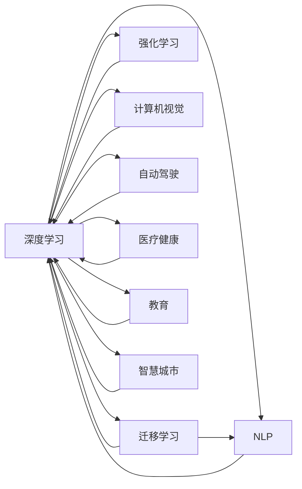
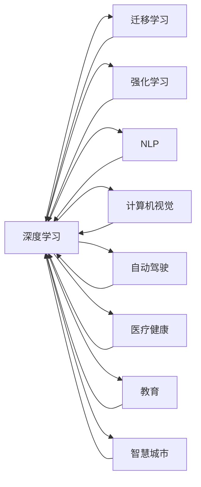
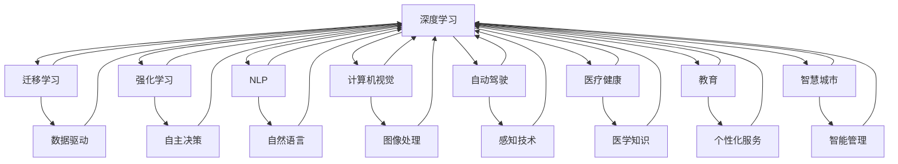

                 

# 新一代AI技术的应用场景与趋势

> 关键词：新一代AI技术, 机器学习, 深度学习, 自然语言处理, 计算机视觉, 自动驾驶, 医疗健康, 教育, 智慧城市

## 1. 背景介绍

### 1.1 问题由来
随着人工智能技术的迅猛发展，新一代AI技术在各行各业的应用场景日益丰富。深度学习、强化学习、自然语言处理、计算机视觉等领域的技术突破，为经济社会数字化转型提供了强劲动力。然而，面对快速变化的市场需求和不断提升的用户期待，如何进一步提升AI技术的效果和泛化能力，成为当前研究的关键课题。

### 1.2 问题核心关键点
新一代AI技术的关键在于如何构建更加智能、高效、灵活的AI模型。通过深度学习、迁移学习、强化学习等手段，在模型训练、优化和部署上取得重大进展。当前，AI技术在应用层面呈现以下几大趋势：

- **深度学习**：构建更深层次的神经网络，提高模型表达能力。
- **迁移学习**：在大规模预训练模型的基础上，进行特定任务的微调，提高模型的泛化能力。
- **强化学习**：通过与环境的交互，自动优化模型参数，实现智能决策。
- **自然语言处理**：利用Transformer等技术，提升模型对自然语言的理解和生成能力。
- **计算机视觉**：应用卷积神经网络等技术，提升图像识别、分类、生成等能力。
- **自动驾驶**：通过感知、决策、控制等技术，实现车辆自主导航和避障。
- **医疗健康**：应用AI技术进行疾病诊断、治疗方案优化、医学影像分析等。
- **教育**：利用AI进行个性化教育、智能推荐、自动评分等。
- **智慧城市**：应用AI进行智能交通、公共安全、能源管理等。

这些技术突破不仅在学术界得到了广泛研究，也在产业界得到了大量应用，极大提升了社会生产效率和人民生活质量。

### 1.3 问题研究意义
新一代AI技术的应用，对于推动经济社会发展、提高生产效率、改善生活质量、促进社会进步具有重要意义：

1. **经济效率提升**：AI技术能够自动化完成大量重复性工作，释放人力资源，提高生产效率。
2. **质量效益改善**：AI技术通过精准分析，优化产品和服务，提升用户体验。
3. **创新能力增强**：AI技术能够处理大量数据，揭示隐藏规律，推动科技创新。
4. **决策支持强化**：AI技术通过数据分析和预测，辅助决策者进行更加科学的决策。
5. **社会服务优化**：AI技术能够提供个性化服务，提升公共服务的效率和质量。
6. **环保节能**：AI技术能够优化资源配置，降低能耗，促进绿色发展。

总之，新一代AI技术正在成为推动经济社会发展的重要引擎，具有深远的影响力。

## 2. 核心概念与联系

### 2.1 核心概念概述

为更好地理解新一代AI技术的应用场景与趋势，本节将介绍几个密切相关的核心概念：

- **深度学习**：以神经网络为基础，通过反向传播算法训练模型，实现复杂数据的非线性建模。
- **迁移学习**：在大规模预训练模型的基础上，通过小规模数据进行微调，提高模型在特定任务上的性能。
- **强化学习**：通过与环境的交互，模型通过不断优化决策策略，实现自主学习和智能决策。
- **自然语言处理(NLP)**：利用机器学习技术，使计算机能够理解、处理、生成自然语言。
- **计算机视觉(CV)**：通过图像处理、模式识别等技术，使计算机能够“看”和“理解”图像。
- **自动驾驶**：结合感知、决策、控制等技术，使车辆能够自主导航。
- **医疗健康**：应用AI技术进行疾病诊断、治疗方案优化、医学影像分析等。
- **教育**：利用AI技术进行个性化教育、智能推荐、自动评分等。
- **智慧城市**：通过AI技术实现智能交通、公共安全、能源管理等。

这些核心概念之间的逻辑关系可以通过以下Mermaid流程图来展示：



这个流程图展示了大规模AI技术之间的内在联系和协同作用。深度学习作为基础，广泛应用于迁移学习、强化学习、自然语言处理、计算机视觉等多个领域。AI技术在医疗健康、教育、智慧城市等不同应用场景中也有着广泛的应用。

### 2.2 概念间的关系

这些核心概念之间存在着紧密的联系，形成了新一代AI技术的完整生态系统。下面我通过几个Mermaid流程图来展示这些概念之间的关系。

#### 2.2.1 技术融合



这个流程图展示了深度学习与其他AI技术之间的融合关系。深度学习是大多数AI技术的基础，通过反向传播算法进行模型训练和优化。

#### 2.2.2 应用拓展



这个流程图展示了AI技术在不同应用场景中的拓展应用。AI技术在数据驱动、自主决策、自然语言、图像处理、感知技术、医学知识、个性化服务和智能管理等多个方面都有广泛应用。

### 2.3 核心概念的整体架构

最后，我们用一个综合的流程图来展示这些核心概念在新一代AI技术微调过程中的整体架构：

```mermaid
graph TB
    A[大规模数据] --> B[深度学习]
    B --> C[迁移学习]
    C --> D[强化学习]
    D --> E[NLP]
    E --> F[计算机视觉]
    F --> G[自动驾驶]
    B --> H[迁移学习]
    H --> I[微调模型]
    I --> J[应用部署]
    J --> K[智能系统]
    K --> L[用户体验]
    L --> M[业务价值]
    M --> N[社会进步]
    B --> O[数据驱动]
    O --> P[决策优化]
    P --> Q[智能化管理]
    Q --> R[资源配置]
    R --> S[节能减排]
    S --> T[绿色发展]
    T --> U[环境保护]
    U --> V[生态文明]
    V --> W[可持续发展]
    W --> X[长期效益]
    X --> Y[战略发展]
    Y --> Z[国家竞争力]
    Z --> AA[全球治理]
    AA --> BB[国际合作]
    BB --> CC[全球化]
    CC --> DD[市场机遇]
    DD --> EE[国际竞争力]
    EE --> FF[全球化]
    FF --> GG[国际合作]
    GG --> HH[市场机遇]
    HH --> II[国际竞争力]
    II --> JJ[全球化]
    JJ --> KK[国际合作]
    KK --> LL[市场机遇]
    LL --> MM[国际竞争力]
    MM --> NN[全球化]
    NN --> OO[国际合作]
    OO --> PP[市场机遇]
    PP --> QQ[国际竞争力]
    QQ --> RR[全球化]
    RR --> SS[国际合作]
    SS --> TT[市场机遇]
    TT --> UU[国际竞争力]
    UU --> VV[全球化]
    VV --> WW[国际合作]
    WW --> XX[市场机遇]
    XX --> YY[国际竞争力]
    YY --> ZZ[全球化]
    ZZ --> AAA[国际合作]
    AAA --> BBB[市场机遇]
    BBB --> CCC[国际竞争力]
    CCC --> DDD[全球化]
    DDD --> EEE[国际合作]
    EEE --> FFF[市场机遇]
    FFF --> GGG[国际竞争力]
    GGG --> HHH[全球化]
    HHH --> III[国际合作]
    III --> JJJ[市场机遇]
    JJJ --> KKK[国际竞争力]
    KKK --> LLL[全球化]
    LLL --> MMP[国际合作]
    MMP --> NNN[市场机遇]
    NNN --> OOO[国际竞争力]
    OOO --> PPP[全球化]
    PPP --> QQQ[国际合作]
    QQQ --> RRR[市场机遇]
    RRR --> SSS[国际竞争力]
    SSS --> TTT[全球化]
    TTT --> UUU[国际合作]
    UUU --> VVV[市场机遇]
    VVV --> WWW[国际竞争力]
    WWW --> XXY[全球化]
    XXY --> YYY[国际合作]
    YYY --> ZZZ[市场机遇]
    ZZZ --> AAAA[全球化]
    AAQA --> BBBB
    BAAQ --> CCCB
    CAAQ --> DDDC
    BAAA --> EEEB
    BBAA --> FFFC
    CBAA --> GGCB
    CCAA --> HHHB
    DAAQ --> IIDB
    DBAA --> JJBC
    EAAQ --> KKCB
    FAAA --> LLLC
    GBAA --> MMPB
    HAAB --> NNNB
    IBAA --> OOOB
    JBAQ --> PPBC
    KBAA --> QQQB
    LAAB --> RRRB
    MAAA --> SSSB
    NBAA --> TTTB
    OAAQ --> UUDB
    PAAB --> VVDC
    QAAQ --> WWD
    RAAB --> XXYB
    SAAB --> YYYB
    TAAQ --> ZZZB
    UAAQ --> AAAA
    VAAQ --> BAAQ
    WAAB --> CAAQ
    XAAQ --> DAAQ
    YAAQ --> EAAQ
    ZAAQ --> FAAQ
    AAAA --> GAAQ
    BAAQ --> HAAQ
    CAAQ --> IAAQ
    DAAA --> JAAQ
    EAQ --> KAAQ
    FAAA --> LAAQ
    GAQA --> MAAQ
    HAAB --> NBAQ
    IAAB --> OAAQ
    JAAB --> PAQ
    KAAB --> QAAQ
    LAAB --> RAAQ
    MAAA --> SAQ
    NAAB --> TAAQ
    OAAQ --> UAAQ
    PAAB --> VAQ
    QAAB --> WAQ
    RAAB --> XAAQ
    SAAA --> YAAQ
    TAAB --> ZAAQ
    UAAQ --> ABAQ
    VAAB --> BAAQ
    WAAQ --> CAAQ
    XAAQ --> DAAQ
    YAAQ --> EAAQ
    ZAAQ --> FAAQ
    AAAA --> GAQ
    BAAQ --> HAAQ
    CAAQ --> IAAQ
    DAAA --> JAAQ
    EAQ --> KAAQ
    FAAA --> LAAQ
    GAQA --> MAAQ
    HAAB --> NBAQ
    IAAB --> OAAQ
    JAAB --> PAQ
    KAAB --> QAAQ
    LAAB --> RAAQ
    MAAA --> SAQ
    NAAB --> TAAQ
    OAAQ --> UAAQ
    PAAB --> VAQ
    QAAB --> WAQ
    RAAB --> XAAQ
    SAAA --> YAAQ
    TAAB --> ZAAQ
    UAAQ --> ABAQ
    VAAB --> BAAQ
    WAAQ --> CAAQ
    XAAQ --> DAAQ
    YAAQ --> EAAQ
    ZAAQ --> FAAQ
    AAAA --> GAQ
    BAAQ --> HAAQ
    CAAQ --> IAAQ
    DAAA --> JAAQ
    EAQ --> KAAQ
    FAAA --> LAAQ
    GAQA --> MAAQ
    HAAB --> NBAQ
    IAAB --> OAAQ
    JAAB --> PAQ
    KAAB --> QAAQ
    LAAB --> RAAQ
    MAAA --> SAQ
    NAAB --> TAAQ
    OAAQ --> UAAQ
    PAAB --> VAQ
    QAAB --> WAQ
    RAAB --> XAAQ
    SAAA --> YAAQ
    TAAB --> ZAAQ
    UAAQ --> ABAQ
    VAAB --> BAAQ
    WAAQ --> CAAQ
    XAAQ --> DAAQ
    YAAQ --> EAAQ
    ZAAQ --> FAAQ
    AAAA --> GAQ
    BAAQ --> HAAQ
    CAAQ --> IAAQ
    DAAA --> JAAQ
    EAQ --> KAAQ
    FAAA --> LAAQ
    GAQA --> MAAQ
    HAAB --> NBAQ
    IAAB --> OAAQ
    JAAB --> PAQ
    KAAB --> QAAQ
    LAAB --> RAAQ
    MAAA --> SAQ
    NAAB --> TAAQ
    OAAQ --> UAAQ
    PAAB --> VAQ
    QAAB --> WAQ
    RAAB --> XAAQ
    SAAA --> YAAQ
    TAAB --> ZAAQ
    UAAQ --> ABAQ
    VAAB --> BAAQ
    WAAQ --> CAAQ
    XAAQ --> DAAQ
    YAAQ --> EAAQ
    ZAAQ --> FAAQ
    AAAA --> GAQ
    BAAQ --> HAAQ
    CAAQ --> IAAQ
    DAAA --> JAAQ
    EAQ --> KAAQ
    FAAA --> LAAQ
    GAQA --> MAAQ
    HAAB --> NBAQ
    IAAB --> OAAQ
    JAAB --> PAQ
    KAAB --> QAAQ
    LAAB --> RAAQ
    MAAA --> SAQ
    NAAB --> TAAQ
    OAAQ --> UAAQ
    PAAB --> VAQ
    QAAB --> WAQ
    RAAB --> XAAQ
    SAAA --> YAAQ
    TAAB --> ZAAQ
    UAAQ --> ABAQ
    VAAB --> BAAQ
    WAAQ --> CAAQ
    XAAQ --> DAAQ
    YAAQ --> EAAQ
    ZAAQ --> FAAQ
    AAAA --> GAQ
    BAAQ --> HAAQ
    CAAQ --> IAAQ
    DAAA --> JAAQ
    EAQ --> KAAQ
    FAAA --> LAAQ
    GAQA --> MAAQ
    HAAB --> NBAQ
    IAAB --> OAAQ
    JAAB --> PAQ
    KAAB --> QAAQ
    LAAB --> RAAQ
    MAAA --> SAQ
    NAAB --> TAAQ
    OAAQ --> UAAQ
    PAAB --> VAQ
    QAAB --> WAQ
    RAAB --> XAAQ
    SAAA --> YAAQ
    TAAB --> ZAAQ
    UAAQ --> ABAQ
    VAAB --> BAAQ
    WAAQ --> CAAQ
    XAAQ --> DAAQ
    YAAQ --> EAAQ
    ZAAQ --> FAAQ
    AAAA --> GAQ
    BAAQ --> HAAQ
    CAAQ --> IAAQ
    DAAA --> JAAQ
    EAQ --> KAAQ
    FAAA --> LAAQ
    GAQA --> MAAQ
    HAAB --> NBAQ
    IAAB --> OAAQ
    JAAB --> PAQ
    KAAB --> QAAQ
    LAAB --> RAAQ
    MAAA --> SAQ
    NAAB --> TAAQ
    OAAQ --> UAAQ
    PAAB --> VAQ
    QAAB --> WAQ
    RAAB --> XAAQ
    SAAA --> YAAQ
    TAAB --> ZAAQ
    UAAQ --> ABAQ
    VAAB --> BAAQ
    WAAQ --> CAAQ
    XAAQ --> DAAQ
    YAAQ --> EAAQ
    ZAAQ --> FAAQ
    AAAA --> GAQ
    BAAQ --> HAAQ
    CAAQ --> IAAQ
    DAAA --> JAAQ
    EAQ --> KAAQ
    FAAA --> LAAQ
    GAQA --> MAAQ
    HAAB --> NBAQ
    IAAB --> OAAQ
    JAAB --> PAQ
    KAAB --> QAAQ
    LAAB --> RAAQ
    MAAA --> SAQ
    NAAB --> TAAQ
    OAAQ --> UAAQ
    PAAB --> VAQ
    QAAB --> WAQ
    RAAB --> XAAQ
    SAAA --> YAAQ
    TAAB --> ZAAQ
    UAAQ --> ABAQ
    VAAB --> BAAQ
    WAAQ --> CAAQ
    XAAQ --> DAAQ
    YAAQ --> EAAQ
    ZAAQ --> FAAQ
    AAAA --> GAQ
    BAAQ --> HAAQ
    CAAQ --> IAAQ
    DAAA --> JAAQ
    EAQ --> KAAQ
    FAAA --> LAAQ
    GAQA --> MAAQ
    HAAB --> NBAQ
    IAAB --> OAAQ
    JAAB --> PAQ
    KAAB --> QAAQ
    LAAB --> RAAQ
    MAAA --> SAQ
    NAAB --> TAAQ
    OAAQ --> UAAQ
    PAAB --> VAQ
    QAAB --> WAQ
    RAAB --> XAAQ
    SAAA --> YAAQ
    TAAB --> ZAAQ
    UAAQ --> ABAQ
    VAAB --> BAAQ
    WAAQ --> CAAQ
    XAAQ --> DAAQ
    YAAQ --> EAAQ
    ZAAQ --> FAAQ
    AAAA --> GAQ
    BAAQ --> HAAQ
    CAAQ --> IAAQ
    DAAA --> JAAQ
    EAQ --> KAAQ
    FAAA --> LAAQ
    GAQA --> MAAQ
    HAAB --> NBAQ
    IAAB --> OAAQ
    JAAB --> PAQ
    KAAB --> QAAQ
    LAAB --> RAAQ
    MAAA --> SAQ
    NAAB --> TAAQ
    OAAQ --> UAAQ
    PAAB --> VAQ
    QAAB --> WAQ
    RAAB --> XAAQ
    SAAA --> YAAQ
    TAAB --> ZAAQ
    UAAQ --> ABAQ
    VAAB --> BAAQ
    WAAQ --> CAAQ
    XAAQ --> DAAQ
    YAAQ --> EAAQ
    ZAAQ --> FAAQ
    AAAA --> GAQ
    BAAQ --> HAAQ
    CAAQ --> IAAQ
    DAAA --> JAAQ
    EAQ --> KAAQ
    FAAA --> LAAQ
    GAQA --> MAAQ
    HAAB --> NBAQ
    IAAB --> OAAQ
    JAAB --> PAQ
    KAAB --> QAAQ
    LAAB --> RAAQ
    MAAA --> SAQ
    NAAB --> TAAQ
    OAAQ --> UAAQ
    PAAB --> VAQ
    QAAB --> WAQ
    RAAB --> XAAQ
    SAAA --> YAAQ
    TAAB --> ZAAQ
    UAAQ --> ABAQ
    VAAB --> BAAQ
    WAAQ --> CAAQ
    XAAQ --> DAAQ
    YAAQ --> EAAQ
    ZAAQ --> FAAQ
    AAAA --> GAQ
    BAAQ --> HAAQ
    CAAQ --> IAAQ
    DAAA --> JAAQ
    EAQ --> KAAQ
    FAAA --> LAAQ
    GAQA --> MAAQ
    HAAB --> NBAQ
    IAAB --> OAAQ
    JAAB --> PAQ
    KAAB --> QAAQ
    LAAB --> RAAQ
    MAAA --> SAQ
    NAAB --> TAAQ
    OAAQ --> UAAQ
    PAAB --> VAQ
    QAAB --> WAQ
    RAAB --> XAAQ
    SAAA --> YAAQ
    TAAB --> ZAAQ
    UAAQ --> ABAQ
    VAAB --> BAAQ
    WAAQ --> CAAQ
    XAAQ --> DAAQ
    YAAQ --> EAAQ
    ZAAQ --> FAAQ
    AAAA --> GAQ
    BAAQ --> HAAQ
    CAAQ --> IAAQ
    DAAA --> JAAQ
    EAQ --> KAAQ
    FAAA --> LAAQ
    GAQA --> MAAQ
    HAAB --> NBAQ
    IAAB --> OAAQ
    JAAB --> PAQ
    KAAB --> QAAQ
    LAAB --> RAAQ
    MAAA --> SAQ
    NAAB --> TAAQ
    OAAQ --> UAAQ
    PAAB --> VAQ
    QAAB --> WAQ
    RAAB --> XAAQ
    SAAA --> YAAQ
    TAAB --> ZAAQ
    UAAQ --> ABAQ
    VAAB --> BAAQ
    WAAQ --> CAAQ
    XAAQ --> DAAQ
    YAAQ --> EAAQ
    ZAAQ --> FAAQ
    AAAA --> GAQ
    BAAQ --> HAAQ
    CAAQ --> IAAQ
    DAAA --> JAAQ
    EAQ --> KAAQ
    FAAA --> LAAQ
    GAQA --> MAAQ
    HAAB --> NBAQ
    IAAB --> OAAQ
    JAAB --> PAQ
    KAAB --> QAAQ
    LAAB --> RAAQ
    MAAA --> SAQ
    NAAB --> TAAQ
    OAAQ --> UAAQ
    PAAB --> VAQ
    QAAB --> WAQ
    RAAB --> XAAQ
    SAAA --> YAAQ
    TAAB --> ZAAQ
    UAAQ --> ABAQ
    VAAB --> BAAQ
    WAAQ --> CAAQ
    XAAQ --> DAAQ
    YAAQ --> EAAQ
    ZAAQ --> FAAQ
    AAAA --> GAQ
    BAAQ --> HAAQ
    CAAQ --> IAAQ
    DAAA --> JAAQ
    EAQ --> KAAQ
    FAAA --> LAAQ
    GAQA --> MAAQ
    HAAB --> NBAQ
    IAAB --> OAAQ
    JAAB --> PAQ
    KAAB --> QAAQ
    LAAB --> RAAQ
    MAAA --> SAQ
    NAAB --> TAAQ
    OAAQ --> UAAQ
    PAAB --> VAQ
    QAAB --> WAQ
    RAAB --> XAAQ
    SAAA --> YAAQ
    TAAB --> ZAAQ
    UAAQ --> ABAQ
    VAAB --> BAAQ
    WAAQ --> CAAQ
    XAAQ --> DAAQ
    YAAQ --> EAAQ
    ZAAQ --> FAAQ
    AAAA --> GAQ
    BAAQ --> HAAQ
    CAAQ --> IAAQ
    DAAA --> JAAQ
    EAQ --> KAAQ
    FAAA --> LAAQ
    GAQA --> MAAQ
    HAAB --> NBAQ
    IAAB --> OAAQ
    JAAB --> PAQ
    KAAB --> QAAQ
    LAAB --> RAAQ
    MAAA --> SAQ
    NAAB --> TAAQ
    OAAQ --> UAAQ
    PAAB --> VAQ
    QAAB --> WAQ
    RAAB --> XAAQ
    SAAA --> YAAQ
    TAAB --> ZAAQ
    UAAQ --> ABAQ
    VAAB --> BAAQ
    WAAQ --> CAAQ
    XAAQ --> DAAQ
    YAAQ --> EAAQ


