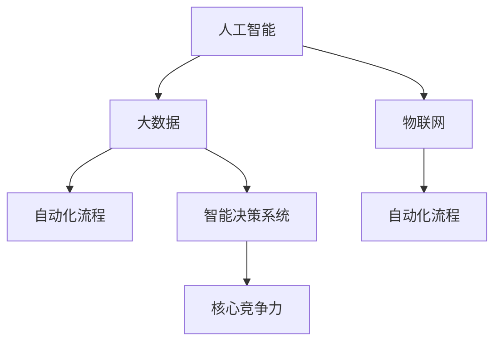
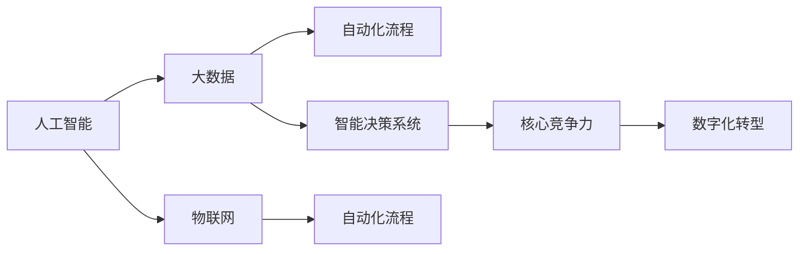

                 

# 新质生产力与核心竞争力提升

> 关键词：
- 新质生产力
- 人工智能
- 核心竞争力
- 数字化转型
- 自动化流程
- 数据驱动决策
- 智能决策系统

## 1. 背景介绍

### 1.1 问题由来
随着全球经济形态从工业经济向数字经济转型，数字化成为驱动经济增长的关键因素。企业纷纷投资于数字化基础设施和智能化升级，希望通过新技术赋能业务，提升运营效率和市场竞争力。在这个背景下，新质生产力（New Quality Productivity）的概念应运而生。

新质生产力是指基于人工智能、大数据、物联网等先进技术，融合知识与经验，实现业务流程自动化、智能化，从而推动企业核心竞争力提升的新型生产方式。

### 1.2 问题核心关键点
新质生产力的核心在于通过智能化手段，提升业务运营的质量和效率。其关键点包括：
- **技术融合**：将先进的人工智能技术，如深度学习、自然语言处理、计算机视觉等，融入业务流程，实现智能决策与自动化处理。
- **数据驱动**：依托大数据技术，收集、分析和应用海量数据，驱动决策制定与过程优化。
- **流程再造**：通过重新设计业务流程，优化资源配置，提高生产效率。
- **用户体验**：提升客户和员工的用户体验，增强企业品牌影响力。
- **创新能力**：培养创新文化，推动企业向更加智能化的方向发展。

### 1.3 问题研究意义
新质生产力的研究对于推动企业数字化转型，提升企业核心竞争力具有重要意义：
- **降低运营成本**：通过自动化和智能化，减少人力成本，提升资源利用效率。
- **提高决策质量**：利用智能决策系统，提供准确及时的分析结果，优化决策过程。
- **增强市场适应性**：快速响应市场变化，灵活调整业务策略。
- **促进业务创新**：通过智能化手段，推动产品创新和业务模式创新。
- **赋能产业升级**：为传统行业数字化转型提供技术支持和解决方案。

## 2. 核心概念与联系

### 2.1 核心概念概述

要深入理解新质生产力，需先明确几个关键概念：

- **人工智能（AI）**：利用机器学习、深度学习等技术，让计算机具备类人智能。
- **大数据（Big Data）**：通过分析海量数据，挖掘隐藏在其中的知识和模式。
- **物联网（IoT）**：连接万物，实现设备和数据的实时交互和控制。
- **自动化流程（Automation Processes）**：通过技术手段，自动执行业务流程，减少人为干预。
- **智能决策系统（Intelligent Decision System）**：结合人工智能和大数据，自动分析和制定决策方案。
- **核心竞争力（Core Competence）**：企业独有的、不易被复制的优势和能力。

这些概念通过技术融合和应用，构成了新质生产力的主要框架。以下是一个简化的Mermaid流程图，展示了这些概念之间的联系：



这个流程图展示了人工智能、大数据、物联网技术如何通过自动化流程和智能决策系统，共同提升企业核心竞争力。

### 2.2 概念间的关系

这些核心概念之间存在着紧密的联系，共同构成了新质生产力的完整生态系统。通过进一步的Mermaid流程图，我们可以更清晰地理解这些概念的关系：



这个流程图展示了从人工智能、大数据到智能决策系统，再到自动化流程和核心竞争力，最终实现数字化转型的全链路。

## 3. 核心算法原理 & 具体操作步骤

### 3.1 算法原理概述

新质生产力的实现，涉及多种算法的融合与应用。其核心算法原理包括：

- **机器学习与深度学习**：利用历史数据训练模型，预测未来趋势。
- **自然语言处理（NLP）**：通过文本分析和理解，提取有用信息。
- **计算机视觉（CV）**：分析图像和视频数据，实现自动化检测和识别。
- **强化学习**：通过试错训练，优化决策策略。
- **优化算法**：如遗传算法、蚁群算法等，用于问题求解和系统优化。

这些算法在业务流程中的应用，通过数据驱动和智能决策，提升整体运营效率和质量。

### 3.2 算法步骤详解

新质生产力的实施步骤如下：

1. **需求分析**：明确企业需要提升的核心业务流程，确定自动化与智能化的目标。
2. **数据收集与预处理**：收集相关数据，进行清洗、标注和整理。
3. **模型训练与验证**：选择合适算法，训练模型并进行验证。
4. **系统集成与部署**：将模型集成到业务系统中，实现自动化和智能化功能。
5. **监控与优化**：持续监控系统运行状态，根据反馈进行优化。
6. **效果评估与迭代**：评估系统效果，根据业务需求进行迭代改进。

### 3.3 算法优缺点

新质生产力的算法具有以下优点：
- **自动化程度高**：能够自动完成大量重复性任务，减少人为错误。
- **决策准确性高**：基于数据和模型分析，提供准确的决策建议。
- **灵活性强**：能够快速适应业务变化，优化流程和资源配置。

同时，也存在一些缺点：
- **数据依赖性强**：依赖于高质量、大量数据，数据不足时可能效果不佳。
- **技术门槛高**：需要专业知识进行模型训练和系统集成。
- **成本投入高**：初期建设成本较大，维护和优化需要持续投入。

### 3.4 算法应用领域

新质生产力的算法广泛应用于各个行业，以下是几个典型应用领域：

- **制造业**：通过自动化流水线、智能仓储等技术，提升生产效率和产品质量。
- **金融业**：利用算法进行风险评估、信用评分、智能投顾等，优化金融服务。
- **医疗健康**：通过AI辅助诊断、智能治疗方案推荐等，提升医疗服务质量。
- **零售业**：通过智能推荐、供应链优化等，提升客户体验和运营效率。
- **物流行业**：通过智能调度、路径优化等，提升物流配送效率。

## 4. 数学模型和公式 & 详细讲解 & 举例说明

### 4.1 数学模型构建

新质生产力的实施，依赖于多种数学模型的构建。以智能推荐系统为例，其数学模型可以简化为以下几个部分：

1. **用户兴趣建模**：利用协同过滤、聚类等算法，建立用户兴趣模型。
2. **商品属性分析**：通过词袋模型、TF-IDF等，提取商品属性特征。
3. **推荐算法设计**：设计推荐算法，如协同过滤、基于矩阵分解的推荐、基于深度学习的推荐等。

### 4.2 公式推导过程

以协同过滤算法为例，其基本思想是通过相似用户和相似商品之间的评分数据，预测新用户的评分。公式如下：

$$
\hat{r}_{ui} = \frac{1}{1 + \exp(-\theta^T (r_{ui} - \bar{r}_u)}
$$

其中，$r_{ui}$ 为用户 $u$ 对商品 $i$ 的实际评分，$\bar{r}_u$ 为用户 $u$ 的平均评分，$\theta$ 为模型参数。

### 4.3 案例分析与讲解

假设某电商平台希望通过智能推荐提升用户转化率。他们收集了用户和商品的评分数据，使用协同过滤算法构建推荐模型。具体步骤如下：

1. **数据预处理**：清洗数据，去除无效和噪声数据。
2. **用户建模**：利用聚类算法，将用户分为若干兴趣群体。
3. **商品建模**：通过TF-IDF提取商品属性，构建商品特征向量。
4. **模型训练**：使用协同过滤算法，训练推荐模型。
5. **推荐实现**：根据用户兴趣和商品特征，生成推荐列表。
6. **效果评估**：通过A/B测试等方法，评估推荐效果。

## 5. 项目实践：代码实例和详细解释说明

### 5.1 开发环境搭建

在进行新质生产力项目的开发前，需准备好开发环境。以下是使用Python进行PyTorch开发的环境配置流程：

1. 安装Anaconda：从官网下载并安装Anaconda，用于创建独立的Python环境。

2. 创建并激活虚拟环境：
```bash
conda create -n pytorch-env python=3.8 
conda activate pytorch-env
```

3. 安装PyTorch：根据CUDA版本，从官网获取对应的安装命令。例如：
```bash
conda install pytorch torchvision torchaudio cudatoolkit=11.1 -c pytorch -c conda-forge
```

4. 安装TensorFlow：使用pip安装TensorFlow：
```bash
pip install tensorflow
```

5. 安装各类工具包：
```bash
pip install numpy pandas scikit-learn matplotlib tqdm jupyter notebook ipython
```

完成上述步骤后，即可在`pytorch-env`环境中开始新质生产力的项目实践。

### 5.2 源代码详细实现

下面我们以智能推荐系统为例，给出使用TensorFlow进行推荐系统开发的PyTorch代码实现。

首先，定义推荐系统的数据处理函数：

```python
import tensorflow as tf
from tensorflow.keras.layers import Input, Embedding, Dot, Dense, Activation
from tensorflow.keras.models import Model

def prepare_data():
    # 准备用户评分数据和商品属性数据
    # 将数据转换为TensorFlow Dataset对象
    train_dataset = tf.data.Dataset.from_tensor_slices(train_data)
    test_dataset = tf.data.Dataset.from_tensor_slices(test_data)

    return train_dataset, test_dataset
```

然后，定义推荐模型的架构：

```python
def build_model(input_dim, output_dim):
    # 输入层
    user_input = Input(shape=(1,))
    item_input = Input(shape=(1,))

    # 用户嵌入层
    user_embeddings = Embedding(input_dim, 16, name='user_embeddings')(user_input)
    user_encoded = Dense(16, activation='relu')(user_embeddings)

    # 商品嵌入层
    item_embeddings = Embedding(input_dim, 16, name='item_embeddings')(item_input)
    item_encoded = Dense(16, activation='relu')(item_embeddings)

    # 点积层
    dot_product = Dot(axes=(1, 1))([user_encoded, item_encoded])

    # 全连接层
    prediction = Dense(output_dim, activation='sigmoid')(dot_product)

    # 模型
    model = Model(inputs=[user_input, item_input], outputs=prediction)

    return model
```

接着，定义训练和评估函数：

```python
def train_model(model, train_dataset, test_dataset, epochs=10, batch_size=32):
    # 编译模型
    model.compile(optimizer='adam', loss='binary_crossentropy', metrics=['accuracy'])

    # 训练模型
    model.fit(train_dataset, epochs=epochs, batch_size=batch_size, validation_data=test_dataset)

    # 评估模型
    model.evaluate(test_dataset)
```

最后，启动训练流程：

```python
# 加载数据集
train_dataset, test_dataset = prepare_data()

# 构建模型
model = build_model(input_dim=100, output_dim=1)

# 训练模型
train_model(model, train_dataset, test_dataset, epochs=10, batch_size=32)
```

以上就是使用TensorFlow进行智能推荐系统开发的完整代码实现。可以看到，TensorFlow通过Keras API提供了简便易用的模型构建和训练工具，大大降低了开发者入门的门槛。

### 5.3 代码解读与分析

让我们再详细解读一下关键代码的实现细节：

**prepare_data函数**：
- 数据预处理：清洗数据，去除无效和噪声数据。
- 数据转换：将数据转换为TensorFlow Dataset对象，方便模型训练和推理。

**build_model函数**：
- 定义输入层，用户和商品分别使用嵌入层进行特征编码。
- 使用全连接层和激活函数，进行用户和商品的特征提取。
- 通过点积层计算用户和商品的相似度，得到预测值。
- 定义模型并返回。

**train_model函数**：
- 编译模型，选择优化器和损失函数。
- 训练模型，使用训练集进行模型拟合。
- 评估模型，使用测试集进行模型验证。

**训练流程**：
- 加载数据集
- 构建模型
- 训练模型

## 6. 实际应用场景

### 6.1 智能客服系统

新质生产力在智能客服系统中的应用，可以极大地提升客户服务质量，降低运营成本。通过收集用户的历史对话记录和行为数据，使用机器学习算法训练智能客服模型，可以自动回答常见问题，提供个性化服务。

具体而言，智能客服系统可以实现以下几个功能：
- **自动答复**：根据用户输入，自动生成回答，提高响应速度。
- **知识库更新**：通过用户反馈，不断更新知识库，提升服务质量。
- **情感分析**：分析用户情绪，调整服务策略，提升用户体验。
- **多渠道服务**：支持语音、文字等多种服务形式，提供全方位服务。

### 6.2 金融风险管理

新质生产力在金融风险管理中的应用，可以实时监控和评估金融市场的风险，提高风险管理效率和精度。通过收集市场数据和交易记录，使用深度学习算法训练风险预测模型，可以预测市场波动，识别异常交易，及时预警。

具体而言，金融风险管理系统可以实现以下几个功能：
- **市场监测**：实时监控市场动态，分析市场趋势。
- **交易监控**：实时监控交易行为，识别异常交易。
- **风险预警**：根据风险模型，生成预警信息，及时采取应对措施。
- **策略优化**：根据市场变化，优化投资策略，提升收益。

### 6.3 物流配送优化

新质生产力在物流配送中的应用，可以大幅提升配送效率，降低配送成本。通过收集物流数据和配送路径，使用算法优化配送策略，可以优化配送路线，提高配送速度。

具体而言，物流配送管理系统可以实现以下几个功能：
- **路线规划**：根据配送需求和路况，优化配送路线。
- **车辆调度**：根据配送需求和车辆状态，调度最优车辆。
- **库存管理**：根据配送需求，优化库存管理，降低库存成本。
- **订单跟踪**：实时跟踪配送进度，提高配送透明度。

### 6.4 未来应用展望

随着新质生产力的不断发展和应用，未来的应用场景将更加广泛，涉及更多行业。以下列举几个可能的未来应用场景：

- **智慧城市**：通过智能监控和数据分析，优化城市管理，提升城市运行效率。
- **智能制造**：通过智能制造系统，提升生产效率和产品质量，降低生产成本。
- **智能农业**：通过智能农业系统，优化农作物的种植和收割，提高农业生产效率。
- **智能医疗**：通过智能医疗系统，提升医疗诊断和治疗效率，降低医疗成本。
- **智能教育**：通过智能教育系统，提供个性化学习方案，提升教育质量。

## 7. 工具和资源推荐

### 7.1 学习资源推荐

为了帮助开发者系统掌握新质生产力的相关知识，这里推荐一些优质的学习资源：

1. **《深度学习》课程**：斯坦福大学开设的深度学习课程，讲解深度学习的基本概念和算法。
2. **TensorFlow官方文档**：TensorFlow的官方文档，提供详细的API文档和教程，适合初学者和进阶者学习。
3. **《机器学习实战》书籍**：讲解机器学习算法和应用，适合有一定编程基础的读者学习。
4. **Kaggle竞赛**：参加Kaggle的机器学习竞赛，通过实战提升算法应用能力。
5. **GitHub开源项目**：参与开源项目，学习实际应用案例，积累实战经验。

通过对这些资源的学习实践，相信你一定能够快速掌握新质生产力的精髓，并用于解决实际的业务问题。

### 7.2 开发工具推荐

高效的开发离不开优秀的工具支持。以下是几款用于新质生产力开发的常用工具：

1. **PyTorch**：基于Python的开源深度学习框架，灵活的计算图设计，适合快速迭代研究。
2. **TensorFlow**：Google开发的开源深度学习框架，易于部署和扩展，适合大规模工程应用。
3. **Keras**：高层API，简化深度学习模型的构建过程，适合初学者和应用开发者。
4. **Jupyter Notebook**：强大的交互式笔记本，支持代码编写和实时可视化，适合数据科学和机器学习开发。
5. **Scikit-learn**：开源机器学习库，提供丰富的算法和工具，适合数据分析和模型训练。

合理利用这些工具，可以显著提升新质生产力的开发效率，加快创新迭代的步伐。

### 7.3 相关论文推荐

新质生产力的发展源于学界的持续研究。以下是几篇奠基性的相关论文，推荐阅读：

1. **《深度学习》书籍**：由深度学习领域的知名学者撰写，讲解深度学习的原理和应用。
2. **《机器学习》书籍**：由机器学习领域的知名学者撰写，讲解机器学习算法和应用。
3. **《强化学习》书籍**：讲解强化学习算法和应用，适合理解智能决策系统的原理。
4. **《大数据技术与应用》书籍**：讲解大数据技术和应用，适合理解数据驱动决策的原理。

这些论文代表了大数据和人工智能领域的最新进展，阅读这些文献可以帮助你深入理解新质生产力的理论基础和应用实践。

除上述资源外，还有一些值得关注的前沿资源，帮助开发者紧跟新质生产力的最新进展，例如：

1. **arXiv论文预印本**：人工智能领域最新研究成果的发布平台，包括大量尚未发表的前沿工作，学习前沿技术的必读资源。
2. **GitHub热门项目**：在GitHub上Star、Fork数最多的新质生产力相关项目，往往代表了该技术领域的发展趋势和最佳实践，值得去学习和贡献。
3. **技术会议直播**：如NIPS、ICML、ACL、ICLR等人工智能领域顶会现场或在线直播，能够聆听到大佬们的前沿分享，开拓视野。

4. **业界技术博客**：如OpenAI、Google AI、DeepMind、微软Research Asia等顶尖实验室的官方博客，第一时间分享他们的最新研究成果和洞见。

## 8. 总结：未来发展趋势与挑战

### 8.1 总结

本文对新质生产力的相关概念、原理和实施方法进行了全面系统的介绍。首先，我们明确了新质生产力的研究背景和意义，理解了其提升企业核心竞争力的重要价值。其次，通过详细的算法介绍和实际案例，展示了新质生产力的数学模型和操作步骤。最后，我们探讨了新质生产力的应用场景，提供了丰富的学习资源和开发工具推荐。

通过本文的系统梳理，可以看到，新质生产力正成为推动企业数字化转型和智能化升级的关键力量。其通过人工智能、大数据、物联网等先进技术，实现业务流程自动化、智能化，从而提升整体运营效率和质量。未来，随着新质生产力的不断发展和应用，其将在更多行业领域展现其巨大潜力，为数字化经济的蓬勃发展提供强大动力。

### 8.2 未来发展趋势

展望未来，新质生产力的发展趋势包括：

1. **技术融合**：随着多种先进技术的融合，新质生产力将实现更高效的业务流程和更准确的决策支持。
2. **数据质量提升**：高质量数据的应用将大大提升新质生产力的效果，促进企业数字化转型的成功。
3. **算法优化**：新算法和新模型的出现，将进一步提高新质生产力的性能和精度。
4. **行业应用深化**：新质生产力将在更多行业领域实现应用，推动企业业务模式创新和升级。
5. **跨界合作**：跨行业合作和跨领域知识融合，将促进新质生产力的快速发展。

### 8.3 面临的挑战

尽管新质生产力在推动企业数字化转型方面具有巨大潜力，但在实施过程中，也面临一些挑战：

1. **技术门槛高**：新质生产力涉及多种先进技术，需要较高的技术门槛和专业知识。
2. **数据获取难**：高质量数据的获取成本较高，且数据隐私和安全问题也需要解决。
3. **资源投入大**：初期建设成本较高，需要持续投入维护和优化。
4. **业务对接难**：新质生产力需要在业务系统中进行集成和应用，涉及业务流程和IT系统的改造。
5. **人才匮乏**：需要跨学科的高素质人才，但相关人才较为稀缺。

### 8.4 研究展望

面对新质生产力实施过程中面临的挑战，未来的研究需要在以下几个方面寻求新的突破：

1. **数据治理和隐私保护**：建立完善的数据治理体系，保障数据质量和隐私安全。
2. **模型优化和解释**：研究更高效的模型优化算法和模型解释方法，提高算法的可解释性和可信度。
3. **跨领域知识融合**：探索如何将跨领域的知识与新质生产力结合，实现更全面、更准确的信息整合。
4. **智能决策系统优化**：研究更智能的决策系统，提高决策的准确性和效率。
5. **人机协作提升**：研究如何通过新质生产力提升人机协作的效率和质量。

总之，新质生产力的发展还需要在技术、数据、业务等多个方面进行深入探索和持续优化。只有在多维度协同努力下，新质生产力才能真正赋能企业数字化转型，提升核心竞争力。

## 9. 附录：常见问题与解答

**Q1: 新质生产力是否适用于所有行业？**

A: 新质生产力适用于大多数行业，但不同行业应用的范围和深度可能有所不同。例如，在制造业和物流行业，新质生产力可以显著提升生产效率和配送效率；在金融行业和医疗行业，新质生产力可以优化风险管理和医疗诊断；在零售和教育行业，新质生产力可以提升客户体验和教育质量。

**Q2: 新质生产力在实施过程中需要注意哪些问题？**

A: 新质生产力的实施过程中需要注意以下问题：
1. **数据质量**：高质量数据是新质生产力的基础，需要确保数据的准确性和完整性。
2. **系统集成**：新质生产力需要在现有业务系统中进行集成，需要考虑数据格式、API接口等问题。
3. **技术支持**：新质生产力的实施需要技术团队的支持，需要考虑技术选型、团队培训等问题。
4. **业务对接**：新质生产力需要与业务流程进行对接，需要考虑业务流程的优化和调整。
5. **用户接受度**：新质生产力的应用需要用户接受和认可，需要考虑用户体验和满意度。

**Q3: 新质生产力对企业有哪些好处？**

A: 新质生产力对企业有以下好处：
1. **提升运营效率**：通过自动化和智能化，减少人力成本，提高运营效率。
2. **优化决策质量**：利用智能决策系统，提供准确及时的分析结果，优化决策过程。
3. **增强市场适应性**：快速响应市场变化，灵活调整业务策略。
4. **推动业务创新**：通过智能化手段，推动产品创新和业务模式创新。
5. **提升竞争力**：通过提升运营效率和决策质量，增强企业市场竞争力。

**Q4: 新质生产力在实施过程中如何保证数据隐私和安全？**

A: 新质生产力的实施需要考虑数据隐私和安全问题，可以采取以下措施：
1. **数据匿名化**：对数据进行匿名化处理，保护用户隐私。
2. **加密传输**：使用加密技术，保护数据在传输过程中的安全。
3. **访问控制**：设置访问权限，确保只有授权人员可以访问数据。
4. **数据备份和恢复**：定期备份数据，确保数据丢失后能够快速恢复。
5. **安全审计**：定期进行安全审计，发现和修复安全漏洞。

总之，新质生产力的实施需要考虑多方面的因素，既要发挥其优势，又要避免潜在风险。只有在科学合理的管理和应用下，才能最大化其带来的价值。

---

作者：禅与计算机程序设计艺术 / Zen and the Art of Computer Programming

