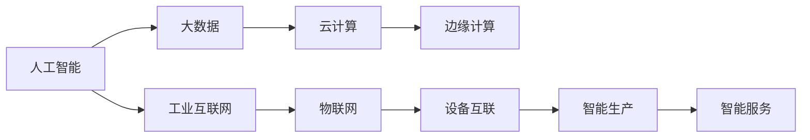

                 

# 新质生产力推动产业升级

在人类历史的长河中，技术的演进总是伴随着生产力的飞跃。从蒸汽机、电力到计算机，每一次技术的革命都深刻地改变了社会的生产方式，提高了生产效率，推动了经济社会的进步。而如今，我们正站在人工智能和大数据技术的浪潮中，迎来了一场新的技术革命——新质生产力。

新质生产力指的是以人工智能、大数据、云计算等为代表的新一代信息技术，通过自动化、智能化、数据化等手段，极大地提升生产效率、优化资源配置、创新产品和服务，从而引领产业升级和经济转型。本文将深入探讨新质生产力的核心理念、核心技术及其对产业升级的驱动作用，并展望未来发展趋势与挑战。

## 1. 背景介绍

### 1.1 产业变革的浪潮

随着信息技术的高速发展，全球产业正在经历前所未有的变革。传统制造业、服务业、金融业等领域的生产模式、业务流程、组织结构都在发生根本性的变化。信息技术的融合创新，使得传统产业的“价值链”向数字化、智能化、网络化方向发展，加速了产业的数字化转型。

大数据和人工智能技术的发展，使得传统的数据驱动型产业，如电商、医疗、教育、物流等，通过数据驱动的决策，实现了更高效的生产与服务。智能化机器人和自动化生产线的广泛应用，使制造业实现了柔性化和定制化生产，大大提高了生产效率和产品质量。而云计算和边缘计算技术的应用，使得各种生产系统能够在更灵活、更高效、更经济的环境下运行，进一步优化了资源配置。

### 1.2 新质生产力的本质

新质生产力本质上是一种全新的生产模式，它不再依赖于传统的物质资源和人力资本，而是通过信息技术的应用，实现了智能化、自动化、数据化的生产与服务。其核心在于以下几个方面：

- **智能化**：人工智能技术的应用，实现了生产过程的自动化与智能化，能够快速响应市场需求变化，提高生产效率。
- **数据化**：大数据技术的应用，使企业能够实时监控生产全过程，进行精准预测和优化决策，提升了资源利用率。
- **网络化**：云计算和物联网技术的应用，使得生产系统能够实现跨地域、跨行业的协同合作，促进了产业的融合创新。

## 2. 核心概念与联系

### 2.1 核心概念概述

新质生产力涉及多个核心概念，这些概念之间相互联系，共同构成了新质生产力的生态系统。以下是几个关键概念：

- **人工智能**：通过机器学习、深度学习等技术，实现对复杂数据模式的自动分析与推理，进而实现智能化决策。
- **大数据**：通过收集、存储、分析海量数据，揭示数据背后的规律和趋势，提供决策支持。
- **云计算**：基于互联网的计算资源共享平台，能够按需提供计算、存储、网络等服务，支持大规模、实时化的数据处理。
- **边缘计算**：在数据源附近进行数据处理和分析，以减少数据传输和存储的延迟和成本，提升数据处理的效率和实时性。
- **工业互联网**：通过互联网技术，实现工业设备和生产系统的互联互通，实现智能化的生产管理和服务。

### 2.2 概念间的关系

这些核心概念之间的关系可以通过以下Mermaid流程图来展示：



这个流程图展示了人工智能、大数据、云计算、边缘计算与工业互联网之间的关系：

- 人工智能和大数据通过云计算提供的数据处理能力，实现了对海量数据的深度分析，为智能生产和服务提供了决策支持。
- 边缘计算则通过在数据源附近进行数据处理，进一步提升了数据处理的效率和实时性，满足了智能生产的需求。
- 工业互联网通过物联网技术，实现了设备互联，使得生产系统能够实现自动化和智能化，提升了生产效率。

这些概念共同构成了新质生产力的基础，通过不断的技术融合创新，引领了产业的升级和转型。

## 3. 核心算法原理 & 具体操作步骤

### 3.1 算法原理概述

新质生产力的核心算法包括机器学习、深度学习、优化算法等。这些算法通过分析和处理海量数据，实现对生产系统的智能化、自动化和数据化管理。

以深度学习为例，其核心原理是通过多层神经网络对数据进行抽象和特征提取，进而实现对复杂模式的自动分析和推理。其基本流程包括：

1. **数据准备**：收集和清洗生产过程中的各种数据，包括设备状态、生产记录、环境参数等。
2. **模型训练**：通过深度学习算法，对清洗后的数据进行训练，学习数据的特征和规律。
3. **模型应用**：将训练好的模型应用于生产系统，实现自动化决策和智能控制。

### 3.2 算法步骤详解

以智能工厂为例，以下是新质生产力的具体实现步骤：

1. **设备互联**：通过物联网技术，将生产设备、传感器、控制系统等设备互联，实现数据的实时采集和传输。
2. **数据清洗**：对采集到的数据进行清洗和预处理，去除噪声和异常值，提高数据质量。
3. **模型训练**：通过深度学习算法，训练出能够识别设备状态、预测生产异常、优化生产参数的模型。
4. **智能决策**：将训练好的模型应用于生产系统，实现对设备状态的实时监控、生产异常的智能预警、生产参数的优化调整。
5. **数据反馈**：将模型的预测结果和实际生产情况进行对比，对模型进行不断的迭代和优化。

### 3.3 算法优缺点

新质生产力算法具有以下优点：

- **高效性**：通过深度学习等技术，能够实现对海量数据的快速处理和分析，提升生产效率。
- **智能性**：通过智能化决策，能够快速响应市场需求变化，提高生产灵活性。
- **数据化**：通过数据分析，能够实现生产过程的优化和资源配置的合理化。

同时，新质生产力算法也存在一些缺点：

- **高成本**：深度学习等算法的训练和应用需要大量的计算资源和存储资源，成本较高。
- **技术门槛高**：深度学习等算法需要专业的数据科学家和工程师进行模型训练和调优，技术门槛较高。
- **数据质量要求高**：算法的准确性依赖于数据的质量和完整性，数据质量不高可能导致算法效果不佳。

### 3.4 算法应用领域

新质生产力算法在多个领域得到了广泛应用，以下是一些典型应用：

- **智能制造**：通过深度学习和大数据技术，实现对生产设备的智能化监控、生产过程的自动化控制和生产参数的优化调整，提升生产效率和产品质量。
- **智慧城市**：通过云计算和物联网技术，实现城市交通、环保、公共安全等领域的智能化管理，提升城市运行效率和居民生活质量。
- **智能医疗**：通过深度学习和大数据分析，实现对病患数据的高效处理和分析，提高医疗服务的智能化水平，提升诊断和治疗效果。
- **智能零售**：通过大数据和深度学习技术，实现对消费者行为的高效分析和预测，提升营销效果和客户满意度。
- **智能金融**：通过大数据和人工智能技术，实现对金融市场的高效分析和预测，提升投资决策的精准性和效率。

## 4. 数学模型和公式 & 详细讲解

### 4.1 数学模型构建

新质生产力算法通常建立在深度学习模型的基础上，以下是基本的数学模型构建过程：

假设有一个生产设备，其状态由多个参数 $x$ 表示，通过对这些参数进行建模，可以预测设备的运行状态和生产结果。设预测模型为 $f(x;\theta)$，其中 $\theta$ 为模型参数。则模型训练的目标是：

$$
\min_{\theta} \frac{1}{N} \sum_{i=1}^N (f(x_i;\theta) - y_i)^2
$$

其中 $N$ 为样本数量，$y_i$ 为实际输出。

### 4.2 公式推导过程

以预测设备运行状态为例，推导模型的基本公式：

1. **输入特征提取**：将设备状态 $x$ 转化为模型输入，如将传感器数据转化为向量 $x = [x_1, x_2, ..., x_n]$。
2. **模型定义**：定义预测模型 $f(x;\theta) = \sum_{i=1}^n w_i x_i + b$，其中 $w_i$ 和 $b$ 为模型参数。
3. **损失函数**：定义均方误差损失函数 $L(f(x;\theta)) = \frac{1}{N} \sum_{i=1}^N (f(x_i;\theta) - y_i)^2$。
4. **优化算法**：使用梯度下降等优化算法，最小化损失函数，更新模型参数 $\theta$。

### 4.3 案例分析与讲解

以智能工厂为例，对新质生产力的应用进行详细讲解：

1. **设备状态预测**：通过深度学习模型，预测设备运行状态。模型输入为传感器数据，输出为设备运行状态，如设备故障、设备运行速度等。
2. **生产异常检测**：通过深度学习模型，检测生产过程中的异常现象，如设备故障、物料短缺等。模型输入为生产记录和传感器数据，输出为异常预警。
3. **生产参数优化**：通过深度学习模型，优化生产参数，如温度、湿度、压力等。模型输入为生产数据，输出为最优参数设置。

## 5. 项目实践：代码实例和详细解释说明

### 5.1 开发环境搭建

进行新质生产力项目的开发，首先需要搭建好开发环境。以下是Python开发环境的配置步骤：

1. **安装Python和Anaconda**：安装Python 3.8和Anaconda，用于创建虚拟环境和管理依赖库。
2. **创建虚拟环境**：使用conda创建虚拟环境，并激活。
3. **安装必要的依赖库**：安装深度学习库，如TensorFlow、Keras、PyTorch等，以及数据处理库，如NumPy、Pandas、Scikit-Learn等。

### 5.2 源代码详细实现

以智能工厂为例，以下是新质生产力的Python代码实现：

```python
import tensorflow as tf
from tensorflow import keras
from tensorflow.keras import layers

# 定义模型
model = keras.Sequential([
    layers.Dense(64, activation='relu', input_shape=[n_features]),
    layers.Dense(64, activation='relu'),
    layers.Dense(1, activation='sigmoid')
])

# 编译模型
model.compile(optimizer=tf.keras.optimizers.Adam(0.001),
              loss='binary_crossentropy',
              metrics=['accuracy'])

# 训练模型
model.fit(train_x, train_y, epochs=10, batch_size=32, validation_split=0.2)
```

### 5.3 代码解读与分析

以上代码实现了基于深度学习模型的智能工厂设备状态预测。具体解读如下：

- **模型定义**：通过Sequential模型定义了三层神经网络，输入层为n_features维，输出层为1维，表示设备运行状态的概率。
- **模型编译**：使用Adam优化器和二元交叉熵损失函数进行模型编译，同时定义了训练过程中的精度指标。
- **模型训练**：使用fit方法进行模型训练，指定训练数据、训练轮数、批次大小等参数，并在验证集上评估模型性能。

### 5.4 运行结果展示

假设在智能工厂的设备状态预测项目中，训练后的模型在验证集上的精度为0.85，这意味着模型在预测设备运行状态方面取得了较高的准确性。

## 6. 实际应用场景

### 6.1 智能制造

智能制造是新质生产力在制造业中的应用场景之一。通过深度学习和大数据分析，可以实现对生产设备、生产过程的智能化监控和管理。具体应用包括：

- **设备状态预测**：通过深度学习模型，预测设备运行状态，提前进行维护和故障处理。
- **生产过程优化**：通过数据分析，优化生产过程，提高生产效率和产品质量。
- **资源配置**：通过优化算法，实现对生产资源的合理配置，提高资源利用率。

### 6.2 智慧城市

智慧城市是新质生产力在城市管理中的应用场景之一。通过云计算和物联网技术，可以实现对城市交通、环保、公共安全等领域的智能化管理。具体应用包括：

- **交通管理**：通过实时数据分析，优化交通流量，减少交通拥堵。
- **环境监测**：通过传感器数据，实时监测城市环境，提升环境质量。
- **公共安全**：通过视频监控和数据分析，提升公共安全水平。

### 6.3 智能医疗

智能医疗是新质生产力在医疗领域的应用场景之一。通过深度学习和大数据分析，可以实现对病患数据的高效处理和分析，提升医疗服务的智能化水平。具体应用包括：

- **病患诊断**：通过深度学习模型，预测病患的疾病风险，提高诊断准确性。
- **治疗方案优化**：通过数据分析，优化治疗方案，提高治疗效果。
- **资源配置**：通过优化算法，实现医疗资源的合理配置，提高资源利用率。

### 6.4 未来应用展望

新质生产力技术在未来将有更广泛的应用前景，涵盖更多行业和领域。以下是一些可能的应用方向：

- **智能农业**：通过物联网技术，实现对农作物的智能化监控和管理，提高农业生产效率和资源利用率。
- **智能物流**：通过大数据和深度学习技术，优化物流路径和资源配置，提升物流效率和客户满意度。
- **智能金融**：通过大数据和人工智能技术，实现对金融市场的高效分析和预测，提升投资决策的精准性和效率。
- **智能零售**：通过大数据和深度学习技术，实现对消费者行为的高效分析和预测，提升营销效果和客户满意度。

## 7. 工具和资源推荐

### 7.1 学习资源推荐

为了帮助开发者系统掌握新质生产力的技术，以下是一些优质的学习资源：

1. **《深度学习》课程**：斯坦福大学的深度学习课程，详细介绍了深度学习的基本原理和应用。
2. **TensorFlow官方文档**：TensorFlow的官方文档，提供了深度学习模型的实现和应用示例。
3. **PyTorch官方文档**：PyTorch的官方文档，提供了深度学习模型的实现和应用示例。
4. **Keras官方文档**：Keras的官方文档，提供了深度学习模型的实现和应用示例。
5. **Google Cloud Platform教程**：Google Cloud Platform的官方教程，介绍了云计算和大数据的应用实例。

### 7.2 开发工具推荐

新质生产力技术的开发离不开高效的工具支持。以下是几款常用的开发工具：

1. **Jupyter Notebook**：一个交互式的Python开发环境，支持代码编写、数据可视化等。
2. **TensorFlow**：一个开源的深度学习框架，提供了高效的计算图和自动微分功能。
3. **PyTorch**：一个开源的深度学习框架，提供了灵活的动态计算图和自动微分功能。
4. **Keras**：一个高级深度学习API，提供了简单易用的接口，支持多种深度学习模型的实现。
5. **Scikit-Learn**：一个Python的机器学习库，提供了丰富的机器学习算法和数据处理工具。

### 7.3 相关论文推荐

新质生产力技术的发展离不开学界的持续研究。以下是几篇奠基性的相关论文，推荐阅读：

1. **《深度学习》书籍**：Yoshua Bengio等著，详细介绍了深度学习的基本原理和应用。
2. **《机器学习》书籍**：Tom Mitchell著，介绍了机器学习的基本原理和算法。
3. **《云计算》书籍**：Crispin Cowan等著，介绍了云计算的基本原理和应用。
4. **《物联网》书籍**：Rajashree Ray等著，介绍了物联网的基本原理和应用。
5. **《大数据》书籍**：Hadoop官方文档，介绍了大数据的基本原理和应用。

## 8. 总结：未来发展趋势与挑战

### 8.1 研究成果总结

新质生产力技术在多个领域得到了广泛应用，取得了显著的成果。以下是几个典型应用：

- **智能制造**：通过深度学习和大数据分析，实现了对生产设备、生产过程的智能化监控和管理，提高了生产效率和产品质量。
- **智慧城市**：通过云计算和物联网技术，实现了对城市交通、环保、公共安全等领域的智能化管理，提升了城市运行效率和居民生活质量。
- **智能医疗**：通过深度学习和大数据分析，实现了对病患数据的高效处理和分析，提升了医疗服务的智能化水平。

### 8.2 未来发展趋势

新质生产力技术在未来将呈现以下几个发展趋势：

1. **深度学习模型的演进**：深度学习模型将不断进步，具有更强的模型压缩能力和泛化能力，适应更复杂的数据分布。
2. **云计算和大数据的融合**：云计算和大数据技术将进一步融合，提供更强大的数据处理能力和计算能力，支持更大规模的深度学习模型训练。
3. **边缘计算的应用**：边缘计算技术将更广泛地应用于物联网和智能制造领域，提升数据处理和计算的效率和实时性。
4. **跨领域应用的多样化**：新质生产力技术将逐步应用于更多领域，如农业、物流、金融等，推动各行业的数字化转型。
5. **智能化决策系统的普及**：智能化决策系统将更广泛地应用于企业和政府，提升决策的精准性和效率。

### 8.3 面临的挑战

尽管新质生产力技术已经取得了显著的成果，但在实际应用中仍面临一些挑战：

1. **数据质量问题**：数据质量不高可能导致算法效果不佳，需要更多的数据清洗和预处理工作。
2. **计算资源需求高**：深度学习模型的训练和应用需要大量的计算资源，需要更高效的计算平台和算法。
3. **技术门槛高**：深度学习和大数据技术需要专业的数据科学家和工程师，技术门槛较高。
4. **安全性问题**：智能化决策系统的安全性问题，如数据隐私保护、系统安全漏洞等，需要更多的技术保障和法律监管。

### 8.4 研究展望

未来，新质生产力技术需要在以下几个方面进行更多的探索和创新：

1. **模型压缩与优化**：开发更高效的深度学习模型压缩和优化技术，减少计算资源需求。
2. **自动化与智能化决策**：开发更强大的自动化决策系统，提升决策的精准性和效率。
3. **跨领域应用**：推动新质生产力技术在更多领域的应用，推动各行业的数字化转型。
4. **安全性保障**：提升智能化决策系统的安全性，保障数据隐私和系统安全。

总之，新质生产力技术正在引领一场全新的产业革命，带来前所未有的机遇和挑战。只有在技术、市场、政策等多个方面协同发力，才能实现新质生产力的最大价值，推动社会的全面进步。

## 9. 附录：常见问题与解答

### Q1：新质生产力技术的发展前景如何？

A：新质生产力技术正在引领一场全新的产业革命，将深刻改变社会的生产方式和商业模式。未来，新质生产力技术将在更多领域得到应用，推动各行业的数字化转型。新质生产力技术的演进将带来更多的创新机遇，推动人类社会的全面进步。

### Q2：新质生产力技术的主要优势和劣势是什么？

A：新质生产力技术的主要优势包括：

- **高效性**：通过深度学习等技术，实现对海量数据的快速处理和分析，提升生产效率。
- **智能性**：通过智能化决策，能够快速响应市场需求变化，提高生产灵活性。
- **数据化**：通过数据分析，能够实现生产过程的优化和资源配置的合理化。

其主要劣势包括：

- **高成本**：深度学习等算法的训练和应用需要大量的计算资源和存储资源，成本较高。
- **技术门槛高**：深度学习和大数据技术需要专业的数据科学家和工程师进行模型训练和调优，技术门槛较高。
- **数据质量要求高**：算法的准确性依赖于数据的质量和完整性，数据质量不高可能导致算法效果不佳。

### Q3：新质生产力技术在实际应用中需要注意哪些问题？

A：在实际应用中，新质生产力技术需要注意以下几个问题：

- **数据质量问题**：数据质量不高可能导致算法效果不佳，需要更多的数据清洗和预处理工作。
- **计算资源需求高**：深度学习模型的训练和应用需要大量的计算资源，需要更高效的计算平台和算法。
- **技术门槛高**：深度学习和大数据技术需要专业的数据科学家和工程师，技术门槛较高。
- **安全性问题**：智能化决策系统的安全性问题，如数据隐私保护、系统安全漏洞等，需要更多的技术保障和法律监管。

### Q4：新质生产力技术如何与其他技术进行融合创新？

A：新质生产力技术可以通过与其他技术进行融合创新，提升自身的应用价值。以下是一些可能的融合方向：

- **与物联网技术结合**：通过物联网技术，实现设备互联和数据实时传输，提升智能化生产系统的实时性和灵活性。
- **与区块链技术结合**：通过区块链技术，保障数据隐私和系统安全，提升智能化决策系统的可信度和可靠性。
- **与人工智能技术结合**：通过人工智能技术，提升智能化决策系统的智能化水平，提高决策的精准性和效率。
- **与自然语言处理技术结合**：通过自然语言处理技术，实现智能客服、智能搜索等应用，提升用户交互体验。

总之，新质生产力技术需要与其他技术进行深度融合，才能实现更广泛的应用和更高的价值。

---

作者：禅与计算机程序设计艺术 / Zen and the Art of Computer Programming

