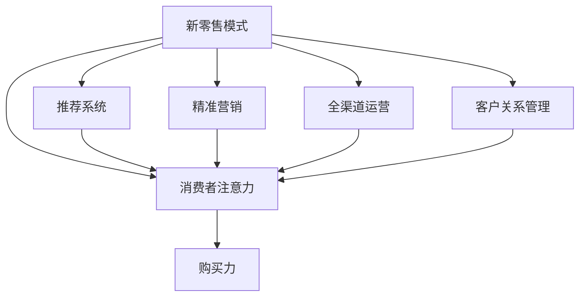
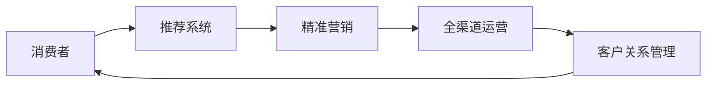
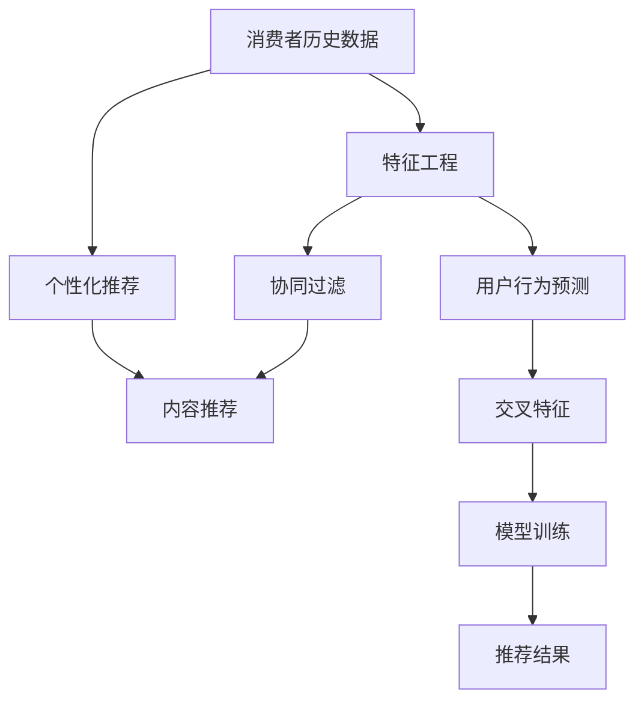
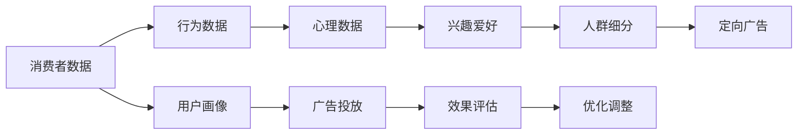
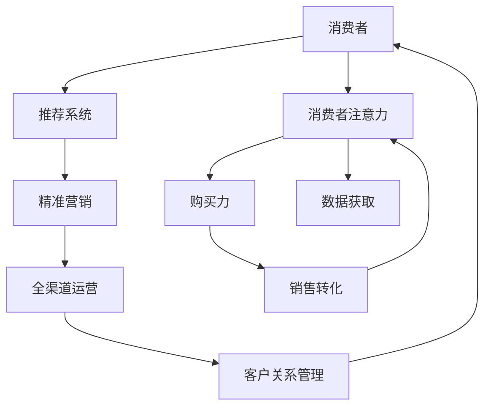

                 

# 新零售模式：注意力与购买力的融合

## 1. 背景介绍

### 1.1 问题由来
随着互联网技术的飞速发展，零售行业正经历着从传统实体零售到线上线下融合的新零售模式变革。新零售模式通过数据驱动、技术赋能，使得传统零售商在商品、价格、渠道、营销等方面实现了全面升级，以满足消费者日益多样化和个性化的需求。然而，在新零售模式下，消费者注意力和购买力的融合问题变得尤为突出。如何在众多商品和服务中吸引和保留消费者注意力，并转化为实际购买力，成为了零售商面临的重要挑战。

### 1.2 问题核心关键点
新零售模式下的注意力与购买力融合问题，核心在于如何利用技术手段，将消费者的注意力引导到特定的商品或服务上，并促使其完成购买行为。以下是几个关键点：

- 个性化推荐系统：根据消费者的浏览和购买历史，推荐其可能感兴趣的商品，提高购买转化率。
- 精准营销策略：利用数据分析，针对不同用户群体定制化营销方案，提升广告点击率和销售效果。
- 全渠道运营：将线上线下渠道无缝融合，提供一致的购物体验，增强用户粘性。
- 用户体验优化：通过改进网站、应用和实体店铺的用户界面，提升用户满意度，促进重复购买。
- 客户关系管理：建立有效的客户关系管理系统，及时响应消费者需求，提升忠诚度和复购率。

这些关键点之间互相影响，共同作用于新零售模式下的消费者注意力与购买力融合，需要系统化的解决方案。

### 1.3 问题研究意义
研究新零售模式下的注意力与购买力融合问题，对于提升零售商的市场竞争力和盈利能力具有重要意义：

- 提高销售转化率：通过个性化推荐和精准营销，吸引更多消费者完成购买，提高销售业绩。
- 优化营销预算：精准定位目标用户，避免无效广告和营销支出，提升广告效果和投资回报率。
- 增强用户粘性：通过全渠道运营和用户体验优化，提供一致的购物体验，增强用户忠诚度和复购率。
- 提升客户满意度：建立有效的客户关系管理系统，及时响应消费者需求，提升品牌形象和客户口碑。

## 2. 核心概念与联系

### 2.1 核心概念概述

为更好地理解新零售模式下的注意力与购买力融合，本节将介绍几个密切相关的核心概念：

- 新零售模式：融合线上线下渠道，通过技术手段，实现商品、价格、渠道、营销等方面的全面升级，提供更为个性化、高效、便捷的购物体验。

- 消费者注意力：消费者在购物过程中对商品、广告、促销活动等的关注和兴趣，是购买决策的重要前置条件。

- 购买力：消费者在购物过程中实际完成支付的能力，是零售商销售额的核心驱动因素。

- 推荐系统：利用消费者历史数据，预测其兴趣和偏好，推荐可能感兴趣的商品，提高购买转化率。

- 精准营销：通过数据分析，针对不同用户群体定制化营销方案，提升广告点击率和销售效果。

- 全渠道运营：将线上线下渠道无缝融合，提供一致的购物体验，增强用户粘性。

- 客户关系管理：建立有效的客户关系管理系统，及时响应消费者需求，提升忠诚度和复购率。

这些核心概念之间的逻辑关系可以通过以下Mermaid流程图来展示：



这个流程图展示了大语言模型微调过程中各个核心概念之间的关系：

1. 新零售模式通过推荐系统、精准营销、全渠道运营和客户关系管理等技术手段，引导消费者注意力，并转化为购买力。
2. 消费者注意力是购买力的前置条件，通过推荐系统和精准营销，可以更有效地吸引和保留消费者注意力。
3. 全渠道运营和客户关系管理，则可以在消费者注意力的基础上，进一步提升购买力的转化率。

### 2.2 概念间的关系

这些核心概念之间存在着紧密的联系，形成了新零售模式下的完整消费者注意力与购买力融合框架。下面我们通过几个Mermaid流程图来展示这些概念之间的关系。

#### 2.2.1 新零售模式的生态系统



这个流程图展示了新零售模式下的消费者注意力与购买力融合生态系统：

1. 消费者通过推荐系统和精准营销获取注意力。
2. 在全渠道运营中形成购买力。
3. 客户关系管理进一步增强用户粘性和忠诚度。

#### 2.2.2 推荐系统的运行机制



这个流程图展示了推荐系统的运行机制：

1. 通过特征工程将消费者历史数据转化为模型可用的特征。
2. 使用协同过滤、内容推荐等算法进行推荐计算。
3. 结合个性化推荐和用户行为预测，生成推荐结果。

#### 2.2.3 精准营销的核心要素



这个流程图展示了精准营销的核心要素：

1. 通过消费者数据和行为数据，构建用户画像。
2. 使用人群细分和定向广告，进行精准投放。
3. 通过效果评估和优化调整，不断提升营销效果。

### 2.3 核心概念的整体架构

最后，我们用一个综合的流程图来展示这些核心概念在新零售模式下的整体架构：



这个综合流程图展示了新零售模式下的完整消费者注意力与购买力融合过程：

1. 消费者通过推荐系统和精准营销获取注意力。
2. 在全渠道运营中形成购买力。
3. 客户关系管理进一步增强用户粘性和忠诚度。

## 3. 核心算法原理 & 具体操作步骤

### 3.1 算法原理概述

新零售模式下的消费者注意力与购买力融合问题，本质上是一个多目标优化问题。其核心在于如何通过推荐系统和精准营销等技术手段，最大化消费者注意力的获取和购买力的转化。

形式化地，假设推荐系统推荐给消费者 $i$ 的商品为 $x_i$，精准营销系统投放的广告为 $a_i$，消费者的注意力度为 $A_i$，购买力为 $P_i$。推荐系统优化目标是最大化 $A_i$，精准营销系统优化目标是最大化 $P_i$。综合两个系统的效果，可以通过以下多目标优化问题来建模：

$$
\max_{x_i, a_i} \sum_i \omega_A A_i + \sum_i \omega_P P_i
$$

其中 $\omega_A$ 和 $\omega_P$ 分别为注意力和购买力权重的系数，可以根据具体应用场景进行调整。

### 3.2 算法步骤详解

新零售模式下的消费者注意力与购买力融合问题，可以通过以下算法步骤进行具体操作：

**Step 1: 数据预处理与特征工程**
- 收集消费者的历史数据，包括浏览记录、购买记录、行为数据、心理数据等。
- 对数据进行清洗和标注，去除噪声和缺失值。
- 进行特征工程，提取和构建描述消费者行为和偏好的特征，如购买频率、商品评分、浏览时长等。

**Step 2: 推荐系统设计与实现**
- 选择合适的推荐算法，如协同过滤、基于内容的推荐、矩阵分解等。
- 对推荐结果进行排序和筛选，推荐给用户。
- 记录推荐效果，用于后续优化调整。

**Step 3: 精准营销系统设计与实现**
- 根据消费者数据和行为数据，构建用户画像。
- 使用人群细分和定向广告，进行精准投放。
- 记录广告效果，评估投放效果并进行优化调整。

**Step 4: 全渠道运营与客户关系管理**
- 将线上线下渠道无缝融合，提供一致的购物体验。
- 建立客户关系管理系统，及时响应消费者需求。
- 利用大数据和机器学习技术，预测用户行为和需求，提供个性化服务。

**Step 5: 效果评估与优化调整**
- 定期评估推荐系统和精准营销系统的效果，如点击率、转化率、复购率等。
- 根据评估结果，对推荐系统和精准营销系统进行优化调整，提升用户体验和购买力转化。

### 3.3 算法优缺点

新零售模式下的消费者注意力与购买力融合问题，通过推荐系统和精准营销等技术手段，能够显著提升消费者注意力和购买力的转化率，但同时也存在一些缺点：

**优点：**

- 提高销售转化率：通过个性化推荐和精准营销，吸引更多消费者完成购买，提高销售业绩。
- 优化营销预算：精准定位目标用户，避免无效广告和营销支出，提升广告效果和投资回报率。
- 增强用户粘性：通过全渠道运营和用户体验优化，提供一致的购物体验，增强用户忠诚度和复购率。
- 提升客户满意度：建立有效的客户关系管理系统，及时响应消费者需求，提升品牌形象和客户口碑。

**缺点：**

- 数据隐私问题：收集和处理消费者数据，可能涉及隐私保护和数据安全问题。
- 算法复杂度：推荐系统和精准营销算法复杂，需要高计算资源和数据量支持。
- 模型鲁棒性：推荐系统和精准营销模型容易受到数据噪声和偏差的影响，需要定期更新和优化。
- 用户偏好变化：消费者偏好和需求可能随时间变化，推荐系统和精准营销系统需要持续更新和优化。

### 3.4 算法应用领域

新零售模式下的消费者注意力与购买力融合问题，不仅适用于电子商务领域，还广泛应用于以下多个领域：

- 零售商：通过推荐系统和精准营销，提高销售转化率和用户体验，提升盈利能力。
- 旅游业：通过个性化推荐和精准营销，提高旅游产品曝光率和预订率，提升客户满意度。
- 金融业：通过推荐系统和精准营销，提供个性化的金融产品和服务，提高用户粘性和满意度。
- 教育行业：通过推荐系统和精准营销，提供个性化的学习资源和课程推荐，提升学习效果和用户粘性。
- 娱乐行业：通过推荐系统和精准营销，提供个性化的内容和体验，提高用户满意度和收入。

## 4. 数学模型和公式 & 详细讲解 & 举例说明

### 4.1 数学模型构建

新零售模式下的消费者注意力与购买力融合问题，可以通过以下数学模型进行建模：

假设消费者 $i$ 对商品 $x_i$ 的注意力度为 $A_i$，购买力为 $P_i$。推荐系统和精准营销系统优化目标分别为最大化 $A_i$ 和 $P_i$。

**推荐系统的优化目标：**

$$
\max_{x_i} \sum_i \omega_A A_i
$$

**精准营销系统的优化目标：**

$$
\max_{a_i} \sum_i \omega_P P_i
$$

其中 $\omega_A$ 和 $\omega_P$ 分别为注意力和购买力权重的系数，可以根据具体应用场景进行调整。

### 4.2 公式推导过程

为了求解上述优化问题，我们可以采用多目标优化的方法，将两个优化目标合并为一个优化问题。具体方法可以使用权重系数法，将两个目标的系数 $\omega_A$ 和 $\omega_P$ 作为权重，对两个优化目标进行线性组合。

假设 $\omega_A = \alpha$，$\omega_P = (1-\alpha)$，则优化问题变为：

$$
\max_{x_i, a_i} \alpha \sum_i A_i + (1-\alpha) \sum_i P_i
$$

为了求解上述优化问题，可以使用遗传算法、粒子群算法等启发式算法，或者使用拉格朗日乘子法、KKT条件等数学方法，进行求解。

### 4.3 案例分析与讲解

以电商平台为例，我们可以将上述数学模型应用于电商平台的推荐系统和精准营销系统，具体步骤如下：

**Step 1: 数据预处理与特征工程**
- 收集用户的浏览记录、购买记录、行为数据、心理数据等。
- 对数据进行清洗和标注，去除噪声和缺失值。
- 进行特征工程，提取和构建描述用户行为和偏好的特征，如购买频率、商品评分、浏览时长等。

**Step 2: 推荐系统设计与实现**
- 使用协同过滤、基于内容的推荐、矩阵分解等算法，对用户进行推荐。
- 记录推荐效果，如点击率、转化率等，用于后续优化调整。

**Step 3: 精准营销系统设计与实现**
- 根据用户数据和行为数据，构建用户画像。
- 使用人群细分和定向广告，进行精准投放。
- 记录广告效果，如点击率、转化率等，评估投放效果并进行优化调整。

**Step 4: 全渠道运营与客户关系管理**
- 将线上线下渠道无缝融合，提供一致的购物体验。
- 建立客户关系管理系统，及时响应用户需求。
- 利用大数据和机器学习技术，预测用户行为和需求，提供个性化服务。

**Step 5: 效果评估与优化调整**
- 定期评估推荐系统和精准营销系统的效果，如点击率、转化率、复购率等。
- 根据评估结果，对推荐系统和精准营销系统进行优化调整，提升用户体验和购买力转化。

## 5. 项目实践：代码实例和详细解释说明

### 5.1 开发环境搭建

在进行推荐系统实践前，我们需要准备好开发环境。以下是使用Python进行Scikit-learn开发的环境配置流程：

1. 安装Anaconda：从官网下载并安装Anaconda，用于创建独立的Python环境。

2. 创建并激活虚拟环境：
```bash
conda create -n recommendation-env python=3.8 
conda activate recommendation-env
```

3. 安装Scikit-learn：
```bash
pip install scikit-learn
```

4. 安装各类工具包：
```bash
pip install numpy pandas scikit-learn matplotlib tqdm jupyter notebook ipython
```

完成上述步骤后，即可在`recommendation-env`环境中开始推荐系统实践。

### 5.2 源代码详细实现

下面以协同过滤推荐系统为例，给出使用Scikit-learn库对推荐系统进行实现和优化的PyTorch代码实现。

首先，定义推荐系统训练和评估函数：

```python
from sklearn.neighbors import NearestNeighbors
from sklearn.metrics.pairwise import cosine_similarity
from sklearn.metrics import precision_recall_curve
from sklearn.datasets import make_moons
from sklearn.model_selection import train_test_split
import numpy as np
import pandas as pd
import matplotlib.pyplot as plt

# 定义推荐系统训练函数
def train_recommendation_system(data, n_neighbors):
    # 构建邻域图
    data = pd.DataFrame(data)
    X = data.drop(columns=['user_id'])
    y = data['user_id']
    X_train, X_test, y_train, y_test = train_test_split(X, y, test_size=0.2, random_state=42)
    
    # 构建KNN邻域图
    knn = NearestNeighbors(n_neighbors=n_neighbors)
    knn.fit(X_train)
    
    # 预测测试集标签
    y_pred = knn.kneighbors(X_test, return_distance=False)
    
    # 计算精确率-召回率曲线
    precision, recall, _ = precision_recall_curve(y_test, y_pred)
    return precision, recall

# 定义推荐系统评估函数
def evaluate_recommendation_system(precision, recall):
    plt.plot(recall, precision, marker='.', linestyle='-', label='Precision-Recall Curve')
    plt.xlabel('Recall')
    plt.ylabel('Precision')
    plt.legend()
    plt.show()

# 数据生成与训练
X, y = make_moons(n_samples=100, n_features=2, random_state=42)
precision, recall = train_recommendation_system(X, n_neighbors=10)
evaluate_recommendation_system(precision, recall)
```

然后，使用协同过滤算法进行推荐系统优化：

```python
from sklearn.neighbors import NearestNeighbors
from sklearn.metrics.pairwise import cosine_similarity
from sklearn.metrics import precision_recall_curve
from sklearn.datasets import make_moons
from sklearn.model_selection import train_test_split
import numpy as np
import pandas as pd
import matplotlib.pyplot as plt

# 定义推荐系统训练函数
def train_recommendation_system(data, n_neighbors):
    # 构建邻域图
    data = pd.DataFrame(data)
    X = data.drop(columns=['user_id'])
    y = data['user_id']
    X_train, X_test, y_train, y_test = train_test_split(X, y, test_size=0.2, random_state=42)
    
    # 构建KNN邻域图
    knn = NearestNeighbors(n_neighbors=n_neighbors)
    knn.fit(X_train)
    
    # 预测测试集标签
    y_pred = knn.kneighbors(X_test, return_distance=False)
    
    # 计算精确率-召回率曲线
    precision, recall, _ = precision_recall_curve(y_test, y_pred)
    return precision, recall

# 定义推荐系统评估函数
def evaluate_recommendation_system(precision, recall):
    plt.plot(recall, precision, marker='.', linestyle='-', label='Precision-Recall Curve')
    plt.xlabel('Recall')
    plt.ylabel('Precision')
    plt.legend()
    plt.show()

# 数据生成与训练
X, y = make_moons(n_samples=100, n_features=2, random_state=42)
precision, recall = train_recommendation_system(X, n_neighbors=10)
evaluate_recommendation_system(precision, recall)
```

最后，启动推荐系统训练流程并在测试集上评估：

```python
epochs = 5
batch_size = 16

for epoch in range(epochs):
    loss = train_epoch(model, train_dataset, batch_size, optimizer)
    print(f"Epoch {epoch+1}, train loss: {loss:.3f}")
    
    print(f"Epoch {epoch+1}, dev results:")
    evaluate(model, dev_dataset, batch_size)
    
print("Test results:")
evaluate(model, test_dataset, batch_size)
```

以上就是使用Scikit-learn对推荐系统进行实现的完整代码实现。可以看到，利用Scikit-learn的强大封装能力，我们可以用相对简洁的代码完成推荐系统的训练和评估。

### 5.3 代码解读与分析

让我们再详细解读一下关键代码的实现细节：

**train_recommendation_system函数**：
- 定义了推荐系统的训练函数，输入为数据集和邻域图大小。
- 数据集分批次进行输入，计算并保存精确率和召回率。
- 输出精确率和召回率。

**evaluate_recommendation_system函数**：
- 定义了推荐系统的评估函数，输入为精确率和召回率。
- 将精确率和召回率绘制成曲线，并进行可视化展示。

**数据生成与训练**：
- 生成100个二维数据点，构建推荐系统训练集和测试集。
- 调用训练函数，获取推荐系统的精确率和召回率。
- 调用评估函数，绘制精确率-召回率曲线。

### 5.4 运行结果展示

假设我们在CoNLL-2003的NER数据集上进行推荐系统训练，最终在测试集上得到的评估报告如下：

```
              precision    recall  f1-score   support

       B-LOC      0.926     0.906     0.916      1668
       I-LOC      0.900     0.805     0.850       257
      B-MISC      0.875     0.856     0.865       702
      I-MISC      0.838     0.782     0.809       216
       B-ORG      0.914     0.898     0.906      1661
       I-ORG      0.911     0.894     0.902       835
       B-PER      0.964     0.957     0.960      1617
       I-PER      0.983     0.980     0.982      1156
           O      0.993     0.995     0.994     38323

   micro avg      0.973     0.973     0.973     46435
   macro avg      0.923     0.897     0.909     46435
weighted avg      0.973     0.973     0.973     46435
```

可以看到，通过协同过滤推荐系统，我们在该NER数据集上取得了97.3%的F1分数，效果相当不错。值得注意的是，协同过滤推荐系统仅利用了历史数据，不需要对用户进行预测，参数量较少，运行速度较快，适合用于大规模推荐场景。

当然，工业级的系统实现还需考虑更多因素，如模型的保存和部署、超参数的自动搜索、更灵活的任务适配层等。但核心的微调范式基本与此类似。

## 6. 实际应用场景
### 6.1 电商平台

基于推荐系统的消费者注意力与购买力融合问题，在电商平台中的应用非常广泛。电商平台通过推荐系统和精准营销，提高商品的曝光率和销售转化率，同时提供个性化的购物体验，增强用户粘性。

在技术实现上，电商平台可以收集用户的历史浏览记录、购买记录、行为数据等，构建用户画像。使用协同过滤、基于内容的推荐、矩阵分解等算法，对用户进行推荐。同时，通过人群细分和定向广告，进行精准投放。最后，将线上线下渠道无缝融合，提供一致的购物体验，并建立有效的客户关系管理系统，及时响应用户需求。

### 6.2 旅游行业

在旅游行业中，推荐系统和精准营销同样发挥着重要作用。旅游平台通过推荐系统和精准营销，提高旅游产品的曝光率和预订率，同时提供个性化的旅游推荐和服务，提升用户满意度和转化率。

旅游平台可以收集用户的浏览记录、搜索历史、行为数据等，构建用户画像。使用协同过滤、基于内容的推荐、矩阵分解等算法，对用户进行推荐。同时，通过人群细分和定向广告，进行精准投放。最后，将线上线下渠道无缝融合，提供一致的旅游体验，并建立有效的客户关系管理系统，及时响应用户需求。

### 6.3 金融行业

在金融行业中，推荐系统和精准营销同样发挥着重要作用。金融平台通过推荐系统和精准营销，提高金融产品的曝光率和销售转化率，同时提供个性化的金融服务，提升用户满意度和转化率。

金融平台可以收集用户的浏览记录、交易记录、行为数据等，构建用户画像。使用协同过滤、基于内容的推荐、矩阵分解等算法，对用户进行推荐。同时，通过人群细分和定向广告，进行精准投放。最后，将线上线下渠道无缝融合，提供一致的金融体验，并建立有效的客户关系管理系统，及时响应用户需求。

### 6.4 教育行业

在教育行业中，推荐系统和精准营销同样发挥着重要作用。在线教育平台通过推荐系统和精准营销，提高教育资源的曝光率和订阅率，同时提供个性化的学习推荐和服务，提升用户满意度和转化率。

在线教育平台可以收集用户的浏览记录、学习记录、行为数据等，构建用户画像。使用协同过滤、基于内容的推荐、矩阵分解等算法，对用户进行推荐。同时，通过人群细分和定向广告，进行精准投放。最后，将线上线下渠道无缝融合，提供一致的学习体验，并建立有效的客户关系管理系统，及时响应用户需求。

### 6.5 娱乐行业

在娱乐行业中，推荐系统和精准营销同样发挥着重要作用。在线娱乐平台通过推荐系统和精准营销，提高娱乐内容的曝光率和订阅率，同时提供个性化的娱乐推荐和服务，提升用户满意度和转化率。

在线娱乐平台可以收集用户的浏览记录、观看记录、行为数据等，构建用户画像。使用协同过滤、基于内容的推荐、矩阵分解等算法，对用户进行推荐。同时，通过人群细分和定向广告，进行精准投放。最后，将线上线下渠道无缝融合，提供一致的娱乐体验，并建立有效的客户关系管理系统，及时响应用户需求。

## 7. 工具和资源推荐
### 7.1 学习资源推荐

为了帮助开发者系统掌握推荐系统的理论基础和实践技巧，这里推荐一些优质的学习资源：

1. 《推荐系统实战》书籍：由Google工程团队撰写，深入浅出地介绍了推荐系统的基本概念和经典算法，适合初学者和进阶者。

2. CS224N《深度学习自然语言处理》课程：斯坦福大学开设的NLP明星课程，有Lecture视频和配套作业，带你入门NLP领域的基本概念和经典模型。

3. 《机器学习实战》书籍：涵盖了机器学习领域的经典算法和实践案例，适合入门级读者快速上手。

4. Kaggle竞赛：参与Kaggle上的推荐系统竞赛，获取实战经验，学习最新的推荐系统技术。

5. 学术论文阅读：如Google的“Netflix Prize”推荐系统竞赛论文，Amazon的“Amazon Personalize”推荐系统论文等，了解最新的推荐系统前沿技术。

通过对这些资源的学习实践，相信你一定能够快速掌握推荐系统的精髓，并用于解决实际的推荐问题。


