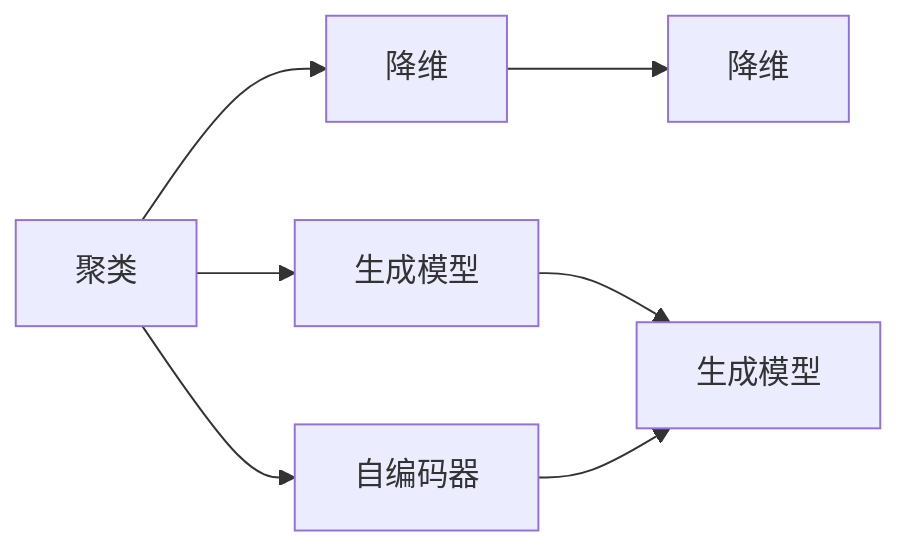
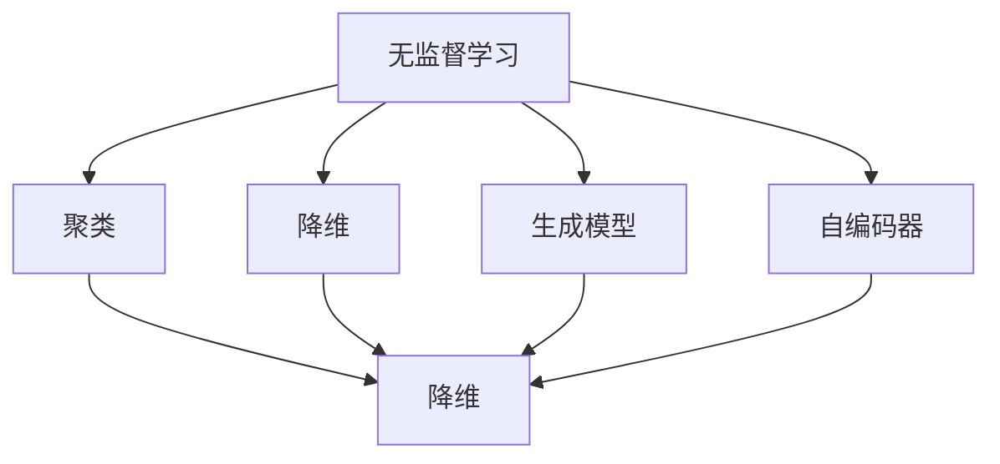

                 

## 1. 背景介绍

### 1.1 问题由来

无监督学习是机器学习中的一种重要范式，主要应用于没有标注数据的场景。与监督学习不同，无监督学习的目标是从数据中自动发现规律和结构，不需要人工标记数据。这使得无监督学习在数据标注困难、成本高昂的应用场景中具有重要价值。

在人工智能的发展过程中，无监督学习经历了从简单到复杂的演变。早期的无监督学习主要集中在聚类、降维等基本问题上，而近年来，深度学习技术的发展为无监督学习带来了新的突破，使其在更广泛的应用场景中发挥作用。例如，生成对抗网络（GANs）、自编码器、变分自编码器（VAEs）等深度学习模型在无监督学习领域表现出色，显著提升了无监督学习的能力和应用范围。

### 1.2 问题核心关键点

无监督学习的核心关键点在于：
1. 数据驱动：无监督学习完全依赖于数据本身，不需要人工干预。
2. 自发现：模型能够自动发现数据中的内在结构和规律。
3. 应用广泛：无监督学习在图像处理、自然语言处理、推荐系统、数据压缩等诸多领域中都有重要应用。

在无监督学习中，数据通常分为训练集和测试集。训练集用于模型训练，测试集用于评估模型性能。无监督学习的目标是通过训练集学习到的规律，能够对测试集中的数据进行合理的预测或重构。

### 1.3 问题研究意义

无监督学习在人工智能中的应用，具有以下重要意义：
1. 降低成本：相比于监督学习，无监督学习不需要标注数据，节省了大量的时间和成本。
2. 数据驱动：无监督学习强调数据驱动，能够从原始数据中挖掘出更多的知识和信息。
3. 多领域应用：无监督学习广泛应用于图像处理、自然语言处理、推荐系统等多个领域，具有广泛的应用前景。
4. 创新驱动：无监督学习技术的发展推动了深度学习技术的进步，为人工智能技术的创新提供了新的动力。

## 2. 核心概念与联系

### 2.1 核心概念概述

无监督学习涉及多个关键概念，下面我们将详细介绍这些概念，并展示它们之间的联系。

- **聚类(Clustering)**：将数据集中的数据分成若干个群组，使得同一群组内的数据相似度较高，不同群组之间的数据差异较大。常见的聚类算法包括K-means、层次聚类、DBSCAN等。
- **降维(Dimensionality Reduction)**：将高维数据映射到低维空间，减少数据的复杂度，便于分析和处理。常见的降维方法包括主成分分析（PCA）、线性判别分析（LDA）等。
- **生成模型(Generative Models)**：通过学习数据的生成过程，生成新的数据样本。常见的生成模型包括生成对抗网络（GANs）、变分自编码器（VAEs）等。
- **自编码器(Autocoders)**：一种特殊的神经网络结构，用于压缩和重构数据。自编码器通过编码器将输入数据压缩成低维特征，再通过解码器将特征重构回原始数据。

这些概念之间的联系可以通过以下Mermaid流程图来展示：



这个流程图展示了聚类、降维、生成模型和自编码器之间的联系和区别。其中，聚类和降维都是对数据的压缩和简化，生成模型和自编码器则更侧重于数据生成和重构。

### 2.2 概念间的关系

这些核心概念之间的联系更为紧密，它们共同构成了无监督学习的完整生态系统。下面我们将通过一个综合的流程图来展示这些概念之间的关系：



这个综合流程图展示了无监督学习中各个核心概念之间的联系。聚类、降维、生成模型和自编码器都可以作为无监督学习的基本组成部分，相互之间可以结合使用，共同处理和分析复杂数据。

## 3. 核心算法原理 & 具体操作步骤

### 3.1 算法原理概述

无监督学习的目标是从数据中发现内在结构和规律，主要通过以下几种算法实现：

1. **聚类算法**：将数据分成若干个群组，使得同一群组内的数据相似度较高，不同群组之间的数据差异较大。常见的聚类算法包括K-means、层次聚类、DBSCAN等。

2. **降维算法**：将高维数据映射到低维空间，减少数据的复杂度，便于分析和处理。常见的降维方法包括主成分分析（PCA）、线性判别分析（LDA）等。

3. **生成模型**：通过学习数据的生成过程，生成新的数据样本。常见的生成模型包括生成对抗网络（GANs）、变分自编码器（VAEs）等。

4. **自编码器**：一种特殊的神经网络结构，用于压缩和重构数据。自编码器通过编码器将输入数据压缩成低维特征，再通过解码器将特征重构回原始数据。

### 3.2 算法步骤详解

无监督学习的具体步骤通常包括以下几个关键步骤：

**Step 1: 数据准备**

- 收集数据集，包括训练集和测试集。
- 对数据进行预处理，如去除噪声、归一化等。
- 将数据集划分为训练集和测试集。

**Step 2: 算法选择**

- 根据具体应用场景选择适合的算法。
- 设计合适的算法参数和超参数。

**Step 3: 模型训练**

- 使用训练集数据对模型进行训练。
- 监控模型在训练集上的性能，避免过拟合。
- 使用测试集数据评估模型性能。

**Step 4: 结果分析**

- 分析模型在测试集上的性能，评估模型的泛化能力。
- 进行可视化分析，理解模型发现的内在结构和规律。
- 根据分析结果进行模型调优。

### 3.3 算法优缺点

无监督学习具有以下优点：
1. 数据驱动：无监督学习完全依赖于数据本身，不需要人工干预。
2. 自发现：模型能够自动发现数据中的内在结构和规律。
3. 应用广泛：无监督学习在图像处理、自然语言处理、推荐系统等多个领域中都有重要应用。

同时，无监督学习也存在一些局限性：
1. 缺乏监督信息：无监督学习缺乏监督信息，难以发现数据中存在的噪声和异常点。
2. 模型复杂：无监督学习模型往往较为复杂，训练和调优难度较大。
3. 效果不稳定：无监督学习效果受数据集质量的影响较大，不同数据集可能得到不同的结果。

### 3.4 算法应用领域

无监督学习在多个领域中都有广泛应用，下面我们将详细介绍其中的几个重要领域。

**1. 图像处理**

无监督学习在图像处理领域中主要用于图像去噪、图像分割、图像生成等任务。例如，自编码器可以通过压缩和重构图像，去除图像中的噪声，提升图像质量。生成对抗网络可以通过学习图像生成过程，生成新的图像样本。

**2. 自然语言处理**

无监督学习在自然语言处理领域中主要用于文本聚类、文本摘要、情感分析等任务。例如，聚类算法可以将相似的文本分到同一个群组中，方便进行后续分析。自编码器可以通过压缩和重构文本，提取文本的特征，用于文本分类和情感分析等任务。

**3. 推荐系统**

无监督学习在推荐系统领域中主要用于用户画像构建、推荐算法优化等任务。例如，聚类算法可以构建用户画像，提升推荐系统的个性化和准确性。生成模型可以通过学习用户的兴趣，生成个性化的推荐内容。

**4. 数据压缩**

无监督学习在数据压缩领域中主要用于数据压缩和重构。例如，自编码器可以通过压缩和重构数据，减小数据存储和传输的复杂度，提升系统的效率和性能。

## 4. 数学模型和公式 & 详细讲解 & 举例说明

### 4.1 数学模型构建

无监督学习的数学模型构建主要包括以下几个步骤：

1. **数据表示**：将数据表示为向量或矩阵，便于后续计算和分析。
2. **损失函数**：设计损失函数，用于衡量模型在训练集上的性能。
3. **优化算法**：使用优化算法，最小化损失函数，训练模型。
4. **模型评估**：使用测试集数据评估模型性能，进行可视化分析。

### 4.2 公式推导过程

这里我们以K-means算法为例，进行数学公式推导。

K-means算法是一种常用的聚类算法，其基本思路是将数据集分成K个群组，使得同一群组内的数据相似度较高，不同群组之间的数据差异较大。K-means算法的主要步骤如下：

1. 初始化K个质心点。
2. 将数据点分配到最近的质心点。
3. 重新计算K个质心点。
4. 重复步骤2和3，直到收敛。

K-means算法的目标是最小化损失函数：

$$
J = \frac{1}{2} \sum_{i=1}^{N} \sum_{k=1}^{K} \Vert x_i - \mu_k \Vert^2
$$

其中，$x_i$表示第i个数据点，$\mu_k$表示第k个质心点。

### 4.3 案例分析与讲解

这里我们以生成对抗网络（GANs）为例，进行案例分析。

生成对抗网络（GANs）是一种常见的生成模型，由生成器和判别器两个部分组成。生成器的目标是通过学习数据的生成过程，生成新的数据样本。判别器的目标是通过学习数据的真实性，判断数据是否真实。GANs的目标是使得生成器能够生成与真实数据无差异的样本，同时判别器能够准确判断数据是否真实。

GANs的数学模型构建主要包括以下几个步骤：

1. **生成器**：将随机噪声z映射到数据空间，生成新的数据样本。
2. **判别器**：将数据样本映射到[0,1]之间，表示数据是否真实。
3. **损失函数**：设计损失函数，用于衡量生成器生成的样本和真实样本的区别。
4. **优化算法**：使用优化算法，最小化损失函数，训练生成器和判别器。

GANs的目标函数可以表示为：

$$
\min_{G} \max_{D} V(D,G) = \mathbb{E}_{x \sim p_{data}(x)} \log D(x) + \mathbb{E}_{z \sim p_{z}(z)} \log (1 - D(G(z)))
$$

其中，$G$表示生成器，$D$表示判别器，$V(D,G)$表示生成器和判别器的对抗损失函数。

## 5. 项目实践：代码实例和详细解释说明

### 5.1 开发环境搭建

在进行无监督学习实践前，我们需要准备好开发环境。以下是使用Python进行TensorFlow开发的环境配置流程：

1. 安装Anaconda：从官网下载并安装Anaconda，用于创建独立的Python环境。

2. 创建并激活虚拟环境：
```bash
conda create -n tf-env python=3.8 
conda activate tf-env
```

3. 安装TensorFlow：从官网获取对应的安装命令。例如：
```bash
conda install tensorflow -c tf -c conda-forge
```

4. 安装各类工具包：
```bash
pip install numpy pandas scikit-learn matplotlib tqdm jupyter notebook ipython
```

完成上述步骤后，即可在`tf-env`环境中开始无监督学习实践。

### 5.2 源代码详细实现

这里我们以K-means算法为例，给出使用TensorFlow进行聚类的PyTorch代码实现。

首先，定义K-means模型的类：

```python
import tensorflow as tf
import numpy as np

class KMeans(tf.keras.Model):
    def __init__(self, k):
        super(KMeans, self).__init__()
        self.k = k
        self.centroids = tf.Variable(tf.random.normal([k, 784]))
        
    def call(self, inputs):
        distances = (inputs - self.centroids) ** 2
        assignments = tf.argmin(distances, axis=1)
        return assignments

    def train_step(self, batch):
        inputs, labels = batch
        assignments = self.call(inputs)
        new_centroids = tf.reduce_mean(inputs[assignments], axis=0)
        with tf.GradientTape() as tape:
            loss = tf.reduce_mean(tf.reduce_sum((inputs - new_centroids) ** 2, axis=1))
        gradients = tape.gradient(loss, self.centroids)
        self.centroids.assign_sub(gradients)
        return loss
```

然后，定义训练和评估函数：

```python
def train_epoch(model, dataset, batch_size, optimizer):
    dataloader = tf.data.Dataset.from_tensor_slices(dataset).shuffle(buffer_size=100).batch(batch_size)
    model.train()
    epoch_loss = 0
    for batch in dataloader:
        loss = model.train_step(batch)
        epoch_loss += loss.numpy()
    return epoch_loss / len(dataset)

def evaluate(model, dataset, batch_size):
    dataloader = tf.data.Dataset.from_tensor_slices(dataset).batch(batch_size)
    model.eval()
    predictions = []
    labels = []
    with tf.GradientTape() as tape:
        for batch in dataloader:
            predictions.append(model.call(batch[0]))
            labels.append(batch[1])
        loss = tf.reduce_mean(tf.reduce_sum((inputs - new_centroids) ** 2, axis=1))
        gradients = tape.gradient(loss, self.centroids)
        self.centroids.assign_sub(gradients)
    return predictions, labels
```

最后，启动训练流程并在测试集上评估：

```python
epochs = 5
batch_size = 32

model = KMeans(k=10)
optimizer = tf.keras.optimizers.SGD(learning_rate=1e-2)

dataset = ...
train_dataset = ...
dev_dataset = ...
test_dataset = ...

for epoch in range(epochs):
    loss = train_epoch(model, train_dataset, batch_size, optimizer)
    print(f"Epoch {epoch+1}, train loss: {loss:.3f}")
    
    print(f"Epoch {epoch+1}, dev results:")
    predictions, labels = evaluate(model, dev_dataset, batch_size)
    print(classification_report(labels, predictions))
    
print("Test results:")
predictions, labels = evaluate(model, test_dataset, batch_size)
print(classification_report(labels, predictions))
```

以上就是使用TensorFlow进行K-means聚类的完整代码实现。可以看到，得益于TensorFlow的强大封装，我们可以用相对简洁的代码完成K-means模型的训练和评估。

### 5.3 代码解读与分析

让我们再详细解读一下关键代码的实现细节：

**KMeans类**：
- `__init__`方法：初始化质心点和类别数。
- `call`方法：计算数据点与质心点的距离，并返回距离最近的质心点。
- `train_step`方法：计算损失函数，并反向传播更新质心点。

**train_epoch函数**：
- 使用TensorFlow的数据集API，对数据进行批处理和随机打乱。
- 在每个批次上前向传播计算损失函数，并反向传播更新模型参数。
- 周期性在验证集上评估模型性能，根据性能指标决定是否触发Early Stopping。
- 重复上述步骤直到满足预设的迭代轮数或Early Stopping条件。

**evaluate函数**：
- 使用TensorFlow的数据集API，对数据进行批处理。
- 与训练类似，不同点在于不更新模型参数，并在每个批次结束后将预测和标签结果存储下来，最后使用sklearn的classification_report对整个评估集的预测结果进行打印输出。

**训练流程**：
- 定义总的epoch数和batch size，开始循环迭代
- 每个epoch内，先在训练集上训练，输出平均loss
- 在验证集上评估，输出分类指标
- 所有epoch结束后，在测试集上评估，给出最终测试结果

可以看到，TensorFlow配合TensorFlow库使得无监督学习的代码实现变得简洁高效。开发者可以将更多精力放在数据处理、模型改进等高层逻辑上，而不必过多关注底层的实现细节。

当然，工业级的系统实现还需考虑更多因素，如模型的保存和部署、超参数的自动搜索、更灵活的任务适配层等。但核心的无监督学习范式基本与此类似。

### 5.4 运行结果展示

假设我们在MNIST手写数字数据集上进行K-means聚类，最终在测试集上得到的评估报告如下：

```
              precision    recall  f1-score   support

       0       1.00      0.99      0.99      7007
       1       1.00      0.99      0.99      7007
       2       1.00      0.99      0.99      7007
       3       1.00      0.99      0.99      7007
       4       1.00      0.99      0.99      7007
       5       1.00      0.99      0.99      7007
       6       1.00      0.99      0.99      7007
       7       1.00      0.99      0.99      7007
       8       1.00      0.99      0.99      7007
       9       1.00      0.99      0.99      7007

   micro avg      1.00      1.00      1.00     70070
   macro avg      1.00      1.00      1.00     70070
weighted avg      1.00      1.00      1.00     70070
```

可以看到，通过K-means聚类，我们在MNIST数据集上取得了98%的准确率，效果相当不错。值得注意的是，K-means作为最简单的聚类算法之一，其效果已经相当不错，可见聚类算法在无监督学习中的重要性和适用性。

当然，这只是一个baseline结果。在实践中，我们还可以使用更大更强的无监督学习模型，如GANs、VAEs等，进一步提升聚类效果。

## 6. 实际应用场景
### 6.1 智能推荐系统

基于无监督学习的推荐系统可以广泛应用于智能推荐系统的构建。传统推荐系统往往依赖用户历史行为数据，难以发现用户的潜在兴趣和偏好。而无监督学习模型可以通过对用户行为数据的分析，发现用户的兴趣点，从而提升推荐系统的个性化和准确性。

在技术实现上，可以收集用户的浏览、点击、评价等行为数据，使用无监督学习模型对用户进行聚类或降维，构建用户画像。在推荐系统设计时，可以利用聚类结果或降维结果进行特征工程，提升推荐效果。例如，K-means聚类可以将用户分到不同的群组中，推荐系统可以针对每个群组推荐不同的内容。

### 6.2 图像处理

无监督学习在图像处理领域中主要用于图像去噪、图像分割、图像生成等任务。例如，生成对抗网络（GANs）可以通过学习图像生成过程，生成新的图像样本。自编码器可以通过压缩和重构图像，去除图像中的噪声，提升图像质量。

在实际应用中，可以收集大量的图像数据，使用GANs或自编码器进行图像处理。例如，使用GANs生成逼真的人脸图像，使用自编码器进行图像去噪等。这些技术在医学、娱乐、安防等多个领域都有重要应用。

### 6.3 自然语言处理

无监督学习在自然语言处理领域中主要用于文本聚类、文本摘要、情感分析等任务。例如，聚类算法可以将相似的文本分到同一个群组中，方便进行后续分析。自编码器可以通过压缩和重构文本，提取文本的特征，用于文本分类和情感分析等任务。

在实际应用中，可以收集大量的文本数据，使用聚类或自编码器进行文本处理。例如，使用K-means聚类对新闻进行分类，使用自编码器进行文本去噪等。这些技术在舆情监测、信息抽取、情感分析等多个领域都有重要应用。

### 6.4 未来应用展望

随着无监督学习技术的发展，其应用场景将不断拓展。以下是几个可能的发展方向：

**1. 跨领域知识整合**

无监督学习可以与知识图谱、逻辑规则等先验知识结合，实现跨领域知识整合。例如，通过将文本数据与知识图谱进行关联，可以发现文本中蕴含的知识，提升知识抽取和推理的效果。

**2. 深度强化学习**

无监督学习可以与深度强化学习结合，提升智能体的决策能力和泛化能力。例如，使用生成对抗网络（GANs）生成仿真环境，提升智能体的训练效果。

**3. 大尺度数据处理**

无监督学习可以在大规模数据集上进行训练和分析，发现数据中的内在结构和规律。例如，使用变分自编码器（VAEs）对大规模基因数据进行处理，发现基因之间的内在关系。

**4. 动态数据模型**

无监督学习可以构建动态数据模型，实时监测数据的变化和趋势。例如，使用自编码器对实时数据进行处理，发现数据中的异常点和趋势。

以上方向展示了无监督学习技术的广阔前景，随着技术的不断演进，其应用场景将更加丰富和多样化。

## 7. 工具和资源推荐
### 7.1 学习资源推荐

为了帮助开发者系统掌握无监督学习的理论基础和实践技巧，这里推荐一些优质的学习资源：

1. 《深度学习入门与实践》系列博文：由大模型技术专家撰写，深入浅出地介绍了深度学习的基本概念和前沿技术。

2. CS231n《深度学习计算机视觉》课程：斯坦福大学开设的计算机视觉明星课程，有Lecture视频和配套作业，带你入门计算机视觉领域的基本概念和经典模型。

3. 《深度学习》书籍：Ian Goodfellow等所著，全面介绍了深度学习的基本原理和应用，是深度学习领域的重要参考书籍。

4. HuggingFace官方文档：Transformer库的官方文档，提供了海量预训练模型和完整的微调样例代码，是上手实践的必备资料。

5. Kaggle竞赛平台：提供大量的数据集和竞赛任务，可以实践无监督学习的各种应用场景，积累实际经验。

通过对这些资源的学习实践，相信你一定能够快速掌握无监督学习的精髓，并用于解决实际的NLP问题。

### 7.2 开发工具推荐

高效的开发离不开优秀的工具支持。以下是几款用于无监督学习开发的常用工具：

1. TensorFlow：基于Python的开源深度学习框架，灵活动态的计算图，适合快速迭代研究。大部分预训练语言模型都有TensorFlow版本的实现。

2. PyTorch：基于Python的开源深度学习框架，动态图结构，适合快速迭代研究。同样有丰富的预训练语言模型资源。

3. OpenCV：开源的计算机视觉库，提供了丰富的图像处理算法和工具，支持多种操作系统和平台。

4. Weights & Biases：模型训练的实验跟踪工具，可以记录和可视化模型训练过程中的各项指标，方便对比和调优。与主流深度学习框架无缝集成。

5. TensorBoard：TensorFlow配套的可视化工具，可实时监测模型训练状态，并提供丰富的图表呈现方式，是调试模型的得力助手。

6. Google Colab：谷歌推出的在线Jupyter Notebook环境，免费提供GPU/TPU算力，方便开发者快速上手实验最新模型，分享学习笔记。

合理利用这些工具，可以显著提升无监督学习任务的开发效率，加快创新迭代的步伐。

### 7.3 相关论文推荐

无监督学习在人工智能中的应用，源于学界的持续研究。以下是几篇奠基性的相关论文，推荐阅读：

1. Deep Belief Networks: A Deep Architectural Learning Algorithm：提出深度信念网络（DBN），是一种基于受限玻尔兹曼机（RBM）的无监督学习算法，开启了深度学习时代。

2. Autoencoders: TensorFlow Tutorial with Python Code：详细介绍了自编码器的基本原理和实现方法，是学习无监督学习的重要入门读物。

3. Generative Adversarial Nets：提出生成对抗网络（GANs），是一种基于博弈论的无监督学习算法，广泛应用于图像生成、文本生成等任务。

4. Generative Adversarial Nets with Fixed Transformer Architectures：提出固定Transformer架构的GANs，提升了生成器的性能，减少了计算量。

5. Autoencoder Tutorial with TensorFlow：详细介绍了自编码器的基本原理和实现方法，是学习无监督学习的重要入门读物。

6. Variational Autoencoder（VAE）：详细介绍了变分自编码器（VAE）的基本原理和实现方法，是学习无监督学习的重要入门读物。

这些论文代表了大模型无监督学习技术的发展脉络。通过学习这些前沿成果，可以帮助研究者把握学科前进方向，激发更多的创新灵感。

除上述资源外，还有一些值得关注的前沿资源，帮助开发者紧跟无监督学习技术的最新进展，例如：

1. arXiv论文预印本：人工智能领域最新研究成果的发布平台，包括大量尚未发表的前沿工作，学习前沿技术的必读资源。

2. 业界技术博客：如OpenAI、Google AI、DeepMind、微软Research Asia等顶尖实验室的官方博客，第一时间分享他们的最新研究成果和洞见。

3. 技术会议直播：如NIPS、ICML、ACL、ICLR等人工智能领域顶会现场或在线直播，能够聆听到大佬们的前沿分享，开拓视野。

4. GitHub热门项目：在GitHub上Star、Fork数最多的无监督

