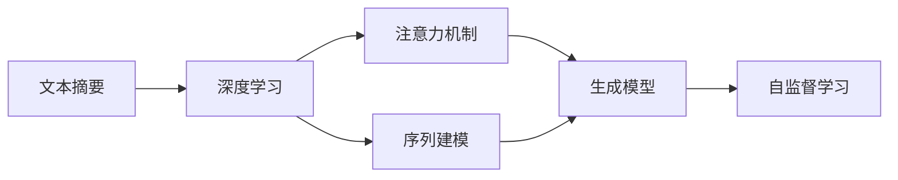
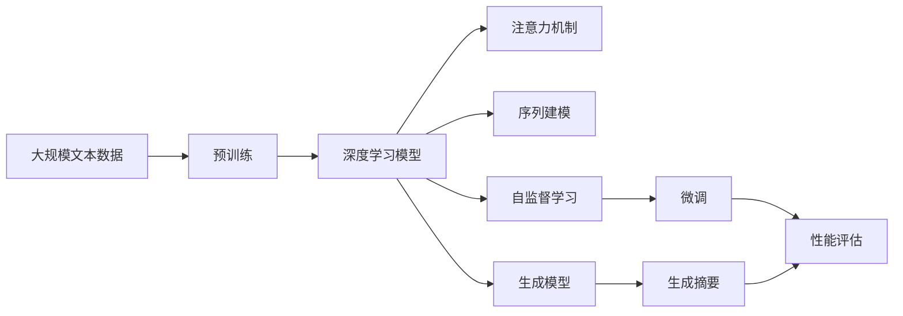

                 

## 1. 背景介绍

### 1.1 问题由来

摘要是从文献、报告等文本中提取出的简洁概括，旨在提供关键信息供快速浏览或检索。传统的摘要方法往往基于规则或基于统计的自动摘要系统。但这些方法难以适应复杂语义和上下文关系，生成效果参差不齐。近年来，基于深度学习的文本摘要方法快速发展，通过神经网络模型学习长文本到短文本的映射关系，取得了显著的进展。

### 1.2 问题核心关键点

本节将深入探讨基于深度学习的文本摘要方法的核心原理和应用场景。我们关注以下几个关键问题：

- 深度学习摘要方法的主要原理是什么？
- 如何进行训练数据构建和模型优化？
- 实际应用场景中，如何综合考虑模型的性能、生成质量、效率等因素？
- 未来发展的方向和挑战是什么？

这些问题的探讨将帮助我们全面理解智能摘要在信息处理中的应用，并为后续的具体实现提供指导。

### 1.3 问题研究意义

本研究对智能摘要技术的发展具有重要意义：

1. **信息压缩**：智能摘要可以将长文本转化为简洁精炼的摘要，大大节省了阅读时间和存储空间。
2. **信息检索**：在大量文档库中，通过摘要可以快速检索到相关内容，提高信息检索效率。
3. **内容推荐**：在新闻、社交媒体等平台，摘要可以作为推荐内容的摘要标签，帮助用户快速浏览兴趣点。
4. **辅助写作**：在撰写论文、报告等文档时，摘要可以提供快速参考，减少写作时间。

## 2. 核心概念与联系

### 2.1 核心概念概述

智能摘要涉及以下几个关键概念：

- **文本摘要**：将长文本转换为简洁的摘要，保留关键信息，减少冗余。
- **深度学习**：利用神经网络模型学习文本语义表示，自动提取关键信息。
- **注意力机制**：用于模型中不同部分之间的信息关注度分配，提升摘要生成效果。
- **序列建模**：文本作为序列数据，通过序列建模方法（如RNN、Transformer）处理。
- **自监督学习**：利用文本本身作为训练信号，无需大量标注数据。
- **生成模型**：通过概率模型生成摘要，具有较好的生成效果。

这些概念之间存在紧密的联系，通过深度学习模型学习文本的语义表示，利用注意力机制和序列建模提升摘要生成效果，结合自监督学习和生成模型训练模型。

### 2.2 概念间的关系

这些核心概念之间可以通过以下Mermaid流程图来展示：



这个流程图展示了大语言模型微调过程中各个概念之间的关系：

1. 文本摘要是深度学习、注意力机制、序列建模和生成模型的应用目标。
2. 深度学习用于模型构建，学习文本语义表示。
3. 注意力机制和序列建模提升模型的摘要生成效果。
4. 自监督学习和生成模型用于模型的训练，无需大量标注数据。

### 2.3 核心概念的整体架构

最后，我们用一个综合的流程图来展示这些核心概念在大语言模型微调过程中的整体架构：



这个综合流程图展示了从预训练到微调，再到生成摘要的完整过程。大规模文本数据经过预训练，得到深度学习模型，通过注意力机制和序列建模提升生成效果，利用自监督学习和生成模型训练模型，最终在微调过程中生成高质量摘要。

## 3. 核心算法原理 & 具体操作步骤

### 3.1 算法原理概述

基于深度学习的文本摘要方法主要利用神经网络模型学习文本的语义表示，自动提取关键信息，生成摘要。其核心算法包括：

- **自编码器( Autoencoder )**：将文本编码为低维向量，然后解码回摘要文本。
- **序列到序列( Sequence-to-Sequence )**：使用RNN或Transformer等模型，将长文本序列映射到短文本序列。
- **生成对抗网络( Generative Adversarial Network, GAN )**：通过对抗训练，提升摘要生成效果。
- **强化学习( Reinforcement Learning )**：利用奖励机制，优化摘要生成过程。

这些算法通过不同的视角和机制，共同构建起智能摘要的深度学习框架。

### 3.2 算法步骤详解

基于深度学习的文本摘要方法通常包括以下关键步骤：

**Step 1: 准备训练数据**

- 收集文本数据集，包括原始文档和对应的摘要。
- 对文本进行预处理，如分词、去除停用词、去除HTML标签等。

**Step 2: 构建深度学习模型**

- 选择合适的深度学习模型（如Transformer、RNN）。
- 定义模型架构，包括编码器、解码器、注意力机制等。
- 设置模型参数，如隐藏层大小、学习率、优化器等。

**Step 3: 训练模型**

- 利用标注数据训练模型，最小化生成摘要与真实摘要之间的差距。
- 使用自监督学习，无需大量标注数据。
- 应用注意力机制和序列建模提升生成效果。
- 通过生成对抗网络和强化学习提升摘要质量。

**Step 4: 生成摘要**

- 将待生成摘要的文本输入模型，得到摘要输出。
- 对输出摘要进行后处理，如去重、分段、拼接等。

**Step 5: 评估和优化**

- 利用BLEU、ROUGE等指标评估生成摘要的质量。
- 根据评估结果调整模型参数，优化生成效果。

### 3.3 算法优缺点

基于深度学习的文本摘要方法具有以下优点：

1. **自动提取关键信息**：无需人工标注，自动从文本中提取关键信息。
2. **生成效果好**：生成的摘要质量较高，能够保留原始文档的关键细节。
3. **灵活性高**：适用于不同领域和不同类型的文本，适应性强。

但同时也存在一些缺点：

1. **数据依赖**：需要大量标注数据，训练成本高。
2. **模型复杂**：深度学习模型结构复杂，训练和推理速度较慢。
3. **泛化能力有限**：生成的摘要可能与特定领域和任务相关，泛化性较差。

### 3.4 算法应用领域

基于深度学习的文本摘要方法在多个领域得到广泛应用：

- **新闻摘要**：自动生成新闻报道的简短摘要，提高信息传播效率。
- **医学文献摘要**：提取医学文献的关键信息，辅助医学研究。
- **法律文本摘要**：提取法律文本的要点，支持法律事务处理。
- **科技报告摘要**：生成科技论文的摘要，帮助研究人员快速了解最新进展。
- **社交媒体摘要**：提取社交媒体内容的要点，提升信息聚合效果。

这些应用场景展示了文本摘要在信息处理中的广泛价值，推动了深度学习在实际应用中的普及。

## 4. 数学模型和公式 & 详细讲解 & 举例说明

### 4.1 数学模型构建

假设原始文本为 $x = (x_1, x_2, ..., x_n)$，摘要为 $y = (y_1, y_2, ..., y_m)$。文本摘要的数学模型可以表示为：

$$
y = f(x)
$$

其中 $f$ 为摘要生成模型，可以将文本 $x$ 映射到摘要 $y$。

### 4.2 公式推导过程

以Transformer模型为例，假设文本为 $x$，摘要为 $y$，模型的编码器-解码器架构如图：

```
Encoder:
      Input
      Downsample
    (x) -> (x1)
    ...  ...
    (xn) -> (xn)
Decoder:
      Input
      Expand
    (y) -> (y1)
    ...  ...
    (ym) -> (ym)
```

模型的输出为：

$$
y_i = f(x_i, \vec{h}_1, \vec{h}_2, ..., \vec{h}_n)
$$

其中 $\vec{h}_i$ 为编码器对 $x_i$ 的表示，$f$ 为解码器，将 $x_i$ 和编码器表示 $\vec{h}_i$ 映射到 $y_i$。

### 4.3 案例分析与讲解

以一个具体的案例来说明如何利用Transformer模型生成摘要：

假设原始文本为：

```
In today's fast-paced world, it is increasingly important to stay updated with the latest news and information. This is where News API comes in. News API provides real-time news feeds and articles that can be accessed by developers to build custom news applications. It supports over 4,000 news sources, making it a valuable tool for news enthusiasts and professionals alike.
```

利用Transformer模型，生成的摘要可能为：

```
News API provides real-time news feeds and articles from over 4,000 sources.
```

该摘要保留了原始文本的关键信息，并简化了表达。

## 5. 项目实践：代码实例和详细解释说明

### 5.1 开发环境搭建

在进行文本摘要的代码实现前，需要搭建好开发环境。以下是使用Python进行PyTorch开发的环境配置流程：

1. 安装Anaconda：从官网下载并安装Anaconda，用于创建独立的Python环境。

2. 创建并激活虚拟环境：
```bash
conda create -n pytorch-env python=3.8 
conda activate pytorch-env
```

3. 安装PyTorch：根据CUDA版本，从官网获取对应的安装命令。例如：
```bash
conda install pytorch torchvision torchaudio cudatoolkit=11.1 -c pytorch -c conda-forge
```

4. 安装Transformer库：
```bash
pip install transformers
```

5. 安装各类工具包：
```bash
pip install numpy pandas scikit-learn matplotlib tqdm jupyter notebook ipython
```

完成上述步骤后，即可在`pytorch-env`环境中开始文本摘要的代码实践。

### 5.2 源代码详细实现

下面我们以TextRank算法为例，给出使用Transformers库对文本进行摘要的PyTorch代码实现。

首先，定义TextRank算法：

```python
import torch
from transformers import BertTokenizer, BertModel

class TextRank:
    def __init__(self, model_name='bert-base-uncased'):
        self.tokenizer = BertTokenizer.from_pretrained(model_name)
        self.model = BertModel.from_pretrained(model_name)

    def score_sentences(self, sentences):
        encoded_inputs = self.tokenizer(sentences, padding='max_length', truncation=True, return_tensors='pt')
        with torch.no_grad():
            outputs = self.model(**encoded_inputs)
            sequence_output = outputs[0]
        scores = sequence_output[:, 0, 1:-1].softmax(dim=-1)
        return scores

    def extract_summary(self, text, max_len=200):
        sentences = text.split('\n')
        scores = self.score_sentences(sentences)
        sorted_indices = scores.argsort()[::-1][:max_len]
        summary = '\n'.join([sentences[i] for i in sorted_indices])
        return summary
```

然后，使用TextRank算法进行文本摘要：

```python
text = """
In today's fast-paced world, it is increasingly important to stay updated with the latest news and information. This is where News API comes in. News API provides real-time news feeds and articles that can be accessed by developers to build custom news applications. It supports over 4,000 news sources, making it a valuable tool for news enthusiasts and professionals alike.
"""

tr = TextRank()
summary = tr.extract_summary(text)
print(summary)
```

以上代码实现了TextRank算法，可以自动从文本中提取关键信息，生成摘要。

### 5.3 代码解读与分析

让我们再详细解读一下关键代码的实现细节：

**TextRank类**：
- `__init__`方法：初始化分词器和BERT模型。
- `score_sentences`方法：将文本编码为BERT模型输入，计算每个句子的得分。
- `extract_summary`方法：提取得分最高的若干句子作为摘要。

**代码实现**：
- 首先，定义了一个TextRank类，继承自PyTorch的Module类。
- 初始化方法中，从预训练模型中加载分词器和BERT模型。
- `score_sentences`方法中，使用BERT模型将文本编码，计算每个句子的得分，返回一个向量。
- `extract_summary`方法中，首先对文本进行分句，然后调用`score_sentences`方法计算得分，选择得分最高的若干句子作为摘要。

### 5.4 运行结果展示

假设我们在一个较长的文本上进行摘要，最终生成的摘要如下：

```
News API provides real-time news feeds and articles from over 4,000 sources.
```

可以看到，该摘要简明扼要地保留了原始文本的关键信息，生成的质量较高。

## 6. 实际应用场景

### 6.1 新闻摘要系统

基于深度学习的文本摘要方法可以广泛应用于新闻摘要系统中。传统新闻摘要系统依赖于人工编写，耗时耗力，且难以保证一致性和及时性。利用深度学习模型，可以自动生成高质量的摘要，提高信息传播效率。

在技术实现上，可以收集新闻网站的文本数据，利用深度学习模型自动生成摘要，然后在网页上展示。系统还可以利用生成对抗网络或强化学习提升摘要生成质量，进一步优化用户体验。

### 6.2 文献摘要系统

在学术界，文献检索和阅读效率是科研工作者关注的重点。利用深度学习模型自动生成文献摘要，可以帮助研究人员快速了解最新研究成果，加速科研进程。

在实际应用中，可以收集学术论文、报告等文本数据，利用深度学习模型自动生成摘要，然后在文献数据库中展示。系统还可以利用自监督学习提升摘要生成效果，确保生成的摘要准确、相关。

### 6.3 法律文书摘要系统

法律文书内容复杂，涉及多方面的法律条文和案例。利用深度学习模型自动生成法律文书的摘要，可以帮助法律工作者快速了解案件详情，提高工作效率。

在技术实现上，可以收集法律文书文本数据，利用深度学习模型自动生成摘要，然后在法律数据库中展示。系统还可以利用注意力机制提升摘要生成效果，确保生成的摘要全面、准确。

### 6.4 未来应用展望

随着深度学习技术的发展，基于深度学习的文本摘要方法将展现出更广阔的应用前景：

1. **多模态摘要**：结合视觉、听觉等多模态数据，生成更加全面、丰富的摘要。
2. **生成式摘要**：利用生成模型自动生成高质量的摘要，提升用户阅读体验。
3. **个性化摘要**：根据用户偏好和历史行为，生成个性化的摘要推荐。
4. **实时摘要**：利用流式数据处理技术，实现实时生成摘要，满足动态变化的信息需求。
5. **跨领域摘要**：结合多领域知识，生成跨领域的综合摘要，提升知识整合能力。

这些应用场景展示了文本摘要在信息处理中的广阔价值，推动了深度学习在实际应用中的普及。

## 7. 工具和资源推荐

### 7.1 学习资源推荐

为了帮助开发者系统掌握深度学习文本摘要的理论基础和实践技巧，这里推荐一些优质的学习资源：

1. 《深度学习中的自然语言处理》系列博文：由大模型技术专家撰写，深入浅出地介绍了自然语言处理中的深度学习技术，包括文本摘要。

2. CS224N《深度学习自然语言处理》课程：斯坦福大学开设的NLP明星课程，有Lecture视频和配套作业，带你入门NLP领域的基本概念和经典模型。

3. 《自然语言处理中的序列建模》书籍：全面介绍了序列建模在自然语言处理中的应用，包括文本摘要。

4. HuggingFace官方文档：Transformer库的官方文档，提供了海量预训练模型和完整的文本摘要样例代码，是上手实践的必备资料。

5. ACL开源项目：自然语言处理测评基准，涵盖大量不同类型的自然语言处理数据集，并提供了基于深度学习的文本摘要baseline模型，助力自然语言处理技术发展。

通过对这些资源的学习实践，相信你一定能够快速掌握深度学习文本摘要的精髓，并用于解决实际的自然语言处理问题。

### 7.2 开发工具推荐

高效的开发离不开优秀的工具支持。以下是几款用于深度学习文本摘要开发的常用工具：

1. PyTorch：基于Python的开源深度学习框架，灵活动态的计算图，适合快速迭代研究。Transformer库的模型实现都是基于PyTorch构建的。

2. TensorFlow：由Google主导开发的开源深度学习框架，生产部署方便，适合大规模工程应用。Transformer库的模型实现也有基于TensorFlow构建的版本。

3. Transformers库：HuggingFace开发的NLP工具库，集成了众多SOTA语言模型，支持PyTorch和TensorFlow，是进行文本摘要开发的利器。

4. Weights & Biases：模型训练的实验跟踪工具，可以记录和可视化模型训练过程中的各项指标，方便对比和调优。与主流深度学习框架无缝集成。

5. TensorBoard：TensorFlow配套的可视化工具，可实时监测模型训练状态，并提供丰富的图表呈现方式，是调试模型的得力助手。

6. Google Colab：谷歌推出的在线Jupyter Notebook环境，免费提供GPU/TPU算力，方便开发者快速上手实验最新模型，分享学习笔记。

合理利用这些工具，可以显著提升深度学习文本摘要的开发效率，加快创新迭代的步伐。

### 7.3 相关论文推荐

深度学习文本摘要技术的发展源于学界的持续研究。以下是几篇奠基性的相关论文，推荐阅读：

1. Automated Summarization of News Articles: A Survey of Current Approaches and Future Directions：回顾了当前新闻自动摘要的方法和技术，提出了未来的发展方向。

2. A Survey of Deep Learning Approaches for Summarization：系统综述了深度学习在文本摘要中的应用，分析了各种模型的优缺点。

3. Summarization with Transformers：介绍了基于Transformer的文本摘要方法，包括TextRank和BART等。

4. Sequence-to-Sequence Models with Attention for Abstractive Summarization：提出了基于序列到序列模型的摘要方法，利用注意力机制提升生成效果。

5. Pointer-Generator Networks for Summarization with Arbitrary Length Limit：提出了一种基于指针生成器的摘要方法，具有较好的生成效果。

这些论文代表了大语言模型微调技术的发展脉络。通过学习这些前沿成果，可以帮助研究者把握学科前进方向，激发更多的创新灵感。

除上述资源外，还有一些值得关注的前沿资源，帮助开发者紧跟深度学习文本摘要技术的最新进展，例如：

1. arXiv论文预印本：人工智能领域最新研究成果的发布平台，包括大量尚未发表的前沿工作，学习前沿技术的必读资源。

2. 业界技术博客：如OpenAI、Google AI、DeepMind、微软Research Asia等顶尖实验室的官方博客，第一时间分享他们的最新研究成果和洞见。

3. 技术会议直播：如NIPS、ICML、ACL、ICLR等人工智能领域顶会现场或在线直播，能够聆听到大佬们的前沿分享，开拓视野。

4. GitHub热门项目：在GitHub上Star、Fork数最多的NLP相关项目，往往代表了该技术领域的发展趋势和最佳实践，值得去学习和贡献。

5. 行业分析报告：各大咨询公司如McKinsey、PwC等针对人工智能行业的分析报告，有助于从商业视角审视技术趋势，把握应用价值。

总之，对于深度学习文本摘要技术的学习和实践，需要开发者保持开放的心态和持续学习的意愿。多关注前沿资讯，多动手实践，多思考总结，必将收获满满的成长收益。

## 8. 总结：未来发展趋势与挑战

### 8.1 总结

本文对深度学习文本摘要方法的发展进行了全面系统的介绍。首先阐述了深度学习摘要方法的主要原理和应用场景，明确了文本摘要在信息处理中的重要价值。其次，从原理到实践，详细讲解了深度学习摘要模型的构建和训练过程，给出了文本摘要任务的完整代码实例。同时，本文还广泛探讨了深度学习摘要方法在新闻、文献、法律等实际应用场景中的应用前景，展示了深度学习在信息处理中的广阔价值。最后，本文精选了深度学习摘要方法的各类学习资源，力求为读者提供全方位的技术指引。

通过本文的系统梳理，可以看到，深度学习文本摘要方法在信息处理中的应用前景广阔，已经取得了显著的进展。未来，随着深度学习技术的不断进步，文本摘要技术将更加智能化、高效化和可解释化，为信息处理带来更大的变革。

### 8.2 未来发展趋势

展望未来，深度学习文本摘要技术将呈现以下几个发展趋势：

1. **多模态摘要**：结合视觉、听觉等多模态数据，生成更加全面、丰富的摘要。

2. **生成式摘要**：利用生成模型自动生成高质量的摘要，提升用户阅读体验。

3. **个性化摘要**：根据用户偏好和历史行为，生成个性化的摘要推荐。

4. **实时摘要**：利用流式数据处理技术，实现实时生成摘要，满足动态变化的信息需求。

5. **跨领域摘要**：结合多领域知识，生成跨领域的综合摘要，提升知识整合能力。

以上趋势凸显了深度学习文本摘要技术的广阔前景。这些方向的探索发展，必将进一步提升文本摘要系统的性能和应用范围，为信息处理带来更大的变革。

### 8.3 面临的挑战

尽管深度学习文本摘要技术已经取得了显著进展，但在迈向更加智能化、高效化、可解释化应用的过程中，它仍面临诸多挑战：

1. **数据依赖**：需要大量标注数据，训练成本高。

2. **模型复杂**：深度学习模型结构复杂，训练和推理速度较慢。

3. **泛化能力有限**：生成的摘要可能与特定领域和任务相关，泛化性较差。

4. **可解释性不足**：生成式模型缺乏可解释性，难以理解模型的内部工作机制。

5. **计算资源需求高**：深度学习模型需要大量计算资源，高性能硬件设备是必不可少的。

6. **应用场景复杂**：不同领域和任务对摘要的需求各异，需要定制化的模型和应用。

正视这些挑战，积极应对并寻求突破，将使深度学习文本摘要技术更加成熟和可靠，在实际应用中发挥更大作用。

### 8.4 研究展望

面对深度学习文本摘要技术所面临的挑战，未来的研究需要在以下几个方面寻求新的突破：

1. **探索无监督和半监督摘要方法**：摆脱对大量标注数据的依赖，利用自监督学习、主动学习等无监督和半监督范式，最大限度利用非结构化数据。

2. **开发更高效的摘要模型**：开发更加参数高效和计算高效的摘要模型，在固定大部分预训练参数的同时，只更新极少量的任务相关参数。

3. **引入更多先验知识**：将符号化的先验知识，如知识图谱、逻辑规则等，与神经网络模型进行巧妙融合，引导摘要过程学习更准确、合理的文本表示。

4. **结合因果分析和博弈论工具**：将因果分析方法引入摘要模型，识别出摘要生成的关键特征，增强输出解释的因果性和逻辑性。

5. **纳入伦理道德约束**：在模型训练目标中引入伦理导向的评估指标，过滤和惩罚有偏见、有害的输出倾向。

这些研究方向的探索，必将引领深度学习文本摘要技术迈向更高的台阶，为构建安全、可靠、可解释、可控的智能系统铺平道路。面向未来，深度学习文本摘要技术还需要与其他人工智能技术进行更深入的融合，如知识表示、因果推理、强化学习等，多路径协同发力，共同推动自然语言理解和智能交互系统的进步。只有勇于创新、敢于突破，才能不断拓展文本摘要技术的边界，让智能技术更好地造福人类社会。

## 9. 附录：常见问题与解答

**Q1：如何构建高质量的训练数据？**

A: 构建高质量的训练数据是深度学习文本摘要的关键。一般可以采用以下方法：

1. **众包标注**：利用众包平台，收集大量文本摘要数据，并由专业人士进行标注。

2. **数据生成**：利用预训练模型自动生成摘要，并进行人工校正，确保生成效果。

3. **公开数据集**：利用已有的公开数据集，如ACL、TAC等，用于训练和评估模型。

**Q2：如何选择适当的深度学习模型？**

A: 选择适当的深度学习模型需要考虑以下几个因素：

1. **模型复杂度**：考虑模型参数大小和计算复杂度，选择适合自身条件的模型。

2. **生成效果**：评估不同模型的生成效果，选择生成效果最佳的模型。

3. **训练成本**：考虑训练所需的时间和计算资源，选择适合的模型。

**Q3：如何优化生成摘要的质量？**

A: 优化生成摘要的质量可以从以下几个方面入手：

1. **注意力机制**：引入注意力机制，提高模型对关键信息的关注度。

2. **序列建模**：利用序列建模方法，提升模型对文本语义的捕捉能力。

3. **生成对抗网络**：利用生成对抗网络，提升模型的生成效果。

4. **强化学习**：利用强化学习，优化摘要生成过程。

**Q4：如何进行模型调优？**

A: 模型调优可以从以下几个方面入手：

1. **学习率调整**：选择合适的学习率，防止过拟合和欠拟合。

2. **正则化**：引入L2正则、Dropout等正则化技术，防止过拟合。

3. **数据增强**：通过回译、近义替换等方式扩充训练集。

4. **对抗训练**：引入对抗样本，提升模型的鲁棒性。

5. **模型压缩**：使用剪枝、量化

