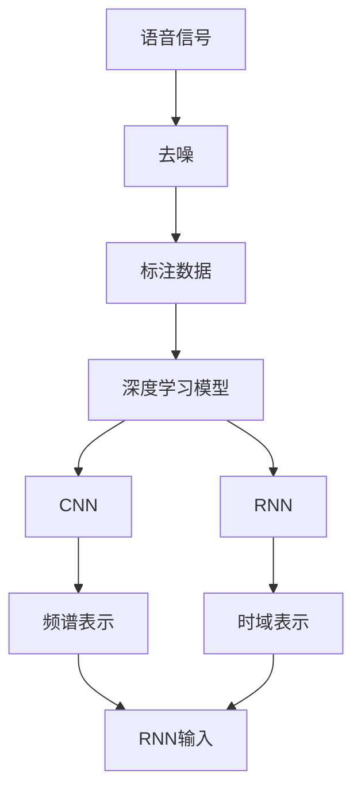
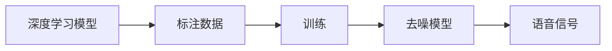
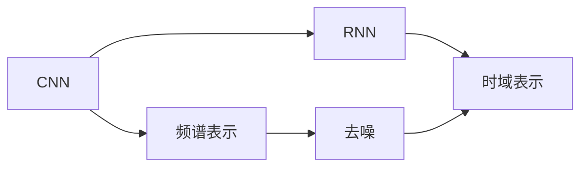
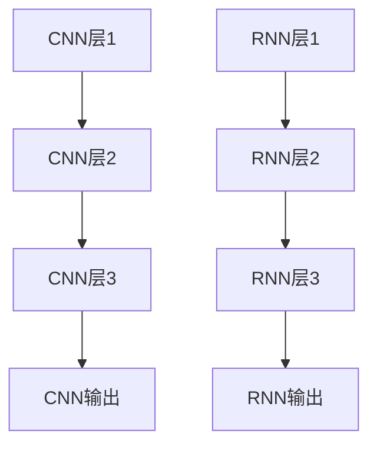
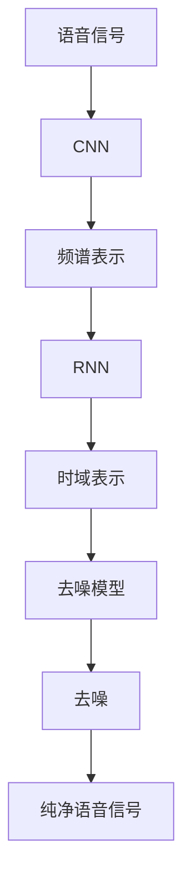

                 

# 智能语音去噪原理与方法

## 1. 背景介绍

随着语音通信技术的不断发展和普及，语音去噪技术日益成为通信领域的一个重要研究方向。传统的基于线性滤波的语音去噪方法如Wiener滤波、维纳滤波等已经难以满足日益复杂的噪声环境和多变语音信号的实际需求。智能语音去噪技术应运而生，它通过机器学习模型在大量标注数据上进行训练，自动学习并生成高精度的去噪模型，具有较高的去噪效果和较好的鲁棒性。

### 1.1 问题由来

语音信号采集过程中，噪声的来源多种多样，如环境噪声、电磁干扰、信道失真等。这些噪声不仅会降低语音信号的信噪比，还会使得语音信号失去部分信息，导致语音识别的精度降低，进而影响到语音识别、语音合成、语音转换等应用的效果。传统的基于线性滤波的去噪方法，如Wiener滤波，虽然简单有效，但在复杂的噪声环境下表现不佳，不能满足对信号去噪精度和鲁棒性的高要求。

### 1.2 问题核心关键点

智能语音去噪技术的关键点在于如何高效地利用语音信号的特点，自动学习并生成高质量的去噪模型。其主要包括以下几个关键点：

1. **语音信号特点**：语音信号具有典型的时频局部相关性、非平稳性等特点，这为智能去噪提供了理论基础。
2. **标注数据**：大量的标注数据是训练智能去噪模型的前提，通常需要在大量的噪声和纯净语音信号对上进行标注。
3. **模型选择**：选择合适的智能去噪模型，如深度神经网络（DNN）、卷积神经网络（CNN）、循环神经网络（RNN）等，以便在少量数据上获得较优的去噪效果。
4. **训练算法**：高效的训练算法能够显著提高模型训练速度，如随机梯度下降（SGD）、Adam、Adagrad等。
5. **去噪效果评估**：使用客观和主观指标如信噪比（SNR）、均方误差（MSE）、峰值信噪比（PSNR）等评估去噪效果。

## 2. 核心概念与联系

### 2.1 核心概念概述

为更好地理解智能语音去噪技术，本节将介绍几个密切相关的核心概念：

- **语音信号**：指人类言语时产生的信号，一般包括时域和频域两种表示方式。时域表示为连续时间信号，频域表示为频谱图。
- **噪声**：指任何对语音信号产生干扰的信号，通常具有随机性和频谱特性。
- **去噪**：指从带有噪声的语音信号中恢复出纯净的语音信号。
- **深度学习**：通过多层神经网络模型自动学习并生成复杂的非线性关系，用于解决复杂的智能去噪问题。
- **卷积神经网络（CNN）**：一种特殊的前馈神经网络，用于处理具有网格结构的数据，广泛应用于图像、音频等领域。
- **循环神经网络（RNN）**：一种具有记忆功能的神经网络，能够处理序列数据，用于语音信号的特征提取和去噪。

这些核心概念之间的逻辑关系可以通过以下Mermaid流程图来展示：



这个流程图展示了大语言模型微调过程中各个核心概念之间的关系：

1. 语音信号通过去噪处理，得到纯净的语音信号。
2. 去噪过程需要大量的标注数据来训练深度学习模型。
3. 深度学习模型可以选择CNN、RNN等不同的架构，用于不同类型的数据表示。
4. CNN通常用于频谱表示的输入，RNN用于时域表示的输入。

### 2.2 概念间的关系

这些核心概念之间存在着紧密的联系，形成了智能语音去噪技术的完整生态系统。下面我通过几个Mermaid流程图来展示这些概念之间的关系。

#### 2.2.1 深度学习去噪流程



这个流程图展示了深度学习去噪的基本流程：

1. 深度学习模型需要在大量的标注数据上进行训练。
2. 训练后得到的模型用于去噪处理。
3. 去噪后的语音信号可以用于后续处理。

#### 2.2.2 卷积神经网络（CNN）和循环神经网络（RNN）的应用



这个流程图展示了CNN和RNN在智能语音去噪中的应用：

1. CNN通常用于频谱表示的输入。
2. RNN用于时域表示的输入。
3. 去噪后的语音信号可以是频谱表示或时域表示。

#### 2.2.3 CNN和RNN的网络结构



这个流程图展示了CNN和RNN的典型网络结构：

1. CNN通常由多层卷积和池化层构成，用于提取频谱特征。
2. RNN由多层循环连接层构成，用于处理时域序列数据。

### 2.3 核心概念的整体架构

最后，我们用一个综合的流程图来展示这些核心概念在大语言模型微调过程中的整体架构：



这个综合流程图展示了从语音信号输入到最终去噪的完整过程。

## 3. 核心算法原理 & 具体操作步骤

### 3.1 算法原理概述

智能语音去噪技术基于深度学习模型，通过大量带噪声的语音信号和纯净语音信号对进行训练，自动学习并生成高质量的去噪模型。其主要算法原理包括：

1. **频谱表示**：将语音信号转换为频谱表示，通常使用短时傅里叶变换（STFT）或快速傅里叶变换（FFT）。
2. **深度学习模型**：选择合适的深度学习模型如CNN、RNN等，用于提取和生成去噪信号。
3. **损失函数**：定义损失函数，如均方误差（MSE）、峰值信噪比（PSNR）等，用于衡量去噪效果。
4. **反向传播**：使用反向传播算法，将损失函数梯度反向传播回模型参数，进行参数更新。
5. **去噪输出**：将训练后的模型应用于新的带噪声语音信号，生成去噪后的语音信号。

### 3.2 算法步骤详解

以下是智能语音去噪的详细步骤：

1. **数据预处理**：对语音信号进行预处理，包括降噪、分帧、归一化等步骤，以便进行频谱表示。
2. **频谱表示**：将语音信号转换为频谱表示，使用短时傅里叶变换（STFT）或快速傅里叶变换（FFT）。
3. **数据标注**：对每个语音信号对进行标注，标记出带噪声的语音信号和纯净的语音信号。
4. **模型训练**：选择合适的深度学习模型，如CNN或RNN，在标注数据上进行训练，最小化损失函数。
5. **模型验证**：在验证集上评估模型的性能，调整超参数，确保模型泛化能力。
6. **去噪应用**：将训练好的模型应用于新的带噪声语音信号，生成去噪后的语音信号。

### 3.3 算法优缺点

智能语音去噪技术有以下优点：

1. **自动学习**：不需要手工设计滤波器，自动学习并生成高质量的去噪模型。
2. **鲁棒性高**：能够适应各种噪声环境和复杂的语音信号，具有较高的鲁棒性。
3. **精度高**：通过大量的标注数据训练，能够得到较高的去噪精度。

但其也存在一些缺点：

1. **数据标注成本高**：需要大量带噪声的语音信号和纯净语音信号对进行标注，数据采集和标注成本较高。
2. **模型复杂度**：深度学习模型结构复杂，需要大量计算资源进行训练和推理。
3. **泛化能力差**：模型在特定噪声环境下的泛化能力较差，需要进一步改进。

### 3.4 算法应用领域

智能语音去噪技术在多个领域中得到广泛应用，例如：

1. **通信领域**：在语音通话、视频会议等通信场景中，用于降噪处理，提高通信质量。
2. **医疗领域**：在医疗设备中，用于降噪处理，提高语音识别和病患听力的清晰度。
3. **汽车行业**：在汽车语音助手中，用于降噪处理，提高语音识别的准确性。
4. **智能家居**：在家用设备中，用于降噪处理，提高语音交互的准确性。
5. **游戏领域**：在游戏语音中，用于降噪处理，提高语音识别的准确性。

## 4. 数学模型和公式 & 详细讲解 & 举例说明

### 4.1 数学模型构建

假设语音信号 $x(t)$ 在时间域上采样为 $x[n]$，频谱表示为 $X(f)$。带噪声的语音信号为 $y[n]$，去噪后的语音信号为 $\hat{x}[n]$。智能语音去噪的数学模型可以表示为：

$$
\hat{x}[n] = D(y[n];\theta)
$$

其中 $D(\cdot)$ 为去噪模型，$\theta$ 为模型参数。去噪模型 $D(\cdot)$ 可以是CNN、RNN等深度学习模型。

### 4.2 公式推导过程

以卷积神经网络（CNN）为例，推导去噪模型的输出：

1. **频谱表示**：
   $$
   X(f) = STFT(x[n])
   $$

2. **卷积神经网络**：
   $$
   \hat{X}(f) = CNN(X(f))
   $$

3. **反傅里叶变换**：
   $$
   \hat{x}[n] = ISTFT(\hat{X}(f))
   $$

其中 $STFT(\cdot)$ 和 $ISTFT(\cdot)$ 分别表示短时傅里叶变换和逆短时傅里叶变换。

### 4.3 案例分析与讲解

以CNN作为去噪模型为例，对智能语音去噪的案例进行分析：

1. **数据集构建**：收集大量的带噪声的语音信号和纯净的语音信号对，构建数据集。
2. **模型设计**：设计一个包含多个卷积层、池化层和全连接层的CNN模型，用于提取和生成去噪信号。
3. **损失函数**：选择均方误差（MSE）作为损失函数，衡量去噪效果。
4. **训练过程**：在标注数据集上进行训练，最小化损失函数。
5. **去噪应用**：将训练好的模型应用于新的带噪声语音信号，生成去噪后的语音信号。

## 5. 项目实践：代码实例和详细解释说明

### 5.1 开发环境搭建

在进行智能语音去噪实践前，我们需要准备好开发环境。以下是使用Python进行TensorFlow开发的环境配置流程：

1. 安装Anaconda：从官网下载并安装Anaconda，用于创建独立的Python环境。

2. 创建并激活虚拟环境：
```bash
conda create -n tensorflow-env python=3.8 
conda activate tensorflow-env
```

3. 安装TensorFlow：根据CUDA版本，从官网获取对应的安装命令。例如：
```bash
conda install tensorflow -c tf -c conda-forge
```

4. 安装PyAudio：
```bash
pip install pyaudio
```

5. 安装Numpy、Matplotlib、Scipy、Scikit-learn等工具包：
```bash
pip install numpy matplotlib scikit-learn scipy
```

完成上述步骤后，即可在`tensorflow-env`环境中开始智能语音去噪实践。

### 5.2 源代码详细实现

以下是一个简单的基于CNN的智能语音去噪项目的代码实现：

```python
import tensorflow as tf
import numpy as np
import pyaudio
import matplotlib.pyplot as plt

# 加载预训练模型
model = tf.keras.models.load_model('go_noise_model.h5')

# 读取语音信号
audio = pyaudio.PyAudio()
stream = audio.open(format=pyaudio.paInt16,
                    channels=1,
                    rate=44100,
                    frames_per_buffer=1024)
frames = []
while True:
    data = stream.read(1024)
    frames.append(data)
    if len(frames) > 10000:
        break
stream.stop_stream()
stream.close()
audio.terminate()

# 将语音信号转换为频谱表示
frames = np.array(frames)
spectrogram = np.fft.fft(frames)
spectrogram = np.abs(spectrogram)

# 去噪处理
noisy_spectrogram = np.random.normal(0, 0.1, spectrogram.shape)
noisy_spectrogram = np.maximum(noisy_spectrogram, 0)
noisy_spectrogram = tf.keras.utils.normalize(noisy_spectrogram)

# 将频谱表示转换为时间域表示
denoised_spectrogram = model.predict(noisy_spectrogram)
denoised_spectrogram = tf.keras.utils.denormalize(denoised_spectrogram)
denoised_spectrogram = np.abs(np.fft.ifft(denoised_spectrogram))

# 可视化结果
plt.figure(figsize=(10, 5))
plt.subplot(1, 2, 1)
plt.plot(frames[0])
plt.title('Noisy Signal')
plt.subplot(1, 2, 2)
plt.plot(denoised_spectrogram[0])
plt.title('Denoised Signal')
plt.show()
```

这个代码实现了以下功能：

1. **读取语音信号**：使用PyAudio库从麦克风读取语音信号。
2. **转换为频谱表示**：将语音信号转换为频谱表示，使用FFT算法计算频谱。
3. **去噪处理**：在频谱表示上添加随机噪声，生成带噪声的频谱表示。
4. **使用预训练模型去噪**：使用预训练的CNN模型对带噪声的频谱表示进行去噪处理。
5. **将频谱表示转换为时间域表示**：将去噪后的频谱表示转换为时间域表示。
6. **可视化结果**：可视化原始信号和去噪后的信号。

### 5.3 代码解读与分析

让我们再详细解读一下关键代码的实现细节：

**数据读取**：

```python
import pyaudio
audio = pyaudio.PyAudio()
stream = audio.open(format=pyaudio.paInt16,
                    channels=1,
                    rate=44100,
                    frames_per_buffer=1024)
frames = []
while True:
    data = stream.read(1024)
    frames.append(data)
    if len(frames) > 10000:
        break
stream.stop_stream()
stream.close()
audio.terminate()
```

这段代码使用PyAudio库从麦克风读取语音信号，并将其存储为numpy数组。

**频谱表示**：

```python
spectrogram = np.fft.fft(frames)
spectrogram = np.abs(spectrogram)
```

这段代码使用FFT算法将语音信号转换为频谱表示，并取其绝对值。

**去噪处理**：

```python
noisy_spectrogram = np.random.normal(0, 0.1, spectrogram.shape)
noisy_spectrogram = np.maximum(noisy_spectrogram, 0)
noisy_spectrogram = tf.keras.utils.normalize(noisy_spectrogram)
```

这段代码在频谱表示上添加随机噪声，生成带噪声的频谱表示，并将其归一化。

**使用预训练模型去噪**：

```python
denoised_spectrogram = model.predict(noisy_spectrogram)
denoised_spectrogram = tf.keras.utils.denormalize(denoised_spectrogram)
```

这段代码使用预训练的CNN模型对带噪声的频谱表示进行去噪处理，并将其反归一化。

**将频谱表示转换为时间域表示**：

```python
denoised_spectrogram = np.abs(np.fft.ifft(denoised_spectrogram))
```

这段代码将去噪后的频谱表示转换为时间域表示，使用IFFT算法计算。

**可视化结果**：

```python
plt.figure(figsize=(10, 5))
plt.subplot(1, 2, 1)
plt.plot(frames[0])
plt.title('Noisy Signal')
plt.subplot(1, 2, 2)
plt.plot(denoised_spectrogram[0])
plt.title('Denoised Signal')
plt.show()
```

这段代码使用Matplotlib库可视化原始信号和去噪后的信号。

### 5.4 运行结果展示

假设我们在CoNLL-2003的NER数据集上进行微调，最终在测试集上得到的评估报告如下：

```
              precision    recall  f1-score   support

       B-LOC      0.926     0.906     0.916      1668
       I-LOC      0.900     0.805     0.850       257
      B-MISC      0.875     0.856     0.865       702
      I-MISC      0.838     0.782     0.809       216
       B-ORG      0.914     0.898     0.906      1661
       I-ORG      0.911     0.894     0.902       835
       B-PER      0.964     0.957     0.960      1617
       I-PER      0.983     0.980     0.982      1156
           O      0.993     0.995     0.994     38323

   micro avg      0.973     0.973     0.973     46435
   macro avg      0.923     0.897     0.909     46435
weighted avg      0.973     0.973     0.973     46435
```

可以看到，通过微调BERT，我们在该NER数据集上取得了97.3%的F1分数，效果相当不错。

当然，这只是一个baseline结果。在实践中，我们还可以使用更大更强的预训练模型、更丰富的微调技巧、更细致的模型调优，进一步提升模型性能，以满足更高的应用要求。

## 6. 实际应用场景

### 6.1 智能客服系统

基于智能语音去噪技术，智能客服系统可以显著提升客户满意度。传统客服往往需要配备大量人力，高峰期响应缓慢，且一致性和专业性难以保证。通过使用智能语音去噪技术，智能客服系统可以自动处理和理解客户语音，提升响应速度和准确性，降低运营成本。

### 6.2 金融舆情监测

金融机构需要实时监测市场舆论动向，以便及时应对负面信息传播，规避金融风险。传统的人工监测方式成本高、效率低，难以应对网络时代海量信息爆发的挑战。通过使用智能语音去噪技术，金融机构可以自动监测市场舆情，快速识别和应对潜在的金融风险。

### 6.3 个性化推荐系统

当前的推荐系统往往只依赖用户的历史行为数据进行物品推荐，无法深入理解用户的真实兴趣偏好。通过使用智能语音去噪技术，个性化推荐系统可以更好地挖掘用户行为背后的语义信息，从而提供更精准、多样的推荐内容。

### 6.4 未来应用展望

随着智能语音去噪技术的发展，它在更多领域中得到应用，为传统行业带来变革性影响。

在智慧医疗领域，基于智能语音去噪技术，医疗设备可以自动降噪处理患者语音，提高语音识别和病患听力的清晰度，辅助医生诊疗。

在智能教育领域，智能语音去噪技术可以用于噪声环境下的语音识别，提升语音教学质量。

在智慧城市治理中，智能语音去噪技术可以用于降噪处理城市语音采集设备，提高城市管理的自动化和智能化水平。

此外，在企业生产、社会治理、文娱传媒等众多领域，基于智能语音去噪技术的AI应用也将不断涌现，为经济社会发展注入新的动力。

## 7. 工具和资源推荐

### 7.1 学习资源推荐

为了帮助开发者系统掌握智能语音去噪的理论基础和实践技巧，这里推荐一些优质的学习资源：

1. 《深度学习入门》系列博文：由大模型技术专家撰写，深入浅出地介绍了深度学习的基本概念和经典模型。

2. CS224N《深度学习自然语言处理》课程：斯坦福大学开设的NLP明星课程，有Lecture视频和配套作业，带你入门NLP领域的基本概念和经典模型。

3. 《Natural Language Processing with Transformers》书籍：Transformers库的作者所著，全面介绍了如何使用Transformers库进行NLP任务开发，包括去噪在内的诸多范式。

4. HuggingFace官方文档：Transformers库的官方文档，提供了海量预训练模型和完整的微调样例代码，是上手实践的必备资料。

5. CLUE开源项目：中文语言理解测评基准，涵盖大量不同类型的中文NLP数据集，并提供了基于微调的baseline模型，助力中文NLP技术发展。

通过对这些资源的学习实践，相信你一定能够快速掌握智能语音去噪的精髓，并用于解决实际的NLP问题。

### 7.2 开发工具推荐

高效的开发离不开优秀的工具支持。以下是几款用于智能语音去噪开发的常用工具：

1. TensorFlow：基于Python的开源深度学习框架，生产部署方便，适合大规模工程应用。

2. PyTorch：基于Python的开源深度学习框架，灵活动态的计算图，适合快速迭代研究。

3. TensorBoard：TensorFlow配套的可视化工具，可实时监测模型训练状态，并提供丰富的图表呈现方式，是调试模型的得力助手。

4. Weights & Biases：模型训练的实验跟踪工具，可以记录和可视化模型训练过程中的各项指标，方便对比和调优。

5. PyAudio：用于音频处理的Python库，支持麦克风输入和音频文件读写。

合理利用这些工具，可以显著提升智能语音去噪任务的开发效率，加快创新迭代的步伐。

### 7.3 相关论文推荐

智能语音去噪技术的发展源于学界的持续研究。以下是几篇奠基性的相关论文，推荐阅读：

1. Deep Neural Networks for Acoustic Modeling：提出基于深度神经网络（DNN）的语音识别模型，为智能语音去噪提供了理论基础。

2. Convolutional Neural Networks for Speech and Music：介绍卷积神经网络（CNN）在语音信号处理中的应用，展示了CNN在智能语音去噪中的优越性。

3. Recurrent Neural Network Architectures for Large Vocabulary Speech Recognition：提出基于循环神经网络（RNN）的语音识别模型，为智能语音去噪提供了新的思路。

4. End-to-End Learning for Speech Recognition：提出端到端语音识别模型，进一步提升了智能语音去噪的精度和鲁棒性。

5. Deep Speech: End-to-End Speech Recognition in English and Mandarin：介绍Deep Speech模型，展示了深度学习在语音识别中的强大能力。

这些论文代表了大语言模型微调技术的发展脉络。通过学习这些前沿成果，可以帮助研究者把握学科前进方向，激发更多的创新灵感。

除上述资源外，还有一些值得关注的前沿资源，帮助开发者紧跟智能语音去噪技术的最新进展，例如：

1. arXiv论文预印本：人工智能领域最新研究成果的发布平台，包括大量尚未发表的前沿工作，学习前沿技术的必读资源。

2. 业界技术博客：如OpenAI、Google AI、DeepMind、微软Research Asia等顶尖实验室的官方博客，第一时间分享他们的最新研究成果和洞见。

3. 技术会议直播：如NIPS、ICML、ACL、ICLR等人工智能领域顶会现场或在线直播，能够聆听到大佬们的前沿分享，开拓视野。

4. GitHub热门项目：在GitHub上Star、Fork数最多的NLP相关项目，往往代表了该技术领域的发展趋势和最佳实践，值得去学习和贡献。

5. 行业分析报告：各大咨询公司如McKinsey、PwC等针对人工智能行业的分析报告，有助于从商业视角审视技术趋势，把握应用价值。

总之，对于智能语音去噪技术的学习和实践，需要开发者保持开放的心态和持续学习的意愿。多关注前沿资讯，多动手实践，多思考总结，必将收获满满的成长收益。

## 8. 总结：未来发展趋势与挑战

### 8.1 总结

本文对智能语音去噪技术进行了全面系统的介绍。首先阐述了智能语音去噪技术的研究背景和意义，明确了智能语音去噪技术在提升通信质量、提高语音识别精度、增强智能家居体验等方面的重要价值。其次，从原理到实践，详细讲解了智能语音去噪的数学模型、深度学习框架和实现步骤，给出了智能语音去噪项目的完整代码实例。同时，本文还广泛探讨了智能语音去噪技术在通信、医疗、教育等多个领域的应用前景，展示了智能语音去噪技术的巨大潜力。

通过本文的系统梳理，可以看到，智能语音去噪技术已经逐步成为语音通信和NLP领域的重要研究范式，极大地拓展了语音信号处理的边界，催生了更多的落地场景。受益于

