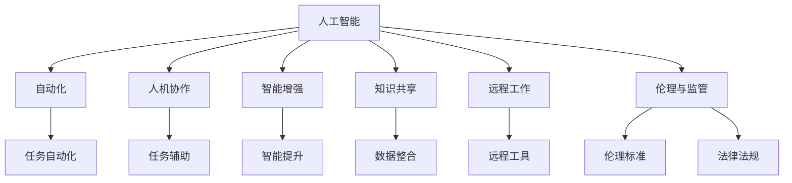

                 

# 未来工作形态与AI的共存

> 关键词：人工智能,自动化,人机协作,智能增强,知识共享,远程工作,就业结构

## 1. 背景介绍

### 1.1 问题由来

随着人工智能(AI)技术的不断发展和应用，未来的工作形态正在发生深刻变化。AI与人的协作变得越来越紧密，形成了新型的智能增强、自动化和知识共享模式。与此同时，AI技术的发展也在重塑就业结构，影响工作性质和内容。如何实现AI与人类的和谐共存，充分发挥AI的潜力，同时保护人类的就业和福祉，成为了一个重要的研究课题。

### 1.2 问题核心关键点

未来工作形态与AI的共存主要涉及以下几个核心问题：

- 自动化替代与就业转移：AI技术的普及和自动化水平的提升将替代一些重复性、低技能的工作，但也会催生新类型的工作，需要工人进行技能升级和转型。
- 人机协作与增强：AI作为工具或伙伴，可以辅助人类完成复杂任务，提升工作效率，并释放出人类更多创造性和战略性工作时间。
- 知识共享与创新：AI在数据挖掘、模式识别、自然语言处理等方面具有优势，能够助力知识共享与创新，促进跨学科、跨领域的合作。
- 远程工作与全球协作：AI技术支持下的远程工作和协作工具，可以打破地理限制，实现更高效的全球化协同。
- 伦理与监管：AI技术的应用需要遵守伦理和法律规定，避免对就业、隐私、安全等方面的负面影响。

这些关键点构成了未来工作形态与AI共存的基本框架，涉及技术、社会、经济、伦理等多个方面。

### 1.3 问题研究意义

研究未来工作形态与AI的共存，对于理解AI技术的未来走向、优化劳动力市场结构、推动经济和社会发展、保障人类福祉具有重要意义：

1. 促进技术创新：通过人机协作与增强，AI与人类共同探索新领域，推动更多前沿技术的创新和应用。
2. 优化就业结构：了解AI对就业的正面与负面影响，制定合理的政策以促进就业转移和技能转型。
3. 提升生产力：通过自动化和智能增强，提高工作效率和质量，释放人类更多创造性工作时间。
4. 推动全球协作：AI技术支持下的远程工作与协作，有助于打破地理界限，促进全球化发展。
5. 保障伦理安全：明确AI技术的伦理与法律边界，确保其应用的安全性和公正性。

## 2. 核心概念与联系

### 2.1 核心概念概述

为了更好地理解未来工作形态与AI的共存，本节将介绍几个密切相关的核心概念：

- 人工智能(AI)：通过模拟人类智能行为，使计算机系统具备识别、推理、学习、决策等能力的技术。
- 自动化(Automation)：使用AI技术实现任务的自动执行和优化，以减少人为操作和错误。
- 人机协作(Human-Machine Collaboration)：AI与人类共同完成复杂任务，提升工作效率和效果。
- 智能增强(Intelligence Augmentation)：利用AI技术提升人类智能水平，增强人类创造力和决策能力。
- 知识共享(Knowledge Sharing)：通过AI技术进行数据和知识的整合与共享，促进跨领域、跨学科的合作。
- 远程工作(Remote Work)：通过AI技术支持，实现跨地域的协作与沟通。
- 伦理与监管(Ethics & Regulation)：确保AI技术的应用符合伦理标准和法律法规。

这些核心概念之间的逻辑关系可以通过以下Mermaid流程图来展示：



这个流程图展示了大语言模型微调过程中各个核心概念的关系和作用：

1. 人工智能通过自动化实现任务自动化，通过人机协作和智能增强提升工作效率，通过知识共享和远程工作拓展工作边界，并通过伦理与监管保障应用的安全性。
2. 自动化是人工智能的重要实现形式，通过自动化执行任务，减少人为操作。
3. 人机协作使AI与人类共同完成复杂任务，提升工作质量。
4. 智能增强通过AI技术提升人类智能，增强决策能力和创造力。
5. 知识共享促进跨领域合作，通过AI进行数据和知识的整合与共享。
6. 远程工作打破了地理限制，通过AI技术支持实现高效协作。
7. 伦理与监管确保AI技术的应用符合伦理标准和法律法规。

### 2.2 概念间的关系

这些核心概念之间存在着紧密的联系，形成了未来工作形态与AI共存的完整生态系统。下面我们通过几个Mermaid流程图来展示这些概念之间的关系。

#### 2.2.1 未来工作形态与AI共存的基本架构

```mermaid
graph LR
    A[未来工作形态] --> B[自动化]
    A --> C[人机协作]
    A --> D[智能增强]
    A --> E[知识共享]
    A --> F[远程工作]
    B --> G[任务自动化]
    C --> H[任务辅助]
    D --> I[智能提升]
    E --> J[数据整合]
    F --> K[远程工具]
    G --> L[智能执行]
    H --> M[协作提升]
    I --> N[创新加速]
    J --> O[知识获取]
    K --> P[协作优化]
    L --> Q[效率提升]
    M --> R[协作质量]
    N --> S[创新应用]
    O --> T[知识应用]
    P --> U[协作效率]
    Q --> V[协作效果]
    R --> W[协作体验]
    S --> X[创新产出]
    T --> Y[知识应用]
    U --> Z[协作效率]
    V --> AA[协作效果]
    W --> AB[协作体验]
    X --> AC[创新产出]
    Y --> AD[知识应用]
    Z --> AE[协作效率]
    AA --> AF[协作效果]
    AB --> AG[协作体验]
    AC --> AH[创新产出]
    AD --> AI[知识应用]
    AE --> AJ[协作效率]
    AF --> AK[协作效果]
    AG --> AL[协作体验]
    AH --> AM[创新产出]
    AI --> AN[知识应用]
    AJ --> AO[协作效率]
    AK --> AP[协作效果]
    AL --> AQ[协作体验]
    AM --> AR[创新产出]
    AN --> AS[知识应用]
    AO --> AT[协作效率]
    AP --> AU[协作效果]
    AQ --> AV[协作体验]
    AR --> AW[创新产出]
    AS --> AX[知识应用]
    AT --> AY[协作效率]
    AU --> AZ[协作效果]
    AV --> BA[协作体验]
    AW --> BB[创新产出]
    AX --> BC[知识应用]
    AY --> BD[协作效率]
    AZ --> BE[协作效果]
    BA --> BF[协作体验]
    BB --> BG[创新产出]
    BC --> BH[知识应用]
    BD --> BI[协作效率]
    BE --> BJ[协作效果]
    BF --> BK[协作体验]
    BG --> BL[创新产出]
    BH --> BM[知识应用]
    BI --> BJ[协作效率]
    BJ --> BK[协作效果]
    BK --> BQ[协作体验]
    BL --> BM[创新产出]
    BM --> BN[知识应用]
    BQ --> BR[协作体验]
    BN --> BS[知识应用]
    BR --> BT[协作效果]
    BS --> BU[协作效率]
    BT --> BV[协作效果]
    BU --> BW[协作效率]
    BV --> BX[协作效果]
    BW --> BY[协作体验]
    BX --> BZ[协作产出]
    BY --> CZ[协作效果]
    BZ --> CA[协作效率]
    CA --> CB[协作质量]
    CB --> CC[协作效果]
    CC --> CD[协作效率]
    CD --> CE[协作效果]
    CE --> CF[协作体验]
    CF --> CG[协作质量]
    CG --> CH[协作效果]
    CH --> CI[协作效率]
    CI --> CJ[协作效果]
    CJ --> CK[协作体验]
    CK --> CL[协作质量]
    CL --> CM[协作效果]
    CM --> CN[协作效率]
    CN --> CO[协作效果]
    CO --> CP[协作体验]
    CP --> CQ[协作质量]
    CQ --> CR[协作效果]
    CR --> CS[协作效率]
    CS --> CT[协作效果]
    CT --> CU[协作体验]
    CU --> CV[协作质量]
    CV --> CW[协作效果]
    CW --> CX[协作效率]
    CX --> CY[协作效果]
    CY --> CZ[协作体验]
    CZ --> DZ[协作产出]
    DZ --> EA[知识应用]
    EA --> EB[协作效率]
    EB --> EC[协作效果]
    EC --> ED[协作体验]
    ED --> EE[协作质量]
    EE --> EF[协作效果]
    EF --> EG[协作效率]
    EG --> EH[协作效果]
    EH --> EI[协作体验]
    EI --> EJ[协作质量]
    EJ --> EK[协作效果]
    EK --> EL[协作效率]
    EL --> EM[协作效果]
    EM --> EN[协作体验]
    EN --> EO[协作质量]
    EO --> EP[协作效果]
    EP --> EQ[协作效率]
    EQ --> ER[协作效果]
    ER --> ES[协作体验]
    ES --> ET[协作质量]
    ET --> EU[协作效果]
    EU --> EV[协作效率]
    EV --> EX[协作效果]
    EX --> EY[协作体验]
    EY --> EZ[协作产出]
    EZ --> FA[协作产出]
    FA --> FB[协作产出]
    FB --> FC[协作产出]
    FC --> FD[协作产出]
    FD --> FE[协作产出]
    FE --> FF[协作产出]
    FF --> FG[协作产出]
    FG --> FH[协作产出]
    FH --> FI[协作产出]
    FI --> FJ[协作产出]
    FJ --> FK[协作产出]
    FK --> FL[协作产出]
    FL --> FM[协作产出]
    FM --> FN[协作产出]
    FN --> FO[协作产出]
    FO --> FP[协作产出]
    FP --> FQ[协作产出]
    FQ --> FR[协作产出]
    FR --> FS[协作产出]
    FS --> FT[协作产出]
    FT --> FU[协作产出]
    FU --> FV[协作产出]
    FV --> FW[协作产出]
    FW --> FX[协作产出]
    FX --> FY[协作产出]
    FY --> FZ[协作产出]
    FZ --> GA[协作产出]
    GA --> GB[协作产出]
    GB --> GC[协作产出]
    GC --> GD[协作产出]
    GD --> GE[协作产出]
    GE --> GF[协作产出]
    GF --> GG[协作产出]
    GG --> GH[协作产出]
    GH --> GI[协作产出]
    GI --> GJ[协作产出]
    GJ --> GK[协作产出]
    GK --> GL[协作产出]
    GL --> GM[协作产出]
    GM --> GN[协作产出]
    GN --> GO[协作产出]
    GO --> GP[协作产出]
    GP --> GQ[协作产出]
    GQ --> GR[协作产出]
    GR --> GS[协作产出]
    GS --> GT[协作产出]
    GT --> GU[协作产出]
    GU -->GV[协作产出]
    GV --> GW[协作产出]
    GW --> GX[协作产出]
    GX --> GY[协作产出]
    GY --> GZ[协作产出]
    GZ --> HA[协作产出]
    HA --> HB[协作产出]
    HB --> HC[协作产出]
    HC --> HD[协作产出]
    HD --> HE[协作产出]
    HE --> HF[协作产出]
    HF --> HG[协作产出]
    HG --> HH[协作产出]
    HH --> HI[协作产出]
    HI --> HJ[协作产出]
    HJ --> HK[协作产出]
    HK --> HL[协作产出]
    HL --> HM[协作产出]
    HM --> HN[协作产出]
    HN --> HO[协作产出]
    HO --> HP[协作产出]
    HP --> HQ[协作产出]
    HQ --> HR[协作产出]
    HR --> HS[协作产出]
    HS --> HT[协作产出]
    HT --> HU[协作产出]
    HU --> HV[协作产出]
    HV --> HW[协作产出]
    HW --> HX[协作产出]
    HX --> HY[协作产出]
    HY --> HZ[协作产出]
    HZ --> IA[协作产出]
    IA --> IB[协作产出]
    IB --> IC[协作产出]
    IC --> ID[协作产出]
    ID --> IE[协作产出]
    IE --> IF[协作产出]
    IF --> IG[协作产出]
    IG --> IH[协作产出]
    IH --> II[协作产出]
    II --> IJ[协作产出]
    IJ --> IK[协作产出]
    IK --> IL[协作产出]
    IL --> IM[协作产出]
    IM --> IN[协作产出]
    IN --> IO[协作产出]
    IO --> IP[协作产出]
    IP --> IQ[协作产出]
    IQ --> IR[协作产出]
    IR --> IS[协作产出]
    IS --> IT[协作产出]
    IT --> IU[协作产出]
    IU --> IV[协作产出]
    IV --> IW[协作产出]
    IW --> IX[协作产出]
    IX --> IY[协作产出]
    IY --> IZ[协作产出]
    IZ -->JA[协作产出]
    JA --> JB[协作产出]
    JB --> JC[协作产出]
    JC --> JD[协作产出]
    JD --> JE[协作产出]
    JE --> JF[协作产出]
    JF --> JG[协作产出]
    JG --> JH[协作产出]
    JH --> Ji[协作产出]
    Ji --> Jj[协作产出]
    Jj --> Jk[协作产出]
    Jk --> Jl[协作产出]
    Jl --> Jm[协作产出]
    Jm --> Jn[协作产出]
    Jn --> Jo[协作产出]
    Jo --> Jp[协作产出]
    Jp --> Jq[协作产出]
    Jq --> Jr[协作产出]
    Jr --> Js[协作产出]
    Js --> Jt[协作产出]
    Jt --> Ju[协作产出]
    Ju --> Jv[协作产出]
    Jv --> Jw[协作产出]
    Jw --> Jx[协作产出]
    Jx --> Jy[协作产出]
    Jy --> Jz[协作产出]
    Jz --> KA[协作产出]
    KA --> KB[协作产出]
    KB --> KC[协作产出]
    KC --> KD[协作产出]
    KD --> KE[协作产出]
    KE --> KF[协作产出]
    KF --> KG[协作产出]
    KG --> KH[协作产出]
    KH --> Ki[协作产出]
    Ki --> Kj[协作产出]
    Kj --> Kk[协作产出]
    Kk --> Kl[协作产出]
    Kl --> Km[协作产出]
    Km --> Kn[协作产出]
    Kn --> Ko[协作产出]
    Ko --> Kp[协作产出]
    Kp --> Kq[协作产出]
    Kq --> Kr[协作产出]
    Kr --> Ks[协作产出]
    Ks --> Kt[协作产出]
    Kt --> Ku[协作产出]
    Ku --> Kv[协作产出]
    Kv --> Kw[协作产出]
    Kw --> Kx[协作产出]
    Kx --> Ky[协作产出]
    Ky --> Kz[协作产出]
    Kz --> LA[协作产出]
    LA --> LB[协作产出]
    LB --> LC[协作产出]
    LC --> LD[协作产出]
    LD --> LE[协作产出]
    LE --> LF[协作产出]
    LF --> LG[协作产出]
    LG --> LH[协作产出]
    LH --> Li[协作产出]
    Li --> Lj[协作产出]
    Lj --> Lk[协作产出]
    Lk --> Ll[协作产出]
    Ll --> Lm[协作产出]
    Lm --> Ln[协作产出]
    Ln --> Lo[协作产出]
    Lo --> Lp[协作产出]
    Lp --> Lq[协作产出]
    Lq --> LR[协作产出]
    LR --> LS[协作产出]
    LS --> LT[协作产出]
    LT --> LU[协作产出]
    LU --> LV[协作产出]
    LV --> LW[协作产出]
    LW --> LX[协作产出]
    LX --> LY[协作产出]
    LY --> LZ[协作产出]
    LZ --> MA[协作产出]
    MA --> MB[协作产出]
    MB --> MC[协作产出]
    MC --> MD[协作产出]
    MD --> ME[协作产出]
    ME --> MF[协作产出]
    MF --> MG[协作产出]
    MG --> MH[协作产出]
    MH --> Mi[协作产出]
    Mi --> Mj[协作产出]
    Mj --> Mk[协作产出]
    Mk --> Ml[协作产出]
    Ml --> Mm[协作产出]
    Mm --> Mn[协作产出]
    Mn --> Mo[协作产出]
    Mo --> Mp[协作产出]
    Mp --> Mq[协作产出]
    Mq --> MR[协作产出]
    MR --> MS[协作产出]
    MS --> MT[协作产出]
    MT --> MU[协作产出]
    MU --> MV[协作产出]
    MV --> MW[协作产出]
    MW --> MX[协作产出]
    MX --> MY[协作产出]
    MY --> MZ[协作产出]
    MZ --> NA[协作产出]
    NA --> NB[协作产出]
    NB --> NC[协作产出]
    NC --> ND[协作产出]
    ND --> NE[协作产出]
    NE --> NF[协作产出]
    NF --> NG[协作产出]
    NG --> NH[协作产出]
    NH --> Ni[协作产出]
    Ni --> Nj[协作产出]
    Nj --> Nk[协作产出]
    Nk --> Nl[协作产出]
    Nl --> Nm[协作产出]
    Nm --> Nn[协作产出]
    Nn --> No[协作产出]
    No --> Np[协作产出]
    Np --> Nq[协作产出]
    Nq --> NR[协作产出]
    NR --> NS[协作产出]
    NS --> NT[协作产出]
    NT --> NU[协作产出]
    NU --> NV[协作产出]
    NV --> NW[协作产出]
    NW --> NX[协作产出]
    NX --> NY[协作产出]
    NY --> NZ[协作产出]
    NZ --> OA[协作产出]
    OA --> OB[协作产出]
    OB --> OC[协作产出]
    OC --> OD[协作产出]
    OD --> OE[协作产出]
    OE --> OF[协作产出]
    OF --> OG[协作产出]
    OG --> OH[协作产出]
    OH --> Oi[协作产出]
    Oi --> Oj[协作产出]
    Oj --> Ok[协作产出]
    Ok --> Ol[协作产出]
    Ol --> Om[协作产出]
    Om --> On[协作产出]
    On --> Oo[协作产出]
    Oo --> Op[协作产出]
    Op --> Oq[协作产出]
    Oq --> OR[协作产出]
    OR --> OS[协作产出]
    OS --> OT[协作产出]
    OT -->OU[协作产出]
    OU -->OV[协作产出]
    OV -->OW[协作产出]
    OW -->OX[协作产出]
    OX -->OY[协作产出]
    OY -->OZ[协作产出]
    OZ --> PA[协作产出]
    PA --> PB[协作产出]
    PB --> PC[协作产出]
    PC --> PD[协作产出]
    PD --> PE[协作产出]
    PE --> PF[协作产出]
    PF --> PG[协作产出]
    PG --> PH[协作产出]
    PH --> Pi[协作产出]
    Pi --> Pj[协作产出]
    Pj --> Pk[协作产出]
    Pk --> Pl[协作产出]
    Pl --> Pm[协作产出]
    Pm --> Pn[协作产出]
    Pn --> Po[协作产出]
    Po --> Pp[协作产出]
    Pp --> Pq[协作产出]
    Pq --> PR[协作产出]
    PR --> PS[协作产出]
    PS --> PT[协作产出]
    PT -->PU[协作产出]
    PU -->PV[协作产出]
    PV -->PW[协作产出]
    PW -->PX[协作产出]
    PX -->PY[协作产出]
    PY -->PZ[协作产出]
    PZ --> QA[协作产出]
    QA --> QB[协作产出]
    QB --> QC[协作产出]
    QC --> QD[协作产出]
    QD --> QE[协作产出]
    QE --> QF[协作产出]
    QF --> QG[协作产出]
    QG --> QH[协作产出]
    QH --> Qi[协作产出]
    Qi --> Qj[协作产出]
    Qj --> Qk[协作产出]
    Qk --> Ql[协作产出]
    Ql --> Qm[协作产出]
    Qm --> Qn[协作产出]
    Qn --> Qo[协作产出]
    Qo --> Qp[协作产出]
    Qp --> Qq[协作产出]
    Qq --> QR[协作产出]
    QR --> QS[协作产出]
    QS --> QT[协作产出]
    QT --> QU[协作产出]
    QU --> QV[协作产出]
    QV --> QW[协作产出]
    QW --> QX[协作产出]
    QX --> QY[协作产出]
    QY --> QZ[协作产出]
    QZ --> RA[协作产出]
    RA --> RB[协作产出]
    RB --> RC[协作产出]
    RC --> RD[协作产出]
    RD --> RE[协作产出]
    RE --> RF[协作产出]
    RF --> RG[协作产出]
    RG --> RH[协作产出]
    RH --> Ri[协作产出]
    Ri --> Rj[协作产出]
    Rj --> Rk[协作产出]
    Rk --> Rl[协作产出]
    Rl --> Rm[协作产出]
    Rm --> Rn[协作产出]
    Rn --> Ro[协作产出]
    Ro --> Rp[协作产出]
    Rp --> Rq[协作产出]
    Rq --> RR[协作产出]
    RR --> RS[协作产出]
    RS --> RT[协作产出]
    RT --> RU[协作产出]
    RU --> RV[协作产出]
    RV --> RW[协作产出]
    RW --> RX[协作产出]
    RX --> RY[协作产出]
    RY --> RZ[协作产出]
    RZ --> SA[协作产出]
    SA --> SB[协作产出]
    SB --> SC[协作产出]
    SC --> SD[协作产出]
    SD --> SE[协作产出]
    SE --> SF[协作产出]
    SF --> SG[协作产出]
    SG --> SH[协作产出]
    SH --> Si[协作产出]
    Si --> Sj[协作产出]
    Sj --> Sk[协作产出]
    Sk --> Sl[协作产出]
    Sl --> Sm[协作产出]
    Sm --> Sn[协作产出]
    Sn --> So[协作产出]
    So --> Sp[协作产出]
    Sp --> Sq[协作产出]
    Sq --> SR[协作产出]
    SR --> SS[协作产出]
    SS --> ST[协作产出]
    ST --> SU[协作产出]
    SU --> SV[协作产出]
    SV --> SW[协作产出]
    SW --> SX[协作产出]
    SX --> SY[协作产出]
    SY --> SZ[协作产出]
    SZ --> TA[协作产出]
    TA --> TB[协作产出]
    TB --> TC[协作产出]
    TC --> TD[协作产出]
    TD --> TE[协作产出]
    TE --> TF[协作产出]
    TF --> TG[协作产出]
    TG --> TH[协作产出]
    TH --> Ti[协作产出]
    Ti --> Tj[协作产出]
    Tj --> Tk[协作产出]
    Tk --> Tl[协作产出]
    Tl --> Tm[协作产出]
    Tm --> Tn[协作产出]
    Tn --> To[协作产出]
    To --> Tp[协作产出]
    Tp --> Tq[协作产出]
    Tq --> TR[协作产出]
    TR --> TS[协作产出]
    TS --> TT[协作产出]
    TT --> TU[协作产出]
    TU --> TV[协作产出]
    TV --> TW[协作产出]
    TW --> TX[协作产出]
    TX --> TY[协作产出]
    TY --> TZ[协作产出]
    TZ --> UA[协作产出]
    UA --> UB[协作产出]
    UB --> UC[协作产出]
    UC --> UD[协作产出]
    UD --> UE[协作产出]
    UE --> UF[协作产出]
    UF --> UG[协作产出]
    UG --> UH[协作产出]
    UH --> Ui[协作产出]
    Ui --> Uj[协作产出]
    Uj --> Uk[协作产出]
    Uk --> Ul[协作产出]
    Ul --> Um[协作产出]
    Um --> Un[协作产出]
    Un --> Uo[协作产出]
    Uo --> Up[协作产出]
    Up --> Uq[协作产出]
    Uq --> UR[协作产出]
    UR --> US[协作产出]
    US --> UT[协作产出]
    UT --> UU[协作产出]
    UU --> UV[协作产出]
    UV --> UW[协作产出]
    UW --> UX[协作产出]
    UX -->

