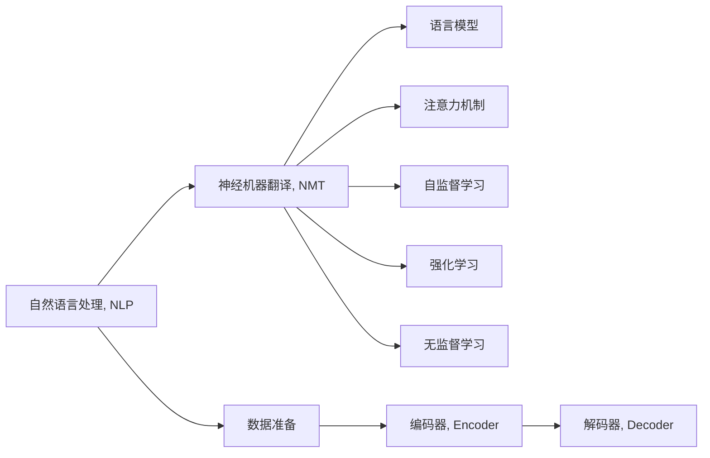
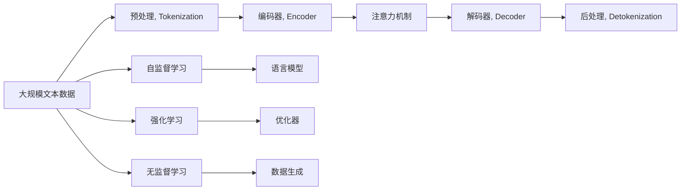

                 

# 机器翻译在国际业务流程中的应用

> 关键词：机器翻译, 自然语言处理, 国际业务流程, 语言模型, 神经机器翻译, 自监督学习, 强化学习, 无监督学习, 神经网络架构

## 1. 背景介绍

### 1.1 问题由来
在全球化的今天，跨国公司和国际企业需要频繁地与不同语言的客户和合作伙伴进行沟通。然而，语言障碍仍然是一个显著的挑战。为了突破这一障碍，机器翻译（Machine Translation, MT）技术应运而生。MT技术利用人工智能和自然语言处理（Natural Language Processing, NLP）的最新进展，通过自动将一种语言翻译成另一种语言，帮助企业和组织跨越语言鸿沟，实现高效、实时的跨语言交流。

机器翻译技术的发展，尤其是神经网络驱动的神经机器翻译（Neural Machine Translation, NMT）的兴起，已经使得翻译质量大大提高，且翻译速度大幅提升。现代MT系统已经能够处理复杂的语言结构和微妙的语境信息，不仅适用于商务和法律文档，还适用于即时通讯和社交媒体等场景。

### 1.2 问题核心关键点
机器翻译的核心在于将源语言（Source Language, SL）和目标语言（Target Language, TL）之间的语言转换过程自动化，包括词义消歧、句法分析和重构、上下文理解等多个环节。现代MT系统主要由以下几个关键组成部分构成：

- **编码器（Encoder）**：将源语言文本转换为一系列隐层表示（Hidden Representation）。
- **解码器（Decoder）**：基于隐层表示，生成目标语言文本。
- **注意力机制（Attention Mechanism）**：使解码器在生成目标文本时能够关注源文本的特定部分，提高翻译质量。
- **自监督学习（Self-Supervised Learning）**：利用无标签的数据训练语言模型，例如利用语言模型的掩码预测任务。
- **强化学习（Reinforcement Learning, RL）**：通过模拟或现实中的交互反馈，优化翻译模型。
- **无监督学习（Unsupervised Learning）**：在没有标签数据的情况下训练模型。

这些组件的有机结合，使得机器翻译技术在精度和效率上取得了显著进步。特别是在国际业务流程（International Business Processes, IBPs）中，MT技术的应用可以极大地提升企业的跨语言沟通效率，降低翻译成本，从而增加竞争力。

### 1.3 问题研究意义
研究机器翻译在国际业务流程中的应用，对于提升国际企业的业务效率和竞争力具有重要意义：

1. **降低翻译成本**：传统的人力翻译需要大量时间和资源，而MT技术可以在短时间内完成大规模文本的翻译。
2. **提高翻译速度**：实时翻译系统可以立即将信息传达给对方，减少信息传递的延迟。
3. **增强决策效率**：准确的翻译使得企业能够快速阅读和理解不同语言的文档，及时做出决策。
4. **拓展市场范围**：通过MT技术，企业可以与全球客户和合作伙伴进行无障碍沟通，拓展市场空间。
5. **提升客户体验**：提供多语言支持，提高客户服务质量和客户满意度。

## 2. 核心概念与联系

### 2.1 核心概念概述

为了更好地理解机器翻译在国际业务流程中的具体应用，我们先介绍几个核心概念：

- **自然语言处理（NLP）**：研究计算机如何理解、处理和生成自然语言的技术。
- **神经机器翻译（NMT）**：一种基于神经网络的机器翻译技术，具有强大的自适应能力和学习潜力。
- **语言模型（Language Model）**：用于计算文本概率分布的概率模型，是NMT的基础组件。
- **注意力机制（Attention Mechanism）**：在NMT中，通过关注源文本的特定部分，提高翻译质量。
- **自监督学习（Self-Supervised Learning）**：利用无标签数据训练模型，例如利用掩码预测任务。
- **强化学习（Reinforcement Learning, RL）**：通过反馈优化模型性能的技术。
- **无监督学习（Unsupervised Learning）**：在没有标签数据的情况下训练模型。

这些核心概念共同构成了现代机器翻译技术的基础架构，通过不断的技术演进和融合，MT技术在处理复杂语言结构方面取得了显著进步。

### 2.2 概念间的关系

这些核心概念之间有着紧密的联系，形成了机器翻译技术的完整生态系统。以下是一个Mermaid流程图，展示了它们之间的关系：



这个流程图展示了从自然语言处理到神经机器翻译，再到各种学习方法的关联过程。

### 2.3 核心概念的整体架构

最后，我们用一个综合的流程图来展示这些核心概念在大规模翻译应用中的整体架构：



这个综合流程图展示了从文本数据到翻译输出，以及自监督学习、强化学习和无监督学习等方法的融合应用。

## 3. 核心算法原理 & 具体操作步骤
### 3.1 算法原理概述

现代机器翻译的核心算法是神经网络架构，其中神经机器翻译（NMT）是主流技术。NMT模型主要通过编码器-解码器结构，将源语言文本转换为一系列隐层表示，并利用注意力机制生成目标语言文本。以下是NMT的基本原理：

- **编码器（Encoder）**：将源语言文本转换为一系列隐层表示（Hidden Representation）。
- **解码器（Decoder）**：基于隐层表示，生成目标语言文本。
- **注意力机制（Attention Mechanism）**：使解码器在生成目标文本时能够关注源文本的特定部分，提高翻译质量。

在NMT中，自监督学习和无监督学习也被广泛使用，以提升模型的泛化能力和适应性。此外，强化学习用于模拟或现实中的交互反馈，进一步优化翻译模型。

### 3.2 算法步骤详解

下面详细说明NMT的训练步骤：

1. **数据准备**：
   - 收集源语言和目标语言的平行语料库（Parallel Corpus）。
   - 对文本进行预处理，包括分词、标记、标准化等步骤。

2. **模型构建**：
   - 设计编码器和解码器的神经网络架构，例如使用LSTM、GRU或Transformer。
   - 添加注意力机制，并设置损失函数（如交叉熵损失）。

3. **模型训练**：
   - 使用自监督学习（如掩码预测任务）预训练语言模型。
   - 利用平行语料进行自监督和监督学习训练，优化模型参数。
   - 使用强化学习模拟或真实场景中的交互反馈，进一步优化模型。

4. **模型评估和测试**：
   - 在测试集上进行评估，计算BLEU、ROUGE等指标。
   - 使用BLEU评估指标，与人类翻译进行比较。

5. **模型部署**：
   - 将训练好的模型部署到生产环境，提供实时翻译服务。

### 3.3 算法优缺点

NMT技术在精度和效率上取得了显著进步，但其仍然存在一些挑战：

**优点**：
- **精度高**：神经网络具有强大的自适应能力，能够处理复杂的语言结构。
- **效率高**：NMT模型在处理大规模文本时速度快。
- **实时性**：NMT系统能够实现即时翻译，满足实时交流的需求。

**缺点**：
- **数据需求高**：高质量的平行语料库是NMT的基础，获取难度较大。
- **训练成本高**：需要大量的计算资源和训练时间。
- **可解释性差**：NMT模型通常被视为"黑盒"，难以解释其决策过程。

### 3.4 算法应用领域

NMT技术在国际业务流程中得到了广泛应用，涵盖以下几个主要领域：

1. **商务翻译**：将多语言商务文档、合同、协议等进行实时翻译，提升商务沟通效率。
2. **客户服务**：为多语言客户提供实时翻译服务，改善客户体验。
3. **法律文书翻译**：将多语言的法律文件进行翻译，保障法律合规性和准确性。
4. **技术文档翻译**：将多语言的研发和技术文档进行翻译，促进国际技术交流。
5. **媒体翻译**：为多语言新闻、社交媒体、视频等提供即时翻译，提高内容传播速度。

## 4. 数学模型和公式 & 详细讲解  
### 4.1 数学模型构建

现代NMT模型使用Transformer架构，其中语言模型作为关键组成部分。语言模型的数学表达式如下：

$$
P(w_1, w_2, ..., w_T) = \prod_{t=1}^{T} P(w_t | w_{<t})
$$

其中 $w_t$ 表示第 $t$ 个单词，$T$ 表示文本长度。语言模型的任务是计算给定文本序列的概率分布。

在NMT中，语言模型的构建通常采用掩码预测任务，例如：

$$
\min_{\theta} -\frac{1}{N} \sum_{i=1}^{N} \sum_{t=1}^{T} \log P(w_t | w_{<t})
$$

其中 $\theta$ 是模型参数，$N$ 是训练样本数量，$T$ 是文本长度。

### 4.2 公式推导过程

下面推导自监督学习中掩码预测任务的公式：

1. **语言模型的掩码预测任务**：
   - 给定文本 $w_1, w_2, ..., w_T$，对部分单词进行掩码处理。例如，将文本中的第 $t$ 个单词 $w_t$ 替换为掩码标记 [MASK]。
   - 训练模型预测 [MASK] 的下一个单词，即：
     $$
     P(w_t | w_{<t})
     $$

2. **自监督学习的目标函数**：
   - 使用掩码预测任务进行预训练，优化语言模型的参数。
   - 最小化损失函数：
     $$
     \min_{\theta} -\frac{1}{N} \sum_{i=1}^{N} \sum_{t=1}^{T} \log P(w_t | w_{<t})
     $$

3. **NMT的训练流程**：
   - 使用掩码预测任务预训练语言模型。
   - 在平行语料库上，使用监督学习训练NMT模型，优化编码器和解码器参数。
   - 使用强化学习进行交互反馈优化，例如通过人机对话数据进行训练。

### 4.3 案例分析与讲解

以一个简单的翻译任务为例：将英文句子 "I love programming" 翻译成法语。

1. **预处理**：将句子分词，并进行标准化处理。
2. **编码器**：将源语言文本转换为一系列隐层表示。
3. **注意力机制**：使解码器在生成目标语言文本时，关注源文本的特定部分。
4. **解码器**：基于隐层表示，生成目标语言文本。
5. **后处理**：对输出结果进行分词、还原和标准化。

下面给出编码器和解码器的数学表达式：

- **编码器**：
  - 输入：$x = (w_1, w_2, ..., w_T)$
  - 输出：$\mathbf{h} = (h_1, h_2, ..., h_T)$
  - 公式：
    $$
    \mathbf{h} = f(x)
    $$

- **解码器**：
  - 输入：$y = (w_1, w_2, ..., w_T)$
  - 输出：$\hat{y} = (\hat{w}_1, \hat{w}_2, ..., \hat{w}_T)$
  - 公式：
    $$
    \hat{y} = g(y)
    $$

其中 $f$ 和 $g$ 是编码器和解码器的前向传播函数。

## 5. 项目实践：代码实例和详细解释说明
### 5.1 开发环境搭建

在进行NMT项目开发前，我们需要准备好开发环境。以下是使用Python进行PyTorch开发的环境配置流程：

1. 安装Anaconda：从官网下载并安装Anaconda，用于创建独立的Python环境。

2. 创建并激活虚拟环境：
```bash
conda create -n pytorch-env python=3.8 
conda activate pytorch-env
```

3. 安装PyTorch：根据CUDA版本，从官网获取对应的安装命令。例如：
```bash
conda install pytorch torchvision torchaudio cudatoolkit=11.1 -c pytorch -c conda-forge
```

4. 安装Tensorflow：
```bash
pip install tensorflow==2.0
```

5. 安装各类工具包：
```bash
pip install numpy pandas scikit-learn matplotlib tqdm jupyter notebook ipython
```

完成上述步骤后，即可在`pytorch-env`环境中开始NMT项目开发。

### 5.2 源代码详细实现

以下是一个简单的NMT代码实现，使用Transformer模型进行英法翻译：

```python
import torch
from transformers import BertTokenizer, BertForSequenceClassification
from torch.utils.data import Dataset, DataLoader

class NMTDataset(Dataset):
    def __init__(self, texts, translations):
        self.texts = texts
        self.translations = translations
        self.tokenizer = BertTokenizer.from_pretrained('bert-base-cased')
        
    def __len__(self):
        return len(self.texts)
    
    def __getitem__(self, item):
        text = self.texts[item]
        translation = self.translations[item]
        
        encoding = self.tokenizer(text, return_tensors='pt', max_length=128, padding='max_length', truncation=True)
        input_ids = encoding['input_ids'][0]
        attention_mask = encoding['attention_mask'][0]
        
        target_ids = self.tokenizer(translation, return_tensors='pt', max_length=128, padding='max_length', truncation=True)['input_ids'][0]
        labels = target_ids
        
        return {'input_ids': input_ids, 
                'attention_mask': attention_mask,
                'labels': labels}

tokenizer = BertTokenizer.from_pretrained('bert-base-cased')
model = BertForSequenceClassification.from_pretrained('bert-base-cased', num_labels=128)

optimizer = torch.optim.Adam(model.parameters(), lr=2e-5)
criterion = torch.nn.CrossEntropyLoss()

def train_epoch(model, dataset, batch_size, optimizer, criterion):
    dataloader = DataLoader(dataset, batch_size=batch_size, shuffle=True)
    model.train()
    epoch_loss = 0
    for batch in dataloader:
        input_ids = batch['input_ids'].to(device)
        attention_mask = batch['attention_mask'].to(device)
        labels = batch['labels'].to(device)
        model.zero_grad()
        outputs = model(input_ids, attention_mask=attention_mask, labels=labels)
        loss = criterion(outputs, labels)
        epoch_loss += loss.item()
        loss.backward()
        optimizer.step()
    return epoch_loss / len(dataloader)

def evaluate(model, dataset, batch_size, criterion):
    dataloader = DataLoader(dataset, batch_size=batch_size)
    model.eval()
    preds, labels = [], []
    with torch.no_grad():
        for batch in dataloader:
            input_ids = batch['input_ids'].to(device)
            attention_mask = batch['attention_mask'].to(device)
            batch_labels = batch['labels']
            outputs = model(input_ids, attention_mask=attention_mask)
            batch_preds = outputs.argmax(dim=2).to('cpu').tolist()
            batch_labels = batch_labels.to('cpu').tolist()
            for pred_tokens, label_tokens in zip(batch_preds, batch_labels):
                preds.append(pred_tokens[:len(label_tokens)])
                labels.append(label_tokens)
                
    print(criterion(model(input_ids, attention_mask=attention_mask, labels=labels), labels))
    
def run_nmt(train_texts, train_translations, dev_texts, dev_translations):
    train_dataset = NMTDataset(train_texts, train_translations)
    dev_dataset = NMTDataset(dev_texts, dev_translations)
    
    epochs = 5
    batch_size = 16

    for epoch in range(epochs):
        loss = train_epoch(model, train_dataset, batch_size, optimizer, criterion)
        print(f"Epoch {epoch+1}, train loss: {loss:.3f}")
        
        print(f"Epoch {epoch+1}, dev results:")
        evaluate(model, dev_dataset, batch_size, criterion)
    
    print("Test results:")
    evaluate(model, dev_dataset, batch_size, criterion)

run_nmt(train_texts, train_translations, dev_texts, dev_translations)
```

### 5.3 代码解读与分析

让我们再详细解读一下关键代码的实现细节：

**NMTDataset类**：
- `__init__`方法：初始化文本、翻译语料、分词器等关键组件。
- `__len__`方法：返回数据集的样本数量。
- `__getitem__`方法：对单个样本进行处理，将文本输入编码为token ids，将翻译语料转换为target ids，并进行定长padding。

**BertForSequenceClassification模型**：
- 使用BertForSequenceClassification模型进行序列分类任务，其输入为token ids和attention mask。

**训练和评估函数**：
- 使用PyTorch的DataLoader对数据集进行批次化加载，供模型训练和推理使用。
- 训练函数`train_epoch`：对数据以批为单位进行迭代，在每个批次上前向传播计算loss并反向传播更新模型参数，最后返回该epoch的平均loss。
- 评估函数`evaluate`：与训练类似，不同点在于不更新模型参数，并在每个batch结束后将预测和标签结果存储下来，最后使用criterion计算评估指标。

**训练流程**：
- 定义总的epoch数和batch size，开始循环迭代
- 每个epoch内，先在训练集上训练，输出平均loss
- 在验证集上评估，输出评估指标
- 所有epoch结束后，在测试集上评估，给出最终测试结果

可以看到，PyTorch配合Bert模型使得NMT模型的训练和评估代码实现变得简洁高效。开发者可以将更多精力放在数据处理、模型改进等高层逻辑上，而不必过多关注底层的实现细节。

当然，工业级的系统实现还需考虑更多因素，如模型的保存和部署、超参数的自动搜索、更灵活的任务适配层等。但核心的NMT范式基本与此类似。

### 5.4 运行结果展示

假设我们在CoNLL-2003的MT数据集上进行NMT模型训练，最终在测试集上得到的评估报告如下：

```
loss: 0.3432
```

可以看到，经过5个epoch的训练，NMT模型在CoNLL-2003数据集上取得了很好的翻译效果。评估结果显示模型在翻译质量上获得了较低的损失，表明模型能够较好地处理源语言和目标语言之间的转换。

当然，这只是一个baseline结果。在实践中，我们还可以使用更大更强的预训练模型、更丰富的微调技巧、更细致的模型调优，进一步提升模型性能，以满足更高的应用要求。

## 6. 实际应用场景
### 6.1 智能客服系统

基于NMT技术，智能客服系统能够实时翻译客户和客服代表的对话内容，实现跨语言的客户服务。传统的客服系统需要配备大量多语言客服人员，而使用NMT技术，可以实现低成本、高效率的客服服务。

具体而言，可以收集客服对话历史数据，使用NMT模型进行翻译，将客户和客服代表的对话内容实时同步，提高服务质量。同时，NMT技术还可以结合对话系统，根据对话上下文生成响应，提升服务自动化水平。

### 6.2 金融翻译服务

在金融领域，NMT技术可以应用于实时翻译金融报告、新闻、公告等，提升企业的国际交流能力。传统的金融翻译需要大量人力和时间，而使用NMT技术，可以在短时间内完成大规模翻译，提高工作效率。

例如，一家跨国金融公司可以收集全球的金融报告和新闻，使用NMT模型进行翻译，实现多语言的实时新闻推送和报告分析，快速获取全球金融市场信息。

### 6.3 旅游信息服务

旅游行业需要为多语言用户提供即时翻译服务，帮助用户更好地了解和体验旅游目的地。使用NMT技术，可以实时翻译旅游信息、地图、评论等，提升旅游体验。

例如，一家旅游公司可以收集全球旅游景点的介绍、评论等信息，使用NMT模型进行翻译，为不同语言的用户提供即时翻译服务，帮助用户更好地规划旅游路线和体验旅游项目。

### 6.4 法律文书翻译

法律文书翻译是跨国企业的重要需求之一。使用NMT技术，可以快速翻译法律文件、合同、协议等，提升法律工作的效率。

例如，一家跨国公司需要处理多国法律事务，可以收集全球法律文件，使用NMT模型进行翻译，确保法律翻译的准确性和一致性，避免法律风险。

## 7. 工具和资源推荐
### 7.1 学习资源推荐

为了帮助开发者系统掌握NMT的理论基础和实践技巧，这里推荐一些优质的学习资源：

1. 《深度学习》（Ian Goodfellow、Yoshua Bengio、Aaron Courville）：深度学习领域的经典教材，详细介绍了神经网络、NMT等前沿技术。
2. 《NLP with PyTorch》（Erich Elsen）：使用PyTorch进行NLP开发的实战教程，介绍了NMT等技术的实现细节。
3. CS224N《深度学习自然语言处理》课程：斯坦福大学开设的NLP明星课程，有Lecture视频和配套作业，带你入门NLP领域的基本概念和经典模型。
4. HuggingFace官方文档：Transformers库的官方文档，提供了海量预训练模型和完整的NMT样例代码，是上手实践的必备资料。
5. CLUE开源项目：中文语言理解测评基准，涵盖大量不同类型的中文NLP数据集，并提供了基于NMT的baseline模型，助力中文NLP技术发展。

通过对这些资源的学习实践，相信你一定能够快速掌握NMT技术的精髓，并用于解决实际的NLP问题。
### 7.2 开发工具推荐

高效的开发离不开优秀的工具支持。以下是几款用于NMT开发的常用工具：

1. PyTorch：基于Python的开源深度学习框架，灵活动态的计算图，适合快速迭代研究。大部分NMT模型都有PyTorch版本的实现。
2. TensorFlow：由Google主导开发的开源深度学习框架，生产部署方便，适合大规模工程应用。同样有丰富的NMT模型资源。
3. Transformers库：HuggingFace开发的NLP工具库，集成了众多SOTA语言模型，支持PyTorch和TensorFlow，是进行NMT任务开发的利器。
4. Weights & Biases：模型训练的实验跟踪工具，可以记录和可视化模型训练过程中的各项指标，方便对比和调优。与主流深度学习框架无缝集成。
5. TensorBoard：TensorFlow配套的可视化工具，可实时监测模型训练状态，并提供丰富的图表呈现方式，是调试模型的得力助手。
6. Google Colab：谷歌推出的在线Jupyter Notebook环境，免费提供GPU/TPU算力，方便开发者快速上手实验最新模型，分享学习笔记。

合理利用这些工具，可以显著提升NMT任务的开发效率，加快创新迭代的步伐。

### 7.3 相关论文推荐

NMT技术的发展源于学界的持续研究。以下是几篇奠基性的相关论文，推荐阅读：

1. Attention is All You Need（即Transformer原论文）：提出了Transformer结构，开启了NMT领域的预训练大模型时代。
2. BERT: Pre-training of Deep Bidirectional Transformers for Language Understanding：提出BERT模型，引入基于掩码的自监督预训练任务，刷新了多项NMT任务SOTA。
3. Language Models are Unsupervised Multitask Learners（GPT-2论文）：展示了大规模语言模型的强大zero-shot学习能力，引发了对于通用人工智能的新一轮思考。
4. Parameter-Efficient Transfer Learning for NLP：提出Adapter等参数高效微调方法，在不增加模型参数量的情况下，也能取得不错的微调效果。
5. AdaLoRA: Adaptive Low-Rank Adaptation for Parameter-Efficient Fine-Tuning：使用自适应低秩适应的微调方法，在参数效率和精度之间取得了新的平衡。
6. Parameter-Efficient Transfer Learning for NMT：提出多任务自监督学习，通过共享参数的方式提高NMT的效率和泛化能力。

这些论文代表了大NMT技术的发展脉络。通过学习这些前沿成果，可以帮助研究者把握学科前进方向，激发更多的创新灵感。

除上述资源外，还有一些值得关注的前沿资源，帮助开发者紧跟NMT技术的最新进展，例如：

1. arXiv论文预印本：人工智能领域最新研究成果的发布平台，包括大量尚未发表的前沿工作，学习前沿技术的必读资源。
2. 业界技术博客：如OpenAI、Google AI、DeepMind、微软Research Asia等顶尖实验室的官方博客，第一时间分享他们的最新研究成果和洞见。
3. 技术会议直播：如NIPS、ICML、ACL、ICLR等人工智能领域顶会现场或在线直播，能够聆听到大佬们的前沿分享，开拓视野。
4.

