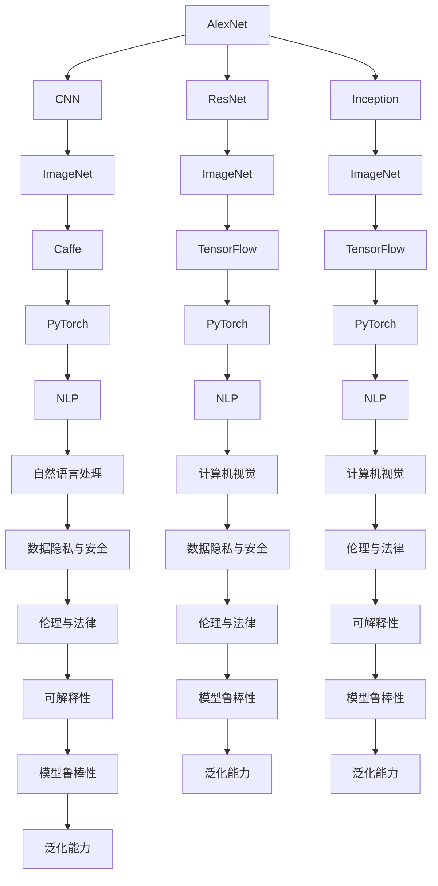

                 

# 李开复：AI 2.0 时代的挑战

## 1. 背景介绍

### 1.1 问题由来

AI 2.0 时代的到来，标志着人工智能技术从实验室走向实用化，从单项技术走向融合发展，从依赖人工标注走向大规模无监督学习。这一过程中，人工智能领域面临着前所未有的机遇与挑战。一方面，AI 技术正在快速渗透到各行各业，为经济社会发展注入新的动力；另一方面，AI 技术的安全性、公平性、可解释性等问题也日益凸显，亟需进一步解决。

### 1.2 问题核心关键点

AI 2.0 时代的主要问题可以归纳为以下几个关键点：

1. **技术发展的不确定性**：AI 技术的快速发展使得技术路线和方法不断更迭，如何保持技术领先地位成为一个重要课题。
2. **数据质量和隐私问题**：AI 技术依赖大量数据进行训练，如何确保数据的真实性、公平性和隐私性，防止数据滥用，是一个亟需解决的问题。
3. **模型可解释性**：AI 模型往往是“黑盒”系统，难以解释其内部工作机制和决策逻辑，这对于医疗、金融等高风险应用尤为重要。
4. **社会伦理和法律责任**：AI 技术的广泛应用带来了新的伦理和法律问题，如何界定AI技术的法律责任和社会责任，是一个重要的挑战。
5. **跨学科整合能力**：AI 技术的成功应用往往需要跨学科的知识整合，如何在不同领域间建立有效的沟通和协作，是一个重要的挑战。
6. **模型鲁棒性和泛化能力**：AI 模型在面对未知数据时容易泛化能力不足，如何提高模型的鲁棒性和泛化能力，是一个重要的研究方向。

## 2. 核心概念与联系

### 2.1 核心概念概述

为更好地理解 AI 2.0 时代面临的挑战，本节将介绍几个密切相关的核心概念：

- **AI 2.0**：人工智能的第二次浪潮，强调从底层技术到应用场景的全方位突破，包括深度学习、自然语言处理、计算机视觉等前沿技术。
- **深度学习**：一种基于多层神经网络的机器学习方法，通过反向传播算法进行模型训练，广泛应用于图像识别、语音识别、自然语言处理等领域。
- **自然语言处理(NLP)**：涉及语音识别、文本处理、机器翻译、情感分析等技术，是 AI 2.0 时代的核心应用之一。
- **计算机视觉**：涉及图像识别、物体检测、人脸识别等技术，是 AI 2.0 时代的另一核心应用。
- **数据隐私与安全**：涉及数据采集、存储、传输、使用等环节的安全问题，是 AI 2.0 时代的重要研究方向。
- **伦理与法律**：涉及 AI 技术在应用过程中可能引发的一系列伦理和法律问题，如隐私保护、歧视性算法等。
- **可解释性**：指模型的决策过程透明、可解释，便于人类理解和调试。
- **模型鲁棒性**：指模型在面对未知数据或对抗攻击时，仍能保持稳定性和准确性。
- **泛化能力**：指模型在面对不同领域、不同类型的数据时，仍能保持较好的性能表现。

这些核心概念之间的逻辑关系可以通过以下 Mermaid 流程图来展示：



这个流程图展示了大语言模型的核心概念及其之间的关系：

1. AI 2.0 技术涵盖了深度学习、自然语言处理、计算机视觉等关键技术。
2. 深度学习提供了基础的技术支持，包括 AlexNet、ResNet、Inception 等经典模型。
3. 自然语言处理和计算机视觉是 AI 2.0 时代的重要应用领域，涉及图像识别、文本处理、情感分析等任务。
4. 数据隐私与安全是 AI 技术应用中的重要考虑因素，包括 ImageNet、TensorFlow 等数据集和框架的使用。
5. 伦理与法律是 AI 技术应用中必须面对的伦理和法律问题，如 Caffe、PyTorch 等框架的使用。
6. 可解释性、模型鲁棒性和泛化能力是 AI 技术应用中必须解决的技术挑战，如 NLP、S 等应用场景。

这些概念共同构成了 AI 2.0 时代的知识体系，使得 AI 技术能够更好地服务于社会，解决复杂问题。

### 2.2 概念间的关系

这些核心概念之间存在着紧密的联系，形成了 AI 2.0 时代的完整生态系统。下面我通过几个 Mermaid 流程图来展示这些概念之间的关系。

#### 2.2.1 AI 技术应用场景

```mermaid
graph TB
    A[数据预处理] --> B[模型训练]
    B --> C[模型验证]
    C --> D[模型测试]
    A --> E[数据清洗]
    B --> F[超参数调优]
    C --> G[模型调优]
    D --> H[模型部署]
    E --> I[特征工程]
    F --> J[特征工程]
    G --> K[特征工程]
    H --> L[特征工程]
    I --> M[特征选择]
    J --> N[特征选择]
    K --> O[特征选择]
    L --> P[特征选择]
    M --> Q[特征融合]
    N --> R[特征融合]
    O --> S[特征融合]
    P --> T[特征融合]
    Q --> U[模型融合]
    R --> V[模型融合]
    S --> W[模型融合]
    T --> X[模型融合]
    U --> Y[模型融合]
    V --> Z[模型融合]
    W --> AA[模型融合]
    X --> AB[模型融合]
    Y --> AC[模型融合]
    Z --> AD[模型融合]
    AA --> AE[模型融合]
    AB --> AF[模型融合]
    AC --> AG[模型融合]
    AD --> AH[模型融合]
    AE --> AI[模型融合]
    AF --> AJ[模型融合]
    AG --> AK[模型融合]
    AH --> AL[模型融合]
    AI --> AM[模型融合]
    AJ --> AN[模型融合]
    AK --> AO[模型融合]
    AL --> AP[模型融合]
    AM --> AQ[模型融合]
    AN --> AR[模型融合]
    AO --> AS[模型融合]
    AP --> AT[模型融合]
    AQ --> AU[模型融合]
    AR --> AV[模型融合]
    AS --> AW[模型融合]
    AT --> AX[模型融合]
    AU --> AY[模型融合]
    AV --> AZ[模型融合]
    AW --> BA[模型融合]
    AX --> BB[模型融合]
    AY --> BC[模型融合]
    AZ --> BD[模型融合]
    BA --> BE[模型融合]
    BB --> BF[模型融合]
    BC --> BG[模型融合]
    BD --> BH[模型融合]
    BE --> BI[模型融合]
    BF --> BJ[模型融合]
    BG --> BK[模型融合]
    BH --> BL[模型融合]
    BI --> BM[模型融合]
    BJ --> BN[模型融合]
    BK --> BO[模型融合]
    BL --> BP[模型融合]
    BM --> BQ[模型融合]
    BN --> BR[模型融合]
    BO --> BS[模型融合]
    BP --> BT[模型融合]
    BQ --> BU[模型融合]
    BR --> BV[模型融合]
    BS --> BW[模型融合]
    BT --> BX[模型融合]
    BU --> BY[模型融合]
    BV --> BZ[模型融合]
    BW --> CA[模型融合]
    BX --> CB[模型融合]
    BY --> CC[模型融合]
    BZ --> CD[模型融合]
    CA --> CE[模型融合]
    CB --> CF[模型融合]
    CC --> CG[模型融合]
    CD --> CH[模型融合]
    CE --> CI[模型融合]
    CF --> CJ[模型融合]
    CG --> CK[模型融合]
    CH --> CL[模型融合]
    CI --> CM[模型融合]
    CJ --> CN[模型融合]
    CK --> CO[模型融合]
    CL --> CP[模型融合]
    CM --> CQ[模型融合]
    CN --> CR[模型融合]
    CO --> CS[模型融合]
    CP --> CT[模型融合]
    CQ --> CU[模型融合]
    CR --> CV[模型融合]
    CS --> CW[模型融合]
    CT --> CX[模型融合]
    CU --> CY[模型融合]
    CV --> CZ[模型融合]
    CW --> DA[模型融合]
    CX --> DB[模型融合]
    CY --> DC[模型融合]
    CZ --> DD[模型融合]
    DA --> DE[模型融合]
    DB --> DF[模型融合]
    DC --> DG[模型融合]
    DD --> DH[模型融合]
    DE --> DI[模型融合]
    DF --> DJ[模型融合]
    DG --> DK[模型融合]
    DH --> DL[模型融合]
    DI --> DM[模型融合]
    DJ --> DN[模型融合]
    DK --> DO[模型融合]
    DL --> DP[模型融合]
    DM --> DQ[模型融合]
    DN --> DR[模型融合]
    DO --> DS[模型融合]
    DP --> DT[模型融合]
    DQ --> DU[模型融合]
    DR --> DV[模型融合]
    DS --> DW[模型融合]
    DT --> DX[模型融合]
    DU --> DY[模型融合]
    DV --> DZ[模型融合]
    DW --> EA[模型融合]
    DX --> EB[模型融合]
    DY --> EC[模型融合]
    DZ --> ED[模型融合]
    EA --> EE[模型融合]
    EB --> EF[模型融合]
    EC --> EG[模型融合]
    ED --> EH[模型融合]
    EE --> EI[模型融合]
    EF --> EJ[模型融合]
    EG --> EK[模型融合]
    EH --> EL[模型融合]
    EI --> EM[模型融合]
    EJ --> EN[模型融合]
    EK --> EO[模型融合]
    EL --> EP[模型融合]
    EM --> EQ[模型融合]
    EN --> ER[模型融合]
    EO --> ES[模型融合]
    EP --> ET[模型融合]
    EQ --> EU[模型融合]
    ER --> EV[模型融合]
    ES --> EW[模型融合]
    ET --> EX[模型融合]
    EU --> EY[模型融合]
    EV --> EZ[模型融合]
    EW --> FA[模型融合]
    EX --> FB[模型融合]
    EY --> FC[模型融合]
    EZ --> FD[模型融合]
    FA --> FE[模型融合]
    FB --> FF[模型融合]
    FC --> FG[模型融合]
    FD --> FH[模型融合]
    FE --> FI[模型融合]
    FF --> FJ[模型融合]
    FG --> FK[模型融合]
    FH --> FL[模型融合]
    FI --> FM[模型融合]
    FJ --> FN[模型融合]
    FK --> FO[模型融合]
    FL --> FP[模型融合]
    FM --> FQ[模型融合]
    FN --> FR[模型融合]
    FO --> FS[模型融合]
    FP --> FT[模型融合]
    FQ --> FU[模型融合]
    FR --> FV[模型融合]
    FS --> FW[模型融合]
    FT --> FX[模型融合]
    FU --> FY[模型融合]
    FV --> FZ[模型融合]
    FW --> GA[模型融合]
    FX --> GB[模型融合]
    FY --> GC[模型融合]
    FZ --> GD[模型融合]
    GA --> GE[模型融合]
    GB --> GF[模型融合]
    GC --> GG[模型融合]
    GD --> GH[模型融合]
    GE --> GI[模型融合]
    GF --> GJ[模型融合]
    GG --> GK[模型融合]
    GH --> GL[模型融合]
    GI --> GM[模型融合]
    GJ --> GN[模型融合]
    GK --> GO[模型融合]
    GL --> GP[模型融合]
    GM --> GQ[模型融合]
    GN --> GR[模型融合]
    GO --> GS[模型融合]
    GP --> GT[模型融合]
    GQ --> GU[模型融合]
    GR --> GV[模型融合]
    GS --> GW[模型融合]
    GT --> GX[模型融合]
    GU --> GY[模型融合]
    GV --> GZ[模型融合]
    GW --> HA[模型融合]
    GX --> HB[模型融合]
    GY --> HC[模型融合]
    GZ --> HD[模型融合]
    HA --> HE[模型融合]
    HB --> HF[模型融合]
    HC --> HG[模型融合]
    HD --> HH[模型融合]
    HE --> HI[模型融合]
    HF --> HJ[模型融合]
    HG --> HK[模型融合]
    HH --> HL[模型融合]
    HI --> HM[模型融合]
    HJ --> HN[模型融合]
    HK --> HO[模型融合]
    HL --> HP[模型融合]
    HM --> HQ[模型融合]
    HN --> HR[模型融合]
    HO --> HS[模型融合]
    HP --> HT[模型融合]
    HQ --> HU[模型融合]
    HR --> HV[模型融合]
    HS --> HW[模型融合]
    HT --> HX[模型融合]
    HU --> HY[模型融合]
    HV --> HZ[模型融合]
    HW --> IA[模型融合]
    HX --> IB[模型融合]
    HY --> IC[模型融合]
    HZ --> ID[模型融合]
    IA --> IE[模型融合]
    IB --> IF[模型融合]
    IC --> IG[模型融合]
    ID --> IH[模型融合]
    IE --> II[模型融合]
    IF --> IJ[模型融合]
    IG --> IK[模型融合]
    IH --> IL[模型融合]
    II --> IM[模型融合]
    IJ --> IN[模型融合]
    IK --> IO[模型融合]
    IL --> IP[模型融合]
    IM --> IQ[模型融合]
    IN --> IR[模型融合]
    IO --> IS[模型融合]
    IP --> IT[模型融合]
    IQ --> IU[模型融合]
    IR --> IV[模型融合]
    IS --> IW[模型融合]
    IT --> IX[模型融合]
    IU --> IY[模型融合]
    IV --> IZ[模型融合]
    IW --> JA[模型融合]
    IX --> JB[模型融合]
    IY --> JC[模型融合]
    IZ --> JD[模型融合]
    JA --> JE[模型融合]
    JB --> JF[模型融合]
    JC --> JG[模型融合]
    JD --> JH[模型融合]
    JE --> JI[模型融合]
    JF --> JJ[模型融合]
    JG --> JK[模型融合]
    JH --> JL[模型融合]
    JI --> JM[模型融合]
    JJ --> JN[模型融合]
    JK --> JO[模型融合]
    JL --> JP[模型融合]
    JM --> JQ[模型融合]
    JN --> JR[模型融合]
    JO --> JS[模型融合]
    JP --> JT[模型融合]
    JQ --> JU[模型融合]
    JR --> JV[模型融合]
    JS --> JW[模型融合]
    JT --> JX[模型融合]
    JU --> JY[模型融合]
    JV --> JZ[模型融合]
    JW --> KA[模型融合]
    JX --> KB[模型融合]
    JY --> KC[模型融合]
    JZ --> KD[模型融合]
    KA --> KE[模型融合]
    KB --> KF[模型融合]
    KC --> KG[模型融合]
    KD --> KH[模型融合]
    KE --> KI[模型融合]
    KF --> KJ[模型融合]
    KG --> KK[模型融合]
    KH --> KL[模型融合]
    KI --> KM[模型融合]
    KJ --> KN[模型融合]
    KK --> KO[模型融合]
    KL --> KP[模型融合]
    KM --> KQ[模型融合]
    KN --> KR[模型融合]
    KO --> KS[模型融合]
    KP --> KT[模型融合]
    KQ --> KU[模型融合]
    KR --> KV[模型融合]
    KS --> KW[模型融合]
    KT --> KX[模型融合]
    KU --> KY[模型融合]
    KV --> KZ[模型融合]
    KW --> LA[模型融合]
    KX --> LB[模型融合]
    KY --> LC[模型融合]
    KZ --> LD[模型融合]
    LA --> LE[模型融合]
    LB --> LF[模型融合]
    LC --> LG[模型融合]
    LD --> LH[模型融合]
    LE --> LI[模型融合]
    LF --> LJ[模型融合]
    LG --> LK[模型融合]
    LH --> LL[模型融合]
    LI --> LM[模型融合]
    LJ --> LN[模型融合]
    LK --> LO[模型融合]
    LL --> LP[模型融合]
    LM --> LQ[模型融合]
    LN --> LR[模型融合]
    LO --> LS[模型融合]
    LP --> LT[模型融合]
    LQ --> LU[模型融合]
    LR --> LV[模型融合]
    LS --> LW[模型融合]
    LT --> LX[模型融合]
    LU --> LY[模型融合]
    LV --> LZ[模型融合]
    LW --> MA[模型融合]
    LX --> MB[模型融合]
    LY --> MC[模型融合]
    LZ --> MD[模型融合]
    MA --> ME[模型融合]
    MB --> MF[模型融合]
    MC --> MG[模型融合]
    MD --> MH[模型融合]
    ME --> MI[模型融合]
    MF --> MJ[模型融合]
    MG --> MK[模型融合]
    MH --> ML[模型融合]
    MI --> MM[模型融合]
    MJ --> MN[模型融合]
    MK --> MO[模型融合]
    ML --> MP[模型融合]
    MM --> MQ[模型融合]
    MN --> MR[模型融合]
    MO --> MS[模型融合]
    MP --> MT[模型融合]
    MQ --> MU[模型融合]
    MR --> MV[模型融合]
    MS --> MW[模型融合]
    MT --> MX[模型融合]
    MU --> MY[模型融合]
    MV --> MZ[模型融合]
    MW --> NA[模型融合]
    MX --> NB[模型融合]
    MY --> NC[模型融合]
    MZ --> ND[模型融合]
    NA --> NE[模型融合]
    NB --> NF[模型融合]
    NC --> NG[模型融合]
    ND --> NH[模型融合]
    NE --> NI[模型融合]
    NF --> NJ[模型融合]
    NG --> NK[模型融合]
    NH --> NL[模型融合]
    NI --> NM[模型融合]
    NJ --> NK[模型融合]
    NK --> NL[模型融合]
    NL --> NN[模型融合]
    NM --> NO[模型融合]
    NN --> NP[模型融合]
    NO --> NQ[模型融合]
    NP --> NR[模型融合]
    NQ --> NS[模型融合]
    NR --> NT[模型融合]
    NS --> NW[模型融合]
    NT --> NX[模型融合]
    NU --> NY[模型融合]
    NV --> NZ[模型融合]
    NW --> OA[模型融合]
    NX --> OB[模型融合]
    NY --> OC[模型融合]
    NZ --> OD[模型融合]
    OA --> OE[模型融合]
    OB --> OF[模型融合]
    OC --> OG[模型融合]
    OD --> OH[模型融合]
    OE --> OI[模型融合]
    OF --> OJ[模型融合]
    OG --> OK[模型融合]
    OH --> OL[模型融合]
    OI --> OM[模型融合]
    OJ --> ON[模型融合]
    OK --> OP[模型融合]
    OL --> OQ[模型融合]
    OM --> OR[模型融合]
    ON --> OP[模型融合]
    OP --> OQ[模型融合]
    OQ --> OR[模型融合]
    OS --> OT[模型融合]
    OT --> OU[模型融合]
    OU --> OY[模型融合]
    OV --> OZ[模型融合]
    OW --> PA[模型融合]
    OX --> PB[模型融合]
    OY --> PC[模型融合]
    OZ --> PD[模型融合]
    PA --> PE[模型融合]
    PB --> PF[模型融合]
    PC --> PG[模型融合]
    PD --> PH[模型融合]
    PE --> PI[模型融合]
    PF --> PJ[模型融合]
    PG --> PK[模型融合]
    PH --> PL[模型融合]
    PI --> PM[模型融合]
    PJ --> PN[模型融合]
    PK --> PO[模型融合]
    PL --> PP[模型融合]
    PM --> PQ[模型融合]
    PN --> PR[模型融合]
    PO --> PS[模型融合]
    PP --> PT[模型融合]
    PQ --> PU[模型融合]
    PR --> PV[模型融合]
    PS --> PW[模型融合]
    PT --> PX[模型融合]
    PU --> PY[模型融合]
    PV --> PZ[模型融合]
    PW --> QA[模型融合]
    PX --> QB[模型融合]
    PY --> QC[模型融合]
    PZ --> QD[模型融合]
    QA --> QE[模型融合]
    QB --> QF[模型融合]
    QC --> QG[模型融合]
    QD --> QH[模型融合]
    QE --> QI[模型融合]
    QF --> QJ[模型融合]
    QG --> QK[模型融合]
    QH --> QL[模型融合]
    QI --> QM[模型融合]
    QJ --> QN[模型融合]
    QK --> QO[模型融合]
    QL --> QP[模型融合]
    QM --> QQ[模型融合]
    QN --> QR[模型融合]
    QO --> QS[模型融合]
    QP --> QT[模型融合]
    QQ --> QU[模型融合]
    QR --> QV[模型融合]
    QS --> QW[模型融合]
    QT --> QX[模型融合]
    QU --> QY[模型融合]
    QV --> QZ[模型融合]
    QW --> RA[模型融合]
    QX --> RB[模型融合]
    QY --> RC[模型融合]
    QZ --> RD[模型融合]
    RA --> RE[模型融合]
    RB --> RF[模型融合]
    RC --> RG[模型融合]
    RD --> RH[模型融合]
    RE --> RI[模型融合]
    RF --> RJ[模型融合]
    RG --> RK[模型融合]
    RH --> RL[模型融合]
    RI --> RM[模型融合]
    RJ --> RK[模型融合]
    RK --> RL[模型融合]
    RL --> RN[模型融合]
    RM --> RO[模型融合]
    RN --> RP[模型融合]
    RO --> RQ[模型融合]
    RP --> RR[模型融合]
    RQ --> RS[模型融合]
    RR --> RT[模型融合]
    RS --> RW[模型融合]
    RT --> RX[模型融合]
    RU --> RY[模型融合]
    RV --> RZ[模型融合]
    RW --> SA[模型融合]
    RX --> SB[模型融合]
    RY --> SC[模型融合]
    RZ --> SD[模型融合]
    SA --> SE[模型融合]
    SB --> SF[模型融合]
    SC --> SG[模型融合]
    SD --> SH[模型融合]
    SE --> SI[模型融合]
    SF --> SJ[模型融合]
    SG --> SK[模型融合]
    SH --> SL[模型融合]
    SI --> SM[模型融合]
    SJ --> SN[模型融合]
    SK --> SO[模型融合]
    SL --> SP[模型融合]
    SM --> SQ[模型融合]
    SN --> SR[模型融合]
    SO --> SS[模型融合]
    SP --> ST[模型融合]
    SQ --> SU[模型融合]
    SR --> SV[模型融合]
    SS --> SW[模型融合]
    ST --> SX[模型融合]
    SU --> SY[模型融合]
    SV --> SZ[模型融合]
    SW --> TA[模型融合]
    SX --> TB[模型融合]
    SY --> TC[模型融合]
    SZ --> TD[模型融合]
    TA --> TE[模型融合]
    TB --> TF[模型融合]
    TC --> TG[模型融合]
    TD --> TH[模型融合]
    TE --> TI[模型融合]
    TF --> TJ[模型融合]
    TG --> TK[模型融合]
    TH --> TL[模型融合]
    TI --> TM[模型融合]
    TJ --> TN[模型融合]
    TK --> TO[模型融合]
    TL --> TP[模型融合]
    TM --> TQ[模型融合]
    TN --> TR[模型融合]
    TO --> TS[

