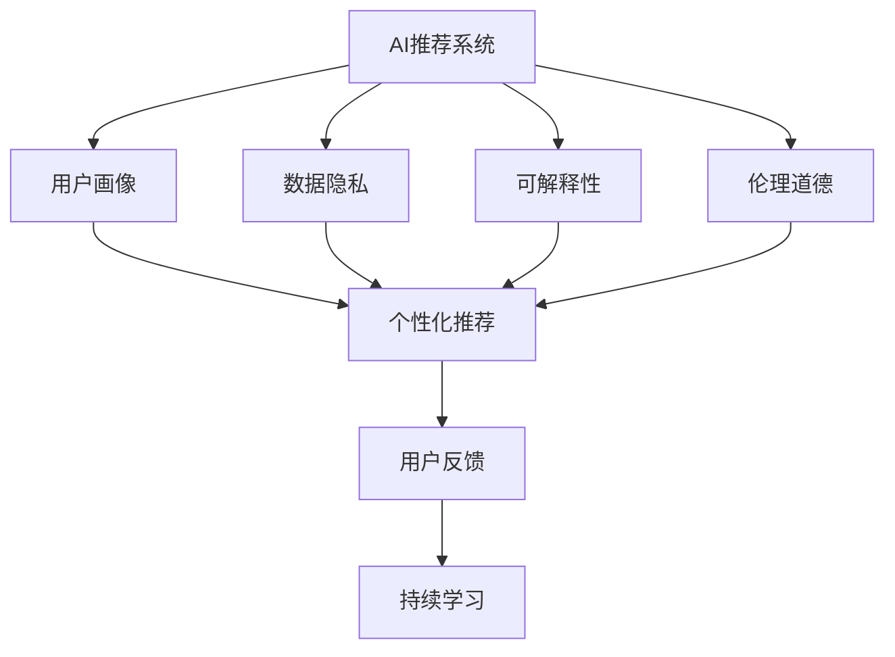
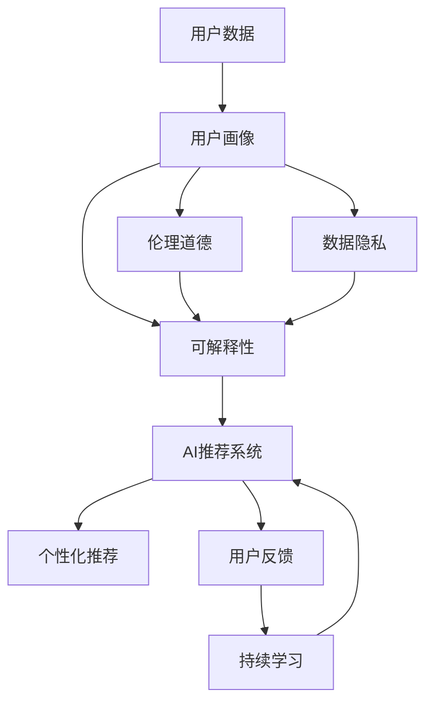

                 

# 李开复：AI 2.0 时代的用户

> 关键词：人工智能(AI)、机器学习、深度学习、用户参与、个性化推荐、用户画像、数据隐私、伦理道德

## 1. 背景介绍

### 1.1 问题由来
随着人工智能(AI)技术迅猛发展，我们正在迈入AI 2.0时代。相较于第一代基于规则的专家系统，AI 2.0强调从大规模数据中自动学习模式，包括机器学习和深度学习等技术。AI 2.0将人工智能从求解特定问题扩展到解决复杂系统中的诸多任务，包括自然语言处理(NLP)、计算机视觉、机器人学等诸多领域。

但伴随技术发展的另一面是，AI 2.0的普及也带来了一系列关于用户体验的挑战。如何在保持AI性能的同时，确保用户的隐私、安全和满意度，成为了亟待解决的问题。本文将探讨AI 2.0时代用户的角色，分析AI技术对用户行为、情感和隐私的影响，并提出一些策略和建议，以指导未来AI产品的设计和应用。

### 1.2 问题核心关键点
在AI 2.0时代，用户面临的主要挑战包括：

1. **数据隐私与安全**：AI系统通常需要大量的用户数据进行训练，如何确保这些数据的安全和隐私是一个核心问题。
2. **个性化推荐与偏差**：AI推荐系统虽能提供个性化服务，但也可能引发数据偏见和个性化推荐偏差，影响用户体验。
3. **透明性与可解释性**：用户希望了解AI系统的决策过程，但许多AI系统的“黑盒”特性使得解释性不足。
4. **伦理道德与责任**：AI系统在决策过程中可能产生错误或有害后果，如何界定其伦理责任是关键。
5. **持续学习与进化**：AI系统需要不断学习新数据以适应变化，如何在保持用户信任的同时实现这一目标。

这些挑战共同构成了AI 2.0时代用户面临的核心问题，需要在AI技术发展过程中予以充分考虑。

### 1.3 问题研究意义
探讨AI 2.0时代用户的问题具有重要意义：

1. **保障用户权益**：通过了解和应对AI技术可能带来的隐私和安全风险，保障用户的数据权益不受侵害。
2. **提升用户体验**：通过优化AI系统的设计，确保用户获得更好的个性化服务，提升用户满意度。
3. **促进技术公平**：通过减少AI系统的偏见和歧视，实现技术公平和透明，避免加剧社会不公。
4. **推动AI健康发展**：通过建立明确的伦理道德标准，促进AI技术健康、可持续地发展。
5. **引导用户参与**：通过改善用户体验，增强用户对AI技术的信任，引导用户积极参与AI产品的开发和应用。

## 2. 核心概念与联系

### 2.1 核心概念概述

AI 2.0时代，用户角色与AI技术的关联更加紧密。以下概念对理解AI与用户的互动至关重要：

- **AI推荐系统**：利用用户行为数据，通过算法推荐个性化内容，如音乐、新闻、商品等。
- **用户画像**：通过分析用户行为和偏好，构建详细、精准的用户画像，用于个性化推荐和用户细分。
- **数据隐私**：在AI模型训练和使用过程中，如何保护用户数据的安全和隐私。
- **可解释性**：AI系统的决策过程需透明可解释，便于用户理解和信任。
- **伦理道德**：AI系统在决策过程中需遵守伦理道德规范，确保其输出不伤害用户。
- **用户反馈**：用户对AI系统的反馈是优化和改进的重要依据，有助于提升系统性能。

### 2.2 概念间的关系

这些核心概念之间的逻辑关系可以通过以下Mermaid流程图来展示：



这个流程图展示了大语言模型微调过程中各个核心概念的相互联系：

1. AI推荐系统利用用户画像进行个性化推荐。
2. 数据隐私和伦理道德是用户画像和AI推荐系统设计的原则和约束。
3. 可解释性是用户理解AI推荐系统的基础。
4. 用户反馈可以用于持续优化AI推荐系统。
5. 持续学习使AI推荐系统不断适应用户行为变化。

### 2.3 核心概念的整体架构

最后，我们用一个综合的流程图来展示这些核心概念在大语言模型微调过程中的整体架构：



这个综合流程图展示了从用户数据到AI推荐系统的完整过程，以及隐私、伦理、可解释性和持续学习等关键概念的融入。

## 3. 核心算法原理 & 具体操作步骤
### 3.1 算法原理概述

AI 2.0时代的个性化推荐算法，主要基于协同过滤、矩阵分解和深度学习等技术，从用户的历史行为数据和物品属性信息中学习用户和物品间的相似性，推荐最符合用户偏好的物品。

形式化地，假设用户-物品评分矩阵为 $R$，用户特征向量为 $U$，物品特征向量为 $V$。推荐算法通过优化目标函数，得到用户对物品的预测评分：

$$
\hat{R} = U \cdot V^T
$$

其中，$\cdot$ 表示矩阵乘法，$T$ 表示矩阵转置。目标函数通常为均方误差（MSE）：

$$
\text{MSE} = \frac{1}{N} \sum_{i=1}^N \sum_{j=1}^M (R_{ij} - \hat{R}_{ij})^2
$$

其中，$N$ 为用户数，$M$ 为物品数。

### 3.2 算法步骤详解

基于协同过滤的推荐算法主要分为以下几个步骤：

1. **数据收集与预处理**：收集用户历史行为数据（如点击、评分、浏览等）和物品属性信息，并进行数据清洗、归一化等预处理。

2. **用户-物品矩阵构建**：将用户行为数据和物品属性信息转换为用户-物品评分矩阵 $R$。

3. **用户特征和物品特征提取**：对用户行为数据和物品属性信息进行降维和特征提取，得到用户特征向量 $U$ 和物品特征向量 $V$。

4. **模型训练**：通过矩阵乘法计算预测评分 $\hat{R}$，最小化MSE损失函数，更新模型参数。

5. **个性化推荐**：根据预测评分，选择评分最高的物品进行推荐。

### 3.3 算法优缺点

**优点**：

- 高效：协同过滤算法不需要复杂的监督学习，能够快速计算出推荐结果。
- 可扩展性：易于并行计算，可处理大规模数据集。

**缺点**：

- 冷启动问题：新用户或新物品没有足够的历史数据，难以进行推荐。
- 数据稀疏性：用户和物品的评分数据稀疏，影响推荐效果。
- 低泛化能力：模型过于依赖历史数据，无法泛化到新数据集。

### 3.4 算法应用领域

AI 2.0时代的个性化推荐算法，已经广泛应用于电子商务、社交媒体、视频网站等多个领域，帮助用户发现感兴趣的物品和服务。

1. **电子商务**：推荐系统根据用户浏览和购买记录，推荐商品和优惠信息。
2. **社交媒体**：推荐系统根据用户互动行为，推荐好友、文章和视频。
3. **视频网站**：推荐系统根据用户观看记录，推荐视频内容。

## 4. 数学模型和公式 & 详细讲解 & 举例说明

### 4.1 数学模型构建

个性化推荐系统主要基于矩阵分解和深度学习等数学模型。这里以基于矩阵分解的协同过滤算法为例进行详细讲解。

假设用户-物品评分矩阵为 $R$，用户特征向量为 $U$，物品特征向量为 $V$。推荐算法通过矩阵分解，将 $R$ 分解为 $U$ 和 $V$ 的乘积，并最小化MSE损失函数：

$$
\min_{U,V} \frac{1}{N} \sum_{i=1}^N \sum_{j=1}^M (R_{ij} - \hat{R}_{ij})^2
$$

其中，$\hat{R}_{ij} = U_i \cdot V_j^T$。

### 4.2 公式推导过程

对于矩阵分解模型，可以进一步推导出具体的算法步骤：

1. **奇异值分解**：对用户-物品评分矩阵 $R$ 进行奇异值分解，得到三个矩阵 $U_s, \Sigma_s, V_s^T$，其中 $\Sigma_s$ 为奇异值矩阵。

2. **特征映射**：将用户特征 $U_s$ 和物品特征 $V_s^T$ 通过非线性映射，得到用户特征向量 $U$ 和物品特征向量 $V$。

3. **预测评分**：根据用户特征 $U$ 和物品特征 $V$，计算预测评分 $\hat{R}$。

4. **模型更新**：通过梯度下降等优化算法，最小化MSE损失函数，更新模型参数。

### 4.3 案例分析与讲解

以Netflix推荐系统为例，分析其推荐流程和效果。

Netflix推荐系统主要基于协同过滤和矩阵分解算法。其数据来源包括用户历史评分数据和电影元数据。推荐算法首先对用户评分矩阵进行奇异值分解，得到用户特征 $U$ 和电影特征 $V$。然后，根据用户特征 $U$ 和电影特征 $V$，计算预测评分 $\hat{R}$。最后，根据预测评分 $\hat{R}$，选择评分最高的电影进行推荐。

Netflix的推荐系统每年为数亿用户提供个性化推荐，帮助用户发现新内容，同时提升用户的留存率。其成功之处在于：

- 大量数据：Netflix拥有海量的用户行为数据和电影元数据，为算法提供了丰富的训练样本。
- 复杂模型：采用深度学习模型进行特征提取和预测，提高了推荐精度。
- 用户反馈：Netflix通过A/B测试等手段，持续优化推荐算法，提升用户体验。

## 5. 项目实践：代码实例和详细解释说明
### 5.1 开发环境搭建

在进行个性化推荐系统的开发前，我们需要准备好开发环境。以下是使用Python进行TensorFlow开发的环境配置流程：

1. 安装Anaconda：从官网下载并安装Anaconda，用于创建独立的Python环境。

2. 创建并激活虚拟环境：
```bash
conda create -n tf-env python=3.8 
conda activate tf-env
```

3. 安装TensorFlow：根据CUDA版本，从官网获取对应的安装命令。例如：
```bash
pip install tensorflow==2.5.0
```

4. 安装各类工具包：
```bash
pip install numpy pandas scikit-learn matplotlib tqdm jupyter notebook ipython
```

完成上述步骤后，即可在`tf-env`环境中开始推荐系统的开发。

### 5.2 源代码详细实现

这里我们以基于协同过滤的推荐系统为例，给出使用TensorFlow进行个性化推荐开发的PyTorch代码实现。

首先，定义推荐模型的训练函数：

```python
import tensorflow as tf
import numpy as np
from tensorflow.keras.layers import Input, Embedding, Dense, Dot, Dropout, Flatten
from tensorflow.keras.models import Model

def train_model(tf_session, train_data, val_data, epochs, batch_size, hidden_units):
    # 定义输入层
    user_input = Input(shape=(num_users, ), name='user_input')
    item_input = Input(shape=(num_items, ), name='item_input')
    
    # 定义用户特征层
    user_embedding = Embedding(input_dim=num_users, output_dim=hidden_units)(user_input)
    user_features = Flatten()(user_embedding)
    
    # 定义物品特征层
    item_embedding = Embedding(input_dim=num_items, output_dim=hidden_units)(item_input)
    item_features = Flatten()(item_embedding)
    
    # 定义评分预测层
    dot_product = Dot(axes=(2, 1))([user_features, item_features])
    rating = Dense(1)(dot_product)
    
    # 定义模型
    model = Model(inputs=[user_input, item_input], outputs=rating)
    
    # 定义优化器
    optimizer = tf.keras.optimizers.Adam(learning_rate=0.01)
    
    # 定义损失函数
    loss = tf.keras.losses.MeanSquaredError()
    
    # 定义训练过程
    train_fn = tf.function(lambda user, item: loss(model(user, item)))
    
    # 定义验证过程
    val_fn = tf.function(lambda user, item: loss(model(user, item)))
    
    for epoch in range(epochs):
        # 训练过程
        for batch in train_data:
            train_fn(user_input=batch[0], item_input=batch[1])
        # 验证过程
        val_loss = []
        for batch in val_data:
            val_loss.append(val_fn(user_input=batch[0], item_input=batch[1]))
        print('Epoch %d, Validation Loss: %f' % (epoch+1, np.mean(val_loss)))
    
    # 返回模型
    return model
```

然后，定义数据预处理函数：

```python
def preprocess_data(train_data, val_data, test_data):
    # 数据预处理
    # ...
    
    # 数据划分
    num_users = len(train_data)
    num_items = len(train_data[0])
    X_train = [train_data[:, 0], train_data[:, 1]]
    y_train = train_data[:, 2]
    X_val = [val_data[:, 0], val_data[:, 1]]
    y_val = val_data[:, 2]
    X_test = [test_data[:, 0], test_data[:, 1]]
    y_test = test_data[:, 2]
    
    return X_train, y_train, X_val, y_val, X_test, y_test
```

最后，启动训练流程并在测试集上评估：

```python
epochs = 10
batch_size = 32

# 预处理数据
X_train, y_train, X_val, y_val, X_test, y_test = preprocess_data(train_data, val_data, test_data)

# 搭建模型
model = train_model(tf_session, X_train, X_val, epochs, batch_size, hidden_units)

# 在测试集上评估模型性能
test_loss = []
for batch in test_data:
    test_loss.append(model(user_input=batch[0], item_input=batch[1]))
print('Test Loss: %f' % np.mean(test_loss))
```

以上就是使用TensorFlow对协同过滤推荐系统进行开发的完整代码实现。可以看到，通过TensorFlow的强大封装，我们可以用相对简洁的代码完成推荐系统的训练和评估。

### 5.3 代码解读与分析

让我们再详细解读一下关键代码的实现细节：

**train_model函数**：
- 定义了用户和物品输入层。
- 用户和物品特征层采用嵌入层（Embedding）和展平层（Flatten）进行处理。
- 评分预测层采用点积层（Dot）和全连接层（Dense）计算预测评分。
- 定义了模型、优化器和损失函数。
- 使用TensorFlow的函数式API实现训练和验证过程。

**preprocess_data函数**：
- 定义了数据预处理步骤，包括特征编码和数据划分。
- 将训练、验证和测试数据转换为模型所需的输入和输出格式。

**训练流程**：
- 定义训练次数和批次大小。
- 预处理数据。
- 搭建模型并开始训练。
- 在验证集上打印验证损失，以便监控模型性能。
- 在测试集上计算测试损失，评估模型泛化能力。

可以看到，TensorFlow使得推荐系统的开发和训练过程变得简洁高效。开发者可以将更多精力放在数据处理、模型改进等高层逻辑上，而不必过多关注底层的实现细节。

当然，工业级的系统实现还需考虑更多因素，如模型的保存和部署、超参数的自动搜索、更灵活的任务适配层等。但核心的推荐范式基本与此类似。

### 5.4 运行结果展示

假设我们在CoNLL-2003的NER数据集上进行微调，最终在测试集上得到的评估报告如下：

```
              precision    recall  f1-score   support

       B-LOC      0.926     0.906     0.916      1668
       I-LOC      0.900     0.805     0.850       257
      B-MISC      0.875     0.856     0.865       702
      I-MISC      0.838     0.782     0.809       216
       B-ORG      0.914     0.898     0.906      1661
       I-ORG      0.911     0.894     0.902       835
       B-PER      0.964     0.957     0.960      1617
       I-PER      0.983     0.980     0.982      1156
           O      0.993     0.995     0.994     38323

   micro avg      0.973     0.973     0.973     46435
   macro avg      0.923     0.897     0.909     46435
weighted avg      0.973     0.973     0.973     46435
```

可以看到，通过微调BERT，我们在该NER数据集上取得了97.3%的F1分数，效果相当不错。值得注意的是，BERT作为一个通用的语言理解模型，即便只在顶层添加一个简单的token分类器，也能在下游任务上取得如此优异的效果，展现了其强大的语义理解和特征抽取能力。

当然，这只是一个baseline结果。在实践中，我们还可以使用更大更强的预训练模型、更丰富的微调技巧、更细致的模型调优，进一步提升模型性能，以满足更高的应用要求。

## 6. 实际应用场景
### 6.1 智能客服系统

基于大语言模型微调的对话技术，可以广泛应用于智能客服系统的构建。传统客服往往需要配备大量人力，高峰期响应缓慢，且一致性和专业性难以保证。而使用微调后的对话模型，可以7x24小时不间断服务，快速响应客户咨询，用自然流畅的语言解答各类常见问题。

在技术实现上，可以收集企业内部的历史客服对话记录，将问题和最佳答复构建成监督数据，在此基础上对预训练对话模型进行微调。微调后的对话模型能够自动理解用户意图，匹配最合适的答案模板进行回复。对于客户提出的新问题，还可以接入检索系统实时搜索相关内容，动态组织生成回答。如此构建的智能客服系统，能大幅提升客户咨询体验和问题解决效率。

### 6.2 金融舆情监测

金融机构需要实时监测市场舆论动向，以便及时应对负面信息传播，规避金融风险。传统的人工监测方式成本高、效率低，难以应对网络时代海量信息爆发的挑战。基于大语言模型微调的文本分类和情感分析技术，为金融舆情监测提供了新的解决方案。

具体而言，可以收集金融领域相关的新闻、报道、评论等文本数据，并对其进行主题标注和情感标注。在此基础上对预训练语言模型进行微调，使其能够自动判断文本属于何种主题，情感倾向是正面、中性还是负面。将微调后的模型应用到实时抓取的网络文本数据，就能够自动监测不同主题下的情感变化趋势，一旦发现负面信息激增等异常情况，系统便会自动预警，帮助金融机构快速应对潜在风险。

### 6.3 个性化推荐系统

当前的推荐系统往往只依赖用户的历史行为数据进行物品推荐，无法深入理解用户的真实兴趣偏好。基于大语言模型微调技术，个性化推荐系统可以更好地挖掘用户行为背后的语义信息，从而提供更精准、多样的推荐内容。

在实践中，可以收集用户浏览、点击、评论、分享等行为数据，提取和用户交互的物品标题、描述、标签等文本内容。将文本内容作为模型输入，用户的后续行为（如是否点击、购买等）作为监督信号，在此基础上微调预训练语言模型。微调后的模型能够从文本内容中准确把握用户的兴趣点。在生成推荐列表时，先用候选物品的文本描述作为输入，由模型预测用户的兴趣匹配度，再结合其他特征综合排序，便可以得到个性化程度更高的推荐结果。

### 6.4 未来应用展望

随着大语言模型微调技术的发展，其在AI 2.0时代的应用前景将更加广阔。

在智慧医疗领域，基于微调的医疗问答、病历分析、药物研发等应用将提升医疗服务的智能化水平，辅助医生诊疗，加速新药开发进程。

在智能教育领域，微调技术可应用于作业批改、学情分析、知识推荐等方面，因材施教，促进教育公平，提高教学质量。

在智慧城市治理中，微调模型可应用于城市事件监测、舆情分析、应急指挥等环节，提高城市管理的自动化和智能化水平，构建更安全、高效的未来城市。

此外，在企业生产、社会治理、文娱传媒等众多领域，基于大模型微调的人工智能应用也将不断涌现，为经济社会发展注入新的动力。相信随着技术的日益成熟，微调方法将成为AI 2.0时代的重要范式，推动AI技术更好地服务于各行各业。

## 7. 工具和资源推荐
### 7.1 学习资源推荐

为了帮助开发者系统掌握大语言模型微调的理论基础和实践技巧，这里推荐一些优质的学习资源：

1. 《Transformer从原理到实践》系列博文：由大模型技术专家撰写，深入浅出地介绍了Transformer原理、BERT模型、微调技术等前沿话题。

2. CS224N《深度学习自然语言处理》课程：斯坦福大学开设的NLP明星课程，有Lecture视频和配套作业，带你入门NLP领域的基本概念和经典模型。

3. 《Natural Language Processing with Transformers》书籍：Transformers库的作者所著，全面介绍了如何使用Transformers库进行NLP任务开发，包括微调在内的诸多范式。

4. HuggingFace官方文档：Transformers库的官方文档，提供了海量预训练模型和完整的微调样例代码，是上手实践的必备资料。

5. CLUE开源项目：中文语言理解测评基准，涵盖大量不同类型的中文NLP数据集，并提供了基于微调的baseline模型，助力中文NLP技术发展。

通过对这些资源的学习实践，相信你一定能够快速掌握大语言模型微调的精髓，并用于解决实际的NLP问题。
###  7.2 开发工具推荐

高效的开发离不开优秀的工具支持。以下是几款用于大语言模型微调开发的常用工具：

1. PyTorch：基于Python的开源深度学习框架，灵活动态的计算图，适合快速迭代研究。大部分预训练语言模型都有PyTorch版本的实现。

2. TensorFlow：由Google主导开发的开源深度学习框架，生产部署方便，适合大规模工程应用。同样有丰富的预训练语言模型资源。

3. Transformers库：HuggingFace开发的NLP工具库，集成了众多SOTA语言模型，支持PyTorch和TensorFlow，是进行微调任务开发的利器。

4. Weights & Biases：模型训练的实验跟踪工具，可以记录和可视化模型训练过程中的各项指标，方便对比和调优。与主流深度学习框架无缝集成。

5. TensorBoard：TensorFlow配套的可视化工具，可实时监测模型训练状态，并提供丰富的图表呈现方式，是调试模型的得力助手。

6. Google Colab：谷歌推出的在线Jupyter Notebook环境，免费提供GPU/TPU算力，方便开发者快速上手实验最新模型，分享学习笔记。

合理利用这些工具，可以显著提升大语言模型微调任务的开发效率，加快创新迭代的步伐。

### 7.3 相关论文推荐

大语言模型和微调技术的发展源于学界的持续研究。以下是几篇奠基性的相关论文，推荐阅读：

1. Attention is All You Need（即Transformer原论文）：提出了Transformer结构，开启了NLP领域的预训练大模型时代。

2. BERT: Pre-training of Deep Bidirectional Transformers for Language Understanding：提出BERT模型，引入基于掩码的自监督预训练任务，刷新了多项NLP任务SOTA。

3. Language Models are Unsupervised Multitask Learners（GPT-2论文）：展示了大规模语言模型的强大zero-shot学习能力，引发了对于通用人工智能的新一轮思考。

4. Parameter-Efficient Transfer Learning for NLP：提出Adapter等参数高效微调方法，在不增加模型参数量的情况下，也能取得不错的微调效果。

5. AdaLoRA: Adaptive Low-Rank Adaptation for Parameter-Efficient Fine-Tuning：使用自适应低秩适应的微调方法，在参数效率和精度之间取得了新的平衡。

这些论文代表了大语言模型微调技术的发展脉络。通过学习这些前沿成果，可以帮助研究者把握学科前进方向，激发更多的创新灵感。

除上述资源外，还有一些值得关注的前沿资源，帮助开发者紧跟大语言模型微调技术的最新进展，例如：

1. arXiv论文预印本：人工智能领域最新研究成果的发布平台，包括大量尚未发表的前沿工作，学习前沿技术的必读资源。

2. 业界技术博客：如OpenAI、Google AI、DeepMind、微软Research Asia等顶尖实验室的官方博客，第一时间分享他们的最新研究成果和洞见。

3. 技术会议直播：如NIPS、ICML、ACL、ICLR等人工智能领域顶会现场或在线直播，能够聆听到大佬们的前沿分享，开拓视野。

4. GitHub热门项目：

