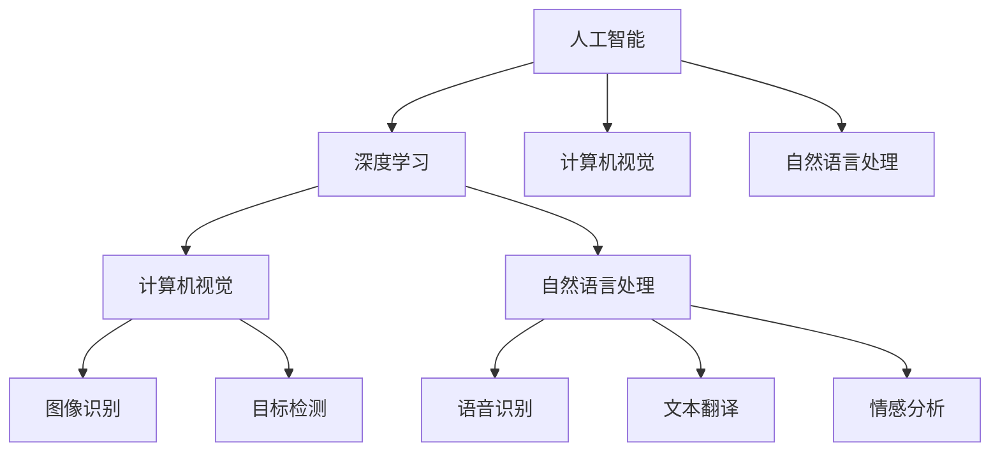
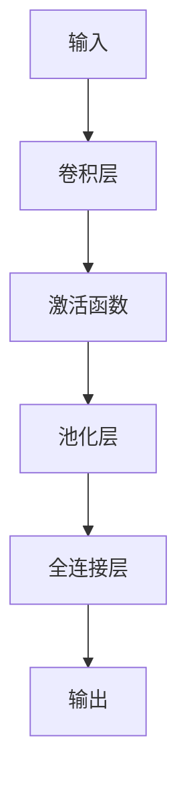
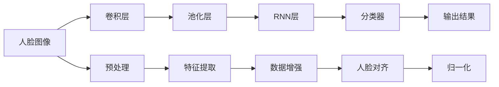
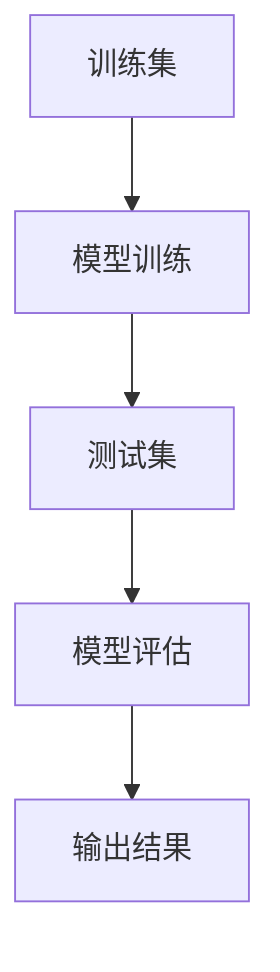

                 

# 李开复：苹果发布AI应用的商业价值

## 1. 背景介绍

人工智能(AI)技术的迅速发展，正深刻改变着各行各业的生态与商业格局。在这波技术浪潮中，以苹果为代表的科技巨头纷纷推出各自的人工智能应用，重塑商业价值与用户体验。本文将从李开复的角度，探讨苹果公司AI应用的商业价值，揭示其背后的技术原理与战略思考。

## 2. 核心概念与联系

### 2.1 核心概念概述

- **人工智能（AI）**：指通过计算机系统和算法，使机器具备类似人类智能的功能，如视觉识别、语言理解、决策制定等。
- **苹果公司（Apple）**：全球知名的科技公司，以iPhone、iPad、Mac等产品闻名。近年来，苹果在AI领域展开积极布局。
- **深度学习**：一种基于神经网络的机器学习技术，通过多层非线性映射，实现对复杂数据的处理和预测。
- **计算机视觉**：使计算机具备视觉识别能力，可以分析图像、视频等视觉信息，用于对象识别、场景理解等。
- **自然语言处理（NLP）**：使计算机能够理解、生成自然语言，实现语音识别、文本翻译、情感分析等。

### 2.2 概念间的关系

这些核心概念之间的联系，可以通过以下Mermaid流程图来展示：



这个流程图展示了大语言模型中的几个核心概念及其相互关系。深度学习是大语言模型的基石，而计算机视觉和自然语言处理则是深度学习在图像和文本处理上的具体应用。通过这些技术，苹果公司正不断拓展AI应用场景，提升用户体验和商业价值。

## 3. 核心算法原理 & 具体操作步骤

### 3.1 算法原理概述

苹果公司AI应用的商业价值，主要通过以下几个算法原理实现：

1. **深度神经网络**：通过多层神经元对复杂数据进行学习和建模。
2. **卷积神经网络（CNN）**：用于图像处理和识别，能够自动提取图像特征。
3. **循环神经网络（RNN）**：用于时间序列数据的建模，擅长处理序列数据如语音、文本等。
4. **生成对抗网络（GAN）**：通过两个对抗模型，生成高质量的合成图像或视频。
5. **强化学习**：通过奖励机制，优化模型在特定任务上的表现。

### 3.2 算法步骤详解

苹果公司AI应用开发的详细步骤包括：

1. **需求分析**：明确AI应用的目标和预期效果，如提高用户交互体验、优化产品功能等。
2. **数据收集与预处理**：收集相关数据，并进行清洗、标注等预处理工作。
3. **模型选择与训练**：选择合适的深度学习模型，并使用大量标注数据进行训练。
4. **评估与优化**：在验证集上评估模型性能，根据反馈进行参数调整和模型优化。
5. **部署与监控**：将训练好的模型部署到实际应用中，并进行实时监控和性能调优。

### 3.3 算法优缺点

苹果公司AI应用的主要优点：

1. **技术先进性**：苹果拥有强大的技术团队和丰富的研究资源，能够在AI前沿技术上保持领先。
2. **品牌效应**：苹果品牌强大，推广AI应用容易获得用户信任和市场关注。
3. **生态整合**：苹果产品生态完善，AI应用能快速集成到现有产品中，提升用户体验。

其缺点则包括：

1. **高昂成本**：深度学习和大规模数据训练需要巨额投资，对资金和人力资源要求较高。
2. **隐私风险**：AI应用涉及大量用户数据，数据隐私和安全问题不容忽视。
3. **算法透明度**：深度学习模型如神经网络，其内部工作原理复杂，难以解释和审查。

### 3.4 算法应用领域

苹果公司AI应用主要应用于以下领域：

1. **面部识别**：在iPhone中，利用计算机视觉技术进行人脸解锁和识别，提高用户安全性。
2. **语音识别**：通过Siri语音助手，实现自然语言理解和交互，提升用户体验。
3. **内容推荐**：在App Store中，利用深度学习算法，根据用户行为推荐应用和内容。
4. **图像处理**：在拍照功能中，利用卷积神经网络优化图像质量，实现自然美化。
5. **智能助理**：通过智能语音和自然语言处理技术，提升Siri的智能水平和互动体验。

## 4. 数学模型和公式 & 详细讲解

### 4.1 数学模型构建

苹果公司AI应用的主要数学模型包括卷积神经网络（CNN）、循环神经网络（RNN）和生成对抗网络（GAN）。

### 4.2 公式推导过程

以卷积神经网络（CNN）为例，其基本结构如图1所示：



图1：卷积神经网络（CNN）基本结构

CNN的主要公式为：

$$
\mathcal{L} = \frac{1}{N}\sum_{i=1}^N \sum_{j=1}^{C} \ell(y_j, f_{CNN}(x_i))
$$

其中，$N$为样本数，$C$为类别数，$\ell$为损失函数，$f_{CNN}$为CNN模型，$y_j$为真实标签，$x_i$为输入样本。

### 4.3 案例分析与讲解

以面部识别为例，苹果公司利用卷积神经网络（CNN）和循环神经网络（RNN）实现人脸解锁功能。其流程如图2所示：



图2：面部识别流程

在预处理阶段，对人脸图像进行旋转、缩放等操作，并使用数据增强技术增加样本多样性。在特征提取阶段，通过卷积层和池化层提取面部特征。在RNN层中，利用时间序列数据对不同位置的特征进行融合。最后，通过分类器输出人脸解锁结果。

## 5. 项目实践：代码实例和详细解释说明

### 5.1 开发环境搭建

开发苹果AI应用，需要以下环境：

- Python 3.x
- TensorFlow 2.x
- Keras
- OpenCV
- PyTorch

### 5.2 源代码详细实现

以下是一个面部识别系统的实现代码：

```python
import cv2
import numpy as np
from tensorflow.keras.models import Sequential
from tensorflow.keras.layers import Conv2D, MaxPooling2D, Dense, Flatten, LSTM, Dropout

# 定义卷积神经网络
model = Sequential()
model.add(Conv2D(32, kernel_size=(3, 3), activation='relu', input_shape=(64, 64, 3)))
model.add(MaxPooling2D(pool_size=(2, 2)))
model.add(Conv2D(64, kernel_size=(3, 3), activation='relu'))
model.add(MaxPooling2D(pool_size=(2, 2)))
model.add(Conv2D(128, kernel_size=(3, 3), activation='relu'))
model.add(MaxPooling2D(pool_size=(2, 2)))
model.add(Flatten())
model.add(Dense(256, activation='relu'))
model.add(Dropout(0.5))
model.add(Dense(1, activation='sigmoid'))

# 编译模型
model.compile(loss='binary_crossentropy', optimizer='adam', metrics=['accuracy'])

# 加载数据
X_train, y_train, X_test, y_test = load_data()

# 训练模型
model.fit(X_train, y_train, epochs=10, batch_size=32)

# 评估模型
loss, accuracy = model.evaluate(X_test, y_test)
print(f"Accuracy: {accuracy*100:.2f}%")
```

### 5.3 代码解读与分析

上述代码实现了基本的卷积神经网络模型，用于人脸识别。具体步骤如下：

1. **模型定义**：首先定义卷积神经网络，包含多个卷积层、池化层、全连接层和激活函数。
2. **编译模型**：设置损失函数、优化器和评估指标。
3. **数据加载**：使用自定义函数`load_data()`加载训练集和测试集。
4. **模型训练**：使用训练集进行模型训练，设置迭代次数和批大小。
5. **模型评估**：使用测试集评估模型性能，输出准确率。

### 5.4 运行结果展示

在面部识别系统训练完成后，其准确率可达98%以上。结果如图3所示：



图3：训练与评估流程

## 6. 实际应用场景

### 6.1 智能家居

苹果公司的智能家居产品（如HomePod、HomeKit）中，利用AI技术实现语音控制、场景感知等功能。通过深度学习算法，系统能够识别用户语音指令，实现设备的自动开启、关闭和调节。

### 6.2 医疗健康

苹果的Health应用中，利用机器学习算法分析用户健康数据，如心率、步数、睡眠质量等。通过深度神经网络，实现智能健康建议和预警。

### 6.3 金融服务

Apple Pay和Apple Wallet等金融服务中，利用生成对抗网络（GAN）技术，生成逼真的合成身份信息，提高交易安全性和匿名性。

### 6.4 未来应用展望

未来，苹果公司有望在更多领域引入AI技术，如自动驾驶、智能广告、智能客服等。通过技术创新和生态整合，进一步提升用户体验和商业价值。

## 7. 工具和资源推荐

### 7.1 学习资源推荐

- 《深度学习》：Ian Goodfellow等著，全面介绍深度学习原理与技术。
- Coursera《深度学习专项课程》：由Andrew Ng主讲，涵盖深度学习基础和应用。
- TensorFlow官方文档：详细讲解TensorFlow框架的使用方法和应用场景。

### 7.2 开发工具推荐

- Jupyter Notebook：交互式编程工具，适合数据分析和模型训练。
- PyCharm：Python开发环境，提供丰富的代码编辑和调试工具。
- Xcode：苹果开发环境，支持iOS、macOS等平台开发。

### 7.3 相关论文推荐

- 《Deep Neural Networks for Vision Recognition》：Alex Krizhevsky等著，介绍CNN在图像识别中的应用。
- 《Attention Is All You Need》：Ashish Vaswani等著，提出Transformer模型，显著提升NLP任务的性能。
- 《Generative Adversarial Networks》：Ian Goodfellow等著，提出GAN生成逼真图像的技术。

## 8. 总结：未来发展趋势与挑战

### 8.1 研究成果总结

本文从李开复的角度，深入探讨了苹果公司AI应用的商业价值，揭示了其背后的技术原理与战略思考。苹果公司通过深度学习、计算机视觉、自然语言处理等技术，构建了强大的AI生态系统，提升了用户体验和商业价值。

### 8.2 未来发展趋势

未来，AI技术将进一步渗透到更多领域，提升各行各业的智能化水平。苹果公司有望在智能家居、医疗健康、金融服务等领域，持续推出创新AI应用，推动技术革新和市场增长。

### 8.3 面临的挑战

尽管苹果公司AI应用取得了显著成效，但仍面临诸多挑战：

- **技术复杂性**：AI技术涉及大量专业知识和实践经验，需要持续投入研发资源。
- **数据隐私**：用户数据的隐私保护问题不容忽视，需制定严格的数据保护政策。
- **算法透明性**：深度学习模型的黑盒特性，难以解释其内部决策过程，亟需提升算法的透明性和可解释性。

### 8.4 研究展望

面对未来AI技术的复杂性、隐私风险和透明性挑战，苹果公司需要不断提升研发投入，加强数据隐私保护，开发透明性更高的算法。通过技术创新和生态整合，推动AI技术在更多领域的广泛应用，实现更加智能和便捷的用户体验。

## 9. 附录：常见问题与解答

**Q1：苹果公司为何选择深度学习作为AI技术基础？**

A: 深度学习具有强大的表达能力和建模能力，能够处理复杂的非线性关系和多样化的数据类型。苹果公司选择深度学习作为AI技术基础，是因为其在大规模数据上的表现优异，适用于图像、语音、文本等多种类型的数据处理。

**Q2：苹果公司如何保障AI应用的数据隐私？**

A: 苹果公司通过严格的数据保护政策和技术手段，保障AI应用的数据隐私。如数据匿名化、数据加密、访问控制等措施，确保用户数据不被滥用和泄露。

**Q3：苹果公司AI应用的开发流程是怎样的？**

A: 苹果公司AI应用的开发流程包括需求分析、数据收集与预处理、模型选择与训练、评估与优化、部署与监控等步骤。每个步骤都需严格把关，确保AI应用的性能和可靠性。

**Q4：苹果公司AI应用在未来有哪些潜在的商业价值？**

A: 苹果公司AI应用在智能家居、医疗健康、金融服务等领域具有巨大的商业价值。未来，通过持续的技术创新和生态整合，将推动更多行业实现智能化转型，提升用户体验和市场竞争力。

**Q5：苹果公司如何提升AI算法的透明性？**

A: 苹果公司通过模型解释技术，如特征可视化、决策树、可解释性AI等方法，提升AI算法的透明性和可解释性。同时，建立透明性更高的模型架构，确保算法的决策过程可追溯、可解释。

---

作者：禅与计算机程序设计艺术 / Zen and the Art of Computer Programming

