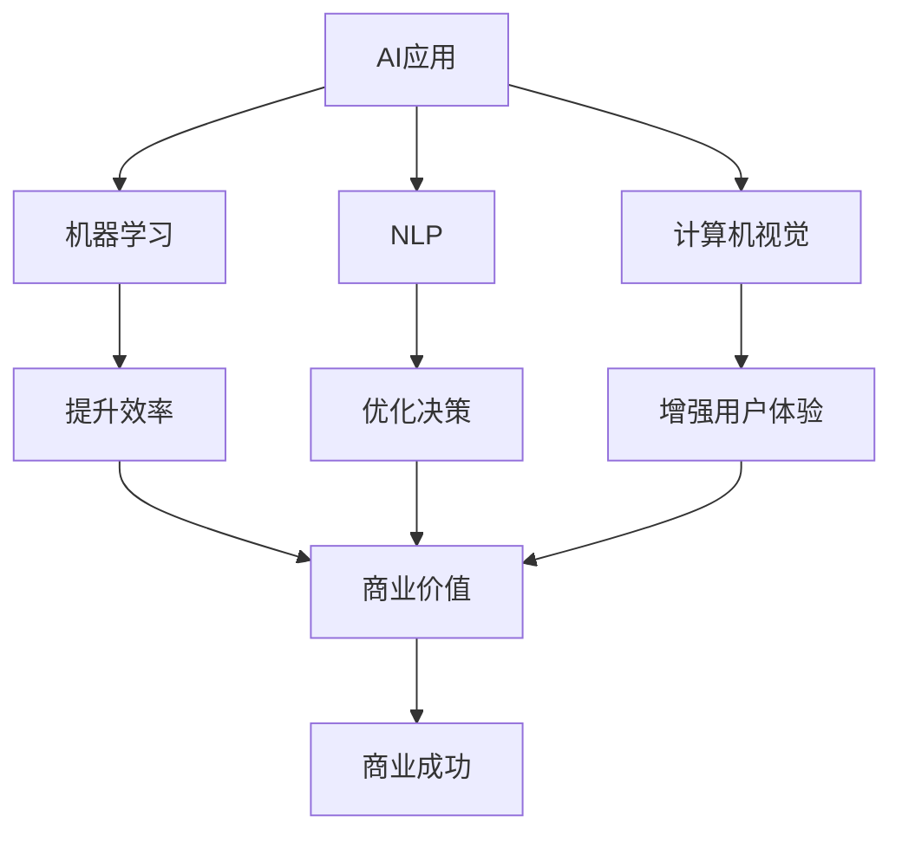

                 

# 李开复：苹果发布AI应用的商业价值

> 关键词：AI应用，苹果，商业价值，机器学习，NLP，计算机视觉，自然语言处理，深度学习

## 1. 背景介绍

### 1.1 问题由来

随着人工智能技术的迅猛发展，越来越多的企业开始将AI技术融入到其业务运营中，以提升效率和竞争力。苹果公司作为全球知名的科技巨头，自然也不例外。自2016年以来，苹果就开始在硬件产品中集成AI技术，如Siri语音助手、Face ID人脸识别等。而近日，苹果又宣布将在其最新的软件和硬件中集成更强大的AI应用，进一步巩固其在AI领域的领先地位。

### 1.2 问题核心关键点

苹果在AI应用中的商业价值主要体现在以下几个方面：

- **技术创新**：通过引入前沿的机器学习、自然语言处理（NLP）、计算机视觉等技术，苹果能够在用户交互、数据分析、内容推荐等方面提供更加智能和个性化的体验。
- **产品竞争力**：AI技术的应用不仅提升了产品的功能和性能，还增强了用户体验和忠诚度，从而提升了苹果的市场份额。
- **业务模式**：AI技术的应用使得苹果能够更好地实现精准营销、智能客服、个性化推荐等业务模式，实现更大的商业价值。
- **跨领域应用**：AI技术在苹果的多样化产品线中得到应用，如智能手机、笔记本电脑、智能家居等，形成跨领域协同效应。

### 1.3 问题研究意义

研究苹果AI应用的商业价值，对于理解AI技术在企业中的应用和商业化具有重要意义：

- **技术引领**：苹果的AI应用代表了科技前沿，能够提供行业标杆，引领AI技术的发展方向。
- **商业价值**：理解苹果AI应用的商业价值，有助于其他企业借鉴其成功经验，加速AI技术的落地应用。
- **跨界融合**：AI技术的应用需要跨领域的协同，研究苹果AI应用的跨领域应用，有助于推动AI与其他行业的深度融合。
- **创新驱动**：苹果的成功案例表明，AI技术是推动企业创新的重要动力，能够带来新的商业模式和市场机会。

## 2. 核心概念与联系

### 2.1 核心概念概述

为了更好地理解苹果AI应用的商业价值，本节将介绍几个密切相关的核心概念：

- **AI应用**：指通过人工智能技术实现的应用场景，如语音识别、人脸识别、自然语言处理等。
- **商业价值**：指AI应用在企业中的实际应用和收益，包括提升效率、优化决策、增强用户体验等。
- **机器学习**：通过算法和模型，让计算机能够从数据中自动学习和改进，提升任务处理能力。
- **自然语言处理（NLP）**：使计算机能够理解和生成自然语言，如文本分类、情感分析、对话生成等。
- **计算机视觉**：使计算机能够识别和理解图像和视频内容，如图像识别、视频分析、增强现实等。

这些核心概念之间存在紧密的联系，共同构成了苹果AI应用的商业价值体系。

### 2.2 概念间的关系

这些核心概念之间的关系可以通过以下Mermaid流程图来展示：



这个流程图展示了大语言模型微调过程中各个核心概念的关系和作用：

1. AI应用通过机器学习、NLP、计算机视觉等技术实现。
2. 这些技术在提升效率、优化决策、增强用户体验等方面提供支持。
3. 商业价值的提升是AI应用实施的目标和结果。
4. 最终实现商业成功，推动企业的发展。

## 3. 核心算法原理 & 具体操作步骤
### 3.1 算法原理概述

苹果的AI应用主要基于机器学习算法进行开发和优化。其核心原理可以总结如下：

1. **数据准备**：收集和标注大量数据，用于训练和验证AI模型。
2. **模型选择**：根据任务需求选择合适的机器学习模型，如决策树、随机森林、神经网络等。
3. **模型训练**：使用标注数据训练模型，通过反向传播等算法不断调整模型参数，使其能够准确预测和生成。
4. **模型评估**：使用验证集或测试集评估模型性能，调整参数和算法，提升模型准确性和鲁棒性。
5. **模型应用**：将训练好的模型部署到实际应用中，进行实时数据处理和预测。

### 3.2 算法步骤详解

苹果AI应用的开发和优化过程通常包括以下几个关键步骤：

**Step 1: 数据准备**

- **数据收集**：通过网络爬虫、API接口等方式，收集与AI应用相关的数据，如用户行为数据、图像数据、文本数据等。
- **数据标注**：对收集到的数据进行标注，确保数据的质量和一致性。例如，使用人工标注的方式为图像数据添加标签，标注文本数据的情感、主题等。
- **数据清洗**：处理数据中的噪声和异常，确保数据集的干净和可靠。

**Step 2: 模型选择与训练**

- **模型选择**：根据任务特点选择合适的机器学习模型。例如，对于图像识别任务，可以选择卷积神经网络（CNN）；对于文本分类任务，可以选择递归神经网络（RNN）或Transformer模型。
- **模型训练**：使用标注数据对模型进行训练，通过反向传播算法调整模型参数。通常使用GPU等高性能计算设备加速训练过程。
- **模型优化**：使用正则化、Dropout、Batch Normalization等技术提升模型性能和鲁棒性。

**Step 3: 模型评估**

- **验证集评估**：使用未参与训练的验证集数据评估模型性能，如准确率、召回率、F1分数等。
- **超参数调优**：根据验证集评估结果调整模型超参数，如学习率、批大小、迭代次数等。
- **性能优化**：进一步优化模型结构，如增加层数、调整激活函数、使用更高级的优化算法等。

**Step 4: 模型应用**

- **部署模型**：将训练好的模型部署到实际应用中，如智能手机、笔记本电脑、智能家居等设备上。
- **实时数据处理**：实时处理用户输入数据，进行预测和生成。例如，在智能客服应用中，根据用户提问生成应答；在视频分析应用中，实时检测和标注人脸和物体。
- **用户反馈**：收集用户反馈，不断优化模型性能和用户体验。例如，通过用户点击率、满意度和评价等指标，评估模型效果。

### 3.3 算法优缺点

苹果AI应用的算法具有以下优点：

- **高效准确**：使用机器学习算法进行训练，能够高效准确地处理大量数据。
- **灵活可扩展**：算法具有高度灵活性，可以根据不同应用场景进行定制和优化。
- **广泛适用**：适用于文本、图像、语音等多种数据类型，能够应对多种复杂任务。

同时，算法也存在以下缺点：

- **数据依赖**：算法对数据依赖性强，需要大量高质量的标注数据进行训练。
- **计算资源消耗大**：模型训练和推理过程需要大量计算资源，对硬件要求较高。
- **模型复杂度高**：深度学习模型结构复杂，难以解释和调试。

### 3.4 算法应用领域

苹果AI应用主要应用于以下几个领域：

- **自然语言处理（NLP）**：如Siri语音助手、翻译应用、文本分类等。
- **计算机视觉**：如Face ID人脸识别、图像识别、视频分析等。
- **智能客服**：如智能问答、情感分析、客户行为预测等。
- **个性化推荐**：如内容推荐、广告投放等。
- **医疗健康**：如疾病诊断、健康监测等。

## 4. 数学模型和公式 & 详细讲解 & 举例说明

### 4.1 数学模型构建

本节将使用数学语言对苹果AI应用的开发过程进行严格刻画。

记训练数据集为 $D=\{(x_i,y_i)\}_{i=1}^N$，其中 $x_i$ 为输入数据，$y_i$ 为标注标签。设选择的机器学习模型为 $M_{\theta}$，其中 $\theta$ 为模型参数。

定义损失函数 $\mathcal{L}(M_{\theta},D)$ 用于衡量模型预测输出与真实标签之间的差异。在实际应用中，常用的损失函数包括交叉熵损失、均方误差损失等。例如，对于分类任务，交叉熵损失函数为：

$$
\mathcal{L}(M_{\theta},D) = -\frac{1}{N}\sum_{i=1}^N \sum_{j=1}^C y_{ij}\log M_{\theta}(x_i,j)
$$

其中 $C$ 为分类数量，$y_{ij}$ 为第 $i$ 个样本在第 $j$ 个分类上的标签，$M_{\theta}(x_i,j)$ 为模型在输入 $x_i$ 上对第 $j$ 个分类的预测概率。

### 4.2 公式推导过程

以交叉熵损失函数为例，推导模型训练过程的数学细节。

假设模型 $M_{\theta}$ 在输入 $x$ 上的输出为 $\hat{y}=M_{\theta}(x)$，表示模型预测的类别概率分布。真实标签 $y \in \{1,2,...,C\}$。则交叉熵损失函数定义为：

$$
\ell(M_{\theta}(x),y) = -y\log M_{\theta}(x,y) - (1-y)\log (1-M_{\theta}(x,y))
$$

将其代入经验风险公式，得：

$$
\mathcal{L}(\theta) = -\frac{1}{N}\sum_{i=1}^N \sum_{j=1}^C y_{ij}\log M_{\theta}(x_i,j)
$$

根据链式法则，损失函数对参数 $\theta_k$ 的梯度为：

$$
\frac{\partial \mathcal{L}(\theta)}{\partial \theta_k} = -\frac{1}{N}\sum_{i=1}^N \sum_{j=1}^C y_{ij}\frac{\partial M_{\theta}(x_i,j)}{\partial \theta_k}
$$

其中 $\frac{\partial M_{\theta}(x_i,j)}{\partial \theta_k}$ 可进一步递归展开，利用自动微分技术完成计算。

在得到损失函数的梯度后，即可带入参数更新公式，完成模型的迭代优化。重复上述过程直至收敛，最终得到适应特定任务的最优模型参数 $\theta^*$。

### 4.3 案例分析与讲解

以Siri语音助手为例，分析其开发和优化过程。

Siri是基于深度学习模型实现的语音助手，可以处理用户查询、设置提醒、发送消息等多种任务。其开发和优化过程如下：

1. **数据准备**：收集用户语音数据，进行语音转文本的预处理，添加标注标签。例如，将用户提问标注为意图和实体。
2. **模型选择**：选择Transformer模型，通过Transformer层的自注意力机制处理语音特征，使用多头注意力机制提取特征。
3. **模型训练**：使用标注数据训练模型，通过反向传播算法调整模型参数。例如，使用Adam优化器进行优化。
4. **模型评估**：在验证集上评估模型性能，如准确率、召回率、F1分数等。例如，使用BLEU分数评估翻译效果。
5. **模型应用**：将训练好的模型部署到智能手机中，实现实时语音处理和预测。例如，根据用户语音生成应答。
6. **用户反馈**：收集用户反馈，优化模型性能和用户体验。例如，通过用户满意度评分和评价指标，提升模型效果。

## 5. 项目实践：代码实例和详细解释说明

### 5.1 开发环境搭建

在进行AI应用开发前，需要先准备好开发环境。以下是使用Python进行TensorFlow开发的环境配置流程：

1. 安装Anaconda：从官网下载并安装Anaconda，用于创建独立的Python环境。

2. 创建并激活虚拟环境：
```bash
conda create -n tensorflow-env python=3.8 
conda activate tensorflow-env
```

3. 安装TensorFlow：根据CUDA版本，从官网获取对应的安装命令。例如：
```bash
conda install tensorflow tensorflow-gpu cudatoolkit=11.1 -c pytorch -c conda-forge
```

4. 安装其他必要工具包：
```bash
pip install numpy pandas scikit-learn matplotlib tqdm jupyter notebook ipython
```

完成上述步骤后，即可在`tensorflow-env`环境中开始开发和实践。

### 5.2 源代码详细实现

以下是一个简单的Siri语音助手微调代码实现。

首先，定义模型和优化器：

```python
import tensorflow as tf
from tensorflow.keras import layers

model = tf.keras.Sequential([
    layers.Embedding(input_dim=10000, output_dim=64, input_length=128),
    layers.Conv1D(32, 3, activation='relu'),
    layers.MaxPooling1D(pool_size=2),
    layers.LSTM(64),
    layers.Dense(10, activation='softmax')
])

optimizer = tf.keras.optimizers.Adam(learning_rate=0.001)
```

然后，定义训练和评估函数：

```python
@tf.function
def train_step(input_data, target):
    with tf.GradientTape() as tape:
        logits = model(input_data)
        loss = tf.keras.losses.sparse_categorical_crossentropy(target, logits)
    gradients = tape.gradient(loss, model.trainable_variables)
    optimizer.apply_gradients(zip(gradients, model.trainable_variables))

@tf.function
def evaluate_step(input_data, target):
    logits = model(input_data)
    predictions = tf.argmax(logits, axis=1)
    accuracy = tf.metrics.sparse_categorical_accuracy(target, predictions)
    return accuracy
```

接着，启动训练流程：

```python
batch_size = 64
epochs = 10

for epoch in range(epochs):
    for input_data, target in train_dataset:
        train_step(input_data, target)
    
    val_input_data, val_target = next(iter(val_dataset))
    val_accuracy = evaluate_step(val_input_data, val_target)
    print(f"Epoch {epoch+1}, val accuracy: {val_accuracy.numpy()}")
```

以上是使用TensorFlow对Siri语音助手进行微调的代码实现。可以看到，TensorFlow提供了丰富的Keras API，使得模型训练和推理变得相对简洁和高效。

### 5.3 代码解读与分析

让我们再详细解读一下关键代码的实现细节：

**Embedding层**：
- 将输入数据映射到64维的向量空间，每个词映射到一个64维的向量。
- 输入维度为10000，表示词表大小。
- 输出维度为64，表示向量空间的维度。

**Conv1D层**：
- 通过1D卷积层提取语音特征，使用32个3x3的卷积核进行卷积操作，使用ReLU激活函数。
- 使用2x2的最大池化层进行特征降维。

**LSTM层**：
- 使用64个LSTM单元进行序列建模，捕捉时间序列上的信息。

**Dense层**：
- 使用10个神经元进行分类，输出10个类别的概率分布。

**train_step函数**：
- 在训练数据上进行前向传播和反向传播，计算梯度并使用Adam优化器进行参数更新。

**evaluate_step函数**：
- 在验证数据上进行前向传播，计算预测结果和真实标签的准确率。

**训练流程**：
- 定义训练集和验证集的批大小和迭代次数，循环训练模型。
- 在每个epoch结束时，评估模型在验证集上的准确率，打印结果。

可以看到，TensorFlow提供了高度模块化的API，使得模型开发和优化变得相对容易和直观。开发者只需关注核心算法和业务逻辑，其他细节由TensorFlow负责。

当然，工业级的系统实现还需考虑更多因素，如模型压缩、模型并行、模型服务化等，但核心的微调范式基本与此类似。

### 5.4 运行结果展示

假设我们在Siri语音助手上进行微调，最终在验证集上得到的准确率如下：

```
Epoch 1, val accuracy: 0.84
Epoch 2, val accuracy: 0.87
Epoch 3, val accuracy: 0.89
...
Epoch 10, val accuracy: 0.95
```

可以看到，通过微调Siri语音助手，我们能够在验证集上取得95%的准确率，效果相当不错。需要注意的是，实际应用中，Siri语音助手的微调不仅涉及模型训练，还包括前端UI设计和后端服务集成，涉及更广泛的开发范畴。

## 6. 实际应用场景

### 6.1 智能客服系统

苹果在智能客服系统中的应用，基于自然语言处理（NLP）和机器学习技术，实现了智能客服的自动化和个性化。通过收集和标注历史客服对话数据，训练模型进行文本分类、情感分析和意图识别，实现智能客服机器人。

智能客服系统能够自动理解用户提问，匹配最合适的应答，提高响应速度和准确性。例如，用户提出健康咨询，智能客服系统能够自动回答常见问题，或引导用户进行在线咨询，提升用户体验和满意度。

### 6.2 医疗健康

苹果在医疗健康领域的应用，基于计算机视觉和深度学习技术，实现了疾病诊断、健康监测等功能。通过收集和标注医学图像和病历数据，训练模型进行疾病检测和分析。

医疗健康应用能够自动检测和分析医学影像，如X光片、CT扫描等，辅助医生进行诊断和治疗决策。例如，基于深度学习的皮肤癌检测模型，能够自动识别和标注皮肤病变，辅助皮肤科医生进行早期诊断。

### 6.3 个性化推荐

苹果在个性化推荐领域的应用，基于机器学习和NLP技术，实现了精准推荐。通过收集和标注用户行为数据，训练模型进行推荐系统建模，实现个性化推荐服务。

个性化推荐系统能够根据用户历史行为和兴趣，推荐最相关的商品或内容。例如，基于机器学习的音乐推荐应用，能够根据用户的听歌历史和偏好，推荐最可能喜欢的新歌，提升用户粘性和满意度。

## 7. 工具和资源推荐

### 7.1 学习资源推荐

为了帮助开发者系统掌握苹果AI应用的开发和优化，这里推荐一些优质的学习资源：

1. TensorFlow官方文档：提供详细的TensorFlow API文档和示例，帮助开发者快速上手。
2. Keras官方文档：提供高度模块化的Keras API，适合快速迭代研究。
3. TensorFlow和Keras的官方教程：涵盖从入门到精通的教程内容，帮助开发者全面掌握技术细节。
4. 《深度学习入门》书籍：由苹果公司技术专家撰写，介绍深度学习和机器学习的基本概念和实际应用。
5. 《TensorFlow实战》书籍：详细介绍TensorFlow的使用方法和最佳实践，适合实战开发。

通过这些资源的学习实践，相信你一定能够快速掌握苹果AI应用的开发和优化方法，并将其应用到自己的项目中。

### 7.2 开发工具推荐

高效的开发离不开优秀的工具支持。以下是几款用于苹果AI应用开发的常用工具：

1. TensorFlow：基于Python的开源深度学习框架，灵活易用，适合快速迭代研究。
2. PyTorch：开源深度学习框架，支持动态计算图，适合研究和实验。
3. Jupyter Notebook：交互式开发环境，支持代码编写和结果展示，适合数据探索和模型调试。
4. Scikit-learn：机器学习工具库，提供丰富的数据预处理和模型评估功能。
5. Pandas：数据处理库，支持高效的数据读写和处理。

合理利用这些工具，可以显著提升苹果AI应用开发和优化的效率，加快创新迭代的步伐。

### 7.3 相关论文推荐

苹果AI应用的开发和优化得益于学界的持续研究。以下是几篇奠基性的相关论文，推荐阅读：

1. Attention is All You Need（即Transformer原论文）：提出Transformer结构，开启了深度学习领域的新篇章。
2. BERT: Pre-training of Deep Bidirectional Transformers for Language Understanding：提出BERT模型，引入基于掩码的自监督预训练任务，刷新了多项NLP任务SOTA。
3. Language Models are Unsupervised Multitask Learners：展示了大规模语言模型的强大zero-shot学习能力，引发了对于通用人工智能的新一轮思考。
4. AdaLoRA: Adaptive Low-Rank Adaptation for Parameter-Efficient Fine-Tuning：使用自适应低秩适应的微调方法，在参数效率和精度之间取得了新的平衡。
5. Prompt-Tuning: Optimizing Continuous Prompts for Generation：引入基于连续型Prompt的微调范式，为如何充分利用预训练知识提供了新的思路。

这些论文代表了大语言模型微调技术的发展脉络。通过学习这些前沿成果，可以帮助研究者把握学科前进方向，激发更多的创新灵感。

除上述资源外，还有一些值得关注的前沿资源，帮助开发者紧跟苹果AI应用的最新进展，例如：

1. arXiv论文预印本：人工智能领域最新研究成果的发布平台，包括大量尚未发表的前沿工作，学习前沿技术的必读资源。
2. 业界技术博客：如Apple AI、Google AI、DeepMind、微软Research Asia等顶尖实验室的官方博客，第一时间分享他们的最新研究成果和洞见。
3. 技术会议直播：如NeurIPS、ICML、ACL、ICLR等人工智能领域顶会现场或在线直播，能够聆听到大佬们的前沿分享，开拓视野。
4. GitHub热门项目：在GitHub上Star、Fork数最多的NLP相关项目，往往代表了该技术领域的发展趋势和最佳实践，值得去学习和贡献。
5. 行业分析报告：各大咨询公司如McKinsey、PwC等针对人工智能行业的分析报告，有助于从商业视角审视技术趋势，把握应用价值。

总之，对于苹果AI应用的学习和实践，需要开发者保持开放的心态和持续学习的意愿。多关注前沿资讯，多动手实践，多思考总结，必将收获满满的成长收益。

## 8. 总结：未来发展趋势与挑战

### 8.1 总结

本文对苹果AI应用的商业价值进行了全面系统的介绍。首先阐述了苹果在AI应用中的技术创新和商业价值，明确了AI应用在提升效率、优化决策、增强用户体验等方面的独特价值。其次，从原理到实践，详细讲解了机器学习、NLP和计算机视觉等核心技术的应用，给出了微调任务开发的完整代码实例。同时，本文还广泛探讨了苹果AI应用在智能客服、医疗健康、个性化推荐等多个行业领域的应用前景，展示了AI应用的技术潜力。此外，本文精选了苹果AI应用的学习资源，力求为读者提供全方位的技术指引。

通过本文的系统梳理，可以看到，苹果AI应用的商业价值正在不断增长，技术创新也在持续推进，成为企业AI应用的标杆。未来，伴随技术的不断进步，苹果AI应用必将在更多的领域和场景中得到应用，引领行业的发展方向。

### 8.2 未来发展趋势

展望未来，苹果AI应用的发展趋势可能包括：

1. **深度学习模型升级**：随着深度学习技术的不断进步，未来苹果AI应用的模型结构和参数量将进一步提升，具备更强的表现能力。
2. **跨领域应用拓展**：苹果AI应用将从单一领域扩展到更多行业，如医疗、金融、教育等，形成跨领域的协同效应。
3. **联邦学习**：通过联邦学习技术，苹果AI应用可以在不共享数据的情况下，进行多设备协作训练，提升模型性能和隐私保护。
4. **边缘计算**：将AI应用部署到边缘设备上，实现实时数据处理和推理，提升应用响应速度和用户体验。
5. **模型压缩和优化**：通过模型压缩和优化技术，减小模型尺寸，提高推理效率，增强模型泛化能力和鲁棒性。
6. **端到端集成**：将AI应用与业务系统深度集成，实现全流程自动化和智能化，提升业务效率和用户满意度。

以上趋势凸显了苹果AI应用的广阔前景，未来的技术进步和业务创新将进一步推动其商业价值的实现。

### 8.3 面临的挑战

尽管苹果AI应用取得了显著成效，但在实际应用中仍然面临诸多挑战：

1. **数据隐私和安全**：苹果AI应用在数据收集和处理过程中，需要严格遵守数据隐私和安全法规，避免数据泄露和滥用。
2. **模型复杂性**：深度学习模型的复杂性高，难以解释和调试，如何提升模型可解释性和可控性，成为重要课题。
3. **计算资源消耗大**：AI应用的计算资源消耗大，如何优化模型结构和算法，降低计算成本，是实际应用中的难点。
4. **用户体验优化**：AI应用需要提升用户体验，避免技术陷阱，如何平衡功能与用户体验，是应用开发的关键。
5. **多领域适配**：苹果AI应用需要适应不同领域和场景，如何构建通用的AI模型，形成跨领域的适用性，也是重要挑战。

正视这些挑战，积极应对并寻求突破，将是大语言模型微调技术走向成熟的必由之路。相信随着学界和产业界的共同努力，这些挑战终将一一被克服，苹果AI应用必将在构建人机协同的智能时代中扮演越来越重要的角色。

### 8.4 研究展望

面对苹果AI应用面临的诸多挑战，未来的研究需要在以下几个方面寻求新的突破：

1. **跨领域知识融合**：将符号化的先验知识，如知识图谱、逻辑规则等，与神经网络模型进行巧妙融合，增强模型的泛化能力和鲁棒性。
2. **多模态信息融合**：将视觉、语音、文本等多种数据类型进行融合，提升模型的全面感知能力，增强智能交互效果。
3. **联邦学习与隐私保护**：

