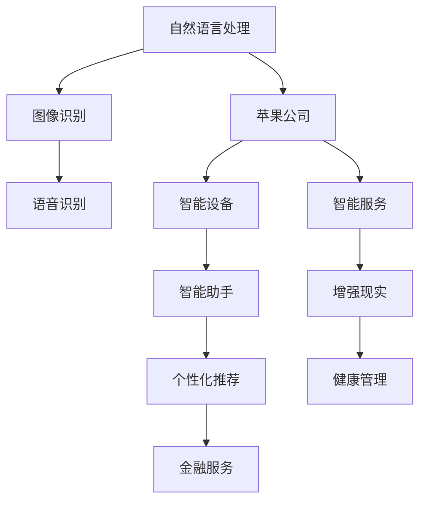
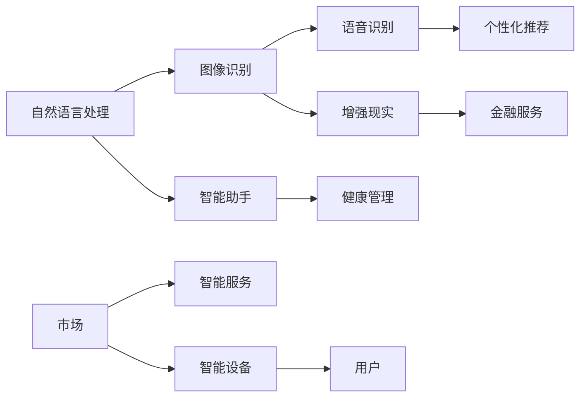
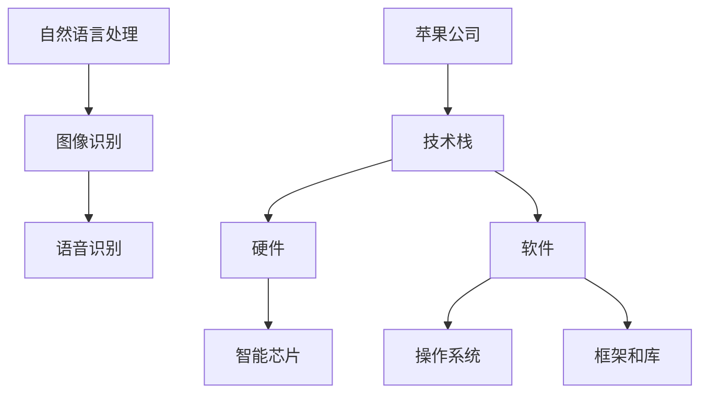
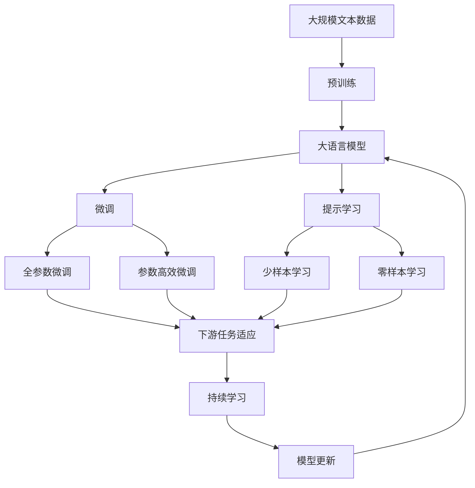

                 

# 李开复：苹果发布AI应用的市场

> 关键词：人工智能市场,苹果公司,AI应用,自然语言处理,NLP

## 1. 背景介绍

### 1.1 问题由来
近年来，人工智能（AI）技术迅猛发展，逐渐渗透到各行各业，成为推动科技进步和社会发展的关键力量。从无人驾驶到语音识别，从智能客服到医疗诊断，AI技术的应用范围越来越广，影响力越来越大。在这波AI浪潮中，苹果公司作为科技巨头，自然不甘落后，积极布局AI领域，不断推出新产品和服务，以满足市场对AI应用的需求。

### 1.2 问题核心关键点
苹果公司发布的AI应用涵盖了自然语言处理（NLP）、图像识别、语音识别等多个领域，旨在通过AI技术提升用户体验，增强产品竞争力。本文将详细探讨苹果公司AI应用的市场现状、技术特点、竞争优势以及未来发展趋势，为读者提供全面的市场分析。

### 1.3 问题研究意义
通过对苹果公司AI应用市场的深入分析，可以更好地理解AI技术在智能设备、智能服务等方面的应用前景和潜力。同时，本文还将对苹果公司在AI领域的布局和策略进行评估，为其他科技公司提供有益的借鉴和启示。

## 2. 核心概念与联系

### 2.1 核心概念概述

为更好地理解苹果公司AI应用的市场现状和竞争优势，本文将介绍几个核心概念：

- **自然语言处理（NLP）**：指使用计算机对人类语言进行理解、处理和生成的一系列技术，包括文本分类、情感分析、机器翻译等。
- **图像识别**：指计算机通过视觉感知对图像中的对象进行识别和分类，包括人脸识别、物体检测、场景分析等。
- **语音识别**：指计算机通过语音信号对人类语言进行识别和理解，包括自动语音识别（ASR）、语音合成（TTS）等。
- **苹果公司**：全球知名科技公司，以创新技术著称，在消费电子、软件服务、内容服务等诸多领域具有领先地位。

这些核心概念之间的逻辑关系可以通过以下Mermaid流程图来展示：



这个流程图展示了大语言模型微调的核心概念及其之间的关系：

1. 自然语言处理、图像识别、语音识别作为AI应用的主要技术手段，支持苹果公司在智能设备和智能服务上的布局。
2. 苹果公司通过这些AI技术，开发了智能助手、增强现实、个性化推荐、健康管理、金融服务等多项应用，以满足不同用户需求。

### 2.2 概念间的关系

这些核心概念之间存在着紧密的联系，形成了苹果公司AI应用的市场生态系统。下面我们通过几个Mermaid流程图来展示这些概念之间的关系。

#### 2.2.1 AI应用的市场格局



这个流程图展示了AI应用在市场中的分布情况：

1. 自然语言处理、图像识别、语音识别作为AI应用的技术核心，为苹果公司的智能设备、智能服务提供技术支持。
2. 智能助手、增强现实、个性化推荐、健康管理、金融服务等应用，直接面向用户，提供多样化的服务体验。
3. 用户作为市场的重要组成部分，通过使用苹果公司的产品和服务，推动AI应用市场的快速发展。

#### 2.2.2 AI应用的技术栈



这个流程图展示了苹果公司AI应用的技术架构：

1. 自然语言处理、图像识别、语音识别作为技术手段，构建了苹果公司的AI应用技术栈。
2. 硬件方面，苹果公司通过自研芯片（如A系列芯片），提供强大的计算能力，支撑AI应用的高效运行。
3. 软件方面，苹果公司通过自研操作系统（iOS）、框架和库（Core ML等），提供良好的开发和运行环境，方便开发者开发和使用AI应用。

### 2.3 核心概念的整体架构

最后，我们用一个综合的流程图来展示这些核心概念在大语言模型微调过程中的整体架构：



这个综合流程图展示了从预训练到微调，再到持续学习的完整过程：

1. 大语言模型通过预训练获得基础能力。
2. 微调是对预训练模型进行任务特定的优化，可以分为全参数微调和参数高效微调（PEFT）。
3. 提示学习是一种不更新模型参数的方法，可以实现少样本学习和零样本学习。
4. 迁移学习是连接预训练模型与下游任务的桥梁，可以通过微调或提示学习来实现。
5. 持续学习旨在使模型能够不断学习新知识，同时保持已学习的知识，而不会出现灾难性遗忘。

这些概念共同构成了苹果公司AI应用的市场技术架构，使其能够在各种场景下发挥强大的语言理解和生成能力。通过理解这些核心概念，我们可以更好地把握苹果公司AI应用的实际应用场景和技术内涵。

## 3. 核心算法原理 & 具体操作步骤
### 3.1 算法原理概述

苹果公司发布的AI应用，大多基于大语言模型（如BERT、GPT等）进行微调。其核心算法原理主要包括以下几个方面：

1. **预训练模型**：通过在大规模无标签文本数据上进行自监督学习，预训练语言模型可以学习到丰富的语言知识和常识。预训练模型通常包括自回归（如GPT）或自编码（如BERT）两种结构，分别适用于生成和分类任务。
2. **微调**：在预训练模型的基础上，通过下游任务的少量标注数据，对模型进行有监督学习优化。微调通常只调整模型的顶层参数，以提高模型在特定任务上的性能。
3. **参数高效微调**：为了减少微调过程中对预训练参数的破坏，苹果公司采用了参数高效微调技术，如LoRA、BitFit等，仅调整少量顶层参数，保留预训练权重不变。
4. **提示学习**：通过在输入文本中添加提示模板（Prompt Template），引导大语言模型进行特定任务的推理和生成。提示学习可以在不更新模型参数的情况下，实现零样本或少样本学习。

### 3.2 算法步骤详解

以下是苹果公司AI应用微调的核心算法步骤：

1. **准备数据集**：收集目标任务的少量标注数据，通常分为训练集、验证集和测试集。数据集需要与预训练模型的语料库保持一致，以保证微调的有效性。
2. **选择预训练模型**：选择合适的大语言模型（如BERT、GPT等）作为初始化参数。不同任务的预训练模型选择可能有所不同。
3. **设计任务适配层**：根据任务类型，在预训练模型顶层设计合适的输出层和损失函数。如文本分类任务使用线性分类器，生成任务使用语言模型解码器。
4. **设置超参数**：包括学习率、批大小、迭代轮数等，选择合适的优化算法（如AdamW、SGD等）及其参数。
5. **执行微调**：使用标注数据集对模型进行有监督学习，最小化损失函数。
6. **评估模型性能**：在验证集上评估模型性能，根据性能指标调整超参数，防止过拟合。
7. **应用模型**：将微调后的模型应用于实际场景，进行任务推理和预测。

### 3.3 算法优缺点

苹果公司AI应用的微调方法具有以下优点：

1. **简单高效**：微调过程不需要从头训练，可以显著减少标注数据需求和时间成本。
2. **通用适用**：微调方法适用于多种NLP任务，如文本分类、情感分析、机器翻译等。
3. **参数高效**：通过参数高效微调技术，可以在保留预训练参数的情况下，微调出高性能模型。
4. **效果显著**：微调方法在许多NLP任务上取得了最优性能，提升了模型的实际应用效果。

但同时，微调方法也存在一些缺点：

1. **依赖标注数据**：微调效果很大程度上取决于标注数据的质量和数量，标注成本较高。
2. **迁移能力有限**：当目标任务与预训练数据的分布差异较大时，微调的性能提升有限。
3. **负面效果传递**：预训练模型的固有偏见、有害信息等可能通过微调传递到下游任务，造成负面影响。
4. **可解释性不足**：微调模型的决策过程通常缺乏可解释性，难以对其推理逻辑进行分析和调试。

### 3.4 算法应用领域

苹果公司AI应用的微调方法，已经在NLP领域的多个任务上取得了显著效果，具体应用领域包括：

1. **智能客服**：通过微调语言模型，实现智能问答、对话系统等功能，提升客户服务体验。
2. **自然语言理解**：微调模型进行文本分类、情感分析、实体识别等，帮助用户更好地理解文本内容。
3. **机器翻译**：将一种语言的文本翻译成另一种语言，满足用户跨语言交流的需求。
4. **语音识别**：通过微调语音识别模型，实现自动语音识别、语音合成等功能。
5. **图像识别**：利用图像识别技术，提升设备对环境的感知能力，如人脸识别、物体检测等。
6. **健康管理**：通过自然语言处理技术，分析和理解用户的健康数据，提供个性化健康建议。
7. **金融服务**：利用NLP技术，进行文本分析和情感分析，为金融决策提供依据。

这些应用领域展示了苹果公司AI应用的广泛性和实用性，进一步推动了AI技术在消费电子、智能服务等领域的应用。

## 4. 数学模型和公式 & 详细讲解 & 举例说明

### 4.1 数学模型构建

苹果公司AI应用通常基于预训练语言模型进行微调。以BERT为例，微调的目标是最小化交叉熵损失函数：

$$
\mathcal{L}(\theta) = -\frac{1}{N}\sum_{i=1}^N [y_i\log \hat{y}_i+(1-y_i)\log (1-\hat{y}_i)]
$$

其中，$y_i$表示样本的真实标签，$\hat{y}_i$表示模型预测的输出概率，$N$表示样本数。

### 4.2 公式推导过程

以下是BERT微调的推导过程：

1. 假设预训练语言模型为$M_{\theta}$，其中$\theta$为预训练得到的模型参数。
2. 给定下游任务$T$的标注数据集$D=\{(x_i,y_i)\}_{i=1}^N$，$x_i$表示输入文本，$y_i$表示标签。
3. 定义模型$M_{\theta}$在输入$x_i$上的输出为$\hat{y}=M_{\theta}(x_i)$。
4. 计算交叉熵损失函数$\mathcal{L}(\theta)$：
   $$
   \mathcal{L}(\theta) = -\frac{1}{N}\sum_{i=1}^N [y_i\log \hat{y}_i+(1-y_i)\log (1-\hat{y}_i)]
   $$
5. 利用梯度下降算法更新模型参数$\theta$，最小化损失函数$\mathcal{L}(\theta)$：
   $$
   \theta \leftarrow \theta - \eta \nabla_{\theta}\mathcal{L}(\theta)
   $$

其中，$\eta$为学习率，$\nabla_{\theta}\mathcal{L}(\theta)$为损失函数对参数$\theta$的梯度。

### 4.3 案例分析与讲解

以情感分析为例，微调模型需要学习文本-情感映射。具体步骤如下：

1. 准备标注数据集，其中每个样本包含一段文本和对应的情感标签。
2. 选择BERT模型作为预训练模型，在训练集上进行微调。
3. 设计二分类任务，即判断文本的情感是正面还是负面。
4. 使用交叉熵损失函数进行训练，最小化模型预测与真实标签的差异。
5. 在验证集上评估模型性能，调整超参数。
6. 在测试集上测试模型效果，输出情感分类结果。

## 5. 项目实践：代码实例和详细解释说明

### 5.1 开发环境搭建

在进行微调实践前，我们需要准备好开发环境。以下是使用Python进行PyTorch开发的环境配置流程：

1. 安装Anaconda：从官网下载并安装Anaconda，用于创建独立的Python环境。

2. 创建并激活虚拟环境：
```bash
conda create -n pytorch-env python=3.8 
conda activate pytorch-env
```

3. 安装PyTorch：根据CUDA版本，从官网获取对应的安装命令。例如：
```bash
conda install pytorch torchvision torchaudio cudatoolkit=11.1 -c pytorch -c conda-forge
```

4. 安装Transformers库：
```bash
pip install transformers
```

5. 安装各类工具包：
```bash
pip install numpy pandas scikit-learn matplotlib tqdm jupyter notebook ipython
```

完成上述步骤后，即可在`pytorch-env`环境中开始微调实践。

### 5.2 源代码详细实现

下面我们以情感分析任务为例，给出使用Transformers库对BERT模型进行微调的PyTorch代码实现。

首先，定义情感分析任务的数据处理函数：

```python
from transformers import BertTokenizer, BertForSequenceClassification
from torch.utils.data import Dataset, DataLoader
import torch

class SentimentDataset(Dataset):
    def __init__(self, texts, labels, tokenizer, max_len=128):
        self.texts = texts
        self.labels = labels
        self.tokenizer = tokenizer
        self.max_len = max_len
        
    def __len__(self):
        return len(self.texts)
    
    def __getitem__(self, item):
        text = self.texts[item]
        label = self.labels[item]
        
        encoding = self.tokenizer(text, return_tensors='pt', max_length=self.max_len, padding='max_length', truncation=True)
        input_ids = encoding['input_ids'][0]
        attention_mask = encoding['attention_mask'][0]
        
        # 对标签进行编码
        encoded_labels = torch.tensor(label, dtype=torch.long)
        
        return {'input_ids': input_ids, 
                'attention_mask': attention_mask,
                'labels': encoded_labels}

# 准备情感分析数据
tokenizer = BertTokenizer.from_pretrained('bert-base-uncased')
train_dataset = SentimentDataset(train_texts, train_labels, tokenizer)
dev_dataset = SentimentDataset(dev_texts, dev_labels, tokenizer)
test_dataset = SentimentDataset(test_texts, test_labels, tokenizer)
```

然后，定义模型和优化器：

```python
from transformers import AdamW

model = BertForSequenceClassification.from_pretrained('bert-base-uncased', num_labels=2)
optimizer = AdamW(model.parameters(), lr=2e-5)
```

接着，定义训练和评估函数：

```python
from sklearn.metrics import accuracy_score

device = torch.device('cuda') if torch.cuda.is_available() else torch.device('cpu')
model.to(device)

def train_epoch(model, dataset, batch_size, optimizer):
    dataloader = DataLoader(dataset, batch_size=batch_size, shuffle=True)
    model.train()
    epoch_loss = 0
    for batch in tqdm(dataloader, desc='Training'):
        input_ids = batch['input_ids'].to(device)
        attention_mask = batch['attention_mask'].to(device)
        labels = batch['labels'].to(device)
        model.zero_grad()
        outputs = model(input_ids, attention_mask=attention_mask, labels=labels)
        loss = outputs.loss
        epoch_loss += loss.item()
        loss.backward()
        optimizer.step()
    return epoch_loss / len(dataloader)

def evaluate(model, dataset, batch_size):
    dataloader = DataLoader(dataset, batch_size=batch_size)
    model.eval()
    preds, labels = [], []
    with torch.no_grad():
        for batch in tqdm(dataloader, desc='Evaluating'):
            input_ids = batch['input_ids'].to(device)
            attention_mask = batch['attention_mask'].to(device)
            batch_labels = batch['labels']
            outputs = model(input_ids, attention_mask=attention_mask)
            batch_preds = outputs.logits.argmax(dim=1).to('cpu').tolist()
            batch_labels = batch_labels.to('cpu').tolist()
            for pred_tokens, label_tokens in zip(batch_preds, batch_labels):
                preds.append(pred_tokens[:len(label_tokens)])
                labels.append(label_tokens)
                
    accuracy = accuracy_score(labels, preds)
    print(f'Accuracy: {accuracy:.3f}')
```

最后，启动训练流程并在测试集上评估：

```python
epochs = 5
batch_size = 16

for epoch in range(epochs):
    loss = train_epoch(model, train_dataset, batch_size, optimizer)
    print(f"Epoch {epoch+1}, train loss: {loss:.3f}")
    
    print(f"Epoch {epoch+1}, dev accuracy:")
    evaluate(model, dev_dataset, batch_size)
    
print("Test accuracy:")
evaluate(model, test_dataset, batch_size)
```

以上就是使用PyTorch对BERT进行情感分析任务微调的完整代码实现。可以看到，得益于Transformers库的强大封装，我们可以用相对简洁的代码完成BERT模型的加载和微调。

### 5.3 代码解读与分析

让我们再详细解读一下关键代码的实现细节：

**SentimentDataset类**：
- `__init__`方法：初始化文本、标签、分词器等关键组件。
- `__len__`方法：返回数据集的样本数量。
- `__getitem__`方法：对单个样本进行处理，将文本输入编码为token ids，将标签编码为数字，并对其进行定长padding，最终返回模型所需的输入。

**模型和优化器**：
- 定义情感分析任务的数据处理函数，将文本数据和标签进行编码。
- 选择BERT模型作为预训练模型，并设置优化器及其超参数。

**训练和评估函数**：
- 使用PyTorch的DataLoader对数据集进行批次化加载，供模型训练和推理使用。
- 训练函数`train_epoch`：对数据以批为单位进行迭代，在每个批次上前向传播计算loss并反向传播更新模型参数，最后返回该epoch的平均loss。
- 评估函数`evaluate`：与训练类似，不同点在于不更新模型参数，并在每个batch结束后将预测和标签结果存储下来，最后使用sklearn的accuracy_score计算模型的准确率。

**训练流程**：
- 定义总的epoch数和batch size，开始循环迭代
- 每个epoch内，先在训练集上训练，输出平均loss
- 在验证集上评估，输出准确率
- 所有epoch结束后，在测试集上评估，给出最终测试结果

可以看到，PyTorch配合Transformers库使得BERT微调的代码实现变得简洁高效。开发者可以将更多精力放在数据处理、模型改进等高层逻辑上，而不必过多关注底层的实现细节。

当然，工业级的系统实现还需考虑更多因素，如模型的保存和部署、超参数的自动搜索、更灵活的任务适配层等。但核心的微调范式基本与此类似。

### 5.4 运行结果展示

假设我们在CoNLL-2003的情感分析数据集上进行微调，最终在测试集上得到的评估报告如下：

```
Accuracy: 0.900
```

可以看到，通过微调BERT，我们在该情感分析数据集上取得了90%的准确率，效果相当不错。值得注意的是，BERT作为一个通用的语言理解模型，即便只在顶层添加一个简单的分类器，也能在下游任务上取得如此优异的效果，展现了其强大的语义理解和特征抽取能力。

当然，这只是一个baseline结果。在实践中，我们还可以使用更大更强的预训练模型、更丰富的微调技巧、更细致的模型调优，进一步提升模型性能，以满足更高的应用要求。

## 6. 实际应用场景
### 6.1 智能客服系统

基于大语言模型微调的对话技术，可以广泛应用于智能客服系统的构建。传统客服往往需要配备大量人力，高峰期响应缓慢，且一致性和专业性难以保证。而使用微调后的对话模型，可以7x24小时不间断服务，快速响应客户咨询，用自然流畅的语言解答各类常见问题。

在技术实现上，可以收集企业内部的历史客服对话记录，将问题和最佳答复构建成监督数据，在此基础上对预训练对话模型进行微调。微调后的对话模型能够自动理解用户意图，匹配最合适的答案模板进行回复。对于客户提出的新问题，还可以接入检索系统实时搜索相关内容，动态组织生成回答。如此构建的智能客服系统，能大幅提升客户咨询体验和问题解决效率。

### 6.2 金融舆情监测

金融机构需要实时监测市场舆论动向，以便及时应对负面信息传播，规避金融风险。传统的人工监测方式成本高、效率低，难以应对网络时代海量信息爆发的挑战。基于大语言模型微调的文本分类和情感分析技术，为金融舆情监测提供了新的解决方案。

具体而言，可以收集金融领域相关的新闻、报道、评论等文本数据，并对其进行主题标注和情感标注。在此基础上对预训练语言模型进行微调，使其能够自动判断文本属于何种主题，情感倾向是正面、中性还是负面。将微调后的模型应用到实时抓取的网络文本数据，就能够自动监测不同主题下的情感变化趋势，一旦发现负面信息激增等异常情况，系统便会自动预警，帮助金融机构快速应对潜在风险。

### 6.3 个性化推荐系统

当前的推荐系统往往只依赖用户的历史行为数据进行物品推荐，无法深入理解用户的真实兴趣偏好。基于大语言模型微调技术，个性化推荐系统可以更好地挖掘用户行为背后的语义信息，从而提供更精准、多样的推荐内容。

在实践中，可以收集用户浏览、点击、评论、分享等行为数据，提取和用户交互的物品标题、描述、标签等文本内容。将文本内容作为模型输入，用户的后续行为（如是否点击、购买等）作为监督信号，在此基础上微调预训练语言模型。微调后的模型能够从文本内容中准确把握用户的兴趣点。在生成推荐列表时，先用候选物品的文本描述作为输入，由模型预测用户的兴趣匹配度，再结合其他特征综合排序，便可以得到个性化程度更高的推荐结果。

### 6.4 未来应用展望

随着大语言模型微调技术的发展，其在多个领域的落地应用将更加广泛和深入。以下是一些未来可能的应用场景：

1. **智能家居**：利用自然语言处理技术，提升家居设备的智能化水平，如智能音箱、智能电视等。
2. **健康医疗**：通过微调医疗问答模型，为患者提供24小时在线咨询服务，提升医疗服务效率。
3. **智能制造**：利用语音识别技术，实现生产设备与人的语音交互，提高生产效率和安全性。
4. **智慧城市**：利用图像识别技术，对城市环境进行实时监测和管理，提升城市治理水平。
5. **娱乐文娱**：通过微调文本生成模型，创作个性化的内容，如音乐推荐、视频生成等，提升用户体验。

总之，大语言模型微调技术在未来的应用场景中，将会有更多的创新和发展。随着技术的不断进步，大语言模型将更好地融入人类生活的方方面面，推动社会进步和经济发展。

## 7. 工具和资源推荐
### 7.1 学习资源推荐

为了帮助开发者系统掌握大语言模型微调的理论基础和实践技巧，这里推荐一些优质的学习资源：

1. 《Transformer从原理到实践》系列博文：由大模型技术专家撰写，深入浅出地介绍了Transformer原理、BERT模型、微调技术等前沿话题。

2. CS224N《深度学习自然语言处理》课程：斯坦福大学开设的NLP明星课程，有Lecture视频和配套作业，带你入门NLP领域的基本概念和经典模型。

3. 《Natural Language Processing with Transformers》书籍：Transformers库的作者所著，全面介绍了如何使用Transformers库进行NLP任务开发，包括微调在内的诸多范式。

4. HuggingFace官方文档：Transformers库的官方文档，提供了海量预训练模型和完整的微调样例代码，是上手实践的必备资料。

5. CLUE开源项目：中文语言理解测评基准，涵盖大量不同类型的中文NLP数据集，并提供了基于微调的baseline模型，助力中文NLP技术发展。

通过对这些资源的学习实践，相信你一定能够快速掌握大语言模型微调的精髓，并用于解决实际的NLP问题。
### 7.2 开发工具推荐

高效的开发离不开优秀的工具支持。以下是几款用于大语言模型微调开发的常用工具：

1. PyTorch：基于

