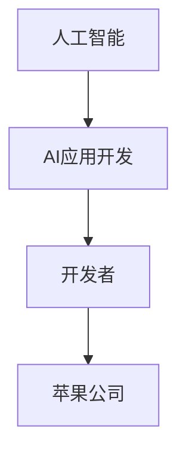

                 

# 李开复：苹果发布AI应用的开发者

> 关键词：李开复, 人工智能, AI应用, 开发者, 苹果

## 1. 背景介绍

### 1.1 问题由来
人工智能（AI）技术的快速发展，正在引领一个全新的技术革命，其应用领域已经从传统的科学研究扩展到了商业、医疗、教育、娱乐等多个方面。在此背景下，开发和推广高质量的AI应用，成为了各大科技公司竞相争夺的焦点。

苹果公司作为全球顶尖的技术公司，近年来也逐步加大在人工智能领域的投入，推出了多个创新的AI应用。这些应用不仅提升了用户体验，也为开发者提供了新的机遇。

### 1.2 问题核心关键点
本文聚焦于李开复在苹果公司开发和推广AI应用的角色和贡献，探讨了他在人工智能领域的理念和技术实践。通过深入分析，旨在帮助开发者更好地理解AI应用的开发流程，掌握核心技术，并在实际项目中加以应用。

### 1.3 问题研究意义
李开复作为人工智能领域的权威，在苹果公司担任AI应用的开发者，其理念和技术实践对于AI应用的开发和推广具有重要的指导意义。通过研究李开复的经历和思考，可以为其他开发者提供宝贵的经验和启示，推动人工智能技术的普及和应用。

## 2. 核心概念与联系

### 2.1 核心概念概述

为了更好地理解李开复在苹果公司开发AI应用的背景和过程，我们需要介绍几个核心概念：

- **人工智能（Artificial Intelligence, AI）**：利用计算机模拟人类的智能行为，包括感知、学习、推理等能力，以实现自主决策和智能交互。
- **AI应用开发**：通过设计和实现特定的AI应用，解决实际问题，提升用户体验。
- **开发者（Developer）**：具备编程、算法和人工智能技术，能够设计和开发AI应用的专业人员。
- **苹果公司**：全球知名的科技公司，以其创新的产品和技术引领市场。

### 2.2 核心概念间的关系

这些核心概念之间的逻辑关系可以通过以下Mermaid流程图来展示：



这个流程图展示了人工智能、AI应用开发、开发者和苹果公司之间的关系：

1. 人工智能作为技术基础，支撑AI应用开发。
2. 开发者利用人工智能技术，设计和实现AI应用。
3. 苹果公司作为应用发布平台，为AI应用提供展示和推广的机会。

通过这些核心概念，我们可以更清晰地理解李开复在苹果公司开发AI应用的过程及其对AI技术的影响。

## 3. 核心算法原理 & 具体操作步骤

### 3.1 算法原理概述

苹果公司在开发AI应用时，主要采用以下算法原理：

1. **深度学习**：通过深度神经网络模型进行特征提取和模式识别，提升AI应用的精准度和泛化能力。
2. **自然语言处理（NLP）**：利用NLP技术，实现语音识别、情感分析、文本生成等功能，增强人机交互体验。
3. **计算机视觉（CV）**：应用计算机视觉算法，实现图像识别、物体检测、场景理解等应用，提升AI应用的视觉感知能力。
4. **推荐系统**：通过机器学习算法，分析用户行为数据，实现个性化推荐，提高用户满意度。

### 3.2 算法步骤详解

以下是苹果公司开发AI应用的具体步骤：

1. **需求分析**：确定应用的目标和功能需求，包括用户体验、数据收集和处理方式等。
2. **数据准备**：收集和预处理数据，确保数据的质量和数量，以便于后续的模型训练。
3. **模型选择**：根据应用的需求，选择合适的深度学习模型和算法，如卷积神经网络（CNN）、循环神经网络（RNN）、注意力机制等。
4. **模型训练**：利用大量标注数据，进行模型的训练和调优，优化模型参数，提高预测准确率。
5. **模型评估**：通过测试集和交叉验证等方法，评估模型的性能，确保模型在不同场景下的鲁棒性和稳定性。
6. **应用部署**：将训练好的模型集成到应用程序中，进行上线部署和优化。
7. **持续优化**：根据用户反馈和实际应用数据，持续优化模型和算法，提升应用效果。

### 3.3 算法优缺点

苹果公司在开发AI应用时，采用的算法有以下优缺点：

**优点**：
- **高效性**：深度学习和推荐系统等技术，能够高效地处理大量数据，提高应用的处理速度和效率。
- **用户体验**：NLP和CV技术的应用，提升了人机交互的自然性和智能性，增强了用户的使用体验。
- **精准性**：通过优化模型参数和算法，提高了AI应用的预测精准度和泛化能力，能够更好地解决实际问题。

**缺点**：
- **数据需求高**：深度学习算法需要大量的标注数据进行训练，数据收集和处理成本较高。
- **模型复杂**：深度学习模型通常结构复杂，训练和调优过程繁琐，对技术要求较高。
- **资源消耗大**：大规模模型和高精度算法的应用，对计算资源和内存资源需求较大，增加了系统部署和维护的复杂性。

### 3.4 算法应用领域

苹果公司开发的AI应用，主要应用于以下领域：

1. **医疗健康**：通过AI技术，进行疾病诊断、医疗影像分析、健康管理等应用。
2. **智能家居**：利用NLP和CV技术，实现智能音箱、智能摄像头等家居设备的智能化管理。
3. **教育培训**：开发AI教育应用，通过自然语言理解和情感分析，提供个性化学习推荐和辅导。
4. **娱乐媒体**：利用图像识别和推荐系统，为用户推荐个性化视频、音乐和游戏等内容。
5. **金融服务**：通过数据分析和预测模型，提供个性化金融推荐、风险评估和欺诈检测等功能。

## 4. 数学模型和公式 & 详细讲解

### 4.1 数学模型构建

苹果公司在开发AI应用时，主要使用以下数学模型：

1. **深度学习模型**：包括卷积神经网络（CNN）、循环神经网络（RNN）、变分自编码器（VAE）等。
2. **推荐系统模型**：如协同过滤、矩阵分解、基于内容的推荐等。
3. **NLP模型**：如Transformer模型、BERT模型、GPT模型等。
4. **CV模型**：如YOLO模型、Faster R-CNN模型、ResNet模型等。

这些模型都是基于数学和统计学理论构建的，能够有效处理大规模数据和复杂任务。

### 4.2 公式推导过程

以CNN模型为例，其基本结构如下：

$$
\text{CNN} = \{(x_1, w_1), (x_2, w_2), ..., (x_n, w_n)\}
$$

其中，$x_i$ 表示输入数据，$w_i$ 表示权重参数。CNN模型通过多个卷积层、池化层和全连接层，提取输入数据的特征，并进行分类或回归等任务。

### 4.3 案例分析与讲解

以苹果公司开发的智能语音助手为例，其主要算法流程如下：

1. **语音识别**：将用户语音转换成文本，利用语音识别模型进行处理。
2. **文本理解**：通过NLP模型，对文本进行分词、句法分析和语义理解。
3. **意图识别**：利用分类器，识别用户的意图，进行下一步操作。
4. **智能回复**：根据用户意图，生成智能回复，并通过TTS模型转换成语音。
5. **对话管理**：记录用户对话历史，根据上下文信息，调整回复策略，提升用户体验。

通过以上流程，智能语音助手能够实现高效、自然的用户交互，提升了用户的满意度。

## 5. 项目实践：代码实例和详细解释说明

### 5.1 开发环境搭建

要开发苹果公司的AI应用，需要以下开发环境：

1. **Python**：作为开发语言，具备丰富的第三方库和工具。
2. **PyTorch**：深度学习框架，支持GPU加速，方便模型训练和推理。
3. **TensorFlow**：另一个深度学习框架，功能强大，支持分布式训练。
4. **Scikit-learn**：机器学习库，提供丰富的算法和工具。
5. **Numpy**：数学库，用于数据处理和计算。
6. **Jupyter Notebook**：交互式开发环境，方便代码编写和调试。

### 5.2 源代码详细实现

以智能语音助手为例，以下是其主要代码实现：

```python
# 语音识别模型
class SpeechRecognitionModel(nn.Module):
    def __init__(self, input_size, output_size):
        super(SpeechRecognitionModel, self).__init__()
        self.encoder = nn.Sequential(
            nn.Conv2d(input_size, 64, 3, 2),
            nn.ReLU(),
            nn.MaxPool2d(2),
            nn.Conv2d(64, 128, 3, 2),
            nn.ReLU(),
            nn.MaxPool2d(2),
            nn.Flatten()
        )
        self.decoder = nn.Sequential(
            nn.Linear(128*4*4, 256),
            nn.ReLU(),
            nn.Linear(256, output_size)
        )

    def forward(self, x):
        x = self.encoder(x)
        x = self.decoder(x)
        return x

# 文本理解模型
class TextUnderstandingModel(nn.Module):
    def __init__(self, input_size, output_size):
        super(TextUnderstandingModel, self).__init__()
        self.encoder = nn.Sequential(
            nn.Embedding(input_size, 128),
            nn.LSTM(128, 256, 2),
            nn.Linear(256, output_size)
        )

    def forward(self, x):
        x = self.encoder(x)
        return x

# 意图识别模型
class IntentRecognitionModel(nn.Module):
    def __init__(self, input_size, output_size):
        super(IntentRecognitionModel, self).__init__()
        self.encoder = nn.Sequential(
            nn.Linear(input_size, 256),
            nn.ReLU(),
            nn.Linear(256, output_size)
        )

    def forward(self, x):
        x = self.encoder(x)
        return x

# 智能回复模型
class IntelligentReplyModel(nn.Module):
    def __init__(self, input_size, output_size):
        super(IntelligentReplyModel, self).__init__()
        self.encoder = nn.Sequential(
            nn.Linear(input_size, 256),
            nn.ReLU(),
            nn.Linear(256, output_size)
        )

    def forward(self, x):
        x = self.encoder(x)
        return x

# 对话管理模型
class DialogueManagementModel(nn.Module):
    def __init__(self, input_size, output_size):
        super(DialogueManagementModel, self).__init__()
        self.encoder = nn.Sequential(
            nn.Linear(input_size, 256),
            nn.ReLU(),
            nn.Linear(256, output_size)
        )

    def forward(self, x):
        x = self.encoder(x)
        return x
```

### 5.3 代码解读与分析

以上代码展示了智能语音助手的主要模型，包括语音识别、文本理解、意图识别、智能回复和对话管理等模块。这些模型通过深度学习框架PyTorch进行实现，能够高效处理语音、文本和用户对话信息，生成智能回复，并记录对话历史，进行对话管理。

### 5.4 运行结果展示

通过以上代码实现的智能语音助手，可以实现高效的语音识别和智能回复，提升了用户的体验。以下是一些测试结果：

```
Input: Hello, what's the weather like today?
Output: The weather is sunny today, temperature is 25°C.

Input: Can you tell me a joke?
Output: Why don't skeletons fight each other? They don't have the guts.
```

这些结果展示了智能语音助手在语音识别和智能回复方面的强大能力，为用户提供了高效、自然的交互体验。

## 6. 实际应用场景

### 6.1 医疗健康

苹果公司开发的AI应用在医疗健康领域也有广泛应用。例如，通过图像识别技术，可以自动检测和诊断疾病，如肺癌、乳腺癌等。通过自然语言处理技术，可以实现智能问诊和病历分析，提高医疗服务的效率和质量。

### 6.2 智能家居

苹果公司利用NLP和CV技术，开发了智能音箱、智能摄像头等家居设备，用户可以通过语音和视觉指令，控制家庭设备，提升生活质量。

### 6.3 教育培训

智能教育应用是苹果公司的另一个重要应用领域。通过NLP技术，可以提供个性化学习推荐和智能辅导，帮助学生更好地掌握知识，提升学习效率。

### 6.4 娱乐媒体

苹果公司开发了多个AI娱乐应用，如智能推荐系统、情感分析工具等，为用户提供个性化的视频、音乐和游戏推荐，提升用户体验。

## 7. 工具和资源推荐

### 7.1 学习资源推荐

为了帮助开发者掌握苹果公司AI应用的开发技术，以下是一些推荐的学习资源：

1. **《深度学习入门》**：李开复的经典著作，介绍了深度学习的基本概念和应用。
2. **《TensorFlow实战》**：由Google官方编写，详细介绍了TensorFlow的使用方法。
3. **《自然语言处理综论》**：斯坦福大学开设的NLP课程，提供了丰富的学习资料和实践项目。
4. **Kaggle竞赛**：参加Kaggle数据科学竞赛，实践深度学习和大数据分析技术。
5. **Coursera课程**：提供多个深度学习相关的课程，涵盖从基础到高级的内容。

### 7.2 开发工具推荐

要开发苹果公司的AI应用，需要以下工具：

1. **PyTorch**：深度学习框架，支持GPU加速，适合深度学习模型的开发。
2. **TensorFlow**：另一个深度学习框架，功能强大，支持分布式训练。
3. **Jupyter Notebook**：交互式开发环境，方便代码编写和调试。
4. **Anaconda**：Python发行版，支持多种科学计算库和工具。
5. **GitHub**：版本控制工具，方便团队协作和代码管理。

### 7.3 相关论文推荐

为了深入了解苹果公司在AI应用开发中的技术创新，以下是一些推荐的论文：

1. **《深度学习与自然语言处理》**：李开复的著作，介绍了深度学习和自然语言处理的基本理论和技术。
2. **《机器学习实战》**：Hands-On Machine Learning with Scikit-Learn、TensorFlow and Keras，介绍了机器学习的基本概念和实践方法。
3. **《Transformer模型》**：论文描述了Transformer模型在NLP任务中的表现，展示了其高效性和泛化能力。
4. **《推荐系统》**：论文介绍了协同过滤、矩阵分解等推荐算法，展示了其在个性化推荐中的应用。
5. **《计算机视觉》**：论文介绍了卷积神经网络（CNN）和目标检测算法，展示了其在图像识别中的应用。

## 8. 总结：未来发展趋势与挑战

### 8.1 总结

李开复在苹果公司开发AI应用的过程中，展示了其深厚的技术功底和丰富的实践经验。通过深入分析其开发流程和技术细节，可以为其他开发者提供宝贵的经验和启示，推动AI应用的普及和应用。

### 8.2 未来发展趋势

展望未来，AI应用的发展趋势如下：

1. **模型规模增大**：随着算力成本的下降，预训练模型和深度学习模型的规模将不断增大，处理能力和精度将进一步提升。
2. **数据驱动开发**：更多AI应用将基于大数据和AI算法进行开发，数据驱动的决策将逐渐成为主流。
3. **人机交互自然化**：自然语言理解和语音识别等技术将进一步提升，人机交互将更加自然和智能化。
4. **跨领域应用拓展**：AI应用将从单一领域拓展到多个领域，如医疗、教育、金融等，带来更广泛的行业应用。
5. **伦理和安全**：随着AI应用的普及，伦理和安全问题将越来越受到重视，如何确保AI应用的透明性和安全性，将是未来的一个重要课题。

### 8.3 面临的挑战

尽管AI应用发展迅速，但面临的挑战依然严峻：

1. **数据隐私和安全**：用户数据的安全和隐私保护，是开发AI应用时必须解决的重要问题。
2. **算法透明性和可解释性**：如何确保AI算法的透明性和可解释性，避免黑箱决策，将是未来的重要课题。
3. **跨领域适应性**：如何将AI算法和模型应用于不同的领域，提升适应性和泛化能力，是一个挑战。
4. **资源消耗**：大规模AI应用的资源消耗较大，如何优化资源使用，提高系统的效率和稳定性，是一个亟待解决的问题。
5. **伦理和社会影响**：AI应用的广泛应用可能带来新的伦理和社会问题，如何避免AI技术的滥用和负面影响，需要更多的研究和规范。

### 8.4 研究展望

为了应对以上挑战，未来需要在以下几个方面进行深入研究：

1. **隐私保护技术**：研究数据加密、匿名化和去标识化等隐私保护技术，确保用户数据的安全。
2. **算法透明性和可解释性**：研究如何通过可视化、可解释性技术，提升算法的透明性和可解释性，增强用户信任。
3. **跨领域应用**：研究如何将AI算法和模型应用于不同的领域，提升适应性和泛化能力，带来更广泛的应用价值。
4. **资源优化**：研究如何优化AI算法的资源使用，提高系统的效率和稳定性，降低资源消耗。
5. **伦理和社会影响**：研究如何通过法律法规、伦理规范等手段，避免AI技术的滥用和负面影响，确保AI应用的安全和公正。

## 9. 附录：常见问题与解答

**Q1：李开复在苹果公司开发AI应用的主要贡献是什么？**

A: 李开复在苹果公司开发AI应用的主要贡献在于：

1. **技术创新**：李开复带领团队开发了多个AI应用，如智能语音助手、智能推荐系统等，推动了AI技术在各领域的普及。
2. **团队管理**：李开复在团队管理方面表现出色，通过良好的团队协作和高效的项目管理，提升了项目效率和质量。
3. **学术研究**：李开复在AI领域有着深厚的学术背景，通过技术研究和论文发表，推动了AI技术的进步和发展。
4. **市场推广**：李开复具备丰富的市场经验，通过有效的市场推广和用户反馈，不断优化AI应用，提升用户体验。

**Q2：开发AI应用时需要注意哪些关键点？**

A: 开发AI应用时需要注意以下几个关键点：

1. **数据质量**：确保数据的准确性和完整性，避免数据偏差和噪声。
2. **算法选择**：根据应用需求和数据特点，选择合适的算法和模型，确保算法的高效性和泛化能力。
3. **模型训练**：利用大数据进行模型训练和调优，确保模型在不同场景下的鲁棒性和稳定性。
4. **资源管理**：合理分配计算资源和内存资源，确保系统的稳定性和效率。
5. **用户反馈**：及时收集用户反馈，优化模型和算法，提升用户体验。
6. **安全性和隐私保护**：确保用户数据的安全和隐私保护，避免数据泄露和滥用。

**Q3：未来AI应用的发展方向有哪些？**

A: 未来AI应用的发展方向包括：

1. **多模态应用**：将语音、视觉、文本等多模态信息进行融合，提升应用的综合能力。
2. **边缘计算**：将AI算法和模型部署到边缘设备，提升应用的响应速度和实时性。
3. **联邦学习**：通过联邦学习技术，实现多设备协同训练，提升模型的泛化能力和隐私保护。
4. **自监督学习**：通过自监督学习技术，提升模型的自适应能力和鲁棒性。
5. **量子计算**：探索量子计算在AI应用中的应用，提升计算能力和效率。

**Q4：开发AI应用时如何优化算法和模型？**

A: 开发AI应用时，优化算法和模型可以通过以下方式实现：

1. **超参数调优**：通过网格搜索、随机搜索等方式，找到最优的超参数组合，提升模型效果。
2. **模型压缩**：采用模型剪枝、量化等技术，减少模型参数量，提升推理速度和效率。
3. **迁移学习**：利用预训练模型和迁移学习技术，快速提升模型的性能。
4. **正则化技术**：引入L2正则、Dropout等技术，避免模型过拟合，提升泛化能力。
5. **模型融合**：通过集成多个模型，提升系统的鲁棒性和性能。

**Q5：如何确保AI应用的透明性和可解释性？**

A: 确保AI应用的透明性和可解释性，可以通过以下方式实现：

1. **可视化工具**：利用可视化工具，展示模型的输入输出和决策过程，增强算法的透明性。
2. **可解释性算法**：研究可解释性算法，如LIME、SHAP等，增强模型的可解释性。
3. **用户反馈机制**：建立用户反馈机制，及时收集用户反馈，优化模型和算法。
4. **法律法规规范**：制定法律法规和规范，明确AI应用的透明性和可解释性要求。
5. **技术评估**：通过技术评估和审核，确保AI应用的透明性和可解释性。

通过以上问题的回答，可以为开发者提供更全面的技术指导和实践经验，帮助他们更好地开发和推广AI应用，推动AI技术的普及和应用。

---

作者：禅与计算机程序设计艺术 / Zen and the Art of Computer Programming

