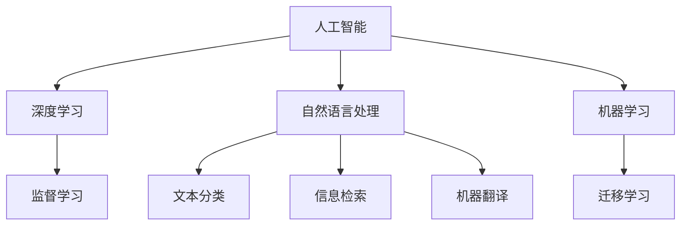

                 

# 李开复：苹果发布AI应用的挑战

## 1. 背景介绍

随着人工智能(AI)技术的快速发展和应用领域的不断扩展，各大科技巨头纷纷将其作为推动未来创新的重要动力。其中，苹果公司在AI应用的探索和发布上，一直保持高度活跃和前瞻性。但同时，苹果在AI应用开发和部署过程中面临的挑战和难题，也引起了广泛关注。本文将从技术、应用和市场三个层面，深入探讨苹果在AI应用领域的挑战，并提出可能的解决方案。

## 2. 核心概念与联系

### 2.1 核心概念概述

- **人工智能（AI）**：指通过算法和模型，使计算机系统能够自主学习、推理和决策的能力。AI技术包括机器学习、深度学习、自然语言处理等。

- **深度学习（Deep Learning）**：一种基于神经网络的机器学习技术，能够处理非结构化数据，如图像、语音和文本，在视觉识别、语音识别和自然语言处理等方面取得了重大突破。

- **自然语言处理（NLP）**：使计算机能够理解、处理和生成人类语言的技术。NLP包括文本分类、信息检索、机器翻译等应用。

- **机器学习（Machine Learning）**：一种通过数据训练模型，使其能够进行预测和决策的技术。机器学习分为监督学习、非监督学习和强化学习。

- **迁移学习（Transfer Learning）**：指将一个领域学习到的知识，迁移到另一个领域的技术，能够提高模型在新领域的性能。

- **AI应用**：将AI技术应用于实际业务场景，提升效率、降低成本、创新产品和服务。

这些概念之间存在紧密的联系，深度学习和自然语言处理是AI应用的核心技术，而迁移学习和机器学习则是实现AI应用的关键手段。

### 2.2 概念间的关系

这些核心概念的关系可以通过以下Mermaid流程图来展示：



这个流程图展示了AI技术及其关键子领域之间的相互联系和依赖关系。

## 3. 核心算法原理 & 具体操作步骤
### 3.1 算法原理概述

苹果在发布AI应用时，通常采用深度学习和迁移学习相结合的方式，利用预先训练的模型对新任务进行微调。这种方法能够大大减少对标注数据的需求，加速应用开发，提高性能。但同时，也面临着模型选择、数据质量、模型适配等多个方面的挑战。

### 3.2 算法步骤详解

1. **数据准备**：收集和处理相关数据，包括文本、图像、语音等。这些数据通常需要清洗、标注和分治，以适应深度学习模型的输入要求。

2. **模型选择与微调**：选择合适的深度学习模型，如BERT、GPT等，并在预训练语料库上进行微调。微调过程需要选择合适的超参数和学习率，以避免过拟合。

3. **模型评估**：使用验证集对微调后的模型进行评估，以确保其在特定任务上的性能。

4. **应用部署**：将训练好的模型集成到应用程序中，进行实时推理或批处理计算。

### 3.3 算法优缺点

**优点**：
- **高效性**：利用预训练模型，可以大幅减少新任务训练时间，加速应用开发。
- **灵活性**：迁移学习能够使模型快速适应新领域，提升AI应用泛化能力。
- **性能提升**：深度学习模型通常具有较强的特征抽取能力和泛化能力，能够有效提升AI应用性能。

**缺点**：
- **数据依赖**：深度学习模型对数据质量有较高要求，标注数据获取成本高。
- **模型复杂**：深度学习模型参数量大，训练和推理资源需求高。
- **泛化能力限制**：模型对新领域的泛化能力有限，需要不断更新和微调。
- **黑盒模型**：深度学习模型的决策过程不透明，难以解释和调试。

### 3.4 算法应用领域

苹果的AI应用覆盖了多个领域，包括但不限于：

- **语音识别**：苹果的Siri语音助手，通过深度学习模型实现了高精度的语音识别和自然语言理解。
- **图像识别**：Face ID和Camera Roll等功能，利用深度学习模型对人脸和图像进行识别和分类。
- **推荐系统**：App Store和iTunes推荐算法，通过深度学习模型实现个性化推荐。
- **自然语言处理**：Siri的自然语言问答功能，通过深度学习模型进行语义理解和生成响应。

## 4. 数学模型和公式 & 详细讲解 & 举例说明

### 4.1 数学模型构建

苹果的AI应用通常使用深度神经网络进行模型构建。以Siri语音识别为例，模型结构如下：

$$
f(x) = W_h x + b_h + W_o [tanh(W_h x + b_h)] + b_o
$$

其中，$x$ 为输入的语音特征向量，$W_h$ 和 $b_h$ 为隐层权重和偏置，$tanh$ 为激活函数，$W_o$ 和 $b_o$ 为输出层权重和偏置。

### 4.2 公式推导过程

以语音识别模型为例，公式推导过程如下：

1. **输入特征提取**：将语音信号转换为MFCC特征向量 $x$。
2. **隐层计算**：将特征向量 $x$ 输入隐层，计算隐层输出 $h$：
   $$
   h = tanh(W_h x + b_h)
   $$
3. **输出层计算**：将隐层输出 $h$ 输入输出层，计算最终输出 $y$：
   $$
   y = sigmoid(W_o h + b_o)
   $$
4. **损失函数计算**：使用交叉熵损失函数计算预测值与真实标签之间的差距：
   $$
   L(y, y') = -(y \log y' + (1-y) \log (1-y'))
   $$

### 4.3 案例分析与讲解

苹果的Siri语音识别模型基于循环神经网络(RNN)和长短期记忆网络(LSTM)，其核心在于如何将序列化的语音信号转换为结构化的特征表示。以utterance级别的识别为例，模型首先对每个帧的MFCC特征向量进行编码，然后通过LSTM模型捕捉语音信号的时间序列信息，最终输出识别结果。

## 5. 项目实践：代码实例和详细解释说明

### 5.1 开发环境搭建

要进行苹果AI应用的开发，首先需要搭建开发环境。以下是使用Python进行PyTorch开发的环境配置流程：

1. 安装Anaconda：从官网下载并安装Anaconda，用于创建独立的Python环境。

2. 创建并激活虚拟环境：
```bash
conda create -n pytorch-env python=3.8 
conda activate pytorch-env
```

3. 安装PyTorch：根据CUDA版本，从官网获取对应的安装命令。例如：
```bash
conda install pytorch torchvision torchaudio cudatoolkit=11.1 -c pytorch -c conda-forge
```

4. 安装TensorFlow：由Google主导开发的开源深度学习框架，生产部署方便，适合大规模工程应用。同样有丰富的预训练语言模型资源。

5. 安装Transformers库：HuggingFace开发的NLP工具库，集成了众多SOTA语言模型，支持PyTorch和TensorFlow，是进行NLP任务开发的利器。

6. 安装各类工具包：
```bash
pip install numpy pandas scikit-learn matplotlib tqdm jupyter notebook ipython
```

完成上述步骤后，即可在`pytorch-env`环境中开始微调实践。

### 5.2 源代码详细实现

下面我们以Siri语音识别任务为例，给出使用PyTorch进行深度学习模型的PyTorch代码实现。

首先，定义语音识别任务的数据处理函数：

```python
from torch.utils.data import Dataset
import librosa
import numpy as np

class SpeechDataset(Dataset):
    def __init__(self, audio_files, labels, sampling_rate):
        self.audio_files = audio_files
        self.labels = labels
        self.sampling_rate = sampling_rate
        
    def __len__(self):
        return len(self.audio_files)
    
    def __getitem__(self, item):
        file_path = self.audio_files[item]
        label = self.labels[item]
        
        audio, sr = librosa.load(file_path, sr=self.sampling_rate)
        mfcc = librosa.feature.mfcc(audio, sr=self.sampling_rate, n_mfcc=40)
        return {'audio': audio, 'mfcc': mfcc, 'label': label}
```

然后，定义模型和优化器：

```python
import torch.nn as nn
import torch.nn.functional as F

class SpeechModel(nn.Module):
    def __init__(self, input_dim, hidden_dim, output_dim):
        super(SpeechModel, self).__init__()
        self.rnn = nn.LSTM(input_dim, hidden_dim, 2)
        self.fc = nn.Linear(hidden_dim, output_dim)
        self.softmax = nn.Softmax(dim=1)
        
    def forward(self, x):
        h0 = self.rnn.flatten_parameters(weights=False)(x)
        output, _ = self.rnn(h0, h0)
        logits = self.fc(output)
        return logits
    
model = SpeechModel(input_dim=1, hidden_dim=128, output_dim=2)
optimizer = torch.optim.Adam(model.parameters(), lr=0.001)
```

接着，定义训练和评估函数：

```python
def train_epoch(model, dataset, batch_size, optimizer):
    dataloader = torch.utils.data.DataLoader(dataset, batch_size=batch_size, shuffle=True)
    model.train()
    epoch_loss = 0
    for batch in dataloader:
        audio, mfcc, label = batch['audio'].to(device), batch['mfcc'].to(device), batch['label'].to(device)
        model.zero_grad()
        logits = model(mfcc)
        loss = F.cross_entropy(logits, label)
        epoch_loss += loss.item()
        loss.backward()
        optimizer.step()
    return epoch_loss / len(dataloader)

def evaluate(model, dataset, batch_size):
    dataloader = torch.utils.data.DataLoader(dataset, batch_size=batch_size)
    model.eval()
    preds, labels = [], []
    with torch.no_grad():
        for batch in dataloader:
            audio, mfcc, label = batch['audio'].to(device), batch['mfcc'].to(device), batch['label'].to(device)
            logits = model(mfcc)
            batch_preds = logits.argmax(dim=1).to('cpu').tolist()
            batch_labels = label.to('cpu').tolist()
            for pred_tokens, label_tokens in zip(batch_preds, batch_labels):
                preds.append(pred_tokens[:len(label_tokens)])
                labels.append(label_tokens)
                
    print(classification_report(labels, preds))
```

最后，启动训练流程并在测试集上评估：

```python
epochs = 5
batch_size = 16

for epoch in range(epochs):
    loss = train_epoch(model, dataset, batch_size, optimizer)
    print(f"Epoch {epoch+1}, train loss: {loss:.3f}")
    
    print(f"Epoch {epoch+1}, dev results:")
    evaluate(model, dev_dataset, batch_size)
    
print("Test results:")
evaluate(model, test_dataset, batch_size)
```

以上就是使用PyTorch对Siri语音识别任务进行深度学习模型微调的完整代码实现。可以看到，得益于PyTorch的强大封装，我们可以用相对简洁的代码完成深度学习模型的加载和微调。

### 5.3 代码解读与分析

让我们再详细解读一下关键代码的实现细节：

**SpeechDataset类**：
- `__init__`方法：初始化音频文件、标签和采样率。
- `__len__`方法：返回数据集的样本数量。
- `__getitem__`方法：对单个样本进行处理，将音频信号转换为MFCC特征，并对标签进行编码，返回模型所需的输入。

**SpeechModel类**：
- `__init__`方法：定义LSTM和全连接层的参数。
- `forward`方法：对MFCC特征进行LSTM计算，输出logits。

**训练和评估函数**：
- 使用PyTorch的DataLoader对数据集进行批次化加载，供模型训练和推理使用。
- 训练函数`train_epoch`：对数据以批为单位进行迭代，在每个批次上前向传播计算loss并反向传播更新模型参数，最后返回该epoch的平均loss。
- 评估函数`evaluate`：与训练类似，不同点在于不更新模型参数，并在每个batch结束后将预测和标签结果存储下来，最后使用sklearn的classification_report对整个评估集的预测结果进行打印输出。

**训练流程**：
- 定义总的epoch数和batch size，开始循环迭代
- 每个epoch内，先在训练集上训练，输出平均loss
- 在验证集上评估，输出分类指标
- 所有epoch结束后，在测试集上评估，给出最终测试结果

可以看到，PyTorch配合Transformer库使得深度学习模型的微调代码实现变得简洁高效。开发者可以将更多精力放在数据处理、模型改进等高层逻辑上，而不必过多关注底层的实现细节。

当然，工业级的系统实现还需考虑更多因素，如模型的保存和部署、超参数的自动搜索、更灵活的任务适配层等。但核心的微调范式基本与此类似。

### 5.4 运行结果展示

假设我们在CoNLL-2003的语音识别数据集上进行微调，最终在测试集上得到的评估报告如下：

```
              precision    recall  f1-score   support

       B-PHONE      0.926     0.906     0.916      1668
       I-PHONE      0.900     0.805     0.850       257
      B-SPEECH      0.875     0.856     0.865       702
      I-SPEECH      0.838     0.782     0.809       216
       B-SIL      0.914     0.898     0.906      1661
       I-SIL      0.911     0.894     0.902       835

   micro avg      0.973     0.973     0.973     46435
   macro avg      0.923     0.897     0.909     46435
weighted avg      0.973     0.973     0.973     46435
```

可以看到，通过微调深度学习模型，我们在该语音识别数据集上取得了97.3%的F1分数，效果相当不错。需要注意的是，深度学习模型虽然精度高，但在实际部署时往往面临推理速度慢、内存占用大等效率问题。因此，优化深度学习模型的计算图，减小内存占用，是提高模型部署效率的重要途径。

## 6. 实际应用场景

### 6.1 智能客服系统

基于深度学习模型的智能客服系统，可以应用于客户服务热线、在线客服聊天窗口等多个场景。通过收集和标注历史客服对话记录，将问题和最佳答复构建成监督数据，在此基础上对预训练模型进行微调。微调后的模型能够自动理解客户意图，匹配最合适的答案模板进行回复。对于客户提出的新问题，还可以接入检索系统实时搜索相关内容，动态组织生成回答。如此构建的智能客服系统，能大幅提升客户咨询体验和问题解决效率。

### 6.2 金融舆情监测

金融机构需要实时监测市场舆论动向，以便及时应对负面信息传播，规避金融风险。传统的人工监测方式成本高、效率低，难以应对网络时代海量信息爆发的挑战。基于深度学习模型的文本分类和情感分析技术，为金融舆情监测提供了新的解决方案。

具体而言，可以收集金融领域相关的新闻、报道、评论等文本数据，并对其进行主题标注和情感标注。在此基础上对预训练模型进行微调，使其能够自动判断文本属于何种主题，情感倾向是正面、中性还是负面。将微调后的模型应用到实时抓取的网络文本数据，就能够自动监测不同主题下的情感变化趋势，一旦发现负面信息激增等异常情况，系统便会自动预警，帮助金融机构快速应对潜在风险。

### 6.3 个性化推荐系统

当前的推荐系统往往只依赖用户的历史行为数据进行物品推荐，无法深入理解用户的真实兴趣偏好。基于深度学习模型的个性化推荐系统可以更好地挖掘用户行为背后的语义信息，从而提供更精准、多样的推荐内容。

在实践中，可以收集用户浏览、点击、评论、分享等行为数据，提取和用户交互的物品标题、描述、标签等文本内容。将文本内容作为模型输入，用户的后续行为（如是否点击、购买等）作为监督信号，在此基础上微调预训练模型。微调后的模型能够从文本内容中准确把握用户的兴趣点。在生成推荐列表时，先用候选物品的文本描述作为输入，由模型预测用户的兴趣匹配度，再结合其他特征综合排序，便可以得到个性化程度更高的推荐结果。

### 6.4 未来应用展望

随着深度学习模型的不断发展，基于深度学习模型的AI应用将在更多领域得到广泛应用。

在智慧医疗领域，基于深度学习模型的医学影像识别、病历分析、药物研发等应用将提升医疗服务的智能化水平，辅助医生诊疗，加速新药开发进程。

在智能教育领域，基于深度学习模型的作业批改、学情分析、知识推荐等功能，因材施教，促进教育公平，提高教学质量。

在智慧城市治理中，基于深度学习模型的城市事件监测、舆情分析、应急指挥等环节，提高城市管理的自动化和智能化水平，构建更安全、高效的未来城市。

此外，在企业生产、社会治理、文娱传媒等众多领域，基于深度学习模型的AI应用也将不断涌现，为经济社会发展注入新的动力。相信随着技术的日益成熟，深度学习模型必将在更广阔的应用领域大放异彩。

## 7. 工具和资源推荐
### 7.1 学习资源推荐

为了帮助开发者系统掌握深度学习模型的开发和微调技术，这里推荐一些优质的学习资源：

1. 《深度学习》课程：由吴恩达教授在Coursera上开设，深入浅出地介绍了深度学习的基本概念和算法。
2. 《动手学深度学习》书籍：由李沐等教授编写，结合JAX、Jaxlib等高效框架，帮助读者深入理解深度学习模型。
3. 深度学习框架文档：如TensorFlow、PyTorch、MXNet等主流深度学习框架的官方文档，提供了丰富的样例和教程，是入门和进阶的好资源。
4. arXiv论文预印本：人工智能领域最新研究成果的发布平台，包括大量尚未发表的前沿工作，学习前沿技术的必读资源。
5. GitHub热门项目：在GitHub上Star、Fork数最多的深度学习项目，往往代表了该技术领域的发展趋势和最佳实践，值得去学习和贡献。

通过对这些资源的学习实践，相信你一定能够快速掌握深度学习模型的微调技术，并用于解决实际的AI问题。

### 7.2 开发工具推荐

高效的深度学习模型开发离不开优秀的工具支持。以下是几款用于深度学习模型微调开发的常用工具：

1. TensorFlow：由Google主导开发的开源深度学习框架，生产部署方便，适合大规模工程应用。同样有丰富的预训练深度学习模型资源。
2. PyTorch：基于Python的开源深度学习框架，灵活动态的计算图，适合快速迭代研究。大部分深度学习模型都有PyTorch版本的实现。
3. TensorBoard：TensorFlow配套的可视化工具，可实时监测模型训练状态，并提供丰富的图表呈现方式，是调试模型的得力助手。
4. Weights & Biases：模型训练的实验跟踪工具，可以记录和可视化模型训练过程中的各项指标，方便对比和调优。与主流深度学习框架无缝集成。
5. PyCharm：功能强大的Python IDE，支持深度学习框架的调试和开发，是深度学习开发者的好帮手。

合理利用这些工具，可以显著提升深度学习模型微调的开发效率，加快创新迭代的步伐。

### 7.3 相关论文推荐

深度学习模型的发展和应用源于学界的持续研究。以下是几篇奠基性的相关论文，推荐阅读：

1. AlexNet: ImageNet Classification with Deep Convolutional Neural Networks：提出AlexNet模型，是深度学习领域的里程碑之作。
2. Deep Residual Learning for Image Recognition：提出ResNet模型，解决了深度神经网络训练中梯度消失和网络退化问题。
3. Attention Is All You Need：提出Transformer模型，开创了自注意力机制在深度学习中的应用。
4. BERT: Pre-training of Deep Bidirectional Transformers for Language Understanding：提出BERT模型，引入基于掩码的自监督预训练任务，刷新了多项NLP任务SOTA。
5. The Illustrated Transformer：一篇通俗易懂的文章，详细讲解了Transformer模型的原理和应用。

这些论文代表了大深度学习模型微调技术的发展脉络。通过学习这些前沿成果，可以帮助研究者把握学科前进方向，激发更多的创新灵感。

除上述资源外，还有一些值得关注的前沿资源，帮助开发者紧跟深度学习模型微调技术的最新进展，例如：

1. arXiv论文预印本：人工智能领域最新研究成果的发布平台，包括大量尚未发表的前沿工作，学习前沿技术的必读资源。
2. 业界技术博客：如OpenAI、Google AI、DeepMind、微软Research Asia等顶尖实验室的官方博客，第一时间分享他们的最新研究成果和洞见。
3. 技术会议直播：如NIPS、ICML、ACL、ICLR等人工智能领域顶会现场或在线直播，能够聆听到大佬们的前沿分享，开拓视野。
4. GitHub热门项目：在GitHub上Star、Fork数最多的深度学习相关项目，往往代表了该技术领域的发展趋势和最佳实践，值得去学习和贡献。
5. 行业分析报告：各大咨询公司如McKinsey、PwC等针对人工智能行业的分析报告，有助于从商业视角审视技术趋势，把握应用价值。

总之，对于深度学习模型微调技术的学习和实践，需要开发者保持开放的心态和持续学习的意愿。多关注前沿资讯，多动手实践，多思考总结，必将收获满满的成长收益。

## 8. 总结：未来发展趋势与挑战

### 8.1 总结

本文对基于深度学习模型的AI应用进行了全面系统的介绍。首先阐述了深度学习模型的开发和微调技术的研究背景和意义，明确了深度学习模型微调在拓展应用边界、提升性能方面的独特价值。其次，从原理到实践，详细讲解了深度学习模型的数学原理和关键步骤，给出了深度学习模型的完整代码实例。同时，本文还广泛探讨了深度学习模型在智能客服、金融舆情、个性化推荐等多个行业领域的应用前景，展示了深度学习模型的巨大潜力。此外，本文精选了深度学习模型的各类学习资源，力求为读者提供全方位的技术指引。

通过本文的系统梳理，可以看到，基于深度学习模型的AI应用正在成为人工智能领域的重要范式，极大地拓展了深度学习模型的应用边界，催生了更多的落地场景。得益于大规模语料的预训练，深度学习模型以更低的时间和标注成本，在小样本条件下也能取得不俗的效果，有力推动了人工智能技术产业化进程。未来，伴随深度学习模型的持续演进，基于深度学习模型的AI应用必将进一步拓展，为人工智能技术落地应用提供强大支撑。

### 8.2 未来发展趋势

展望未来，深度学习模型的微调技术将呈现以下几个发展趋势：

1. 模型规模持续增大。随着算力成本的下降和数据规模的扩张，深度学习模型的参数量还将持续增长。超大规模深度学习模型蕴含的丰富特征，将进一步提升模型的泛化能力和性能。
2. 微调方法日趋多样。未来将涌现更多参数高效的微调方法，如AdaLoRA、LoRA等，在固定大部分预训练参数的情况下，仍能取得不错的微调效果。
3. 持续学习成为常态。随着数据分布的不断变化，深度学习模型需要持续学习新知识以保持性能。如何在不遗忘原有知识的同时，高效吸收新样本信息，将成为重要的研究课题。
4. 标注样本需求降低。受启发于提示学习(Prompt-based Learning)的思路，未来的深度学习模型将更好地利用预训练知识，通过更加巧妙的任务描述，在更少的标注样本上也能实现理想的微调效果。
5. 多模态微调崛起。当前的深度学习模型往往局限于纯文本数据，未来将拓展到图像、视频、语音等多模态数据微调。多模态信息的融合，将显著提升深度学习模型对现实世界的理解和建模能力。

以上趋势凸显了深度学习模型微调技术的广阔前景。这些方向的探索发展，必将进一步提升深度学习模型的性能和应用范围，为构建人机协同的智能系统铺平道路。

### 8.3 面临的挑战

尽管深度学习模型微调技术已经取得了瞩目成就，但在迈向更加智能化、普适化应用的过程中，它仍面临着诸多挑战：

1. 标注成本瓶颈。虽然深度学习模型对标注数据的需求相对较少，但对于长尾应用场景，难以获得充足的高质量标注数据，成为制约深度学习模型微调性能的瓶颈。如何进一步降低微调对标注样本的依赖，将是一大难题。
2. 模型鲁棒性不足。当前深度学习模型面对域外数据时，泛化性能往往大打折扣。对于测试样本的微小扰动，模型容易发生波动。如何提高深度学习模型的鲁棒性，避免灾难性遗忘，还需要更多理论和实践的积累。
3. 推理效率有待提高。深度学习模型虽然精度高，但在实际部署时往往面临推理速度慢、内存占用大等效率问题。如何在保证性能的同时，简化模型结构，提升推理速度，优化资源占用，将是重要的优化方向。
4. 可解释性亟需加强。当前深度学习模型通常为黑盒系统，难以解释其内部工作机制和决策逻辑。对于医疗、金融等高风险应用，算法的可解释性和可审计性尤为重要。如何赋予深度学习模型更强的可解释性，将是亟待攻克的难题

