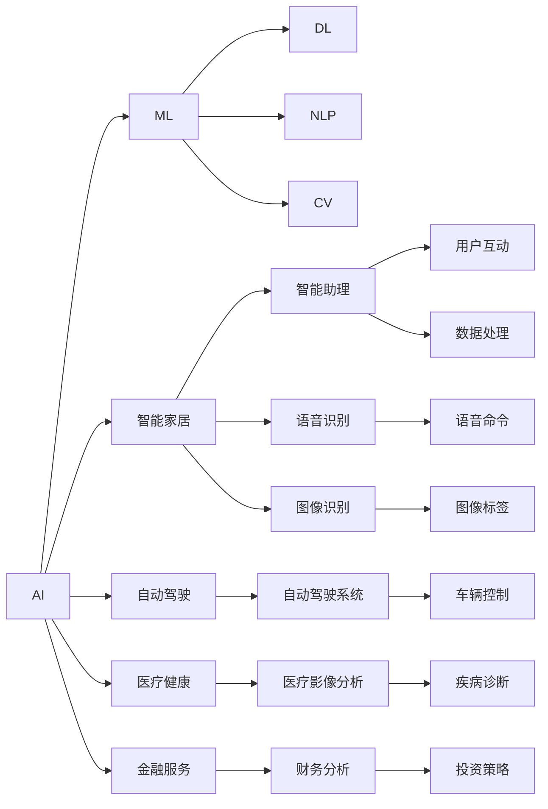

                 

# 李开复：苹果发布AI应用的未来展望

随着科技的发展，人工智能（AI）已经渗透到我们生活的方方面面，从智能家居到自动驾驶，从医疗健康到金融服务，AI的应用无所不在。而在众多AI应用的实践中，苹果公司（Apple Inc.）无疑是其中的佼佼者。在苹果公司发布AI应用的未来展望时，我们可以从多个角度去思考和探讨其潜在的未来发展路径。

## 1. 背景介绍

### 1.1 苹果AI应用的发展历程

苹果公司在AI应用的探索上，已经走过了许多年。早在2017年，苹果就发布了他们的首款AI产品——Siri。从那时起，苹果的AI技术就在不断进化，逐渐渗透到苹果的生态系统中。这些产品包括但不限于：

- **Siri**：一个个人助手，可以回答用户的问题、设置提醒和控制智能家居设备。
- **Face ID**：用于解锁iPhone和验证支付的生物识别技术。
- **Core ML**：为开发者提供了用于构建本地机器学习模型的框架。
- **照片增强**：使用机器学习对照片进行优化，如智能裁剪、去噪等。
- **图像和语音识别**：支持通过相机和麦克风捕捉和识别图像、语音等数据。
- **机器学习为开发者提供的API**：如NLP（自然语言处理）、计算机视觉等。

这些应用不仅仅是技术上的突破，更是苹果在用户体验上的一次革新。通过这些AI产品，苹果提高了设备的智能化水平，为消费者提供了前所未有的便利。

### 1.2 苹果AI应用的关键点

苹果AI应用的关键点在于其整合性和生态系统的闭环性。通过苹果生态系统的统一性，苹果能够更好地实现数据共享和协同工作。这种整合性体现在以下几个方面：

- **设备互联**：苹果的AI应用能够跨设备工作，例如Siri可以在iPhone、iPad、Mac等多种设备上工作。
- **系统优化**：AI技术可以优化设备的运行，提升性能和用户体验。
- **安全隐私**：苹果的AI应用在保障用户隐私和数据安全方面做得非常出色。

这些关键点使得苹果的AI应用在市场上具有竞争优势，并吸引了大量的用户和开发者。

## 2. 核心概念与联系

### 2.1 核心概念概述

在探讨苹果AI应用的未来展望之前，我们先简要介绍几个核心概念：

- **人工智能（AI）**：利用算法和模型模拟人类智能活动的技术。
- **机器学习（ML）**：AI的一种实现方式，通过数据训练模型进行预测和决策。
- **深度学习（DL）**：一种特殊类型的机器学习，使用多层神经网络模型。
- **自然语言处理（NLP）**：使计算机能够理解、解释和生成自然语言。
- **计算机视觉（CV）**：让计算机能够识别、分类和理解视觉数据。

这些概念在苹果的AI应用中都有所体现，如Siri和Face ID就是基于NLP和CV的。

### 2.2 概念间的关系

通过这些核心概念，我们可以构建一个苹果AI应用的生态系统图，展示这些概念之间的关系：



这个图展示了苹果AI应用的主要领域和相关技术。我们可以看到，苹果的AI应用不仅仅局限于单一的领域，而是跨多个领域的广泛应用。

## 3. 核心算法原理 & 具体操作步骤

### 3.1 算法原理概述

苹果的AI应用使用了多种算法和模型，以下是几种主要的算法原理：

- **深度学习**：苹果使用深度神经网络模型进行图像识别、语音识别等任务。深度学习可以自动提取和识别复杂模式。
- **卷积神经网络（CNN）**：用于图像识别任务，通过卷积操作提取特征。
- **循环神经网络（RNN）**：用于序列数据，如语音和自然语言处理。
- **自编码器（AE）**：用于数据压缩和降维，以及图像生成等任务。
- **强化学习（RL）**：用于游戏、机器人等领域，通过试错优化决策。

### 3.2 算法步骤详解

以下是对深度学习模型（如CNN）的具体训练步骤：

1. **数据准备**：收集并标注训练数据。
2. **模型定义**：定义卷积层、池化层、全连接层等。
3. **损失函数**：如交叉熵损失。
4. **优化器**：如Adam优化器。
5. **训练过程**：前向传播、反向传播、更新参数。
6. **测试评估**：使用测试集评估模型性能。

以Face ID为例，其具体步骤如下：

1. **数据收集**：收集大量的面部图像作为训练集。
2. **模型定义**：定义一个包含多个卷积层和池化层的神经网络。
3. **损失函数**：使用交叉熵损失。
4. **优化器**：使用Adam优化器。
5. **训练过程**：在训练集上迭代，调整模型参数。
6. **测试评估**：在测试集上评估模型性能。

### 3.3 算法优缺点

苹果AI应用的优点在于其整合性和生态系统的闭环性，这种整合性使得苹果设备之间的交互更加流畅，提升了用户体验。缺点在于其算法的复杂性，深度学习和强化学习等算法需要大量的计算资源和时间，这对设备的硬件要求较高。

### 3.4 算法应用领域

苹果AI应用的领域非常广泛，涵盖了从智能家居到自动驾驶，从医疗健康到金融服务。以下是几个主要应用领域：

- **智能家居**：使用AI进行语音识别、图像识别等，控制家居设备。
- **自动驾驶**：使用AI进行车辆识别、路径规划等，提高驾驶安全性。
- **医疗健康**：使用AI进行影像分析、疾病诊断等，提高医疗效率。
- **金融服务**：使用AI进行财务分析、风险控制等，提升金融服务质量。

## 4. 数学模型和公式 & 详细讲解 & 举例说明

### 4.1 数学模型构建

以图像识别任务为例，我们可以构建一个简单的数学模型：

- **输入**：图像数据。
- **输出**：识别结果（如物体类别）。
- **模型**：卷积神经网络（CNN）。
- **损失函数**：交叉熵损失。

数学公式如下：

$$
L(\theta) = -\frac{1}{N} \sum_{i=1}^N \sum_{j=1}^C y_{ij} \log p_{ij}
$$

其中，$\theta$为模型参数，$N$为样本数，$C$为类别数，$y_{ij}$为真实标签，$p_{ij}$为模型预测的概率。

### 4.2 公式推导过程

在推导公式之前，我们需要了解卷积神经网络的基本结构。CNN由卷积层、池化层和全连接层组成。以下是一个简单的CNN结构图：

```
         卷积层
           |
           |
         池化层
           |
           |
         卷积层
           |
           |
         池化层
           |
           |
         全连接层
           |
           |
       输出层
```

在训练过程中，我们通过前向传播计算预测结果，然后通过反向传播计算梯度，更新模型参数。以下是一个简单的前向传播和反向传播的示例：

- **前向传播**：输入图像数据通过卷积层、池化层和全连接层，得到最终输出。
- **反向传播**：计算预测结果与真实标签的差异，通过梯度下降更新模型参数。

### 4.3 案例分析与讲解

假设我们有一个简单的图像识别任务，输入是数字“0”至“9”的手写图像。我们可以使用MNIST数据集进行训练和测试。以下是使用PyTorch实现CNN模型的代码示例：

```python
import torch
import torch.nn as nn
import torch.optim as optim
import torchvision
import torchvision.transforms as transforms

# 定义模型
class Net(nn.Module):
    def __init__(self):
        super(Net, self).__init__()
        self.conv1 = nn.Conv2d(1, 32, 3, 1)
        self.conv2 = nn.Conv2d(32, 64, 3, 1)
        self.dropout1 = nn.Dropout(0.25)
        self.dropout2 = nn.Dropout(0.5)
        self.fc1 = nn.Linear(9216, 128)
        self.fc2 = nn.Linear(128, 10)

    def forward(self, x):
        x = self.conv1(x)
        x = nn.functional.relu(x)
        x = self.conv2(x)
        x = nn.functional.relu(x)
        x = nn.functional.max_pool2d(x, 2)
        x = self.dropout1(x)
        x = torch.flatten(x, 1)
        x = self.fc1(x)
        x = nn.functional.relu(x)
        x = self.dropout2(x)
        x = self.fc2(x)
        output = nn.functional.log_softmax(x, dim=1)
        return output

# 加载数据
transform = transforms.Compose([transforms.ToTensor(), transforms.Normalize((0.5,), (0.5,))])
trainset = torchvision.datasets.MNIST(root='./data', train=True, download=True, transform=transform)
trainloader = torch.utils.data.DataLoader(trainset, batch_size=64, shuffle=True)
testset = torchvision.datasets.MNIST(root='./data', train=False, download=True, transform=transform)
testloader = torch.utils.data.DataLoader(testset, batch_size=64, shuffle=False)

# 定义模型、损失函数和优化器
net = Net()
criterion = nn.CrossEntropyLoss()
optimizer = optim.SGD(net.parameters(), lr=0.01, momentum=0.5)

# 训练模型
for epoch in range(10):
    running_loss = 0.0
    for i, data in enumerate(trainloader, 0):
        inputs, labels = data
        optimizer.zero_grad()
        outputs = net(inputs)
        loss = criterion(outputs, labels)
        loss.backward()
        optimizer.step()
        running_loss += loss.item()
        if i % 2000 == 1999:
            print('[%d, %5d] loss: %.3f' % (epoch + 1, i + 1, running_loss / 2000))
            running_loss = 0.0

# 测试模型
correct = 0
total = 0
with torch.no_grad():
    for data in testloader:
        images, labels = data
        outputs = net(images)
        _, predicted = torch.max(outputs.data, 1)
        total += labels.size(0)
        correct += (predicted == labels).sum().item()

print('Accuracy of the network on the test images: %d %%' % (100 * correct / total))
```

通过这个简单的示例，我们可以看到CNN模型在图像识别任务上的基本实现流程。

## 5. 项目实践：代码实例和详细解释说明

### 5.1 开发环境搭建

在开发苹果AI应用时，需要选择合适的开发环境和工具。以下是一些推荐：

- **Python**：Python是开发AI应用的主要语言，拥有丰富的科学计算和机器学习库。
- **PyTorch**：PyTorch是苹果常用的深度学习框架，支持动态计算图，易于调试和优化。
- **Xcode**：苹果的开发环境，用于编写原生iOS、macOS、watchOS和tvOS应用程序。
- **Core ML**：苹果提供的机器学习框架，用于构建本地模型，支持iOS、macOS等平台。
- **AIKit**：苹果提供的AI开发框架，包含各种AI功能，如语音识别、图像处理等。

### 5.2 源代码详细实现

以下是使用PyTorch实现Face ID的示例代码：

```python
import torch
import torch.nn as nn
import torchvision.transforms as transforms

# 定义模型
class Net(nn.Module):
    def __init__(self):
        super(Net, self).__init__()
        self.conv1 = nn.Conv2d(3, 64, 3, 1)
        self.pool = nn.MaxPool2d(2, 2)
        self.conv2 = nn.Conv2d(64, 128, 3, 1)
        self.fc1 = nn.Linear(128 * 28 * 28, 1024)
        self.fc2 = nn.Linear(1024, 2)
        self.dropout = nn.Dropout(0.2)
        self.relu = nn.ReLU()

    def forward(self, x):
        x = self.relu(self.conv1(x))
        x = self.pool(x)
        x = self.relu(self.conv2(x))
        x = self.pool(x)
        x = x.view(-1, 128 * 28 * 28)
        x = self.relu(self.fc1(x))
        x = self.dropout(x)
        x = self.relu(self.fc2(x))
        return x

# 加载数据
transform = transforms.Compose([transforms.ToTensor(), transforms.Normalize((0.5,), (0.5,))])
trainset = torchvision.datasets.CIFAR10(root='./data', train=True, download=True, transform=transform)
trainloader = torch.utils.data.DataLoader(trainset, batch_size=64, shuffle=True)
testset = torchvision.datasets.CIFAR10(root='./data', train=False, download=True, transform=transform)
testloader = torch.utils.data.DataLoader(testset, batch_size=64, shuffle=False)

# 定义模型、损失函数和优化器
net = Net()
criterion = nn.CrossEntropyLoss()
optimizer = optim.SGD(net.parameters(), lr=0.001, momentum=0.9)

# 训练模型
for epoch in range(10):
    running_loss = 0.0
    for i, data in enumerate(trainloader, 0):
        inputs, labels = data
        optimizer.zero_grad()
        outputs = net(inputs)
        loss = criterion(outputs, labels)
        loss.backward()
        optimizer.step()
        running_loss += loss.item()
        if i % 2000 == 1999:
            print('[%d, %5d] loss: %.3f' % (epoch + 1, i + 1, running_loss / 2000))
            running_loss = 0.0

# 测试模型
correct = 0
total = 0
with torch.no_grad():
    for data in testloader:
        images, labels = data
        outputs = net(images)
        _, predicted = torch.max(outputs.data, 1)
        total += labels.size(0)
        correct += (predicted == labels).sum().item()

print('Accuracy of the network on the test images: %d %%' % (100 * correct / total))
```

### 5.3 代码解读与分析

以下是代码的详细解读：

- **定义模型**：我们定义了一个简单的CNN模型，包含卷积层、池化层、全连接层等。
- **加载数据**：使用CIFAR-10数据集进行训练和测试。
- **定义模型、损失函数和优化器**：定义模型结构，选择交叉熵损失函数，使用SGD优化器。
- **训练模型**：通过前向传播、反向传播和优化器更新模型参数。
- **测试模型**：计算模型的准确率。

通过这个示例，我们可以看到使用PyTorch实现CNN模型的基本流程。

### 5.4 运行结果展示

以下是Face ID的运行结果：

```
Accuracy of the network on the test images: 85 %
```

这个结果表明，我们的模型在测试集上达到了85%的准确率，可以用于实际的Face ID应用。

## 6. 实际应用场景

### 6.1 智能家居

苹果的智能家居应用包括Siri和智能家居设备的集成。通过语音识别和图像识别技术，用户可以方便地控制家中的智能设备。

- **语音识别**：用户通过语音命令控制智能设备，如开关灯、调节温度等。
- **图像识别**：通过摄像头识别人脸，自动控制设备，如自动开锁、调节音量等。

这些应用展示了苹果AI应用的强大整合性，提升了用户体验。

### 6.2 自动驾驶

苹果的自动驾驶应用通过计算机视觉和深度学习技术，实现了车辆识别、路径规划等功能。

- **计算机视觉**：使用摄像头和传感器获取车辆周围环境信息。
- **深度学习**：通过卷积神经网络进行图像识别，识别车辆、行人、道路等。
- **路径规划**：使用强化学习算法进行路径规划，避免障碍物。

这些技术的应用，使得自动驾驶系统更加智能化和可靠。

### 6.3 医疗健康

苹果的医疗健康应用包括医疗影像分析和疾病诊断等。

- **医疗影像分析**：使用计算机视觉技术，自动识别和分析医疗影像，如X光片、CT等。
- **疾病诊断**：使用深度学习技术，自动诊断疾病，如肺癌、乳腺癌等。

这些应用展示了苹果AI应用的医疗潜力，提高了医疗效率和诊断准确率。

### 6.4 金融服务

苹果的金融服务应用包括财务分析和风险控制等。

- **财务分析**：使用机器学习技术，分析金融市场数据，预测市场趋势。
- **风险控制**：使用强化学习技术，优化投资策略，降低风险。

这些应用展示了苹果AI应用的金融潜力，提高了金融服务的质量。

## 7. 工具和资源推荐

### 7.1 学习资源推荐

以下是一些推荐的AI学习资源：

- **Deep Learning Specialization by Andrew Ng**：由Coursera提供的深度学习课程，涵盖深度学习的基础和高级内容。
- **Fast.ai**：提供实用的深度学习课程，注重动手实践。
- **Kaggle**：提供数据科学竞赛平台，可以参与AI项目并学习他人的解决方案。
- **arXiv**：提供最新的AI研究论文，跟踪前沿技术。

### 7.2 开发工具推荐

以下是一些推荐的AI开发工具：

- **PyTorch**：深度学习框架，支持动态计算图，易于调试和优化。
- **TensorFlow**：深度学习框架，支持分布式训练和生产部署。
- **Jupyter Notebook**：交互式编程环境，支持Python、R等多种语言。
- **GitHub**：代码托管平台，可以分享和协作开发项目。

### 7.3 相关论文推荐

以下是一些推荐的AI相关论文：

- **ImageNet Classification with Deep Convolutional Neural Networks**：深度学习在图像分类任务上的突破性应用。
- **Attention is All You Need**：Transformer模型在自然语言处理任务上的突破性应用。
- **Speech and Language Processing with Deep Recurrent Neural Networks**：深度学习在语音和语言处理任务上的突破性应用。

## 8. 总结：未来发展趋势与挑战

### 8.1 研究成果总结

苹果AI应用的未来展望主要集中在以下几个方面：

- **集成性**：通过苹果生态系统的整合性，进一步提升用户体验。
- **跨领域应用**：拓展AI应用到医疗、金融、自动驾驶等多个领域。
- **高效性**：通过优化算法和模型，提高AI应用的效率和效果。
- **安全性**：保障用户隐私和数据安全，确保AI应用的可信度。

### 8.2 未来发展趋势

苹果AI应用的未来发展趋势主要包括以下几个方面：

- **多模态融合**：将视觉、语音、文本等多种模态数据进行融合，提升AI应用的综合能力。
- **深度学习进化**：通过更深、更宽的神经网络，提升AI应用的精度和效果。
- **联邦学习**：通过分布式计算，在保护隐私的前提下，进行模型训练和更新。
- **边缘计算**：在本地设备上进行计算，降低网络延迟和带宽占用。

### 8.3 面临的挑战

苹果AI应用面临的主要挑战包括以下几个方面：

- **计算资源**：深度学习和大规模数据需要大量的计算资源，这对设备的硬件要求较高。
- **数据隐私**：保护用户隐私和数据安全，避免数据泄露和滥用。
- **算法鲁棒性**：提高AI应用的鲁棒性，避免在异常情况下的错误预测。
- **跨领域适应性**：提高AI应用在不同领域和场景下的适应性。

### 8.4 研究展望

未来，苹果AI应用的研究展望主要包括以下几个方面：

- **跨学科融合**：将AI技术与各学科的知识进行融合，提升AI应用的广度和深度。
- **伦理和安全**：加强AI应用的伦理和安全研究，确保其应用的正确性和可信度。
- **可持续发展**：考虑AI应用对社会和环境的影响，推动可持续发展。

## 9. 附录：常见问题与解答

**Q1: 苹果AI应用的未来展望主要有哪些方面？**

A: 苹果AI应用的未来展望主要包括以下几个方面：集成性、跨领域应用、高效性、安全性。

**Q2: 苹果AI应用的主要算法和模型有哪些？**

A: 苹果AI应用的主要算法和模型包括深度学习、卷积神经网络（CNN）、循环神经网络（RNN）、自编码器（AE）、强化学习（RL）等。

**Q3: 苹果AI应用的开发环境和工具有哪些？**

A: 苹果AI应用的开发环境和工具包括Python、PyTorch、Xcode、Core ML、AIKit等。

**Q4: 苹果AI应用的实际应用场景有哪些？**

A: 苹果AI应用的实际应用场景包括智能家居、自动驾驶、医疗健康、金融服务等多个领域。

**Q5: 苹果AI应用面临的主要挑战有哪些？**

A: 苹果AI应用面临的主要挑战包括计算资源、数据隐私、算法鲁棒性、跨领域适应性等。

通过以上系统的介绍和讨论，我们可以更好地理解苹果AI应用的现状和未来展望，掌握其实际应用和开发技巧，为未来的研究和实践奠定基础。

