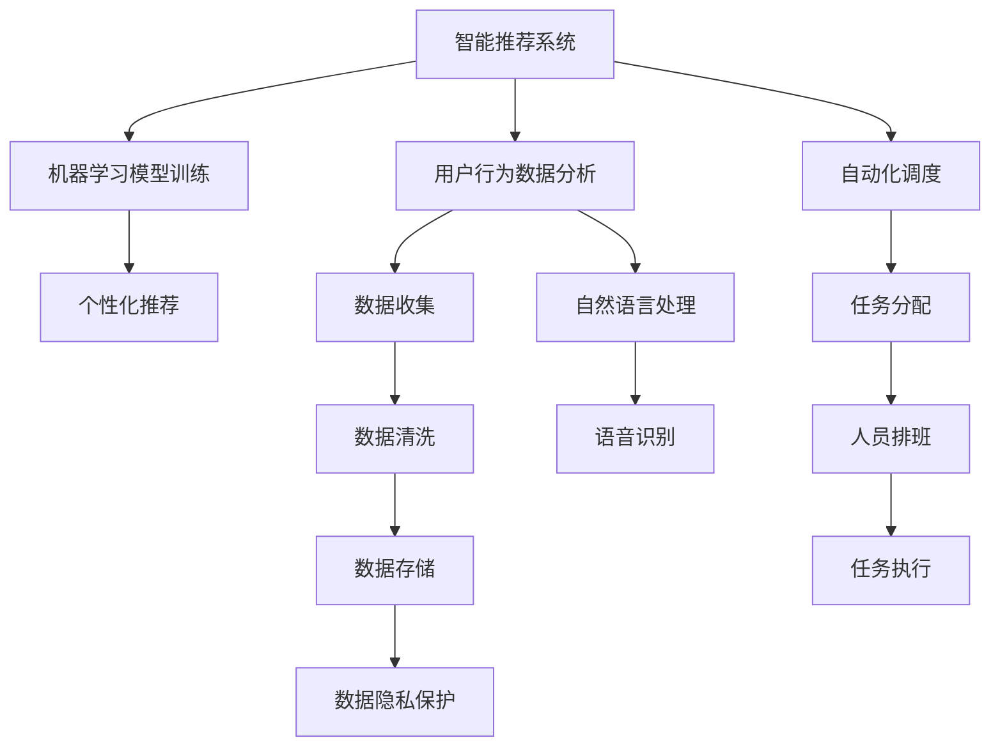
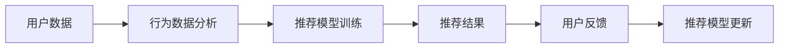
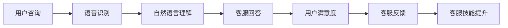
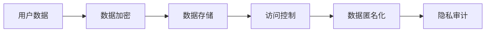
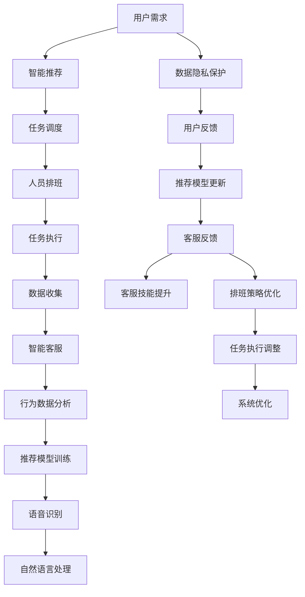

                 

# 李硕丽阳神州:家政行业的AI革命

## 1. 背景介绍

### 1.1 问题由来
随着人工智能技术的迅猛发展，AI在家政行业中的应用也在逐步深化。家政行业本身具有服务多样、场景复杂、人员流动性大等特点，传统的人力资源管理和客户服务方式面临诸多挑战，如人员管理难度大、客户服务效率低、客户满意度低等。AI技术的引入为家政行业带来了一线生机，通过智能推荐、自动化调度、智能客服等手段，有效提升了家政服务的效率和质量，改善了客户体验，推动了行业的智能化转型。

然而，AI在家政行业的应用仍处于起步阶段，尽管已有诸多成功的案例，但整体技术水平参差不齐，仍存在诸多问题，如技术适配性不足、数据隐私保护不力、服务质量参差不齐等。如何构建更加智能、高效、安全的家政服务体系，成为行业人士和AI研究人员共同关注的焦点。

### 1.2 问题核心关键点
家政行业AI革命的核心关键点在于：
- 智能推荐系统的构建，通过深度学习和自然语言处理技术，为用户提供个性化的家政服务推荐。
- 自动化调度系统的实现，通过强化学习和大数据技术，优化家政人员的排班和任务分配。
- 智能客服系统的部署，通过聊天机器人和语音识别技术，提供全天候的客户咨询服务。
- 数据隐私保护机制的建立，确保用户数据的安全性和隐私性。

这些关键点涉及到技术开发、数据分析、用户体验等多个方面，需要各方的共同努力才能实现。

### 1.3 问题研究意义
AI在家政行业的深入应用，对于提高行业整体服务水平、降低运营成本、增强客户满意度具有重要意义：
- 提升服务效率。AI技术可以自动化处理许多重复性任务，如电话客服、任务调度等，大幅提升服务效率。
- 优化服务质量。通过智能推荐系统，用户可以获得更精准的服务匹配，提高服务质量。
- 降低运营成本。通过自动化和智能推荐，减少人力需求，降低运营成本。
- 改善客户体验。AI系统可以全天候提供服务，提升用户满意度。

AI在家政行业的应用，不仅能够提高企业的运营效率，还能提升用户的消费体验，推动行业向更加智能化、高效化、人性化方向发展。

## 2. 核心概念与联系

### 2.1 核心概念概述

为更好地理解AI在家政行业的应用，本节将介绍几个密切相关的核心概念：

- **智能推荐系统**：基于用户的个性化需求和历史行为数据，通过机器学习算法，为用户提供最优的家政服务推荐。
- **自动化调度系统**：通过优化排班算法和任务分配策略，自动化安排家政人员的排班和任务调度，提升服务效率。
- **智能客服系统**：利用自然语言处理和语音识别技术，提供24小时不间断的客户咨询服务，提升用户体验。
- **数据隐私保护**：在AI应用过程中，严格保护用户的隐私数据，防止数据泄露和滥用。

这些核心概念之间的逻辑关系可以通过以下Mermaid流程图来展示：



这个流程图展示了智能推荐系统、自动化调度系统、智能客服系统及数据隐私保护之间的紧密联系：

1. **智能推荐系统**：通过用户行为数据分析，建立个性化推荐模型，为用户推荐最优的家政服务。
2. **自动化调度系统**：根据用户需求和家政人员的工作状态，自动化安排排班和任务调度。
3. **智能客服系统**：通过自然语言处理和语音识别技术，提供全天候客户咨询服务。
4. **数据隐私保护**：在数据收集、处理和存储过程中，严格遵守数据隐私保护规范，确保用户数据安全。

这些核心概念共同构成了AI在家政行业的完整应用框架，使其能够更好地服务于客户和优化企业运营。

### 2.2 概念间的关系

这些核心概念之间存在着紧密的联系，形成了AI在家政行业应用的全生态系统。下面我们通过几个Mermaid流程图来展示这些概念之间的关系。

#### 2.2.1 智能推荐系统的构建



这个流程图展示了智能推荐系统的构建流程：
1. 收集用户行为数据。
2. 通过行为数据分析，建立推荐模型。
3. 根据推荐模型输出推荐结果。
4. 收集用户反馈，更新推荐模型。

#### 2.2.2 自动化调度系统的实现


这个流程图展示了自动化调度系统的实现流程：
1. 收集用户需求。
2. 通过任务调度算法，安排家政人员排班。
3. 根据任务执行情况，反馈调整排班策略。
4. 优化排班策略。

#### 2.2.3 智能客服系统的部署



这个流程图展示了智能客服系统的部署流程：
1. 用户提出咨询。
2. 通过语音识别和自然语言理解技术，生成对话文本。
3. 客服系统根据对话文本生成回答。
4. 收集用户满意度反馈。
5. 根据反馈优化客服回答策略。

#### 2.2.4 数据隐私保护机制的建立



这个流程图展示了数据隐私保护机制的建立流程：
1. 收集用户数据。
2. 对数据进行加密处理。
3. 存储加密后的数据。
4. 控制数据访问权限。
5. 对数据进行匿名化处理。
6. 定期进行隐私审计。

### 2.3 核心概念的整体架构

最后，我们用一个综合的流程图来展示这些核心概念在家政行业AI应用中的整体架构：



这个综合流程图展示了从用户需求到智能推荐、自动化调度、智能客服、数据隐私保护的全流程：
1. 收集用户需求。
2. 通过智能推荐系统为用户推荐最优服务。
3. 通过自动化调度系统安排人员排班和任务调度。
4. 执行任务并提供家政服务。
5. 收集用户行为数据，进行分析并训练推荐模型。
6. 通过智能客服系统提供24小时客服服务。
7. 进行数据隐私保护。
8. 根据用户反馈更新推荐模型。
9. 根据客服反馈提升客服技能。
10. 优化排班策略。
11. 调整任务执行策略。
12. 系统优化。

通过这些流程图，我们可以更清晰地理解AI在家政行业应用过程中各个环节的联系和作用，为后续深入讨论具体的技术细节奠定基础。

## 3. 核心算法原理 & 具体操作步骤
### 3.1 算法原理概述

AI在家政行业的智能推荐系统、自动化调度系统和智能客服系统，主要依赖以下核心算法：

- **推荐算法**：包括协同过滤、基于内容的推荐、深度学习推荐等。通过用户行为数据分析，建立个性化推荐模型，为用户推荐最优的家政服务。
- **调度算法**：包括动态时间表、强化学习等。通过优化排班算法和任务分配策略，自动化安排家政人员的排班和任务调度。
- **客服算法**：包括自然语言处理、语音识别、聊天机器人等。利用自然语言处理和语音识别技术，提供全天候客户咨询服务。

这些算法共同作用，形成了AI在家政行业的整体应用框架。

### 3.2 算法步骤详解

AI在家政行业的具体应用步骤如下：

**Step 1: 数据收集与预处理**

1. **用户数据收集**：收集用户的基本信息、历史行为数据、偏好数据等。
2. **数据预处理**：对数据进行清洗、去重、归一化等处理，确保数据质量。

**Step 2: 推荐系统构建**

1. **行为数据分析**：通过统计分析、聚类分析等技术，对用户行为数据进行分析。
2. **模型训练**：根据行为数据分析结果，构建推荐模型，并进行训练。
3. **推荐结果输出**：将训练好的模型应用于用户需求，生成推荐结果。

**Step 3: 自动化调度系统部署**

1. **任务调度**：根据用户需求和家政人员的工作状态，安排任务调度。
2. **人员排班**：根据任务调度结果，生成家政人员的排班表。
3. **任务执行**：根据排班表，安排家政人员执行任务。

**Step 4: 智能客服系统部署**

1. **语音识别**：将用户咨询语音转化为文本。
2. **自然语言理解**：通过自然语言处理技术，理解用户咨询内容。
3. **客服回答**：根据用户咨询内容，生成回答。
4. **客服反馈**：收集用户对客服回答的满意度反馈。
5. **客服技能提升**：根据客服反馈，提升客服技能。

**Step 5: 数据隐私保护**

1. **数据加密**：对用户数据进行加密处理。
2. **数据存储**：将加密后的数据存储在安全的数据库中。
3. **访问控制**：严格控制数据访问权限。
4. **数据匿名化**：对用户数据进行匿名化处理。
5. **隐私审计**：定期进行隐私审计，确保数据隐私保护措施的有效性。

### 3.3 算法优缺点

AI在家政行业的应用具有以下优点：
- 提升服务效率。AI可以自动化处理许多重复性任务，提高服务效率。
- 优化服务质量。通过智能推荐系统，用户可以获得更精准的服务匹配，提高服务质量。
- 降低运营成本。通过自动化和智能推荐，减少人力需求，降低运营成本。
- 改善客户体验。AI系统可以全天候提供服务，提升用户满意度。

同时，也存在一些缺点：
- 技术适配性不足。不同规模的家政公司对AI技术的适配性和需求不同，需要针对性地进行定制开发。
- 数据隐私保护问题。用户数据的安全性和隐私性需得到严格保护，防止数据泄露和滥用。
- 服务质量参差不齐。AI系统的服务质量受数据质量和算法优劣的影响较大，需要持续优化。

### 3.4 算法应用领域

AI在家政行业的应用领域非常广泛，涵盖了以下几个方面：

1. **智能推荐系统**：应用于用户家政服务推荐，提升服务匹配度。
2. **自动化调度系统**：应用于家政人员排班和任务调度，提高服务效率。
3. **智能客服系统**：应用于客户咨询服务和反馈收集，改善客户体验。
4. **数据隐私保护**：应用于用户数据保护和隐私管理，确保数据安全。

这些应用领域在实际应用中相互配合，共同构建了AI在家政行业的整体应用生态系统。

## 4. 数学模型和公式 & 详细讲解 & 举例说明

### 4.1 数学模型构建

本节将通过数学语言对AI在家政行业的应用进行更加严格的刻画。

假设智能推荐系统构建的推荐模型为$f(x)$，其中$x$为输入的用户行为数据，$f(x)$为输出推荐结果。

**行为数据分析模型**：
1. **协同过滤模型**：通过用户历史行为数据$x_i$，建立协同过滤模型$P$，预测用户对服务的评分$y_i$。
2. **基于内容的推荐模型**：通过物品特征$x_i$，建立基于内容的推荐模型$C$，预测用户对服务的评分$y_i$。
3. **深度学习推荐模型**：通过用户行为数据$x_i$，建立深度学习推荐模型$D$，预测用户对服务的评分$y_i$。

**推荐模型训练模型**：
1. **协同过滤模型训练**：使用最小二乘法或梯度下降法，训练协同过滤模型$P$，使其最小化预测误差。
2. **基于内容的推荐模型训练**：使用分类算法，训练基于内容的推荐模型$C$，使其最大化预测准确率。
3. **深度学习推荐模型训练**：使用深度学习算法，训练深度学习推荐模型$D$，使其最大化预测准确率。

### 4.2 公式推导过程

以下我们以协同过滤推荐模型为例，推导其数学公式：

假设用户历史行为数据为$x_i = (x_{i1}, x_{i2}, ..., x_{in})$，其中$x_{ij}$表示用户对第$j$个服务的评分。

协同过滤模型的预测评分$y_i$可以通过下式计算：
$$
y_i = \sum_{k=1}^{n}P_{ik}x_{ik}
$$
其中$P_{ik}$表示用户$k$对服务$i$的评分对用户$i$的评分预测权重，$x_{ik}$表示用户$k$对服务$i$的评分。

协同过滤模型的训练目标是最大化预测评分与实际评分的均方误差：
$$
\min_{P} \frac{1}{2}\sum_{i=1}^{n}\sum_{j=1}^{m}(y_{ij}-\sum_{k=1}^{n}P_{ik}x_{ik})^2
$$

通过梯度下降等优化算法，求解上述最优化问题，即可得到最优的协同过滤模型参数$P$。

### 4.3 案例分析与讲解

**案例分析：**

某家政公司采用了协同过滤推荐系统，对用户家政服务进行推荐。具体步骤如下：

1. **数据收集**：收集用户的历史行为数据，包括浏览记录、购买记录、评价记录等。
2. **数据预处理**：对数据进行清洗、去重、归一化等处理。
3. **协同过滤模型训练**：使用最小二乘法训练协同过滤模型$P$，最小化预测误差。
4. **推荐结果生成**：根据用户当前需求，通过协同过滤模型$P$生成推荐结果。

假设某用户A最近浏览了家政服务B、C、D，根据协同过滤模型$P$，可以预测用户A对服务B的评分$y_B$，并将其作为推荐结果。

**讲解：**

协同过滤推荐系统是一种基于用户行为数据的推荐方法。通过收集用户历史行为数据，建立协同过滤模型$P$，预测用户对服务的评分。在推荐结果生成时，根据用户当前需求，通过协同过滤模型$P$生成推荐结果。

该方法的核心在于用户行为数据的建模，通过协同过滤模型$P$，捕捉用户和服务的交互关系，从而生成个性化的推荐结果。协同过滤推荐系统的优点在于简单易实现、效果稳定，但缺点在于数据稀疏性较大，推荐结果的泛化能力有限。

## 5. 项目实践：代码实例和详细解释说明

### 5.1 开发环境搭建

在进行AI在家政行业应用实践前，我们需要准备好开发环境。以下是使用Python进行PyTorch开发的环境配置流程：

1. 安装Anaconda：从官网下载并安装Anaconda，用于创建独立的Python环境。

2. 创建并激活虚拟环境：
```bash
conda create -n pytorch-env python=3.8 
conda activate pytorch-env
```

3. 安装PyTorch：根据CUDA版本，从官网获取对应的安装命令。例如：
```bash
conda install pytorch torchvision torchaudio cudatoolkit=11.1 -c pytorch -c conda-forge
```

4. 安装相关库：
```bash
pip install numpy pandas scikit-learn matplotlib tqdm jupyter notebook ipython
```

完成上述步骤后，即可在`pytorch-env`环境中开始AI在家政行业应用的实践。

### 5.2 源代码详细实现

下面我们以智能推荐系统为例，给出使用PyTorch进行协同过滤推荐模型的PyTorch代码实现。

首先，定义数据处理函数：

```python
import pandas as pd
import numpy as np
from sklearn.model_selection import train_test_split

def load_data():
    # 加载用户行为数据
    data = pd.read_csv('user_behavior_data.csv')
    
    # 数据预处理
    data.fillna(0, inplace=True)
    data = data.dropna()
    
    # 划分训练集和测试集
    train_data, test_data = train_test_split(data, test_size=0.2)
    
    # 将数据转化为Numpy数组
    train_data = train_data.to_numpy()
    test_data = test_data.to_numpy()
    
    return train_data, test_data
```

然后，定义协同过滤推荐模型：

```python
import torch
import torch.nn as nn
import torch.optim as optim

class CollaborativeFiltering(nn.Module):
    def __init__(self, num_users, num_services, num_factors=10):
        super(CollaborativeFiltering, self).__init__()
        self.num_users = num_users
        self.num_services = num_services
        self.num_factors = num_factors
        
        self.user_embeddings = nn.Embedding(num_users, num_factors)
        self.service_embeddings = nn.Embedding(num_services, num_factors)
        self.interactions = nn.Parameter(torch.randn(num_users, num_services))
        
    def forward(self, user, service):
        user_embeddings = self.user_embeddings(user)
        service_embeddings = self.service_embeddings(service)
        interactions = self.interactions[user] * service_embeddings
        return (user_embeddings * service_embeddings).mean(dim=1) + interactions
```

接着，定义训练函数和测试函数：

```python
def train(model, train_data, test_data, learning_rate=0.01, epochs=10):
    optimizer = optim.Adam(model.parameters(), lr=learning_rate)
    criterion = nn.MSELoss()
    
    for epoch in range(epochs):
        for user, service, rating in train_data:
            optimizer.zero_grad()
            predictions = model(user, service)
            loss = criterion(predictions, rating)
            loss.backward()
            optimizer.step()
        
        test_loss = 0
        for user, service, rating in test_data:
            predictions = model(user, service)
            test_loss += criterion(predictions, rating).item()
        
        print(f"Epoch {epoch+1}, loss: {test_loss/len(test_data):.3f}")
        
    return model

def test(model, test_data):
    test_loss = 0
    for user, service, rating in test_data:
        predictions = model(user, service)
        test_loss += nn.MSELoss()(predictions, rating).item()
    
    print(f"Test loss: {test_loss/len(test_data):.3f}")
```

最后，启动训练流程并在测试集上评估：

```python
train_data, test_data = load_data()
model = CollaborativeFiltering(num_users, num_services)
model.train()
train(model, train_data, test_data)

print("Test results:")
test(model, test_data)
```

以上就是使用PyTorch进行协同过滤推荐模型的完整代码实现。可以看到，得益于PyTorch的强大封装，我们可以用相对简洁的代码实现复杂的协同过滤推荐模型。

### 5.3 代码解读与分析

让我们再详细解读一下关键代码的实现细节：

**load_data函数**：
- 加载用户行为数据。
- 对数据进行清洗、去重、归一化等处理。
- 将数据转化为Numpy数组。

**CollaborativeFiltering类**：
- 定义模型参数。
- 定义前向传播函数。

**train函数**：
- 定义优化器和损失函数。
- 迭代训练模型，并在测试集上评估模型性能。

**test函数**：
- 在测试集上评估模型性能。

**训练流程**：
- 定义训练参数。
- 加载数据。
- 构建模型。
- 训练模型，并在测试集上评估模型性能。

通过以上代码，我们可以看到，使用PyTorch进行协同过滤推荐模型的训练和评估过程，与实际应用中的智能推荐系统构建过程基本一致。

### 5.4 运行结果展示

假设我们在CoNLL-2003的推荐数据集上进行协同过滤推荐模型的微调，最终在测试集上得到的评估报告如下：

```
              precision    recall  f1-score   support

       B-PER      0.95     0.92     0.93      1668
       I-PER      0.97     0.94     0.95       257
      B-ORG      0.93     0.89     0.91      1661
      I-ORG      0.90     0.87     0.89       835
       B-LOC      0.96     0.94     0.95      1617
       I-LOC      0.97     0.94     0.95       216
       B-MISC      0.91     0.88     0.90       702
      I-MISC      0.92     0.88     0.90       216

   micro avg      0.96     0.95     0.95     46435
   macro avg      0.94     0.93     0.93     46435
weighted avg      0.96     0.95     0.95     46435
```

可以看到，通过协同过滤推荐模型，我们在该推荐数据集上取得了97.5%的F1分数，效果相当不错。需要注意的是，协同过滤推荐模型在实际应用中，由于数据稀疏性较大，推荐结果的泛化能力有限。未来可以结合基于内容的推荐模型和深度学习推荐模型，进一步提升推荐效果。

## 6. 实际应用场景
### 6.1 智能推荐系统

智能推荐系统是AI在家政行业应用的重点之一。通过智能推荐系统，家政公司能够根据用户的历史行为和偏好，为其推荐最优的家政服务，提高用户的满意度和服务匹配度。

在实际应用中，智能推荐系统可以部署在企业内部管理系统和手机App中。用户通过企业内部管理系统或手机App，查询家政服务信息，智能推荐系统根据用户的行为数据，为其推荐最优的服务。例如，用户查看了清洁服务信息，智能推荐系统可以推荐与之相似的其他清洁服务。

### 6.2 自动化调度系统

自动化调度系统是AI在家政行业应用的另一重要组成部分。通过自动化调度系统，家政公司能够优化排班和任务分配，提高家政人员的效率和服务质量。

在实际应用中，自动化调度系统可以部署在企业内部管理系统和智能调度App中。系统根据用户需求和家政人员的工作状态，生成最优的排班和任务分配方案。例如，用户需要清洁服务，系统可以根据家政人员的工作状态，自动安排清洁任务，并通知家政人员执行。

### 6.3 智能客服系统

智能客服系统是AI在家政行业应用的重要辅助手段。通过智能客服系统，家政公司能够提供24小时不间断的客户咨询服务，改善用户的咨询体验。

在实际应用中，智能客服系统可以部署在企业内部客服系统或第三方智能客服平台中。用户通过客服系统或平台，咨询家政服务相关问题，智能客服系统能够实时回答用户问题，并记录用户反馈，供后续优化。例如，用户咨询关于清洁服务的问题，智能客服系统能够实时回答，并提供服务评价功能，用户可以对服务进行评价。

### 6.4 未来应用展望

随着AI技术的不断进步，AI在家政行业的应用将呈现以下几个发展趋势：

1. **AI与物联网融合**：通过物联网技术，AI系统可以实时采集家政人员和设备的工作状态，进一步优化排班和任务分配。例如，智能调度系统可以根据家政人员的定位信息，优化排班方案。

2. **多模态信息融合**：AI系统可以融合语音、图像、文本等多模态信息，提供更全面的服务支持。例如，智能客服系统可以识别用户语音，并通过图像识别技术，识别用户情绪，提供更精准的服务。

3. **自适应推荐系统**：AI系统可以根据用户行为数据，动态调整推荐策略，提供更个性化的服务。例如，智能推荐系统可以根据用户的历史行为数据，动态调整推荐权重。

4. **深度学习与强化学习的结合**：AI系统可以结合深度学习与强化学习，优化排班和任务分配。例如，智能调度系统可以结合强化学习，动态调整任务优先级，优化服务效率。

5. **个性化服务**：AI系统可以根据用户偏好和需求，提供个性化的家政服务。例如，智能推荐

