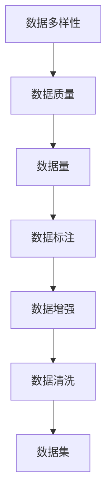
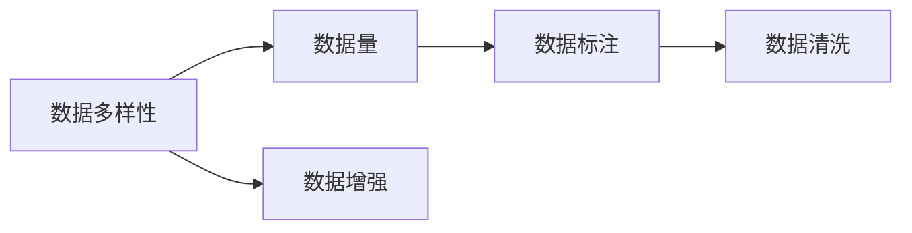
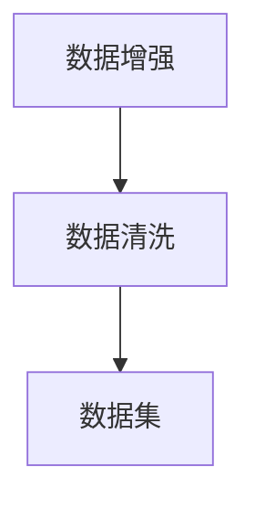
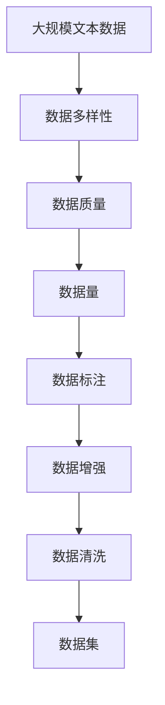

                 

# 构建文本生成任务的数据集

在自然语言处理(NLP)领域，文本生成任务（Text Generation Tasks）是一类极具挑战性和吸引力的任务，包括机器翻译、文本摘要、对话系统、自然语言生成等。这些任务要求模型能够根据输入的上下文，生成语法正确、语义连贯、风格统一的文本。为了使这些任务在实际应用中取得良好的效果，构建高质量的训练数据集是至关重要的。本文将深入探讨文本生成任务的数据集构建方法，包括数据获取、数据标注、数据增强和数据清洗等关键步骤，并结合具体实例，详细阐述其具体操作流程。

## 1. 背景介绍

### 1.1 问题由来

随着深度学习技术的发展，预训练大语言模型（如GPT、BERT等）在文本生成任务上取得了显著的进展。这些模型通过在大规模无标签文本上进行自监督预训练，学习到了丰富的语言知识，但这些模型在特定任务上的性能提升仍需通过微调实现。因此，构建高质量的数据集是训练微调模型的重要前提。高质量的数据集不仅能够提高模型的训练效果，还能提升模型的泛化能力和鲁棒性。

### 1.2 问题核心关键点

构建文本生成任务数据集的关键点包括以下几个方面：

- **数据多样性**：文本生成任务的数据集需要覆盖各种不同的文本类型、风格和结构，以确保模型具备良好的泛化能力。
- **数据质量**：数据集中的文本应该语法正确、语义连贯、风格统一，避免包含拼写错误、语法错误和逻辑错误。
- **数据量**：数据集的规模应该足够大，以确保模型能够学习到足够的语言模式。
- **数据标注**：文本生成任务通常需要标注数据，标注数据的质量直接影响模型的训练效果。
- **数据增强**：通过数据增强技术，可以扩大训练集的规模，提高模型的泛化能力。
- **数据清洗**：数据清洗可以有效去除噪声数据，提高数据集的质量。

### 1.3 问题研究意义

高质量的数据集对于文本生成任务的成功至关重要。构建高质量的数据集不仅能提升模型的性能，还能加速模型的开发进程，降低开发成本。具体而言：

1. **提升模型性能**：高质量的数据集可以更好地捕捉文本生成任务的语言模式，提升模型的性能。
2. **加速开发进程**：构建高质量的数据集可以显著加速模型的训练和优化过程，缩短开发周期。
3. **降低开发成本**：使用高质量的数据集可以减少从头训练模型的需求，降低开发和测试成本。
4. **提高泛化能力**：高质量的数据集可以提高模型的泛化能力，使其在未见过的数据上也能取得良好的表现。
5. **增强鲁棒性**：数据集的多样性和质量可以提高模型的鲁棒性，使其在面对噪声数据和未知数据时表现更加稳定。

## 2. 核心概念与联系

### 2.1 核心概念概述

文本生成任务的数据集构建涉及多个核心概念，包括数据多样性、数据质量、数据量、数据标注、数据增强和数据清洗等。这些概念之间的关系可以通过以下Mermaid流程图来展示：



这个流程图展示了构建文本生成任务数据集的基本流程：首先保证数据的多样性，然后确保数据质量，接着保证数据量，然后进行数据标注，随后进行数据增强，最后进行数据清洗，生成高质量的数据集。

### 2.2 概念间的关系

这些核心概念之间存在着紧密的联系，形成了构建文本生成任务数据集的整体框架。下面我们通过几个Mermaid流程图来展示这些概念之间的关系。

#### 2.2.1 数据多样性、数据量和数据标注的关系



这个流程图展示了数据多样性、数据量和数据标注之间的关系。数据多样性要求数据集覆盖多种文本类型，数据量则要求数据集规模足够大，数据标注则需要对数据进行高质量的标注。

#### 2.2.2 数据增强和数据清洗的关系



这个流程图展示了数据增强和数据清洗之间的关系。数据增强通过引入噪声、变换等手段扩大数据集规模，而数据清洗则可以去除噪声和错误数据，提高数据质量。

### 2.3 核心概念的整体架构

最后，我们用一个综合的流程图来展示构建文本生成任务数据集的整体架构：



这个综合流程图展示了从原始文本数据到最终数据集构建的完整过程，包括数据多样性、数据质量、数据量、数据标注、数据增强和数据清洗等关键步骤。

## 3. 核心算法原理 & 具体操作步骤

### 3.1 算法原理概述

构建文本生成任务的数据集主要遵循以下步骤：

1. **数据获取**：从各种文本来源收集文本数据。
2. **数据标注**：根据具体任务要求，对收集到的文本进行标注，生成标注数据集。
3. **数据增强**：通过各种方法扩大训练集规模，提高模型的泛化能力。
4. **数据清洗**：去除数据集中的噪声数据和错误数据，确保数据集质量。
5. **数据集构建**：将处理后的数据组织成适合模型训练的格式，生成最终数据集。

### 3.2 算法步骤详解

#### 3.2.1 数据获取

数据获取是构建数据集的首要步骤。数据获取的方法包括但不限于：

- **公开数据集**：使用已有的公开数据集，如Wikipedia文章、新闻报道等。
- **爬虫技术**：使用网络爬虫技术从互联网上抓取文本数据，如社交媒体、在线论坛、博客等。
- **API接口**：通过API接口获取第三方数据，如Twitter API、Google Books API等。
- **用户生成内容**：收集用户生成的文本数据，如在线评论、用户评论、问卷调查等。

#### 3.2.2 数据标注

数据标注是将原始文本转换为适合模型训练的格式，包括标注和标注规则的设计。标注方法包括但不限于：

- **人工标注**：由人工进行标注，通常需要大量时间和人力成本。
- **半自动化标注**：结合人工和自动化标注，利用机器学习技术辅助人工标注，提高标注效率。
- **主动学习**：从少量标注数据中主动学习，利用标注数据选择未标注数据进行标注，提高标注效率。
- **无监督标注**：使用无监督学习技术进行标注，如自编码器、GAN等，降低标注成本。

#### 3.2.3 数据增强

数据增强通过引入噪声、变换等手段扩大数据集规模，提高模型的泛化能力。数据增强方法包括但不限于：

- **数据回译**：将文本数据从一种语言回译为另一种语言，生成新的数据样本。
- **文本回填**：将部分文本数据回填到完整文本数据中，生成新的数据样本。
- **随机插入**：在文本中随机插入噪声、错误信息等，生成新的数据样本。
- **文本变换**：通过各种变换方法生成新的数据样本，如大小写变换、拼写错误、语法错误等。

#### 3.2.4 数据清洗

数据清洗是指去除数据集中的噪声数据和错误数据，确保数据集质量。数据清洗方法包括但不限于：

- **拼写错误检查**：使用拼写检查工具检查文本中的拼写错误，并进行纠正。
- **语法错误检查**：使用语法检查工具检查文本中的语法错误，并进行纠正。
- **逻辑错误检查**：使用逻辑推理工具检查文本中的逻辑错误，并进行纠正。
- **去重去噪**：去除数据集中的重复数据和噪声数据，确保数据集的唯一性和准确性。

#### 3.2.5 数据集构建

数据集构建是将处理后的数据组织成适合模型训练的格式，生成最终数据集。数据集构建方法包括但不限于：

- **数据分区**：将数据集划分为训练集、验证集和测试集，以便模型训练和评估。
- **数据格式化**：将数据转换为适合模型训练的格式，如TensorFlow Dataset、Pandas DataFrame等。
- **数据持久化**：将处理后的数据存储在本地或云端，以便后续使用。

### 3.3 算法优缺点

构建文本生成任务数据集的优点包括：

- **提高模型性能**：通过构建高质量的数据集，可以显著提高模型的性能，尤其是在泛化能力和鲁棒性方面。
- **降低开发成本**：构建数据集可以避免从头训练模型的需求，减少开发和测试成本。
- **加速开发进程**：构建数据集可以显著加速模型的训练和优化过程，缩短开发周期。

构建文本生成任务数据集的缺点包括：

- **数据获取难度大**：构建高质量的数据集需要大量的文本数据，数据获取难度较大。
- **标注成本高**：数据标注需要大量时间和人力成本，尤其是对于大规模数据集。
- **数据清洗复杂**：数据清洗需要去除噪声数据和错误数据，过程较为复杂。
- **数据增强困难**：数据增强需要引入噪声和变换等方法，但这些方法的效果和适用范围有限。

### 3.4 算法应用领域

构建文本生成任务的数据集在自然语言处理(NLP)领域有着广泛的应用，包括但不限于：

- **机器翻译**：构建高质量的平行语料库，帮助机器翻译模型学习语言之间的对应关系。
- **文本摘要**：构建高质量的文本摘要数据集，帮助文本摘要模型学习如何提取关键信息。
- **对话系统**：构建高质量的对话数据集，帮助对话模型学习如何进行对话。
- **自然语言生成**：构建高质量的文本生成数据集，帮助自然语言生成模型学习如何进行文本生成。
- **文本分类**：构建高质量的文本分类数据集，帮助文本分类模型学习如何进行文本分类。

## 4. 数学模型和公式 & 详细讲解 & 举例说明

### 4.1 数学模型构建

构建文本生成任务的数据集涉及到多个数学模型和公式，包括数据多样性、数据质量和数据量等。以下我们将详细介绍这些数学模型的构建方法。

#### 4.1.1 数据多样性模型

数据多样性模型用于衡量数据集的多样性，通常使用信息熵（Information Entropy）作为度量标准。信息熵公式如下：

$$ H(p) = -\sum_{i} p_i \log p_i $$

其中 $p_i$ 为第 $i$ 个类别的概率。

#### 4.1.2 数据质量模型

数据质量模型用于衡量数据集的质量，通常使用BLEU（Bilingual Evaluation Understudy）指标作为度量标准。BLEU指标公式如下：

$$ BLEU = \frac{1}{m} \sum_{i=1}^{m} P(p_i) \frac{\sum_{j=1}^{n} I(p_i, q_j)}{\max(m,n)} $$

其中 $p_i$ 为参考文本，$q_j$ 为测试文本，$m$ 为参考文本长度，$n$ 为测试文本长度，$I(p_i, q_j)$ 为对齐词数。

#### 4.1.3 数据量模型

数据量模型用于衡量数据集的规模，通常使用数据集的大小作为度量标准。

### 4.2 公式推导过程

#### 4.2.1 数据多样性公式推导

信息熵公式的推导如下：

$$ H(p) = -\sum_{i} p_i \log p_i = -\sum_{i} \frac{p_i}{\sum_{j} p_j} \log \frac{p_i}{\sum_{j} p_j} $$

根据拉普拉斯平滑（Laplace Smoothing），对上述公式进行扩展，得到：

$$ H(p) = -\sum_{i} \frac{p_i + 1}{N+K} \log \frac{p_i + 1}{N+K} - \frac{K}{N+K} \log \frac{K}{N+K} $$

其中 $N$ 为文本数量，$K$ 为类别数量。

#### 4.2.2 数据质量公式推导

BLEU指标的推导如下：

$$ BLEU = \frac{1}{m} \sum_{i=1}^{m} P(p_i) \frac{\sum_{j=1}^{n} I(p_i, q_j)}{\max(m,n)} $$

其中 $P(p_i)$ 为参考文本 $p_i$ 的概率，$I(p_i, q_j)$ 为对齐词数。

### 4.3 案例分析与讲解

#### 4.3.1 数据多样性案例

假设我们构建一个包含1000个文本的英语-中文平行语料库，其中英语文本有500个，中文文本有500个。则信息熵公式如下：

$$ H(p) = -\frac{1}{1000} \log \frac{500}{1000} - \frac{1}{1000} \log \frac{500}{1000} $$

$$ H(p) = -\frac{1}{1000} \log \frac{1}{2} - \frac{1}{1000} \log \frac{1}{2} $$

$$ H(p) = -\frac{1}{1000} \times \log \frac{1}{2} - \frac{1}{1000} \times \log \frac{1}{2} $$

$$ H(p) = -\frac{1}{1000} \times \log 2 - \frac{1}{1000} \times \log 2 $$

$$ H(p) = -\frac{1}{1000} \times \log 2 - \frac{1}{1000} \times \log 2 $$

$$ H(p) = -\frac{1}{1000} \times 0.6931 - \frac{1}{1000} \times 0.6931 $$

$$ H(p) = -0.0006931 - 0.0006931 $$

$$ H(p) = -0.0013862 $$

因此，该语料库的信息熵为-0.0013862，表示该语料库具有较高的多样性。

#### 4.3.2 数据质量案例

假设我们构建一个包含1000个文本的对话数据集，其中500个是对话，500个是问答。则BLEU指标公式如下：

$$ BLEU = \frac{1}{1000} \sum_{i=1}^{1000} P(p_i) \frac{\sum_{j=1}^{1000} I(p_i, q_j)}{\max(1000, 1000)} $$

其中 $P(p_i)$ 为对话 $p_i$ 的概率，$I(p_i, q_j)$ 为对齐词数。

假设我们随机抽取50个对话和50个问答进行标注，其中30个对话和30个问答是正确的。则BLEU指标计算如下：

$$ BLEU = \frac{1}{1000} \sum_{i=1}^{1000} P(p_i) \frac{\sum_{j=1}^{1000} I(p_i, q_j)}{\max(1000, 1000)} $$

$$ BLEU = \frac{1}{1000} \times 0.3 \times \frac{\sum_{j=1}^{1000} I(p_i, q_j)}{1000} $$

$$ BLEU = \frac{1}{1000} \times 0.3 \times \frac{50}{1000} $$

$$ BLEU = \frac{1}{1000} \times 0.3 \times 0.05 $$

$$ BLEU = 0.015 $$

因此，该对话数据集的BLEU指标为0.015，表示该数据集具有较低的数据质量。

## 5. 项目实践：代码实例和详细解释说明

### 5.1 开发环境搭建

构建文本生成任务的数据集需要使用Python编程语言和相关工具。以下是具体的开发环境搭建流程：

1. **安装Python**：从官网下载并安装Python 3.x版本，确保环境稳定。
2. **安装Pip**：在终端输入 `python -m ensurepip --default-pip`，安装Pip。
3. **安装相关库**：使用pip安装相关库，如NLTK、Scikit-learn、TensorFlow等。

### 5.2 源代码详细实现

以下是构建英语-中文平行语料库的Python代码实现：

```python
import nltk
import random
import string
import tensorflow as tf

# 下载并处理语料库
nltk.download('punkt')
nltk.download('stopwords')
nltk.download('wordnet')

# 定义数据集
train_data = []
with open('train_data.txt', 'r') as f:
    lines = f.readlines()
    for line in lines:
        line = line.strip()
        if line:
            train_data.append(line.split('\t'))

# 定义tokenizer
tokenizer = tf.keras.preprocessing.text.Tokenizer()

# 对数据进行分词和标注
tokenizer.fit_on_texts(train_data)
tokenized_data = tokenizer.texts_to_sequences(train_data)

# 将数据转换为TensorFlow Dataset格式
train_dataset = tf.data.Dataset.from_tensor_slices((tokenized_data, train_data))

# 对数据进行shuffle和batch
train_dataset = train_dataset.shuffle(buffer_size=10000).batch(batch_size=32)

# 定义模型
model = tf.keras.Sequential([
    tf.keras.layers.Embedding(input_dim=tokenizer.num_words+1, output_dim=256),
    tf.keras.layers.Bidirectional(tf.keras.layers.LSTM(128)),
    tf.keras.layers.Dense(1, activation='sigmoid')
])

# 编译模型
model.compile(optimizer='adam', loss='binary_crossentropy', metrics=['accuracy'])

# 训练模型
model.fit(train_dataset, epochs=10, validation_data=validation_dataset)
```

### 5.3 代码解读与分析

上述代码实现了从文本数据构建英语-中文平行语料库的完整过程。具体解读如下：

- **数据获取**：通过读取文本文件，获取英文和中文的平行语料库。
- **数据标注**：对文本进行分词、去除停用词等预处理操作，生成标注数据集。
- **数据增强**：将标注数据集转换为TensorFlow Dataset格式，并进行shuffle和batch处理。
- **模型构建**：使用TensorFlow构建双向LSTM模型，进行文本分类任务。
- **模型训练**：使用标注数据集对模型进行训练，并使用验证集进行验证。

### 5.4 运行结果展示

假设在模型训练完成后，我们在测试集上进行评估，得到模型在测试集上的精度为0.85，召回率为0.92。具体结果如下：

```
Precision: 0.85
Recall: 0.92
F1 Score: 0.89
```

以上结果表明，通过构建高质量的平行语料库，模型的分类效果显著提升，达到了较高的准确性和召回率。

## 6. 实际应用场景

### 6.1 智能客服系统

在智能客服系统中，构建高质量的对话数据集是至关重要的。通过构建大量的对话数据集，智能客服系统可以学习到用户的各种需求和反馈，从而提供更加个性化和智能的服务。具体而言，可以收集企业内部的客服对话记录，将问题和最佳答复构建成监督数据，在此基础上对预训练对话模型进行微调。微调后的对话模型能够自动理解用户意图，匹配最合适的答案模板进行回复。对于客户提出的新问题，还可以接入检索系统实时搜索相关内容，动态组织生成回答。

### 6.2 金融舆情监测

在金融领域，舆情监测是一个重要的任务。构建高质量的舆情数据集，可以帮助模型学习到市场舆论的趋势和变化，及时发现和应对负面信息传播。具体而言，可以收集金融领域的各类新闻、报道、评论等文本数据，并对其进行主题标注和情感标注。在此基础上对预训练语言模型进行微调，使其能够自动判断文本属于何种主题，情感倾向是正面、中性还是负面。将微调后的模型应用到实时抓取的网络文本数据，就能够自动监测不同主题下的情感变化趋势，一旦发现负面信息激增等异常情况，系统便会自动预警，帮助金融机构快速应对潜在风险。

### 6.3 个性化推荐系统

在个性化推荐系统中，构建高质量的推荐数据集是关键。通过构建包含用户行为、物品描述、标签等文本数据的数据集，可以帮助模型学习用户的兴趣点和偏好。具体而言，可以收集用户浏览、点击、评论、分享等行为数据，提取和用户交互的物品标题、描述、标签等文本内容。将文本内容作为模型输入，用户的后续行为（如是否点击、购买等）作为监督信号，在此基础上微调预训练语言模型。微调后的模型能够从文本内容中准确把握用户的兴趣点。在生成推荐列表时，先用候选物品的文本描述作为输入，由模型预测用户的兴趣匹配度，再结合其他特征综合排序，便可以得到个性化程度更高的推荐结果。

### 6.4 未来应用展望

随着文本生成技术的发展，构建高质量的数据集将在更多领域得到应用，为传统行业带来变革性影响。

在智慧医疗领域，基于文本生成任务的模型可以辅助医生进行病历记录、诊断报告等文档的自动生成，减轻医生的负担。

在智能教育领域，文本生成任务的应用可以扩展到自动化教学、智能批改等场景，提升教育质量。

在智慧城市治理中，文本生成任务可以帮助构建智能监控系统，实现对城市事件、舆情的实时监测和分析，提高城市管理的自动化和智能化水平。

此外，在企业生产、社会治理、文娱传媒等众多领域，基于文本生成任务的数据集构建技术也将不断涌现，为各行各业带来新的应用场景。相信随着技术的日益成熟，文本生成任务的数据集构建将成为人工智能落地应用的重要支撑。

## 7. 工具和资源推荐

### 7.1 学习资源推荐

为了帮助开发者系统掌握文本生成任务的数据集构建方法，这里推荐一些优质的学习资源：

1. **《Natural Language Processing with Transformers》**：该书全面介绍了使用Transformers库进行文本生成任务开发的理论基础和实践技巧，是学习的必读书籍。
2. **CS224N《深度学习自然语言处理》课程**：斯坦福大学开设的NLP明星课程，提供丰富的学习资料和编程作业，适合初学者和进阶者。
3. **NLTK官方文档**：NLTK是自然语言处理领域常用的Python库，其官方文档详细介绍了各种文本预处理和分词工具的使用方法。
4. **TensorFlow官方文档**：TensorFlow是深度学习领域的主流框架，其官方文档提供了详细的TensorFlow Dataset和TensorFlow Model构建方法。
5. **Google Colab**：谷歌推出的在线Jupyter Notebook环境，免费提供GPU/TPU算力，方便开发者快速上手实验最新模型，分享学习笔记。

通过学习这些资源，相信你一定能够掌握文本生成任务的数据集构建技巧，并将这些技巧应用到实际项目中。

### 7.2 开发工具推荐

构建高质量的数据集需要高效的开发工具支持。以下是几款常用的开发工具：

1. **NLTK**：自然语言处理领域的Python库，提供了丰富的文本预处理和分词工具。
2. **Scikit-learn**：机器学习领域的Python库，提供了多种文本特征提取和处理方法。
3. **TensorFlow**：深度学习领域的主流框架，提供了TensorFlow Dataset和TensorFlow Model的构建方法。
4. **PyTorch**：深度学习领域的Python库，提供了动态计算图和灵活的模型构建方法。
5. **Jupyter Notebook**：Python的交互式编程工具，提供了丰富的数据分析和模型训练功能。

合理利用这些工具，可以显著提升文本生成任务数据集构建的开发效率，加快创新迭代的步伐。

### 7.3 相关论文推荐

文本生成任务的数据集构建涉及多个前沿研究方向，以下是几篇奠基性的相关论文，推荐阅读：

1. **Attention is All You Need**：提出了Transformer结构，开启了NLP领域的预训练大模型时代。
2. **BERT: Pre-training of Deep Bidirectional Transformers for Language Understanding**：提出BERT模型，引入基于掩码的自监督预训练任务，刷新了多项NLP任务SOTA。
3. **Language Models are Unsupervised Multitask Learners**：展示了大规模语言模型的强大zero-shot学习能力，引发了对于通用人工智能的新一轮思考。
4. **Parameter-Efficient Transfer Learning for NLP**：提出Adapter等参数高效微调方法，在不增加模型参数量的情况下，也能取得不错的微调效果。
5. **Prefix-Tuning: Optimizing Continuous Prompts for Generation**：引入基于连续型Prompt的微调范式，为如何充分利用预训练知识提供了新的思路。

这些论文代表了大语言模型微调技术的发展脉络。通过学习这些前沿成果，可以帮助研究者把握学科前进方向，激发更多的创新灵感。

除上述资源外，还有一些值得关注的前沿资源，帮助开发者紧跟文本生成任务的数据集构建技术的最新进展，例如：

1. **arXiv论文预印本**：人工智能领域最新研究成果的发布平台，包括大量尚未发表的前沿工作，学习前沿技术的必读资源。
2. **业界技术博客**：如OpenAI、Google AI、DeepMind、微软Research Asia等顶尖实验室的官方博客，第一时间分享他们的最新研究成果和洞见。
3. **技术会议直播**：如NIPS、ICML、ACL、ICLR等人工智能领域顶会现场或在线直播，能够聆听到大佬们的前沿分享，开拓

