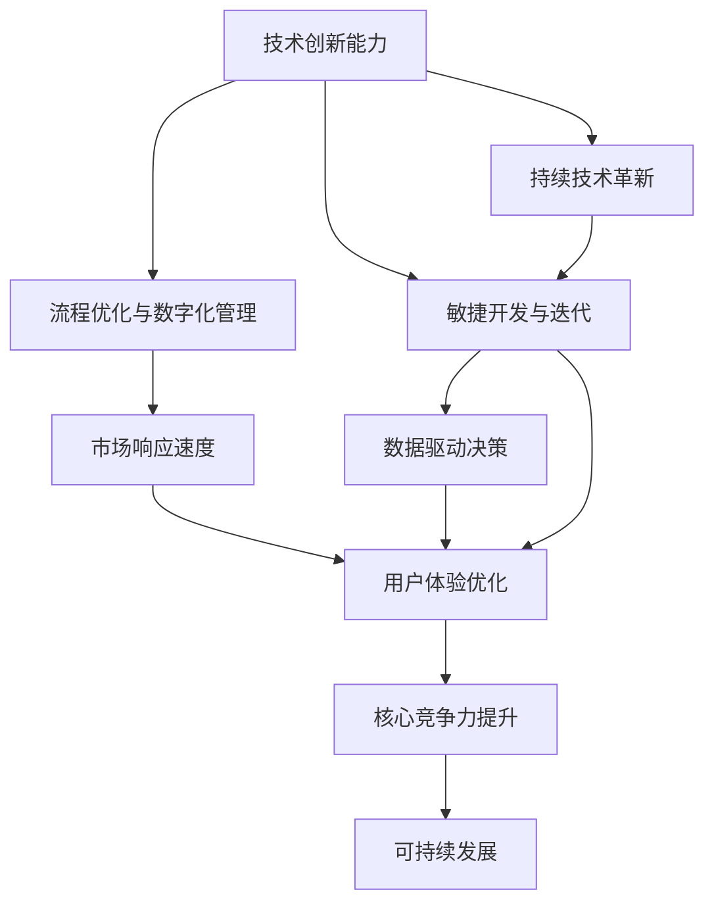

                 

## 1. 背景介绍

在当今信息技术快速发展的时代，提升核心竞争力已成为企业及个人成长的关键因素。然而，面对复杂多变的商业环境，传统的线性增长模式和以“规模驱动”为核心的竞争力提升策略已难以满足需求。新的生产力和竞争力的构建方式应具备更强的适应性和灵活性，能够应对多元化的业务需求和持续的技术变革。本文将探讨基于新质生产力策略的核心竞争力提升方法，希望能为行业人士提供有价值的参考。

### 1.1 问题由来

在数字化浪潮的推动下，人工智能、大数据、云计算等前沿技术不断涌现，传统产业的生产方式和商业模式正面临颠覆性变革。如何在新的技术环境下，构建新的核心竞争力，成为摆在企业和个人面前的重大课题。传统的以规模扩张和功能堆叠为核心的竞争力提升方法，在成本、速度和灵活性上均存在不足，难以应对快速变化的市场需求。因此，需要探索新质生产力的构建方式，以适应新的竞争环境和产业需求。

### 1.2 问题核心关键点

新质生产力的构建，需要突破传统的思维框架，重新定义核心竞争力的内涵。其核心在于，通过提升企业的创新能力、管理效率和市场响应速度，实现可持续发展。与传统线性增长的模式不同，新质生产力强调的是以技术创新为核心，以优化流程和资源配置为手段，以提升产品质量和市场占有率为目标的生产力提升策略。其关键点包括：

1. **技术创新能力**：持续的技术革新是提升核心竞争力的根本途径。通过引入最新的信息技术，改进产品设计和生产流程，提高生产效率。
2. **流程优化与数字化管理**：利用数字化工具和管理方法，实现流程自动化和智能化，提升运营效率和管理精度。
3. **市场响应速度**：通过敏捷开发和快速迭代，缩短产品上市周期，快速响应市场需求变化。
4. **用户体验优化**：关注用户需求，通过优化产品和服务的用户体验，提升用户满意度和品牌忠诚度。

## 2. 核心概念与联系

### 2.1 核心概念概述

为更清晰地理解新质生产力的构建方法，本节将介绍几个关键概念：

- **新质生产力**：一种以技术创新为核心，以流程优化、数字化管理和市场响应速度提升为手段，实现可持续发展的生产力提升策略。其本质在于通过信息化和智能化手段，优化企业资源配置，提升创新能力和市场适应性。
- **核心竞争力**：企业或个人在市场竞争中保持持续竞争优势的核心能力和资源。新质生产力旨在通过技术创新和管理优化，提升企业的核心竞争力。
- **敏捷开发与迭代**：一种灵活的开发方法，通过快速构建和部署产品原型，收集用户反馈，不断优化和改进产品功能，以适应快速变化的市场需求。
- **数据驱动决策**：基于数据分析和挖掘，指导企业的决策过程，优化产品设计和营销策略，提升运营效率和市场竞争力。
- **用户体验优化**：通过设计和优化产品或服务的用户体验，提高用户满意度和忠诚度，增强市场竞争力。

这些核心概念之间存在着紧密的联系，共同构成了新质生产力提升的核心框架。通过深入理解这些概念，我们能够更系统地制定和实施新质生产力提升策略。

### 2.2 概念间的关系

这些核心概念之间通过相互支持和相互作用，形成了一个完整的生产力提升系统。下图展示了这些概念之间的联系和相互作用：



这个图示展示了技术创新能力如何通过流程优化、敏捷开发和数据驱动决策，提升市场响应速度和用户体验，进而构建和提升核心竞争力，实现可持续发展。

## 3. 核心算法原理 & 具体操作步骤

### 3.1 算法原理概述

新质生产力提升的核心在于通过技术创新和管理优化，构建以数据为驱动、以用户为中心的生产力提升体系。其核心算法原理主要包括以下几个方面：

1. **数据驱动决策**：利用大数据和人工智能技术，进行市场分析和用户行为预测，指导企业的决策过程。
2. **敏捷开发与迭代**：采用快速迭代的方法，通过持续的反馈和改进，不断优化产品功能。
3. **流程优化与数字化管理**：通过数字化工具和管理方法，实现流程自动化和智能化，提升运营效率。
4. **用户体验优化**：通过设计和优化用户体验，提升用户满意度和忠诚度。

这些算法原理的组合和应用，形成了新质生产力的完整体系，实现了对传统线性增长模式的超越。

### 3.2 算法步骤详解

新质生产力的构建步骤主要包括以下几个环节：

1. **需求分析与市场调研**：通过数据分析和用户调研，明确企业需求和市场趋势，为技术创新和管理优化提供方向。
2. **技术创新与产品设计**：引入最新技术，进行产品设计和功能优化，提升产品竞争力。
3. **流程优化与数字化管理**：利用数字化工具和管理方法，优化流程，提升运营效率。
4. **敏捷开发与迭代**：采用快速迭代方法，不断收集用户反馈，优化和改进产品功能。
5. **用户体验优化**：设计和优化用户体验，提升用户满意度和忠诚度。
6. **数据分析与反馈机制**：利用大数据和人工智能技术，进行市场分析和用户行为预测，优化决策和运营。

通过这些步骤的循环迭代，企业能够持续提升核心竞争力，实现新质生产力的构建。

### 3.3 算法优缺点

新质生产力提升方法具有以下优点：

1. **灵活性高**：通过敏捷开发和快速迭代，企业能够快速响应市场变化，灵活调整产品策略。
2. **成本效益高**：利用数字化工具和管理方法，优化流程和资源配置，降低运营成本，提升效率。
3. **市场适应性强**：通过数据分析和市场调研，精准把握市场需求，提升产品竞争力。
4. **用户满意度提升**：通过设计和优化用户体验，提升用户满意度和忠诚度。

同时，该方法也存在一些缺点：

1. **技术要求高**：需要引入和应用最新技术，对技术储备和研发能力有较高要求。
2. **数据依赖性强**：数据分析和市场调研需要高质量的数据支持，对数据获取和处理能力有较高要求。
3. **组织变革难**：实现新质生产力提升，需要对企业组织结构和运营模式进行深度调整，存在一定阻力。

尽管存在这些局限性，新质生产力提升方法仍是大势所趋，正被越来越多的企业所采纳。

### 3.4 算法应用领域

新质生产力提升方法广泛应用于多个领域，包括但不限于：

- **制造业**：通过数字化转型，实现生产过程的智能化和自动化，提升生产效率和产品质量。
- **零售业**：利用数据分析和用户行为预测，优化库存管理和营销策略，提升销售效率和用户体验。
- **金融业**：通过大数据和人工智能技术，进行风险管理和投资决策，提升市场竞争力。
- **医疗健康**：通过数字化医疗和远程医疗，提升医疗服务的可及性和效率，改善患者体验。
- **教育培训**：利用数字化工具和在线学习平台，提供个性化和互动化的学习体验，提升教学效果。

## 4. 数学模型和公式 & 详细讲解 & 举例说明

### 4.1 数学模型构建

新质生产力提升的核心在于通过数据分析和市场调研，进行科学决策和优化管理。其数学模型主要包括以下几个部分：

1. **市场调研模型**：用于收集和分析市场数据，预测市场趋势和用户需求。
2. **用户行为模型**：用于分析用户行为，预测用户偏好和购买意愿。
3. **运营优化模型**：用于优化生产和管理流程，提高运营效率。
4. **风险管理模型**：用于评估和管理风险，提升市场竞争力。

这些模型通过数据驱动决策，指导企业的运营和决策过程，实现新质生产力的构建。

### 4.2 公式推导过程

以下我们以用户行为模型为例，推导用户行为预测的数学公式。

设用户行为数据为 $X=\{x_1, x_2, \cdots, x_n\}$，其中 $x_i$ 表示用户在第 $i$ 个时间点的行为数据（如点击率、购买金额等）。设用户行为预测模型为 $f(X;\theta)$，其中 $\theta$ 为模型参数。我们的目标是最大化预测精度，即：

$$
\max_{\theta} \sum_{i=1}^{n} \log f(x_i;\theta)
$$

这是一个典型的最大似然估计问题，可以采用梯度上升法求解。具体步骤如下：

1. 定义损失函数：
$$
\mathcal{L}(\theta) = -\sum_{i=1}^{n} f(x_i;\theta) \log \hat{y}_i
$$
其中 $\hat{y}_i$ 为实际用户行为数据。

2. 计算梯度：
$$
\nabla_{\theta}\mathcal{L}(\theta) = -\sum_{i=1}^{n} \nabla_{\theta}f(x_i;\theta) \frac{\hat{y}_i}{f(x_i;\theta)}
$$

3. 更新参数：
$$
\theta \leftarrow \theta - \eta \nabla_{\theta}\mathcal{L}(\theta)
$$

其中 $\eta$ 为学习率。通过不断迭代，最终得到最优参数 $\theta^*$。

### 4.3 案例分析与讲解

以某电子商务平台为例，分析如何通过新质生产力提升方法，优化用户行为预测和产品推荐。

1. **市场调研与需求分析**：收集用户行为数据，分析用户购买偏好和行为模式。
2. **用户行为预测模型**：建立用户行为预测模型，预测用户未来的购买行为。
3. **产品推荐模型**：根据用户行为预测结果，优化产品推荐策略，提升推荐效果。
4. **流程优化与数字化管理**：利用大数据和人工智能技术，优化推荐流程，提升运营效率。
5. **敏捷开发与迭代**：根据用户反馈，不断优化产品推荐模型，提升用户体验。

通过以上步骤，电子商务平台能够更精准地预测用户需求，优化产品推荐，提升用户满意度和平台销售额。

## 5. 项目实践：代码实例和详细解释说明

### 5.1 开发环境搭建

在进行新质生产力提升方法实践前，我们需要准备好开发环境。以下是使用Python进行TensorFlow开发的环境配置流程：

1. 安装Anaconda：从官网下载并安装Anaconda，用于创建独立的Python环境。

2. 创建并激活虚拟环境：
```bash
conda create -n tensorflow-env python=3.8 
conda activate tensorflow-env
```

3. 安装TensorFlow：根据CUDA版本，从官网获取对应的安装命令。例如：
```bash
conda install tensorflow==2.8 tensorflow-estimator==2.8
```

4. 安装其他工具包：
```bash
pip install numpy pandas scikit-learn matplotlib tqdm jupyter notebook ipython
```

完成上述步骤后，即可在`tensorflow-env`环境中开始新质生产力提升方法的实践。

### 5.2 源代码详细实现

下面我们以用户行为预测和产品推荐为例，给出使用TensorFlow进行新质生产力提升方法的PyTorch代码实现。

首先，定义用户行为预测模型：

```python
import tensorflow as tf
from tensorflow import keras

def build_user_behavior_model():
    model = keras.Sequential([
        keras.layers.Dense(64, activation='relu', input_shape=[10]),
        keras.layers.Dense(32, activation='relu'),
        keras.layers.Dense(1, activation='sigmoid')
    ])
    model.compile(optimizer=tf.keras.optimizers.Adam(learning_rate=0.001),
                  loss='binary_crossentropy',
                  metrics=['accuracy'])
    return model
```

接着，加载和处理用户行为数据：

```python
from sklearn.datasets import load_boston
from sklearn.model_selection import train_test_split

boston = load_boston()
X = boston.data
y = boston.target
X_train, X_test, y_train, y_test = train_test_split(X, y, test_size=0.2, random_state=42)

# 对数据进行归一化处理
from sklearn.preprocessing import StandardScaler
scaler = StandardScaler()
X_train = scaler.fit_transform(X_train)
X_test = scaler.transform(X_test)
```

定义并训练用户行为预测模型：

```python
model = build_user_behavior_model()
model.fit(X_train, y_train, epochs=10, batch_size=32, validation_data=(X_test, y_test))
```

最后，进行产品推荐：

```python
# 假设产品特征向量为[特征1, 特征2, ...]
product_features = [0.1, 0.2, 0.3, 0.4, 0.5, 0.6, 0.7, 0.8, 0.9, 1.0]

# 预测产品是否符合用户偏好
result = model.predict(product_features.reshape(1, -1))
if result[0][0] > 0.5:
    print("产品符合用户偏好")
else:
    print("产品不符合用户偏好")
```

以上就是使用TensorFlow进行新质生产力提升方法的用户行为预测和产品推荐代码实现。通过TensorFlow的强大封装，我们能够快速构建和训练预测模型，并根据预测结果进行产品推荐。

### 5.3 代码解读与分析

让我们再详细解读一下关键代码的实现细节：

**build_user_behavior_model函数**：
- 定义了一个包含三个全连接层的神经网络模型，最后一层使用sigmoid激活函数输出预测结果。
- 编译模型，设置优化器和损失函数。

**数据加载和处理**：
- 使用sklearn库加载波士顿房价数据集，进行数据分割和归一化处理。
- 利用StandardScaler对特征数据进行标准化处理，提升模型训练效果。

**模型训练与预测**：
- 调用build_user_behavior_model函数创建模型，并使用fit方法进行训练。
- 利用训练好的模型对新产品的特征向量进行预测，判断产品是否符合用户偏好。

通过以上代码实现，我们展示了如何使用TensorFlow进行新质生产力提升方法的用户行为预测和产品推荐。TensorFlow提供了简单易用的API，大大降低了模型开发的难度。

## 6. 实际应用场景

### 6.1 智能制造

智能制造是新质生产力提升的重要应用场景之一。通过引入物联网、大数据和人工智能技术，实现生产过程的智能化和自动化，提升生产效率和产品质量。具体应用包括：

- **预测性维护**：利用大数据和机器学习算法，预测设备故障，提前进行维护，避免生产中断。
- **智能调度**：通过优化生产计划和调度，提升生产效率和资源利用率。
- **质量控制**：利用人工智能技术进行缺陷检测和质量分析，提升产品质量。

### 6.2 智慧零售

智慧零售是另一个新质生产力提升的重要应用场景。通过数字化转型，实现零售过程的智能化和自动化，提升销售效率和用户体验。具体应用包括：

- **用户行为分析**：利用大数据和机器学习算法，分析用户行为，预测购买意向，优化营销策略。
- **个性化推荐**：通过推荐算法，提供个性化和定制化的商品推荐，提升用户满意度和销售额。
- **库存管理**：利用大数据和预测算法，优化库存管理，降低库存成本，提升供应链效率。

### 6.3 智能物流

智能物流是新质生产力提升的另一个重要应用场景。通过引入物联网、大数据和人工智能技术，实现物流过程的智能化和自动化，提升物流效率和用户体验。具体应用包括：

- **路线优化**：利用大数据和算法，优化物流路线，提升运输效率和资源利用率。
- **库存管理**：利用大数据和预测算法，优化库存管理，降低库存成本，提升供应链效率。
- **智能调度**：通过优化物流计划和调度，提升物流效率和响应速度。

## 7. 工具和资源推荐

### 7.1 学习资源推荐

为了帮助开发者系统掌握新质生产力的构建方法，这里推荐一些优质的学习资源：

1. **TensorFlow官方文档**：TensorFlow官方文档提供了详尽的API参考和教程，是学习和使用TensorFlow的必备资源。
2. **TensorFlow中文社区**：由TensorFlow中国社区维护的中文学习社区，提供丰富的学习资源和技术交流平台。
3. **《深度学习实战》系列书籍**：由多位知名数据科学家和工程师编写的深度学习实战书籍，系统介绍了深度学习的应用方法和实践经验。
4. **Coursera《深度学习专项课程》**：由斯坦福大学等名校教授讲授的深度学习专项课程，提供系统性的深度学习知识体系。
5. **Kaggle竞赛平台**：Kaggle竞赛平台提供了大量的数据集和竞赛题目，是学习和应用深度学习技术的良好实践平台。

通过这些资源的学习实践，相信你一定能够快速掌握新质生产力的构建方法，并应用于实际项目中。

### 7.2 开发工具推荐

高效的开发离不开优秀的工具支持。以下是几款用于新质生产力提升方法开发的常用工具：

1. **TensorFlow**：由Google主导开发的深度学习框架，功能强大，适用于大规模深度学习应用。
2. **Keras**：基于TensorFlow的高级神经网络API，提供了简单易用的API接口，适合快速原型开发。
3. **PyTorch**：由Facebook主导开发的深度学习框架，灵活易用，适用于科研和开发。
4. **Jupyter Notebook**：开源的交互式开发环境，支持Python和R等多种语言，适合数据科学和机器学习开发。
5. **Anaconda**：跨平台的Python发行版，提供了强大的环境管理和包管理功能，适合数据科学和机器学习开发。

合理利用这些工具，可以显著提升新质生产力提升方法的开发效率，加速技术创新和项目落地。

### 7.3 相关论文推荐

新质生产力提升方法的发展离不开学界的持续研究。以下是几篇奠基性的相关论文，推荐阅读：

1. **TensorFlow论文**：介绍TensorFlow的设计理念和实现方法，为深度学习应用提供了坚实的基础。
2. **深度学习框架比较**：分析不同深度学习框架的优缺点，为选择合适的框架提供了参考。
3. **智能制造技术综述**：对智能制造领域的最新技术进行了综述，为智能制造应用提供了系统性指导。
4. **智慧零售技术综述**：对智慧零售领域的最新技术进行了综述，为智慧零售应用提供了系统性指导。
5. **智能物流技术综述**：对智能物流领域的最新技术进行了综述，为智能物流应用提供了系统性指导。

这些论文代表了大质生产力提升技术的发展脉络。通过学习这些前沿成果，可以帮助研究者把握学科前进方向，激发更多的创新灵感。

除上述资源外，还有一些值得关注的前沿资源，帮助开发者紧跟新质生产力提升技术的最新进展，例如：

1. **arXiv论文预印本**：人工智能领域最新研究成果的发布平台，包括大量尚未发表的前沿工作，学习前沿技术的必读资源。
2. **Google AI博客**：Google AI官方博客，提供最新的AI研究成果和技术分享，是了解前沿动态的重要渠道。
3. **DeepMind研究论文**：DeepMind官方研究论文，展示了最新的AI研究成果和技术突破，是学习前沿技术的宝贵资源。
4. **微软Research Asia博客**：微软亚洲研究院官方博客，提供最新的AI研究成果和技术分享，是了解前沿动态的重要渠道。
5. **人工智能顶级会议**：如NeurIPS、ICML、CVPR、ICCV等顶级会议，是了解最新AI研究动态和技术进展的重要平台。

总之，新质生产力提升技术的学习和实践，需要开发者保持开放的心态和持续学习的意愿。多关注前沿资讯，多动手实践，多思考总结，必将收获满满的成长收益。

## 8. 总结：未来发展趋势与挑战

### 8.1 总结

本文对新质生产力的构建方法进行了全面系统的介绍。首先阐述了新质生产力的研究背景和意义，明确了新质生产力提升的核心内涵。其次，从原理到实践，详细讲解了新质生产力的算法原理和操作步骤，给出了具体的代码实现和分析。同时，本文还广泛探讨了新质生产力在智能制造、智慧零售、智能物流等多个领域的应用前景，展示了新质生产力提升的广阔潜力。最后，本文精选了新质生产力提升的学习资源、开发工具和相关论文，力求为读者提供全方位的技术指引。

通过本文的系统梳理，可以看到，新质生产力提升方法正在成为新兴生产力提升的重要范式，极大地拓展了生产力和管理模式的边界，为各行各业带来了新的发展机遇。未来，伴随新质生产力的不断发展，相信能够进一步提升企业及个人在快速变化的市场环境中的竞争力，为经济社会发展注入新的动力。

### 8.2 未来发展趋势

展望未来，新质生产力提升技术将呈现以下几个发展趋势：

1. **技术不断革新**：随着技术的不断发展，新质生产力提升方法将引入更多前沿技术，如量子计算、边缘计算等，提升生产力和管理效率。
2. **数据驱动决策**：大数据和人工智能技术将深度融入生产和管理过程，实现数据驱动的科学决策和优化管理。
3. **多模态融合**：将视觉、听觉、触觉等多模态数据融合到生产和管理过程中，提升用户体验和生产效率。
4. **供应链智能化**：利用物联网和大数据分析，优化供应链管理，提升物流效率和库存管理精度。
5. **智能制造和智慧工厂**：通过人工智能和物联网技术，实现智能制造和智慧工厂，提升生产过程的智能化和自动化水平。
6. **个性化和定制化**：利用大数据和机器学习技术，提供个性化和定制化的产品和服务，提升用户满意度和市场竞争力。

以上趋势凸显了新质生产力提升技术的广阔前景。这些方向的探索发展，必将进一步提升生产力和管理模式的创新性和灵活性，为各行各业带来新的变革和突破。

### 8.3 面临的挑战

尽管新质生产力提升技术在近年来取得了显著进展，但在迈向更加智能化、普适化应用的过程中，仍面临诸多挑战：

1. **技术集成复杂**：新质生产力提升需要整合多种前沿技术，如物联网、大数据、人工智能等，技术集成复杂度较高。
2. **数据安全和隐私**：在数据驱动决策的过程中，如何保护用户数据安全和隐私，是重要的法律和道德问题。
3. **人才短缺**：新质生产力提升技术对数据科学和人工智能技术的需求较高，但相关人才短缺问题仍较突出。
4. **高成本投入**：新质生产力提升需要大量的资金投入，尤其是在设备、数据和人力方面。
5. **标准化和规范化**：不同企业和新质生产力提升系统的标准化和规范化问题，仍需进一步研究和解决。

尽管存在这些挑战，新质生产力提升技术仍是大势所趋，正被越来越多的企业所采纳。相信通过学界和产业界的共同努力，这些挑战终将一一被克服，新质生产力提升必将在构建人机协同的智能时代中扮演越来越重要的角色。

### 8.4 研究展望

面对新质生产力提升技术所面临的种种挑战，未来的研究需要在以下几个方面寻求新的突破：

1. **标准化和规范化**：建立统一的技术标准和规范，促进新质生产力提升技术的普适化应用。
2. **开源化和开放化**：推动新质生产力提升技术的开源化和开放化，降低技术门槛和应用成本。
3. **多模态融合技术**：进一步研究多模态数据的融合技术，提升用户体验和生产效率。
4. **智能化和自动化**：通过人工智能技术，提升生产和管理过程的智能化和自动化水平。
5. **数据安全和隐私保护**：研究数据安全和隐私保护技术，确保用户数据的安全性和隐私性。
6. **协同设计和跨学科研究**：推动跨学科合作，结合领域知识和信息技术，实现创新性突破。

这些研究方向的探索，必将引领新质生产力提升技术迈向更高的台阶，为各行各业带来新的发展机遇和应用前景。面向未来，新质生产力提升技术需要在更多领域得到广泛应用，为人类生产和社会发展注入新的动力。

## 9. 附录：常见问题与解答

**Q1：新质生产力提升与传统线性增长模式有何不同？**

A: 新质生产力提升的核心在于通过技术创新和管理优化，构建以数据为驱动、以用户为中心的生产力提升体系。与传统线性增长模式相比，新质生产力提升方法更强调灵活性、市场响应速度和用户体验优化。新质生产力提升方法能够通过敏捷开发和快速迭代，快速响应市场变化，优化管理流程，提升运营效率。

**Q2：新质生产力提升需要哪些关键技术支持？**

A: 新质生产力提升需要引入和应用多种前沿技术，如大数据、人工智能、物联网、云计算等。这些技术的综合应用，能够提升生产力和管理模式的创新性和灵活性，实现数据驱动的科学决策和优化管理。

**Q3：新质生产力提升过程中如何平衡技术集成和成本投入？**

A: 新质生产力提升技术的集成复杂度较高，需要综合考虑技术可行性、成本效益和应用场景。可以通过引入开源技术、采用云计算平台等方式，降低技术集成难度和成本投入。同时，合理规划技术路线和应用范围，分阶段推进技术应用，避免一次性大规模投入。

**Q4：新质生产力提升如何应对数据安全和隐私问题？**

A: 新质生产力提升技术对数据安全和隐私保护有较高要求。可以通过数据匿名化、加密存储、访问控制等技术手段，保障用户数据的安全性和隐私性。同时，建立数据使用和管理的合规机制，确保数据使用的合法性和透明度。

**Q5：新质生产力提升如何与现有业务系统集成？**

A: 新质生产力提升技术需要与现有业务系统进行深度集成，实现数据共享和协同管理。可以通过API接口、消息队列、数据中台等方式，实现新质生产力提升技术与现有系统的无缝对接。同时，通过合理的业务流程设计和系统架构优化，确保新系统与现有系统的兼容

