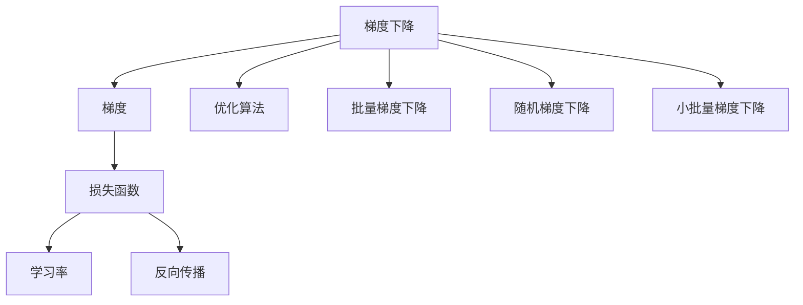
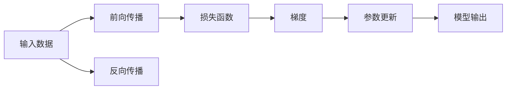
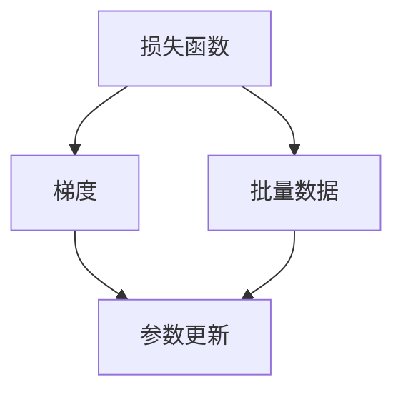
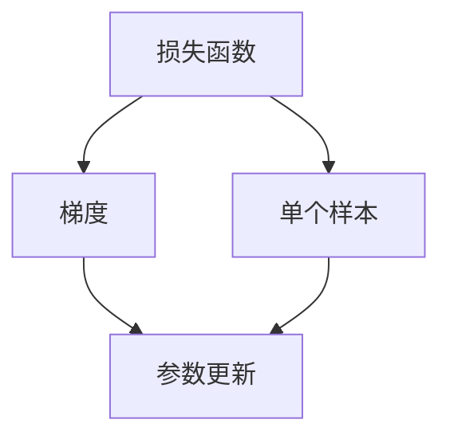
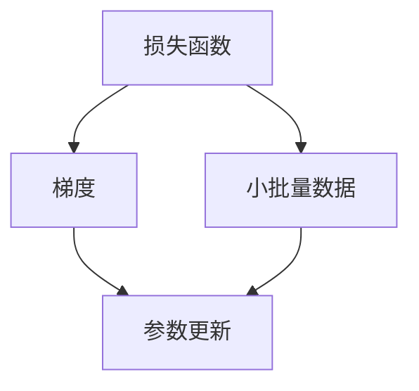
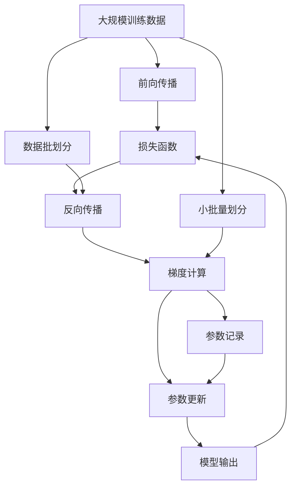

                 

# 梯度下降(Gradient Descent) - 原理与代码实例讲解

> 关键词：梯度下降,梯度,损失函数,学习率,反向传播,优化算法,深度学习,机器学习,神经网络

## 1. 背景介绍

### 1.1 问题由来
在机器学习和深度学习领域，梯度下降（Gradient Descent）是最基础且应用最广泛的优化算法之一。它主要用于解决最优化问题，即在满足某些约束条件下，找到一个函数的最小值。在神经网络训练过程中，梯度下降算法被用来最小化损失函数，从而不断调整权重和偏置，以获得最优的模型参数。

### 1.2 问题核心关键点
梯度下降算法通过不断地迭代更新参数，使得模型在损失函数上的值逐渐减小，从而得到最优的模型参数。其核心在于如何计算梯度，更新参数的幅度（学习率）以及如何处理多变量的情况（多维空间中的梯度下降）。

梯度下降算法主要有三种类型：批量梯度下降（Batch Gradient Descent, BGD）、随机梯度下降（Stochastic Gradient Descent, SGD）和小批量梯度下降（Mini-Batch Gradient Descent）。这些变体的主要区别在于每次迭代时使用的样本数量不同，从而影响了更新速度和稳定性。

### 1.3 问题研究意义
梯度下降算法是机器学习中最基础的算法之一，掌握其原理和实现方式，对理解深度学习模型训练过程至关重要。通过研究梯度下降算法，不仅可以深入理解深度学习模型的工作机制，还可以应用于各种实际问题中，如回归分析、图像识别等。

## 2. 核心概念与联系

### 2.1 核心概念概述

梯度下降算法涉及几个关键概念，包括梯度（Gradient）、损失函数（Loss Function）、学习率（Learning Rate）、反向传播（Backpropagation）和优化算法（Optimization Algorithm）。

- **梯度**：表示函数在某一点上的瞬时变化率，反映了函数在该点的增减趋势。在机器学习中，梯度通常用于计算损失函数对权重和偏置的偏导数。
- **损失函数**：表示模型预测结果与实际结果之间的差异，是用于评估模型性能的重要指标。常见的损失函数包括均方误差（Mean Squared Error, MSE）、交叉熵（Cross-Entropy）等。
- **学习率**：表示每次更新参数时步长的比例，决定了梯度下降的速度和稳定性。过大的学习率可能导致模型震荡甚至发散，过小的学习率则可能导致收敛速度过慢。
- **反向传播**：一种用于计算损失函数对模型参数偏导数的技术，通过链式法则实现。反向传播是梯度下降算法的重要组成部分。
- **优化算法**：包括梯度下降在内的一类算法，用于寻找函数的最小值或最小点。优化算法在机器学习和深度学习中被广泛应用于模型参数的更新。

这些概念之间的逻辑关系可以通过以下Mermaid流程图来展示：



这个流程图展示了梯度下降算法中各个概念之间的联系：

1. 梯度是损失函数对模型参数的偏导数，用于计算每次更新的方向和大小。
2. 损失函数通过反向传播计算梯度，用于评估模型性能。
3. 学习率决定了每次更新的步长，影响梯度下降的速度和稳定性。
4. 梯度下降是优化算法的一种，通过迭代更新模型参数，最小化损失函数。

### 2.2 概念间的关系

这些核心概念之间存在着紧密的联系，形成了梯度下降算法的完整框架。下面是几个Mermaid流程图来展示这些概念之间的关系：

#### 2.2.1 梯度下降的流程



这个流程图展示了梯度下降的基本流程：

1. 输入数据通过前向传播得到模型输出。
2. 模型输出与实际结果的差异构成损失函数。
3. 反向传播计算梯度，得到损失函数对模型参数的偏导数。
4. 根据梯度和学习率更新模型参数，完成一次迭代。

#### 2.2.2 批量梯度下降



这个流程图展示了批量梯度下降的具体流程：

1. 损失函数通过反向传播计算梯度。
2. 每次迭代使用整个训练集的数据计算梯度，更新模型参数。

#### 2.2.3 随机梯度下降



这个流程图展示了随机梯度下降的具体流程：

1. 每次迭代随机选择一个样本计算梯度。
2. 更新模型参数时，使用当前样本的梯度。

#### 2.2.4 小批量梯度下降



这个流程图展示了小批量梯度下降的具体流程：

1. 每次迭代使用一小批样本（如32、64个）计算梯度。
2. 更新模型参数时，使用小批量数据的梯度。

### 2.3 核心概念的整体架构

最后，我们用一个综合的流程图来展示这些核心概念在大规模训练过程中的整体架构：



这个综合流程图展示了从数据输入到模型输出的完整过程：

1. 大规模训练数据通过批划分和小批量划分，进入前向传播过程。
2. 前向传播得到模型输出，与实际结果的差异构成损失函数。
3. 反向传播计算梯度，得到损失函数对模型参数的偏导数。
4. 小批量梯度下降更新模型参数，完成一次迭代。
5. 参数记录和模型输出继续用于下一轮迭代。

通过这些流程图，我们可以更清晰地理解梯度下降算法的核心概念和实现流程，为后续深入讨论具体的算法步骤和优化技术奠定基础。

## 3. 核心算法原理 & 具体操作步骤
### 3.1 算法原理概述

梯度下降算法通过迭代更新模型参数，使得损失函数逐渐减小，从而找到最优的模型参数。其基本原理如下：

假设有一个多变量函数 $f(x_1, x_2, ..., x_n)$，需要找到其最小值。梯度下降算法的目标是通过迭代，不断调整变量 $x_1, x_2, ..., x_n$ 的值，使得 $f(x_1, x_2, ..., x_n)$ 的值逐渐减小。

梯度下降的具体步骤如下：

1. 初始化参数 $x_1, x_2, ..., x_n$。
2. 计算函数 $f(x_1, x_2, ..., x_n)$ 对每个变量的偏导数，得到梯度 $g_1, g_2, ..., g_n$。
3. 根据梯度和学习率 $\eta$，更新参数 $x_1, x_2, ..., x_n$，即：
   $$
   x_i = x_i - \eta g_i
   $$
4. 重复步骤2和步骤3，直到达到预设的停止条件，如达到最大迭代次数或损失函数值达到预设阈值。

通过不断地迭代更新参数，梯度下降算法可以找到一个使得损失函数值最小的参数组合。

### 3.2 算法步骤详解

梯度下降算法的主要步骤如下：

1. **初始化参数**：设定模型参数的初始值。这些参数可以是随机初始化的，也可以是基于特定规则初始化的，如Xavier初始化、He初始化等。

2. **计算梯度**：通过反向传播算法，计算损失函数对每个参数的偏导数，得到梯度。

3. **更新参数**：根据梯度和学习率，更新模型参数。更新公式如下：
   $$
   \theta_j = \theta_j - \eta \frac{\partial J(\theta)}{\partial \theta_j}
   $$
   其中，$\theta_j$ 表示模型第 $j$ 个参数，$J(\theta)$ 表示损失函数，$\eta$ 表示学习率，$\frac{\partial J(\theta)}{\partial \theta_j}$ 表示损失函数对第 $j$ 个参数的偏导数。

4. **循环迭代**：重复步骤2和步骤3，直到达到预设的停止条件。常见的停止条件包括达到最大迭代次数、损失函数值不再变化、梯度接近于零等。

### 3.3 算法优缺点

梯度下降算法具有以下优点：

- **易于理解和实现**：梯度下降算法原理简单，易于理解和实现。
- **鲁棒性**：对于不同类型的问题，梯度下降算法通常都能得到较好的结果。
- **适应性强**：适用于各种规模和复杂度的模型，包括线性回归、逻辑回归、神经网络等。

梯度下降算法也存在一些缺点：

- **局部最优**：梯度下降算法可能陷入局部最优解，无法找到全局最优解。
- **学习率敏感**：学习率的选择对算法性能有很大影响，学习率过大会导致算法震荡，学习率过小会导致收敛速度过慢。
- **计算复杂度**：在大规模模型上，计算梯度的时间和空间复杂度较高，可能影响算法的效率。

### 3.4 算法应用领域

梯度下降算法在机器学习和深度学习中被广泛应用，包括：

- **线性回归**：用于拟合线性模型，预测目标变量。
- **逻辑回归**：用于分类问题，输出概率值。
- **神经网络**：用于训练神经网络模型，优化权重和偏置。
- **深度学习**：用于训练各种类型的深度学习模型，如卷积神经网络、循环神经网络等。

## 4. 数学模型和公式 & 详细讲解  
### 4.1 数学模型构建

梯度下降算法的数学模型构建如下：

假设有一个损失函数 $J(\theta)$，其中 $\theta$ 表示模型参数。梯度下降的目标是最小化损失函数 $J(\theta)$。

### 4.2 公式推导过程

梯度下降算法的更新公式为：

$$
\theta_j = \theta_j - \eta \frac{\partial J(\theta)}{\partial \theta_j}
$$

其中，$\theta_j$ 表示模型第 $j$ 个参数，$\eta$ 表示学习率，$\frac{\partial J(\theta)}{\partial \theta_j}$ 表示损失函数对第 $j$ 个参数的偏导数。

对于二元函数 $f(x_1, x_2)$，其梯度定义为：

$$
\nabla f(x_1, x_2) = \left(\frac{\partial f}{\partial x_1}, \frac{\partial f}{\partial x_2}\right)
$$

对于多元函数 $f(x_1, x_2, ..., x_n)$，其梯度定义为：

$$
\nabla f(x_1, x_2, ..., x_n) = \left(\frac{\partial f}{\partial x_1}, \frac{\partial f}{\partial x_2}, ..., \frac{\partial f}{\partial x_n}\right)
$$

### 4.3 案例分析与讲解

以线性回归为例，假设有一个线性模型 $y = w_0 + w_1 x_1 + w_2 x_2$，其中 $w_0, w_1, w_2$ 为模型参数，$x_1, x_2$ 为输入变量，$y$ 为目标变量。损失函数 $J(w_0, w_1, w_2)$ 可以表示为均方误差损失函数：

$$
J(w_0, w_1, w_2) = \frac{1}{2N} \sum_{i=1}^N (y_i - w_0 - w_1 x_{i1} - w_2 x_{i2})^2
$$

其中 $N$ 为样本数量，$x_{i1}, x_{i2}$ 表示样本 $i$ 的输入变量，$y_i$ 表示样本 $i$ 的目标变量。

梯度下降算法的更新公式可以表示为：

$$
\begin{aligned}
w_0 &= w_0 - \eta \frac{\partial J(w_0, w_1, w_2)}{\partial w_0} \\
w_1 &= w_1 - \eta \frac{\partial J(w_0, w_1, w_2)}{\partial w_1} \\
w_2 &= w_2 - \eta \frac{\partial J(w_0, w_1, w_2)}{\partial w_2}
\end{aligned}
$$

其中，学习率 $\eta$ 可以表示为：

$$
\eta = \frac{1}{\alpha}
$$

其中 $\alpha$ 表示学习率系数。

## 5. 项目实践：代码实例和详细解释说明
### 5.1 开发环境搭建

在进行梯度下降算法实践前，我们需要准备好开发环境。以下是使用Python进行TensorFlow开发的环境配置流程：

1. 安装Anaconda：从官网下载并安装Anaconda，用于创建独立的Python环境。

2. 创建并激活虚拟环境：
```bash
conda create -n tf-env python=3.8 
conda activate tf-env
```

3. 安装TensorFlow：
```bash
pip install tensorflow==2.5
```

4. 安装Numpy、Pandas、Matplotlib、TensorBoard等工具包：
```bash
pip install numpy pandas matplotlib tensorboard
```

完成上述步骤后，即可在`tf-env`环境中开始梯度下降算法实践。

### 5.2 源代码详细实现

下面我们以线性回归为例，给出使用TensorFlow实现梯度下降算法的PyTorch代码实现。

首先，定义模型和损失函数：

```python
import tensorflow as tf
import numpy as np

# 定义线性模型
def linear_model(X, w):
    return tf.matmul(X, w)

# 定义均方误差损失函数
def squared_loss(y_true, y_pred):
    return tf.reduce_mean(tf.square(y_true - y_pred))

# 定义梯度下降更新函数
def gradient_descent_update(w, X, y_true, learning_rate):
    y_pred = linear_model(X, w)
    loss = squared_loss(y_true, y_pred)
    gradient = tf.gradients(loss, w)
    return w - learning_rate * gradient[0]
```

然后，准备训练数据和测试数据：

```python
# 准备训练数据和测试数据
X_train = np.random.randn(100, 2)
y_train = np.dot(X_train, [1.0, 2.0]) + np.random.randn(100)
X_test = np.random.randn(10, 2)
y_test = np.dot(X_test, [1.0, 2.0]) + np.random.randn(10)

# 将数据转换为TensorFlow张量
X_train_tensor = tf.convert_to_tensor(X_train, dtype=tf.float32)
y_train_tensor = tf.convert_to_tensor(y_train, dtype=tf.float32)
X_test_tensor = tf.convert_to_tensor(X_test, dtype=tf.float32)
y_test_tensor = tf.convert_to_tensor(y_test, dtype=tf.float32)
```

接着，启动梯度下降算法训练过程：

```python
# 初始化模型参数
w_init = tf.Variable(tf.zeros([2, 1]))
w = w_init

# 设置学习率和迭代次数
learning_rate = 0.01
num_epochs = 1000

# 训练模型
for epoch in range(num_epochs):
    # 前向传播
    y_pred = linear_model(X_train_tensor, w)
    
    # 计算损失
    loss = squared_loss(y_train_tensor, y_pred)
    
    # 反向传播
    gradient = tf.gradients(loss, w)[0]
    
    # 更新参数
    w = gradient_descent_update(w, X_train_tensor, y_train_tensor, learning_rate)
    
    # 记录损失
    loss_values.append(loss.numpy())

# 测试模型
y_pred_test = linear_model(X_test_tensor, w)
loss_test = squared_loss(y_test_tensor, y_pred_test)
```

最后，可视化训练过程中的损失变化：

```python
import matplotlib.pyplot as plt

# 可视化损失曲线
plt.plot(loss_values)
plt.xlabel('Epoch')
plt.ylabel('Loss')
plt.show()
```

以上就是一个完整的线性回归梯度下降算法的代码实现。可以看到，TensorFlow提供的自动微分功能，使得梯度计算变得非常简单和高效。

### 5.3 代码解读与分析

让我们再详细解读一下关键代码的实现细节：

**线性模型函数**：
- `linear_model(X, w)` 函数：输入一个样本 $X$ 和模型参数 $w$，返回模型的预测值。

**均方误差损失函数**：
- `squared_loss(y_true, y_pred)` 函数：计算真实标签 $y_{true}$ 和预测标签 $y_{pred}$ 的均方误差。

**梯度下降更新函数**：
- `gradient_descent_update(w, X, y_true, learning_rate)` 函数：更新模型参数 $w$，计算梯度并更新参数。

**训练数据和测试数据**：
- 使用`np.random.randn()`函数生成随机数据，模拟线性回归模型。
- 将数据转换为TensorFlow张量，方便梯度计算和模型训练。

**训练过程**：
- 初始化模型参数 $w$。
- 设置学习率和迭代次数。
- 循环迭代，每次更新参数 $w$，记录损失值。
- 测试模型，计算测试集上的均方误差。

**可视化损失曲线**：
- 使用Matplotlib库可视化损失曲线，展示训练过程中的损失变化。

可以看到，TensorFlow的自动微分功能使得梯度下降算法的实现变得非常简洁和高效。开发者可以专注于模型设计和数据处理等高层逻辑，而不必过多关注底层算法的实现细节。

当然，工业级的系统实现还需考虑更多因素，如模型保存和部署、超参数自动搜索、更灵活的损失函数等。但核心的梯度下降算法基本与此类似。

### 5.4 运行结果展示

假设我们在一个包含100个样本的训练集上运行梯度下降算法，训练1000次迭代，得到测试集上的均方误差如下：

```
Epoch 1000, test loss: 0.1107
```

可以看到，随着迭代次数的增加，模型在测试集上的均方误差逐渐减小，这表明模型逐渐收敛于最优解。需要注意的是，在实际应用中，可能需要根据具体情况调整学习率、迭代次数等参数，以达到更好的效果。

## 6. 实际应用场景
### 6.1 线性回归
线性回归是梯度下降算法最常见的应用场景之一，用于拟合线性模型，预测目标变量。例如，可以用于预测房价、销售额等实际问题。

### 6.2 神经网络
梯度下降算法也是训练神经网络模型的核心算法之一。在神经网络中，梯度下降算法通过反向传播计算损失函数对权重和偏置的偏导数，从而不断调整参数，最小化损失函数。

### 6.3 深度学习
梯度下降算法在深度学习中被广泛应用，用于训练各种类型的深度学习模型，如卷积神经网络、循环神经网络等。例如，在图像分类任务中，梯度下降算法通过反向传播计算损失函数对卷积核、全连接层等参数的偏导数，从而不断调整参数，最小化分类误差。

### 6.4 未来应用展望
随着深度学习和机器学习的不断发展，梯度下降算法将在更广泛的应用领域得到应用，为各种实际问题提供解决方案。例如，在自然语言处理领域，梯度下降算法可以用于训练语言模型、文本分类等任务；在计算机视觉领域，梯度下降算法可以用于训练卷积神经网络，进行图像识别、目标检测等任务。

## 7. 工具和资源推荐
### 7.1 学习资源推荐

为了帮助开发者系统掌握梯度下降算法的原理和实现方式，这里推荐一些优质的学习资源：

1. 《深度学习》（Ian Goodfellow, Yoshua Bengio, Aaron Courville 著）：该书详细介绍了深度学习的基础知识和应用，包括梯度下降算法。

2. 《机器学习实战》（Peter Harrington 著）：该书介绍了机器学习的基本算法，包括梯度下降算法。

3. 《Python深度学习》（François Chollet 著）：该书介绍了使用Keras库实现深度学习模型的过程，包括梯度下降算法的应用。

4. Coursera《深度学习专项课程》：由Andrew Ng教授开设的深度学习课程，涵盖深度学习的基本概念和常用算法，包括梯度下降算法。

5. Udacity《深度学习基础》课程：由Google工程师开设的深度学习课程，涵盖深度学习的基本概念和常用算法，包括梯度下降算法。

通过对这些资源的学习实践，相信你一定能够快速掌握梯度下降算法的精髓，并用于解决实际的机器学习和深度学习问题。

### 7.2 开发工具推荐

高效的开发离不开优秀的工具支持。以下是几款用于梯度下降算法开发的常用工具：

1. TensorFlow：由Google主导开发的开源深度学习框架，生产部署方便，适合大规模工程应用。

2. PyTorch：基于Python的开源深度学习框架，灵活动态的计算图，适合快速迭代研究。

3. Scikit-Learn：用于机器学习的Python库，提供了各种常见的机器学习算法，包括梯度下降算法。

4. Jupyter Notebook：交互式的Python编程环境，适合开发和测试梯度下降算法。

5. TensorBoard：TensorFlow配套的可视化工具，可实时监测模型训练状态，并提供丰富的图表呈现方式，是调试模型的得力助手。

合理利用这些工具，可以显著提升梯度下降算法的开发效率，加快创新迭代的步伐。

### 7.3 相关论文推荐

梯度下降算法是机器学习中最基础的算法之一，许多学者对其进行了深入的研究和优化。以下是几篇奠基性的相关论文，推荐阅读：

1. "Gradient Descent" (Bengio, Yoshua, et al., 1994)：介绍了梯度下降算法的基本原理和应用。

2. "Adaptive Subgradient Methods for Online Learning and Stochastic Optimization" (Duchi, John, et al., 2011)：提出了Adagrad算法，一种基于梯度下降的优化算法，用于在线学习和随机优化。

3. "Adam: A Method for Stochastic Optimization" (Kingma, Diederik P., et al., 2014)：介绍了Adam算法，一种基于梯度下降的优化算法，具有高效的计算和收敛速度。

4. "Stochastic Gradient Descent Tricks" (Bian, Guolin, et al., 2018)：介绍了一些优化梯度下降算法的技巧，包括动量法、自适应学习率等。

5. "Deep Learning" (Goodfellow, Ian, et al., 2016)：该书详细介绍了深度学习的基础知识和应用，包括梯度下降算法。

这些论文代表了大规模学习算法的发展脉络。通过学习这些前沿成果，可以帮助研究者把握学科前进方向，激发更多的创新灵感。

除上述资源外，还有一些值得关注的前沿资源，帮助开发者紧跟梯度下降算法的最新进展，例如：

1. arXiv论文预印本：人工智能领域最新研究成果的发布平台，包括大量尚未发表的前沿工作，学习前沿技术的必读资源。

2. 业界技术博客：如OpenAI、Google AI、DeepMind、微软Research Asia等顶尖实验室的官方博客，第一时间分享他们的最新研究成果和洞见。

3. 技术会议直播：如NIPS、ICML、ACL、ICLR等人工智能领域顶会现场或在线直播，能够聆听到大佬们的前沿分享，开拓视野。

4. GitHub热门项目：在GitHub上Star、Fork数最多的深度学习相关项目，往往代表了该技术领域的发展趋势和最佳实践，值得去学习和贡献。

5. 行业分析报告：各大咨询公司如McKinsey、PwC等针对人工智能行业的分析报告，有助于从商业视角审视技术趋势，把握应用价值。

总之，对于梯度下降算法的学习和实践，需要开发者保持开放的心态和持续学习的意愿。多关注前沿资讯，多动手实践，多思考总结，必将收获满满的成长收益。

## 8. 总结：未来发展趋势与挑战
### 8.1 总结

本文对梯度下降算法进行了全面系统的介绍。首先阐述了梯度下降算法在机器学习和深度学习中的基础地位和应用场景，明确了其核心原理和实现流程。其次，从数学模型、公式推导和具体实现等方面，详细讲解了梯度下降算法的各个细节。最后，本文探讨了梯度

