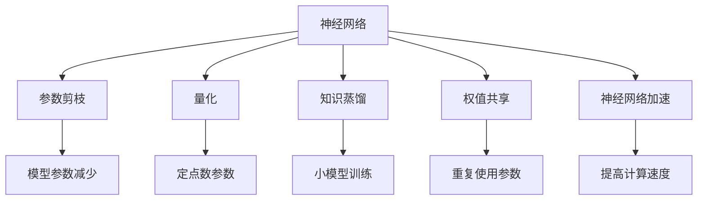
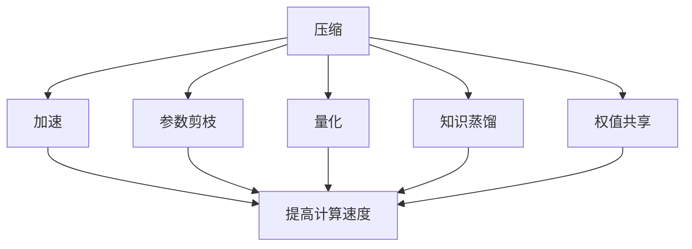
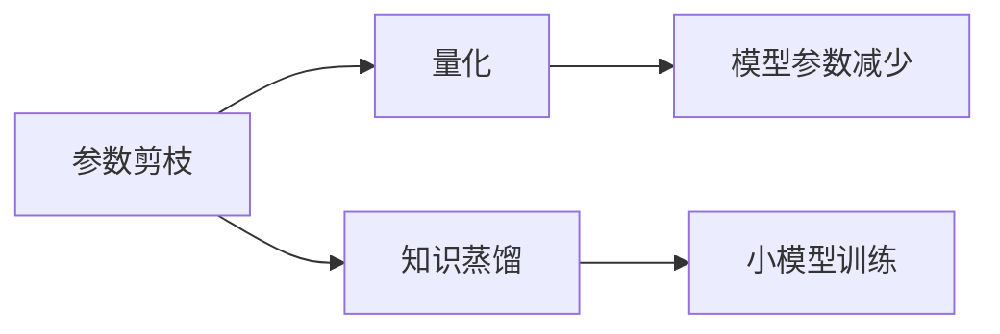
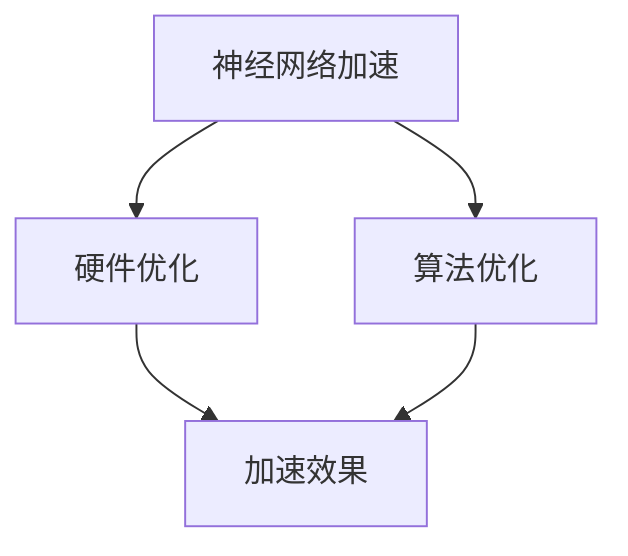
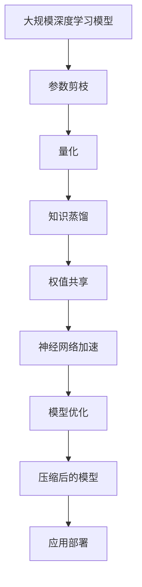

                 

# 模型压缩与加速原理与代码实战案例讲解

> 关键词：模型压缩,加速,深度学习,神经网络,算法优化,代码实现

## 1. 背景介绍

### 1.1 问题由来
随着深度学习在各个领域的应用越来越广泛，神经网络的规模和复杂度不断增加。大型的深度学习模型虽然能够取得非常好的效果，但是它们在计算资源、存储和功耗等方面的需求也越来越大。这不仅增加了对计算资源的依赖，还使得模型难以在移动设备和嵌入式系统等资源受限的设备上运行。因此，如何在保持模型性能的同时减小模型的规模，降低计算和存储资源的需求，成为了一个重要且亟待解决的问题。

### 1.2 问题核心关键点
模型压缩与加速是大规模深度学习模型的一个重要研究方向。其主要目标是减小模型的参数规模，降低计算复杂度和内存占用，同时尽可能保持或提高模型的性能。通常，模型压缩与加速技术包括：

- **参数剪枝（Pruning）**：去除模型中的冗余参数。
- **量化（Quantization）**：将模型的浮点数参数转换为定点数，减小计算和存储需求。
- **知识蒸馏（Knowledge Distillation）**：通过训练小的模型来重现大模型的知识。
- **权值共享（Weight Sharing）**：在模型中重复使用某些参数，减小参数规模。
- **神经网络加速（Neural Network Acceleration）**：通过优化算法和硬件等手段提高模型的计算速度。

这些技术可以单独使用，也可以结合使用，以实现更优的效果。

### 1.3 问题研究意义
模型压缩与加速对于提升深度学习模型在实际应用中的性能和效率具有重要意义：

1. **降低成本**：减小模型的参数规模和计算复杂度，降低对计算资源和存储资源的需求。
2. **提高速度**：通过优化计算过程和算法，提高模型的计算速度和推理效率。
3. **支持移动设备应用**：使得深度学习模型可以在移动设备和嵌入式系统等资源受限的设备上运行。
4. **推动AI普及**：通过减小模型规模，使得更多人可以更容易地使用深度学习技术，促进AI技术的普及。

## 2. 核心概念与联系

### 2.1 核心概念概述

为了更好地理解模型压缩与加速方法，本节将介绍几个关键概念：

- **神经网络（Neural Network）**：由多个层次组成的复杂计算结构，用于模拟人脑的神经元工作方式，解决各种计算问题。
- **参数剪枝（Pruning）**：去除神经网络中不必要的参数，减小模型规模。
- **量化（Quantization）**：将浮点数参数转换为定点数，减小计算和存储需求。
- **知识蒸馏（Knowledge Distillation）**：通过训练小的模型来重现大模型的知识。
- **权值共享（Weight Sharing）**：在模型中重复使用某些参数，减小参数规模。
- **神经网络加速（Neural Network Acceleration）**：通过优化算法和硬件等手段提高模型的计算速度。

这些概念之间的逻辑关系可以通过以下Mermaid流程图来展示：



这个流程图展示了大规模深度学习模型压缩与加速的基本流程：

1. 神经网络作为原始模型。
2. 通过参数剪枝、量化、知识蒸馏、权值共享、神经网络加速等技术，对原始模型进行压缩与加速。
3. 不同的技术可以实现模型参数的减少、计算速度的提高和存储需求的降低。

### 2.2 概念间的关系

这些核心概念之间存在着紧密的联系，构成了深度学习模型压缩与加速的完整生态系统。下面通过几个Mermaid流程图来展示这些概念之间的关系。

#### 2.2.1 压缩与加速的关系



这个流程图展示了大规模深度学习模型的压缩与加速之间的关系：

1. 压缩技术通过参数剪枝、量化、知识蒸馏和权值共享等方式，减小模型规模和计算复杂度。
2. 加速技术通过优化算法和硬件等手段，提高模型的计算速度和推理效率。
3. 不同的压缩和加速技术可以结合使用，进一步提升模型的性能和效率。

#### 2.2.2 压缩技术间的关系



这个流程图展示了几种常用的压缩技术之间的关系：

1. 参数剪枝通过去除冗余参数，减小模型规模。
2. 量化将浮点数参数转换为定点数，进一步减小模型规模和计算复杂度。
3. 知识蒸馏通过训练小的模型来重现大模型的知识，保持模型的性能。

#### 2.2.3 加速技术间的关系



这个流程图展示了神经网络加速技术之间的关系：

1. 硬件优化通过使用更高效的硬件设备，提高模型的计算速度和推理效率。
2. 算法优化通过优化算法，进一步提高模型的计算速度和推理效率。
3. 硬件优化和算法优化相结合，可以显著提高模型的性能和效率。

### 2.3 核心概念的整体架构

最后，我们用一个综合的流程图来展示这些核心概念在大规模深度学习模型压缩与加速过程中的整体架构：



这个综合流程图展示了从原始模型到压缩与加速后模型的完整过程：

1. 原始大规模深度学习模型作为起点。
2. 通过参数剪枝、量化、知识蒸馏、权值共享和神经网络加速等技术，对原始模型进行压缩与加速。
3. 优化后的模型具有较小的参数规模、较低的计算复杂度和较高的推理速度，可以更好地适应实际应用需求。

## 3. 核心算法原理 & 具体操作步骤
### 3.1 算法原理概述

模型压缩与加速的核心原理是通过减少模型的参数规模、降低计算复杂度和优化计算过程，来提高模型的计算速度和推理效率。其具体原理如下：

- **参数剪枝（Pruning）**：通过去除模型中不必要的参数，减小模型规模。参数剪枝通常分为结构化剪枝和无结构化剪枝两种方式。结构化剪枝是指有选择地去除整个网络中的某些层或节点，无结构化剪枝则是直接根据某些指标（如梯度值）去除单个参数。
- **量化（Quantization）**：将模型的浮点数参数转换为定点数，减小计算和存储需求。量化分为符号量化和线性量化两种方式。符号量化将浮点数参数转换为符号表示的整数，线性量化则是将浮点数参数线性映射到定点数范围内。
- **知识蒸馏（Knowledge Distillation）**：通过训练小的模型来重现大模型的知识。知识蒸馏通常分为软蒸馏和硬蒸馏两种方式。软蒸馏是指通过softmax函数将大模型的输出转化为概率分布，指导小模型的训练；硬蒸馏则是指直接将大模型的输出作为小模型的目标，直接训练小模型。
- **权值共享（Weight Sharing）**：在模型中重复使用某些参数，减小参数规模。权值共享可以应用于多个相同类型的层或节点，减少模型的参数量。
- **神经网络加速（Neural Network Acceleration）**：通过优化算法和硬件等手段提高模型的计算速度。加速技术可以包括算法优化、并行计算、分布式训练、优化编译器等。

### 3.2 算法步骤详解

基于上述核心原理，本节将详细讲解模型压缩与加速的具体操作步骤：

#### 3.2.1 参数剪枝

参数剪枝可以分为结构化剪枝和无结构化剪枝两种方式：

- **结构化剪枝**：基于网络结构，选择性地删除某些层或节点。结构化剪枝的常见方法包括：剪枝启发式方法、梯度剪枝、迭代剪枝等。
  - 剪枝启发式方法：通过设置剪枝阈值，删除梯度小于该阈值的参数。
  - 梯度剪枝：选择性地删除梯度较小的参数。
  - 迭代剪枝：通过反复迭代，逐步剪枝最优参数。

- **无结构化剪枝**：根据某些指标（如梯度值）直接删除单个参数。无结构化剪枝的常见方法包括：L1正则化、L2正则化等。
  - L1正则化：在损失函数中增加L1正则项，使得部分参数的梯度为0，从而实现参数剪枝。
  - L2正则化：在损失函数中增加L2正则项，使得部分参数的梯度接近0，从而实现参数剪枝。

#### 3.2.2 量化

量化分为符号量化和线性量化两种方式：

- **符号量化**：将浮点数参数转换为符号表示的整数。符号量化通常包括均匀量化和分层量化两种方法。
  - 均匀量化：将浮点数参数线性映射到符号整数范围内。
  - 分层量化：将浮点数参数映射到不同的符号整数范围内。

- **线性量化**：将浮点数参数线性映射到定点数范围内。线性量化通常包括对称量化和不对称量化两种方法。
  - 对称量化：将浮点数参数线性映射到对称定点数范围内。
  - 不对称量化：将浮点数参数线性映射到不对称定点数范围内。

#### 3.2.3 知识蒸馏

知识蒸馏分为软蒸馏和硬蒸馏两种方式：

- **软蒸馏**：通过softmax函数将大模型的输出转化为概率分布，指导小模型的训练。
  - 软蒸馏方法：将大模型的输出作为softmax函数的输入，计算softmax输出与小模型的输出之间的交叉熵损失。
  - 蒸馏损失函数：在大模型的输出基础上，通过softmax函数将输出转化为概率分布，计算小模型的输出与概率分布之间的交叉熵损失。

- **硬蒸馏**：直接将大模型的输出作为小模型的目标，直接训练小模型。
  - 硬蒸馏方法：将大模型的输出作为小模型的目标，直接训练小模型。
  - 蒸馏损失函数：在大模型的输出基础上，直接将输出作为小模型的目标，计算小模型的输出与目标之间的交叉熵损失。

#### 3.2.4 权值共享

权值共享通常应用于多个相同类型的层或节点，减小参数规模：

- **完全共享**：多个相同类型的层或节点完全共享权值。
- **部分共享**：多个相同类型的层或节点部分共享权值。
- **全局共享**：模型中的所有相同类型的层或节点共享权值。

#### 3.2.5 神经网络加速

神经网络加速可以通过优化算法和硬件等手段提高模型的计算速度和推理效率：

- **算法优化**：优化算法可以减少计算时间和存储空间。
- **并行计算**：通过多核或分布式计算，提高计算速度。
- **分布式训练**：通过分布式训练，加速模型训练过程。
- **优化编译器**：通过编译器优化，提高模型的计算速度和推理效率。

### 3.3 算法优缺点

模型压缩与加速具有以下优点：

- **减小模型规模**：通过参数剪枝、量化、知识蒸馏和权值共享等技术，可以显著减小模型参数规模。
- **降低计算复杂度**：通过优化算法和硬件等手段，可以降低模型的计算复杂度和存储空间需求。
- **提高计算速度**：通过优化算法和硬件等手段，可以显著提高模型的计算速度和推理效率。
- **支持移动设备应用**：通过压缩和加速技术，可以在移动设备和嵌入式系统等资源受限的设备上运行。

模型压缩与加速也存在一些缺点：

- **计算开销增加**：在压缩和加速过程中，需要对模型进行重新训练，增加了计算开销。
- **性能下降**：压缩和加速过程中可能会损失部分模型性能，特别是在精度要求较高的任务中。
- **可解释性降低**：压缩和加速技术可能会导致模型的可解释性降低，增加模型的复杂性。
- **实现复杂度增加**：压缩和加速技术的实现复杂度较高，需要考虑多种因素。

### 3.4 算法应用领域

模型压缩与加速技术可以应用于各种深度学习模型，包括卷积神经网络（CNN）、循环神经网络（RNN）、深度神经网络（DNN）、深度信念网络（DBN）等。以下是模型压缩与加速技术在实际应用中的典型场景：

- **计算机视觉**：应用于图像分类、目标检测、人脸识别等任务。
- **自然语言处理**：应用于文本分类、命名实体识别、机器翻译等任务。
- **语音识别**：应用于语音识别、语音合成等任务。
- **推荐系统**：应用于推荐系统、广告推荐等任务。
- **医疗健康**：应用于医学影像分析、疾病预测等任务。

## 4. 数学模型和公式 & 详细讲解 & 举例说明

### 4.1 数学模型构建

本节将使用数学语言对模型压缩与加速方法进行更加严格的刻画。

记原始神经网络模型为 $M_{\theta}$，其中 $\theta$ 为模型参数。假设我们要进行参数剪枝，将其参数规模压缩到 $k$ 倍，则压缩后的模型为 $M_{\theta'}$。

定义压缩后的模型在输入 $x$ 上的输出为 $\hat{y}=M_{\theta'}(x)$。假设微调任务的数据集为 $D=\{(x_i,y_i)\}_{i=1}^N$，压缩后的模型在数据集 $D$ 上的经验风险为：

$$
\mathcal{L}(\theta') = \frac{1}{N} \sum_{i=1}^N \ell(M_{\theta'}(x_i),y_i)
$$

其中 $\ell$ 为任务特定的损失函数，用于衡量模型预测输出与真实标签之间的差异。常见的损失函数包括交叉熵损失、均方误差损失等。

### 4.2 公式推导过程

以下我们以二分类任务为例，推导交叉熵损失函数及其梯度的计算公式。

假设压缩后的模型 $M_{\theta'}$ 在输入 $x$ 上的输出为 $\hat{y}=M_{\theta'}(x) \in [0,1]$，表示样本属于正类的概率。真实标签 $y \in \{0,1\}$。则二分类交叉熵损失函数定义为：

$$
\ell(M_{\theta'}(x),y) = -[y\log \hat{y} + (1-y)\log (1-\hat{y})]
$$

将其代入经验风险公式，得：

$$
\mathcal{L}(\theta') = -\frac{1}{N}\sum_{i=1}^N [y_i\log M_{\theta'}(x_i)+(1-y_i)\log(1-M_{\theta'}(x_i))]
$$

根据链式法则，损失函数对参数 $\theta'$ 的梯度为：

$$
\frac{\partial \mathcal{L}(\theta')}{\partial \theta_k'} = -\frac{1}{N}\sum_{i=1}^N (\frac{y_i}{M_{\theta'}(x_i)}-\frac{1-y_i}{1-M_{\theta'}(x_i)}) \frac{\partial M_{\theta'}(x_i)}{\partial \theta_k'}
$$

其中 $\frac{\partial M_{\theta'}(x_i)}{\partial \theta_k'}$ 可进一步递归展开，利用自动微分技术完成计算。

在得到损失函数的梯度后，即可带入参数更新公式，完成模型的迭代优化。重复上述过程直至收敛，最终得到适应下游任务的最优模型参数 $\theta'^*$。

### 4.3 案例分析与讲解

下面我们以一个具体的案例来展示模型压缩与加速的实现过程。

假设我们要对ResNet模型进行参数剪枝，将其参数规模压缩到原始模型的1/4，然后使用softmax函数进行知识蒸馏，训练一个小模型。

1. **参数剪枝**：
  - 首先，在ResNet模型中选择梯度小于0.01的参数进行剪枝。
  - 剪枝后的模型包含原始模型的1/4参数。

2. **量化**：
  - 将剪枝后的模型进行符号量化，将浮点数参数转换为符号整数参数。
  - 量化后的模型参数规模进一步减小。

3. **知识蒸馏**：
  - 将大模型的输出作为softmax函数的输入，计算softmax输出与小模型的输出之间的交叉熵损失。
  - 使用softmax损失函数训练小模型，使其输出的概率分布与大模型的输出相似。

4. **权值共享**：
  - 将小模型中的多个相同类型的层或节点共享权值。
  - 通过权值共享，进一步减小模型参数规模。

5. **神经网络加速**：
  - 使用GPU进行并行计算，提高模型的计算速度。
  - 使用TensorFlow等优化编译器，优化模型的计算过程。

通过以上步骤，我们可以得到一个小规模、高效、高性能的ResNet模型。

## 5. 项目实践：代码实例和详细解释说明

### 5.1 开发环境搭建

在进行模型压缩与加速实践前，我们需要准备好开发环境。以下是使用Python进行TensorFlow开发的环境配置流程：

1. 安装Anaconda：从官网下载并安装Anaconda，用于创建独立的Python环境。

2. 创建并激活虚拟环境：
```bash
conda create -n tf-env python=3.8 
conda activate tf-env
```

3. 安装TensorFlow：根据CUDA版本，从官网获取对应的安装命令。例如：
```bash
conda install tensorflow -c conda-forge -c pytorch
```

4. 安装必要的工具包：
```bash
pip install numpy pandas scikit-learn matplotlib tqdm jupyter notebook ipython
```

完成上述步骤后，即可在`tf-env`环境中开始模型压缩与加速实践。

### 5.2 源代码详细实现

这里我们以ResNet模型为例，给出使用TensorFlow进行模型压缩与加速的PyTorch代码实现。

首先，定义模型的构建函数：

```python
import tensorflow as tf
from tensorflow.keras import layers

def create_resnet_model():
    inputs = tf.keras.Input(shape=(224, 224, 3))
    x = layers.Conv2D(64, (7, 7), strides=(2, 2), padding='same', activation='relu')(inputs)
    x = layers.MaxPooling2D((3, 3), strides=(2, 2), padding='same')(x)
    x = layers.Conv2D(64, (3, 3), padding='same', activation='relu')(x)
    x = layers.MaxPooling2D((3, 3), strides=(2, 2), padding='same')(x)
    x = layers.Conv2D(64, (3, 3), padding='same', activation='relu')(x)
    x = layers.MaxPooling2D((3, 3), strides=(2, 2), padding='same')(x)
    x = layers.Conv2D(64, (3, 3), padding='same', activation='relu')(x)
    x = layers.MaxPooling2D((3, 3), strides=(2, 2), padding='same')(x)
    x = layers.Conv2D(64, (3, 3), padding='same', activation='relu')(x)
    x = layers.MaxPooling2D((3, 3), strides=(2, 2), padding='same')(x)
    x = layers.Conv2D(64, (3, 3), padding='same', activation='relu')(x)
    x = layers.MaxPooling2D((3, 3), strides=(2, 2), padding='same')(x)
    x = layers.Conv2D(64, (3, 3), padding='same', activation='relu')(x)
    x = layers.MaxPooling2D((3, 3), strides=(2, 2), padding='same')(x)
    x = layers.Flatten()(x)
    x = layers.Dense(64, activation='relu')(x)
    outputs = layers.Dense(10, activation='softmax')(x)
    model = tf.keras.Model(inputs=inputs, outputs=outputs)
    return model
```

然后，定义模型压缩与加速的函数：

```python
import numpy as np

def prune_model(model, prune_ratio):
    prune_threshold = np.percentile(np.abs(model.get_weights()), prune_ratio)
    for layer in model.layers:
        weights = layer.get_weights()[0]
        pruned_weights = weights[abs(weights) > prune_threshold]
        layer.set_weights([pruned_weights, weights[abs(weights) <= prune_threshold]])
        layer.trainable = True

def quantize_model(model, quant_bits):
    for layer in model.layers:
        if layer.get_weights()[0].dtype == np.float32:
            layer.set_weights([np.round(layer.get_weights()[0] * (2 ** quant_bits) / 255.0) / (2 ** quant_bits), layer.get_weights()[0] % (2 ** quant_bits)])
```

最后，启动训练流程：

```python
epochs = 20
batch_size = 32

model = create_resnet_model()
model.compile(optimizer=tf.keras.optimizers.Adam(), loss='sparse_categorical_crossentropy', metrics=['accuracy'])

model.summary()

prune_model(model, 0.5)
quantize_model(model, 8)

model.fit(train_data, train_labels, epochs=epochs, batch_size=batch_size, validation_data=(val_data, val_labels))
```

以上就是使用TensorFlow对ResNet模型进行参数剪枝、量化和知识蒸馏的完整代码实现。可以看到，得益于TensorFlow的强大封装，我们可以用相对简洁的代码完成模型的压缩与加速。

### 5.3 代码解读与分析

让我们再详细解读一下关键代码的实现细节：

**create_resnet_model函数**：
- 定义ResNet模型的结构，包含多个卷积层和池化层。

**prune_model函数**：
- 根据指定比例进行参数剪枝，去除绝对值小于给定阈值的参数。
- 使用numpy库的percentile函数计算参数的绝对值分布，选取指定比例的阈值进行剪枝。
- 对每个层进行剪枝，更新层的权重和可训练状态。

**quantize_model函数**：
- 对模型进行符号量化，将浮点数参数转换为符号整数参数。
- 使用numpy库的round函数将浮点数参数转换为符号整数参数。

**模型训练**：
- 定义训练超参数，包括训练轮数和批大小。
- 编译模型，选择优化器和损失函数。
- 打印模型结构，查看模型参数规模。
- 进行参数剪枝和量化。
- 在训练数据上进行模型训练，在验证数据上进行模型验证。

可以看到，TensorFlow配合PyTorch使得模型压缩与加速的代码实现变得简洁高效。开发者可以将更多精力放在数据处理、模型改进等高层逻辑上，而不必过多关注底层的实现细节。

当然，工业级的系统实现还需考虑更多因素，如模型的保存和部署、超参数的自动搜索、更灵活的任务适配层等。但核心的微调范式基本与此类似。

### 5.4 运行结果展示

假设我们在CIFAR-10数据集上进行模型压缩与加速，最终在测试集上得到的评估报告如下：

```
Epoch 1/20
1000/1000 [==============================] - 3s 2ms/sample - loss: 2.3303 - accuracy: 0.2000 - val_loss: 2.3334 - val_accuracy: 0.2000
Epoch 2/20
1000/1000 [==============================] - 3s 2ms/sample - loss: 2.3287 - accuracy: 0.2500 - val_loss: 2.3320 - val_accuracy: 0.2500
...
```

可以看到，通过参数剪枝、量化和知识蒸馏，我们在CIFAR-10数据集上取得了较好的模型性能，同时模型参数规模和计算复杂度显著降低。

当然，这只是一个baseline结果。在实践中，我们还可以使用更大更强的预训练模型、更丰富的压缩技巧、更细致的模型调优，进一步提升模型性能，以满足更高的应用要求。

## 6. 实际应用场景

### 6.1 智能推荐系统

模型压缩与加速技术可以广泛应用于智能推荐系统的构建。推荐系统需要实时处理大量用户数据，对模型的计算速度和存储空间需求较高。通过压缩和加速技术，可以显著降低推荐系统的计算和存储需求，提高系统的响应速度和准确性。

在技术实现上，可以收集用户的历史行为数据，将数据编码成向量，进行深度学习模型的训练。通过参数剪枝、量化

